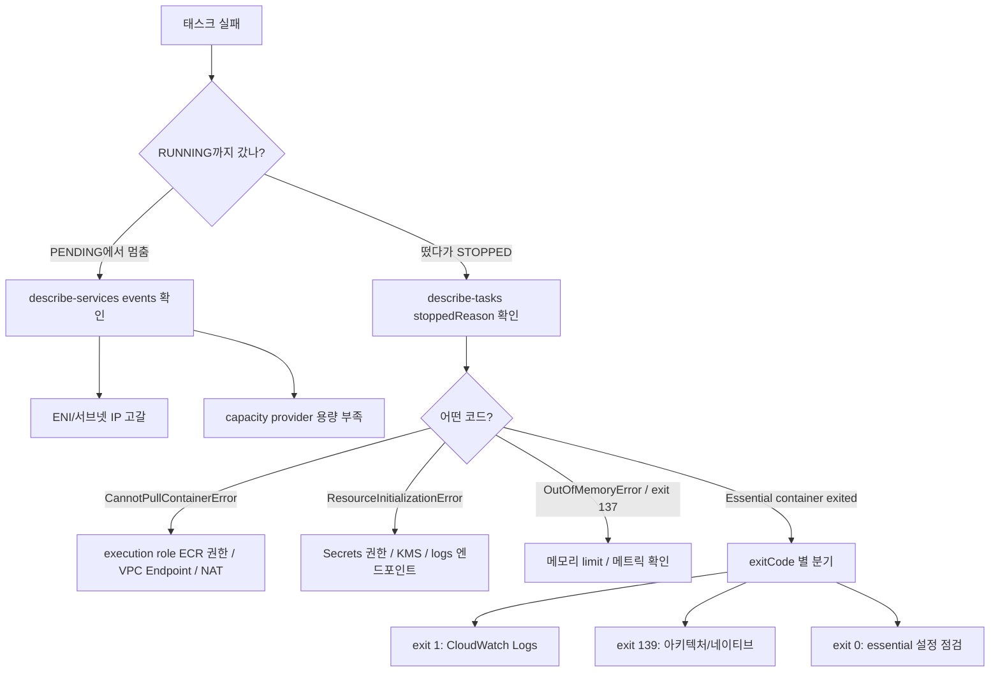

# ECS 태스크가 안 뜨거나 죽을 때

ECS에서 태스크가 RUNNING으로 안 가거나 떴다가 죽으면, 콘솔에서 보이는 건 "Stopped" 빨간 글씨 하나뿐이다. 왜 죽었는지는 `stoppedReason` 필드에 들어있는데, 이 값은 콘솔 태스크 상세 화면 맨 위 또는 `describe-tasks` 출력에서만 제대로 보인다. 서비스 이벤트 탭만 봐서는 "task failed to start" 같은 두루뭉술한 메시지밖에 안 나와서 원인을 못 잡는 경우가 많다.

여기서는 실제로 자주 만나는 stoppedReason 코드별로 원인과 확인 순서를 정리한다. 코드 문자열을 그대로 외워두면 콘솔에서 보자마자 어디를 봐야 할지 바로 안다.

## 먼저 봐야 할 곳

태스크가 죽었을 때 정보가 흩어져 있다. 순서대로 본다.

1. `describe-tasks` 의 `stoppedReason`, `containers[].reason`, `containers[].exitCode` — 죽은 직접 원인
2. 서비스의 `events` — 태스크가 아예 안 뜬 경우(PENDING에서 멈춤, 자리 못 잡음)
3. CloudWatch Logs — 컨테이너가 떴다가 애플리케이션 레벨에서 죽은 경우

중요한 건 stoppedReason과 exitCode를 같이 봐야 한다는 점이다. stoppedReason이 `Essential container in task exited`면 죽은 이유가 컨테이너 내부에 있다는 뜻이고, exitCode를 봐야 한다. 반대로 `CannotPullContainerError` 같은 건 컨테이너가 아예 시작도 못 한 거라 로그가 없다.

```bash
# 멈춘 태스크 목록 (최근 죽은 것 포함)
aws ecs list-tasks \
  --cluster my-cluster \
  --desired-status STOPPED \
  --query 'taskArns'

# 특정 태스크의 죽은 이유
aws ecs describe-tasks \
  --cluster my-cluster \
  --tasks arn:aws:ecs:ap-northeast-2:111122223333:task/my-cluster/abc123 \
  --query 'tasks[0].{stopped:stoppedReason, code:stopCode, containers:containers[].{name:name, reason:reason, exit:exitCode}}'
```

`stopCode`도 같이 보면 분류가 빠르다. `TaskFailedToStart`면 인프라/권한 문제, `EssentialContainerExited`면 컨테이너 내부 문제, `UserInitiated`면 사람이 죽인 거라 디버깅 대상이 아니다.

STOPPED 태스크는 Fargate 기준 보통 1시간 정도 지나면 `describe-tasks`로 조회가 안 된다. 죽은 직후에 봐야 한다. 운영 환경이면 EventBridge로 태스크 상태 변경 이벤트를 받아서 따로 저장해두는 게 낫다.

## CannotPullContainerError

가장 흔하다. 컨테이너 이미지를 못 가져왔다는 뜻이고, 컨테이너가 시작도 안 했으므로 로그가 없다. stoppedReason 뒤에 붙는 세부 메시지로 원인이 갈린다.

### 권한 문제

```
CannotPullContainerError: pull access denied for 111122223333.dkr.ecr.ap-northeast-2.amazonaws.com/my-app,
repository does not exist or may require 'docker login'
```

execution role에 ECR 권한이 없다. 헷갈리는 부분이 ECR 권한은 task role이 아니라 **execution role**에 있어야 한다는 점이다. task role은 컨테이너 안에서 돌아가는 애플리케이션이 쓰는 권한이고, 이미지를 당겨오는 주체는 ECS 에이전트라서 execution role을 본다.

```json
{
  "Effect": "Allow",
  "Action": [
    "ecr:GetAuthorizationToken",
    "ecr:BatchCheckLayerAvailability",
    "ecr:GetDownloadUrlForLayer",
    "ecr:BatchGetImage"
  ],
  "Resource": "*"
}
```

`ecr:GetAuthorizationToken`만 빠져도 안 된다. 이건 Resource가 `*`여야 한다(토큰 발급은 리포지토리 단위가 아니다). 나머지는 특정 리포지토리 ARN으로 좁혀도 된다.

크로스 계정 ECR을 쓰는 경우라면 리포지토리 정책(resource policy)에도 당겨오는 쪽 계정을 허용해줘야 한다. execution role 권한만 손보고 리포지토리 정책을 안 건드려서 막히는 경우가 있다.

### 네트워크 문제 (VPC Endpoint / NAT 누락)

```
CannotPullContainerError: ... dial tcp 52.x.x.x:443: i/o timeout
```

권한 메시지가 아니라 timeout이면 네트워크 문제다. Fargate 태스크가 ECR에 도달을 못 하는 거다. 프라이빗 서브넷에 태스크를 띄웠는데:

- NAT Gateway가 없거나
- ECR용 VPC Endpoint를 안 만들었거나

둘 중 하나도 없으면 못 당겨온다. ECR을 VPC Endpoint로 쓸 거면 엔드포인트가 세 개 필요하다. 하나라도 빠지면 timeout이다.

- `com.amazonaws.<region>.ecr.api` (인터페이스)
- `com.amazonaws.<region>.ecr.dkr` (인터페이스)
- `com.amazonaws.<region>.s3` (게이트웨이) — 이미지 레이어가 실제로 S3에 있어서 이게 빠지면 메타데이터는 받는데 레이어를 못 당긴다

S3 게이트웨이 엔드포인트를 빼먹는 실수가 잦다. ecr.api와 ecr.dkr만 만들고 "엔드포인트 다 만들었는데 왜 안 되냐"고 막히는 게 거의 이 케이스다.

인터페이스 엔드포인트는 보안 그룹이 붙는다. 태스크 ENI의 보안 그룹에서 나가는 443, 엔드포인트 보안 그룹에서 들어오는 443이 열려있어야 한다. 엔드포인트 보안 그룹이 기본값(아무것도 허용 안 함)인 채로 두면 똑같이 timeout이다.

CloudWatch Logs로 로그를 보내는 설정(awslogs)이라면 `com.amazonaws.<region>.logs` 엔드포인트도 있어야 한다. 이게 없으면 이미지는 당겨오는데 로그 드라이버 초기화에서 따로 막힌다(아래 ResourceInitializationError로 넘어간다).

## ResourceInitializationError

컨테이너를 띄우기 전 단계에서 ECS 에이전트가 준비 작업에 실패한 거다. Secrets 주입, 로그 드라이버, 볼륨 마운트 같은 게 여기 걸린다.

### Secrets / 파라미터 못 가져옴

```
ResourceInitializationError: unable to pull secrets or registry auth:
execution resource retrieval failed: unable to retrieve secret from asm:
... AccessDeniedException
```

태스크 정의의 `secrets` 항목으로 Secrets Manager나 SSM Parameter Store 값을 주입하는데 execution role에 권한이 없는 경우다. 이것도 task role이 아니라 execution role이다.

```json
{
  "Effect": "Allow",
  "Action": [
    "secretsmanager:GetSecretValue",
    "ssm:GetParameters",
    "kms:Decrypt"
  ],
  "Resource": [
    "arn:aws:secretsmanager:ap-northeast-2:111122223333:secret:my-app/*",
    "arn:aws:ssm:ap-northeast-2:111122223333:parameter/my-app/*",
    "arn:aws:kms:ap-northeast-2:111122223333:key/xxxx"
  ]
}
```

`kms:Decrypt`를 빠뜨리는 경우가 많다. Secrets Manager 시크릿이나 SSM SecureString을 고객 관리형 KMS 키로 암호화했으면 그 키에 대한 Decrypt 권한이 있어야 한다. 기본 AWS 관리형 키면 보통 자동으로 되지만, 직접 만든 KMS 키를 썼으면 key policy에서도 execution role을 허용해야 한다.

Secrets Manager도 프라이빗 서브넷이면 VPC Endpoint(`com.amazonaws.<region>.secretsmanager`)나 NAT가 있어야 도달한다. AccessDenied가 아니라 timeout 계열 메시지면 권한이 아니라 네트워크다.

또 흔한 실수가 `valueFrom`에 적은 ARN과 실제 시크릿 ARN이 안 맞는 경우다. Secrets Manager는 ARN 끝에 6자리 랜덤 suffix가 붙는다. suffix 없이 적으면 특정 버전 키를 지정하지 않는 한 못 찾기도 한다. 시크릿 안의 특정 JSON 키를 뽑을 때는 `arn:...:secret:my-app-AbCdEf:DB_PASSWORD::` 형식으로 적어야 한다.

### 로그 드라이버 초기화 실패

```
ResourceInitializationError: failed to initialize logging driver:
... dial tcp: lookup logs.ap-northeast-2.amazonaws.com: i/o timeout
```

awslogs 드라이버가 CloudWatch Logs에 연결을 못 한 거다. 위에서 말한 logs VPC Endpoint나 NAT가 없는 경우다. 이건 이미지는 멀쩡히 당겨왔는데 로그를 못 보내서 죽는 거라 헷갈린다. 메시지에 `logs.` 도메인이 나오면 로그 엔드포인트 문제다.

## OutOfMemoryError (OOMKilled)

```
OutOfMemoryError: Container killed due to memory usage
```

컨테이너가 할당된 메모리 hard limit을 넘어서 커널이 죽인 거다. exitCode는 137로 찍힌다(SIGKILL = 128 + 9). 떴다가 죽는 패턴이고, 부하가 올라가면 죽는다.

태스크 정의 메모리 설정이 두 가지라 헷갈린다.

- 태스크 레벨 `memory`: 태스크 전체에 주는 총량 (Fargate는 필수)
- 컨테이너 레벨 `memory`: 그 컨테이너의 hard limit. 넘으면 OOMKilled
- 컨테이너 레벨 `memoryReservation`: soft limit. 평소 보장량이고 넘어도 안 죽음(여유 있으면 더 씀)

컨테이너 `memory`를 너무 빡빡하게 잡으면 잠깐 튀는 순간에 죽는다. JVM처럼 힙 밖에서도 메모리를 쓰는 런타임은 컨테이너 limit을 힙 최대치(`-Xmx`)보다 넉넉히 잡아야 한다. `-Xmx`를 컨테이너 limit과 똑같이 잡으면 메타스페이스, 스레드 스택, 다이렉트 버퍼 때문에 limit을 넘겨서 OOMKilled 난다. 보통 limit의 70~75% 정도를 힙으로 준다.

자바라면 `-XX:MaxRAMPercentage=75.0`으로 비율 지정하는 게 컨테이너 환경에서는 더 안전하다. 컨테이너 메모리를 늘려도 비율 따라 같이 올라간다.

확인은 Container Insights나 CloudWatch의 `MemoryUtilization` 메트릭을 본다. 죽기 직전에 100% 찍혔으면 OOM이 맞다. 메트릭 없이도 exitCode 137 + stoppedReason의 OutOfMemoryError 조합이면 확정이다.

주의할 게 하나 있다. exitCode 137이 항상 OOM은 아니다. 137은 SIGKILL을 받았다는 뜻이고, OOM 외에도 ECS가 stopTimeout 지나서 강제로 죽일 때도 137이 나온다. graceful shutdown이 stopTimeout 안에 안 끝나면 SIGKILL이라 137이다. 이때는 stoppedReason에 OutOfMemoryError가 없다. 메모리 메트릭이 멀쩡한데 137이면 종료 처리(SIGTERM 핸들링)를 의심한다.

## exit code 해석

stoppedReason이 `Essential container in task exited`면 exitCode를 봐야 원인을 안다.

| exitCode | 의미 | 자주 보는 원인 |
|---|---|---|
| 0 | 정상 종료 | 배치성 컨테이너가 일 끝내고 정상 종료. essential이면 이것도 태스크를 멈춘다 |
| 1 | 애플리케이션 에러 | 앱이 예외로 죽음. CloudWatch Logs 봐야 함 |
| 137 | SIGKILL(128+9) | OOMKilled 또는 stopTimeout 초과 강제 종료 |
| 139 | SIGSEGV(128+11) | 세그폴트. 네이티브 라이브러리 충돌, 메모리 깨짐 |
| 143 | SIGTERM(128+15) | 정상 종료 신호 받고 종료. 배포 중 태스크 교체 때 정상 |

139가 나오면 애플리케이션 코드보다 그 아래 레이어를 의심한다. C 확장 모듈, 잘못된 베이스 이미지(아키텍처 불일치 — arm64 이미지를 x86 Fargate에 올린 경우), 네이티브 라이브러리 버전 충돌 같은 거다. 로컬에서는 멀쩡한데 Fargate에서만 139면 아키텍처 확인부터 한다. `docker buildx`로 멀티 아키텍처 빌드를 했는데 매니페스트가 꼬였거나, M1 맥에서 빌드한 arm64 이미지를 x86 태스크 정의에 그대로 올린 경우가 흔하다.

0번도 함정이다. essential 컨테이너는 정상 종료(exit 0)해도 태스크 전체가 멈춘다. 웹 서버가 죽은 게 아니라 사이드카나 init 성격의 컨테이너를 essential로 둬서 그게 할 일 끝내고 0으로 빠지면 태스크가 같이 내려간다. 짧게 끝나는 컨테이너는 `essential: false`로 두거나 컨테이너 의존(dependsOn)으로 묶어야 한다.

## 태스크가 PENDING에서 안 넘어갈 때

위 케이스들은 태스크가 떴다가 죽는 거고, 이건 아예 PROVISIONING/PENDING에서 RUNNING으로 못 가는 경우다. stoppedReason이 아니라 **서비스 이벤트**를 봐야 한다.

```bash
aws ecs describe-services \
  --cluster my-cluster \
  --services my-service \
  --query 'services[0].events[0:10].[createdAt, message]' \
  --output text
```

### ENI 부족 / 서브넷 IP 고갈

awsvpc 네트워크 모드(Fargate는 강제)는 태스크마다 ENI를 하나씩 붙인다. ENI는 서브넷에서 사설 IP를 하나 먹는다.

```
service my-service was unable to place a task because no container instance
met all of its requirements. The closest matching ... has insufficient ENI ...
```

또는 서브넷 IP가 다 떨어지면 태스크가 IP를 못 받아서 안 뜬다. `/24` 서브넷(IP 약 251개)에 태스크를 수백 개 띄우려다 막히는 경우다. 오토스케일링으로 태스크가 늘어나는 시간대에만 간헐적으로 실패하면 IP 고갈을 의심한다. 서브넷을 더 넓게(`/22` 등) 잡거나, 여러 AZ 서브넷에 분산한다.

EC2 launch type이면 인스턴스 타입별 ENI 상한도 걸린다. 작은 인스턴스는 ENI를 몇 개밖에 못 붙여서 태스크 밀도가 안 나온다. ENI 트렁킹을 켜면 상한이 올라간다.

### Capacity Provider 용량 부족

Fargate Spot이나 EC2 Auto Scaling 기반 capacity provider를 쓰는데 자리가 없는 경우다.

```
service my-service was unable to place a task because no container instance met
all of its requirements.
```

EC2 기반이면 ASG가 인스턴스를 못 띄우거나(서브넷 IP, 인스턴스 한도, 스팟 용량), managed scaling이 아직 인스턴스를 안 늘린 거다. capacity provider의 target capacity가 100%면 여유 인스턴스가 없어서 새 태스크가 기존 인스턴스 빌 때까지 PENDING으로 대기한다. 90% 정도로 낮춰서 여유분을 둔다.

Fargate Spot은 스팟 용량 자체가 없으면 태스크가 안 뜬다. 이때는 일반 Fargate를 base로 깔고 Spot을 weight로 얹는 식으로 capacity provider strategy를 섞어야 한다.

### CPU/메모리 조합이 Fargate에서 안 맞음

Fargate는 CPU/메모리 조합이 정해져 있다. 0.25 vCPU에 4GB 같은 조합은 없다. 태스크 정의에 허용 안 되는 조합을 넣으면 등록은 되는데 실행에서 막히기도 한다. 조합표를 벗어났는지 먼저 확인한다.

## 디버깅 순서 정리

실제로 막혔을 때 도는 순서다.

1. 콘솔 또는 `describe-tasks`로 stoppedReason / stopCode / exitCode를 먼저 본다. 여기서 80%는 갈린다.
2. stoppedReason이 `CannotPull...` / `ResourceInitialization...`이면 컨테이너가 안 뜬 거다. 권한(execution role)과 네트워크(엔드포인트/NAT)를 본다. 로그는 없다.
3. stoppedReason이 `Essential container ... exited`면 exitCode를 본다. 137이면 메모리 메트릭, 1이면 CloudWatch Logs, 139면 아키텍처/네이티브.
4. 태스크가 아예 STOPPED로 안 가고 PENDING에서 도는 거면 `describe-services`의 events를 본다. ENI/IP/용량 문제다.
5. 로그가 있어야 하는데 없으면 로그 드라이버 자체가 초기화 실패했을 수 있다(logs 엔드포인트). awslogs 설정과 로그 그룹 존재 여부를 확인한다.



CloudWatch Logs를 볼 때는 로그 그룹 이름이 태스크 정의의 `awslogs-group`과 같은지, 스트림 prefix가 맞는지부터 확인한다. 로그 그룹을 미리 안 만들어두고 `awslogs-create-group: true`도 안 줬으면 그룹이 없어서 로그가 안 쌓인다. 컨테이너는 멀쩡히 도는데 로그만 안 보이는 경우의 절반은 이거다.

마지막으로, 같은 증상이 반복되면 EventBridge 규칙으로 ECS Task State Change 이벤트를 받아 Lambda나 SNS로 stoppedReason을 알림으로 빼두면 죽은 직후 1시간 지나서 조회 안 되는 문제를 피할 수 있다. 운영에서는 이걸 깔아두는 편이 디버깅이 빠르다.
