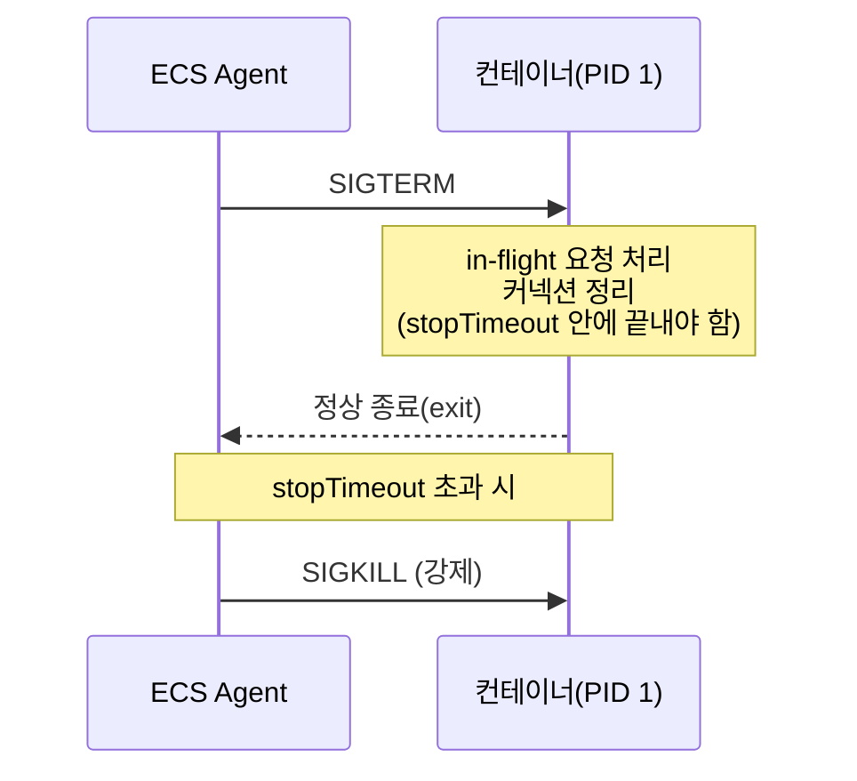
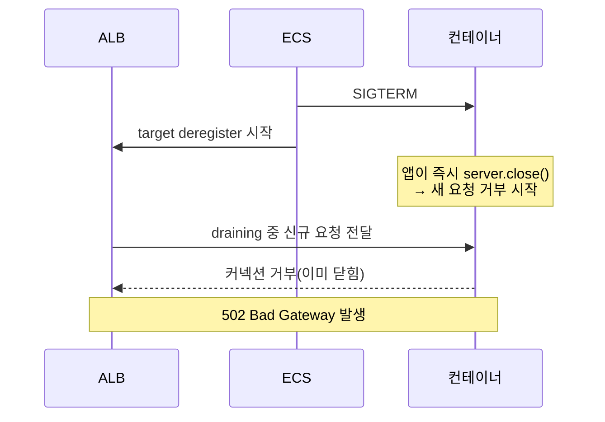

# ECS Task Graceful Shutdown

배포 한 번 할 때마다 502가 몇 건씩 찍히고, scale-in이 돌면 DB 커넥션이 슬슬 쌓이거나 SQS 메시지가 두 번 처리되는 일이 있다. 대부분은 Task가 죽을 때 컨테이너가 떠나는 순서와 ALB가 트래픽을 끊는 순서가 안 맞아서 생긴다. ECS Task 종료는 단순히 컨테이너를 kill하는 게 아니라 SIGTERM부터 SIGKILL까지 정해진 흐름이 있고, 그 흐름과 ALB deregistration, 애플리케이션의 종료 처리가 톱니처럼 물려야 무중단에 가까워진다.

이 문서는 그 종료 흐름을 처음부터 끝까지 따라가면서, 실제로 502가 나거나 커넥션이 새는 지점을 짚는다. Task가 늘어날 때 생기는 문제는 [ECS_Task_Scale_Out_부작용.md](ECS_Task_Scale_Out_부작용.md)에서, DB 커넥션 풀 자체의 관리는 [ECS_DB_Connection_Pool_관리.md](ECS_DB_Connection_Pool_관리.md)에서 다룬다. 여기서는 "Task가 줄어들거나 교체될 때 in-flight 요청과 자원을 어떻게 깔끔하게 정리하는가"에 집중한다.

## Task가 죽는 순서

ECS가 Task를 멈추기로 결정하면(배포로 인한 교체, scale-in, Spot 중단, 수동 stop 등) 컨테이너에 신호를 순서대로 보낸다.

1. 컨테이너 메인 프로세스(PID 1)에 `SIGTERM`을 보낸다.
2. `stopTimeout` 동안 프로세스가 스스로 끝나기를 기다린다.
3. `stopTimeout`이 지나도 살아있으면 `SIGKILL`을 보내 강제로 죽인다.

여기서 중요한 건 SIGTERM과 SIGKILL 사이의 시간이 전부 애플리케이션 몫이라는 점이다. 이 구간 안에 처리 중이던 요청을 끝내고, 커넥션을 닫고, 메시지를 정리해야 한다. 못 끝내면 SIGKILL이 떨어지면서 모든 게 중간에 잘린다.



`SIGKILL`은 프로세스가 잡을 수 없는 신호다. 핸들러를 등록할 수도 없고 무시할 수도 없다. 그래서 "정리할 시간"은 오직 SIGTERM을 받은 직후부터 stopTimeout까지뿐이다. 이 사실 하나만 머리에 박아두면 나머지는 그 시간을 어떻게 쓰느냐의 문제로 정리된다.

## stopTimeout 기본값과 한계

`stopTimeout`은 Task Definition의 컨테이너 정의에 들어가는 값이다.

```json
{
  "containerDefinitions": [
    {
      "name": "api",
      "image": "...",
      "stopTimeout": 120,
      "essential": true
    }
  ]
}
```

기본값과 상한이 실행 환경에 따라 다르다.

- Fargate: 명시하지 않으면 기본 2분(120초). 최대 120초까지만 설정할 수 있다. 121을 넣어도 120으로 잘린다.
- EC2 launch type: 컨테이너에 `stopTimeout`을 지정하지 않으면 ECS 에이전트의 `ECS_CONTAINER_STOP_TIMEOUT` 환경변수를 따르고, 그 기본이 30초다. 컨테이너 정의에 직접 값을 넣으면 그게 우선한다.

Fargate에서 120초가 상한이라는 점이 실무에서 발목을 잡는 경우가 있다. 배치성 작업이나 무거운 요청이 2분 안에 절대 안 끝나는 워크로드라면, graceful 종료를 Task 안에서 다 끝내려 하지 말고 일을 잘게 쪼개거나, 처리 중인 작업을 외부 큐로 다시 넘기는 식으로 설계를 바꿔야 한다. stopTimeout을 늘려서 해결할 수 있는 문제가 아니다.

또 하나 헷갈리는 지점은 stopTimeout이 "ALB가 트래픽을 끊는 시간"과 무관하다는 것이다. stopTimeout은 SIGTERM 이후 컨테이너에 SIGKILL을 보내기까지의 grace period일 뿐이다. ALB 쪽 타이밍은 별도의 deregistration delay로 따로 흐른다. 이 둘이 안 맞으면 502가 난다. 뒤에서 자세히 다룬다.

## 애플리케이션이 SIGTERM을 처리하는 방법

SIGTERM을 받으면 애플리케이션이 해야 할 일은 두 가지다. 새 요청 받기를 멈추고, 이미 받은 요청은 끝까지 처리한 다음 종료한다.

Node.js(Express) 예시:

```javascript
const server = app.listen(3000);

function shutdown(signal) {
  console.log(`${signal} 수신, graceful shutdown 시작`);

  // 1. 새 커넥션 수락 중단 + 진행 중인 요청은 끝까지 처리
  server.close(async (err) => {
    if (err) {
      console.error('server.close 에러', err);
      process.exit(1);
    }
    // 2. 여기 도달하면 in-flight 요청이 모두 끝난 상태
    await pool.end();          // DB 커넥션 풀 정리
    await redisClient.quit();  // Redis 등 외부 커넥션 정리
    console.log('정리 완료, 종료');
    process.exit(0);
  });

  // 3. 안전장치: stopTimeout보다 짧게 강제 종료 타이머
  setTimeout(() => {
    console.error('정리 시간 초과, 강제 종료');
    process.exit(1);
  }, 110 * 1000); // Fargate stopTimeout 120초보다 여유 있게
}

process.on('SIGTERM', () => shutdown('SIGTERM'));
process.on('SIGINT', () => shutdown('SIGINT'));
```

`server.close()`는 새 커넥션을 받지 않고, 진행 중인 요청이 끝나면 콜백을 부른다. keep-alive 커넥션이 물려 있으면 close가 영영 안 끝나는 경우가 있어서 안전장치 타이머가 꼭 필요하다. 이 타이머는 반드시 stopTimeout보다 짧게 잡아야 한다. 그래야 SIGKILL이 떨어지기 전에 애플리케이션이 스스로 깔끔하게 닫는다.

Spring Boot라면 프레임워크가 graceful shutdown을 지원하므로 직접 신호를 잡을 필요가 거의 없다.

```yaml
server:
  shutdown: graceful
spring:
  lifecycle:
    timeout-per-shutdown-phase: 100s
```

`server.shutdown: graceful`을 켜면 SIGTERM 수신 시 새 요청을 거부하고 진행 중인 요청을 처리한다. `timeout-per-shutdown-phase`는 그 대기 한도이고, 이 값도 stopTimeout보다 작게 둬야 한다. 크게 잡으면 Spring이 아직 기다리는 중인데 ECS가 SIGKILL을 먼저 보낸다.

한 가지 자주 빠뜨리는 것: SIGTERM 핸들러 안에서 비동기 정리를 하는데 `await`을 제대로 안 걸면 정리가 끝나기 전에 프로세스가 빠져나간다. DB 커넥션을 닫는 코드를 분명히 넣었는데도 커넥션이 남는다면 십중팔구 비동기 정리가 끝나기 전에 `process.exit`이 먼저 호출되는 경우다.

## ALB deregistration delay와 종료 타이밍 불일치

여기가 502의 본진이다. ECS Task가 죽을 때 두 가지 일이 동시에 시작된다.

- ECS가 컨테이너에 SIGTERM을 보낸다.
- ECS가 ALB target group에서 해당 Task의 IP를 deregister한다.

문제는 deregister가 즉시 끝나지 않는다는 점이다. ALB는 target을 빼기로 한 순간 곧장 트래픽을 끊지 않고, target group의 **deregistration delay**(connection draining) 시간 동안 이미 그 target으로 가던 in-flight 요청을 마저 흘려보낸다. 기본값은 300초다.

문제가 생기는 시나리오를 보면:



ALB는 draining 중에도 해당 target으로 트래픽을 보낼 수 있는데, 애플리케이션은 SIGTERM 받자마자 `server.close()`로 새 커넥션을 거부해버린다. 그 사이 틈에 들어온 요청이 갈 곳을 잃고 502가 된다. ALB가 "이 target이 빠졌다"는 걸 인지하고 새 요청 라우팅을 멈추기까지 몇 초의 지연이 항상 있기 때문에, 그 몇 초 동안 요청이 새어 들어온다.

해결은 **앱이 SIGTERM을 받아도 곧바로 닫지 말고 잠깐 버티는 것**이다.

```javascript
process.on('SIGTERM', async () => {
  console.log('SIGTERM 수신, draining 대기');

  // ALB가 이 target을 라우팅에서 뺄 시간을 먼저 준다
  await sleep(15 * 1000);

  // 그 다음에야 새 요청 거부 + in-flight 처리
  server.close(async () => {
    await pool.end();
    process.exit(0);
  });
});
```

순서가 핵심이다. SIGTERM을 받으면 바로 닫는 게 아니라, 먼저 일정 시간(보통 10~20초) 그대로 요청을 계속 받으면서 ALB가 라우팅에서 빠지기를 기다린다. 그 시간이 지나면 ALB는 더 이상 이 Task로 새 요청을 보내지 않으므로, 그때 `server.close()`로 닫아도 새어 들어오는 요청이 없다.

타이밍을 맞추려면 세 값을 함께 봐야 한다.

- ALB target group `deregistration_delay.timeout_seconds`: 기본 300초. in-flight 요청이 짧게 끝나는 API 서버라면 굳이 300초씩 잡을 필요 없이 30초 정도로 줄이는 경우가 많다.
- 앱의 SIGTERM 후 sleep 시간: ALB가 라우팅에서 빼는 데 걸리는 시간보다 길어야 한다(10~20초).
- ECS `stopTimeout`: 위 sleep + 실제 요청 처리 시간보다 길어야 한다. Fargate 상한이 120초라는 걸 항상 염두에 둔다.

부등식으로 보면 `sleep < server.close 처리 + sleep < stopTimeout ≤ 120(Fargate)` 안에 모두 들어와야 한다. deregistration delay는 ALB가 이미 연결된 in-flight 요청을 끝까지 보내주는 시간이라, stopTimeout보다 길어도 상관없지만 애플리케이션이 그 안에 죽으면 의미가 없으니 둘을 비슷하게 맞추는 게 깔끔하다.

ALB 헬스체크도 같이 본다. 헬스체크 실패로 unhealthy 판정이 나기 전에 종료가 시작되면, ALB가 미처 인지하지 못한 채 트래픽을 보낼 수 있다. SIGTERM 후 sleep 시간을 헬스체크 `interval × unhealthy threshold`보다 살짝 길게 잡으면 ALB가 확실히 뺀 뒤에 닫게 된다.

## scale-in과 배포에서 자원이 새는 사례

graceful 종료가 안 되면 눈에 잘 안 띄는 자원 누수가 누적된다. 두 가지 흔한 패턴이 있다.

### DB 커넥션이 남는다

Task가 SIGKILL로 강제 종료되면 애플리케이션이 `pool.end()`를 부를 틈이 없다. 그러면 DB 입장에서는 클라이언트가 인사도 없이 사라진 상태가 된다. DB는 TCP keepalive나 `wait_timeout`이 지나기 전까지는 그 커넥션을 살아있는 것으로 잡고 있다.

배포가 잦은 환경에서 이게 반복되면, 새로 뜬 Task들이 커넥션 풀을 새로 채우는 동안 죽은 Task가 남긴 커넥션이 아직 DB에 잡혀 있어서 `max_connections`에 먼저 닿는다. "Task 수는 그대로인데 DB 커넥션만 계속 늘어난다"는 증상이 이거다. 해결은 SIGTERM 핸들러에서 확실히 `pool.end()`를 호출하고 그게 끝날 때까지 기다리는 것, 그리고 RDS 쪽 `wait_timeout`을 너무 길게 두지 않는 것이다. RDS Proxy를 쓰면 커넥션을 Proxy가 관리하므로 이 문제가 완화된다.

### SQS 메시지가 중복 처리된다

SQS 컨슈머에서 메시지를 받아 처리하는 중에 Task가 SIGKILL로 죽으면, 그 메시지는 ack(delete)되지 않은 채로 visibility timeout이 지나면 큐로 돌아온다. 다른 Task가 같은 메시지를 다시 받아 처리한다. 결제나 외부 API 호출처럼 부수효과가 있는 처리라면 중복 실행이 사고로 이어진다.

```javascript
let processing = false;
let shuttingDown = false;

async function pollLoop() {
  while (!shuttingDown) {
    const msgs = await sqs.receiveMessage(...);
    for (const msg of msgs) {
      if (shuttingDown) break;   // 종료 중이면 새 메시지 처리 안 함
      processing = true;
      await handle(msg);          // 처리 끝나야
      await sqs.deleteMessage(msg); // delete(ack)
      processing = false;
    }
  }
}

process.on('SIGTERM', async () => {
  shuttingDown = true;           // 새 폴링/처리 중단
  // 처리 중인 메시지가 끝날 때까지 대기
  while (processing) await sleep(200);
  process.exit(0);
});
```

핵심은 종료 신호를 받으면 새 메시지를 더 가져오지 않고, 처리 중인 메시지만 delete까지 끝낸 뒤 종료하는 것이다. 그래도 근본적으로 한 번 죽으면 visibility timeout만큼은 중복 위험이 남으니, 메시지 처리는 멱등(idempotent)하게 설계하는 게 맞다. graceful 종료는 중복 발생 빈도를 줄여줄 뿐, 중복을 0으로 만들어주지는 않는다.

## PID 1 문제와 SIGTERM 전파

graceful 종료 코드를 다 짜놨는데도 핸들러가 안 불리는 경우가 있다. 십중팔구 PID 1 문제다.

ECS가 SIGTERM을 보내는 대상은 컨테이너의 PID 1, 즉 메인 프로세스다. 문제는 Dockerfile의 ENTRYPOINT/CMD를 shell 형식으로 쓰면 PID 1이 애플리케이션이 아니라 `/bin/sh`가 된다는 점이다.

```dockerfile
# shell 형식 — PID 1이 /bin/sh가 된다
CMD npm start
```

이렇게 쓰면 `/bin/sh -c "npm start"`로 실행되고, sh가 PID 1이 된다. sh는 자기가 받은 SIGTERM을 자식 프로세스(node)에 전파하지 않는다. 그래서 ECS가 SIGTERM을 보내도 node는 아무것도 못 받고, stopTimeout 다 지나서 SIGKILL로 통째로 죽는다. graceful 종료 핸들러는 한 번도 안 불린다.

해결책은 세 가지다.

**exec 형식 ENTRYPOINT/CMD를 쓴다.** 가장 간단하다.

```dockerfile
# exec 형식 — node가 직접 PID 1이 된다
CMD ["node", "server.js"]
```

JSON 배열로 쓰면 shell을 거치지 않고 프로세스를 직접 실행하므로 node가 PID 1이 되어 SIGTERM을 직접 받는다. 대부분은 이걸로 해결된다.

**중간에 shell 스크립트를 써야 한다면 `exec`로 넘긴다.** 환경변수 치환 등 때문에 스크립트를 거쳐야 하는 경우, 스크립트 마지막 줄에서 `exec`을 쓰면 현재 프로세스를 애플리케이션으로 치환해 PID 1을 넘겨준다.

```bash
#!/bin/sh
# 앞에서 환경 준비...
exec node server.js   # exec 없이 그냥 node server.js 하면 sh가 PID 1로 남는다
```

**initProcessEnabled를 켠다.** Task Definition의 `linuxParameters`에서 init 프로세스를 활성화한다.

```json
{
  "containerDefinitions": [
    {
      "name": "api",
      "linuxParameters": {
        "initProcessEnabled": true
      }
    }
  ]
}
```

이걸 켜면 컨테이너 안에서 가벼운 init(`tini`)이 PID 1로 뜨고, 신호를 자식에게 전달하며 좀비 프로세스도 거둬간다. exec 형식으로 바꾸기 곤란한 경우나, 여러 자식 프로세스를 두는 컨테이너에서 유용하다. 다만 init이 신호를 전달하더라도 애플리케이션이 SIGTERM 핸들러를 등록하지 않았으면 결국 똑같이 graceful 종료가 안 되니, init은 전파 문제를 풀어줄 뿐 핸들러를 대신해주지는 않는다.

PID 1 문제인지 빠르게 확인하려면 [ECS_Exec.md](ECS_Exec.md)로 컨테이너에 들어가 `ps -ef`로 PID 1이 뭔지 보면 된다. PID 1이 `sh`나 `/bin/sh -c`로 잡혀 있으면 전파가 안 되는 상태다.

## 정리

종료가 매끄럽게 돌려면 결국 네 가지가 한 줄로 맞아야 한다. PID 1이 애플리케이션이어서 SIGTERM이 실제로 닿고, 애플리케이션이 그 신호를 받아 ALB draining을 기다린 뒤 in-flight 요청을 끝내고, stopTimeout이 그 전체 시간보다 길고, deregistration delay가 in-flight 요청이 끝날 만큼 충분하다. 이 중 하나만 어긋나도 502가 나거나 자원이 샌다. 배포할 때마다 502가 몇 건씩 보인다면 보통은 ALB draining을 안 기다리고 앱이 너무 빨리 닫는 경우, 커넥션이 샌다면 SIGKILL로 강제 종료되는 경우다. 종료 흐름을 한 번 끝까지 따라가며 어느 단계에서 타이밍이 깨지는지 보면 원인이 거의 다 잡힌다.
