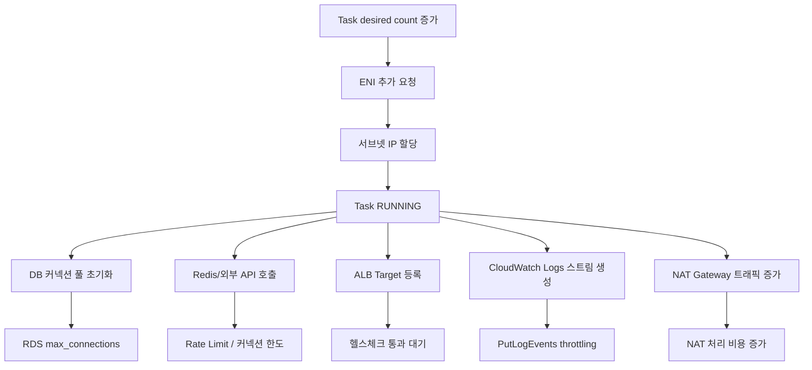
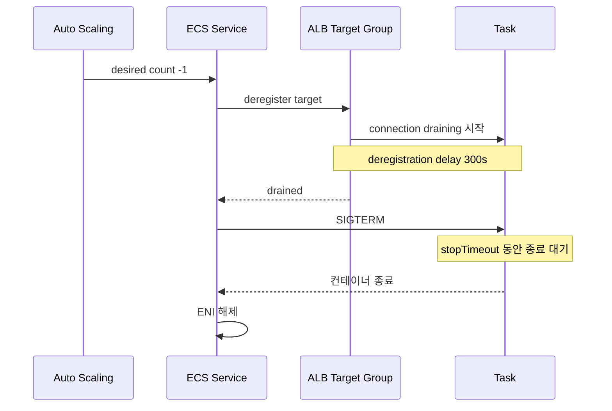

# ECS Task Scale Out 시 발생하는 부작용

ECS Task 수를 늘리는 행위는 단순히 컨테이너 인스턴스를 추가하는 것처럼 보이지만, 실제로는 VPC 자원·DB·외부 API·로그·네트워크 비용까지 동시에 영향을 준다. 트래픽이 몰릴 때 desired count를 두세 배로 올렸는데 오히려 RDS가 먼저 죽거나 Task가 PROVISIONING에서 멈추는 상황을 자주 본다. 스케일 아웃을 안전하게 하려면 Task 한 개가 늘어날 때 어디까지 영향이 퍼지는지 머릿속에 그릴 수 있어야 한다.

ENI 한계와 Auto Scaling 동작 자체는 [ECS_ENI_제한과_Task_한계.md](ECS_ENI_제한과_Task_한계.md)와 [ECS_Service_Auto_Scaling.md](ECS_Service_Auto_Scaling.md)에서 다룬다. 이 문서는 그 다음 단계, 즉 "Task가 실제로 늘어났을 때 주변에서 어떤 일이 벌어지는가"에 집중한다.

## 스케일 아웃 한 번에 영향받는 자원

awsvpc 네트워크 모드의 Task는 단독 ENI 한 개를 점유한다. ENI는 VPC에 속하고, ENI는 Private IP를 가지며, 그 IP는 서브넷 CIDR에서 나온다. 이 단순한 사실이 모든 부작용의 출발점이다.



위 그림은 Task 한 개가 늘어났을 때 동시에 자극받는 자원이다. 각각의 한계치를 모르고 desired count만 올리면, 가장 약한 고리부터 무너진다.

## 서브넷 가용 IP 고갈

awsvpc 모드에서는 Task 한 개가 ENI 한 개를 가져가고, ENI는 서브넷에서 Private IP 한 개를 빼간다. /24 서브넷은 256개 IP 중 AWS가 5개를 예약하므로 실제 사용 가능한 IP는 251개다. 거기에 RDS, Lambda ENI, ALB, NLB, VPC Endpoint, 다른 ECS 서비스가 IP를 나눠 쓴다.

서비스 A(50개), 서비스 B(80개), 서비스 C(40개)가 같은 서브넷에 있고 RDS와 VPC Endpoint가 IP 10개를 잡고 있다고 하자. 합계 180개. 여기서 서비스 A를 100개로 늘리면 230개. 거기에 배포가 동시에 일어나서 deploymentConfiguration의 maximumPercent가 200%라면 서비스 A 혼자 일시적으로 200개를 잡을 수도 있다. 이 시점에 서브넷 IP는 이미 한도를 넘는다.

이때 ECS 이벤트에는 "RESOURCE:ENI" 또는 "unable to place a task because no container instance met all of its requirements"가 뜨고, Task는 PROVISIONING 상태에서 진행되지 않는다. CloudTrail을 보면 `CreateNetworkInterface` 호출이 `InsufficientFreeAddressesInSubnet`으로 실패한다.

진단은 두 가지로 한다. 첫째, VPC 콘솔의 서브넷 상세에서 `Available IPv4 addresses` 값이 0에 가까운지 확인한다. 둘째, VPC Flow Logs와 ENI 목록(`describe-network-interfaces --filters Name=subnet-id,Values=...`)으로 ENI 점유 현황을 본다.

```bash
aws ec2 describe-network-interfaces \
  --filters "Name=subnet-id,Values=subnet-0123456789abcdef0" \
  --query 'NetworkInterfaces[].[NetworkInterfaceId,InterfaceType,Description]' \
  --output table | head -50
```

예방은 간단하다. ECS 서비스용 서브넷을 별도로 분리하고 /22 이상으로 잡는다. /22면 1019개 IP가 확보되고, AZ 3개에 분산하면 Task 1000개 이상까지는 IP 압박 없이 굴러간다. 기존에 /24로 잡혀 있다면 새 서브넷을 추가하고 ECS 서비스의 networkConfiguration에 서브넷을 추가하는 식으로 점진적으로 옮긴다.

## DB 커넥션 풀 폭주

스케일 아웃이 가장 자주 RDS를 죽이는 이유다. Task마다 커넥션 풀(HikariCP, pgx, mysql2 등)이 독립적으로 떠 있다는 사실을 잊기 쉽다.

Spring Boot 기본 HikariCP 설정은 maximumPoolSize=10이고, 스타트업이 트래픽 대응한다고 20~30으로 올려놓는 경우가 많다. 풀 사이즈가 20일 때 Task 100개가 떠 있으면 이 서비스 하나가 RDS에 2000개 커넥션을 요구한다. db.r6g.large의 max_connections는 약 1000~1500개 수준(메모리에 따라 동적 계산), db.r6g.xlarge도 3000을 넘기 어렵다.

실제 계산을 해보자. db.r6g.xlarge에서 `max_connections`가 3000이라고 가정한다. 백오피스 앱이 풀 30 × Task 5 = 150, 배치 워커가 풀 10 × Task 8 = 80, 메인 API가 풀 20 × Task 100 = 2000, 외부 연동 API가 풀 15 × Task 20 = 300, 운영자 직접 접속과 마이그레이션 툴이 50개. 합계 2580. 한도까지 420개 여유다. 이 상태에서 메인 API를 Task 130개로 늘리면 풀 20 × 130 = 2600이 되어 합계 3180으로 한도를 넘는다.

실제 장애는 한도 직전부터 시작된다. PostgreSQL은 max_connections 도달 시 신규 접속을 거부하고, 기존 커넥션도 컨텍스트 스위칭과 메모리 점유로 CPU가 폭증한다. RDS Performance Insights에서 `client backend`가 갑자기 늘고 wait event가 `IPC` 또는 `Lock` 계열로 쏠리면 이 패턴이다.

진단은 세 가지로 본다.

```sql
-- Postgres: 현재 커넥션 수와 상태별 분포
SELECT state, count(*) FROM pg_stat_activity GROUP BY state;

-- 누가 잡고 있는지 (애플리케이션별)
SELECT application_name, client_addr, count(*)
FROM pg_stat_activity
GROUP BY application_name, client_addr
ORDER BY count(*) DESC;
```

CloudWatch에서는 `DatabaseConnections` 메트릭과 `CPUUtilization`을 같이 본다. Task가 늘어난 시점부터 커넥션 곡선이 계단식으로 올라가면 풀이 그대로 누적된 것이다.

해결책은 RDS Proxy 또는 PgBouncer를 앞에 두는 것이다. RDS Proxy는 Task가 100개여도 실제 RDS에는 정해진 만큼만 커넥션을 유지하고, 나머지는 멀티플렉싱으로 처리한다. PgBouncer를 transaction pooling 모드로 쓰면 더 작은 커넥션 수로 같은 처리량을 낼 수 있다. 다만 prepared statement나 advisory lock을 쓰는 코드는 transaction pooling과 충돌하므로 마이그레이션 시 검증이 필요하다.

풀 사이즈 자체를 줄이는 것도 방법이다. Task당 풀 20을 5로 줄이면 Task 100개 기준 커넥션이 2000에서 500으로 떨어진다. 비동기 I/O 기반 프레임워크(Node.js, Spring WebFlux, FastAPI)에서는 풀 5도 충분한 경우가 많다. 동기 프레임워크(Spring MVC, Django sync)에서는 스레드 수와 풀 사이즈가 맞물리므로 무조건 줄일 수는 없다.

## Redis와 외부 API의 커넥션 폭증

RDS와 같은 문제가 Redis, Memcached, 외부 API 게이트웨이에서도 발생한다. Lettuce처럼 단일 커넥션을 공유하는 클라이언트는 영향이 작지만, Jedis pool이나 redis-py connection pool은 Task마다 독립적으로 떠 있다.

ElastiCache Redis는 노드별 동시 클라이언트 수가 65000까지 가능하지만, 메모리와 CPU 부담은 그보다 훨씬 일찍 온다. cache.r6g.large에서 클라이언트 5000개를 넘기면 client buffer 메모리가 수GB 단위로 잡혀서 maxmemory 정책이 의도와 다르게 동작한다.

외부 API는 거의 항상 rate limit이 있다. Slack API는 tier별 1초당 1~50 호출, Stripe는 초당 100, 결제 PG사는 초당 10~30이 흔하다. Task 50개가 각자 독립적으로 호출하면 클라이언트 하나당 초당 1번만 호출해도 합계 50req/s가 된다. 한 Task당 동시 처리 요청이 늘어나면 초당 호출 수가 곱셈으로 증가한다.

이 문제는 클라이언트별 분산 rate limit이 아니라 중앙집중식 토큰 버킷으로 풀어야 한다. Redis 기반 Lua 스크립트로 토큰을 차감하거나, 별도 게이트웨이(Kong, APISIX)에서 외부 호출을 통과시키는 방식을 쓴다.

```python
# Redis 기반 토큰 버킷 (단순화 예시)
LUA = """
local tokens = redis.call('GET', KEYS[1])
if not tokens then
  redis.call('SET', KEYS[1], ARGV[1], 'EX', 1)
  tokens = ARGV[1]
end
if tonumber(tokens) > 0 then
  redis.call('DECR', KEYS[1])
  return 1
end
return 0
"""

def acquire(redis_client, key, capacity_per_sec):
    return redis_client.eval(LUA, 1, key, capacity_per_sec) == 1
```

## NAT Gateway 대역폭과 비용

Task가 Private 서브넷에 떠 있고 외부 API, S3(VPC Endpoint 미적용 시), ECR, CloudWatch Logs로 나가는 트래픽이 NAT Gateway를 거친다. NAT Gateway는 시간당 요금($0.045/h)과 처리 데이터 요금($0.045/GB)을 둘 다 받는다.

스케일 아웃 후 자주 보는 비용 패턴이다. Task 20개가 시간당 평균 5GB를 NAT으로 흘리면 100GB/h, 일 2400GB. NAT Gateway 처리 비용만 일 $108. Task를 100개로 늘리면 일 $540. 월간 $16000 수준이다. 여기에 시간당 요금은 별도다.

특히 ECR pull, CloudWatch Logs, S3 GetObject가 NAT을 타면 손실이 크다. ECR과 S3는 Gateway VPC Endpoint로 빼면 무료, CloudWatch Logs는 Interface VPC Endpoint($0.01/h × AZ 수)로 빼면 NAT 트래픽이 사라진다.

진단은 NAT Gateway의 `BytesOutToDestination`, `BytesOutToSource`, `BytesInFromSource`, `BytesInFromDestination` 메트릭을 본다. Task 수와 NAT 트래픽이 선형 비례하면 어떤 트래픽이 NAT을 타는지 분석한다. VPC Flow Logs를 Athena로 쿼리하면 어떤 destination이 NAT을 거치는지 확인할 수 있다.

```sql
-- Athena: NAT Gateway ENI를 거친 destination 별 트래픽
SELECT dstaddr, sum(bytes)/1024/1024/1024 AS gb
FROM vpc_flow_logs
WHERE interface_id = 'eni-natgw-xxxxxxxx'
  AND date = '2026-04-29'
GROUP BY dstaddr
ORDER BY gb DESC
LIMIT 20;
```

## CloudWatch Logs throttling과 비용

awslogs 드라이버는 Task의 stdout/stderr를 CloudWatch Logs로 보낸다. PutLogEvents API는 log stream당 5 requests/sec 한도가 있고, 각 요청은 최대 10000개 로그 이벤트 또는 1MB이다. Task가 폭주해서 로그를 초당 수만 줄 뿜으면 awslogs 드라이버 내부 버퍼가 차고, 결국 throttling이 발생한다.

throttling이 일어나면 두 가지 증상이 나온다. 첫째, 로그가 지연되거나 일부 누락된다. 둘째, awslogs 드라이버가 backpressure로 컨테이너 stdout을 막아서 애플리케이션 자체가 느려질 수 있다(`mode=non-blocking`이 아닐 때).

비용도 빠르게 올라간다. CloudWatch Logs는 ingest $0.50/GB(서울 리전 기준)이다. Task 100개가 각자 분당 10MB 로그를 뿜으면 분당 1GB, 시간당 60GB, 일 1440GB. 일 ingest 비용 $720, 월 $21000. 거기에 저장 비용이 추가된다.

해결책 세 가지를 같이 쓴다.

첫째, 로그 레벨을 운영 환경에서 INFO 또는 WARN으로 고정하고 DEBUG 로그를 stdout으로 흘리지 않는다. 라이브러리가 INFO에서도 과하게 찍는 경우(Hibernate SQL 로그 등)는 별도로 막는다.

둘째, awslogs 대신 awsfirelens(Fluent Bit)를 쓴다. Fluent Bit에서 정규식 필터링, 샘플링, S3 직접 업로드를 거치면 CloudWatch Logs로 가는 양을 1/5~1/10로 줄일 수 있다.

```yaml
# Task Definition: awsfirelens 로그 드라이버
{
  "name": "app",
  "logConfiguration": {
    "logDriver": "awsfirelens",
    "options": {
      "Name": "cloudwatch_logs",
      "region": "ap-northeast-2",
      "log_group_name": "/ecs/app",
      "log_stream_prefix": "app/",
      "auto_create_group": "false"
    }
  }
}
```

셋째, log stream을 Task 단위가 아닌 컨테이너 인스턴스 또는 일정 단위로 분산해서 5 req/s/stream 한도를 회피한다. awslogs-stream-prefix를 잘 쪼개면 stream 수를 늘릴 수 있다.

## ALB Target 등록 지연과 Connection draining

ECS 서비스가 ALB와 연동되어 있으면, Task가 RUNNING 상태가 된 후에도 즉시 트래픽을 받지 못한다. ALB Target Group에 등록되고, healthCheckIntervalSeconds × healthyThresholdCount 만큼의 시간 동안 헬스체크가 통과해야 한다. 기본값은 30초 × 5 = 150초다.

스케일 아웃이 100개 단위로 일어나면 이 등록과 헬스체크가 동시에 진행되면서 ALB 자체에 부하가 간다. 평소엔 문제없지만, ALB Target 등록은 eventually consistent라서 일부 Target이 healthy로 표시되어도 실제 트래픽이 가지 않는 시간이 있다.

반대로 스케일 인 시에는 deregistration delay(기본 300초) 동안 기존 커넥션을 유지한다. 이 기간 동안 Task는 STOPPING 상태로 ECS에서 보이지만 실제로는 ENI를 잡고 있고, ALB는 트래픽을 끊는 중이다. 빠른 스케일 인/아웃을 반복하면 STOPPING Task가 누적되면서 서브넷 IP를 한 번 더 압박한다.

deregistration delay는 애플리케이션의 graceful shutdown 시간보다 길게 잡고, ECS Service의 stopTimeout도 그에 맞춘다. 그라파나에서 ALB의 `TargetResponseTime`과 `HTTPCode_Target_5XX_Count`가 스케일 이벤트 직후에 튄다면 graceful shutdown이 제대로 안 되고 있다는 신호다.



## Cloud Map 인스턴스 등록 한도

ECS Service Discovery(Cloud Map)를 쓰면 Task마다 Cloud Map 인스턴스가 등록된다. Cloud Map 서비스 한 개당 인스턴스 1000개가 기본 한도다. Task를 1000개 넘게 굴리려고 하면 등록 자체가 실패한다.

이건 잘 안 알려진 한계라서 한도에 가까워질 때까지 모르고 있다가 갑자기 신규 Task가 PROVISIONING에서 RUNNING으로 못 넘어가는 경우가 있다. ECS 이벤트에 `unable to register service discovery instance`가 뜬다.

서비스를 분할하거나, 한도 증설을 신청하거나, Service Connect로 마이그레이션하는 방법이 있다. Service Connect는 Cloud Map과 다른 한도 체계를 쓰고, 더 큰 규모의 서비스를 가정하고 설계되어 있다.

## 캐시 워밍업 부재로 인한 cold task 응답 지연

새로 뜬 Task는 JVM JIT 컴파일, 커넥션 풀 워밍업, 로컬 캐시(Caffeine, Guava) 적재가 안 되어 있다. 갓 RUNNING된 Task가 ALB에 등록되어 트래픽을 받기 시작하면 첫 수백~수천 요청이 평소보다 5~20배 느리다.

스케일 아웃이 트래픽 폭증에 대응하려고 일어나는데, 새 Task가 느리면 기존 Task로 부하가 다시 몰리고, 그 사이 새 Task가 느린 응답을 토해내서 P99 지연이 한참 동안 높게 유지된다. 이게 "스케일 아웃 했는데 왜 더 느려졌지" 패턴의 정체다.

대응은 컨테이너 워밍업을 명시적으로 한다. JVM 앱은 기동 시 더미 요청을 self-call해서 JIT를 미리 돌리고, 커넥션 풀의 minimumIdle을 maximumPoolSize와 비슷하게 잡아서 기동 시 모든 커넥션을 미리 연다. 캐시는 기동 후 백그라운드 스레드에서 hot key를 미리 읽어둔다.

ALB의 slow start mode를 활성화하면 새 Target에 점진적으로 트래픽을 부어주므로 cold start 충격을 줄일 수 있다. Target Group attributes에서 `slow_start.duration_seconds`를 30~120초로 설정한다.

## X-Ray와 APM 샘플 폭증

분산 트레이싱은 보통 샘플링 비율로 비용을 통제한다. X-Ray 기본은 초당 1 reservoir + 5% rate, Datadog APM은 헤드 기반 또는 분석 기반 샘플링이 있다.

문제는 Task가 많아지면 reservoir가 Task마다 적용된다는 점이다. X-Ray sampling rule이 reservoir=1, rate=0.05일 때 Task 100개라면 초당 최소 100개 트레이스 + 트래픽의 5%가 항상 수집된다. 트래픽이 초당 10000건이면 100 + 500 = 600 트레이스/s. Task 1000개라면 1000 + 500 = 1500 트레이스/s. reservoir 부분이 Task 수에 비례해 폭증한다.

X-Ray는 트레이스 수집 $5/100만, 스캔 $0.50/100만이다. 일 천만 트레이스 수집이면 $50/일, 월 $1500. Datadog APM은 샘플 트레이스 인덱싱 비용이 더 비싸다.

대응은 reservoir 기반이 아닌 비율 기반 샘플링으로 통일하거나, FireLens에서 OpenTelemetry Collector를 거쳐 tail sampling으로 전환한다. tail sampling은 트레이스 완료 후 에러나 지연이 큰 트레이스만 인덱싱하므로 비용 통제가 쉽다.

## Spot 풀 고갈로 인한 PROVISIONING 정체

Capacity Provider로 FARGATE_SPOT을 쓰면 Spot 풀이 부족할 때 Task가 PROVISIONING에서 멈춘다. Fargate Spot은 EC2 Spot과 동일하게 가용 capacity가 동적이고, 특정 시간대(주중 낮)나 특정 vCPU/메모리 조합에서 풀이 부족할 수 있다.

증상은 ECS 이벤트에 `Fargate Spot capacity is unavailable`이 뜨고, Task는 한참 PROVISIONING에 머물다가 결국 STOPPED로 전환된다. 이때 desired count는 채워지지 않고, 서비스 메트릭의 `RunningTaskCount`가 desired count보다 한참 낮다.

대응은 Capacity Provider Strategy를 FARGATE 1 + FARGATE_SPOT N의 weighted 조합으로 잡는다. Spot 풀이 비어도 일부 Task는 On-Demand로 떨어져서 최소 운영 capacity를 확보한다.

```bash
aws ecs update-service \
  --cluster prod \
  --service api \
  --capacity-provider-strategy \
    capacityProvider=FARGATE,weight=1,base=10 \
    capacityProvider=FARGATE_SPOT,weight=4
```

위 설정은 최초 10개는 무조건 On-Demand로 띄우고, 그 이상부터는 4:1 비율로 Spot과 On-Demand를 섞는다. Spot 풀이 비어도 base 10개와 일부 weighted On-Demand는 항상 확보된다.

EC2 Capacity Provider를 쓰는 경우라면 EC2 인스턴스 자체가 Auto Scaling Group 한도까지 떠야 Task가 placement될 수 있다. ASG 한도를 벗어나면 Task는 ECS에서 PROVISIONING으로 보이지만 실제로는 EC2 부족이 원인이다. ASG의 `Activity History`와 ECS의 `Container Instance` 수를 같이 봐야 진짜 원인이 보인다.

## 사전 예방을 위한 한도 점검

Task 수를 두세 배로 올리려고 할 때 미리 봐야 할 한도들을 한 번에 정리한다.

서브넷은 가용 IP가 (예상 Task 최대치 + maximumPercent 비율 여유분) 이상인지 확인한다. 최소 30% 여유를 둔다.

RDS는 max_connections × 0.8을 한도로 보고, (Task 수 × 풀 사이즈) + 기타 클라이언트가 그 이하인지 계산한다. 80%를 넘으면 RDS Proxy 도입이나 풀 축소를 먼저 한다.

NAT Gateway는 현재 시간당 처리량을 측정하고, Task 비례로 늘었을 때 100 Gbps 한계와 월 비용 예측치를 본다. ECR/S3는 Gateway Endpoint로 빼고, CloudWatch Logs는 트래픽이 크면 Interface Endpoint로 뺀다.

CloudWatch Logs는 현재 PutLogEvents 호출 수와 throttle 메트릭을 본다. throttle이 이미 발생하고 있다면 Task를 늘리는 건 의미가 없다. Fluent Bit 도입을 먼저 한다.

ALB Target Group은 등록 가능한 Target 수가 충분한지 본다(기본 한도 1000, 한도 증설 가능). Cloud Map은 서비스당 인스턴스 1000개 한도를 본다.

Spot 풀은 미리 알 수 없으므로 On-Demand base를 항상 잡아둔다.

이 점검을 자동화하려면 deploy 직전에 `aws ec2 describe-subnets`, `aws rds describe-db-instances`, `aws ecs describe-services` 결과를 모아서 한도 도달 가능성을 체크하는 스크립트를 CI에 넣는다. 운영 중인 서비스 옆에서 새 desired count로 미리 dry-run을 돌릴 수는 없으므로, 수치 기반 사전 검증이 거의 유일한 방어선이다.
