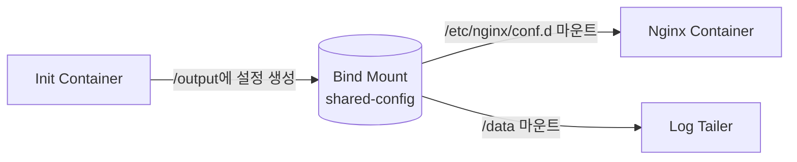
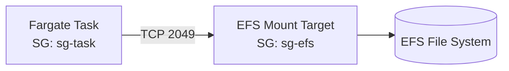
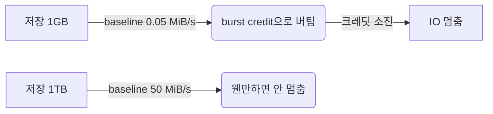

# ECS Volumes & EFS

컨테이너는 원래 stateless가 정답이라고 하지만, 실제 운영에서는 "이건 어디 저장해야 하지" 라는 데이터가 끊임없이 생긴다. 사용자가 올린 파일, 빌드 캐시, 임시 변환 작업물, 여러 task가 공유해야 하는 설정 파일. RDS나 S3로 빠지지 않는 이런 데이터를 컨테이너에 그대로 두면 task가 죽는 순간 같이 사라진다. ECS에서 이걸 해결하는 도구가 Volume이다.

ECS 볼륨은 네 종류로 갈린다. Bind mount, EFS, FSx, Docker volume. 이름은 비슷해 보이지만 수명 주기와 launch type 호환성이 완전히 다르다. 잘못 고르면 "Fargate인데 왜 안 붙죠" 같은 질문이 나오니까 차이부터 분명히 잡고 시작해야 한다.

---

## Volume 종류와 선택 기준

| 종류 | 영속성 | EC2 | Fargate | 주 용도 |
|---|---|---|---|---|
| Bind mount | Task 수명만 | O | O | 컨테이너 간 파일 공유 (sidecar 패턴) |
| EFS Volume | 영구 | O | O | 여러 Task가 공유하는 영구 데이터 |
| FSx for Windows | 영구 | O (Windows) | X | Windows 워크로드, SMB 프로토콜 |
| FSx for Lustre | 영구 | O | X | HPC, 머신러닝 데이터셋 |
| Docker volume | 인스턴스 수명 | O | X | EC2 호스트에 종속된 캐시 |

실무에서 90%는 Bind mount 아니면 EFS다. FSx는 Windows 컨테이너나 ML 학습 데이터처럼 명확한 이유가 있을 때만 등장한다. Docker volume은 Fargate에서 못 쓰는 데다 인스턴스가 사라지면 같이 사라져서 영구 저장으로 보기 어렵다. 신규 설계에서는 거의 안 쓴다.

---

## Task Definition의 volumes / mountPoints 구조

볼륨은 task definition의 두 곳에 동시에 적어줘야 한다. 한쪽에만 적으면 마운트가 안 되는데 에러도 친절하지 않다.

```json
{
  "family": "web-app",
  "volumes": [
    {
      "name": "shared-config",
      "host": {}
    }
  ],
  "containerDefinitions": [
    {
      "name": "nginx",
      "mountPoints": [
        {
          "sourceVolume": "shared-config",
          "containerPath": "/etc/nginx/conf.d",
          "readOnly": true
        }
      ]
    },
    {
      "name": "config-loader",
      "mountPoints": [
        {
          "sourceVolume": "shared-config",
          "containerPath": "/output",
          "readOnly": false
        }
      ]
    }
  ]
}
```

`volumes` 블록은 "이 task에 어떤 볼륨이 존재한다"를 선언하는 곳이고, `mountPoints`는 "그 볼륨을 이 컨테이너의 어떤 경로에 붙인다"를 지정하는 곳이다. `sourceVolume` 이름이 양쪽에서 일치해야 한다. 오타 한 글자 때문에 "왜 디렉토리가 비어있지" 하면서 한 시간 날리는 경우가 흔하다.

`readOnly` 플래그를 의식해서 쓰는 게 좋다. config-loader 컨테이너가 파일을 만들고 nginx가 그걸 읽기만 한다면, nginx 쪽은 `readOnly: true`로 막아야 한다. nginx가 실수로 conf.d를 건드리면 양쪽 컨테이너가 같은 inode를 보고 있으니 즉시 영향을 받는다.

---

## Bind Mount — 같은 Task 안의 컨테이너끼리 공유

`"host": {}` 만 비워 두면 Bind mount다. ECS가 Fargate에서는 task 전용 임시 디스크에, EC2에서는 호스트의 임시 디렉토리에 공간을 만들어 준다. 수명은 task 수명과 같다. task가 STOPPED 되는 순간 사라진다.

이걸 쓰는 가장 흔한 시나리오가 sidecar 패턴이다.



Init 컨테이너가 Parameter Store에서 설정을 끌어다 파일로 떨군다. 같은 볼륨을 nginx가 읽어서 기동한다. 또 다른 sidecar는 같은 디렉토리에서 로그 파일을 tail해서 어딘가로 보낸다. 세 컨테이너가 동일한 디렉토리를 보지만 task 단위로 격리되니까 다른 task의 데이터와 섞일 일이 없다.

Bind mount에서 자주 놓치는 게 권한 문제다. Init 컨테이너가 root(UID 0)로 파일을 만들었는데 nginx가 nginx 유저(UID 101)로 돌고 있으면 읽기는 되지만 쓰기는 막힌다. 한쪽 컨테이너의 USER 지시문을 바꾸거나 init 단계에서 chmod/chown을 명시적으로 걸어야 한다.

Fargate에서는 task당 임시 디스크 용량이 정해져 있다. 기본 20GB, ephemeral storage를 늘려서 최대 200GB까지 잡을 수 있다. 빌드 산출물이나 큰 압축파일을 다루는 task라면 이 한계를 미리 확인해야 한다. 모자라면 "no space left on device"가 떨어지는데, 컨테이너 입장에서는 디스크가 가득 찬 게 아니라 task 전체의 ephemeral 용량이 찬 거라 원인 추적이 헷갈린다.

---

## EFS Volume — 영구 보관과 다중 Task 공유

EFS는 ECS 스토리지의 사실상 표준이다. NFSv4 기반이고 multi-AZ 복제가 기본이라 task가 어느 AZ에서 뜨든 같은 파일에 접근한다. EC2든 Fargate든 동일하게 붙는다.

```json
{
  "volumes": [
    {
      "name": "user-uploads",
      "efsVolumeConfiguration": {
        "fileSystemId": "fs-0abc1234",
        "rootDirectory": "/",
        "transitEncryption": "ENABLED",
        "transitEncryptionPort": 2049,
        "authorizationConfig": {
          "accessPointId": "fsap-0def5678",
          "iam": "ENABLED"
        }
      }
    }
  ]
}
```

옵션 하나하나가 각자의 사연이 있다. 순서대로 풀어보자.

### IAM 인증

`authorizationConfig.iam: ENABLED`를 켜면 ECS가 task role을 사용해 EFS에 마운트한다. EFS 파일 시스템 정책과 task role 양쪽에 권한이 있어야 한다. task role에는 최소한 이 정도가 들어간다.

```json
{
  "Effect": "Allow",
  "Action": [
    "elasticfilesystem:ClientMount",
    "elasticfilesystem:ClientWrite",
    "elasticfilesystem:DescribeMountTargets"
  ],
  "Resource": "arn:aws:elasticfilesystem:ap-northeast-2:111122223333:file-system/fs-0abc1234"
}
```

읽기 전용으로 붙일 거면 `ClientWrite`는 빼라. EFS 파일 시스템 정책에서도 동일하게 허용해줘야 한다. 한쪽만 열려 있으면 task가 PROVISIONING에서 멈춰서 mount target과 통신이 안 된다는 식의 모호한 에러를 던진다.

IAM 인증을 끄면 보안 그룹과 네트워크 ACL만으로 접근이 결정된다. 이게 더 간단해 보이지만 task별 권한 분리가 안 되니까 운영 규모가 커지면 다시 IAM으로 돌아오게 된다.

### Access Point로 격리

Access Point는 EFS 파일 시스템 안에 가상 진입점을 만드는 기능이다. UID/GID와 루트 디렉토리를 강제할 수 있다.

```hcl
resource "aws_efs_access_point" "app_uploads" {
  file_system_id = aws_efs_file_system.main.id

  posix_user {
    uid = 1000
    gid = 1000
  }

  root_directory {
    path = "/app/uploads"
    creation_info {
      owner_uid   = 1000
      owner_gid   = 1000
      permissions = "0755"
    }
  }
}
```

이 Access Point를 task에 연결하면 컨테이너가 EFS에 어떤 UID로 접근하든 ECS가 `1000:1000`으로 갈아 끼운다. 루트 디렉토리도 `/app/uploads`로 고정되니까 컨테이너 입장에서는 그 위 디렉토리가 아예 존재하지 않는 것처럼 보인다. 한 EFS 파일 시스템을 여러 서비스가 공유할 때 서로의 디렉토리를 절대 못 보게 하고 싶다면 Access Point가 사실상 유일한 답이다.

Access Point 없이 `rootDirectory: "/app/uploads"`만 지정해도 동작은 한다. 다만 권한 분리가 없으니 다른 task가 `/etc/passwd`로 가는 path를 시도하면 막을 방법이 없다. 보안 요건이 있으면 Access Point를 켜야 한다.

### Transit Encryption

`transitEncryption: ENABLED`는 NFS 트래픽을 stunnel로 감싸는 옵션이다. EFS는 미사용 데이터 암호화(at-rest)는 기본 켜져 있지만 전송 중 암호화는 끌 수 있다. 운영 환경에서는 거의 항상 켠다. 약간의 CPU 오버헤드가 있지만 일반적인 워크로드에서는 체감되지 않는다.

`transitEncryptionPort`는 stunnel이 사용할 로컬 포트 번호다. 명시 안 하면 자동으로 잡힌다. 보통 그냥 비워 둔다.

---

## Fargate에서 EFS 붙이기 — 보안 그룹과 Platform Version

EC2 launch type은 호스트의 보안 그룹과 NACL을 직접 만지면 EFS 마운트가 끝난다. Fargate는 이게 좀 다르다. task 자체에 ENI가 붙기 때문에 task의 보안 그룹이 EFS mount target 보안 그룹에 outbound 2049 포트를 허용해야 한다. 반대로 EFS mount target 보안 그룹은 task 보안 그룹으로부터의 inbound 2049를 허용해야 한다.



자주 만드는 실수가 두 가지다. 하나는 task 보안 그룹 자체를 안 만들고 클러스터 기본 SG를 그대로 쓰는 것. 다른 하나는 EFS mount target을 만들 때 보안 그룹을 default로 두고 잊어버리는 것. Terraform으로 IaC 하면 거의 안 생기지만 콘솔에서 손으로 만들 때 잘 빠진다.

Fargate Platform Version도 의식해야 한다. EFS volume은 Platform Version `1.4.0` 이상에서만 동작한다. task definition에서 `platformVersion`을 LATEST로 두면 자동으로 최신이 잡히지만, 운영에서 특정 버전을 핀하고 있다면 1.3.0 이하로 떨어지면 안 된다. 옛날 task definition이 1.3.0으로 박혀 있는 채로 EFS만 추가하는 변경을 하면 task가 PROVISIONING에서 실패하는데 에러 메시지는 "ResourceInitializationError" 정도라 한참 헤매게 된다.

---

## 여러 Task가 동시에 EFS를 마운트할 때 — 파일 락

EFS의 진가는 task A가 쓴 파일을 task B가 즉시 읽는 시나리오에서 나온다. 하지만 동시 쓰기가 끼면 NFS의 한계가 드러난다.

### 흔한 충돌 사례

웹 서비스 task 10개가 동시에 떠 있고 같은 EFS 위에서 사용자 업로드를 처리한다고 하자. 사용자가 같은 파일을 두 번 빠르게 올리면 두 task가 각각 같은 파일명으로 쓰기를 시도한다. POSIX 의미상 둘 중 하나가 마지막에 쓴 내용으로 덮인다. 락이 없으니 한쪽 데이터는 그냥 사라진다.

해결책은 락을 들고 가거나 충돌이 안 나는 경로를 쓰는 것이다.

```python
import fcntl
import os

def write_with_lock(path: str, data: bytes) -> None:
    fd = os.open(path, os.O_WRONLY | os.O_CREAT, 0o644)
    try:
        fcntl.flock(fd, fcntl.LOCK_EX)
        os.write(fd, data)
    finally:
        fcntl.flock(fd, fcntl.LOCK_UN)
        os.close(fd)
```

`fcntl.flock`은 NFSv4 위에서 동작하긴 하는데 성능이 좋지 않다. 락 획득에 100ms 단위가 걸리기도 한다. 그래서 EFS에서 진짜로 쓰는 패턴은 파일명 자체에 UUID를 박는 것이다. 충돌 가능성을 0으로 만든 다음, 메타데이터(어떤 UUID가 어떤 원본인지)는 RDB에 둔다. EFS는 바이너리 저장소로만 쓰고 일관성 책임은 DB에 떠넘기는 구도다.

### SQLite를 EFS에 두면 안 되는 이유

가끔 SQLite 파일을 EFS에 올려서 task 사이에 공유하려는 시도를 본다. 동작은 하는 것처럼 보이지만 NFS에서 SQLite의 락 메커니즘은 정상적으로 안 돈다. 데이터 손상이 확실히 발생한다. SQLite 공식 문서에도 NFS는 지원하지 않는다고 명시되어 있다. 공유 RDB가 필요하면 RDS나 DynamoDB를 써라.

---

## 빌드 캐시 공유 — EFS의 좋은 사용처

CI 파이프라인이 ECS Fargate 위에서 도는 환경에서 EFS가 빛난다. 각 빌드 task가 npm, gradle, pip 캐시를 EFS에 들고 다니면 다음 빌드가 캐시를 재사용한다.

```yaml
volumes:
  - name: build-cache
    efsVolumeConfiguration:
      fileSystemId: fs-buildcache
      rootDirectory: /
      authorizationConfig:
        accessPointId: fsap-nodecache

containerDefinitions:
  - name: builder
    image: node:20
    mountPoints:
      - sourceVolume: build-cache
        containerPath: /root/.npm
    command: ["npm", "ci"]
```

이 패턴의 함정은 두 가지다. 하나는 동시 빌드가 같은 캐시 디렉토리를 만지면 npm 락 파일이 망가질 수 있다. Access Point의 rootDirectory를 빌드 ID별로 격리하거나, 캐시는 read-only로 마운트하고 write는 별도 경로로 분리한다. 다른 하나는 캐시 크기가 무한정 자라는 것. EFS Lifecycle Management로 30일 미접근 파일을 IA tier로 옮기게 설정하면 비용이 절감된다.

업로드 임시 보관도 비슷하다. 사용자가 파일을 올리면 일단 EFS에 쓰고, 비동기 워커가 S3로 옮긴 다음 EFS에서 지우는 패턴이다. 동기 요청 처리는 EFS의 빠른 쓰기 latency를 이용하고, 영구 저장은 S3의 저렴한 단가를 활용한다. 단, EFS에 영구로 데이터를 남기는 건 S3 대비 비싸다. 임시 보관 이상으로 가져가면 비용이 폭발한다.

---

## Throughput 모드 — Bursting과 Provisioned

EFS를 한 번이라도 운영해 봤다면 반드시 만나는 함정이다. EFS의 throughput은 파일 시스템 용량과 묶여 있다. 기본 모드인 Bursting에서는 저장 용량이 1TB일 때 baseline 50 MiB/s를 보장하고, 그 위로 burst credit이 쌓이면 잠깐 더 높은 속도를 낸다.

문제는 신규 EFS의 저장 용량이 0에 가까울 때다. 1GB 저장 중이면 baseline은 0.05 MiB/s 수준이다. burst credit이 다 떨어지면 IO가 거의 멈춘다.



실제로 겪는 시나리오는 이렇다. 신규 서비스 출시하고 EFS를 만든 첫째 날, 트래픽이 몰리면서 업로드 처리가 폭주한다. 처음 몇 시간은 잘 돌다가 어느 순간부터 모든 task가 EFS write에서 멈춘다. CloudWatch에서 `BurstCreditBalance`가 0으로 떨어진 게 보인다. EBS의 burst credit 개념과 같지만 EFS는 baseline 회복 속도가 훨씬 느려서 한 번 떨어지면 시간 단위로 못 돌아온다.

해결책은 Provisioned Throughput 모드로 전환하는 것이다.

```bash
aws efs update-file-system \
  --file-system-id fs-0abc1234 \
  --throughput-mode provisioned \
  --provisioned-throughput-in-mibps 100
```

저장 용량과 무관하게 고정 throughput을 보장받는다. 비용은 throughput당 별도로 청구된다. 100 MiB/s를 한 달 내내 잡으면 적지 않은 금액이 추가된다. 대신 IO 병목으로 서비스가 멈추는 사고는 피한다.

신규 EFS는 무조건 Provisioned로 시작하는 게 안전하다. 실제 사용량을 한 주 정도 본 다음 Bursting으로 내려도 늦지 않다. 반대 방향(Bursting에서 Provisioned로 올라가는 일)은 burst credit이 이미 다 떨어진 상태에서 일어나니까 그동안 사용자는 멈춘 서비스를 보고 있는다.

Elastic Throughput 모드도 있다. 사용량에 따라 자동 확장되고 사용한 만큼만 과금된다. 워크로드가 매우 불규칙하면 이쪽이 합리적이다. 단, peak throughput에 비례한 단가가 Provisioned보다 비싸기 때문에 꾸준한 사용량이 예측되면 Provisioned가 더 저렴하다.

---

## FSx 잠깐 — Windows와 Lustre

ECS에서 FSx 볼륨은 EC2 launch type에서만 가능하다. Fargate는 지원하지 않는다.

FSx for Windows File Server는 .NET 기반 Windows 컨테이너 워크로드를 ECS로 돌릴 때 등장한다. SMB 프로토콜이라 AD 도메인 조인과 묶여 다닌다. 설정이 만만치 않아서 정말 Windows 컨테이너가 필요한 경우가 아니면 안 쓰는 게 좋다.

FSx for Lustre는 HPC나 ML 학습용이다. 수십 GB/s 단위 throughput이 필요한 워크로드, S3와 연동해서 lazy loading 하는 패턴이 강점이다. 일반적인 웹 서비스에서는 거의 볼 일이 없다.

---

## Docker Volume — EC2에서만, 권장하지 않음

`dockerVolumeConfiguration`으로 만드는 Docker volume은 EC2 호스트에 종속된다. task가 다른 인스턴스로 이동하면 데이터에 접근하지 못한다. driver를 rexray 같은 걸로 지정하면 EBS 위로 옮길 수 있긴 하지만 운영 부담만 늘어난다. 신규 설계에서 Docker volume을 고려할 이유는 거의 없다.

---

## 정리

볼륨 종류별 의사결정 흐름은 단순하다. 컨테이너끼리 잠깐 파일을 주고받으면 Bind mount, 영구 저장이나 task 간 공유가 필요하면 EFS, Windows거나 ML 학습이면 FSx, 그 외에는 S3나 RDS로 빠지는 게 답이다. Docker volume은 거의 안 쓴다.

EFS를 도입할 때 처음 한 달 동안 가장 자주 만나는 사고는 IAM 권한 누락, Fargate 보안 그룹 2049 포트 미허용, Throughput 모드 선택 실수 이 세 가지다. 마운트 자체가 안 되는 문제는 IAM과 보안 그룹을 점검하면 풀리고, 마운트는 됐는데 IO가 느린 문제는 Throughput 모드를 의심해야 한다.
