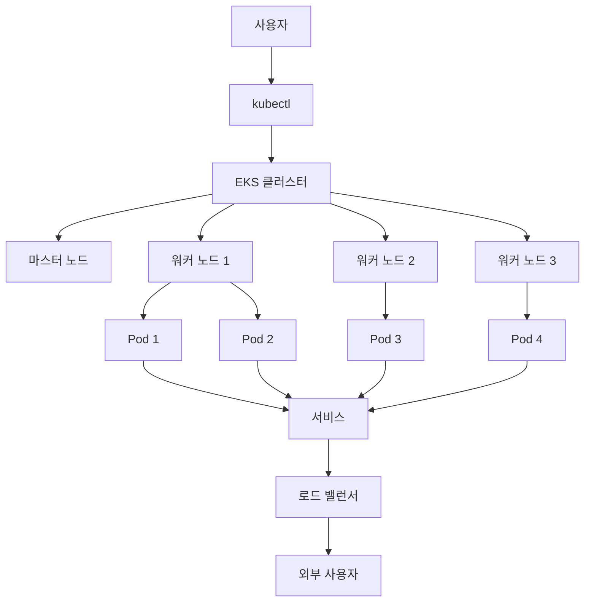

# ☁️ AWS EKS (Elastic Kubernetes Service)

> 💡 **이 가이드는 AWS EKS를 처음 접하는 분들을 위해 작성되었습니다.**
> 
> 각 섹션마다 관련 용어와 개념을 자세히 설명하여, 
> Kubernetes나 컨테이너 기술에 익숙하지 않은 분들도 쉽게 이해할 수 있도록 구성했습니다.

---

## 📚 목차
1. [AWS EKS란?](#1-aws-eks란)
2. [기본 용어 이해하기](#2-기본-용어-이해하기)
3. [EKS의 구성 요소](#3-eks의-구성-요소)
4. [실습: EKS 클러스터 생성 및 관리](#4-실습-eks-클러스터-생성-및-관리)
5. [CI/CD 연동하기](#5-cicd-연동하기)
6. [비용 및 보안 고려사항](#6-비용-및-보안-고려사항)
7. [EKS vs ECS 비교](#7-eks-vs-ecs-비교)

---

## 1. AWS EKS란?

### 🎯 EKS의 정의
**AWS EKS (Elastic Kubernetes Service)**는 Amazon Web Services에서 제공하는 **완전관리형 Kubernetes 서비스**입니다.

### 🤔 왜 EKS를 사용할까요?

#### ❌ EKS 없이 Kubernetes를 사용한다면...
- Kubernetes 클러스터를 직접 설치하고 관리해야 함
- 컨트롤 플레인 서버들을 직접 운영해야 함
- 업데이트, 보안 패치, 모니터링을 직접 처리해야 함
- 고가용성 설정을 직접 구성해야 함

#### ✅ EKS를 사용하면...
- **AWS가 인프라를 관리**해주므로 개발에만 집중 가능
- **자동 업데이트 및 패치** 제공
- **고가용성 보장** (99.95% SLA)
- **보안 설정 자동화**

### 🏗️ EKS의 주요 특징

| 특징 | 설명 | 장점 |
|------|------|------|
| **완전관리형 Kubernetes** | Kubernetes 컨트롤 플레인을 AWS에서 관리 | 인프라 관리 부담 없음 |
| **고가용성 및 확장성** | 멀티 AZ 아키텍처 제공 | 안정적인 서비스 운영 |
| **네이티브 Kubernetes 지원** | `kubectl`, Helm 등 표준 도구 지원 | 기존 지식 그대로 활용 |
| **다양한 런타임 지원** | EC2와 Fargate 기반 클러스터 지원 | 유연한 배포 방식 |
| **통합 보안** | IAM, VPC, Security Groups 통합 | AWS 보안 체계 활용 |

---

## 2. 기본 용어 이해하기

### 🐳 컨테이너 (Container)
> **정의**: 애플리케이션과 그 실행에 필요한 모든 파일을 포함한 패키지
> 
> **비유**: 배송용 컨테이너처럼, 애플리케이션을 어디서든 동일하게 실행할 수 있게 해주는 표준화된 패키지

**예시**: 
- Docker 컨테이너는 웹 애플리케이션, 데이터베이스, 캐시 서버 등을 독립적으로 실행
- 각 컨테이너는 격리된 환경에서 실행되어 서로 간섭하지 않음

### ☸️ Kubernetes (쿠버네티스)
> **정의**: 컨테이너화된 애플리케이션을 자동으로 배포, 확장, 관리하는 오픈소스 플랫폼
> 
> **역할**: 컨테이너 오케스트레이션 (여러 컨테이너를 효율적으로 관리)

**주요 기능**:
- 🚀 **자동 배포**: 애플리케이션을 여러 서버에 자동으로 배포
- 📈 **자동 확장**: 트래픽에 따라 컨테이너 수를 자동으로 조절
- 🔄 **자동 복구**: 문제가 생긴 컨테이너를 자동으로 재시작
- ⚖️ **로드 밸런싱**: 트래픽을 여러 컨테이너에 균등하게 분산

### 🏢 클러스터 (Cluster)
> **정의**: 여러 서버(노드)를 하나의 논리적 단위로 묶어서 관리하는 시스템

**구성 요소**:
- **마스터 노드 (Master Node)**: 클러스터를 관리하는 중앙 제어부
- **워커 노드 (Worker Node)**: 실제 애플리케이션이 실행되는 서버들

### 📦 Pod (파드)
> **정의**: Kubernetes에서 배포되는 최소 실행 단위
> 
> **특징**: 하나 이상의 컨테이너를 포함할 수 있음

**예시**:
```yaml
# 웹 애플리케이션 Pod
Pod:
  - nginx 컨테이너 (웹 서버)
  - redis 컨테이너 (캐시)
```

### 🌐 서비스 (Service)
> **정의**: Pod에 대한 네트워크 접근을 관리하는 추상화 계층
> 
> **역할**: 
> - Pod의 IP가 변경되어도 일정한 엔드포인트 제공
> - 로드 밸런싱 기능 제공

---

## 3. EKS의 구성 요소

### 🏗️ 전체 아키텍처



### 📋 구성 요소 상세 설명

#### 1️⃣ **EKS 클러스터**
- **역할**: Kubernetes 클러스터의 컨트롤 플레인을 관리
- **관리**: AWS가 완전히 관리 (사용자는 접근 불가)
- **고가용성**: 여러 가용영역(AZ)에 분산 배치

#### 2️⃣ **노드 그룹 (Node Group)**
- **정의**: 워커 노드들의 그룹
- **타입**: 
  - **EC2 기반**: 사용자가 직접 관리하는 서버
  - **Fargate 기반**: 서버리스 방식 (AWS가 관리)

#### 3️⃣ **Pod**
- **정의**: Kubernetes의 최소 실행 단위
- **특징**: 
  - 하나 이상의 컨테이너 포함 가능
  - 고유한 IP 주소 보유
  - 생명주기 관리

#### 4️⃣ **서비스 (Service)**
- **역할**: Pod의 네트워크 접근 관리
- **타입**:
  - **ClusterIP**: 클러스터 내부 접근
  - **NodePort**: 노드 포트를 통한 외부 접근
  - **LoadBalancer**: 로드 밸런서를 통한 외부 접근

#### 5️⃣ **로드 밸런서 (Load Balancer)**
- **역할**: 외부 트래픽을 여러 Pod에 분산
- **타입**: AWS ALB (Application Load Balancer) 또는 NLB (Network Load Balancer)

---

## 4. 실습: EKS 클러스터 생성 및 관리

### 🛠️ 사전 준비

#### 1️⃣ **필요한 도구 설치**

```bash
# AWS CLI 설치 (macOS)
brew install awscli

# eksctl 설치 (EKS 클러스터 관리 도구)
brew install eksctl

# kubectl 설치 (Kubernetes 명령어 도구)
brew install kubectl
```

#### 2️⃣ **AWS 계정 설정**

```bash
# AWS 자격 증명 설정
aws configure

# 입력할 정보:
# AWS Access Key ID: [your-access-key]
# AWS Secret Access Key: [your-secret-key]
# Default region name: ap-northeast-2
# Default output format: json
```

#### 3️⃣ **IAM 권한 확인**
> **필요한 권한**: EKS 관련 권한들이 포함된 IAM 사용자 또는 역할

### 🚀 4.1 EKS 클러스터 생성

#### 📝 **기본 클러스터 생성**
```bash
eksctl create cluster \
  --name my-eks-cluster \
  --region ap-northeast-2 \
  --nodegroup-name standard-workers \
  --node-type t3.medium \
  --nodes 3 \
  --nodes-min 1 \
  --nodes-max 5
```

#### 🔍 **명령어 설명**
| 파라미터 | 설명 | 예시 값 |
|----------|------|---------|
| `--name` | 클러스터 이름 | `my-eks-cluster` |
| `--region` | AWS 리전 | `ap-northeast-2` (서울) |
| `--nodegroup-name` | 노드 그룹 이름 | `standard-workers` |
| `--node-type` | EC2 인스턴스 타입 | `t3.medium` (2vCPU, 4GB RAM) |
| `--nodes` | 초기 노드 수 | `3` |
| `--nodes-min` | 최소 노드 수 | `1` |
| `--nodes-max` | 최대 노드 수 | `5` |

#### ⏱️ **생성 시간**
- **예상 소요 시간**: 15-20분
- **생성되는 리소스**:
  - EKS 클러스터
  - VPC 및 서브넷
  - 보안 그룹
  - IAM 역할
  - EC2 인스턴스 (워커 노드)

### 🔗 4.2 kubectl 클러스터 연결

#### 📋 **클러스터 연결 설정**
```bash
# kubectl이 EKS 클러스터에 연결되도록 설정
aws eks --region ap-northeast-2 update-kubeconfig --name my-eks-cluster

# 연결 확인
kubectl get nodes
```

#### ✅ **예상 출력**
```bash
NAME                                      STATUS   ROLES    AGE   VERSION
ip-10-0-1-100.ap-northeast-2.compute.internal   Ready    <none>   5m   v1.24.0
ip-10-0-1-101.ap-northeast-2.compute.internal   Ready    <none>   5m   v1.24.0
ip-10-0-1-102.ap-northeast-2.compute.internal   Ready    <none>   5m   v1.24.0
```

### 📦 4.3 Kubernetes 애플리케이션 배포

#### 🎯 **nginx 웹 서버 배포 예제**

**1단계: Deployment 생성**

```yaml
# nginx-deployment.yaml
apiVersion: apps/v1
kind: Deployment
metadata:
  name: nginx-deployment
  labels:
    app: nginx
spec:
  replicas: 3                    # 3개의 Pod 생성
  selector:
    matchLabels:
      app: nginx
  template:
    metadata:
      labels:
        app: nginx
    spec:
      containers:
      - name: nginx
        image: nginx:latest      # nginx 최신 버전 사용
        ports:
        - containerPort: 80      # 컨테이너의 80번 포트 노출
        resources:
          requests:
            memory: "64Mi"       # 최소 메모리 요청
            cpu: "250m"          # 최소 CPU 요청
          limits:
            memory: "128Mi"      # 최대 메모리 제한
            cpu: "500m"          # 최대 CPU 제한
```

**2단계: Deployment 적용**
```bash
kubectl apply -f nginx-deployment.yaml
```

**3단계: 배포 상태 확인**
```bash
# Pod 상태 확인
kubectl get pods

# Deployment 상태 확인
kubectl get deployments

# 상세 정보 확인
kubectl describe deployment nginx-deployment
```

#### 🌐 **서비스 생성 (외부 접근 가능)**

**1단계: LoadBalancer 타입 서비스 생성**

```yaml
# nginx-service.yaml
apiVersion: v1
kind: Service
metadata:
  name: nginx-service
  labels:
    app: nginx
spec:
  type: LoadBalancer          # 외부 로드 밸런서 생성
  ports:
    - port: 80                # 서비스 포트
      targetPort: 80          # Pod 포트
      protocol: TCP
  selector:
    app: nginx                # nginx 라벨을 가진 Pod 선택
```

**2단계: 서비스 적용**
```bash
kubectl apply -f nginx-service.yaml
```

**3단계: 서비스 상태 확인**
```bash
# 서비스 목록 확인
kubectl get svc

# 로드 밸런서 URL 확인
kubectl get svc nginx-service -o wide
```

#### 🎉 **접속 테스트**
```bash
# 로드 밸런서 URL로 접속 테스트
curl http://[LOAD_BALANCER_URL]
```

### 🧹 4.4 리소스 정리

#### 📋 **개별 리소스 삭제**
```bash
# 서비스 삭제
kubectl delete svc nginx-service

# Deployment 삭제
kubectl delete deployment nginx-deployment
```

#### 🗑️ **전체 클러스터 삭제**
```bash
# 클러스터 및 모든 리소스 삭제
eksctl delete cluster --name my-eks-cluster --region ap-northeast-2
```

---

## 5. CI/CD 연동하기

### 🔄 CI/CD란?
> **정의**: Continuous Integration (지속적 통합) / Continuous Deployment (지속적 배포)
> 
> **목적**: 코드 변경사항을 자동으로 빌드, 테스트, 배포

### 🚀 GitHub Actions와 EKS 연동

#### 📋 **워크플로우 파일 생성**

```yaml
# .github/workflows/deploy-to-eks.yml
name: Deploy to EKS

on:
  push:
    branches:
      - main                    # main 브랜치에 푸시될 때 실행

jobs:
  deploy:
    runs-on: ubuntu-latest      # Ubuntu 최신 버전에서 실행

    steps:
      # 1단계: 코드 체크아웃
      - name: Checkout repository
        uses: actions/checkout@v3

      # 2단계: AWS 자격 증명 설정
      - name: Configure AWS credentials
        uses: aws-actions/configure-aws-credentials@v2
        with:
          aws-access-key-id: ${{ secrets.AWS_ACCESS_KEY_ID }}
          aws-secret-access-key: ${{ secrets.AWS_SECRET_ACCESS_KEY }}
          aws-region: ap-northeast-2

      # 3단계: kubectl 설정
      - name: Configure kubectl
        run: |
          aws eks --region ap-northeast-2 update-kubeconfig --name my-eks-cluster

      # 4단계: Docker 이미지 빌드 및 푸시
      - name: Build and push Docker image
        run: |
          docker build -t my-app:${{ github.sha }} .
          docker tag my-app:${{ github.sha }} ${{ secrets.ECR_REGISTRY }}/my-app:${{ github.sha }}
          docker push ${{ secrets.ECR_REGISTRY }}/my-app:${{ github.sha }}

      # 5단계: Kubernetes 배포
      - name: Deploy to Kubernetes
        run: |
          # 이미지 태그 업데이트
          sed -i 's|IMAGE_TAG|${{ github.sha }}|g' k8s/deployment.yaml
          
          # 배포 실행
          kubectl apply -f k8s/
          
          # 배포 상태 확인
          kubectl rollout status deployment/my-app
```

#### 🔐 **GitHub Secrets 설정**
> **Settings > Secrets and variables > Actions**에서 다음 값들을 설정:

| Secret 이름 | 설명 | 예시 |
|-------------|------|------|
| `AWS_ACCESS_KEY_ID` | AWS 액세스 키 ID | `AKIA...` |
| `AWS_SECRET_ACCESS_KEY` | AWS 시크릿 액세스 키 | `wJalr...` |
| `ECR_REGISTRY` | ECR 레지스트리 URL | `123456789.dkr.ecr.ap-northeast-2.amazonaws.com` |

#### 📁 **Kubernetes 매니페스트 파일**

```yaml
# k8s/deployment.yaml
apiVersion: apps/v1
kind: Deployment
metadata:
  name: my-app
spec:
  replicas: 3
  selector:
    matchLabels:
      app: my-app
  template:
    metadata:
      labels:
        app: my-app
    spec:
      containers:
      - name: my-app
        image: IMAGE_TAG  # GitHub Actions에서 동적으로 교체
        ports:
        - containerPort: 3000
```

```yaml
# k8s/service.yaml
apiVersion: v1
kind: Service
metadata:
  name: my-app-service
spec:
  type: LoadBalancer
  ports:
    - port: 80
      targetPort: 3000
  selector:
    app: my-app
```

---

## 6. 비용 및 보안 고려사항

### 💰 비용 구조

#### 📊 **EKS 비용 구성**

| 구성 요소 | 비용 | 설명 |
|-----------|------|------|
| **EKS 클러스터** | $0.10/시간 | 컨트롤 플레인 관리 비용 |
| **EC2 인스턴스** | 인스턴스 타입별 | 워커 노드 서버 비용 |
| **EBS 볼륨** | GB당 월 $0.10 | 데이터 저장 비용 |
| **로드 밸런서** | 시간당 $0.0225 | 외부 트래픽 분산 비용 |
| **데이터 전송** | GB당 $0.09 | 인터넷 데이터 전송 비용 |

#### 💡 **비용 최적화 팁**

1. **적절한 인스턴스 타입 선택**
   ```bash
   # 개발 환경: t3.small (1vCPU, 2GB RAM)
   # 프로덕션 환경: t3.medium (2vCPU, 4GB RAM)
   ```

2. **Auto Scaling 활용**
   ```bash
   # 트래픽에 따라 노드 수 자동 조절
   eksctl create cluster --name my-cluster --node-type t3.medium --nodes 2 --nodes-min 1 --nodes-max 5
   ```

3. **Spot 인스턴스 활용** (개발/테스트 환경)
   ```bash
   # Spot 인스턴스로 비용 절약 (최대 90% 할인)
   eksctl create cluster --name my-cluster --node-type t3.medium --spot
   ```

### 🔒 보안 모범 사례

#### 🛡️ **IAM 보안**

1. **최소 권한 원칙 적용**
   ```json
   {
     "Version": "2012-10-17",
     "Statement": [
       {
         "Effect": "Allow",
         "Action": [
           "eks:DescribeCluster",
           "eks:ListClusters"
         ],
         "Resource": "*"
       }
     ]
   }
   ```

2. **IAM 역할 사용**
   ```bash
   # 서비스 계정 대신 IAM 역할 사용
   eksctl create iamserviceaccount \
     --name my-service-account \
     --namespace default \
     --cluster my-cluster \
     --attach-policy-arn arn:aws:iam::aws:policy/AmazonS3ReadOnlyAccess
   ```

#### 🔐 **Pod 보안**

1. **Pod 보안 정책 적용**
   ```yaml
   # pod-security-policy.yaml
   apiVersion: policy/v1beta1
   kind: PodSecurityPolicy
   metadata:
     name: restricted-psp
   spec:
     privileged: false
     allowPrivilegeEscalation: false
     runAsUser:
       rule: MustRunAsNonRoot
   ```

2. **네트워크 정책 설정**
   ```yaml
   # network-policy.yaml
   apiVersion: networking.k8s.io/v1
   kind: NetworkPolicy
   metadata:
     name: default-deny
   spec:
     podSelector: {}
     policyTypes:
     - Ingress
     - Egress
   ```

#### 🌐 **네트워크 보안**

1. **VPC 설정**
   - 프라이빗 서브넷에 워커 노드 배치
   - 퍼블릭 서브넷에는 로드 밸런서만 배치

2. **보안 그룹 설정**
   ```bash
   # 필요한 포트만 열기
   aws ec2 create-security-group \
     --group-name eks-worker-sg \
     --description "EKS worker security group" \
     --vpc-id vpc-12345678
   ```

---

## 7. EKS vs ECS 비교

### 📊 **상세 비교표**

| 구분 | EKS | ECS |
|------|-----|-----|
| **관리 방식** | Kubernetes 기반 | AWS 자체 관리형 |
| **학습 곡선** | 높음 (Kubernetes 지식 필요) | 낮음 (AWS 중심) |
| **커뮤니티** | 글로벌 오픈소스 커뮤니티 | AWS 중심 커뮤니티 |
| **이식성** | 높음 (다른 클라우드에서도 사용 가능) | 낮음 (AWS 전용) |
| **서버리스** | Fargate 지원 | Fargate 지원 |
| **오토스케일링** | HPA, VPA 지원 | Auto Scaling 지원 |
| **모니터링** | Prometheus, Grafana 등 | CloudWatch 중심 |
| **비용** | 상대적으로 높음 | 상대적으로 낮음 |

### 🎯 **언제 EKS를 선택할까요?**

#### ✅ **EKS가 적합한 경우**
- **대규모 컨테이너 관리**가 필요한 경우
- **멀티 클라우드 전략**을 고려하는 경우
- **Kubernetes 생태계**를 활용하고 싶은 경우
- **복잡한 마이크로서비스 아키텍처**를 운영하는 경우
- **글로벌 표준**을 따르고 싶은 경우

#### ✅ **ECS가 적합한 경우**
- **간단한 컨테이너 배포**가 필요한 경우
- **AWS 중심**의 환경을 선호하는 경우
- **빠른 학습**이 필요한 경우
- **비용 효율성**을 우선시하는 경우
- **AWS 서비스와의 긴밀한 통합**이 필요한 경우

---

## 🎉 결론

### ✅ **EKS의 핵심 가치**
1. **완전관리형 Kubernetes**: 인프라 관리 부담 없이 Kubernetes 활용
2. **고가용성 보장**: 99.95% SLA로 안정적인 서비스 운영
3. **확장성**: 트래픽에 따른 자동 확장 지원
4. **보안**: AWS 보안 체계와 통합된 안전한 환경
5. **표준 준수**: 업계 표준 Kubernetes API 지원
