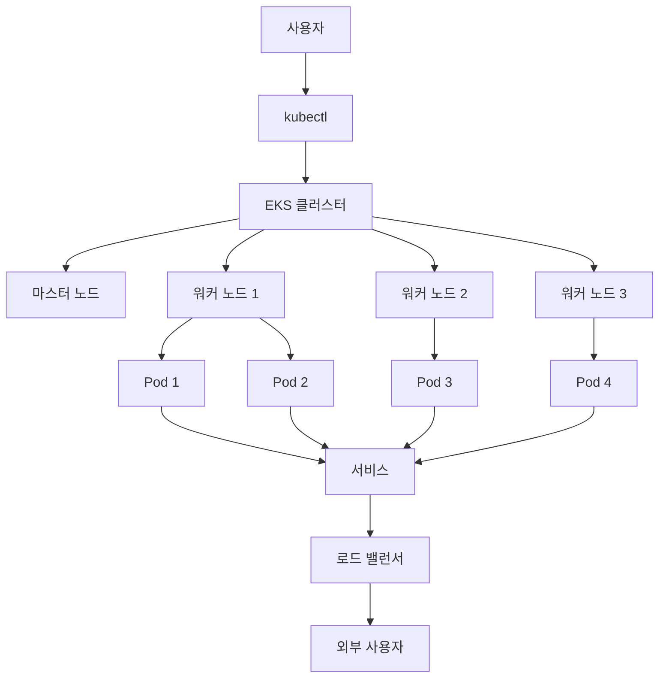

# AWS EKS (Elastic Kubernetes Service)

## 배경

### AWS EKS란?
AWS EKS(Elastic Kubernetes Service)는 AWS에서 제공하는 관리형 Kubernetes 서비스입니다. Kubernetes 클러스터의 컨트롤 플레인을 AWS가 관리해주므로, 사용자는 애플리케이션 배포와 관리에만 집중할 수 있습니다.

### EKS의 주요 특징
- **완전 관리형**: AWS가 Kubernetes 컨트롤 플레인을 관리
- **고가용성**: 여러 가용영역(AZ)에 분산 배치
- **보안**: IAM과 통합된 인증 및 권한 관리
- **확장성**: 자동 스케일링 및 로드 밸런싱 지원
- **호환성**: 표준 Kubernetes API 지원

### EKS 아키텍처


## 핵심

### EKS 구성 요소

#### 1. EKS 클러스터
- **역할**: Kubernetes 클러스터의 컨트롤 플레인을 관리
- **관리**: AWS가 완전히 관리 (사용자는 접근 불가)
- **고가용성**: 여러 가용영역(AZ)에 분산 배치

#### 2. 노드 그룹 (Node Group)
- **정의**: 워커 노드들의 그룹
- **타입**: 
  - **EC2 기반**: 사용자가 직접 관리하는 서버
  - **Fargate 기반**: 서버리스 방식 (AWS가 관리)

#### 3. Pod
- **정의**: Kubernetes의 최소 실행 단위
- **특징**: 
  - 하나 이상의 컨테이너 포함 가능
  - 고유한 IP 주소 보유
  - 생명주기 관리

#### 4. 서비스 (Service)
- **역할**: Pod의 네트워크 접근 관리
- **타입**:
  - **ClusterIP**: 클러스터 내부 접근
  - **NodePort**: 노드 포트를 통한 외부 접근
  - **LoadBalancer**: 로드 밸런서를 통한 외부 접근

#### 5. 로드 밸런서 (Load Balancer)
- **역할**: 외부 트래픽을 여러 Pod에 분산
- **타입**: AWS ALB (Application Load Balancer) 또는 NLB (Network Load Balancer)

### 기본 용어 이해하기

#### Kubernetes 핵심 개념
- **Pod**: 컨테이너가 실행되는 최소 단위
- **Deployment**: Pod의 복제본을 관리하는 리소스
- **Service**: Pod에 대한 네트워크 접근을 제공
- **Namespace**: 클러스터 내 리소스를 논리적으로 분리
- **ConfigMap/Secret**: 설정 정보와 민감한 데이터 관리

## 예시

### EKS 클러스터 생성 및 관리

#### 1. 필요한 도구 설치

```bash
# AWS CLI 설치 (이미 설치되어 있다면 생략)
curl "https://awscli.amazonaws.com/awscli-exe-linux-x86_64.zip" -o "awscliv2.zip"
unzip awscliv2.zip
sudo ./aws/install

# kubectl 설치
curl -LO "https://dl.k8s.io/release/$(curl -L -s https://dl.k8s.io/release/stable.txt)/bin/linux/amd64/kubectl"
sudo install -o root -g root -m 0755 kubectl /usr/local/bin/kubectl

# eksctl 설치
curl --silent --location "https://github.com/weaveworks/eksctl/releases/latest/download/eksctl_$(uname -s)_amd64.tar.gz" | tar xz -C /tmp
sudo mv /tmp/eksctl /usr/local/bin
```

#### 2. EKS 클러스터 생성

```bash
eksctl create cluster \
  --name my-eks-cluster \
  --region ap-northeast-2 \
  --nodegroup-name standard-workers \
  --node-type t3.medium \
  --nodes 3 \
  --nodes-min 1 \
  --nodes-max 5
```

| 파라미터 | 설명 | 예시 값 |
|----------|------|---------|
| `--name` | 클러스터 이름 | `my-eks-cluster` |
| `--region` | AWS 리전 | `ap-northeast-2` (서울) |
| `--nodegroup-name` | 노드 그룹 이름 | `standard-workers` |
| `--node-type` | EC2 인스턴스 타입 | `t3.medium` (2vCPU, 4GB RAM) |
| `--nodes` | 초기 노드 수 | `3` |
| `--nodes-min` | 최소 노드 수 | `1` |
| `--nodes-max` | 최대 노드 수 | `5` |

#### 3. 클러스터 상태 확인

```bash
# 노드 상태 확인
kubectl get nodes

# 예상 출력
NAME                                      STATUS   ROLES    AGE   VERSION
ip-10-0-1-100.ap-northeast-2.compute.internal   Ready    <none>   5m   v1.24.0
ip-10-0-1-101.ap-northeast-2.compute.internal   Ready    <none>   5m   v1.24.0
ip-10-0-1-102.ap-northeast-2.compute.internal   Ready    <none>   5m   v1.24.0
```

### Kubernetes 애플리케이션 배포

#### nginx 웹 서버 배포 예제

**1단계: Deployment 생성**

```yaml
# nginx-deployment.yaml
apiVersion: apps/v1
kind: Deployment
metadata:
  name: nginx-deployment
  labels:
    app: nginx
spec:
  replicas: 3
  selector:
    matchLabels:
      app: nginx
  template:
    metadata:
      labels:
        app: nginx
    spec:
      containers:
      - name: nginx
        image: nginx:1.21
        ports:
        - containerPort: 80
```

```bash
# Deployment 생성
kubectl apply -f nginx-deployment.yaml

# Deployment 상태 확인
kubectl get deployments
kubectl describe deployment nginx-deployment
```

**2단계: 서비스 생성 (외부 접근 가능)**

```yaml
# nginx-service.yaml
apiVersion: v1
kind: Service
metadata:
  name: nginx-service
spec:
  type: LoadBalancer
  selector:
    app: nginx
  ports:
  - protocol: TCP
    port: 80
    targetPort: 80
```

```bash
# 서비스 생성
kubectl apply -f nginx-service.yaml

# 서비스 상태 확인
kubectl get svc

# 외부 IP 확인 (LoadBalancer 생성 완료까지 몇 분 소요)
kubectl get svc nginx-service -w
```

**3단계: 애플리케이션 접근**

```bash
# 외부 IP로 접근 테스트
curl http://<EXTERNAL-IP>

# 또는 브라우저에서 http://<EXTERNAL-IP> 접속
```

### 자동 스케일링 설정

#### Horizontal Pod Autoscaler (HPA)

```yaml
# nginx-hpa.yaml
apiVersion: autoscaling/v2
kind: HorizontalPodAutoscaler
metadata:
  name: nginx-hpa
spec:
  scaleTargetRef:
    apiVersion: apps/v1
    kind: Deployment
    name: nginx-deployment
  minReplicas: 1
  maxReplicas: 10
  metrics:
  - type: Resource
    resource:
      name: cpu
      target:
        type: Utilization
        averageUtilization: 70
```

```bash
# HPA 생성
kubectl apply -f nginx-hpa.yaml

# HPA 상태 확인
kubectl get hpa
```

### ConfigMap과 Secret 사용

#### ConfigMap 예제

```yaml
# config.yaml
apiVersion: v1
kind: ConfigMap
metadata:
  name: app-config
data:
  database_url: "mongodb://localhost:27017"
  api_version: "v1"
  environment: "production"
```

#### Secret 예제

```yaml
# secret.yaml
apiVersion: v1
kind: Secret
metadata:
  name: app-secret
type: Opaque
data:
  username: YWRtaW4=  # base64 encoded "admin"
  password: cGFzc3dvcmQ=  # base64 encoded "password"
```

#### Pod에서 ConfigMap과 Secret 사용

```yaml
# app-pod.yaml
apiVersion: v1
kind: Pod
metadata:
  name: app-pod
spec:
  containers:
  - name: app
    image: myapp:latest
    env:
    - name: DB_URL
      valueFrom:
        configMapKeyRef:
          name: app-config
          key: database_url
    - name: USERNAME
      valueFrom:
        secretKeyRef:
          name: app-secret
          key: username
    - name: PASSWORD
      valueFrom:
        secretKeyRef:
          name: app-secret
          key: password
```

## 운영 팁

### 클러스터 관리

#### 1. 노드 그룹 업데이트

```bash
# 노드 그룹 업데이트 (롤링 업데이트)
eksctl upgrade nodegroup \
  --cluster=my-eks-cluster \
  --name=standard-workers \
  --kubernetes-version=1.24

# 클러스터 업데이트
eksctl upgrade cluster --name=my-eks-cluster --region=ap-northeast-2
```

#### 2. 모니터링 및 로깅

```bash
# Pod 로그 확인
kubectl logs <pod-name>

# 실시간 로그 스트리밍
kubectl logs -f <pod-name>

# 특정 컨테이너의 로그
kubectl logs <pod-name> -c <container-name>

# 이전 컨테이너의 로그
kubectl logs <pod-name> --previous
```

#### 3. 리소스 관리

```bash
# 리소스 사용량 확인
kubectl top nodes
kubectl top pods

# 네임스페이스별 리소스 사용량
kubectl top pods --namespace=default
```

### 보안 고려사항

#### 1. IAM 역할 및 정책

```bash
# 서비스 계정에 IAM 역할 연결
eksctl create iamserviceaccount \
  --cluster=my-eks-cluster \
  --namespace=kube-system \
  --name=aws-node \
  --attach-policy-arn=arn:aws:iam::aws:policy/AmazonEKS_CNI_Policy \
  --approve
```

#### 2. 네트워크 정책

```yaml
# network-policy.yaml
apiVersion: networking.k8s.io/v1
kind: NetworkPolicy
metadata:
  name: default-deny
spec:
  podSelector: {}
  policyTypes:
  - Ingress
  - Egress
```

#### 3. Pod 보안 정책

```yaml
# psp.yaml
apiVersion: policy/v1beta1
kind: PodSecurityPolicy
metadata:
  name: restricted
spec:
  privileged: false
  allowPrivilegeEscalation: false
  requiredDropCapabilities:
  - ALL
  volumes:
  - 'configMap'
  - 'emptyDir'
  - 'projected'
  - 'secret'
  - 'downwardAPI'
  - 'persistentVolumeClaim'
  hostNetwork: false
  hostIPC: false
  hostPID: false
  runAsUser:
    rule: 'MustRunAsNonRoot'
  seLinux:
    rule: 'RunAsAny'
  supplementalGroups:
    rule: 'MustRunAs'
    ranges:
    - min: 1
      max: 65535
  fsGroup:
    rule: 'MustRunAs'
    ranges:
    - min: 1
      max: 65535
  readOnlyRootFilesystem: true
```

### 비용 최적화

#### 1. 인스턴스 타입 선택

```bash
# 비용 효율적인 인스턴스 타입 사용
eksctl create cluster \
  --name cost-optimized-cluster \
  --node-type t3.small \
  --nodes 2 \
  --nodes-min 1 \
  --nodes-max 3
```

#### 2. 스팟 인스턴스 활용

```bash
# 스팟 인스턴스 노드 그룹 생성
eksctl create nodegroup \
  --cluster=my-eks-cluster \
  --name=spot-workers \
  --node-type=t3.medium \
  --nodes=2 \
  --nodes-min=1 \
  --nodes-max=5 \
  --spot
```

#### 3. 클러스터 정리

```bash
# 사용하지 않는 클러스터 삭제
eksctl delete cluster --name my-eks-cluster --region ap-northeast-2

# 특정 노드 그룹만 삭제
eksctl delete nodegroup --cluster=my-eks-cluster --name=standard-workers
```

## 참고

### EKS vs ECS 비교

| 특징 | EKS | ECS |
|------|-----|-----|
| **관리 복잡성** | 높음 (Kubernetes 지식 필요) | 낮음 (간단한 API) |
| **커스터마이징** | 높음 (완전한 Kubernetes 기능) | 제한적 (AWS 서비스 중심) |
| **학습 곡선** | 가파름 | 완만함 |
| **호환성** | 표준 Kubernetes | AWS 전용 |
| **비용** | 높음 (마스터 노드 비용) | 낮음 (서버리스 옵션) |
| **사용 사례** | 복잡한 마이크로서비스 | 단순한 컨테이너 워크로드 |

### EKS 모니터링 도구

#### 1. CloudWatch Container Insights

```bash
# Container Insights 활성화
kubectl apply -f https://raw.githubusercontent.com/aws-samples/amazon-cloudwatch-container-insights/latest/k8s-deployment-manifest-templates/deployment-mode/daemonset/container-insights-monitoring/quickstart/cwagent-fluentd-quickstart.yaml
```

#### 2. Prometheus + Grafana

```bash
# Helm을 사용한 Prometheus 설치
helm repo add prometheus-community https://prometheus-community.github.io/helm-charts
helm install prometheus prometheus-community/kube-prometheus-stack
```

### CI/CD 파이프라인 연동

#### GitHub Actions 예제

```yaml
# .github/workflows/deploy.yml
name: Deploy to EKS

on:
  push:
    branches: [ main ]

jobs:
  deploy:
    runs-on: ubuntu-latest
    steps:
    - uses: actions/checkout@v2
    
    - name: Configure AWS credentials
      uses: aws-actions/configure-aws-credentials@v1
      with:
        aws-access-key-id: ${{ secrets.AWS_ACCESS_KEY_ID }}
        aws-secret-access-key: ${{ secrets.AWS_SECRET_ACCESS_KEY }}
        aws-region: ap-northeast-2
    
    - name: Update kubeconfig
      run: aws eks update-kubeconfig --name my-eks-cluster --region ap-northeast-2
    
    - name: Deploy to EKS
      run: |
        kubectl apply -f k8s/
        kubectl rollout status deployment/myapp
```

### 결론
AWS EKS는 Kubernetes의 강력한 기능을 AWS의 관리형 서비스로 제공합니다.
복잡한 컨테이너 오케스트레이션이 필요한 경우에 적합하며,
적절한 모니터링과 보안 설정을 통해 안정적인 운영이 가능합니다.
비용과 복잡성을 고려하여 프로젝트 요구사항에 맞는 선택을 하는 것이 중요합니다.
