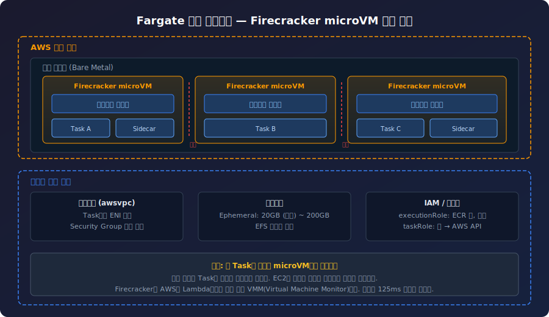
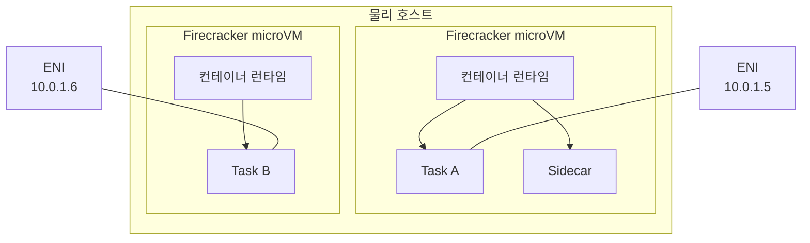
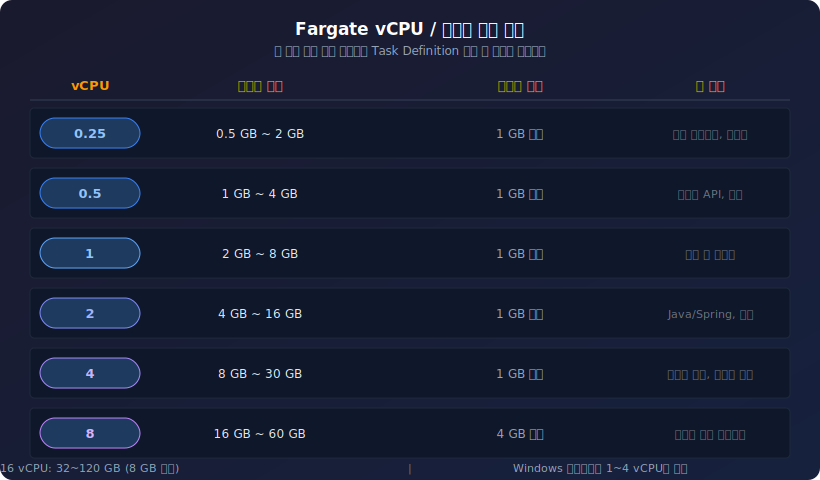
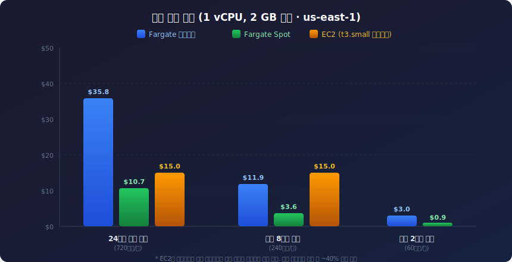

# AWS Fargate

## 개요

AWS Fargate는 서버를 관리하지 않고 컨테이너를 실행하는 서버리스 컴퓨팅 엔진이다. EC2 인스턴스를 프로비저닝하거나 관리할 필요 없이 컨테이너만 정의하면 AWS가 인프라를 자동으로 관리한다.

ECS, EKS 두 오케스트레이터 모두에서 실행 모드로 선택할 수 있다. EC2 모드와의 비교는 [ECS 문서](ECS.md)에 정리되어 있으므로, 이 문서에서는 Fargate 자체의 구조와 운영에 집중한다.

### Fargate 내부 아키텍처

Fargate의 핵심은 Firecracker microVM이다. 각 Task는 독립된 경량 VM 위에서 실행되기 때문에 다른 고객의 워크로드와 커널을 공유하지 않는다.





Firecracker는 AWS가 Lambda용으로 만든 경량 VMM(Virtual Machine Monitor)이다. 부팅에 125ms 미만이 걸린다. 이 구조 덕분에 Fargate Task는 EC2와 동등한 수준의 하드웨어 격리를 제공하면서도, 개발자는 VM을 신경 쓸 필요가 없다.

### 서버리스의 의미

"서버리스"는 서버가 없다는 뜻이 아니다. 서버는 존재하지만, 개발자가 관리하지 않는다는 의미다.

Lambda와 비교하면 역할이 다르다.

- Lambda: 함수 단위, 15분 실행 제한, 이벤트 기반
- Fargate: 컨테이너 단위, 시간 제한 없음, 지속 실행 가능

Fargate는 전통적인 웹 애플리케이션을 서버리스로 실행할 수 있게 해준다.

## vCPU / 메모리 조합

Fargate는 정해진 vCPU-메모리 조합만 사용할 수 있다. 잘못된 조합으로 Task Definition을 등록하면 바로 에러가 난다.



| vCPU | 메모리 범위 | 단위 | 주 용도 |
|------|------------|------|---------|
| 0.25 | 0.5 ~ 2 GB | 1 GB | 경량 사이드카, 프록시 |
| 0.5 | 1 ~ 4 GB | 1 GB | 가벼운 API, 워커 |
| 1 | 2 ~ 8 GB | 1 GB | 일반 웹 서비스 |
| 2 | 4 ~ 16 GB | 1 GB | Java/Spring, 배치 |
| 4 | 8 ~ 30 GB | 1 GB | 고사양 연산, 데이터 처리 |
| 8 | 16 ~ 60 GB | 4 GB | 메모리 집약 워크로드 |
| 16 | 32 ~ 120 GB | 8 GB | 대규모 인메모리 처리 |

Windows 컨테이너는 1~4 vCPU만 지원한다.

**리소스 할당 시 주의할 점:**

처음에는 작은 리소스로 시작한다. 0.5 vCPU, 1 GB 메모리. CloudWatch 메트릭으로 실제 사용량을 확인한 후 조정한다. 과도하게 할당하면 비용만 증가한다.

Spring Boot 같은 JVM 기반 애플리케이션은 힙 메모리 설정에 주의해야 한다. Task 메모리를 2 GB로 잡았는데 JVM 힙을 1.5 GB로 설정하면, 메타스페이스와 네이티브 메모리를 합치면 OOM으로 Task가 죽는 경우가 있다. Task 메모리의 60~70% 정도를 힙으로 잡는 게 안전하다.

```bash
# Task 메모리 2048MB일 때 JVM 설정 예시
JAVA_OPTS="-Xms1024m -Xmx1280m -XX:MaxMetaspaceSize=256m"
```

## 비용 구조

Fargate는 Task가 실행되는 시간만큼 비용이 발생한다. vCPU와 메모리 사용량에 따라 초 단위로 청구되며, 최소 1분 과금이다.

**가격 (us-east-1 기준):**

- vCPU: $0.04048/시간
- 메모리: $0.004445/GB/시간



### 비용 계산 예시

**24시간 실행하는 웹 서비스 (1 vCPU, 2 GB, 1개 Task):**

- vCPU: 1 x $0.04048 x 720시간 = $29.1
- 메모리: 2 x $0.004445 x 720시간 = $6.4
- 월 합계: 약 $35.5

**하루 2시간 배치 작업 (1 vCPU, 2 GB):**

- vCPU: 1 x $0.04048 x 60시간 = $2.4
- 메모리: 2 x $0.004445 x 60시간 = $0.5
- 월 합계: 약 $2.9

간헐적으로 실행되는 워크로드에서 Fargate의 비용 이점이 크다. EC2는 배치 작업이 안 돌아도 인스턴스가 켜져 있으면 비용이 나간다.

### Fargate Savings Plans

1년 또는 3년 약정으로 최대 50%까지 할인받을 수 있다. Compute Savings Plans은 Fargate, Lambda, EC2에 모두 적용되므로 워크로드가 혼재된 환경에서 유리하다.

## Fargate Spot

Fargate Spot은 온디맨드 대비 최대 70% 저렴하다.

### 중단 메커니즘

1. AWS가 용량이 필요하면 Task를 중단한다
2. 2분 전에 SIGTERM 신호를 보낸다
3. 2분 후 SIGKILL 신호로 강제 종료한다

ECS Service는 자동으로 새 Task를 시작한다. 새 Task는 온디맨드 또는 Spot으로 시작된다.

### 혼합 전략

온디맨드와 Spot을 섞어서 사용한다.

```json
{
  "capacityProviderStrategy": [
    {
      "capacityProvider": "FARGATE",
      "weight": 1,
      "base": 2
    },
    {
      "capacityProvider": "FARGATE_SPOT",
      "weight": 4,
      "base": 0
    }
  ]
}
```

- base: 2 → 최소 2개는 온디맨드로 실행
- weight 비율: FARGATE 1, FARGATE_SPOT 4 → 추가 Task는 80% Spot, 20% 온디맨드

desired count가 7이면:

- 온디맨드: 2 (base) + 1 (20%) = 3개
- Spot: 4 (80%) = 4개

중요한 Task는 항상 온디맨드로 실행한다. base를 설정해 최소 개수를 보장하고, 추가 Task는 Spot으로 비용을 절감한다.

### Spot 중단 대응

Spot Task가 중단될 때 데이터 유실이나 요청 실패가 발생하지 않도록 준비해야 한다.

**SIGTERM 핸들링:**

애플리케이션이 SIGTERM을 받으면 진행 중인 요청을 마무리하고 정리 작업을 수행해야 한다. Spring Boot는 graceful shutdown을 설정한다.

```yaml
# application.yml
server:
  shutdown: graceful

spring:
  lifecycle:
    timeout-per-shutdown-phase: 90s
```

Node.js는 직접 핸들러를 등록한다.

```javascript
process.on('SIGTERM', async () => {
  console.log('SIGTERM received, starting graceful shutdown');
  server.close();
  await drainConnections();
  await flushMetrics();
  process.exit(0);
});
```

**실무에서 겪는 문제:**

ALB 타겟 해제와 Spot 중단이 동시에 일어나면, ALB가 이미 죽은 Task로 요청을 보내는 순간이 생긴다. `deregistration_delay`를 Spot 중단 경고 시간(2분)보다 짧게 설정해야 한다. 120초 이하, 보통 30~60초로 설정한다.

```bash
aws elbv2 modify-target-group-attributes \
  --target-group-arn arn:aws:elasticloadbalancing:... \
  --attributes Key=deregistration_delay.timeout_seconds,Value=60
```

**SQS 기반 워커의 경우:**

메시지 처리 중 Spot이 중단되면 메시지가 유실될 수 있다. visibility timeout을 충분히 길게 잡고, 처리 완료 후에만 메시지를 삭제한다. 중단 시 처리 중이던 메시지는 visibility timeout이 지나면 다른 워커가 다시 가져간다.

```python
def process_message(message):
    try:
        do_work(message)
        sqs.delete_message(
            QueueUrl=queue_url,
            ReceiptHandle=message['ReceiptHandle']
        )
    except Exception:
        # 삭제하지 않으면 visibility timeout 후 재처리됨
        pass
```

**ECS Task 중단 이벤트 감지:**

EventBridge로 Spot 중단 이벤트를 잡아서 알림을 보낼 수 있다.

```json
{
  "source": ["aws.ecs"],
  "detail-type": ["ECS Task State Change"],
  "detail": {
    "stopCode": ["SpotInterruption"],
    "lastStatus": ["STOPPED"]
  }
}
```

이 이벤트를 SNS나 Slack 알림으로 연결해두면, Spot 중단 빈도를 모니터링할 수 있다. 중단이 너무 자주 발생하면 온디맨드 비율을 올려야 한다.

## 플랫폼 버전 관리

Fargate 플랫폼 버전은 커널, 컨테이너 런타임, 네트워크 스택 등 인프라 계층의 버전을 의미한다. EC2 모드에서 AMI를 관리하는 것과 비슷한 개념이지만, AWS가 제공하는 버전 중 선택만 하면 된다.

### 플랫폼 버전 종류 (Linux)

| 버전 | 주요 변경사항 |
|------|-------------|
| 1.4.0 | Ephemeral 스토리지 20GB→200GB 확장 가능, EFS 지원, SYS_PTRACE 기능, Task ENI 트렁킹 |
| 1.3.0 | Task ENI 플러그인 개선, Secrets Manager/SSM 파라미터 주입 |
| LATEST | 항상 최신 안정 버전을 가리킨다. 현재 1.4.0 |

### LATEST를 쓰면 안 되는 경우

프로덕션 서비스에서 `LATEST`를 쓰면 AWS가 플랫폼 버전을 올릴 때 예기치 않은 동작 변경이 발생할 수 있다. 테스트 없이 인프라 계층이 바뀌는 셈이다.

```json
{
  "platformVersion": "1.4.0"
}
```

명시적으로 버전을 고정하고, 새 버전이 나오면 스테이징에서 먼저 검증한 후 프로덕션에 적용한다.

**AWS가 플랫폼 버전을 은퇴시키는 경우:**

오래된 플랫폼 버전은 AWS가 은퇴(deprecate)시킨다. 은퇴된 버전에서 실행 중인 Task는 계속 동작하지만, 새 Task를 시작할 수 없게 된다. 은퇴 알림은 AWS Health Dashboard와 이메일로 온다. 이 알림을 놓치면 배포가 갑자기 실패하는 상황이 발생한다.

### 플랫폼 버전 확인

```bash
# 현재 서비스의 플랫폼 버전 확인
aws ecs describe-services \
  --cluster my-cluster \
  --services my-service \
  --query 'services[].platformVersion'

# 사용 가능한 플랫폼 버전 목록
aws ecs list-task-definitions \
  --query 'taskDefinitionArns'
```

## 이미지 캐싱과 시작 시간

Fargate의 Task 시작 시간은 이미지 크기에 크게 좌우된다. EC2 모드와 달리 Fargate는 호스트가 매번 바뀔 수 있어서 이미지 캐시가 보장되지 않는다.

### 시작 시간 구성

| 단계 | 소요 시간 |
|------|----------|
| microVM 부팅 | 수백 ms |
| ENI 할당 | 1~5초 |
| 이미지 풀 | 5초 ~ 수 분 (이미지 크기에 따라) |
| 컨테이너 시작 | 1~3초 |
| 헬스 체크 통과 | 설정에 따라 다름 |

이미지 크기가 1 GB를 넘으면 풀하는 데만 1분 이상 걸리는 경우가 있다. 콜드 스타트가 문제되는 서비스라면 이미지를 줄여야 한다.

### 이미지 크기 줄이기

**멀티 스테이지 빌드:**

```dockerfile
# 빌드 스테이지
FROM gradle:8-jdk21 AS build
COPY . /app
WORKDIR /app
RUN gradle bootJar --no-daemon

# 실행 스테이지
FROM eclipse-temurin:21-jre-alpine
COPY --from=build /app/build/libs/app.jar /app.jar
EXPOSE 8080
ENTRYPOINT ["java", "-jar", "/app.jar"]
```

JDK 이미지(약 600 MB) 대신 JRE 이미지(약 200 MB)를 쓰는 것만으로 시작 시간이 크게 줄어든다. Alpine 기반 이미지를 쓰면 더 줄일 수 있다.

**이미지 크기 비교:**

| 베이스 이미지 | 크기 | 비고 |
|-------------|------|------|
| ubuntu:22.04 | ~77 MB | 범용, 디버깅 도구 포함 |
| debian:slim | ~52 MB | 불필요한 패키지 제거 |
| alpine:3.19 | ~7 MB | musl libc, 일부 호환성 이슈 |
| distroless | ~20 MB | 셸 없음, 디버깅 어려움 |
| scratch | 0 MB | Go 바이너리 등 정적 빌드 전용 |

### SOCI (Seekable OCI) 인덱스

Fargate는 SOCI(Seekable OCI)를 지원한다. 이미지 전체를 다운로드하지 않고 필요한 레이어만 지연 로드한다. 이미지가 클수록 효과가 크다.

SOCI 인덱스를 ECR에 미리 생성해두면 Fargate가 자동으로 인식한다.

```bash
# SOCI CLI로 인덱스 생성
soci create 123456789012.dkr.ecr.ap-northeast-2.amazonaws.com/my-app:v1.2.3

# ECR에 인덱스 푸시
soci push 123456789012.dkr.ecr.ap-northeast-2.amazonaws.com/my-app:v1.2.3
```

250 MB 이상 이미지에서 시작 시간이 눈에 띄게 줄어든다. 750 MB 이미지 기준으로 풀 시간이 약 50% 단축된 사례가 있다.

**SOCI 적용 시 주의사항:**

- SOCI 인덱스는 이미지 태그별로 생성해야 한다. `latest` 태그를 계속 덮어쓰면 인덱스가 무효화된다
- 플랫폼 버전 1.4.0 이상에서만 동작한다
- ECR에 인덱스를 푸시할 권한이 필요하다 (ecr:BatchCheckLayerAvailability, ecr:PutImage)

### ECR 풀 캐시 동작

같은 리전의 ECR에서 이미지를 풀하면 네트워크 비용이 발생하지 않는다. 다른 리전 ECR이나 Docker Hub에서 풀하면 NAT Gateway 비용이 추가된다. ECR 풀스루 캐시를 사용하면 Docker Hub 이미지를 ECR에 자동으로 캐시할 수 있다.

```bash
# ECR 풀스루 캐시 규칙 생성
aws ecr create-pull-through-cache-rule \
  --ecr-repository-prefix docker-hub \
  --upstream-registry-url registry-1.docker.io
```

이 설정 후 `123456789012.dkr.ecr.ap-northeast-2.amazonaws.com/docker-hub/library/nginx:latest`로 이미지를 참조하면, ECR이 Docker Hub에서 자동으로 풀해서 캐시한다.

## ECS Fargate 사용법

### Task Definition 작성

Task Definition은 컨테이너 실행 방법을 정의한다.

**필수 설정:**

1. `networkMode`: 반드시 `awsvpc`여야 한다. Fargate는 awsvpc 모드만 지원한다
2. `requiresCompatibilities`: `["FARGATE"]`를 명시한다
3. `cpu`와 `memory`: Task 레벨에서 지정한다. 컨테이너 레벨이 아니다

```json
{
  "family": "my-web-app",
  "networkMode": "awsvpc",
  "requiresCompatibilities": ["FARGATE"],
  "cpu": "512",
  "memory": "1024",
  "executionRoleArn": "arn:aws:iam::123456789012:role/ecsTaskExecutionRole",
  "taskRoleArn": "arn:aws:iam::123456789012:role/myTaskRole",
  "containerDefinitions": [
    {
      "name": "web",
      "image": "my-app:latest",
      "portMappings": [
        {
          "containerPort": 8080,
          "protocol": "tcp"
        }
      ],
      "environment": [
        {
          "name": "NODE_ENV",
          "value": "production"
        }
      ],
      "logConfiguration": {
        "logDriver": "awslogs",
        "options": {
          "awslogs-group": "/ecs/my-web-app",
          "awslogs-region": "us-west-2",
          "awslogs-stream-prefix": "ecs"
        }
      }
    }
  ]
}
```

### Service 생성과 설정

**네트워크 구성:**

```json
{
  "networkConfiguration": {
    "awsvpcConfiguration": {
      "subnets": [
        "subnet-12345678",
        "subnet-87654321"
      ],
      "securityGroups": [
        "sg-12345678"
      ],
      "assignPublicIp": "DISABLED"
    }
  }
}
```

- **Private Subnet + NAT Gateway**: Task가 Private IP만 받는다. NAT Gateway를 통해 외부 통신한다 (권장)
- **Private Subnet + VPC Endpoint**: 인터넷 없이 AWS 서비스에 접근한다. NAT Gateway 비용 절감

Private Subnet에서 실행하고, 외부 접근은 ALB를 통해서만 허용한다.

**Auto Scaling 설정:**

```json
{
  "policyType": "TargetTrackingScaling",
  "targetTrackingScalingPolicyConfiguration": {
    "targetValue": 70.0,
    "predefinedMetricSpecification": {
      "predefinedMetricType": "ECSServiceAverageCPUUtilization"
    },
    "scaleOutCooldown": 60,
    "scaleInCooldown": 300
  }
}
```

- scaleOutCooldown을 짧게: 트래픽 급증에 빠르게 대응
- scaleInCooldown을 길게: 불필요한 축소를 방지
- CPU 70% 목표가 일반적이다

## 운영 트러블슈팅

### Task가 시작되지 않는 경우

**CannotPullContainerError:**

가장 흔한 에러다. 원인은 대부분 네트워크 문제다.

- Private Subnet인데 NAT Gateway가 없거나 라우팅 테이블에 NAT가 빠져 있다
- ECR VPC Endpoint를 쓰는데 S3 Gateway Endpoint가 빠져 있다 (ECR 이미지 레이어는 S3에 저장된다)
- Security Group 아웃바운드에 443 포트가 막혀 있다

```bash
# VPC Endpoint 확인
aws ec2 describe-vpc-endpoints \
  --filters Name=vpc-id,Values=vpc-xxx \
  --query 'VpcEndpoints[].{Service:ServiceName,State:State}'
```

**ResourceNotFoundException (Task execution role):**

executionRoleArn에 지정한 IAM Role이 없거나 권한이 부족한 경우다. 최소한 아래 권한이 필요하다.

- `ecr:GetAuthorizationToken`
- `ecr:BatchGetImage`
- `ecr:GetDownloadUrlForLayer`
- `logs:CreateLogStream`
- `logs:PutLogEvents`

### Task가 반복적으로 죽는 경우

**OOM(Out of Memory) Kill:**

Task 메모리를 초과하면 Task가 종료된다. CloudWatch에서 `MemoryUtilization`이 100%에 가까웠는지 확인한다. 컨테이너 내부에서 실제 메모리 사용량을 확인하려면 ECS Exec을 쓴다.

```bash
aws ecs execute-command \
  --cluster my-cluster \
  --task abc123 \
  --container web \
  --interactive \
  --command "/bin/sh"

# 컨테이너 내부에서
cat /sys/fs/cgroup/memory/memory.usage_in_bytes
cat /sys/fs/cgroup/memory/memory.limit_in_bytes
```

**Health Check 실패:**

ALB Health Check가 실패하면 ECS가 Task를 종료하고 새로 시작한다. `startPeriod`를 충분히 길게 설정해야 한다. Spring Boot처럼 시작에 30초 이상 걸리는 애플리케이션은 `startPeriod`를 60~120초로 잡는다.

### ENI 할당 실패

서브넷의 가용 IP가 부족하면 Task가 시작되지 않는다. `awsvpc` 모드에서 Task마다 ENI를 하나씩 사용하기 때문에, 서브넷 CIDR을 넉넉하게 잡아야 한다. `/24`(254개 IP)는 소규모 서비스에는 충분하지만, Task 수가 많으면 빠르게 소진된다.

```bash
# 서브넷 가용 IP 확인
aws ec2 describe-subnets \
  --subnet-ids subnet-xxx \
  --query 'Subnets[].AvailableIpAddressCount'
```

## 참고

- AWS Fargate 사용자 가이드: https://docs.aws.amazon.com/AmazonECS/latest/userguide/what-is-fargate.html
- ECS Fargate 시작하기: https://docs.aws.amazon.com/AmazonECS/latest/developerguide/getting-started-fargate.html
- EKS Fargate: https://docs.aws.amazon.com/eks/latest/userguide/fargate.html
- Fargate 요금: https://aws.amazon.com/fargate/pricing/
- Firecracker: https://firecracker-microvm.github.io/
- SOCI Snapshotter: https://github.com/awslabs/soci-snapshotter
