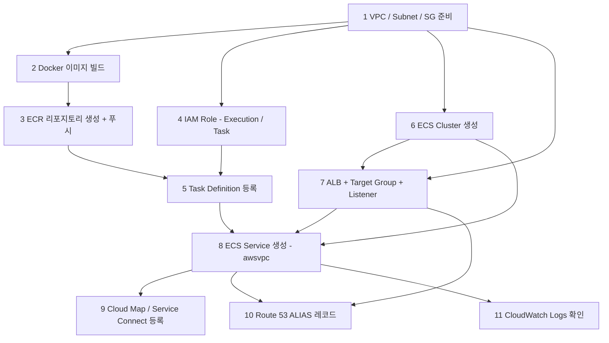
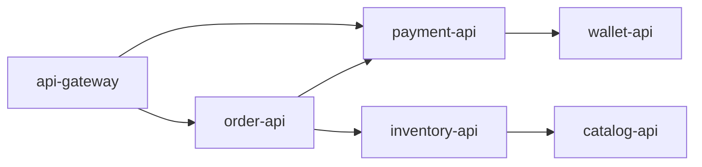

# Fargate로 MSA 서버 처음 띄우기

## 개요

Fargate는 EC2를 직접 다루지 않고 컨테이너만 정의하면 돌아가는 실행 모드라서, 처음 배포할 때 "ECS만 알면 되겠지" 하고 시작하면 의외로 막히는 지점이 많다. ENI가 어떻게 붙는지, 헬스체크 grace period가 왜 필요한지, ALB가 504를 뱉을 때 어디부터 봐야 하는지 같은 것들은 ECS 단일 개념 문서로는 한 번에 이해되지 않는다. 그래서 이 문서는 처음부터 끝까지 한 줄로 따라갈 수 있게 워크플로우 순서대로 정리한다. 컨테이너 이미지 빌드에서 도메인 연결까지가 한 흐름이다.

MSA 컨텍스트라는 게 핵심이다. 단일 서비스 하나만 띄우면 ALB 한 대에 Target Group 하나, Task Definition 하나로 끝나지만, 5~10개 서비스가 서로 호출하는 구조에서는 디스커버리, 의존성 순서, 환경 분리 같은 부분에서 첫 배포가 산으로 간다. 5년 동안 사내 플랫폼 팀에서 ECS Fargate로 dev/stage/prod 클러스터 세 벌을 운영해 본 경험을 기준으로 쓴다.

각 자원의 파라미터 의미는 별도 문서에 따로 있다. 중복하지 않는다.

- Fargate 자체 구조: [Fargate](Fargate.md)
- Task Definition 필드: [ECS Task Definition 심화](ECS_Task_Definition.md)
- Service 정의 파라미터: [ECS Service 설정 심화](ECS_Service_Definition.md)
- Cluster 구성: [ECS Cluster 구성](ECS_Cluster_Configuration.md)
- 네트워킹 모드: [ECS Networking Modes](ECS_Networking_Modes.md)
- Capacity Provider 동작: [ECS Capacity Providers](ECS_Capacity_Providers.md)
- Service Connect 상세: [ECS Service Connect](ECS_Service_Connect.md)
- ECR 운영: [ECR](ECR.md)
- ENI 한계: [ECS ENI 제한과 Task 한계](ECS_ENI_제한과_Task_한계.md)

## 전체 워크플로우 한 장

처음 배포할 때 어떤 자원을 어떤 순서로 만들어야 하는지부터 머리에 그려야 한다. 의존성이 있는 자원은 앞 자원이 없으면 만들 수 없다.



이 순서는 매번 같다. CLI로 짜든 Terraform으로 짜든 차이가 없다. 1번부터 5번까지는 한 번 만들어두면 거의 안 건드리는 정적 자원이고, 6번 이후가 서비스마다 반복되는 부분이다. Cluster는 환경별로 한 개씩이면 충분하니까 사실상 서비스마다 새로 만드는 건 Task Definition, Target Group, Service, Cloud Map 등록, Route 53 레코드 정도다.

MSA에서 서비스 N개를 띄우면 6번까지는 한 번이고, 7~11번을 N번 반복한다. Terraform 모듈로 묶어두면 신규 서비스 추가가 변수 몇 개 바꾸는 작업으로 줄어든다.

## 1. VPC와 서브넷, Security Group 설계

Fargate 태스크는 awsvpc 네트워크 모드로만 동작한다. 즉 태스크 하나마다 ENI 한 개가 붙고, 그 ENI는 서브넷의 IP를 하나 차지한다. 이 사실 하나가 VPC 설계의 거의 전부를 결정한다.

### 서브넷 크기

대충 /24(256개) 서브넷에 100개 태스크면 충분하다고 생각하면 안 된다. 같은 서브넷에 RDS, ElastiCache, Lambda, NAT, VPC 엔드포인트, 다른 EC2 인스턴스가 같이 있으면 IP가 빠르게 빠진다. 게다가 서비스 배포할 때 deploymentConfiguration의 maximumPercent가 200이면 일시적으로 desiredCount의 2배가 떠 있는다. 50개 태스크 desired면 배포 중 100개까지 ENI를 잡는다.

운영 환경 기준으로는 /23(512개) 또는 /22(1024개)를 ECS 전용 private 서브넷으로 할당하는 게 안전하다. AZ 3개에 각각 하나씩.

```bash
aws ec2 create-subnet \
  --vpc-id vpc-0abc1234 \
  --cidr-block 10.0.16.0/22 \
  --availability-zone ap-northeast-2a \
  --tag-specifications 'ResourceType=subnet,Tags=[{Key=Name,Value=ecs-private-2a}]'
```

태스크는 private 서브넷에 두고, ALB만 public 서브넷에 둔다. private 서브넷의 outbound는 NAT Gateway로 나간다. NAT 비용이 부담스러우면 ECR, S3, CloudWatch Logs, Secrets Manager 같은 자주 쓰는 서비스는 VPC Endpoint(Interface 또는 Gateway)로 빼면 NAT 트래픽이 줄어든다. 작은 클러스터에서도 월 수십 달러 단위로 차이가 난다.

### Security Group 두 단계 구조

ALB와 태스크에 SG를 각각 따로 둬야 한다. 그리고 두 번째 SG는 첫 번째 SG를 source로 참조하게 만든다.

```bash
# ALB용 SG
aws ec2 create-security-group \
  --group-name alb-public-sg --description "ALB inbound 443" --vpc-id vpc-0abc1234

aws ec2 authorize-security-group-ingress \
  --group-id sg-alb \
  --protocol tcp --port 443 --cidr 0.0.0.0/0

# Task용 SG - source가 SG ID
aws ec2 create-security-group \
  --group-name ecs-task-sg --description "Task from ALB only" --vpc-id vpc-0abc1234

aws ec2 authorize-security-group-ingress \
  --group-id sg-task \
  --protocol tcp --port 8080 \
  --source-group sg-alb
```

CIDR로 열지 말고 SG ID로 참조해야 한다. 이렇게 두면 ALB에서만 태스크에 들어갈 수 있고, 나중에 ALB가 새 IP를 받아도 SG를 안 건드려도 된다. 같은 VPC 안의 다른 서비스들이 서로 호출할 때도 SG 간 참조로만 권한을 주면 IP가 바뀌어도 영향이 없다.

자주 빠뜨리는 건 outbound다. Fargate 태스크는 ECR에서 이미지를 pull해야 하는데, 기본 SG가 모든 outbound를 허용하면 괜찮지만 회사 정책으로 outbound를 막아둔 경우 ECR 도메인이나 VPC Endpoint로 가는 길이 안 뚫려서 태스크가 PROVISIONING 상태로 멈춘다.

## 2. Docker 이미지 빌드

이미지 빌드 자체는 평범한 도커지만, Fargate에서 돌릴 때 몇 가지 챙겨야 하는 것들이 있다.

### Multi-stage 빌드

운영 이미지 크기가 ECR pull 시간에 직접적으로 영향을 준다. Fargate 태스크 시작이 느린 이유는 거의 다 이미지 pull 시간이다. Node.js 풀-디펜던시 빌드를 그대로 운영에 쓰면 1.5GB까지 가는데, multi-stage로 빌드 산출물만 옮기면 250MB 안쪽으로 줄어든다.

```dockerfile
FROM node:20-alpine AS builder
WORKDIR /app
COPY package*.json ./
RUN npm ci
COPY . .
RUN npm run build

FROM node:20-alpine AS runner
WORKDIR /app
ENV NODE_ENV=production
COPY --from=builder /app/package*.json ./
RUN npm ci --omit=dev
COPY --from=builder /app/dist ./dist
EXPOSE 8080
CMD ["node", "dist/server.js"]
```

이미지 풀 시간이 30초에서 5초로 줄면 롤링 배포 한 번에 분 단위 차이가 난다.

### 플랫폼 명시

M1/M2 맥에서 빌드한 이미지를 그대로 ECR에 푸시하면 arm64 이미지가 올라간다. Fargate 태스크 정의에서 `runtimePlatform.cpuArchitecture`를 지정하지 않으면 기본 x86_64로 떠서 "exec format error"가 뜬다. buildx로 명시 빌드해야 한다.

```bash
docker buildx build \
  --platform linux/amd64 \
  -t order-api:0.1.0 \
  --load .
```

ARM Graviton Fargate를 쓰면 x86 대비 비용이 20% 싸다. 단 컨테이너 안에서 쓰는 라이브러리가 arm64 빌드를 지원해야 한다. Python wheel, Node.js native addon, JNI 라이브러리는 호환 여부를 미리 봐야 한다.

### 헬스체크 엔드포인트

ECS Service에서 ALB 헬스체크 경로를 넘겨야 한다. 앱 안에 `/healthz` 같은 경로를 만들고, DB나 외부 API 의존성을 거기서 호출하지 않는 게 안전하다. DB가 잠시 늦어졌다고 헬스체크가 실패해서 태스크가 통째로 교체되면 장애가 더 커진다. liveness용 단순 200 응답과, readiness용 의존성 체크 응답을 분리해 두는 패턴을 쓴다.

```typescript
app.get('/healthz', (_, res) => res.status(200).send('ok'))
app.get('/readyz', async (_, res) => {
  const db = await pingDb()
  res.status(db ? 200 : 503).send(db ? 'ready' : 'not ready')
})
```

ALB Target Group의 헬스체크는 `/healthz`로, Service Connect 또는 Cloud Map 헬스체크는 `/readyz`로 두는 식으로 분리한다.

## 3. ECR 리포지토리와 푸시

ECR 운영은 별도 문서에 자세히 있으니 여기서는 첫 배포 흐름만 본다.

```bash
aws ecr create-repository \
  --repository-name order-api \
  --image-scanning-configuration scanOnPush=true \
  --image-tag-mutability IMMUTABLE

ACCOUNT_ID=$(aws sts get-caller-identity --query Account --output text)
REGION=ap-northeast-2
REPO=$ACCOUNT_ID.dkr.ecr.$REGION.amazonaws.com/order-api

aws ecr get-login-password --region $REGION \
  | docker login --username AWS --password-stdin $REPO

docker tag order-api:0.1.0 $REPO:0.1.0
docker push $REPO:0.1.0
```

태그를 IMMUTABLE로 하는 게 운영에서 정신건강에 좋다. `latest`를 덮어쓰는 방식은 어떤 커밋이 떠 있는지 추적이 안 된다. 항상 `0.1.0`, `0.1.1` 같이 의미 있는 버전 또는 git short SHA를 태그로 쓰고, 태스크 정의에 그 태그를 박아둔다.

라이프사이클 정책을 같이 만들어두지 않으면 ECR 비용이 야금야금 늘어난다. 30일 지난 untagged 이미지 정리, 운영 태그는 마지막 50개만 유지 같은 정책이 일반적이다.

## 4. IAM Role 두 개

Task Definition에는 Role이 두 개 들어간다. 이 둘이 헷갈리면 Secrets Manager에서 값을 못 읽어와 태스크가 STOPPED로 바뀐다.

- **executionRoleArn**: ECS 에이전트가 태스크를 띄울 때 쓴다. ECR pull, CloudWatch Logs 쓰기, Secrets Manager에서 환경변수로 주입할 비밀값 읽기.
- **taskRoleArn**: 컨테이너 안에서 돌아가는 앱이 AWS API 호출할 때 쓴다. S3 업로드, DynamoDB 접근, SQS 메시지 발행.

executionRole에는 AWS 관리형 정책 `AmazonECSTaskExecutionRolePolicy`가 출발점이다. 거기에 Secrets Manager / Parameter Store 권한을 추가한다.

```json
{
  "Version": "2012-10-17",
  "Statement": [
    {
      "Effect": "Allow",
      "Action": [
        "secretsmanager:GetSecretValue"
      ],
      "Resource": [
        "arn:aws:secretsmanager:ap-northeast-2:123456789012:secret:prod/order-api/*"
      ]
    },
    {
      "Effect": "Allow",
      "Action": ["kms:Decrypt"],
      "Resource": ["arn:aws:kms:ap-northeast-2:123456789012:key/abcd1234-..."]
    }
  ]
}
```

KMS 권한을 빠뜨리는 경우가 흔하다. Secrets Manager 비밀값이 KMS Customer Managed Key로 암호화돼 있으면 KMS Decrypt 권한이 따로 필요하다. 권한이 없으면 태스크 시작 단계에서 `ResourceInitializationError`로 실패하는데, 메시지가 길어서 끝까지 읽지 않으면 SecretsManager가 원인인지 KMS가 원인인지 안 보인다.

taskRole은 앱이 실제로 쓰는 권한만 좁게 준다. 운영 태스크가 IAM 권한 과다로 인한 사고를 만들어내는 경우가 적지 않다.

## 5. Task Definition 등록

전체 필드는 따로 정리해 두었으니, 첫 배포에서 챙길 부분만 본다.

```json
{
  "family": "order-api",
  "networkMode": "awsvpc",
  "requiresCompatibilities": ["FARGATE"],
  "cpu": "512",
  "memory": "1024",
  "runtimePlatform": {
    "cpuArchitecture": "X86_64",
    "operatingSystemFamily": "LINUX"
  },
  "executionRoleArn": "arn:aws:iam::123456789012:role/ecsTaskExecutionRole",
  "taskRoleArn": "arn:aws:iam::123456789012:role/order-api-task-role",
  "containerDefinitions": [
    {
      "name": "app",
      "image": "123456789012.dkr.ecr.ap-northeast-2.amazonaws.com/order-api:0.1.0",
      "essential": true,
      "portMappings": [
        { "containerPort": 8080, "protocol": "tcp", "name": "http", "appProtocol": "http" }
      ],
      "environment": [
        { "name": "NODE_ENV", "value": "production" },
        { "name": "LOG_LEVEL", "value": "info" }
      ],
      "secrets": [
        { "name": "DB_PASSWORD", "valueFrom": "arn:aws:secretsmanager:ap-northeast-2:123456789012:secret:prod/order-api/db-XXXXXX:password::" }
      ],
      "logConfiguration": {
        "logDriver": "awslogs",
        "options": {
          "awslogs-group": "/ecs/prod/order-api",
          "awslogs-region": "ap-northeast-2",
          "awslogs-stream-prefix": "app"
        }
      },
      "stopTimeout": 30
    }
  ]
}
```

처음 배포에서 자주 나오는 실수는 이 정도다.

- **cpu/memory 단위**: Fargate는 정해진 조합만 받는다. 0.25vCPU에 512MB 쓰려면 `cpu: "256", memory: "512"`. 257이라고 쓰면 등록은 되지만 태스크가 안 뜬다. 콘솔이 알려주는 조합표를 그대로 따른다.
- **portMappings의 name과 appProtocol**: Service Connect를 쓸 거라면 반드시 `name`을 줘야 한다. 나중에 Service 정의에서 이 이름을 참조한다.
- **stopTimeout**: 기본 30초인데, graceful shutdown이 그보다 오래 걸리는 앱이면 늘려야 한다. 최대 120초.
- **logConfiguration의 awslogs-group**: 자동 생성 옵션이 없다. 미리 CloudWatch Log Group을 만들어두지 않으면 태스크가 시작은 되지만 로그가 안 쌓이거나, 권한 부족으로 시작 자체가 실패한다.

```bash
aws logs create-log-group --log-group-name /ecs/prod/order-api
aws logs put-retention-policy --log-group-name /ecs/prod/order-api --retention-in-days 30

aws ecs register-task-definition \
  --cli-input-json file://task-definition.json
```

리비전 번호가 1부터 올라간다. 이미지 태그를 바꾸거나 환경변수를 바꿀 때마다 새 리비전이 생긴다. 운영에서는 Service가 리비전 번호를 명시적으로 가리키게 두는 편이 안전하다. `order-api:LATEST` 같은 별칭 참조는 ECS Service에서는 지원하지 않는다.

## 6. ECS Cluster 생성

Fargate만 쓰면 Cluster는 사실 논리적인 namespace 역할만 한다. 캐퍼시티 프로바이더로 FARGATE와 FARGATE_SPOT을 등록해 두면 끝이다.

```bash
aws ecs create-cluster \
  --cluster-name prod-services \
  --capacity-providers FARGATE FARGATE_SPOT \
  --default-capacity-provider-strategy \
    capacityProvider=FARGATE,weight=1,base=2 \
    capacityProvider=FARGATE_SPOT,weight=4 \
  --settings name=containerInsights,value=enabled
```

`base=2`는 항상 FARGATE on-demand 태스크 2개를 우선 보장하라는 뜻이다. 그 위로는 weight 비율(FARGATE 1 : SPOT 4)대로 분배한다. Spot 인터럽션이 와도 baseline은 유지된다.

containerInsights는 켜두는 게 디버깅할 때 도움이 된다. CPU/메모리, Task 수, 네트워크 트래픽이 CloudWatch Metrics로 자동 수집된다. 비용은 분당 메트릭당 몇 센트라 부담스럽지 않다.

환경별로 클러스터를 따로 두는 게 일반적이다. dev-services, stage-services, prod-services. 같은 클러스터 안에 dev/prod를 섞으면 IAM 정책 분리가 까다로워지고, capacity provider 설정을 환경별로 다르게 가져갈 수 없다.

## 7. ALB와 Target Group, Listener

ALB는 Fargate 태스크의 IP를 직접 Target으로 잡아야 한다. EC2가 아니라 IP 타입이다.

```bash
# ALB 생성 - public subnet 두 개 이상
aws elbv2 create-load-balancer \
  --name prod-public-alb \
  --type application \
  --scheme internet-facing \
  --subnets subnet-pub-a subnet-pub-c \
  --security-groups sg-alb

# Target Group - target-type 반드시 ip
aws elbv2 create-target-group \
  --name tg-order-api \
  --protocol HTTP --port 8080 \
  --target-type ip \
  --vpc-id vpc-0abc1234 \
  --health-check-path /healthz \
  --health-check-interval-seconds 15 \
  --healthy-threshold-count 2 \
  --unhealthy-threshold-count 3 \
  --matcher HttpCode=200

# HTTPS Listener
aws elbv2 create-listener \
  --load-balancer-arn arn:aws:elasticloadbalancing:...:loadbalancer/app/prod-public-alb/abc \
  --protocol HTTPS --port 443 \
  --certificates CertificateArn=arn:aws:acm:ap-northeast-2:123456789012:certificate/xxx \
  --default-actions Type=forward,TargetGroupArn=arn:aws:elasticloadbalancing:...:targetgroup/tg-order-api/abc
```

Target Group의 `target-type=ip` 가 핵심이다. 기본값은 instance인데, awsvpc 모드에서는 EC2 인스턴스 ID가 아니라 ENI의 IP가 등록되므로 ip 타입이어야 한다. 이 한 줄 빼먹으면 Service에서 Target Group을 attach할 때 거부된다.

### 헬스체크 grace period 함정

Service 정의에서 `healthCheckGracePeriodSeconds`를 안 주면 기본 0이다. 즉 태스크가 RUNNING이 되자마자 ALB 헬스체크가 시작되는데, JVM이나 Node.js 앱은 부팅에 30~60초 걸리는 게 흔하다. 그 사이에 헬스체크가 실패 임계치(unhealthy-threshold-count)를 넘으면 ECS가 "이 태스크 죽었다" 판단하고 STOPPED로 바꾸고 새 태스크를 띄운다. 무한 루프가 된다. 첫 배포에서 가장 흔하게 마주치는 증상이다.

처음에는 grace period를 60~120초로 넉넉히 잡고, 앱 부팅 시간을 측정한 뒤 줄여나간다.

### 다중 서비스에 ALB 하나

MSA에서 서비스마다 ALB를 만들면 비용이 빠르게 늘어난다. ALB는 시간당 요금이 있다. 패스 라우팅 또는 호스트 라우팅으로 여러 서비스를 하나의 ALB에 모으는 게 일반적이다.

```bash
# /api/orders/* → tg-order-api
aws elbv2 create-rule \
  --listener-arn $LISTENER_ARN \
  --priority 10 \
  --conditions Field=path-pattern,Values='/api/orders/*' \
  --actions Type=forward,TargetGroupArn=$TG_ORDER

# /api/payments/* → tg-payment-api
aws elbv2 create-rule \
  --listener-arn $LISTENER_ARN \
  --priority 20 \
  --conditions Field=path-pattern,Values='/api/payments/*' \
  --actions Type=forward,TargetGroupArn=$TG_PAYMENT
```

ALB 한 대가 라우팅 룰 100개까지 받으니까 어지간한 규모의 서비스 군은 다 들어간다. 룰 한도는 늘릴 수 있지만 운영상 50개 넘어가면 관리가 귀찮아져서 보통 도메인을 나눈다. `api.example.com`은 외부용, `internal.example.com`은 사내용 식으로.

## 8. ECS Service 생성

여기까지 오면 자원이 다 준비됐다. Service가 Cluster, Task Definition, ALB, 서브넷, SG를 모두 묶는다.

```bash
aws ecs create-service \
  --cluster prod-services \
  --service-name order-api \
  --task-definition order-api:5 \
  --desired-count 4 \
  --launch-type FARGATE \
  --platform-version LATEST \
  --network-configuration "awsvpcConfiguration={
    subnets=[subnet-priv-a,subnet-priv-c],
    securityGroups=[sg-task],
    assignPublicIp=DISABLED
  }" \
  --load-balancers "targetGroupArn=$TG_ORDER,containerName=app,containerPort=8080" \
  --health-check-grace-period-seconds 90 \
  --deployment-configuration "minimumHealthyPercent=100,maximumPercent=200" \
  --enable-execute-command
```

평소에 챙길 옵션 몇 가지.

- `assignPublicIp=DISABLED`: private 서브넷에 두는 게 정상이다. ENABLED로 두면 태스크 ENI가 public IP를 받는데, NAT Gateway 없이도 인터넷이 되지만 보안 면에서 권장하지 않는다. 게다가 Public IP는 Fargate 가격에 추가 부과된다.
- `minimumHealthyPercent=100, maximumPercent=200`: 무중단 롤링 배포의 기본값이다. 4개 태스크면 배포 중 잠시 8개까지 늘었다가 4개로 돌아온다. 메모리/IP 여유가 빠듯하면 maximum을 150으로 낮추거나, 1대씩 교체되도록 minimum을 50으로 낮춰야 한다.
- `enable-execute-command`: ECS Exec를 켠다. 운영 컨테이너에 SSH 없이 들어가서 디버깅할 때 필수다. 켜두지 않으면 나중에 사고 났을 때 컨테이너 내부 상태를 볼 길이 막힌다. 단 켜두려면 taskRole에 `ssmmessages` 관련 권한이 있어야 한다.

### 첫 배포가 PENDING에서 안 넘어갈 때

태스크가 PROVISIONING → PENDING에서 멈추는 건 거의 다 다음 중 하나다.

1. ECR 이미지 pull 실패: ENI에서 ECR 도메인으로 갈 길이 없다. NAT Gateway 또는 ECR VPC Endpoint 확인.
2. Secrets Manager 권한 부족: executionRole에 secret ARN 권한 또는 KMS Decrypt 권한이 없다. CloudTrail의 AccessDenied 이벤트로 잡힌다.
3. 서브넷 IP 고갈: `aws ec2 describe-subnets`로 `AvailableIpAddressCount` 본다. 한 자리 수면 위험하다.
4. Log group 미존재: awslogs 드라이버가 group을 자동 생성하지 못한다. 미리 만들어 둔다.

`aws ecs describe-tasks --cluster prod-services --tasks <task-arn>` 결과에서 `stoppedReason`과 `containers[].reason`을 본다. 단순 PENDING이라면 `lastStatus`만 있고 `stoppedReason`은 없다. 그럴 때는 CloudTrail로 ECS 에이전트가 어떤 API에서 막히고 있는지 추적한다.

## 9. 서비스 디스커버리 - Cloud Map과 Service Connect

MSA에서 서비스 간 호출을 어떻게 풀지가 가장 큰 결정 중 하나다. ECS에서는 두 가지 옵션이 있다.

- **Cloud Map (Service Discovery)**: Route 53 Private Hosted Zone에 태스크 IP를 A 레코드로 등록한다. 클라이언트가 DNS로 직접 IP를 받아서 붙는다.
- **Service Connect**: Envoy 사이드카가 자동으로 붙고 namespace 내부의 다른 서비스를 short DNS 이름으로 호출한다.

새로 시작하는 시스템이라면 Service Connect를 권한다. mTLS, 자동 재시도, per-endpoint 메트릭이 따라온다. 둘의 구조 차이와 장단점은 [ECS Service Connect 문서](ECS_Service_Connect.md)에 정리돼 있다. 여기서는 첫 배포에 쓰는 최소 설정만 본다.

### Service Connect 최소 설정

먼저 Cloud Map namespace를 만든다. Service Connect는 내부적으로 Cloud Map을 쓴다.

```bash
aws servicediscovery create-http-namespace \
  --name internal.prod \
  --description "Service Connect namespace for prod"
```

Cluster의 default namespace로 지정한다.

```bash
aws ecs put-cluster-capacity-providers \
  --cluster prod-services \
  --capacity-providers FARGATE FARGATE_SPOT \
  --default-capacity-provider-strategy capacityProvider=FARGATE,weight=1,base=2

aws ecs update-cluster \
  --cluster prod-services \
  --service-connect-defaults namespace=internal.prod
```

Service에 Service Connect 설정을 켠다.

```bash
aws ecs create-service \
  --cluster prod-services \
  --service-name order-api \
  --task-definition order-api:5 \
  --desired-count 4 \
  --launch-type FARGATE \
  --network-configuration "awsvpcConfiguration={subnets=[...],securityGroups=[...]}" \
  --service-connect-configuration '{
    "enabled": true,
    "namespace": "internal.prod",
    "services": [
      {
        "portName": "http",
        "discoveryName": "order-api",
        "clientAliases": [{ "port": 8080, "dnsName": "order-api" }]
      }
    ]
  }'
```

이러면 같은 namespace의 다른 서비스가 `http://order-api:8080`으로 부를 수 있다. portName은 Task Definition의 portMappings에 준 name과 일치해야 한다.

Service Connect를 쓰면 Task에 Envoy 사이드카가 자동으로 추가된다. CPU 256/메모리 64MiB 정도를 추가로 잡아먹으니, 기존 Task Definition의 cpu/memory를 약간 늘려놔야 한다.

### Cloud Map만 쓰는 경우

레거시 환경이거나 Envoy 사이드카 비용을 피하고 싶으면 Cloud Map 단독으로도 된다.

```bash
aws servicediscovery create-private-dns-namespace \
  --name internal.prod \
  --vpc vpc-0abc1234

aws servicediscovery create-service \
  --name order-api \
  --namespace-id ns-xxxxx \
  --dns-config "RoutingPolicy=MULTIVALUE,DnsRecords=[{Type=A,TTL=10}]" \
  --health-check-custom-config FailureThreshold=1
```

Service 생성 시 `--service-registries registryArn=...`로 묶는다. 클라이언트는 `order-api.internal.prod`로 DNS 조회를 한다. TTL이 10초라서 태스크가 교체되면 10초 안에 신규 IP로 갱신된다. 단 클라이언트가 DNS 캐싱을 잘못하면 옛 IP로 한참 가니, 클라이언트 쪽 DNS TTL 처리를 검증해야 한다.

## 10. Route 53로 도메인 연결

ALB에 Route 53 ALIAS 레코드를 붙인다. CNAME으로도 되지만 ALIAS가 비용이 안 들고 zone apex(예: `example.com`)에 붙일 수 있어서 표준이다.

```bash
aws route53 change-resource-record-sets \
  --hosted-zone-id Z1234567890ABC \
  --change-batch '{
    "Changes": [{
      "Action": "UPSERT",
      "ResourceRecordSet": {
        "Name": "api.example.com",
        "Type": "A",
        "AliasTarget": {
          "DNSName": "dualstack.prod-public-alb-1234567890.ap-northeast-2.elb.amazonaws.com",
          "HostedZoneId": "ZWKZPGTI48KDX",
          "EvaluateTargetHealth": true
        }
      }
    }]
  }'
```

`HostedZoneId`는 ALB가 아니라 ALB의 region에 해당하는 ELB Zone ID다. region마다 정해진 값이 있다(ap-northeast-2는 `ZWKZPGTI48KDX`). DNSName은 ALB의 DNS 이름을 그대로 넣는다.

`EvaluateTargetHealth=true`로 두면 ALB가 unhealthy일 때 Route 53이 응답을 안 준다. 멀티 region failover를 구성할 때 의미가 있다. 단일 region 단일 ALB면 사실상 별 효과가 없으니 false도 무방하다.

도메인을 연결한 직후에 dig로 검증한다.

```bash
dig +short api.example.com
# 13.124.xxx.xxx
# 13.124.yyy.yyy

curl -v https://api.example.com/healthz
```

ACM 인증서가 ALB Listener에 붙어 있어야 HTTPS가 통한다. 인증서가 새로 발급된 경우 검증(DNS validation) 완료까지 몇 분 걸리니까 ALB 리스너에 붙기 전에 상태를 확인한다.

## 11. CloudWatch 로그와 첫 디버깅

awslogs 드라이버로 보냈으면 로그는 `/ecs/<env>/<service-name>` Log Group으로 쌓인다. 스트림 이름은 `<prefix>/<container-name>/<task-id>` 형식이다.

```bash
aws logs tail /ecs/prod/order-api --follow --since 10m
```

`--follow`로 실시간 추적이 된다. 컨테이너가 시작 즉시 죽는 경우 로그 스트림 자체가 안 만들어지기도 한다. 그럴 때는 `aws ecs describe-tasks`의 `containers[].reason`이 더 빠르다.

운영에서 Log Group을 그대로 두면 비용이 빠르게 늘어난다. 30일 retention으로 자동 삭제를 걸어두는 게 기본이고, 장기 보관이 필요한 감사 로그는 S3로 export하거나 처음부터 별도 destination으로 분기한다.

## MSA 멀티 서비스에서의 의존성과 배포 순서

서비스 1개를 띄우는 것과 10개를 한 번에 띄우는 건 난이도가 다르다. 의존성 그래프를 그려두지 않으면 첫 배포에서 서로 못 찾고 헬스체크가 다 같이 실패한다.



이런 그래프에서는 위상 정렬 결과대로 leaf부터 띄워야 한다. catalog-api → wallet-api → inventory-api → payment-api → order-api → api-gateway 순서. 거꾸로 띄우면 order-api가 inventory-api를 못 찾아서 readyz가 503을 뱉고, 그 사이에 헬스체크가 실패해 STOPPED로 바뀌는 일이 반복된다.

해결책은 두 가지다.

1. **시작 순서 강제**: 의존하는 서비스가 RUNNING 상태인 걸 확인한 다음 의존 서비스를 띄운다. Terraform이라면 `depends_on`을 명시적으로 건다. CI/CD 파이프라인이라면 단계 분리.
2. **앱 레벨 graceful start**: `/readyz`가 의존 서비스 없이도 일단 200을 반환하고, 실제 호출 시점에 retry로 풀게 한다. 의존 서비스가 늦게 떠도 자기는 일단 뜨는 식. 단 이러면 부분 가용 상태로 트래픽을 받을 위험이 있어서 read-only fallback이 가능한 서비스에만 쓴다.

대부분 운영 환경은 1번을 쓴다. Terraform으로 인프라를 짤 때 모듈 간 `depends_on`이 그려두면 plan 단계에서 순서가 정해진다. 앱 코드에는 의존 호출에 대해 exponential backoff retry를 기본으로 박아두고, circuit breaker로 빠르게 실패 처리하게 한다.

### 동시 배포의 함정

ECS Service의 deploymentConfiguration이 minimumHealthyPercent=100이면 무중단 롤링이 되지만, 같은 시각에 5개 서비스를 동시에 배포하면 일시적으로 ENI 수요가 평소의 2배가 된다. 서브넷 IP나 Fargate vCPU 쿼터에 걸려서 한두 서비스가 PROVISIONING에서 멈춘다. 첫 운영 도입 직후에 마주치는 흔한 증상이다.

서비스가 많아지면 배포를 직렬화하거나, 서브넷을 더 크게 잡아둔다. Fargate vCPU 쿼터(기본 region당 6,000)도 사용량이 늘면 미리 증설 신청을 해둬야 한다.

## 환경별 분리 (dev / stage / prod)

작은 팀에서는 같은 AWS 계정 안에 환경별로 prefix를 붙여 분리한다. 큰 조직에서는 계정을 아예 따로 둔다.

| 자원 | 단일 계정 분리 | 다중 계정 분리 |
|------|----------------|----------------|
| Cluster | dev-services, prod-services | 계정별 prod-services 하나 |
| VPC | 환경별 VPC | 계정별 1~2개 VPC |
| ECR | 같은 repo, 태그로 구분 | 계정별 repo, replication |
| Secrets | path prefix `/dev/...`, `/prod/...` | 계정별 분리 |
| Route 53 | dev.example.com, api.example.com | 계정별 hosted zone |
| IAM | 환경별 path 또는 boundary | 계정 자체로 분리 |

다중 계정이 보안 관점에서 압도적으로 깔끔하다. dev에서 사고가 prod에 절대 영향을 못 미친다. 단 계정 간 ECR replication, IAM 교차 계정 권한, Route 53 zone delegation을 미리 설계해야 한다. 일정 규모가 되기 전까지는 단일 계정에서 prefix로 시작해도 무방하다.

핵심은 Task Definition을 환경에 종속되지 않게 짜고, 환경별 차이를 환경변수와 Secrets로만 표현하는 것이다. 이미지는 하나, 환경변수만 다른 구조여야 dev에서 검증된 이미지가 그대로 prod로 올라간다. dev용 이미지와 prod용 이미지를 따로 빌드하면 어딘가에서 차이가 생겨서 dev에서 잘 되던 게 prod에서 깨진다.

## 첫 배포에서 자주 만나는 문제

본격적으로 운영을 시작하기 전, 첫 배포에서 한 번씩 다 마주친다.

### 태스크 시작 실패 (`ResourceInitializationError`)

가장 자주 보는 에러. `aws ecs describe-tasks`의 `stoppedReason`을 본다.

- `unable to pull secrets`: executionRole 권한 부족 또는 KMS Decrypt 권한 부족.
- `CannotPullContainerError`: ECR 권한 부족 또는 네트워크 경로 부재. 서브넷에 NAT 또는 ECR VPC Endpoint가 있는지 확인.
- `ResourceInitializationError: failed to validate logger args`: CloudWatch Log Group이 없거나 awslogs-group 이름 오타.

### 헬스체크 grace period 부족

태스크가 RUNNING 직후 ALB 헬스체크에서 실패하고 STOPPED로 바뀌어 무한 재시작. 앱 부팅 시간보다 grace period가 짧다. JVM 앱은 60~120초, Node.js/Python은 30~60초가 출발점이다.

### ALB 504 / 503

배포 직후 ALB가 504(Gateway Timeout) 또는 503(Service Unavailable)을 뱉는다.

- **504**: 백엔드(태스크)에 도달은 했는데 응답이 idle timeout 안에 안 왔다. 기본 ALB idle timeout은 60초. 앱 처리 시간이 그보다 길거나, 컨테이너 안 keep-alive가 ALB보다 짧으면 발생. ALB idle timeout을 늘리거나 백엔드 keep-alive를 ALB보다 길게 잡는다.
- **503**: Target Group에 healthy target이 0개. 헬스체크 실패 또는 Service desiredCount=0.

### 서브넷 IP 고갈

배포 중 desiredCount의 2배까지 ENI가 늘었다가 줄어든다. /24 서브넷에 서비스 5개에 desiredCount 8개씩이면 배포 중 약 80개 IP를 잡는다. 다른 자원이랑 경쟁하면 빠르게 동난다. `AvailableIpAddressCount`가 100 미만으로 떨어지면 위험 신호다.

### ENI Trunking 한계

이건 EC2 모드에서 더 자주 나오는 문제지만, Fargate에서도 같은 region/AZ에 동시에 띄울 수 있는 ENI 수가 vCPU 쿼터에 묶여 있다. 대규모 배포 직전에는 Service Quotas 콘솔에서 Fargate On-Demand vCPU와 Spot vCPU 한도를 미리 늘려둔다.

### Cold start 인식

Fargate 태스크 신규 시작은 보통 30~90초 걸린다. 이미지 풀 시간 + Firecracker microVM 부팅 + 앱 부팅. Auto Scaling이 트리거돼서 새 태스크가 뜰 때까지 트래픽이 몰리면 응답 지연이 누적된다. 이걸 완화하려면 미리 띄워두는 baseline desiredCount를 평균 부하의 70~80% 수준으로 잡고, scale-out 임계치를 보수적으로 잡는다. 이미지 사이즈를 줄이는 것도 cold start에 직접 효과를 준다.

## 마무리

Fargate로 MSA를 처음 띄우는 워크플로우는 결국 자원 11개를 의존성 순서대로 만드는 작업이다. 이 흐름이 익숙해지면 Terraform 모듈 한 벌로 정리되고, 신규 서비스 추가는 변수 몇 개 바꾸는 것으로 줄어든다. 첫 배포에서 마주치는 함정은 거의 다 IAM 권한, 네트워크 경로, 헬스체크 타이밍 셋 중 하나다. 이 셋을 의심하는 습관이 들면 디버깅 시간이 절반으로 준다.

자원 하나하나의 동작 원리는 [ECS Task Definition 심화](ECS_Task_Definition.md), [ECS Service 설정 심화](ECS_Service_Definition.md), [ECS Service Connect](ECS_Service_Connect.md), [ECS Networking Modes](ECS_Networking_Modes.md), [ECS 인프라와 Task Definition의 관계](ECS_Infrastructure_Task_Relationship.md)를 참고한다. 이 문서는 그 자원들이 첫 배포에서 어떤 순서로 어떤 식으로 엮여야 하는지에 집중했다.
