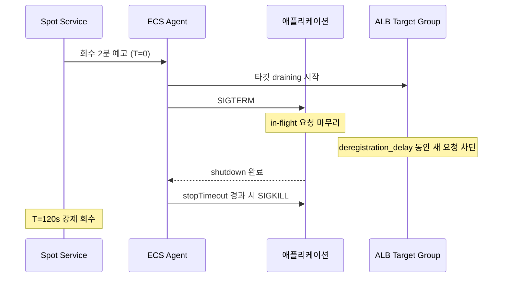

# Fargate Spot 운영 심화

Fargate Spot의 기본 동작(온디맨드 대비 ~70% 할인, 2분 예고 후 회수)과 base/weight로 온디맨드와 섞는 비율 설정은 [Fargate](Fargate.md)의 'Fargate Spot' 절과 [ECS Capacity Providers](ECS_Capacity_Providers.md)에 정리돼 있다. 이 문서는 그 위에서 실제 운영하며 부딪히는 것들을 다룬다. 중단 빈도를 어떻게 숫자로 보는지, 배치 작업을 중단에 안전하게 만드는 체크포인팅, 2분 예고 안에서 종료 타이밍이 어긋나지 않게 맞추는 계산, Spot 풀 고갈로 태스크가 안 뜰 때의 진단, 그리고 비용을 잘못 계산하는 함정이다.

## EC2 Spot을 알고 오면 헷갈리는 것들

EC2 Spot을 써본 사람이 Fargate Spot을 처음 잡으면 있어야 할 손잡이가 없어서 당황한다. 둘은 이름만 비슷하고 운영 모델이 꽤 다르다.

EC2 Spot에는 할당 전략이 있다. `capacity-optimized`, `lowest-price`, `price-capacity-optimized` 같은 걸 Auto Scaling Group이나 EC2 Fleet에 걸어서 "회수가 덜 일어나는 풀을 골라라" 또는 "여러 인스턴스 타입에 분산해라" 같은 지시를 한다. 인스턴스 타입을 여러 개 후보로 넣어두면 한 풀이 고갈돼도 다른 타입으로 넘어간다. Fargate Spot에는 이게 전부 없다. 고를 타입도 없고(태스크의 vCPU·메모리만 지정), 할당 전략을 넣을 자리도 없다. capacity provider strategy의 base와 weight로 "온디맨드 대 Spot 비율"만 정할 뿐, "어느 Spot 풀을 선호한다"는 표현을 할 수 없다. 그래서 EC2 Spot에서 회수율을 낮추려고 쓰던 분산 카드를 Fargate에서는 못 쓴다. 회수를 줄이는 거의 유일한 수단이 AZ 분산이다(뒤에서 다룬다).

가격도 다르게 움직인다. EC2 Spot 가격은 풀의 수요·공급에 따라 시시각각 변하고, 입찰가를 초과하면 회수된다. Fargate Spot은 온디맨드 대비 할인율이 고정이다. 시장 가격이 출렁여서 비용이 튀는 일은 없다. 대신 "가격이 올라서 회수"가 아니라 "AWS가 그 용량이 필요해서 회수"만 있다. 비용 예측은 더 쉽고, 회수 시점은 여전히 통제 불가다.

정리하면 Fargate Spot은 EC2 Spot에서 운영 손잡이를 다 떼어내고 "싸다, 단 2분 예고 후 회수될 수 있다"만 남긴 형태다. 튜닝할 게 없으니 단순하지만, 회수가 잦은 시점에 손쓸 카드도 그만큼 적다.

## 중단 빈도를 숫자로 보기

"Spot 써도 될까?"는 결국 "지금 이 리전·AZ에서 회수가 얼마나 자주 일어나는가"로 귀결된다. 감으로 답하면 안 되고 실측해야 한다. ECS는 Spot 중단으로 태스크를 멈출 때 `stopCode`를 `SpotInterruption`으로 찍는다. 이걸 EventBridge로 잡아 메트릭으로 집계하면 회수율이 그래프로 보인다.

[ECS Capacity Providers](ECS_Capacity_Providers.md)에 나온 SpotInterruption 이벤트 패턴을 SNS 알림으로 연결하는 건 단발 알림용이다. 빈도를 추적하려면 알림이 아니라 카운트가 필요하다. EventBridge 룰의 타깃을 Lambda로 두고, Lambda가 리전·AZ를 차원(dimension)으로 한 커스텀 메트릭을 PutMetricData로 올린다.

```python
import boto3

cw = boto3.client('cloudwatch')

def handler(event, context):
    detail = event['detail']
    # availabilityZone은 태스크의 attachments/attributes에서 꺼낸다
    az = next(
        (a['value'] for a in detail.get('attributes', [])
         if a['name'] == 'ecs.availability-zone'),
        'unknown'
    )
    cluster = detail['clusterArn'].split('/')[-1]

    cw.put_metric_data(
        Namespace='Custom/FargateSpot',
        MetricData=[{
            'MetricName': 'Interruptions',
            'Dimensions': [
                {'Name': 'Cluster', 'Value': cluster},
                {'Name': 'AvailabilityZone', 'Value': az},
            ],
            'Value': 1,
            'Unit': 'Count',
        }]
    )
```

EventBridge 룰은 stopCode로 거른다.

```json
{
  "source": ["aws.ecs"],
  "detail-type": ["ECS Task State Change"],
  "detail": {
    "stopCode": ["SpotInterruption"],
    "lastStatus": ["STOPPED"]
  }
}
```

이러면 CloudWatch에 AZ별 중단 카운트가 쌓인다. 회수율을 보려면 분모가 필요하다. 같은 기간 실행된 Spot 태스크 수로 나눠야 "100개 띄워서 며칠에 몇 개 회수"가 나온다. 실행 태스크 수는 ECS의 `RunningTaskCount`를 capacity provider 차원으로 보거나, 태스크 시작 이벤트(`lastStatus: RUNNING`)도 같은 방식으로 카운트해서 비율 메트릭(metric math)으로 만든다.

대시보드에 AZ별 중단 카운트를 일 단위로 깔아두면 패턴이 보인다. 특정 AZ가 유독 자주 회수되는 시기가 있고, 같은 리전이라도 AZ 간 차이가 크다. 이 데이터가 쌓이면 "이 워크로드는 ap-northeast-2a를 빼고 c·d에만 배치" 같은 판단을 근거를 갖고 한다. 데이터 없이 Spot 비율을 정하면, 회수가 몰리는 날 서비스가 흔들리고 나서야 알게 된다.

한 가지 주의. 한국 리전(ap-northeast-2)은 다른 대형 리전보다 Spot 회수가 잦은 편이고 시기에 따라 편차도 크다. us-east-1에서 안 터지던 게 서울에서 터지는 일이 흔하다. 리전을 옮기거나 새로 깔 때는 회수율을 처음부터 다시 실측해야 한다.

## 배치 워크로드 체크포인팅

웹 서비스는 SIGTERM 받고 in-flight 요청만 흘려보내면 되니까 회수가 와도 손실이 작다. 문제는 한 번 실행에 수십 분 도는 배치다. 10분 돌던 작업이 9분째에 회수되면, 체크포인트가 없으면 처음부터 다시다. 재시작이 또 회수되면 영원히 못 끝낸다.

핵심은 진행 상태를 작업 바깥에 주기적으로 저장하고, 재시작할 때 그 지점부터 이어받는 것이다. 저장소는 보통 두 가지다. 처리한 레코드의 경계나 커서처럼 작고 자주 갱신되는 상태는 DynamoDB가 맞다. 중간 산출물처럼 덩치 큰 데이터는 S3에 쓴다.

레코드를 순차 처리하는 배치라면, N건마다 "여기까지 처리함"을 DynamoDB에 기록한다.

```python
import boto3

ddb = boto3.resource('dynamodb').Table('batch-checkpoint')

def run_batch(job_id, records):
    # 재시작이면 마지막 커서부터, 처음이면 0부터
    item = ddb.get_item(Key={'job_id': job_id}).get('Item')
    start = item['cursor'] if item else 0

    for i in range(start, len(records)):
        process(records[i])
        if i % 100 == 0:
            ddb.put_item(Item={'job_id': job_id, 'cursor': i})

    ddb.put_item(Item={'job_id': job_id, 'cursor': len(records), 'done': True})
```

체크포인트 간격은 비용과 손실량의 트레이드오프다. 매 건마다 쓰면 회수돼도 거의 안 잃지만 DynamoDB 쓰기가 작업 처리량을 갉아먹는다. 너무 듬성하면 회수 시 그 구간을 통째로 다시 한다. 한 건 처리에 드는 시간 × 간격이 "회수 시 버리는 시간"이니, 그게 몇 초~십몇 초 수준이 되게 간격을 잡는다.

SIGTERM을 받는 순간 마지막 체크포인트를 한 번 더 박아주면 손실을 더 줄인다. 단 2분 안에 끝나는 가벼운 쓰기여야 한다. 무거운 플러시를 SIGTERM 핸들러에 넣으면 stopTimeout 안에 못 끝내고 SIGKILL을 맞는다.

```python
import signal

def on_sigterm(signum, frame):
    ddb.put_item(Item={'job_id': current_job, 'cursor': current_index})
    raise SystemExit(0)

signal.signal(signal.SIGTERM, on_sigterm)
```

재시작은 ECS 서비스 스케줄러가 알아서 안 해준다. [ECS Capacity Providers](ECS_Capacity_Providers.md)에 나오듯, Spot 회수로 죽은 태스크는 서비스가 desiredCount를 맞추려 새 태스크를 띄우는 흐름으로만 이어진다. RunTask로 단발 실행한 배치는 회수되면 그걸로 끝이고 아무도 다시 안 띄운다. 그래서 배치는 Step Functions나 EventBridge 재시도로 "회수되면 같은 job_id로 다시 RunTask"를 외부에서 보장해야 한다.

Step Functions에서 `ecs:runTask.sync`로 태스크를 돌리면, Spot 회수로 태스크가 STOPPED가 될 때 상태머신이 실패로 받는다. 여기에 Retry를 걸어두면 같은 입력(job_id 포함)으로 재실행되고, 작업은 DynamoDB 커서를 보고 이어받는다.

```json
{
  "Type": "Task",
  "Resource": "arn:aws:states:::ecs:runTask.sync",
  "Parameters": {
    "Cluster": "batch-cluster",
    "TaskDefinition": "etl-job",
    "CapacityProviderStrategy": [
      {"CapacityProvider": "FARGATE_SPOT", "Weight": 1}
    ]
  },
  "Retry": [{
    "ErrorEquals": ["States.TaskFailed"],
    "IntervalSeconds": 30,
    "MaxAttempts": 5,
    "BackoffRate": 2.0
  }]
}
```

`MaxAttempts`는 회수가 연달아 일어날 수 있으니 넉넉히 잡되, 무한은 피한다. 회수가 아니라 코드 버그로 매번 죽는 경우 재시도가 비용만 태운다. 회수(STOPPED + SpotInterruption)와 작업 실패(컨테이너 exit code != 0)를 구분해서 다른 Retry를 거는 것도 방법이다. 회수는 무조건 재시도, 코드 실패는 1~2회만.

## 2분 예고 안에서 종료 타이밍 맞추기

회수 예고는 SIGTERM부터 강제 종료까지 정확히 2분이다. 이 2분 안에 (1) 애플리케이션이 graceful하게 닫히고, (2) ALB가 이 태스크를 타깃에서 빼서 새 요청을 안 보내야 한다. 이 둘이 서로 맞물려서, 하나라도 2분을 넘게 잡으면 그 안에 못 끝낸다. 관련된 값이 세 개고, 기본값 그대로 두면 거의 항상 어긋난다.

세 값의 기본치부터 보자.

- `stopTimeout`(태스크 정의): SIGTERM 후 SIGKILL까지 ECS가 기다리는 시간. 기본 30초.
- `server.shutdown=graceful` + `timeout-per-shutdown-phase`(Spring Boot): 진행 중 요청을 마저 처리할 시간.
- `deregistration_delay.timeout_seconds`(ALB 타깃 그룹): 타깃을 빼고 in-flight 커넥션이 빠질 때까지 기다리는 시간. 기본 300초.

기본값 조합의 문제는 둘이다. 첫째, `stopTimeout`이 30초라 2분 예고를 30초밖에 못 쓴다. graceful shutdown에 60초가 필요한 작업이면 30초에 SIGKILL을 맞아서 요청이 끊긴다. 둘째, `deregistration_delay`가 300초라, 타깃 해제가 끝나기 한참 전에 태스크가 죽는다. ALB가 아직 산 줄 알고 보낸 요청이 죽은 태스크로 가서 502가 난다. 이 두 번째 문제는 [ECS Capacity Providers](ECS_Capacity_Providers.md)와 [ECS Task Graceful Shutdown](ECS_Task_Graceful_Shutdown.md)에서도 짚는 그 502다.

순서를 잡으면 이렇게 흐른다.



타이밍이 맞으려면 이 부등식이 성립해야 한다.

```
애플리케이션 graceful 처리 시간 ≤ stopTimeout ≤ 120초
deregistration_delay ≤ 120초
```

실제로 쓰는 값의 한 예다. graceful 처리에 가장 오래 걸리는 요청이 45초라면, `stopTimeout`을 90초로(여유를 두되 120초 미만), Spring Boot `timeout-per-shutdown-phase`를 60초로, ALB `deregistration_delay`를 60초로 둔다. 이러면 SIGTERM 후 애플리케이션이 60초 안에 닫히고, ALB도 60초 안에 타깃을 빼고, 둘 다 120초 한참 안쪽에 끝난다.

```bash
aws elbv2 modify-target-group-attributes \
  --target-group-arn arn:aws:elasticloadbalancing:... \
  --attributes Key=deregistration_delay.timeout_seconds,Value=60
```

```yaml
# Spring Boot application.yml
server:
  shutdown: graceful
spring:
  lifecycle:
    timeout-per-shutdown-phase: 60s
```

한 가지 더. `stopTimeout`은 최대 120초까지 올릴 수 있지만, 2분이 회수 예고와 정확히 같다는 점을 기억해야 한다. `stopTimeout`을 120초로 박아두면 ECS가 120초를 다 기다리는데 그 사이 Spot Service가 먼저 강제 회수해버리는 경합이 생긴다. 그래서 90~110초처럼 120보다 약간 낮게 잡아 ECS가 먼저 정리를 끝내게 두는 게 안전하다. PID 1이 SIGTERM을 자식에게 전파하는지도 같이 봐야 한다. 이 전파가 안 되면 `stopTimeout`을 아무리 올려도 graceful shutdown 자체가 시작을 안 한다. 진단은 [ECS Task Graceful Shutdown](ECS_Task_Graceful_Shutdown.md)에 있다.

## Spot 풀 고갈과 PROVISIONING 정체

Spot 비율을 높게 잡고 잘 돌다가, 어느 날 태스크가 안 뜨고 PROVISIONING 상태에 머무는 일이 생긴다. 서비스 이벤트에 이런 메시지가 찍힌다.

```
service my-svc was unable to place a task because no container instance met
all of its requirements. ... FARGATE_SPOT capacity is not available.
```

원인은 단순하다. 그 AZ의 Spot 풀에 줄 용량이 없는 것이다. EC2 Spot이면 다른 인스턴스 타입으로 빠질 수 있지만, 앞서 말했듯 Fargate Spot엔 그 카드가 없다. capacity provider strategy가 FARGATE_SPOT에만 weight를 줬고 FARGATE base가 0이면, 풀이 비는 동안 그 태스크는 갈 곳이 없어 PROVISIONING에서 멈춘다. 회수로 죽은 자리를 새로 채우려는데 채울 용량이 없으면, 서비스의 running count가 desired보다 낮은 채로 오래 머문다. Spot만으로 base 0이면 풀 고갈 순간 서비스가 통째로 비는 것도 같은 이유다.

진단은 서비스 이벤트(`aws ecs describe-services`의 events)와 멈춘 태스크의 `stoppedReason`을 본다. `Capacity is unavailable at this time` 류면 풀 고갈이다. 코드 에러나 IAM 문제와는 메시지가 다르니 구분된다.

```bash
aws ecs describe-services --cluster my-cluster --services my-svc \
  --query 'services[0].events[0:5].message'
```

완화는 두 축이다.

첫째, FARGATE base를 확보한다. capacity provider strategy에서 FARGATE에 base를 1~2 이상 주면, Spot 풀이 비어도 그만큼은 온디맨드로 항상 뜬다. 서비스가 0으로 떨어지는 최악은 막는다. 비율 설정 자체는 [ECS Capacity Providers](ECS_Capacity_Providers.md)에 있고, 요점은 base를 FARGATE_SPOT이 아니라 FARGATE에 거는 것이다. Spot에 base를 거는 건 "최소 보장"이라는 말과 안 맞는다. 언제든 회수되니까.

둘째, AZ를 늘린다. 서비스의 서브넷을 2개 AZ가 아니라 3개로 깔면, 한 AZ의 Spot 풀이 비어도 다른 AZ에서 채울 확률이 올라간다. Fargate Spot에서 회수와 고갈을 줄이는 거의 유일한 손잡이가 이 AZ 분산이다. 단일 AZ나 2개 AZ로 Spot을 굴리다 고갈로 고생하는 경우가 많은데, 서브넷 목록에 AZ 하나 더 추가하는 것만으로 체감이 크게 다르다.

회수율 데이터(앞의 대시보드)가 있으면 여기서 빛을 본다. 어느 AZ가 자주 비는지 보고, 그 AZ의 비중을 줄이거나 빼는 판단을 숫자로 한다.

## Spot에 올릴 것과 절대 안 올릴 것

Spot은 "회수돼도 다시 하면 그만"인 작업에 맞는다. 반대로 "회수되면 복구 불가"인 작업에 올리면 안 된다. 이 구분이 흐릿하면 사고가 난다.

올려도 되는 쪽. 무상태 웹/API 서버는 여러 태스크가 ALB 뒤에 있고 한둘 회수돼도 나머지가 받으니 괜찮다(단 위의 타이밍 정합은 맞춰야 한다). 멱등하게 재처리 가능한 배치, ETL, 미디어 인코딩처럼 체크포인트로 이어받을 수 있는 작업도 맞다. SQS 워커는 처리 완료 후에만 메시지를 삭제하면, 회수 시 처리 중이던 메시지가 visibility timeout 후 다른 워커로 가니 자연스럽게 재처리된다. CI 빌드처럼 실패하면 다시 돌리면 되는 것도 좋은 후보다.

올리면 안 되는 쪽. 상태를 보존하는 단발 작업, 즉 중간에 죽으면 외부에서 그 진행을 알 수 없고 재시작도 안 되는 작업이다. 체크포인트 없는 장시간 단발 RunTask가 여기 해당한다. 결제·정산 처리는 회수 타이밍에 따라 이중 청구나 누락이 날 수 있으면 Spot에 두면 안 된다. 멱등성과 트랜잭션 경계가 완벽하게 보장돼서 "같은 요청을 두 번 처리해도 결과가 같다"가 코드로 증명되지 않는 한, 돈이 오가는 경로는 온디맨드에 둔다. 외부에 부수효과를 내는데 그게 비멱등인 작업(메일 발송, 외부 API로 주문 생성 등)도 마찬가지다. 회수로 중간에 죽으면 "보냈는지 안 보냈는지 모르는" 상태가 남는다.

stateful한 단일 인스턴스 워크로드(싱글톤 스케줄러, 리더 선출 없는 단일 컨슈머)도 Spot과 안 맞는다. 그 하나가 회수되면 대체가 뜰 때까지 기능 자체가 멈춘다. 이런 건 FARGATE 온디맨드로 base를 보장하거나, Spot에 둘 거면 리더 선출·페일오버를 갖춘 뒤에 둔다.

판단 기준은 하나다. "이 태스크가 지금 이 순간 SIGKILL로 사라져도, 시스템이 스스로 복구하는가." 복구한다면 Spot, 사람이 개입해야 한다면 온디맨드다.

## Savings Plans와 Spot을 같이 쓸 때의 비용 함정

비용을 더 줄이려고 Compute Savings Plans를 사두고 Spot도 같이 쓰는 구성이 있다. 여기서 계산을 잘못하는 경우를 자주 본다.

Savings Plans는 시간당 일정 금액(commitment)을 약정하고, 그만큼의 온디맨드 사용에 할인을 적용하는 방식이다. 중요한 건 Spot 사용량에는 Savings Plans가 적용되지 않는다는 점이다. Spot은 이미 그 자체로 할인된 가격이고, Savings Plans의 커버리지 대상이 아니다. 그래서 "Savings Plans를 샀으니 Spot까지 더 싸진다"는 기대는 틀렸다. 둘은 겹치지 않고 각각 다른 사용량에 붙는다.

함정은 두 방향으로 난다. 첫째, Spot 비율을 높게 잡아두고 Savings Plans 약정도 크게 사면, 온디맨드 사용량이 약정액보다 적어진다. 그러면 약정한 시간당 금액을 다 못 쓰고도 그 돈은 나간다. Savings Plans는 "안 써도 내는" 약정이라, 커버할 온디맨드가 부족하면 그냥 손해다. base로 잡은 FARGATE 온디맨드 양을 먼저 계산하고, 그 수준에 맞춰 약정액을 정해야 한다. Spot으로 갈 부분까지 약정에 넣으면 안 된다.

둘째 방향. 반대로 Savings Plans를 충분히 깔아둔 상태라면, 그 커버리지 안에서는 온디맨드와 Spot의 가격 차가 줄어든다. 온디맨드가 Savings Plans로 이미 많이 할인됐으면, Spot으로 옮겨서 얻는 추가 절감은 생각보다 작다. 거기에 Spot의 회수 리스크와 체크포인팅 구현 비용까지 더하면, "그냥 Savings Plans 덮인 온디맨드로 두는 게 낫다"가 되는 구간이 있다. Spot 절감액이 회수 대응에 드는 엔지니어링 시간을 정말 넘는지 따져봐야 한다.

계산 순서는 이렇게 잡는다. 먼저 base로 항상 떠 있어야 하는 온디맨드 양을 정한다(가용성 요구로 결정). 그 온디맨드 양에 맞춰 Savings Plans 약정을 산다. 그 위에서 추가로 띄우는, 회수돼도 되는 부분만 Spot으로 돌린다. 이 순서를 뒤집어서 "전체를 Spot으로 가정하고 남는 걸 약정"으로 잡으면 약정이 비거나 절감이 중복 계산된다.

Cost Explorer에서 Savings Plans 커버리지와 활용률(utilization)을 보면 약정이 남는지 모자라는지 나온다. 활용률이 100%에 못 미치면 약정을 너무 많이 산 것이고, 이건 Spot 비율을 올렸을 때 자주 생긴다. Spot 비율을 조정할 때는 이 활용률을 같이 봐야 한다.

## 참고

- [Fargate](Fargate.md) — Fargate Spot 기본 동작과 플랫폼 버전
- [ECS Capacity Providers](ECS_Capacity_Providers.md) — base/weight 비율, capacity provider strategy
- [ECS Task Graceful Shutdown](ECS_Task_Graceful_Shutdown.md) — SIGTERM 전파, PID 1 문제, 502 진단
- [Fargate Spot capacity providers (AWS 문서)](https://docs.aws.amazon.com/AmazonECS/latest/developerguide/fargate-capacity-providers.html)
