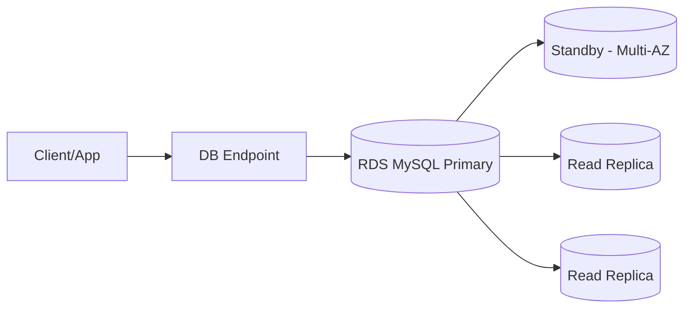
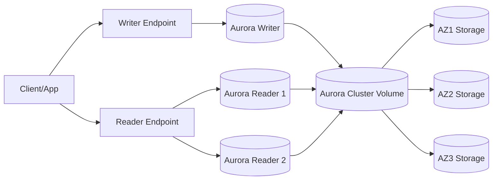

# Aurora MySQL vs RDS for MySQL 상세 비교

> 결론부터 말씀드리면, **Aurora MySQL은 “RDS(MySQL) 위에서 돌아가는 또 하나의 MySQL 엔진”이 아니라**  
> **스토리지/복제/고가용성 계층을 AWS가 새로 설계한 ‘클러스터형 분산 스토리지 + MySQL 호환 엔진’**에 가깝습니다.  
> 그래서 “같은 MySQL”이라도 **장애 복구 방식, 복제 지연, 스케일 방식, 비용 구조**가 다르게 움직입니다.

---

## 0. 한 장 요약

| 구분 | RDS for MySQL | Aurora MySQL |
|---|---|---|
| 기본 단위 | **DB 인스턴스**(하나의 스토리지 볼륨) | **DB 클러스터**(Writer + Readers가 **클러스터 볼륨** 공유) |
| 스토리지 | EBS 기반(일반적으로 gp2/gp3/io1/io2) | 분산 스토리지: **6 copies / 3AZ** 복제, 자동 치유 |
| Multi-AZ | Primary ↔ Standby **동기 복제** (장애 시 failover) | 기본이 Multi-AZ 성격(클러스터 스토리지 복제 + 다수 Reader) |
| Read scale | Read Replica(일반 복제) | Aurora Replicas(스토리지 공유 + 낮은 lag 경향) |
| Failover | 인스턴스/스토리지 레벨 전환(Standby) | Writer 전환 + Reader 승격, 빠른 복구를 목표로 설계 |
| 운영 난이도 | 단순 | 기능/옵션 다양(클러스터 운영 개념 필요) |
| 비용 | 인스턴스 + 스토리지 + IOPS(스토리지 타입에 따라) | 인스턴스 + 스토리지 + (옵션에 따라) I/O 과금 모델 상이 |

---

## 1. “Aurora는 RDS가 아니야?”에 대한 정확한 답

- **Amazon Aurora는 “Amazon RDS에서 제공되는 데이터베이스 엔진 중 하나”**입니다. 즉 콘솔/CLI/API 관점에서는 RDS 서비스 범주에 있습니다.
- 하지만 아키텍처 관점에서는, 일반적인 “RDS for MySQL(= 커뮤니티 MySQL 엔진을 EBS 스토리지에 올린 형태)”과 달리  
  **스토리지 계층과 복제/가용성 메커니즘을 AWS가 별도로 구현**해 둔 것이 Aurora의 핵심 차별점입니다.

---

## 2. 아키텍처 차이: 인스턴스형 vs 클러스터형

### 2.1 RDS for MySQL(전형적 구조)

- Primary DB 인스턴스가 **자기 스토리지(EBS 볼륨)**를 직접 읽고 씁니다.
- Multi-AZ를 켜면, Standby 인스턴스가 별도 AZ에 뜨고 **동기 복제**로 데이터가 미러링됩니다(가용성 목적).

### 2.2 Aurora MySQL(클러스터 구조)

- Writer/Reader 인스턴스들은 **Aurora 클러스터 볼륨(분산 스토리지)**에 붙습니다.
- 스토리지 자체가 여러 AZ에 분산 복제되며 자동 치유가 설계되어 있습니다.
- Reader는 “복제본”이지만, **클러스터 볼륨을 공유**하고, 변경은 로그/스토리지 메커니즘으로 전파되는 구조입니다.

---

## 3. 고가용성(HA)와 장애복구: “무엇이 더 잘 버티는가?”

### 3.1 Aurora의 스토리지 내구성/복제 방식

Aurora는 데이터(스토리지)를 **3개 AZ에 걸쳐 6개의 복제본으로 유지**하고, 일부 스토리지 노드가 문제가 생겨도 자동으로 재구성/치유합니다.  
또한 쓰기 시 **쿼럼(quorum)** 기반으로 처리하도록 설계되어, 일부 복제본 장애가 있어도 서비스 지속성을 높입니다.

- AWS FAQ에는 다음과 같은 형태로 설명됩니다: **3AZ에 걸친 6 copies**, 그리고 복제본 일부 장애에도 읽기/쓰기 지속 가능(쿼럼 기반).  
  (세부 표현은 AWS FAQ 문구를 참고하시고, 의미는 “스토리지 레벨에서 다중 복제 + 다중 장애 허용”입니다.)

### 3.2 RDS Multi-AZ의 동작(핵심은 “동기 복제 Standby”)

RDS Multi-AZ(DB instance deployment)는 본질적으로:
- Primary와 Standby 사이에 **동기 복제**를 사용하고,
- 장애 시 **Standby로 failover**하는 모델입니다.

즉, “데이터 정확성(강한 일관성)과 단순한 HA”에 강점이 있습니다.

### 3.3 실무 관점 비교

| 항목 | RDS MySQL Multi-AZ | Aurora MySQL |
|---|---|---|
| 장애 유형 | 인스턴스/스토리지 장애 중심 대응 | 스토리지 노드 다중 장애까지 견딜 수 있도록 설계 |
| Failover | Primary → Standby 전환 | Writer 전환(Reader 승격) + 엔드포인트 라우팅 |
| 운영 포인트 | “Standby가 읽기 트래픽을 받지 않는” 구성(전형) | Reader를 적극 활용(읽기/DR/분산) |

---

## 4. 스케일링: 읽기 확장과 (부분적) 쓰기 확장

### 4.1 읽기(Read) 확장

- Aurora는 **Reader Endpoint**로 읽기 트래픽을 분산시키는 운영이 자연스럽습니다.
- Aurora Pricing 페이지 기준으로, **최대 15개의 Aurora replica**를 통한 읽기 확장(설명 및 정책)이 명시됩니다.

RDS MySQL도 Read Replica를 붙여 읽기 확장이 가능하지만,
- 복제 지연(Replica lag)이 커질 수 있고,
- Writer/Reader의 스토리지 관계가 Aurora처럼 “클러스터 볼륨 공유”가 아니라 더 전통적인 복제 패턴에 가깝습니다.

### 4.2 쓰기(Write) 확장

- **전통적인 MySQL 계열은 쓰기 확장이 본질적으로 어렵습니다.**
- Aurora는 “쓰기 트랜잭션 수평 확장”을 일반 MySQL 수준에서 완전히 해결했다기보다는,
    - 빠른 스토리지 계층,
    - 빠른 장애복구,
    - 리더를 통한 읽기 확장,
    - 특정 변형(예: Aurora Limitless 등)을 통해 범위를 넓히는 방향에 가깝습니다.

---

## 5. 성능: “Aurora가 더 빠르다”의 실제 의미

Aurora가 “더 빠르다”는 이야기는 대체로 아래의 합으로 이해하시면 안전합니다.

1. **스토리지 계층**이 MySQL 엔진의 I/O 병목을 줄이도록 설계됨
2. 읽기 확장을 더 적극적으로 사용하기 쉬움(Reader Endpoint, 다수 replica)
3. 장애/복구가 짧아 평균적인 “서비스 체감 성능”이 좋아지는 경우가 많음

다만, **워크로드가 CPU 바운드인지, I/O 바운드인지**, 쿼리/인덱스 품질, 버퍼풀 적중률, 트랜잭션 패턴 등에 따라
RDS MySQL이 더 경제적이거나 충분히 빠른 경우도 많습니다.

---

## 6. 비용 구조: 무엇이 더 싸고 비싼가?

### 6.1 Aurora 비용 모델(핵심: Standard vs I/O-Optimized)

AWS Aurora Pricing 기준으로:
- **Aurora Standard**: 인스턴스 + 스토리지 + **요청 기반 I/O 과금**
- **Aurora I/O-Optimized**: 인스턴스 + 스토리지만 과금하며 **read/write I/O 과금이 0** (대신 인스턴스 단가가 더 높은 방향)

즉, **I/O가 폭발하는 워크로드**(예: 랜덤 읽기/쓰기 많음, OLTP + 대량 조회 혼재)에서는
I/O-Optimized가 “총비용(TCO)”를 낮출 수 있고,
**I/O가 낮거나 캐시 히트율이 높은 워크로드**에서는 Standard가 더 경제적일 수 있습니다.

### 6.2 RDS MySQL 비용 모델(일반적으로)

RDS MySQL은:
- 인스턴스 비용 + 스토리지 비용 + (선택한 스토리지 타입에 따라) IOPS 비용이 달라집니다.
- Multi-AZ를 켜면 Standby 비용도 고려해야 합니다.

**결론적으로 비용은 “서비스 종류”가 아니라 “워크로드 프로파일”로 결정**됩니다.

---

## 7. 기능/운영 측면에서 Aurora가 더 유리한 포인트

현장에서 Aurora를 선택하는 대표적인 이유를 “결정 근거”로 정리하면 다음과 같습니다.

### 7.1 빠른 장애 복구와 클러스터 운영성
- Writer/Reader 구조, Reader Endpoint, 자동 failover는 운영 표준 패턴으로 자리잡아 있습니다.
- 장애 격리/복구가 “인스턴스 1대” 단위가 아니라 “클러스터 단위”로 사고하는 방식입니다.

### 7.2 스토리지 자동 확장
- Aurora는 스토리지가 **10GB 단위로 자동 증가**하며 **최대 128 TiB**까지 확장될 수 있습니다(FAQ 기준).

### 7.3 Serverless(가변 워크로드에 유리)
- Aurora Serverless는 수요에 따라 용량을 자동으로 올리고 내리는 방식으로 설명되며,
  “불규칙 트래픽/피크가 뾰족한 서비스”에서 운영을 단순화할 수 있습니다(가격/스펙은 리전/세대에 따라 확인 필요).

---

## 8. RDS MySQL이 더 유리한 포인트(현실적인 이유)

Aurora가 “항상” 낫지는 않습니다. RDS MySQL이 더 좋은 경우도 명확합니다.

1. **운영 단순성이 최우선**: 단일 인스턴스 + Multi-AZ로 충분한 서비스
2. **비용 민감**: 트래픽/데이터 규모가 작거나 I/O가 많지 않아 Aurora의 프리미엄이 아까운 경우
3. **호환성/특정 엔진 기능**: 특정 MySQL 버전/플러그인/동작을 더 보수적으로 쓰고 싶은 경우
4. **트러블슈팅 단순화**: “표준 MySQL + 표준 스토리지” 조합이 원인 분석이 쉬운 경우

---

## 9. 선택 가이드: 의사결정 체크리스트

### 9.1 빠른 판단표

| 질문 | 예(Yes)면 추천 | 이유 |
|---|---|---|
| 읽기 트래픽이 크고, 읽기 확장이 핵심인가요? | Aurora 우선 고려 | Reader Endpoint + 다수 replica 운영 패턴이 자연스러움 |
| 장애 복구 시간을 강하게 줄여야 하나요? | Aurora 우선 고려 | 스토리지/클러스터 설계가 HA 중심 |
| I/O가 비용의 큰 비중을 차지하나요? | Aurora I/O-Optimized 검토 | I/O 과금 제거로 TCO 개선 가능 |
| 트래픽이 들쑥날쑥하고 피크가 뾰족한가요? | Aurora Serverless 검토 | 자동 스케일로 운영 단순화 |
| 규모가 작고 단순 운영이 최우선인가요? | RDS MySQL | 비용/운영 단순성에서 유리 |

### 9.2 추천 시나리오(실무 예시)

- **호텔/리조트 운영 시스템(두왓 도메인 기준)**
    - 객실 상태/주문/정산 등은 쓰기 정합성이 중요하지만, 조회 트래픽도 꽤 큼
    - “읽기 분산 + 장애 복구”가 중요하면 **Aurora(Writer+Reader)**가 유리한 경우가 많습니다.
    - 반대로 “규모가 아직 작고, 운영 인력도 최소”면 **RDS MySQL Multi-AZ**로 시작해도 충분합니다.

---

## 10. 마이그레이션/도입 시 주의사항(아주 중요)

1. **애플리케이션 레벨 커넥션/리트라이 설계**
    - Failover는 결국 “짧은 순간 연결이 끊기는 사건”입니다.
    - 커넥션 풀, 재시도(backoff), idempotency(특히 결제/예약) 설계를 함께 봐야 합니다.

2. **읽기/쓰기 분리**
    - Aurora를 도입해도 App이 전부 Writer로만 붙으면 효과가 제한됩니다.
    - “Read-heavy 쿼리”를 Reader Endpoint로 보내는 설계가 핵심입니다.

3. **관측(Observability)**
    - Replica lag, failover 이벤트, 커넥션 수, I/O 패턴(버퍼풀 히트율) 등을 SLO로 잡고 관리하셔야
      ‘Aurora를 썼는데도 느리다/비싸다’ 같은 상황을 피할 수 있습니다.

---

## 참고 자료(공식)

- Amazon Aurora FAQ (스토리지 복제/자동 확장/내구성 개요)
- Amazon RDS User Guide: Multi-AZ deployments (동기 복제/Failover 개요)
- Amazon Aurora Pricing (Standard vs I/O-Optimized, Serverless 및 replica 관련 설명)

