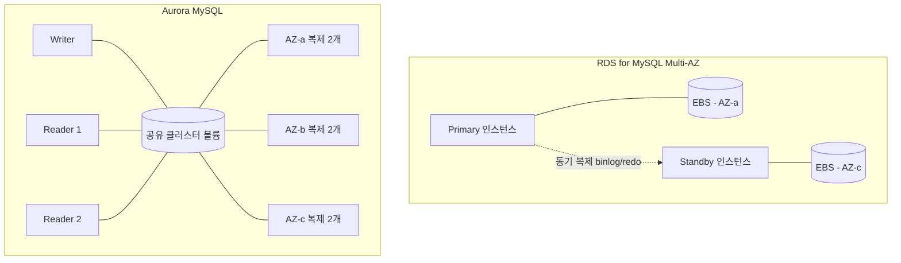

# Aurora MySQL vs RDS for MySQL 상세 비교

같은 "MySQL"이라 부르지만 Aurora MySQL과 RDS for MySQL은 엔진 내부 동작이 다르다. 둘 다 MySQL Wire 프로토콜을 말하고 SQL도 거의 같지만, 스토리지 계층, 복제 메커니즘, 페일오버 흐름, 파라미터 그룹의 디폴트값, max_connections 산정식, DDL 처리 방식까지 다른 부분이 곳곳에 숨어 있다. 운영하다 보면 "RDS에서 잘 돌던 쿼리가 Aurora로 옮기니 동작이 미묘하게 다르다"는 상황을 반드시 만난다.

이 문서는 두 엔진을 "MySQL 호환 엔진" 관점에서 비교한다. 클러스터 페일오버 운영 패턴은 [Aurora_DB_Cluster.md](Aurora_DB_Cluster.md)에서, RDS 일반 개념은 [RDS.md](RDS.md)에서 다룬다.

---

## 1. 무엇이 같고 무엇이 다른가

RDS for MySQL은 "AWS 위에 올린 커뮤니티 MySQL"에 가깝다. EBS 볼륨에 InnoDB 데이터 파일이 그대로 쓰이고, binlog로 복제하고, MySQL이 만든 redo log/undo log가 그대로 동작한다. 버전도 MySQL 커뮤니티 릴리스를 거의 그대로 따라간다.

Aurora MySQL은 다르다. SQL 파서와 옵티마이저는 MySQL과 호환되지만, **InnoDB의 buffer pool 아래쪽 — 즉 redo log 처리, 페이지 디스크 쓰기, binlog 복제 — 가 AWS 자체 분산 스토리지로 교체**되어 있다. 그래서 동일한 SQL을 실행해도 디스크 I/O 패턴, 복제 지연 특성, 페일오버 시간이 완전히 다르게 움직인다.

차이를 한 줄로 요약하면 이렇다. **RDS for MySQL은 인스턴스 1대 + EBS 1볼륨 단위로 사고**한다. **Aurora는 클러스터 + 공유 분산 스토리지 단위로 사고**한다. 백업, 복제, 페일오버 모두 이 모델 차이에서 파생된다.

---

## 2. 인스턴스 생성 시점에 드러나는 차이

콘솔에서는 가려지지만, CLI로 생성해 보면 두 엔진의 모델 차이가 그대로 드러난다.

### 2.1 RDS for MySQL — 인스턴스 1개 = DB 1개

```bash
aws rds create-db-instance \
  --db-instance-identifier prod-mysql-1 \
  --db-instance-class db.r6i.xlarge \
  --engine mysql \
  --engine-version 8.0.35 \
  --allocated-storage 200 \
  --storage-type gp3 \
  --iops 12000 \
  --storage-throughput 500 \
  --master-username admin \
  --master-user-password '****' \
  --multi-az \
  --backup-retention-period 7 \
  --db-parameter-group-name custom-mysql80
```

`create-db-instance` 한 번이면 끝난다. `--multi-az`를 켜면 다른 AZ에 Standby 인스턴스와 EBS 볼륨이 한 쌍 더 만들어지고 동기 복제로 묶인다. 엔드포인트는 인스턴스 단위로 1개(`prod-mysql-1.xxx.rds.amazonaws.com`).

### 2.2 Aurora MySQL — 클러스터를 먼저, 인스턴스는 그 위에

```bash
# 1. 클러스터(= 분산 스토리지 볼륨 + 메타데이터) 먼저 생성
aws rds create-db-cluster \
  --db-cluster-identifier prod-aurora-1 \
  --engine aurora-mysql \
  --engine-version 8.0.mysql_aurora.3.05.2 \
  --master-username admin \
  --master-user-password '****' \
  --backup-retention-period 7 \
  --storage-type aurora-iopt1 \
  --db-cluster-parameter-group-name custom-aurora-mysql80

# 2. Writer 인스턴스 추가
aws rds create-db-instance \
  --db-instance-identifier prod-aurora-1-writer \
  --db-cluster-identifier prod-aurora-1 \
  --db-instance-class db.r6g.xlarge \
  --engine aurora-mysql

# 3. Reader 인스턴스 추가 (다른 AZ 권장)
aws rds create-db-instance \
  --db-instance-identifier prod-aurora-1-reader-1 \
  --db-cluster-identifier prod-aurora-1 \
  --db-instance-class db.r6g.xlarge \
  --engine aurora-mysql \
  --availability-zone ap-northeast-2c
```

여기서 두 가지가 바로 보인다. 첫째, **스토리지 옵션(`--allocated-storage`, `--iops`)이 클러스터 명령에 없다**. Aurora는 사용한 만큼 자동으로 늘고 IOPS도 별도로 프로비저닝하지 않는다. 둘째, **파라미터 그룹이 클러스터 레벨(`db-cluster-parameter-group`)과 인스턴스 레벨(`db-parameter-group`)로 갈라진다**. binlog_format, time_zone 같은 클러스터 전역 설정은 클러스터 그룹에, max_connections 같은 인스턴스 단위 설정은 인스턴스 그룹에 들어간다. RDS는 이 구분이 없어서 처음 Aurora로 옮기면 "어디에 넣어야 하지?"로 한 번씩 헤맨다.

엔드포인트도 다르다. Aurora는 클러스터에 4종류가 자동 생성된다.

```text
prod-aurora-1.cluster-xxx.rds.amazonaws.com           # Writer 엔드포인트
prod-aurora-1.cluster-ro-xxx.rds.amazonaws.com        # Reader 엔드포인트 (라운드로빈)
prod-aurora-1-writer.xxx.rds.amazonaws.com            # 인스턴스 직결
prod-aurora-1-reader-1.xxx.rds.amazonaws.com          # 인스턴스 직결
```

애플리케이션은 보통 Writer/Reader 엔드포인트만 쓰면 되는데, 페일오버 시 DNS TTL(약 5초) 만료 후 자동으로 새 Writer를 가리킨다.

---

## 3. 스토리지 아키텍처 — 6 copies/3 AZ vs Multi-AZ 동기 복제


```mermaid
flowchart TB
  subgraph RDS["RDS for MySQL Multi-AZ"]
    P[Primary 인스턴스]
    PE[(EBS - AZ-a)]
    S[Standby 인스턴스]
    SE[(EBS - AZ-c)]
    P --- PE
    S --- SE
    P -. "동기 복제 binlog/redo" .-> S
  end

  subgraph Aurora["Aurora MySQL"]
    W[Writer]
    R1[Reader 1]
    R2[Reader 2]
    V[(공유 클러스터 볼륨)]
    W --- V
    R1 --- V
    R2 --- V
    V --- A1[AZ-a 복제 2개]
    V --- A2[AZ-b 복제 2개]
    V --- A3[AZ-c 복제 2개]
  end
```

### 3.1 RDS Multi-AZ의 동작

RDS Multi-AZ는 Primary가 트랜잭션을 커밋할 때 Standby에 동기적으로 복제가 끝나야 응답을 돌려준다. EBS 볼륨 2개가 있고, 둘 사이를 binlog/redo log가 오간다. Standby는 평소에 읽기 트래픽을 받지 않는다. 단순히 페일오버 대상으로만 존재한다.

장애 발생 시 Standby로 페일오버하면 EBS 볼륨이 그대로 남아 있으니 데이터 손실은 없다. 단, **장애가 Primary 쪽 EBS 볼륨 자체에서 발생하면 마지막 미커밋 트랜잭션만큼은 잃을 수 있다** (드물지만 0은 아님).

### 3.2 Aurora의 6 copies / 3 AZ 쿼럼

Aurora는 데이터를 4KB 페이지 단위로 쪼개서 **3개 AZ × 2 copy = 총 6 copy**로 분산 저장한다. 쓰기는 6개 중 4개에 도달하면 커밋(write quorum 4/6), 읽기는 6개 중 3개에서 같은 버전을 가져오면 일관성 확인(read quorum 3/6). 이 쿼럼 모델 덕분에 AZ 1개 + 디스크 1개가 동시에 죽어도(즉 6 copy 중 3개 손실) 서비스가 계속 돌아간다.

트러블슈팅 관점에서 의미 있는 차이는 두 가지다.

첫째, **스토리지 노드 한 개가 느려도 전체 쓰기 성능이 거의 영향을 안 받는다**. 4/6 quorum이라 느린 2개를 기다리지 않기 때문이다. RDS Multi-AZ에서는 Standby 쪽 EBS가 burst credit이 떨어지면 Primary 쪽 커밋 latency가 따라 올라가는 사례가 있는데, Aurora는 이 패턴이 잘 발생하지 않는다.

둘째, **Aurora는 redo log 자체가 스토리지 계층의 "데이터"다**. Writer는 더티 페이지를 디스크에 직접 쓰지 않고 redo log만 6 copy에 분산 전송한다. 페이지 머터리얼라이즈는 스토리지 노드 쪽에서 백그라운드로 일어난다. 이 구조 덕분에 binlog 기반 복제와는 비교할 수 없을 만큼 Reader 지연이 짧다 (다음 섹션 참고).

---

## 4. Replica lag — binlog 복제 vs redo log 전파

같은 "복제본"이라는 단어를 써도 두 엔진이 의미하는 바가 다르다.

### 4.1 RDS Read Replica의 binlog 복제

RDS Read Replica는 **MySQL 표준 binlog 비동기 복제**다. Primary가 트랜잭션을 커밋한 뒤 binlog를 dump하면, Replica의 IO thread가 받아서 relay log에 쓰고, SQL thread가 그것을 다시 실행한다. 이 흐름에는 두 개의 큰 약점이 있다.

- **단일 SQL thread 직렬 실행**: 5.6 시절의 직렬 복제. 8.0에서는 멀티스레드 복제(`replica_parallel_workers`)가 가능하지만 트랜잭션 의존성에 따라 효과 편차가 크다.
- **무거운 트랜잭션 한 방에 lag이 폭발**: 1000만 row UPDATE 같은 트랜잭션이 들어오면, Primary는 빠르게 끝나도 Replica는 그 트랜잭션을 처음부터 끝까지 다시 재생해야 한다. lag이 분 단위, 심하면 수십 분까지 벌어지는 사례가 흔하다.

```sql
-- RDS Read Replica에서 lag 확인
SHOW REPLICA STATUS\G
-- 주요 필드:
-- Seconds_Behind_Source: 복제 지연 (초). NULL이면 SQL thread 멈춤
-- Replica_IO_Running: Yes 여야 정상
-- Replica_SQL_Running: Yes 여야 정상
-- Last_SQL_Error: SQL thread 에러 메시지
```

운영하면서 자주 보는 패턴은 야간 배치가 도는 동안 `Seconds_Behind_Source`가 300~600초까지 튀고, 그동안 Reader로 보낸 조회가 어제 데이터를 읽어 정합성 문제가 터지는 케이스다. 결제/예약처럼 read-after-write 정합성이 중요한 쿼리는 Read Replica로 보내면 안 된다.

### 4.2 Aurora의 redo log 기반 전파

Aurora Reader는 binlog를 받지 않는다. Writer가 만든 **redo log를 공유 스토리지에서 직접 읽어** 자기 buffer pool의 페이지를 무효화/갱신한다. SQL을 재실행할 필요가 없으니 트랜잭션 크기와 무관하다. 1000만 row UPDATE도 Writer가 redo log만 다 보내면 Reader는 거의 즉시 동기화된다.

체감 lag은 보통 10~30ms 수준, 부하가 높아도 100ms를 넘기 어렵다.

```sql
-- Aurora에서 Reader lag 확인
SELECT server_id,
       IF(session_id = 'MASTER_SESSION_ID', 'WRITER', 'READER') AS role,
       replica_lag_in_milliseconds
FROM information_schema.replica_host_status;

-- 또는 CloudWatch 메트릭: AuroraReplicaLag (단위: ms)
```

`information_schema.replica_host_status`는 Aurora 전용 뷰다. RDS for MySQL에는 없다. 이 차이 때문에 Aurora로 옮긴 뒤 모니터링 쿼리를 다시 짜야 하는 경우가 생긴다.

주의할 점도 있다. Aurora Reader가 항상 빠른 건 맞지만, Reader 인스턴스의 buffer pool이 콜드 상태면 첫 조회가 느릴 수 있다. 페일오버 직후 새 Writer로 승격된 노드의 캐시가 워밍업되기 전까지 latency가 2~3배 튀는 사례를 자주 본다. Aurora 3.x에서 추가된 cluster cache management 옵션을 켜두면 이 영향이 줄어든다.

---

## 5. Failover 시간 — 실측과 측정 방법

### 5.1 측정 명령

```bash
# RDS Multi-AZ 강제 페일오버
aws rds reboot-db-instance \
  --db-instance-identifier prod-mysql-1 \
  --force-failover

# Aurora 강제 페일오버 (Reader 중 하나를 Writer로)
aws rds failover-db-cluster \
  --db-cluster-identifier prod-aurora-1 \
  --target-db-instance-identifier prod-aurora-1-reader-1
```

페일오버 시간을 정확히 재려면 애플리케이션 쪽에서 1초 간격으로 SELECT 1을 날리면서 끊긴 시점부터 다시 성공할 때까지를 기록하는 방식이 가장 현실적이다.

```python
import time, pymysql
from datetime import datetime

last_ok = datetime.now()
down_since = None

while True:
    try:
        conn = pymysql.connect(host=ENDPOINT, user=USER, password=PWD,
                               connect_timeout=2, read_timeout=2)
        conn.cursor().execute("SELECT 1")
        conn.close()
        if down_since:
            print(f"recovered after {(datetime.now() - down_since).total_seconds():.1f}s")
            down_since = None
    except Exception as e:
        if not down_since:
            down_since = datetime.now()
            print(f"down at {down_since}: {e}")
    time.sleep(1)
```

### 5.2 실측 경향

조건을 통제한 사내 측정과 AWS 공식 가이드 모두 비슷한 범위가 나온다.

- **RDS Multi-AZ**: 평균 60~120초. 90초 부근이 가장 흔하다. EBS 볼륨 detach/attach + DNS 갱신 + InnoDB recovery까지 거치기 때문에 짧아지기 어렵다.
- **Aurora MySQL**: 평균 10~30초. Reader가 이미 워밍업되어 있고 redo log 동기화가 끝나 있어서, 사실상 "Writer 엔드포인트의 DNS 갱신 + 새 Writer의 read-write 모드 전환" 시간만 걸린다.

여기서 한 가지 함정. Aurora 30초는 **데이터베이스 측면 페일오버 시간**이다. 애플리케이션 입장의 끊김은 더 길어질 수 있다. JDBC 드라이버의 DNS 캐시(JVM 기본 30초)나 HikariCP의 connection validation 주기에 따라 60~90초까지 늘어나기도 한다. 이 부분은 [Aurora_DB_Cluster.md](Aurora_DB_Cluster.md)에서 다룬다.

---

## 6. 비용 — 워크로드별 수치 비교

비용 비교는 "엔진이 비싸냐 싸냐"로 답하기 어렵다. 워크로드 프로파일에 따라 역전된다. ap-northeast-2(서울) 리전 기준 db.r6g.xlarge 1대 + 200GB 데이터 + 월 IOPS 1만/sec 평균 워크로드를 가정하고 비교해 본다(2026년 4월 시점 가격, USD/월 기준 대략값).

| 항목 | RDS MySQL gp3 (Multi-AZ) | Aurora Standard | Aurora I/O-Optimized |
|---|---|---|---|
| 인스턴스 (Writer/Reader 또는 Primary/Standby) | 약 $560 (Multi-AZ 2배) | 약 $480 (Writer 1대 기준) | 약 $620 (단가 ~30% 높음) |
| 스토리지 (200GB) | 약 $46 (gp3, Multi-AZ 2배) | 약 $20 | 약 $45 |
| IOPS | 12,000 IOPS 프로비저닝 약 $96 | 월 26억 I/O 요청 약 $520 | 0 (포함) |
| **합계 (대략)** | **약 $700** | **약 $1,020** | **약 $720** |

이 표에서 두 가지를 읽을 수 있다.

첫째, **Aurora Standard는 I/O가 폭발하는 워크로드에서 RDS보다 훨씬 비싸진다**. Aurora Standard는 read I/O와 write I/O를 100만 건당 약 $0.20씩 따로 청구한다. 1만 IOPS를 한 달 내내 쓰면 26억 건이 되고, $520이 추가된다. RDS gp3는 12,000 IOPS를 정액으로 프로비저닝하면 끝이다.

둘째, **I/O 1만 IOPS 부근부터 Aurora I/O-Optimized가 RDS와 가격이 비슷해지고, 그 이상에서는 더 싸진다**. AWS 자체 가이드도 "월 I/O 비용이 인스턴스 비용의 25%를 넘으면 I/O-Optimized로 전환 고려"라고 안내한다. I/O-Optimized는 한 번 켜면 30일간 변경할 수 없으니 한 달 정도 메트릭을 보고 결정하는 게 안전하다.

```bash
# CloudWatch에서 Aurora I/O 비용 추정 (월간 read + write I/O 합산)
aws cloudwatch get-metric-statistics \
  --namespace AWS/RDS \
  --metric-name VolumeReadIOPs \
  --dimensions Name=DBClusterIdentifier,Value=prod-aurora-1 \
  --start-time 2026-03-01T00:00:00Z \
  --end-time 2026-04-01T00:00:00Z \
  --period 2592000 --statistics Sum
```

I/O 측정값을 100만으로 나눠서 $0.20을 곱하면 한 달 read I/O 비용이 나온다. write도 같은 방식으로 계산해 합산한다.

---

## 7. 호환성 제약 — Aurora가 못 하거나 다르게 하는 것

Aurora MySQL은 MySQL 호환이지만 100% 같지 않다. 마이그레이션 검토 단계에서 반드시 확인해야 할 차이가 몇 개 있다.

### 7.1 MyISAM 사용 제한

Aurora의 분산 스토리지는 InnoDB의 redo log 모델에 맞춰 설계되어 있다. **MyISAM 테이블은 만들 수는 있지만 crash recovery와 페일오버 시 일관성을 보장하지 못한다**. AWS 공식 문서에서도 "Aurora에서는 InnoDB를 사용하라"고 명시하고 있다. 임시 테이블의 internal_tmp_disk_storage_engine도 InnoDB가 강제된다.

RDS에서 MyISAM을 쓰던 레거시 테이블이 있다면 마이그레이션 전에 ALTER TABLE … ENGINE=InnoDB로 변환해야 한다.

### 7.2 GTID 복제

RDS for MySQL은 GTID(Global Transaction Identifier) 기반 복제를 지원한다. Aurora MySQL은 **버전 2.04 이전에는 GTID를 지원하지 않았고**, 3.x에서는 지원하지만 binlog를 켜야 한다(Aurora 내부 복제는 GTID를 안 쓴다). 외부 MySQL과 binlog 복제를 걸어야 하는 경우만 의식하면 된다.

### 7.3 일부 플러그인 미지원

`innodb_memcached`, `validate_password` 일부 옵션, 사용자 정의 UDF 등은 Aurora에서 막혀 있다. `LOAD DATA FROM S3`, `SELECT INTO OUTFILE S3`처럼 RDS에는 없는 Aurora 전용 확장도 있다.

### 7.4 Aurora 고유 함수

Aurora MySQL에서만 동작하는 진단용 함수들이 있다. RDS에서는 함수가 존재하지 않아서 SQL이 깨진다.

```sql
-- Aurora 엔진 버전 (RDS의 SELECT VERSION()과 별개)
SELECT aurora_version();
-- 예: 3.05.2

-- Global Database 상태 (Aurora Global Database 사용 시)
SELECT * FROM mysql.aurora_global_db_instance_status;

-- Reader 노드별 lag, CPU 등
SELECT * FROM information_schema.replica_host_status;
```

모니터링 쿼리에 이런 함수를 쓰면 RDS와 Aurora가 섞인 환경에서 한쪽이 에러를 낸다. 엔진 종류 확인 후 분기시키거나 try/except로 감싸는 패턴을 권한다.

---

## 8. Backtrack vs PITR — 둘 다 시간을 되돌리지만 다르다

| 항목 | PITR (Point-in-Time Recovery) | Aurora Backtrack |
|---|---|---|
| 동작 | 백업 + binlog 재생으로 새 클러스터 생성 | **현재 클러스터를 과거 시점으로 되돌림** |
| 결과물 | 별도 클러스터 (엔드포인트 다름) | 동일 클러스터 (엔드포인트 그대로) |
| 소요 시간 | 30분~수시간 (DB 크기에 비례) | 수십 초~수 분 |
| 되돌릴 수 있는 범위 | 백업 보관 기간 (최대 35일) | 최대 72시간 |
| 사용 가능 엔진 | RDS, Aurora 둘 다 | **Aurora MySQL 1.x/2.x만** (3.x 미지원) |
| 비용 | 백업 스토리지 + 새 인스턴스 | 변경 레코드 보관 시간당 과금 |

Backtrack은 "방금 실수로 DELETE FROM users WHERE 1=1을 날렸다" 같은 상황에서 즉시 5분 전으로 되돌릴 수 있다. 단, **Aurora MySQL 3.x(MySQL 8.0 호환)에서는 Backtrack이 빠졌다**. 현재 신규 구축은 대부분 3.x이라 Backtrack을 쓸 일이 사실상 없다. 8.0 환경에서는 PITR로 새 클러스터를 만들고, 거기서 필요한 테이블만 mysqldump로 받아서 원본에 다시 넣는 방식으로 복구해야 한다.

```bash
# PITR로 Aurora 클러스터 복구 (5분 전 시점)
aws rds restore-db-cluster-to-point-in-time \
  --db-cluster-identifier prod-aurora-1-restore \
  --source-db-cluster-identifier prod-aurora-1 \
  --restore-to-time "2026-04-27T03:25:00Z"

# 인스턴스도 따로 붙여야 접속 가능
aws rds create-db-instance \
  --db-instance-identifier prod-aurora-1-restore-instance \
  --db-cluster-identifier prod-aurora-1-restore \
  --db-instance-class db.r6g.large \
  --engine aurora-mysql
```

PITR로 복구해도 인스턴스는 자동으로 안 붙는다. `create-db-instance`를 한 번 더 해야 접속 가능한 상태가 된다. 처음 하면 한 번씩 빠뜨리는 부분이다.

---

## 9. 마이그레이션 시 파라미터 차이로 겪는 실제 사례

RDS for MySQL → Aurora MySQL로 옮길 때 default 파라미터값이 달라서 동작이 바뀌는 케이스가 있다.

### 9.1 binlog_format

RDS for MySQL은 8.0부터 `ROW`가 기본. Aurora MySQL은 **`OFF`(binlog 미생성)가 기본**이다. Aurora 내부 복제는 binlog를 안 쓰기 때문이다. 외부 시스템에 변경 데이터를 흘려보내야 하는 경우 — DMS, Debezium, 외부 MySQL replica — 에는 binlog를 명시적으로 켜야 한다.

```sql
-- 클러스터 파라미터 그룹에서 binlog_format = ROW로 변경 후 재시작
SHOW GLOBAL VARIABLES LIKE 'binlog_format';
-- Aurora 디폴트: OFF
-- 변경 후: ROW
```

binlog를 켜면 stale read 가능성과 별개로 약간의 쓰기 오버헤드가 생긴다. Aurora 본래의 redo log 기반 성능 이점이 일부 깎이니 정말 필요한 경우에만 켠다.

### 9.2 innodb_flush_log_at_trx_commit, sync_binlog

RDS는 ACID 보장을 위해 보통 `innodb_flush_log_at_trx_commit = 1`, `sync_binlog = 1`이 기본. Aurora MySQL은 **이 두 파라미터가 무의미하다**. Aurora의 commit은 redo log가 6 copy 중 4 copy에 도달하면 끝나므로, MySQL의 fsync 동기화 옵션은 동작하지 않는다. Aurora에서 이 값을 바꿔도 성능이나 내구성에 영향이 없다. 마이그레이션 전 벤치마크할 때 RDS 쪽 파라미터를 같이 맞춘다고 이걸 0으로 바꾸면 RDS만 더 빨라지고 비교가 깨진다.

### 9.3 query_cache_*

MySQL 5.7까지 있던 query cache 관련 파라미터는 8.0에서 제거됐다. RDS for MySQL 5.7에서 Aurora MySQL 3.x로 한 번에 점프하면, 기존 파라미터 그룹의 `query_cache_size`, `query_cache_type`이 invalid parameter로 적용 실패한다. 사전에 정리해야 한다.

### 9.4 innodb_autoinc_lock_mode

Aurora MySQL 3.x는 기본값이 `2`(interleaved). RDS for MySQL 8.0도 `2`가 기본이지만 5.7은 `1`(consecutive)이었다. 5.7에서 옮겨오는 경우 INSERT … SELECT의 auto_increment 채번 순서가 달라져서 의존 코드가 깨지는 사례가 있다. 실제로 정산 배치에서 ID 순서로 정렬하는 로직이 깨진 케이스를 본 적이 있다.

---

## 10. max_connections — 공식이 다르다

### 10.1 RDS for MySQL

RDS는 인스턴스 메모리를 기준으로 단순한 공식을 쓴다.

```text
max_connections = LEAST({DBInstanceClassMemory/12582880}, 5000)
```

`DBInstanceClassMemory`는 바이트 단위 메모리. db.r6i.xlarge(32GB)면 약 2,730 connection. 메모리에만 비례한다.

### 10.2 Aurora MySQL

Aurora는 좀 더 복잡한 GREATEST 공식을 쓴다.

```text
max_connections = GREATEST(
  LEAST({DBInstanceClassMemory/9531392}, 16000),
  ...
)
```

같은 db.r6g.xlarge(32GB)면 약 3,600 connection. **RDS보다 30~40% 더 많다**. 분모가 작고(9MB vs 12MB), 상한도 5000이 아닌 16000이다.

이 차이 때문에 RDS → Aurora로 옮긴 뒤 "커넥션 풀 설정을 그대로 두면 사실상 여유가 더 생긴다"는 효과가 있다. 반대로 Aurora에서 RDS로 옮길 때는 디폴트 max_connections가 줄어드는 점을 의식해야 한다.

HikariCP 풀 크기 잡을 때 참고용 yaml.

```yaml
# application.yml (Spring Boot + HikariCP)
spring:
  datasource:
    hikari:
      maximum-pool-size: 30          # 인스턴스당. (앱 인스턴스 수) × 30 ≤ DB max_connections × 0.7
      minimum-idle: 10
      connection-timeout: 3000        # ms. 페일오버 중 빠르게 실패시키려면 짧게
      validation-timeout: 2000
      max-lifetime: 600000            # 10분. Aurora DNS TTL이 5초라 짧게 잡아도 됨
      keepalive-time: 60000
      connection-test-query: SELECT 1
```

Aurora 환경에서 max-lifetime을 너무 길게(예: 30분 이상) 잡으면 페일오버 후에도 죽은 Writer 쪽 커넥션을 계속 들고 있다가 트랜잭션이 깨진다. 10분 내외를 권한다.

---

## 11. DDL — Fast DDL과 Online DDL의 차이

### 11.1 RDS for MySQL의 Online DDL

MySQL 8.0의 INSTANT ADD COLUMN은 메타데이터만 변경해서 즉시 끝나지만, 컬럼 추가 위치를 끝(`AFTER` 미지정)으로 강제한다. 중간에 끼우려면 INPLACE 또는 COPY로 떨어진다. RDS는 이 표준 동작을 그대로 따른다.

```sql
-- INSTANT 동작 (즉시 완료)
ALTER TABLE orders ADD COLUMN memo VARCHAR(200) DEFAULT NULL;

-- INPLACE 동작 (테이블 잠금 짧지만 시간 걸림)
ALTER TABLE orders ADD COLUMN memo VARCHAR(200) DEFAULT NULL AFTER status;

-- COPY 동작 (full table rebuild, 가장 무거움)
ALTER TABLE orders MODIFY COLUMN memo TEXT;
```

대용량 테이블에서 INPLACE/COPY로 떨어지면 binlog가 폭발하고 Read Replica lag도 같이 폭발한다. pt-online-schema-change나 gh-ost 같은 외부 도구를 쓰는 이유다.

### 11.2 Aurora MySQL의 Fast DDL

Aurora MySQL 1.x에는 "Fast DDL"이라는 자체 기능이 있어서 NULLable 컬럼 추가를 메타데이터 변경만으로 끝낼 수 있었다. 하지만 **Aurora MySQL 3.x(8.0 호환)에서는 Fast DDL 대신 MySQL 8.0의 INSTANT ADD COLUMN을 그대로 쓴다**. 즉 동작은 RDS for MySQL 8.0과 같다.

다른 점은 binlog 쪽이다. Aurora는 기본적으로 binlog가 꺼져 있어서 ALTER가 binlog를 안 만든다. Reader는 redo log를 통해 메타데이터 변경을 곧장 받는다. 그래서 **Aurora에서 INPLACE ALTER가 도는 동안 Reader lag이 RDS만큼 폭발하지 않는다**. ALTER 자체는 똑같이 오래 걸리지만, 복제 지연은 거의 없다.

운영 팁 하나. Aurora에서 `ALTER TABLE ... ALGORITHM=INSTANT`를 명시하면 INSTANT가 안 되는 경우 즉시 에러를 띄운다. 무거운 ALGORITHM으로 떨어지는 사고를 막는 안전장치로 쓸 수 있다.

```sql
-- INSTANT 불가능하면 에러로 멈춤
ALTER TABLE orders 
  ADD COLUMN memo VARCHAR(200) DEFAULT NULL,
  ALGORITHM=INSTANT;
-- ERROR 4092 (HY000): INSTANT ALGORITHM is not supported. Reason: ...
```

---

## 12. 어떤 상황에서 어떤 엔진을 쓰는가

문서 끝에 의사결정 표를 두지는 않는다. 운영하면서 느낀 패턴을 서술로 남긴다.

소규모 단일 서비스, 트래픽이 예측 가능하고 Read Replica가 1~2개면 충분한 환경에서는 RDS for MySQL이 운영하기 편하다. binlog 기반이라 외부 도구(DMS, Debezium)와의 궁합이 자연스럽고, 문제가 생겨도 표준 MySQL 트러블슈팅 자료가 그대로 적용된다. 비용도 워크로드가 작으면 더 저렴하다.

읽기 트래픽이 쓰기보다 5배 이상 크고, Reader를 4개 이상 운영해야 하는 환경이라면 Aurora가 자연스럽다. binlog 복제로 Reader 4개를 굴리려고 하면 lag 관리가 운영 비용의 절반을 잡아먹는다. Aurora는 같은 구성을 거의 신경 안 쓰고 굴릴 수 있다.

페일오버 RTO가 30초 이하여야 하는 서비스(결제, 실시간 게임, 라이브 커머스)는 사실상 Aurora 외 선택지가 없다. RDS Multi-AZ로는 60~120초가 한계다.

I/O가 무거운 분석 워크로드(랜덤 읽기 많음, 버퍼풀 히트율 낮음)는 Aurora I/O-Optimized가 비용 면에서 RDS보다 유리해진다. 반대로 캐시 히트율이 95% 이상으로 안정적인 OLTP는 Aurora Standard나 RDS gp3 둘 다 비슷한 비용대로 떨어진다.

마지막으로, **Aurora를 도입했으면 반드시 Reader Endpoint를 사용하는 read/write 분리가 코드 레벨에 있어야 한다**. Writer만 두드리는 구성이면 Aurora 비용을 내고 RDS 성능만 쓰는 셈이 된다. Spring의 `@Transactional(readOnly=true)` + AbstractRoutingDataSource로 Reader로 라우팅하는 패턴이 가장 일반적이다.

---

## 참고

- Amazon Aurora User Guide — Storage, Replication, Parameters
- Amazon RDS User Guide — Multi-AZ deployments, Read Replicas
- Aurora MySQL Database Engine Updates (버전별 변경 사항)
- AWS Pricing — RDS for MySQL, Aurora Standard / I/O-Optimized
- 관련 문서: [Aurora_DB_Cluster.md](Aurora_DB_Cluster.md), [RDS.md](RDS.md), [DB_Proxy.md](DB_Proxy.md)
