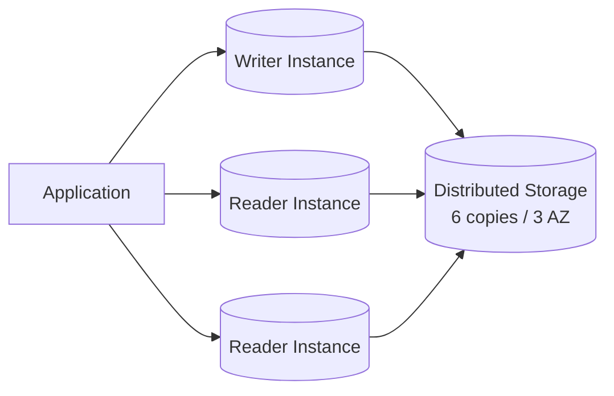
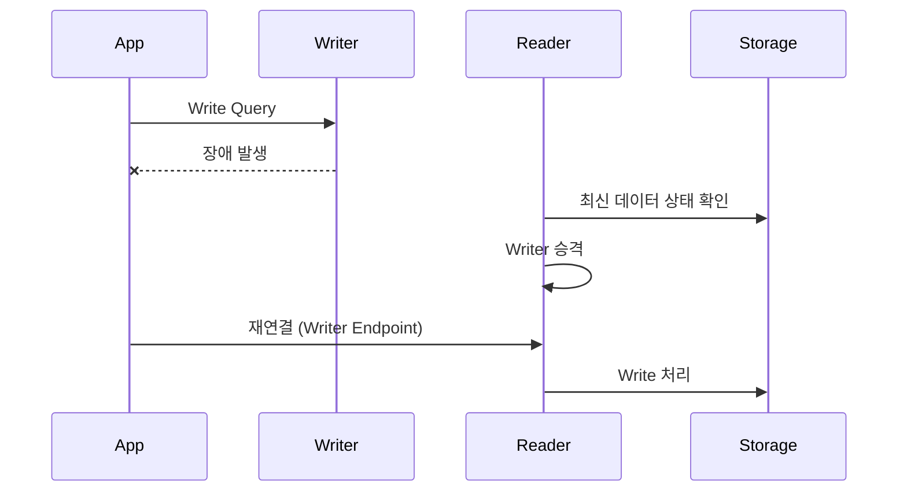
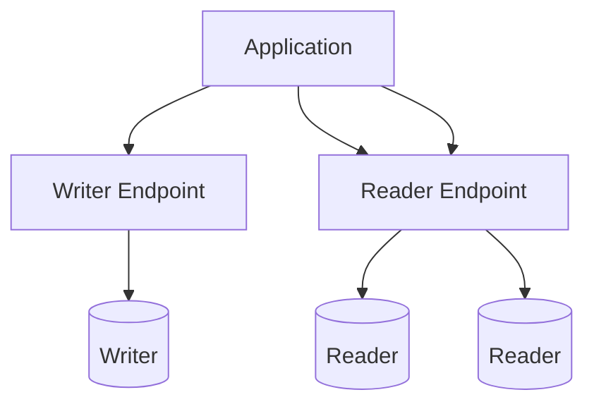

# Aurora MySQL Writer 전환(Reader 승격)과 Endpoint Routing

이 문서는 Aurora MySQL을 실제 운영하면서 가장 많이 오해하는 **Writer 장애 시 동작**과 **Endpoint 라우팅 변경**을 중심으로 정리한다.  
데이터 복구 관점이 아니라 **연결 전환 관점**에서 이해해야 한다.

---

## Aurora 클러스터 기본 구조

- Writer는 항상 1개
- Reader는 0~N개
- 모든 인스턴스는 **같은 스토리지 볼륨을 공유**
- 복제 지연 개념이 거의 없음
- 장애 시 데이터 복구 작업은 발생하지 않음

---

## Writer 장애 발생 시 실제 내부 흐름

중요한 포인트:
- 스토리지 복구 없음
- 데이터 재동기화 없음
- **연결 대상만 변경**
- 애플리케이션 재시도 여부가 체감 장애 시간을 결정

---

## Reader → Writer 승격 조건

Aurora는 아래 조건을 기준으로 Reader를 Writer로 승격한다.

- 가장 최근 redo log 위치
- 인스턴스 상태 (CPU, 메모리)
- AZ 분산 상태
- 장애 원인이 인스턴스 단위인지 AZ 단위인지

운영 중 수동으로 특정 Reader를 승격 대상으로 지정할 수도 있다.

---

## Endpoint 구조와 라우팅 동작

### Writer Endpoint
- 항상 **현재 Writer를 가리킴**
- Failover 발생 시 자동 갱신
- DNS TTL 만료 전까지는 기존 연결 유지

### Reader Endpoint
- Reader 중 하나로 라운드로빈
- 읽기 전용 트래픽 분산용

---

## 실제 운영에서 자주 터지는 문제

### 1. Writer Endpoint를 쓰는데도 장애가 길어지는 경우

원인:
- 커넥션 풀에 기존 Writer 연결이 남아 있음
- TCP keep-alive로 세션이 유지됨

해결:
- Failover 감지 시 커넥션 풀 강제 초기화
- Write 쿼리 실패 시 즉시 재시도 로직 필요

---

### 2. Failover 후 일부 요청만 에러가 나는 경우

원인:
- 일부 Pod / 인스턴스만 DNS 캐시 갱신 지연
- 애플리케이션마다 resolver 동작 차이

해결:
- JVM / Node.js DNS TTL 명시 설정
- 장애 시 전체 재기동을 고려

---

## RDS MySQL과의 결정적 차이

| 항목 | Aurora MySQL | RDS MySQL |
|----|----|----|
| 스토리지 | 공유 분산 스토리지 | 인스턴스 종속 |
| Failover | Reader 승격 | Standby 전환 |
| 데이터 복구 | 없음 | 필요 |
| 체감 장애 | 짧음 | 상대적으로 김 |
| Endpoint | 논리적 추상화 | 인스턴스 중심 |

---

## 정리

- Aurora Failover는 **데이터 문제가 아니다**
- 핵심은 **연결 전환과 애플리케이션 재시도**
- Writer Endpoint를 써도 커넥션 관리가 중요하다
- 장애 시간의 대부분은 DB가 아니라 **애플리케이션에서 발생**

---

문서 작성일: 2025-12-16
