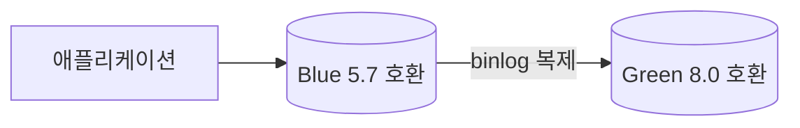

# Aurora MySQL 메이저 버전 업그레이드 (2.x → 3.x)

Aurora MySQL 2.x는 MySQL 5.7 호환, 3.x는 MySQL 8.0 호환이다. 2.x는 이미 표준 지원이 끝났고 extended support로 넘어가면 시간당 추가 비용이 붙기 때문에, 운영 중인 2.x 클러스터는 결국 3.x로 올려야 한다. 문제는 5.7 → 8.0 점프가 MySQL 역사에서 손에 꼽게 깨지는 구간이라는 점이다. 예약어가 늘었고, 파라미터가 통째로 사라졌고, 기본 문자셋 동작이 바뀌었다. "버전 숫자만 올리면 되겠지" 하고 진행하면 업그레이드 도중 멈추거나, 끝난 뒤에 애플리케이션이 깨진다.

이 문서는 2.x → 3.x 업그레이드를 in-place와 Blue-Green 두 방식으로 나눠 다룬다. 클러스터 구조와 페일오버는 [Aurora_DB_Cluster.md](Aurora_DB_Cluster.md), 엔진 내부 비교는 [Aurora_DB.md](Aurora_DB.md)를 같이 보면 된다.

---

## 1. in-place vs Blue-Green, 무엇이 다른가

업그레이드 방식은 크게 두 가지다.

**in-place 업그레이드**는 기존 클러스터를 그 자리에서 3.x로 올린다. `modify-db-cluster`로 엔진 버전을 바꾸면 Aurora가 데이터 딕셔너리를 8.0 포맷으로 변환하고 인스턴스를 재기동한다. 클러스터 엔드포인트, 식별자, 파라미터 그룹 연결이 그대로 유지된다. 대신 변환과 재기동 동안 클러스터 전체가 내려간다. 다운타임은 데이터 양과 메타데이터 객체 수(테이블, 파티션, 트리거 개수)에 비례하는데, 보통 수십 분 단위다. 진행 중에 문제가 터지면 그 자리에서 롤백이 어렵다. 스냅샷에서 복원하는 게 사실상 유일한 복구 수단이다.

**Blue-Green Deployment**는 운영 클러스터(blue)를 복제한 별도 클러스터(green)를 만들고, green을 먼저 3.x로 올린 뒤 binlog 복제로 blue의 변경을 계속 따라붙게 한다. green에서 충분히 검증하고 나서 switchover로 트래픽을 넘긴다. 전환 자체는 보통 1분 안쪽으로 끝난다. blue는 전환 후에도 남아 있어서 문제가 생기면 다시 돌아갈 여지가 있다. 대신 전환 직전까지 blue와 green을 동시에 띄워두므로 인스턴스 비용이 두 배로 든다.

선택 기준은 단순하다. 다운타임을 수십 분 감당할 수 있는 개발/스테이징이거나 데이터가 작으면 in-place로 충분하다. 운영 트래픽이 있고 다운타임을 분 단위로 눌러야 하면 Blue-Green을 쓴다. 메이저 업그레이드처럼 깨질 여지가 큰 작업은 운영에서는 거의 Blue-Green으로 간다. green에서 실제 애플리케이션을 붙여 회귀 테스트를 돌려볼 수 있다는 게 결정적이다.

| 항목 | in-place | Blue-Green |
|------|----------|------------|
| 다운타임 | 수십 분 (변환+재기동) | switchover 약 1분 이내 |
| 롤백 | 스냅샷 복원만 가능 | blue 유지, 되돌릴 여지 있음 |
| 비용 | 추가 없음 | 전환 전까지 클러스터 2벌 |
| 사전 검증 | 제한적 | green에서 실 트래픽 테스트 가능 |
| 엔드포인트 | 그대로 유지 | switchover가 엔드포인트 이름을 교체 |

---

## 2. 업그레이드 전에 반드시 확인할 것

5.7 → 8.0은 호환성 함정이 많다. 사전 점검에서 걸러내지 못하면 업그레이드 작업 자체가 중간에 실패하거나, 더 나쁘게는 끝난 뒤 애플리케이션 쿼리가 깨진다.

### 2.1 예약어 충돌

8.0에서 새로 예약어가 된 단어들이 있다. 대표적으로 `RANK`, `GROUPS`, `ROW`, `LATERAL`, `SYSTEM`, `CUME_DIST` 같은 윈도우 함수 관련 키워드다. 이 단어를 테이블명, 컬럼명, 별칭으로 백틱 없이 써왔다면 8.0에서 문법 오류가 난다.

```sql
-- 5.7에서는 통과, 8.0에서 깨진다
SELECT rank FROM scores ORDER BY rank;

-- 8.0에서는 백틱 필요
SELECT `rank` FROM scores ORDER BY `rank`;
```

스키마에 예약어가 박혀 있으면 업그레이드 전에 컬럼명을 바꾸거나, 최소한 애플리케이션 쿼리를 전부 백틱 처리해야 한다. 컬럼명 변경은 8.0으로 올린 다음에 하는 게 아니라 5.7에서 미리 끝내두는 편이 안전하다.

### 2.2 제거된 파라미터 — query_cache_*

8.0에서 쿼리 캐시가 통째로 제거됐다. `query_cache_type`, `query_cache_size` 같은 파라미터가 사라졌다. 2.x용 파라미터 그룹에 이 값을 명시적으로 박아둔 채로 3.x용 그룹을 만들면 적용되지 않는다. 3.x용 클러스터 파라미터 그룹을 새로 만들 때 이 항목들은 빼야 한다.

마찬가지로 `innodb_file_format`, `innodb_large_prefix` 처럼 8.0에서 의미가 없어지거나 제거된 파라미터들도 있다. 커스텀 파라미터 그룹을 쓰고 있다면 3.x default 그룹과 항목을 비교해서 사라진 것들을 정리해야 한다.

### 2.3 utf8mb3 경고

5.7에서 `utf8`이라고 쓰면 실제로는 `utf8mb3`(3바이트)였다. 8.0은 이걸 deprecated로 보고, 컬럼/테이블이 utf8mb3로 정의돼 있으면 경고를 남긴다. 당장 깨지지는 않지만 이모지나 일부 한자가 안 들어가는 그 문제가 그대로 따라온다. 업그레이드와 별개로 `utf8mb4`로 정리하는 작업을 같이 계획해두는 게 낫다. 단, 문자셋 변환은 테이블 전체를 다시 쓰는 작업이라 업그레이드와 동시에 하지 말고 분리해서 진행해야 한다.

### 2.4 파티션 / 트리거 호환성

5.7에서 MyISAM 기반으로 만든 파티션 테이블이 남아 있으면 8.0에서 문제가 된다. 8.0은 네이티브 파티셔닝만 지원하므로 스토리지 엔진이 파티셔닝을 직접 지원해야 한다. InnoDB면 괜찮지만, 오래된 스키마에 MyISAM 파티션이 끼어 있으면 변환이 막힌다.

트리거는 `definer`가 존재하지 않는 사용자로 걸려 있으면 경고나 오류가 난다. 8.0으로 올리기 전에 trigger definer가 유효한지 확인해야 한다.

---

## 3. pre-upgrade 체크 로그 확인

Aurora는 메이저 업그레이드를 시작하면 먼저 pre-upgrade 검사를 돌린다. 이 검사가 위에서 말한 호환성 문제들을 잡아낸다. 검사에서 막히면 업그레이드가 시작도 안 되고 클러스터는 그대로 5.7 상태로 남는다. 어떤 항목 때문에 막혔는지는 로그를 봐야 안다.

콘솔에서 받을 수도 있지만 CLI로 직접 가져오는 게 빠르다.

```bash
# pre-upgrade 로그 파일 목록 확인
aws rds describe-db-log-files \
  --db-instance-identifier my-aurora-instance-1 \
  --filename-contains upgrade

# 로그 내용 다운로드
aws rds download-db-log-file-portion \
  --db-instance-identifier my-aurora-instance-1 \
  --log-file-name "upgrade-prechecks.log" \
  --output text
```

로그에는 `error`, `warning` 단계로 항목이 찍힌다. `error`로 찍힌 건 무조건 해결해야 진행된다. 예약어로 쓴 컬럼, 변환 불가능한 파티션 등이 여기 걸린다. `warning`은 진행은 되지만 업그레이드 후 동작이 달라질 수 있는 항목이라 — utf8mb3 같은 — 같이 봐둬야 한다.

운영 클러스터를 바로 올리기 전에, 스냅샷을 복원한 임시 클러스터에서 먼저 업그레이드를 시도해보면 pre-upgrade 로그를 안전하게 미리 받아볼 수 있다. 운영에 영향 없이 어디서 막히는지 전부 파악되므로, 메이저 업그레이드 전에 한 번은 거치는 게 좋다.

---

## 4. Blue-Green 생성과 전환 절차

### 4.1 green 생성

Blue-Green은 운영 클러스터를 지정해서 green을 만드는 것으로 시작한다. 이때 green의 엔진 버전을 3.x로 지정하면, green이 만들어지는 시점에 3.x로 올라간 상태로 복제된다.

```bash
aws rds create-blue-green-deployment \
  --blue-green-deployment-name aurora-mysql3-upgrade \
  --source arn:aws:rds:ap-northeast-2:123456789012:cluster:my-aurora-cluster \
  --target-engine-version 8.0.mysql_aurora.3.07.1 \
  --target-db-cluster-parameter-group-name my-aurora-mysql3-cluster-pg \
  --target-db-parameter-group-name my-aurora-mysql3-pg
```

여기서 3.x용 파라미터 그룹을 미리 만들어 지정해야 한다. 2.x 그룹을 그대로 쓸 수 없다. query_cache 관련 항목이 들어 있으면 green 생성 단계에서 걸린다.

green이 만들어지면 green 쪽도 3.x로 올라가면서 pre-upgrade 검사를 거친다. 이 단계에서 호환성 문제가 잡히면 green 생성이 실패하므로, 사실상 Blue-Green 생성 과정이 pre-upgrade 검증을 겸한다.

### 4.2 binlog로 green이 blue를 따라붙는다

green이 만들어진 시점은 blue의 특정 시점 스냅샷이다. 그 이후 blue에 들어오는 쓰기를 green이 받아야 switchover 시점에 데이터가 일치한다. 이걸 binlog 복제로 처리한다. green은 blue를 소스로 하는 복제본으로 동작하면서, blue의 binlog를 받아 자기 데이터에 적용한다.



전환 전까지 애플리케이션은 계속 blue만 본다. green은 뒤에서 binlog를 따라잡으며 대기한다. 복제 지연(replica lag)이 0에 가까워야 switchover가 안전하다. 지연이 크면 전환 시점에 그만큼 데이터가 따라잡힐 때까지 기다리게 된다.

green에서 binlog가 정상적으로 흐르려면 blue의 binlog가 켜져 있어야 한다. 클러스터 파라미터 그룹에서 `binlog_format`이 `OFF`가 아닌지 확인한다. Aurora는 내부 복제에 binlog를 안 쓰지만, Blue-Green은 binlog 복제로 동작하므로 이 설정이 필요하다.

### 4.3 switchover

green이 blue를 거의 따라잡았고 검증이 끝나면 switchover를 실행한다.

```bash
aws rds switchover-blue-green-deployment \
  --blue-green-deployment-identifier bgd-abc123example \
  --switchover-timeout 300
```

switchover가 하는 일은 엔드포인트 이름의 교체다. blue 클러스터의 엔드포인트 이름을 green에게 넘기고, blue는 다른 이름으로 밀려난다. 그래서 애플리케이션은 접속 문자열을 바꾸지 않아도 자동으로 green을 보게 된다. 이게 Blue-Green의 핵심이다 — DNS 엔드포인트는 그대로인데 그 뒤의 실체만 3.x로 바뀐다.

switchover 동안 짧게 쓰기가 막힌다. green이 binlog 복제로 남은 변경을 전부 적용하고, 양쪽 데이터가 일치하는지 확인한 뒤 엔드포인트를 넘긴다. 이 구간이 보통 1분 안쪽이다. `--switchover-timeout`은 이 동작이 끝나기를 기다리는 한계 시간이다. 복제 지연이 크면 타임아웃 안에 못 끝내고 switchover가 취소되며 blue가 그대로 유지된다. 그래서 전환 전에 replica lag을 확인하는 게 중요하다.

전환이 끝나면 옛 blue는 `old1` 같은 접미사가 붙은 이름으로 남는다. 바로 지우지 말고 며칠 두면서 green(이제 운영) 쪽에 이상이 없는지 지켜본 뒤 삭제한다.

---

## 5. 롤백

in-place와 Blue-Green의 롤백 가능성이 크게 다르다.

**in-place**는 일단 변환이 시작되면 돌아갈 수 없다. 데이터 딕셔너리가 8.0 포맷으로 바뀌면 5.7로 되돌리는 경로가 없다. 그래서 in-place 전에는 반드시 수동 스냅샷을 찍어둬야 한다. 문제가 생기면 그 스냅샷에서 새 클러스터를 복원하는 게 유일한 길이고, 이건 업그레이드를 다시 하는 것만큼 시간이 든다. 복원 동안과 그 사이 들어온 데이터 손실까지 감수해야 한다.

```bash
# in-place 전 수동 스냅샷
aws rds create-db-cluster-snapshot \
  --db-cluster-identifier my-aurora-cluster \
  --db-cluster-snapshot-identifier pre-upgrade-57-snapshot
```

**Blue-Green**은 switchover 직후라면 옛 blue가 아직 5.7로 남아 있다. green(현재 운영)에서 치명적인 문제가 발견되면 blue로 트래픽을 되돌리는 선택지가 있다. 단, 주의할 점이 있다. switchover 이후 green에 들어간 쓰기는 blue로 자동으로 흘러가지 않는다. 복제가 blue→green 방향이었기 때문이다. blue로 되돌리면 switchover 이후 green에서 발생한 데이터는 유실된다. 그래서 "되돌릴 여지가 있다"는 건 전환 직후 짧은 시간 안에, 데이터 변경이 크지 않을 때의 이야기다. 시간이 지나 green에 데이터가 쌓이면 사실상 되돌리기 어렵다.

현실적으로는 양쪽 다 "롤백보다 사전 검증"이다. Blue-Green의 진짜 안전장치는 switchover를 되돌리는 게 아니라, switchover 전에 green에서 실 트래픽으로 충분히 검증하는 단계다.

---

## 6. 마이너 버전 업그레이드와 maintenance window

메이저 업그레이드와 달리 마이너 업그레이드(예: 3.05.2 → 3.07.1)는 호환성 깨짐이 거의 없다. 보안 패치와 버그 픽스 위주다. 그래서 Aurora는 마이너 버전 자동 업그레이드를 옵션으로 제공한다.

```bash
aws rds modify-db-cluster \
  --db-cluster-identifier my-aurora-cluster \
  --auto-minor-version-upgrade \
  --apply-immediately
```

`auto-minor-version-upgrade`를 켜두면 AWS가 정한 시점에 maintenance window 안에서 마이너 버전을 자동으로 올린다. maintenance window는 주 단위로 지정하는 시간대다.

```bash
aws rds modify-db-cluster \
  --db-cluster-identifier my-aurora-cluster \
  --preferred-maintenance-window "sun:18:00-sun:18:30"
```

주의할 건 자동이라고 무중단이 아니라는 점이다. 마이너 업그레이드도 인스턴스 재기동을 동반하고, 그동안 짧은 페일오버나 연결 끊김이 발생한다. 자동 업그레이드를 켜두면 이게 트래픽 한가운데 떨어질 수 있으므로, maintenance window는 트래픽이 가장 낮은 시간대로 잡아야 한다. 운영 환경에서는 자동을 끄고, 마이너 업그레이드도 사람이 시점을 정해서 수동으로 적용하는 경우가 많다. UTC 기준이라는 점도 놓치기 쉽다. 한국 시간으로 새벽을 잡으려면 UTC로 변환해서 넣어야 한다.

---

## 7. 업그레이드 중 Reader 영향

Aurora 클러스터는 Writer 한 대와 Reader 여러 대가 같은 스토리지를 공유한다. 업그레이드 방식에 따라 Reader가 받는 영향이 다르다.

**in-place**에서는 클러스터 전체가 함께 올라간다. Writer와 Reader가 같이 재기동되므로 업그레이드 동안 읽기 트래픽도 끊긴다. Reader를 따로 살려둘 수 없다. 읽기 부하를 Reader로 분산하고 있었다면 그 트래픽도 다운타임 동안 함께 멈춘다고 봐야 한다.

**Blue-Green**에서는 green을 만들 때 blue와 같은 토폴로지(Writer + Reader 구성)로 복제할 수 있다. 전환 전까지 blue의 Reader는 정상적으로 읽기 트래픽을 처리한다. switchover 순간에만 짧게 영향이 있고, 전환 후에는 green의 Reader가 그 역할을 이어받는다. 단, green의 Reader 개수와 인스턴스 클래스를 blue와 맞춰두지 않으면 전환 직후 읽기 용량이 줄어들 수 있다. green 생성 시 Reader 구성을 운영과 동일하게 잡아야 전환 후 성능이 떨어지지 않는다.

읽기 트래픽을 reader 엔드포인트로 보내고 있다면, 이 엔드포인트도 switchover 때 함께 green을 가리키도록 넘어간다. 클러스터 엔드포인트와 마찬가지로 reader 엔드포인트 이름도 유지된 채 실체만 바뀐다.

---

## 정리

2.x → 3.x는 단순한 버전 올리기가 아니라 MySQL 5.7 → 8.0 마이그레이션이다. 예약어, 사라진 파라미터, 문자셋 동작 변화를 사전 점검에서 잡아내지 못하면 업그레이드가 중간에 막히거나 끝난 뒤 애플리케이션이 깨진다. 스냅샷 복원 클러스터에서 pre-upgrade 로그를 먼저 받아 어디서 막히는지 전부 확인한 다음, 운영은 Blue-Green으로 green에서 실 트래픽 검증을 거쳐 switchover하는 흐름이 가장 안전하다. 클러스터 구조 자체는 [Aurora_DB_Cluster.md](Aurora_DB_Cluster.md), 엔진 내부 동작 차이는 [Aurora_DB.md](Aurora_DB.md)에서 이어 보면 된다.
