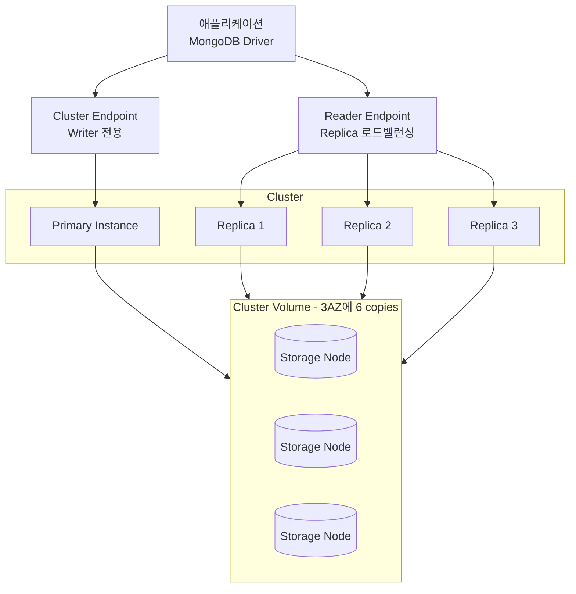

# Amazon DocumentDB

> 처음 DocumentDB를 써본 개발자들이 가장 많이 하는 오해는 "MongoDB가 AWS에서 관리형으로 돌아가는 것"이라고 생각하는 것이다.
> 결론부터 말하면 DocumentDB는 MongoDB가 아니다. MongoDB 와이어 프로토콜만 흉내내는 별도의 엔진이고, 내부 구조는 Aurora에 훨씬 가깝다.
> 그래서 "MongoDB 드라이버로 붙을 수 있다"는 장점과 "MongoDB 기능이 다 되지는 않는다"는 함정이 동시에 존재한다.

---

## 1. DocumentDB가 뭔지 정확히 짚기

DocumentDB는 AWS가 만든 문서 지향 데이터베이스 서비스다. 공식적으로는 "MongoDB와 호환되는(with MongoDB compatibility)" 관리형 문서 DB라고 표현하는데, 이 "호환된다"는 말이 사람들을 헷갈리게 한다.

실제로는 이렇게 돌아간다.

- 클라이언트는 MongoDB 드라이버(예: `pymongo`, `mongoose`, `spring-data-mongodb`)로 접속한다.
- 서버 쪽은 MongoDB 서버 코드가 아니라 AWS가 자체 구현한 엔진이다.
- 스토리지 계층은 MongoDB의 WiredTiger가 아니라 Aurora와 같은 분산 스토리지 위에 올라간다.

즉 "MongoDB 와이어 프로토콜을 말하는 Aurora 같은 것"이라고 이해하면 가장 정확하다. 그래서 복제/고가용성/스토리지 확장 방식은 Aurora와 판박이인데, 쿼리 언어는 MongoDB 문법을 쓴다.

---

## 2. 클러스터 아키텍처: Cluster / Instance / Storage 분리

DocumentDB의 구조를 이해하지 못하면 요금 고지서나 장애 복구 시나리오에서 매번 헷갈린다. 핵심은 **연산 계층과 스토리지 계층이 완전히 분리**되어 있다는 점이다.

### 2.1 3계층 구조



- **Cluster**: 전체를 묶는 논리 단위. 클러스터 파라미터, 스냅샷, 백업 보관 주기, 엔드포인트가 이 단위에 묶인다.
- **Instance**: 실제 쿼리를 처리하는 연산 노드. Primary 1개 + Replica 최대 15개 구성이 가능하다.
- **Storage**: 클러스터 볼륨이라고 부르는 분산 스토리지. 3개 AZ에 걸쳐 6개 복제본을 유지하고, 인스턴스가 내려가도 스토리지는 멀쩡하다.

### 2.2 엔드포인트 3종

DocumentDB를 운영할 때 가장 많이 실수하는 지점이 엔드포인트 선택이다.

| 엔드포인트 | 용도 | 주의사항 |
|---|---|---|
| Cluster Endpoint | 쓰기 포함 모든 작업. 항상 Primary를 가리킨다 | Failover 시 DNS가 새 Primary로 갱신됨 |
| Reader Endpoint | 읽기 부하 분산. Replica들 사이에서 round-robin | 연결 직후 DNS 캐싱 때문에 고르게 분산 안 될 수 있음 |
| Instance Endpoint | 특정 인스턴스에 직접 연결 | Failover 시 알아서 안 따라감. 디버깅/임시 용도 |

운영 코드에서 Reader Endpoint를 쓸 때 주의할 점이 있다. 애플리케이션 프로세스가 한 번 DNS 해석한 IP에 계속 붙으면, 여러 Replica에 고르게 분산되지 않는다. 장시간 떠 있는 서비스라면 커넥션 풀 설정에서 주기적 재연결이나 `serverSelectionTimeoutMS` 조정이 필요하다.

---

## 3. MongoDB와의 호환성과 차이점

"MongoDB 드라이버로 붙는다"는 말에 속으면 안 된다. 호환성은 버전과 기능 범위에 따라 천차만별이다.

### 3.1 지원 버전

DocumentDB는 MongoDB 버전을 따라가는 형태인데, 전체 기능을 그대로 구현하는 게 아니라 선별적으로 구현한다. 글을 쓰는 시점 기준으로 주로 쓰이는 API 호환 버전은 3.6 / 4.0 / 5.0 계열이다. 최신 MongoDB(7.x, 8.x)에 있는 기능들은 DocumentDB에 없을 확률이 높다고 보는 게 안전하다.

새 프로젝트에서 MongoDB 최신 기능(예: Time Series Collections, Atlas Search, Change Stream의 일부 옵션 등)을 염두에 두고 있다면, DocumentDB로 가기 전에 반드시 호환성 문서를 체크해야 한다.

### 3.2 자주 발목 잡히는 미지원 기능

현업에서 실제로 부딪히는 주요 차이점들이다.

- **트랜잭션**: 예전 버전 DocumentDB는 트랜잭션 자체가 없었다. 지원 버전(4.0+)에서도 한 샤드 내에서만 가능하고, 제한이 MongoDB보다 많다.
- **일부 Aggregation 연산자**: `$graphLookup`, `$facet`, `$bucket` 같은 연산자들이 버전에 따라 없거나 동작이 다르다.
- **Change Stream**: 이벤트 기반 아키텍처에서 흔히 쓰는데, DocumentDB는 컬렉션 단위가 아니라 클러스터 단위로 활성화해야 하고, 보관 기간도 따로 설정해야 한다.
- **Text Search**: MongoDB의 `$text` 인덱스는 DocumentDB에서 지원하지 않거나 제약이 있다. Text Search가 필요하면 OpenSearch로 분리하는 게 보통이다.
- **TTL 인덱스 동작**: 있긴 한데, 만료 처리 주기가 정확히 MongoDB와 같지 않아서 시간 민감한 데이터에서 문제가 된다.
- **Capped Collection**: 지원이 제한적이거나 불안정하다. 로그 큐 용도로는 쓰지 않는 편이 낫다.

실무 팁 하나. 기존 MongoDB 코드를 DocumentDB로 옮길 때는, AWS에서 제공하는 `Amazon DocumentDB Compatibility Tool`을 먼저 돌려서 쿼리 호환성을 스캔하는 게 좋다. 런타임에 `CommandNotSupported` 예외로 맞기 전에 정적 분석으로 찾아낼 수 있는 게 꽤 많다.

### 3.3 연결 방식은 거의 똑같다

코드 레벨에서는 거의 똑같이 생겼다. 차이는 TLS 인증서와 `replicaSet` 파라미터 정도다.

```python
import pymongo
import ssl

uri = (
    "mongodb://myuser:mypassword@"
    "docdb-cluster.cluster-xxxxxxxx.ap-northeast-2.docdb.amazonaws.com:27017/"
    "?tls=true"
    "&tlsCAFile=/opt/certs/global-bundle.pem"
    "&replicaSet=rs0"
    "&readPreference=secondaryPreferred"
    "&retryWrites=false"
)

client = pymongo.MongoClient(uri)
db = client["orders"]
db.items.insert_one({"sku": "A-101", "qty": 3})
```

눈여겨볼 파라미터.

- `tls=true` + `tlsCAFile`: DocumentDB는 인 트랜짓 암호화가 기본이다. AWS의 global bundle 인증서를 넣어줘야 한다.
- `replicaSet=rs0`: DocumentDB 클러스터는 리플리카셋으로 노출된다. 드라이버가 토폴로지 발견을 하려면 필수다.
- `retryWrites=false`: 중요하다. DocumentDB는 `retryWrites=true`를 지원하지 않는다. 기본값이 true인 최신 MongoDB 드라이버를 쓸 때 이걸 꺼두지 않으면 쓰기 연산이 전부 실패한다.

---

## 4. 인스턴스 클래스와 스케일링

### 4.1 인스턴스 클래스

DocumentDB는 메모리 최적화(r 계열) 인스턴스를 주로 쓴다. t 계열은 개발/테스트용으로만 쓰는 게 맞다. 워크로드가 메모리 기반 인덱스/워킹셋에 크게 의존하기 때문에, 운영 환경에서는 r5/r6g 정도로 시작하는 경우가 많다.

주의할 점은 **인덱스와 워킹셋이 메모리에 안 올라가면 급격히 느려진다**는 것이다. DocumentDB는 인덱스를 디스크에서 읽어오는 순간 I/O 비용과 지연이 크게 뛴다. 이건 뒤 비용 구조 항목과도 연결된다.

### 4.2 수직 / 수평 스케일링

- **수직 스케일링(Scale Up)**: 인스턴스 클래스를 더 큰 것으로 바꾼다. 재시작이 필요하고 보통 수 분 정도 다운타임이 생긴다. Failover를 먼저 시키고 작은 쪽을 먼저 바꾸는 식으로 진행하면 체감 다운타임을 줄일 수 있다.
- **수평 스케일링(Scale Out)**: Read Replica를 추가하는 방식이다. 쓰기 부하는 Primary 하나로 처리해야 하므로, 쓰기 TPS가 병목이면 수평 스케일링으로는 해결이 안 된다. 이 경우 문서 구조를 샤딩 가능한 형태로 재설계하거나, DocumentDB **Elastic Cluster**(샤딩 지원)로 옮기는 것을 고려한다.
- **DocumentDB Elastic Cluster**: 상대적으로 나중에 나온 기능으로, 해시 기반 샤딩을 지원한다. 단일 클러스터의 쓰기 한계를 넘어야 할 때만 검토한다. 기존 클러스터와 운영 모델이 조금 다르니 마이그레이션 전에 반드시 PoC를 거쳐야 한다.

---

## 5. 백업과 스냅샷

이 부분도 Aurora와 매우 비슷하다.

- **자동 백업(Continuous Backup)**: 스토리지 계층에서 지속적으로 이뤄진다. 보관 기간은 1~35일 사이로 설정한다. 이 기간 내 어느 시점이든 PITR(Point-In-Time Recovery) 복원이 가능하다.
- **수동 스냅샷**: 명시적으로 찍는 스냅샷. 보관 기간 제한이 없어 마이그레이션, 릴리즈 전 보관용으로 쓴다. 수동 스냅샷은 삭제될 때까지 스토리지 요금이 청구된다.
- **복원 방식**: 스냅샷으로 복원하면 **새 클러스터가 만들어진다.** 기존 클러스터를 덮어쓰는 방식이 아니다. 그래서 복원 후 애플리케이션 엔드포인트를 바꿔줘야 한다. 이걸 모르고 "복원했는데 왜 반영이 안 되지?" 하는 경우가 많다.
- **크로스 리전 스냅샷**: DR 용도로 다른 리전으로 스냅샷을 복사할 수 있다. 단, DocumentDB는 리전 단위 가용성만 제공하고 Aurora Global Database처럼 리전 간 지연 수준의 복제는 기본 제공하지 않는다.

---

## 6. 보안

### 6.1 네트워크 격리 (VPC)

DocumentDB 클러스터는 반드시 VPC 안에만 만들 수 있다. 퍼블릭 IP를 붙이는 옵션 자체가 없다. 외부에서 접근하려면 VPN, Direct Connect, VPC Peering, 또는 Bastion 호스트 경유가 필요하다.

로컬에서 운영 DocumentDB에 붙어야 할 때 개발자들이 많이 쓰는 방법은 SSH 터널링이다.

```bash
# Bastion 호스트를 경유해 로컬 27018 → DocumentDB 27017 로 포워딩
ssh -i ~/.ssh/bastion.pem -f -N -L 27018:docdb-cluster.cluster-xxx.ap-northeast-2.docdb.amazonaws.com:27017 \
    ec2-user@bastion.example.com

# 로컬에서 붙기
mongosh --host localhost:27018 \
    --username admin \
    --password \
    --tls \
    --tlsCAFile /opt/certs/global-bundle.pem \
    --tlsAllowInvalidHostnames
```

`--tlsAllowInvalidHostnames`가 왜 필요한가? 터널을 통하면 클라이언트는 `localhost`로 접속하는데 서버 인증서에는 AWS 엔드포인트 이름이 박혀 있어서, 호스트 이름 검증이 실패한다. 그래서 개발 환경에서만 이 옵션을 쓴다. 운영에서는 절대 쓰지 않는다.

### 6.2 인증

- **마스터 유저 / IAM DB 인증**: 기본은 사용자명/비밀번호 방식이다. IAM 인증은 MongoDB 프로토콜 특성상 RDS처럼 폭넓게 지원되지는 않고, 일부 버전에서만 가능하다.
- **비밀번호 저장**: 애플리케이션 설정 파일에 박아두지 말고 Secrets Manager나 Parameter Store에서 꺼내 쓰는 게 표준이다. Secrets Manager는 로테이션도 자동화 가능하다.
- **권한 관리**: DocumentDB도 MongoDB처럼 Role 기반으로 권한을 나눈다. 마스터 유저 하나만 쓰지 말고, 애플리케이션별로 최소 권한 계정을 분리해야 한다.

### 6.3 전송 구간 / 저장 구간 암호화

- **TLS(In-Transit)**: 기본 활성화. 끄는 옵션이 있긴 한데 실수로라도 끄면 안 된다.
- **저장 시 암호화(At-Rest)**: KMS 기반. 클러스터 생성 시점에만 설정할 수 있다. 만든 뒤에 바꾸려면 스냅샷 뜨고 새 클러스터로 복원해야 한다.

---

## 7. 성능 모니터링

### 7.1 CloudWatch 지표

기본 관찰 지표는 CloudWatch에 나온다. 운영하면서 가장 자주 보게 되는 지표들은 이렇다.

| 지표 | 의미 | 주의할 값 |
|---|---|---|
| `CPUUtilization` | 인스턴스 CPU 사용률 | 지속적으로 80% 이상이면 스케일업 |
| `FreeableMemory` | 사용 가능한 메모리 | 계속 줄어들면 워킹셋 > 메모리 신호 |
| `BufferCacheHitRatio` | 캐시 적중률 | 99% 미만으로 계속 떨어지면 인덱스/메모리 이슈 |
| `DatabaseConnections` | 현재 연결 수 | 인스턴스 클래스별 상한 존재 |
| `ReadLatency` / `WriteLatency` | 읽기/쓰기 지연 | 갑자기 튀면 대개 인덱스 풀 스캔 |
| `VolumeReadIOPs` / `VolumeWriteIOPs` | 스토리지 I/O 수 | 비용과 직결 |
| `ReplicaLag` | Replica 지연 | 몇 백 ms 이상 지속되면 확인 필요 |

### 7.2 Performance Insights

DocumentDB도 Performance Insights를 지원한다. RDS의 그것과 UI가 거의 같고, 쿼리별 대기 시간/실행 빈도를 보여준다. 쿼리 튜닝의 출발점이다.

Performance Insights가 없던 시절에는 프로파일러를 직접 켜고 `system.profile` 컬렉션을 뒤지는 수밖에 없었는데, 지금은 UI에서 Top SQL처럼 Top Query를 바로 볼 수 있다. 다만 기본 보관 기간은 짧은 편이라, 장기 분석이 필요하면 보관 기간을 유료 옵션으로 늘려야 한다.

### 7.3 슬로우 쿼리 프로파일링

MongoDB의 `profile` 명령은 DocumentDB에서도 동일하게 쓸 수 있다.

```javascript
// 100ms 이상 걸린 쿼리를 모두 기록
db.setProfilingLevel(1, { slowms: 100 });

// 최근 20개 슬로우 쿼리 조회
db.system.profile.find().sort({ ts: -1 }).limit(20).pretty();
```

`setProfilingLevel(2, ...)`로 모든 쿼리를 찍으면 트래픽 많은 환경에서 금방 로그가 폭주한다. 실전에서는 레벨 1로 충분하다.

CloudWatch Logs로 audit log 와 profiler log를 내보내는 옵션도 있다. 장애 분석을 위해서는 켜두는 게 보통이다.

---

## 8. 실무 트러블슈팅

5년차 정도 되면 DocumentDB 관련해서 꼭 한 번은 겪는 문제들이다.

### 8.1 "연결은 되는데 쓰기가 안 된다"

증상: `insert`, `update` 할 때마다 `Retryable writes are not supported` 에러가 난다.

원인: 드라이버가 최신 버전이면 기본 `retryWrites=true`로 연결을 시도한다. DocumentDB는 이걸 아예 지원하지 않는다.

해결: 접속 URI에 `retryWrites=false`를 명시한다. 프레임워크(예: Spring Data Mongo)에서는 설정 속성으로 내리면 된다.

### 8.2 "Replica에 붙어서 읽으니 오래된 데이터가 보인다"

증상: 방금 쓴 값이 Reader 엔드포인트로 읽으면 안 보일 때가 있다.

원인: DocumentDB도 비동기 복제라 Replica 지연이 존재한다. 일반적으로 수십 ms지만, 부하가 높을 때 더 커질 수 있다.

해결: 쓰기 직후 읽는 로직이라면 `readPreference=primary`를 쓰거나, read concern을 높이는 대신 캐시 레이어에서 처리하는 방식이 현실적이다. "쓰고 바로 읽기"는 Primary로 보낸다.

### 8.3 커넥션 풀 튜닝

DocumentDB 인스턴스 클래스마다 최대 연결 수 상한이 있다. r5.large 기준으로 수천 단위지만, 애플리케이션 인스턴스 수와 풀 사이즈를 곱하면 금방 상한에 닿는다.

예를 들어 ECS 태스크 50개 × 드라이버 풀 100 = 5000 커넥션. r5.large 상한에 근접하거나 초과한다.

대응:

- 드라이버의 `maxPoolSize`를 너무 크게 잡지 않는다. 보통 50~100이면 충분하다.
- 짧은 수명 Lambda/배치는 `maxIdleTimeMS`와 `connectTimeoutMS`를 짧게 잡아 유휴 연결이 쌓이지 않게 한다.
- 실제 연결 수는 CloudWatch `DatabaseConnections` 지표로 지속 모니터링한다.

### 8.4 인덱스 동작이 MongoDB와 미묘하게 다르다

같은 쿼리 + 같은 인덱스인데 DocumentDB에서는 `COLLSCAN`이 찍히는 경우가 있다. DocumentDB의 쿼리 옵티마이저가 MongoDB와 동일한 선택을 하지 않기 때문이다.

디버깅 순서.

```javascript
// 1. 실행 계획 확인
db.orders.find({ userId: 123, status: "PAID" })
  .explain("executionStats");

// 2. COLLSCAN 이면 힌트로 강제
db.orders.find({ userId: 123, status: "PAID" })
  .hint({ userId: 1, status: 1 });

// 3. 예상대로 IXSCAN 인지 다시 확인
```

특히 복합 인덱스의 "prefix 규칙"이나 `$or` 쿼리에서의 인덱스 병합 동작에서 차이가 나는 경우가 많다. 대량 배포 전에 반드시 운영 수준 데이터로 `explain`을 찍어봐야 한다.

### 8.5 Change Stream이 갑자기 비어 있다

Change Stream은 기본값으로 3시간만 보관된다. 컨슈머가 3시간 이상 죽어 있으면 이벤트가 증발한다. 카프카처럼 무한히 쌓이는 게 아니라는 걸 기억해야 한다. 장시간 유지보수 중에는 보관 기간을 늘리거나 DLQ 전략을 따로 마련한다.

---

## 9. DynamoDB와의 비교

AWS에서 NoSQL을 고를 때 가장 자주 나오는 질문이다. "DynamoDB로 갈까, DocumentDB로 갈까?"

| 항목 | DocumentDB | DynamoDB |
|---|---|---|
| 데이터 모델 | JSON 문서 (중첩 구조 자유로움) | Key-Value + 문서(속성 단위) |
| 쿼리 유연성 | Mongo 쿼리 언어(복잡한 필터/Aggregation) | Primary Key / GSI 기반, 쿼리 패턴 사전 설계 필요 |
| 스키마 진화 | 자유로움 | 자유로움(단, 쿼리는 키 설계에 묶임) |
| 트랜잭션 | 제한적 지원 | 트랜잭션 API 별도 존재, 비용 따로 |
| 스케일링 | 수직 + Replica 추가 / Elastic Cluster | 완전 관리형 오토스케일, 샤딩 투명 |
| 가용성 모델 | 클러스터(Primary + Replicas) | 리전 단위 서버리스 |
| 운영 부담 | 인스턴스 관리 필요 | 서버리스, 인스턴스 개념 없음 |
| 요금 구조 | 인스턴스 시간 + 스토리지 + I/O + 백업 | 읽기/쓰기 단위 과금(On-Demand 또는 Provisioned) |
| 적합한 케이스 | 기존 MongoDB 코드베이스, 복잡한 문서 쿼리 | 예측 가능한 액세스 패턴, 극단적 스케일 |

실무 판단 기준.

- **기존 MongoDB 앱을 옮기는 경우**: DocumentDB가 당연히 유리하다. 코드 거의 그대로 쓸 수 있다.
- **새로 설계하는 서비스에서 쿼리 패턴이 확실하고 극단적 스케일이 필요한 경우**: DynamoDB가 운영/비용 면에서 유리하다.
- **문서 구조가 복잡하고 Aggregation/조인 비슷한 쿼리가 많은 경우**: DocumentDB가 낫다.
- **트래픽이 불규칙하고 운영팀이 작은 경우**: DynamoDB On-Demand가 운영 부담이 훨씬 적다.

DocumentDB는 인스턴스 타입을 선택하고 상시 켜두는 모델이다. DynamoDB처럼 "안 쓰면 안 내는" 방식이 아니다. 이 차이가 비용 구조의 핵심이다.

---

## 10. 비용 구조

DocumentDB 요금은 크게 네 덩어리로 나온다.

1. **인스턴스 시간당 요금**
   - Primary + Replica 각각 인스턴스 단위로 과금된다. Replica를 하나 띄우면 인스턴스 비용이 하나 더 붙는다.
   - 상시 과금이다. 트래픽이 0이어도 나온다.
2. **스토리지 요금**
   - 사용한 만큼 GB-month 기준. 자동으로 증가한다.
   - 수동으로 줄이는 방법은 없다. 문서를 지워도 스토리지 할당은 잘 안 줄어든다. 공간 회수가 필요하면 `mongodump`/`mongorestore`로 새 클러스터에 옮겨 담는 식의 작업이 필요하다.
3. **I/O 요금**
   - 읽기/쓰기 요청 수에 따라 백만 건 단위로 과금된다.
   - 전체 비용에서 생각보다 큰 비중을 차지하는 경우가 많다. 특히 인덱스가 부족해서 COLLSCAN이 많이 도는 시스템은 I/O 요금이 튄다.
4. **백업 스토리지 요금**
   - 자동 백업 기간 이상의 자동 백업 + 수동 스냅샷 용량에 대해 과금된다.
   - 오래된 수동 스냅샷을 방치하면 계속 비용이 나간다. 주기적 정리가 필요하다.

비용 최적화 포인트.

- 개발/스테이징 클러스터는 **Stop/Start**로 야간 정지한다. DocumentDB는 최대 7일까지 정지할 수 있고, 7일이 지나면 자동으로 다시 시작된다.
- Replica 개수를 실제 읽기 부하에 맞춘다. "안전하게 3개" 같은 식으로 두면 쓰지도 않는 인스턴스 요금이 계속 나간다.
- 인덱스를 잘 잡아 I/O 요금을 줄인다. CloudWatch `VolumeReadIOPs`가 튀는 쿼리부터 잡는 게 비용과 성능 양쪽에 효과가 크다.
- 오래된 수동 스냅샷을 정책적으로 정리한다. Lifecycle 스크립트를 Lambda로 돌려 N일 이상된 스냅샷을 자동 삭제한다.

### 10.1 Reserved Instance

RDS와 마찬가지로 1년/3년 예약 인스턴스를 쓸 수 있다. 운영 환경에서 상시 떠 있는 클러스터라면 예약 인스턴스로 30~60% 절감이 가능하다. 단, 인스턴스 클래스를 자주 바꿀 계획이라면 예약 기간이 발목을 잡을 수 있으니, 워크로드가 안정된 후에 적용하는 게 낫다.

---

## 정리

DocumentDB는 "MongoDB 호환"이라는 수식어 하나에 많은 것이 담겨 있다. 드라이버 호환성은 높지만 기능 호환성은 부분적이고, 내부 아키텍처는 MongoDB보다 Aurora에 가깝다.

기존 MongoDB 코드베이스의 운영 부담을 AWS에 맡기고 싶고, 최신 MongoDB 고유 기능에 크게 의존하지 않는 서비스라면 DocumentDB는 충분히 합리적인 선택이다. 반면 최신 MongoDB 기능이 필수거나 트래픽 폭이 극단적이라 상시 과금 모델이 부담스럽다면, MongoDB Atlas나 DynamoDB로 재검토하는 편이 낫다.

운영 시작 전에 반드시 체크할 것은 세 가지다. 드라이버의 `retryWrites=false` 설정, TLS 인증서 배포, 그리고 실제 데이터로 `explain` 찍어본 쿼리 계획. 이 세 가지를 점검해두면 초기 운영에서 마주칠 문제의 상당 부분을 예방할 수 있다.
