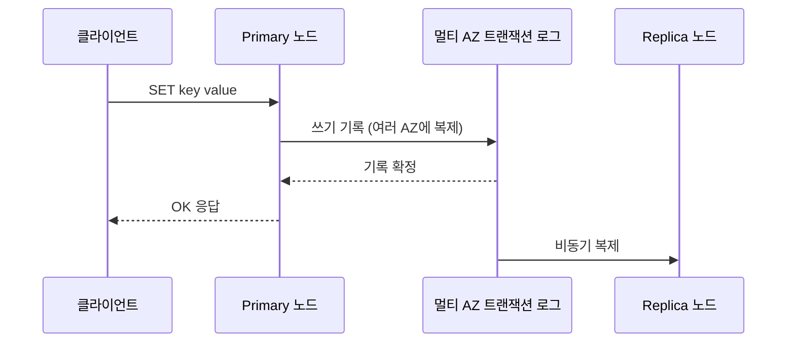
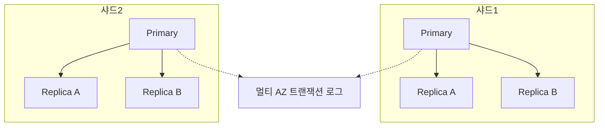

# AWS MemoryDB

## 개요

MemoryDB는 Redis 프로토콜과 호환되는 인메모리 데이터베이스다. 이름에 DB가 붙은 이유가 있다. ElastiCache Redis가 캐시 용도라면, MemoryDB는 데이터를 잃어버리지 않는다는 전제로 설계됐다. 멀티 AZ 트랜잭션 로그에 모든 쓰기를 기록하기 때문에, 노드가 통째로 죽어도 커밋된 데이터는 남는다.

처음 이름만 보면 헷갈린다. "메모리에 두는데 어떻게 영속성이 있지?"라는 질문이 자연스럽다. 핵심은 데이터를 메모리에서 읽고 쓰지만, 쓰기를 확정하기 전에 별도의 분산 로그에 먼저 기록한다는 점이다. 메모리는 읽기/쓰기 속도를 위한 것이고, 로그는 내구성을 위한 것이다. 이 둘을 분리해서 둘 다 가져간다.

실무에서 MemoryDB를 고려하는 순간은 보통 이렇다. Redis를 캐시가 아니라 주 저장소로 쓰고 싶은데, ElastiCache는 노드가 죽으면 데이터가 날아갈 수 있어서 불안한 경우다. 세션 스토어, 실시간 리더보드, 메시지 큐 상태처럼 Redis 자료구조가 잘 맞으면서도 유실되면 곤란한 데이터가 여기 해당한다.

## ElastiCache Redis와 뭐가 다른가

겉으로 보면 둘 다 Redis다. 같은 명령어를 쓰고, 같은 클라이언트 라이브러리로 붙는다. `redis-cli`로 접속하면 구분이 안 된다. 차이는 데이터를 어떻게 보관하느냐에 있다.

### ElastiCache Redis의 내구성

ElastiCache Redis도 영속화 옵션이 있다. RDB 스냅샷과 AOF(Append Only File)를 지원한다. 하지만 둘 다 한계가 있다.

RDB 스냅샷은 특정 시점에 메모리 전체를 디스크로 덤프한다. 스냅샷 사이에 들어온 쓰기는 노드가 죽으면 사라진다. 1시간마다 스냅샷을 뜬다면 최악의 경우 59분치 데이터가 날아간다.

AOF는 명령어를 파일에 계속 기록한다. 더 촘촘하지만 ElastiCache에서는 클러스터 모드에서 제약이 있고, AOF 파일 자체가 노드 로컬에 있어서 노드가 물리적으로 손상되면 같이 사라진다. fsync 주기에 따라 마지막 몇 초치가 유실되기도 한다.

정리하면 ElastiCache의 영속화는 "캐시를 빠르게 다시 채우기 위한 백업"에 가깝다. 데이터를 절대 잃으면 안 되는 용도로 설계된 게 아니다.

### MemoryDB의 멀티 AZ 트랜잭션 로그

MemoryDB는 접근이 다르다. 쓰기 요청이 들어오면 primary 노드의 메모리에 적용하기 전후로 멀티 AZ 트랜잭션 로그에 그 쓰기를 기록한다. 이 로그는 여러 가용 영역에 걸쳐 복제된 분산 저장소다. 쓰기가 이 로그에 안전하게 기록된 다음에야 클라이언트에게 성공 응답이 간다.



이 구조 덕분에 primary 노드가 갑자기 죽어도, 트랜잭션 로그에는 커밋된 모든 쓰기가 남아있다. 새 노드가 올라올 때 이 로그에서 데이터를 복구한다. 그래서 MemoryDB는 데이터 유실 없는 페일오버를 보장한다고 말한다.

대신 공짜는 아니다. 쓰기마다 분산 로그 기록을 기다리기 때문에 ElastiCache Redis보다 쓰기 지연이 더 크다. AWS 문서 기준으로 MemoryDB의 쓰기 지연은 한 자리 밀리초, 읽기 지연은 마이크로초 단위다. ElastiCache는 읽기/쓰기 모두 마이크로초를 노린다. 이 차이가 작아 보여도, 초당 수만 건 쓰기가 들어오는 워크로드에서는 체감이 된다.

| 항목 | ElastiCache Redis | MemoryDB |
|------|-------------------|----------|
| 주 용도 | 캐시 | 주 데이터베이스 |
| 내구성 | RDB/AOF (유실 가능) | 멀티 AZ 트랜잭션 로그 (유실 없음) |
| 쓰기 지연 | 마이크로초 | 한 자리 밀리초 |
| 읽기 지연 | 마이크로초 | 마이크로초 |
| 페일오버 시 데이터 | 유실 가능 | 유실 없음 |
| 가격 | 상대적으로 저렴 | 더 비쌈 |

## primary / replica 구조

MemoryDB는 샤드 기반 클러스터로 동작한다. 각 샤드는 하나의 primary 노드와 0~5개의 replica 노드로 구성된다.

primary 노드가 쓰기를 받는다. 같은 샤드의 replica 노드들은 primary로부터 데이터를 복제받아서 읽기 요청을 처리한다. 읽기를 replica로 분산하면 primary의 부담이 줄어든다.



키는 해시 슬롯에 따라 샤드로 나뉜다. Redis 클러스터 모드와 같은 방식이다. 키가 16384개 슬롯 중 하나에 매핑되고, 각 샤드가 슬롯 범위를 담당한다. 데이터가 커지면 샤드를 늘려서 수평 확장한다.

replica를 여러 AZ에 분산 배치하는 게 기본이다. 한 AZ가 통째로 장애가 나도 다른 AZ의 노드로 서비스가 이어진다.

### 읽기 일관성 주의점

replica에서 읽을 때 일관성을 짚고 넘어가야 한다. primary에서 replica로의 복제는 비동기다. 방금 primary에 쓴 값을 곧바로 replica에서 읽으면 아직 복제가 안 돼서 옛날 값이 나올 수 있다.

MemoryDB는 트랜잭션 로그 덕분에 내구성은 강하지만, replica 읽기의 일관성은 여전히 결과적 일관성(eventual consistency)이다. 강한 일관성이 필요한 읽기는 primary로 보내야 한다. Redis 클라이언트에서 읽기 라우팅을 어떻게 설정했는지 확인해야 한다. 많은 클라이언트가 기본적으로 primary로 읽도록 돼 있지만, `READONLY` 모드나 replica 우선 라우팅을 켜뒀다면 stale read가 발생한다.

```javascript
// ioredis 클러스터 설정 예시
const Redis = require('ioredis');

const cluster = new Redis.Cluster(
  [{ host: 'my-memorydb.xxxx.clustercfg.memorydb.ap-northeast-2.amazonaws.com', port: 6379 }],
  {
    redisOptions: {
      tls: {},        // MemoryDB는 전송 중 암호화가 기본
      password: process.env.MEMORYDB_PASSWORD,
    },
    // 강한 일관성이 필요하면 master(primary)로만 읽는다
    scaleReads: 'master',
  }
);
```

`scaleReads`를 `slave`나 `all`로 바꾸면 읽기가 replica로 분산되지만 stale read 가능성을 받아들여야 한다. 리더보드 순위처럼 약간 늦어도 되는 데이터면 replica 읽기로 분산하는 게 맞고, 결제 직후 잔액 확인처럼 방금 쓴 값을 정확히 읽어야 하면 primary로 가야 한다.

## 페일오버 동작

primary 노드가 죽으면 MemoryDB가 자동으로 페일오버를 처리한다. 순서는 이렇다.

primary 장애가 감지되면, 같은 샤드의 replica 중 하나가 새 primary로 승격된다. 승격된 노드는 트랜잭션 로그를 참조해서 마지막 커밋된 상태까지 데이터를 맞춘다. 그래서 페일오버 후에도 커밋된 쓰기가 사라지지 않는다.

ElastiCache Redis의 페일오버와 다른 점이 여기다. ElastiCache에서 replica를 승격할 때, 그 replica가 비동기 복제 지연 때문에 primary의 최신 쓰기를 못 받았다면 그 쓰기는 유실된다. MemoryDB는 트랜잭션 로그가 정답을 들고 있어서, 승격된 노드가 로그를 보고 빠진 쓰기를 채운다.

페일오버 시간은 보통 수 초에서 십수 초 안에 끝난다. 이 시간 동안 쓰기는 일시적으로 실패한다. 애플리케이션에서 재시도 로직을 넣어둬야 한다.

```javascript
// 페일오버 중 쓰기 실패에 대비한 재시도
async function setWithRetry(client, key, value, maxRetries = 3) {
  let lastErr;
  for (let i = 0; i < maxRetries; i++) {
    try {
      return await client.set(key, value);
    } catch (err) {
      lastErr = err;
      // 페일오버 중에는 잠깐 기다렸다 재시도
      await new Promise(r => setTimeout(r, 200 * (i + 1)));
    }
  }
  throw lastErr;
}
```

replica가 하나도 없는 샤드(primary 단독)는 페일오버 대상이 없다. 이 경우 primary가 죽으면 새 노드를 띄워서 트랜잭션 로그로 복구하는데, 이게 replica 승격보다 시간이 더 걸린다. 그동안 해당 샤드는 읽기/쓰기가 모두 막힌다. 가용성이 중요하면 샤드당 replica를 최소 1개, 권장은 2개 이상 둬야 한다.

## 캐시가 아니라 primary DB로 쓸 때

MemoryDB를 캐시 대체가 아니라 주 데이터베이스로 쓰겠다고 마음먹었다면 따져볼 게 몇 가지 있다.

### 비용

인메모리 데이터베이스의 비용은 결국 메모리 크기에 따라간다. 모든 데이터가 RAM에 올라가 있어야 하므로, 데이터셋이 100GB면 그만큼의 메모리를 가진 노드가 샤드마다 필요하고 replica까지 곱해진다. 디스크 기반 DB(Aurora, DynamoDB)는 자주 안 쓰는 데이터를 디스크에 두고 메모리는 캐시처럼 쓰지만, MemoryDB는 전부 메모리다.

여기에 MemoryDB는 ElastiCache보다 시간당 단가가 비싸다. 트랜잭션 로그 인프라 비용이 가격에 포함돼 있다. replica를 2개 두면 같은 데이터를 3벌(primary 1 + replica 2) 메모리에 들고 있는 셈이라 메모리 비용이 3배가 된다.

계산을 단순화하면 이렇다. 데이터 50GB, 샤드 4개, 샤드당 replica 2개라면 노드는 총 12개(primary 4 + replica 8)이고, 각 노드가 데이터의 일부를 담는다. 노드 인스턴스 타입의 메모리 합이 데이터 + 복제 오버헤드를 감당해야 한다. 같은 데이터를 DynamoDB나 Aurora에 넣으면 스토리지는 GB당 몇 센트 수준이라 비용 차이가 크게 벌어진다.

그래서 MemoryDB를 주 DB로 쓰는 건 "전체 데이터를 메모리에 둘 만큼 작거나, 마이크로초 응답이 비용을 정당화할 만큼 중요한" 경우로 좁혀진다. 사용자 세션, 실시간 게임 상태, 고빈도 거래 데이터처럼 데이터 양은 통제 가능하면서 속도가 매출에 직결되는 워크로드가 맞다. 수 테라바이트 규모의 일반 트랜잭션 데이터를 MemoryDB에 넣으려는 건 보통 잘못된 선택이다.

### 일관성

MemoryDB를 주 DB로 쓸 때 일관성 모델을 정확히 이해해야 한다. primary에 대한 쓰기는 트랜잭션 로그에 커밋되므로 내구성은 보장된다. 하지만 관계형 DB가 주는 ACID 트랜잭션과는 다르다.

Redis의 트랜잭션은 `MULTI`/`EXEC`로 명령어를 묶지만, 중간에 한 명령이 실패해도 전체가 롤백되지 않는다. 격리 수준이나 외래 키 제약 같은 건 없다. 데이터 정합성을 애플리케이션 레벨에서 직접 관리해야 한다. 관계형 DB에서 트랜잭션으로 자연스럽게 처리하던 "여러 테이블을 원자적으로 갱신" 같은 작업을 MemoryDB에서 하려면 Lua 스크립트나 애플리케이션 로직으로 직접 짜야 한다.

```javascript
// Lua 스크립트로 원자적 처리 (재고 차감 후 주문 기록)
const luaScript = `
  local stock = tonumber(redis.call('GET', KEYS[1]))
  if stock < tonumber(ARGV[1]) then
    return -1
  end
  redis.call('DECRBY', KEYS[1], ARGV[1])
  redis.call('RPUSH', KEYS[2], ARGV[2])
  return stock - tonumber(ARGV[1])
`;

// 재고 키와 주문 키를 한 스크립트 안에서 원자적으로 처리
const remaining = await client.eval(
  luaScript, 2, 'stock:item123', 'orders:item123', '1', orderId
);
if (remaining === -1) {
  throw new Error('재고 부족');
}
```

Lua 스크립트는 단일 노드(샤드) 안에서 원자적으로 실행된다. 주의할 점은 클러스터 모드에서 스크립트가 건드리는 키들이 같은 샤드에 있어야 한다는 것이다. `KEYS[1]`과 `KEYS[2]`가 다른 샤드로 흩어지면 스크립트가 실패한다. 해시 태그(`{item123}stock`처럼 중괄호로 묶는 방식)를 써서 관련 키를 같은 슬롯에 모아야 한다.

읽기 일관성은 앞서 말한 대로 어디서 읽느냐에 달렸다. primary 읽기는 최신 값을 보장하지만 replica 읽기는 stale할 수 있다. 주 DB로 쓰면서 "방금 쓴 값을 바로 정확히 읽어야 하는" 흐름이 많으면, replica 읽기로 분산하는 이점이 줄어든다. 결국 읽기 부하가 primary에 몰려서 샤드를 더 쪼개야 하고, 비용이 다시 올라간다.

### 백업과 복구

MemoryDB는 스냅샷 기반 백업을 지원한다. 트랜잭션 로그가 노드 장애로부터는 보호해주지만, 실수로 키를 전부 지웠다거나(`FLUSHALL`) 잘못된 데이터를 덮어쓴 논리적 오류는 막아주지 못한다. 이런 상황에 대비해 정기 스냅샷을 켜두고, 보관 기간을 워크로드에 맞게 설정해야 한다. 스냅샷은 S3에 저장되고 이걸로 새 클러스터를 복원할 수 있다.

## 언제 MemoryDB를 선택하나

정리하면 이렇게 나뉜다.

ElastiCache Redis를 쓰는 게 맞는 경우: 데이터의 원본이 다른 곳(RDB, DynamoDB 등)에 있고 MemoryDB는 그걸 빠르게 읽기 위한 캐시인 경우다. 캐시가 비어도 원본에서 다시 채우면 되니까 유실이 치명적이지 않다. 이때는 더 저렴하고 빠른 ElastiCache가 낫다.

MemoryDB를 쓰는 게 맞는 경우: Redis 자료구조(정렬 집합, 해시, 리스트 등)가 데이터 모델에 잘 맞으면서, 그 데이터가 원본이고 유실되면 안 되는 경우다. 별도의 디스크 DB를 두지 않고 MemoryDB 하나로 저장과 조회를 끝내고 싶을 때다. 두 시스템(캐시 + DB)을 운영하며 동기화하는 복잡함을 없애는 대가로 메모리 비용을 더 내는 선택이다.

실무에서는 "ElastiCache + Aurora 조합"과 "MemoryDB 단독"을 비교하게 된다. 전자는 캐시 미스, 캐시 무효화, 두 저장소 간 정합성 같은 문제를 떠안지만 비용이 낮다. 후자는 그 복잡함이 사라지지만 데이터 전체를 메모리에 두는 비용을 낸다. 데이터 양이 작고 일관성 관리가 부담스러운 팀이라면 MemoryDB 단독이 운영 측면에서 단순해진다.
