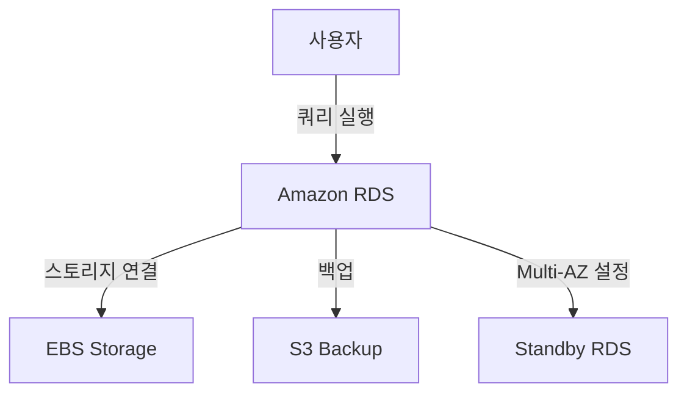

# AWS RDS (Relational Database Service)

## ✨ AWS RDS란?
AWS RDS(Relational Database Service)는 **AWS에서 제공하는 관리형 관계형 데이터베이스 서비스**입니다.  
서버를 직접 관리하지 않고도 **MySQL, PostgreSQL, MariaDB, SQL Server, Oracle, Amazon Aurora** 등의  
데이터베이스를 손쉽게 운영할 수 있도록 지원합니다.

---

## 📌 AWS RDS의 주요 특징
### 1️⃣ **완전관리형 데이터베이스**
- 서버 유지보수, 백업, 패치, 모니터링 등의 관리 작업을 자동으로 수행
- 관리 부담을 줄여 개발에 집중할 수 있음

### 2️⃣ **고가용성 및 자동 백업 지원**
- Multi-AZ 배포를 통해 장애 발생 시 자동으로 **백업 인스턴스**로 전환
- **자동 백업 및 스냅샷**을 통해 데이터 보호 가능

### 3️⃣ **다양한 엔진 지원**
- **MySQL, PostgreSQL, MariaDB, Oracle, SQL Server, Amazon Aurora** 지원
- 기존 애플리케이션과 호환성 유지 가능

### 4️⃣ **자동 확장 가능 (Aurora 등)**
- Amazon Aurora는 자동으로 스토리지를 확장하여 성능 최적화
- 필요에 따라 RDS 인스턴스를 수직/수평 확장 가능

### 5️⃣ **보안 및 네트워크 제어**
- **VPC 내에서 실행 가능**하여 네트워크 보안 강화
- **IAM 및 KMS 기반 암호화**를 통해 데이터 보호

---

## 🚀 AWS RDS 작동 방식
### 👉🏻 **기본 개념**
1. **DB 인스턴스**: RDS에서 실행되는 개별 데이터베이스 서버
2. **스토리지**: RDS 인스턴스에 연결된 영구적인 저장 공간
3. **백업 및 스냅샷**: 자동/수동 백업을 통한 데이터 보호
4. **Multi-AZ 배포**: 고가용성을 위한 이중화 구성

```python
import boto3

# AWS RDS 클라이언트 생성
rds = boto3.client('rds', region_name='ap-northeast-2')

# 새로운 RDS 인스턴스 생성
response = rds.create_db_instance(
    DBInstanceIdentifier='mydbinstance',  # 데이터베이스 인스턴스 ID
    DBInstanceClass='db.t3.micro',  # 인스턴스 유형 (작은 규모)
    Engine='mysql',  # 데이터베이스 엔진 (MySQL 선택)
    MasterUsername='admin',  # DB 관리자 계정
    MasterUserPassword='mypassword',  # 관리자 비밀번호
    AllocatedStorage=20,  # 스토리지 크기 (GB 단위)
    MultiAZ=True,  # 고가용성 활성화
    PubliclyAccessible=False  # 외부에서 접근 가능 여부
)

# 생성된 RDS 인스턴스 정보 출력
db_instance_id = response['DBInstance']['DBInstanceIdentifier']
print(f"새로운 RDS 인스턴스가 생성되었습니다: {db_instance_id}")
```

#### 📌 **코드 설명**
1. `boto3.client('rds')`: AWS RDS 클라이언트를 생성합니다.
2. `create_db_instance()`: 새로운 RDS 인스턴스를 생성합니다.
3. `Engine='mysql'`: MySQL 데이터베이스 엔진을 선택합니다.
4. `MultiAZ=True`: 고가용성을 위해 다중 가용 영역(Multi-AZ) 배포를 활성화합니다.
5. `PubliclyAccessible=False`: 외부 접근을 제한하여 보안을 강화합니다.

---

## 🔹 AWS RDS의 구조



### 💡 **RDS 인스턴스 구성 요소**
1. **RDS 인스턴스**: 실제 데이터베이스 서버
2. **스토리지**: 데이터를 저장하는 EBS 스토리지
3. **백업 시스템**: 자동 및 수동 백업 기능
4. **Multi-AZ 스탠바이**: 장애 발생 시 자동으로 페일오버하는 대기 인스턴스

---

## 🔥 RDS 인스턴스 시작 및 종료
RDS 인스턴스를 시작하고 중지하는 방법은 다음과 같습니다.

```python
# RDS 인스턴스 시작
rds.start_db_instance(DBInstanceIdentifier='mydbinstance')

# RDS 인스턴스 중지
rds.stop_db_instance(DBInstanceIdentifier='mydbinstance')

# RDS 인스턴스 삭제 (완전 삭제)
rds.delete_db_instance(
    DBInstanceIdentifier='mydbinstance',
    SkipFinalSnapshot=True  # 최종 백업 없이 삭제
)
```

#### 📌 **코드 설명**
1. `start_db_instance()`: 인스턴스를 실행합니다.
2. `stop_db_instance()`: 인스턴스를 일시 정지합니다.
3. `delete_db_instance()`: 인스턴스를 삭제합니다.

---

## ✅ AWS RDS 사용 사례

### 1️⃣ **웹 애플리케이션의 데이터베이스**
- MySQL, PostgreSQL 등을 사용하여 웹 서비스 데이터 저장

### 2️⃣ **분석 및 데이터 웨어하우징**
- 데이터 분석을 위한 관계형 데이터베이스 활용 가능

### 3️⃣ **SaaS 애플리케이션 백엔드**
- 여러 사용자를 지원하는 SaaS 애플리케이션의 백엔드 DB로 활용

---

## 🌟 AWS RDS 관련 FAQ
### ❓ **Q: RDS 인스턴스의 자동 백업은 어떻게 작동하나요?**
👉🏻 기본적으로 **최대 35일까지 자동 백업을 저장**할 수 있으며,  
스냅샷을 통해 특정 시점으로 복구할 수도 있습니다.

### ❓ **Q: RDS와 EC2에서 직접 DB 설치하는 것의 차이는?**
👉🏻 **EC2에 직접 설치하는 경우**: 모든 관리를 사용자가 직접 해야 함  
👉🏻 **RDS를 사용하는 경우**: 백업, 유지보수, 확장 등이 자동으로 관리됨

### ❓ **Q: RDS에서 읽기 부하를 분산할 수 있나요?**
👉🏻 **Read Replica(읽기 복제본)**를 사용하여 읽기 성능을 향상시킬 수 있습니다.

```python
# 읽기 복제본 생성
rds.create_db_instance_read_replica(
    DBInstanceIdentifier='mydbinstance-replica',
    SourceDBInstanceIdentifier='mydbinstance',
    DBInstanceClass='db.t3.micro'
)
```

---

## 🔗 참고 자료
- [AWS 공식 문서 - RDS](https://docs.aws.amazon.com/ko_kr/AmazonRDS/latest/UserGuide/Welcome.html)
- [Boto3 라이브러리 - RDS](https://boto3.amazonaws.com/v1/documentation/api/latest/reference/services/rds.html)

---

## 🎯 결론
AWS RDS는 **완전관리형 관계형 데이터베이스 서비스**로,  
**자동 백업, 보안, 확장성**을 갖춘 강력한 데이터베이스 관리 기능을 제공합니다.  
서버 관리 부담 없이 **안정적인 데이터베이스 운영이 필요한 경우** 매우 유용합니다! 🚀
