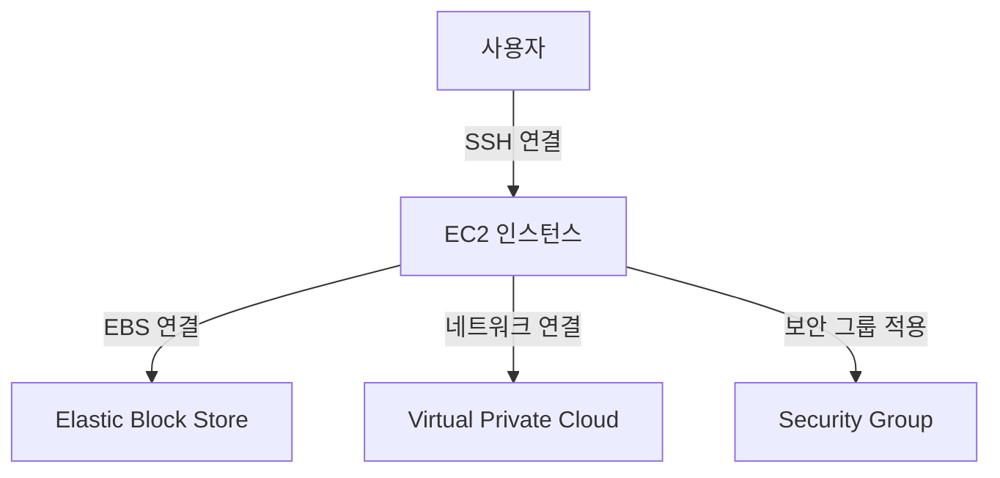

# AWS EC2 (Elastic Compute Cloud) 개요

## ✨ AWS EC2란?
AWS EC2(Elastic Compute Cloud)는 **AWS에서 제공하는 가상 서버(인스턴스) 서비스**입니다.  
필요한 만큼 컴퓨팅 파워를 조정할 수 있으며, **확장성, 유연성, 비용 절감** 등의 장점을 제공합니다.

---

## 📌 AWS EC2의 주요 특징
### 1️⃣ **온디맨드 방식의 가상 서버 제공**
- 필요할 때만 인스턴스를 생성하고 사용한 만큼만 비용을 지불 가능

### 2️⃣ **다양한 인스턴스 유형 제공**
- **컴퓨팅 최적화**, **메모리 최적화**, **스토리지 최적화** 등 다양한 인스턴스 유형 선택 가능

### 3️⃣ **자동 확장 가능 (Auto Scaling)**
- 트래픽 증가 시 인스턴스를 자동으로 추가하고 감소하면 삭제하는 기능 제공

### 4️⃣ **보안 및 네트워크 제어**
- **VPC(Virtual Private Cloud)** 내에서 실행 가능
- **Security Group**을 통해 방화벽 설정 가능

---

## 🚀 AWS EC2 작동 방식
### 👉🏻 **기본 개념**
1. **AMI(Amazon Machine Image)**: EC2 인스턴스를 생성하는 템플릿 역할
2. **Instance**: 실제 실행되는 가상 서버
3. **EBS(Elastic Block Store)**: EC2 인스턴스의 스토리지
4. **Security Group**: 방화벽 역할을 하는 보안 규칙
5. **Key Pair**: SSH 연결을 위한 키 파일

```python
import boto3

# AWS EC2 클라이언트 생성
ec2 = boto3.client('ec2', region_name='ap-northeast-2')

# 새로운 EC2 인스턴스 생성
response = ec2.run_instances(
    ImageId='ami-12345678',  # AMI ID (운영체제 이미지)
    InstanceType='t2.micro',  # 인스턴스 유형
    MinCount=1,  # 최소 생성 개수
    MaxCount=1,  # 최대 생성 개수
    KeyName='my-key-pair',  # SSH 접속을 위한 키 페어
    SecurityGroupIds=['sg-12345678'],  # 보안 그룹 ID
    SubnetId='subnet-12345678'  # 서브넷 ID
)

# 생성된 인스턴스 정보 출력
instance_id = response['Instances'][0]['InstanceId']
print(f"새로운 EC2 인스턴스가 생성되었습니다: {instance_id}")
```

#### 📌 **코드 설명**
1. `boto3.client('ec2')`: AWS EC2 클라이언트를 생성합니다.
2. `run_instances()`: EC2 인스턴스를 생성합니다.
3. `ImageId`: 사용할 AMI(운영체제 이미지)를 지정합니다.
4. `InstanceType`: 인스턴스의 사양을 선택합니다.
5. `KeyName`: SSH 연결을 위한 키 페어를 설정합니다.
6. `SecurityGroupIds`: 방화벽 역할을 하는 보안 그룹을 지정합니다.
7. `print(instance_id)`: 생성된 인스턴스 ID를 출력합니다.

---

## 🔹 AWS EC2의 구조



### 💡 **EC2 인스턴스 구성 요소**
1. **EC2 인스턴스**: 가상 서버 자체
2. **EBS**: 데이터를 저장하는 블록 스토리지
3. **VPC**: 네트워크를 관리하는 가상 네트워크
4. **Security Group**: 방화벽 역할을 하는 보안 그룹

---

## 🔥 EC2 인스턴스 시작 및 종료
EC2 인스턴스를 시작하고 종료하는 방법은 다음과 같습니다.

```python
# EC2 인스턴스 시작
ec2.start_instances(InstanceIds=['i-1234567890abcdef0'])

# EC2 인스턴스 중지
ec2.stop_instances(InstanceIds=['i-1234567890abcdef0'])

# EC2 인스턴스 종료 (완전 삭제)
ec2.terminate_instances(InstanceIds=['i-1234567890abcdef0'])
```

#### 📌 **코드 설명**
1. `start_instances()`: 인스턴스를 실행합니다.
2. `stop_instances()`: 인스턴스를 일시 정지합니다.
3. `terminate_instances()`: 인스턴스를 삭제합니다.

---

## ✅ AWS EC2 사용 사례

### 1️⃣ **웹 서버 호스팅**
- EC2 인스턴스를 생성하여 Apache, Nginx 등의 웹 서버 운영 가능

### 2️⃣ **데이터 분석 및 배치 작업**
- 고성능 인스턴스를 활용하여 대량의 데이터 분석 수행 가능

### 3️⃣ **AI 및 머신러닝 모델 훈련**
- GPU 인스턴스를 활용하여 AI 및 ML 모델 학습 가능

---

## 🌟 AWS EC2 관련 FAQ
### ❓ **Q: EC2 인스턴스의 과금 방식은?**
👉🏻 **온디맨드, 예약 인스턴스, 스팟 인스턴스** 등의 다양한 요금제가 제공됩니다.

### ❓ **Q: EC2에서 특정 IP(고정 IP)를 설정할 수 있나요?**
👉🏻 가능합니다. **Elastic IP**를 할당하여 고정 IP를 사용할 수 있습니다.

```python
# Elastic IP 할당
response = ec2.allocate_address(Domain='vpc')
allocation_id = response['AllocationId']
print(f"Elastic IP 할당 ID: {allocation_id}")
```

---

## 🔗 참고 자료
- [AWS 공식 문서 - EC2](https://docs.aws.amazon.com/ko_kr/ec2/latest/UserGuide/EC2_GetStarted.html)
- [Boto3 라이브러리 - EC2](https://boto3.amazonaws.com/v1/documentation/api/latest/reference/services/ec2.html)

---

## 🎯 결론
AWS EC2는 **가상 서버를 제공하는 클라우드 서비스**로, **유연성과 확장성**이 뛰어납니다. 다양한 워크로드에 적합하며, **웹 서버, 데이터 분석, AI 모델 훈련 등** 여러 분야에서 활용 가능합니다! 🚀
