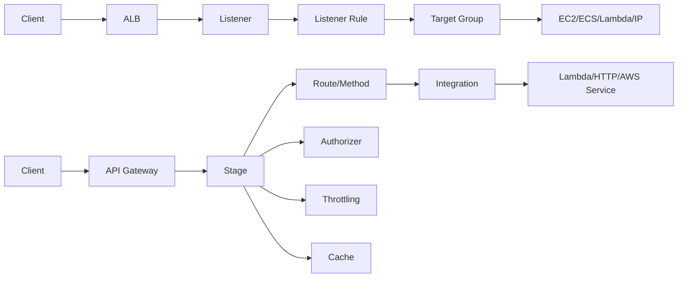
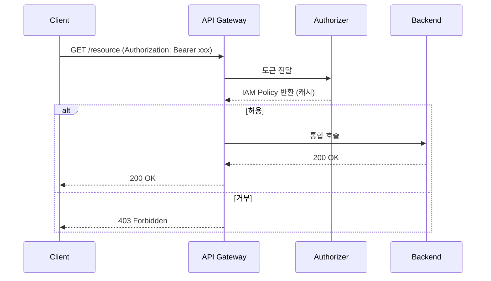
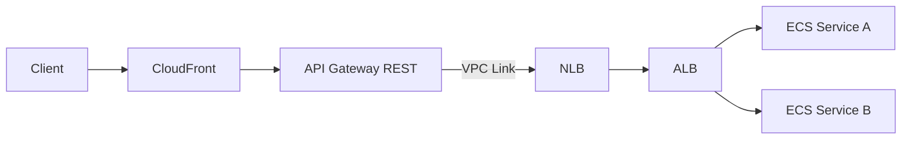
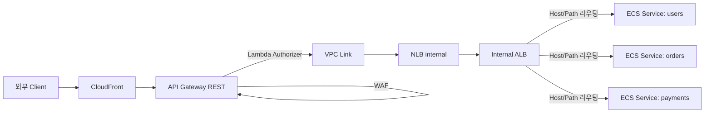
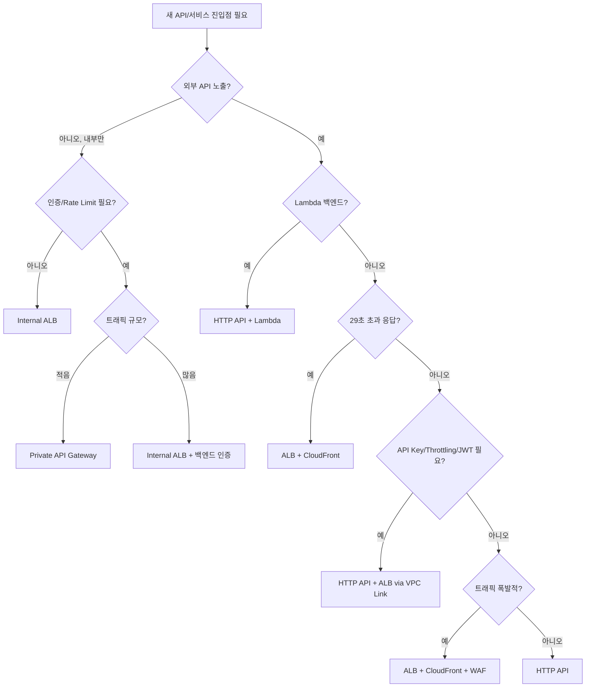

# ALB vs API Gateway 비교 심화

처음 AWS에서 HTTP 트래픽을 받는 진입점을 설계할 때 가장 많이 고민하는 두 서비스다. 둘 다 L7에서 동작하고, 둘 다 라우팅을 하고, 둘 다 TLS 종단을 한다. 그래서 이름만 보면 비슷한 일을 하는 것처럼 보이지만, 실제로 운영해 보면 라우팅 모델, 인증 처리, 타임아웃, 페이로드 한계, 비용 곡선까지 전부 다르다.

이 문서는 5년 정도 백엔드를 운영하면서 두 서비스를 동시에 쓰거나 한쪽에서 다른 쪽으로 마이그레이션하면서 겪었던 의사결정 포인트를 정리한 것이다. 단순 표 비교가 아니라 "왜 이 한계가 존재하는가", "이 한계를 만났을 때 어떻게 우회했는가"를 중심으로 풀어낸다.

---

## 두 서비스의 본질적 차이

ALB는 ELB 패밀리에 속하는 L7 로드밸런서다. 본질은 "들어온 HTTP 요청을 Target Group에 분배하는 장치"이고, 그 분배 규칙을 Listener Rule로 표현한다. 트래픽 자체에 어떤 정책을 거는 일은 거의 하지 않는다. WAF를 붙이거나 OIDC를 붙이는 정도까지가 ALB가 직접 손대는 영역이다.

API Gateway는 "API를 관리하는 서비스"다. 엔드포인트를 정의하고, 인증을 걸고, 트래픽을 제한하고, 캐싱을 하고, 요청/응답을 변환하고, Stage 단위로 배포한다. 백엔드는 Lambda, HTTP, AWS 서비스 통합 중 무엇이든 될 수 있다. 라우팅은 그 위에 얹힌 기능 중 하나일 뿐이다.

이 차이가 라우팅 모델, 인증, 비용 구조 모두에 그대로 반영된다. ALB는 "패킷이 거쳐가는 통로", API Gateway는 "API 정책 엔진"이라는 관점으로 보면 이후 비교가 잘 들어온다.



---

## 라우팅 규칙 비교

### ALB Listener Rule

ALB의 라우팅은 Listener에 붙는 Rule 단위로 동작한다. Rule은 우선순위(priority) 숫자로 정렬되고, 위에서부터 첫 매칭되는 Rule의 액션이 실행된다. 우선순위가 같은 Rule은 만들 수 없다.

조건으로 사용할 수 있는 항목은 다음 7가지다.

- host-header (예: `api.example.com`)
- path-pattern (예: `/users/*`)
- http-header (임의 헤더 키와 값 매칭)
- http-request-method (`GET`, `POST` 등)
- query-string (키-값 쌍, 와일드카드 가능)
- source-ip (CIDR 단위)
- 그리고 Rule 단위로 위 조건들을 AND로 결합 가능

조건이 AND로만 결합된다는 점이 중요하다. "이 헤더가 있거나 저 경로면" 같은 OR 조건을 한 Rule에 담을 수 없다. OR이 필요하면 같은 액션을 가진 Rule을 두 개 만들고 priority를 가까이 둔다.

액션은 `forward`, `redirect`, `fixed-response`, `authenticate-cognito`, `authenticate-oidc` 중 하나다. `forward`는 Target Group으로 보내고, 여기서 Weighted Target Group이 가능하다. 두 개 이상의 Target Group에 가중치를 줘서 카나리/블루그린 분배를 한다.

```hcl
resource "aws_lb_listener_rule" "api_v2_canary" {
  listener_arn = aws_lb_listener.https.arn
  priority     = 100

  action {
    type = "forward"
    forward {
      target_group {
        arn    = aws_lb_target_group.api_v1.arn
        weight = 90
      }
      target_group {
        arn    = aws_lb_target_group.api_v2.arn
        weight = 10
      }
      stickiness {
        enabled  = true
        duration = 600
      }
    }
  }

  condition {
    host_header {
      values = ["api.example.com"]
    }
  }

  condition {
    path_pattern {
      values = ["/v2/*", "/internal/v2/*"]
    }
  }
}
```

여기서 자주 헷갈리는 부분이 있다. 한 condition 블록 안의 values는 OR로 동작한다. 위 예시는 host가 `api.example.com`이고 path가 `/v2/*` 또는 `/internal/v2/*`인 요청이 매칭된다. 하지만 두 개의 condition 블록(host와 path)은 서로 AND다. 이 모델을 잘못 이해하면 의도와 다르게 라우팅된다.

ALB Rule은 리스너당 100개까지가 기본 한도이고, 한도 상향 신청이 가능하다. 단, Rule이 많아질수록 LCU의 "rule evaluation" 차원이 증가하니 무작정 늘리는 건 비용에 직접 영향을 준다.

### API Gateway 라우팅

API Gateway는 두 가지 종류가 있는데, 라우팅 모델이 다르다.

REST API는 리소스 트리(`/users/{id}/orders`)와 메서드(`GET`, `POST`) 조합으로 라우팅한다. Mapping Template으로 요청/응답을 자유롭게 변환할 수 있고, Stage Variable로 환경별 백엔드를 분기할 수 있다. 기능이 많은 만큼 비싸고 느리다.

HTTP API는 더 단순한 라우팅 모델을 쓴다. `GET /users/{id}` 같은 라우트 키를 직접 정의하고, JWT Authorizer와 Lambda 통합에 최적화돼 있다. Mapping Template은 없다. 대신 단가가 REST API의 약 1/3 수준이다.

Stage Variable은 같은 API 정의를 dev/staging/prod에 다른 백엔드로 연결할 때 쓴다. Lambda 통합에서 `${stageVariables.lambdaAlias}`처럼 참조하면 Stage마다 다른 별칭의 Lambda를 호출한다. 환경 분리 비용을 크게 줄여 준다.

```yaml
# OpenAPI로 정의한 HTTP API 일부
openapi: 3.0.1
paths:
  /users/{userId}:
    get:
      x-amazon-apigateway-integration:
        type: aws_proxy
        httpMethod: POST
        uri: arn:aws:apigateway:ap-northeast-2:lambda:path/2015-03-31/functions/arn:aws:lambda:ap-northeast-2:111122223333:function:users-${stageVariables.env}/invocations
        payloadFormatVersion: "2.0"
      security:
        - JwtAuth: []
components:
  securitySchemes:
    JwtAuth:
      type: oauth2
      x-amazon-apigateway-authorizer:
        type: jwt
        jwtConfiguration:
          issuer: https://cognito-idp.ap-northeast-2.amazonaws.com/ap-northeast-2_xxxx
          audience: [4lhlpoeunxxxxxxx]
        identitySource: $request.header.Authorization
```

REST API의 Mapping Template은 VTL(Velocity Template Language)로 작성한다. 이걸로 헤더를 본문에 합치거나, 백엔드 응답을 클라이언트가 기대하는 형식으로 바꾼다. 다만 VTL은 디버깅이 까다롭고, 한 번 복잡해지면 유지보수 비용이 빠르게 올라간다. 새 프로젝트라면 가능한 한 HTTP API + Lambda Proxy 통합으로 가서 변환은 Lambda 안에서 처리하는 쪽이 낫다.

### 라우팅 모델 차이가 만드는 결과

ALB는 "조건 → Target Group" 매칭 엔진이라서 백엔드 인스턴스가 어떻게 응답할지에 대한 정책이 없다. 200을 반환하든 500을 반환하든 단순히 통과시킨다.

API Gateway는 라우트마다 Method Response, Integration Response를 정의하고, 백엔드 응답 코드를 클라이언트에게 보일 코드로 매핑한다. 백엔드는 200을 반환했지만 응답 본문에 따라 클라이언트에게 4xx로 내려보낼 수도 있다. 이런 "응답 변환"이 필요하면 ALB로는 못 한다.

---

## 인증 심화

### ALB의 OIDC/Cognito 인증

ALB는 Listener Rule의 액션으로 `authenticate-oidc` 또는 `authenticate-cognito`를 걸 수 있다. 이게 걸린 Rule에 매칭된 요청은 ALB가 직접 IdP로 리다이렉트시키고, 인증 결과를 받아 세션 쿠키(`AWSELBAuthSessionCookie`)를 발급한다. 이후 요청은 쿠키만 검증하고 백엔드로 전달한다.

백엔드 입장에서는 다음 헤더가 추가로 들어온다.

- `x-amzn-oidc-data`: 사용자 클레임이 담긴 JWT
- `x-amzn-oidc-identity`: 사용자 식별자
- `x-amzn-oidc-accesstoken`: IdP가 발급한 액세스 토큰

여기서 중요한 보안 포인트가 있다. `x-amzn-oidc-data`의 JWT는 ALB가 자기 키로 서명하므로 백엔드는 이 서명을 검증해야 한다. 검증하지 않으면 헤더를 위조해서 우회 접근할 수 있다. AWS는 이 키를 리전별 공개 엔드포인트로 제공한다. JWT의 `kid` 헤더로 키 ID를 얻고, `https://public-keys.auth.elb.{region}.amazonaws.com/{kid}` 에서 공개키를 받아 검증한다.

```python
import base64
import json
import jwt
import requests

def verify_alb_oidc(token: str, region: str = "ap-northeast-2"):
    header_b64 = token.split(".")[0]
    header = json.loads(base64.urlsafe_b64decode(header_b64 + "=="))
    kid = header["kid"]

    pub_key = requests.get(
        f"https://public-keys.auth.elb.{region}.amazonaws.com/{kid}",
        timeout=2,
    ).text

    payload = jwt.decode(token, pub_key, algorithms=["ES256"])
    return payload
```

ALB OIDC는 동작이 단순한 만큼 한계도 명확하다. 브라우저 기반 세션 쿠키를 전제로 하므로 모바일 앱이나 머신-투-머신 통신에는 부적합하다. 또 IdP 응답을 받기 위해 `/oauth2/idpresponse` 콜백 경로를 ALB가 점유하므로 백엔드에서 같은 경로를 사용할 수 없다.

### API Gateway의 인증 옵션

API Gateway는 인증 메커니즘이 4종이다.

**Lambda Authorizer**는 가장 자유도가 높다. 요청을 가로채 Lambda를 호출하고, Lambda가 IAM 정책을 반환하면 그 정책에 따라 라우팅을 허용/거부한다. 토큰 형식이 표준이 아니거나, DB를 조회해야 하거나, 권한 매트릭스가 복잡할 때 쓴다. 토큰 단위로 캐시(기본 5분, TTL 조절 가능)되므로 같은 토큰이 반복적으로 들어오면 Lambda 호출이 줄어든다.

**JWT Authorizer**는 HTTP API에서만 지원한다. 토큰의 issuer와 audience를 설정하면 API Gateway가 JWKS를 받아 자동 검증한다. Cognito User Pool, Auth0, Okta처럼 OIDC 호환 IdP면 거의 코드 없이 된다. JWT 클레임은 `$context.authorizer.claims.{name}`으로 통합 단계에서 참조 가능하다.

**IAM 인증(SigV4)**은 호출자가 AWS 자격증명으로 SigV4 서명을 한 요청만 받는다. EC2/ECS/Lambda 같은 AWS 워크로드끼리 호출할 때 가장 안전하다. IAM 정책으로 메서드 단위까지 권한 제어가 된다. 모바일 앱에서 쓰려면 Cognito Identity Pool로 임시 자격증명을 얻어 서명한다.

**API Key**는 단독으로 인증 수단으로 쓰면 안 된다. 키 자체가 평문이고 회전 메커니즘이 없다. Usage Plan과 결합해서 "이 키로 들어오는 요청은 초당 100회로 제한"하는 사용 측정 도구로 쓰는 것이 본래 용도다. 인증은 별도로 걸어야 한다.



운영에서 자주 만나는 함정 하나. Lambda Authorizer 캐시는 토큰 자체를 키로 쓰므로 토큰이 그대로 재사용되는 한 권한 변경이 즉시 반영되지 않는다. 사용자 권한을 박탈했는데 5분간 그대로 통과되는 상황이 생긴다. 즉시성이 필요하면 캐시 TTL을 짧게 두거나(0이면 매 요청 호출), Lambda 안에서 별도 블랙리스트를 조회한다.

---

## Timeout 차이와 우회

### ALB의 idle timeout

ALB는 기본 60초의 idle timeout을 가지고, 1초~4000초 사이로 조정 가능하다. 여기서 idle은 "양방향으로 데이터가 흐르지 않는 시간"이다. 요청 시작부터 응답 끝까지의 절대 시간이 아니다. 따라서 백엔드가 청크 단위로 응답을 흘려보내면 시간이 갱신된다.

스트리밍 API, Server-Sent Events, 긴 다운로드를 다룬다면 ALB 쪽이 자연스럽다. SSE를 쓸 때는 idle timeout을 30분 정도로 늘리고, 백엔드에서 주기적으로 keep-alive 이벤트를 보내는 패턴을 자주 쓴다.

### API Gateway의 29초 한계

API Gateway는 통합 타임아웃이 기본이자 최대 29초다. 이건 REST API와 HTTP API 모두 동일하다. 2024년에 이 한도가 일부 통합에 한해 완화됐지만, 여전히 일반적으로는 29초로 봐야 한다. 한도를 넘는 요청은 504로 잘려 버린다.

29초 안에 끝낼 수 없는 작업은 다음 패턴 중 하나로 푼다.

비동기 작업 큐 패턴이 가장 흔하다. 클라이언트가 작업 생성 요청을 보내면 API Gateway는 즉시 작업 ID를 반환하고, 실제 처리는 SQS/Step Functions로 넘긴다. 클라이언트는 작업 ID로 폴링하거나 WebSocket으로 결과를 받는다.

리포팅 다운로드 같은 거라면 S3 Pre-signed URL 패턴이 깔끔하다. 백엔드가 보고서를 만들어 S3에 올리고, API Gateway는 Pre-signed URL만 반환한다. 다운로드는 S3가 직접 처리한다.

스트리밍이 핵심이라면 그냥 ALB나 CloudFront + ALB 조합으로 가는 것이 맞다. API Gateway에 묶어 두는 시도는 거의 항상 더 큰 비용을 만든다.

---

## 페이로드 크기 제한

ALB는 요청 헤더가 64KB, 응답 헤더가 32KB까지 허용된다. 요청 본문은 사실상 제한이 없고(메모리 한도 내에서), 응답 본문도 백엔드가 흘려보내는 만큼 흘려보낸다. 따라서 큰 파일 업로드, 이미지 응답, 대용량 JSON 응답을 직접 처리할 수 있다.

API Gateway는 페이로드가 10MB로 제한된다. 이건 요청, 응답 모두에 해당한다. 10MB가 넘는 업로드는 S3 Pre-signed URL을 써서 클라이언트가 S3로 직접 PUT하게 한다. 이 패턴이 모범인 이유는 비용에도 있다. API Gateway를 거치는 데이터는 GB당 요금이 붙지만, S3는 PUT 요청 단가만 붙고 데이터 전송 자체는 거의 무료(같은 리전 안에서)다.

또 하나, API Gateway의 응답 헤더는 8KB로 제한된다. JWT가 길어진 토큰이나 대량의 쿠키를 헤더로 보내면 종종 막힌다.

---

## WebSocket

ALB는 WebSocket을 자연스럽게 지원한다. HTTP/1.1 Upgrade 핸드셰이크를 그대로 통과시키고, 이후 양방향 트래픽도 같은 연결로 처리한다. 별도 설정이 거의 없다. 백엔드(예: ECS의 WebSocket 서버)가 알아서 처리한다.

API Gateway는 WebSocket을 위한 별도 종류(`WebSocket API`)가 있다. 이건 REST API와 완전히 다른 모델이다. 라우트 키(`$connect`, `$disconnect`, `$default`, 사용자 정의)에 Lambda를 붙이고, 서버에서 클라이언트로 메시지를 보내려면 `@connections` API를 별도로 호출해야 한다. 연결 상태를 직접 관리할 필요가 없다는 장점이 있지만, 메시지 발신 비용이 별도로 붙고 디버깅이 까다롭다.

채팅, 게임, 실시간 알림처럼 연결 수가 많지만 메시지가 드문 경우라면 API Gateway WebSocket이 유리하다. 연결을 유지하는 동안 EC2/ECS를 돌릴 필요가 없기 때문이다. 반대로 트래픽이 일정하게 많은 라이브 데이터 피드라면 ALB + ECS가 비용 면에서 낫다.

---

## 콜드스타트와 VPC Link

API Gateway가 Lambda를 호출할 때, Lambda 콜드스타트는 API Gateway의 책임이 아니다. 그러나 결과적으로 사용자가 느끼는 응답 시간에 그대로 반영된다. VPC 안의 Lambda를 쓰면 ENI 부착 시간 때문에 콜드스타트가 더 길어졌었지만, 2019년 이후 Hyperplane ENI로 개선돼서 지금은 거의 차이가 없다.

API Gateway가 VPC 내부의 ALB나 NLB를 호출하려면 **VPC Link**가 필요하다. REST API의 VPC Link는 NLB만 대상으로 한다. HTTP API의 VPC Link는 ALB도 대상으로 가능하다. 이 차이가 아키텍처 선택에 영향을 준다.

NLB는 L4 로드밸런서라 호스트 헤더 기반 라우팅이 안 된다. 따라서 REST API 뒤에 여러 서비스를 두려면 NLB → ALB로 한 단계 더 거치는 구조가 자주 만들어진다.



HTTP API의 VPC Link를 쓰면 NLB를 끼지 않고 ALB로 직접 갈 수 있다. 새로 짜는 구성이라면 가능한 한 HTTP API + ALB로 가서 한 단계를 줄이는 것이 좋다.

---

## Private API Gateway vs Internal ALB

내부 시스템 간 통신용 API를 만들 때, Private API Gateway와 Internal ALB 중 무엇을 쓸지가 자주 나오는 질문이다.

**Private API Gateway**는 인터넷 노출 없이 VPC Endpoint(Interface 타입)를 통해서만 접근 가능하다. Resource Policy로 어떤 VPCe에서 들어오는 요청만 허용할지 제어한다. 인증, Throttling, 로깅 같은 API Gateway의 모든 기능을 내부에서도 쓸 수 있다는 게 장점이다. 단, VPC Endpoint 자체가 시간당 요금이 붙고(AZ당 시간당 $0.01), 데이터 처리 비용도 따로 부과된다.

**Internal ALB**는 그냥 VPC 안에서만 보이는 ALB다. 비용 구조가 단순하고, 같은 VPC나 피어링/Transit Gateway를 통해 도달 가능한 곳이면 어디서든 쓸 수 있다. 단, API 관리 기능은 없으니 인증/제한이 필요하면 백엔드에서 직접 처리해야 한다.

내부 마이크로서비스 간 통신이라면 거의 대부분 Internal ALB가 정답이다. Private API Gateway는 외부 파트너가 PrivateLink로만 접근할 수 있는 API를 제공해야 한다거나, 부서 간 격리가 강한 조직 내부에서 정책 기반 제어가 필요한 경우에 의미가 있다.

---

## 비용 계산 — 실제 시나리오

### ALB의 LCU 4개 차원

ALB 요금은 시간당 기본료(약 $0.0225/시간, 서울 기준)에 더해 LCU 사용량으로 부과된다. LCU는 다음 4가지 차원을 1초 단위로 측정해서 그중 가장 큰 값으로 계산된다.

- 신규 연결: 초당 25개 = 1 LCU
- 활성 연결: 분당 3,000개 = 1 LCU
- 처리 바이트: HTTP는 1GB/시간 = 1 LCU
- 룰 평가: 초당 1,000회 = 1 LCU (10개 무료, 그 후 평가 횟수로 측정)

LCU 단가는 시간당 약 $0.008(서울 기준).

룰 평가 차원이 자주 간과된다. Listener Rule이 100개 있고, 한 요청이 평균 5개 Rule까지 평가된다고 하면 초당 1만 요청만 들어와도 룰 평가만으로 50 LCU가 나온다. Rule 수를 줄이고 priority를 잘 배치하는 것이 비용 최적화에 직접 영향을 준다.

### REST API vs HTTP API 단가

API Gateway는 요청 수와 데이터 전송으로 부과된다. 캐시를 쓰면 캐시 GB-시간이 추가된다.

서울 리전 기준 단가(2026년 4월 시점):

- HTTP API: 첫 3억 건까지 백만 건당 $1.00, 이후 $0.90
- REST API: 첫 3.33억 건까지 백만 건당 $3.50, 이후 단계적으로 인하
- WebSocket API: 메시지 백만 건당 $1.00 + 연결 시간(분 단위)
- 캐시: 0.5GB부터 237GB까지 사이즈별로 시간당 요금. 0.5GB가 시간당 약 $0.020

HTTP API가 REST API보다 약 70% 싸다. Mapping Template, X-Ray 통합, API Key 등이 필요 없다면 HTTP API가 거의 항상 정답이다.

### 1000만 요청 기준 월 비용 비교

가정: 평균 응답 크기 5KB, 평균 요청 크기 1KB, 활성 연결 평균 200, 신규 연결 초당 평균 4, ALB Listener Rule 30개로 평균 3개 평가, 모두 서울 리전.

총 트래픽: 1000만 × 6KB ≈ 60GB/월

ALB 비용 계산:

- 시간당 기본료: $0.0225 × 24 × 30 ≈ $16.20
- 신규 연결 차원: 초당 4 → 0.16 LCU 평균. 730시간 → 약 117 LCU-hour → $0.94
- 활성 연결 차원: 200/3000 = 0.067 LCU. 약 49 LCU-hour → $0.39
- 처리 바이트 차원: 60GB / 730시간 = 0.082GB/시간 → 0.082 LCU 평균. 약 60 LCU-hour → $0.48
- 룰 평가 차원: 평균 초당 약 4건 × 3룰 = 12회/초 → 거의 0 LCU
- 4개 차원의 max를 매 시간 적용하면 대략 $1~2 수준

ALB 합계: 약 **$17~18 / 월**

API Gateway HTTP API 비용:

- 요청: 10,000,000 × $1.00 / 1,000,000 = $10
- 데이터 전송: 60GB × $0.114/GB(서울 외부) ≈ $6.84 (인터넷 outbound 가정)

HTTP API 합계: 약 **$17 / 월**

API Gateway REST API 비용:

- 요청: 10,000,000 × $3.50 / 1,000,000 = $35
- 데이터 전송: 동일하게 약 $6.84

REST API 합계: 약 **$42 / 월**

이 시나리오에서는 ALB와 HTTP API가 비슷하지만, 요청 수가 늘어날수록 차이가 벌어진다. 1억 요청/월이면 HTTP API는 약 $100, REST API는 약 $350, ALB는 LCU가 트래픽에 비례하지만 보통 $30~50 수준에 머문다. 트래픽이 많고 요청 단위 정책(인증, 캐시 등)이 필요 없다면 ALB가 압도적으로 싸다.

반대로 트래픽이 적고 인증/캐시/Rate Limit이 필요하면 API Gateway가 운영 부담까지 합쳐 더 싸다. ALB로 같은 기능을 만들려면 백엔드에서 인증을 직접 구현해야 하는데, 그 개발/운영 비용이 클라우드 청구서에는 안 보이지만 실제로는 더 크다.

---

## 하이브리드 아키텍처 — API Gateway → VPC Link → NLB → ALB → ECS

외부 노출 API를 API Gateway로 받고, 내부에서는 ALB를 거쳐 ECS에 분배하는 구성이다. 내가 운영했던 한 시스템에서 실제로 이 구조였고, 각 컴포넌트가 왜 필요했는지 정리한다.



API Gateway는 외부 인증과 Rate Limiting을 담당한다. Lambda Authorizer로 자체 JWT를 검증하고, Usage Plan으로 파트너사별 호출 한도를 건다. WAF는 SQLi, XSS, OWASP Top 10 방어용이다.

VPC Link → NLB는 REST API를 쓰던 시기의 제약 때문이다. 새로 짠다면 HTTP API + VPC Link로 ALB에 직접 연결한다.

Internal ALB가 호스트/경로 기반으로 ECS 서비스에 분배한다. ECS 서비스마다 Target Group이 있고, ALB가 헬스체크를 한다. 카나리 배포는 ALB의 Weighted Target Group으로 처리한다.

이 구조의 함정 두 가지.

첫째, **헤더 전파**다. CloudFront → API Gateway → ALB로 가면서 클라이언트 IP가 손실된다. CloudFront는 `CloudFront-Viewer-Address`나 `X-Forwarded-For`에 원본 IP를 담아 주지만, API Gateway에서 통합 요청을 만들 때 이 헤더를 명시적으로 백엔드로 전달해야 한다. ALB는 자체적으로 `X-Forwarded-For`를 추가하므로, API Gateway가 보낸 헤더 위에 ALB가 또 추가한다. 백엔드에서 IP를 파싱할 때 이 체인을 정확히 이해해야 한다.

둘째, **타임아웃 누적**이다. API Gateway는 29초, ALB는 idle 60초(설정 가능), 백엔드는 별도 타임아웃을 가진다. 가장 짧은 쪽이 전체 타임아웃을 결정한다. 백엔드가 35초 걸리는 작업을 동기로 처리하면 API Gateway에서 504가 난다. 모든 레이어의 타임아웃을 맞추거나, 긴 작업은 비동기로 분리해야 한다.

---

## CDK로 구성한 ALB와 API Gateway

```typescript
import * as cdk from 'aws-cdk-lib';
import * as ec2 from 'aws-cdk-lib/aws-ec2';
import * as elbv2 from 'aws-cdk-lib/aws-elasticloadbalancingv2';
import * as apigwv2 from 'aws-cdk-lib/aws-apigatewayv2';
import * as integrations from 'aws-cdk-lib/aws-apigatewayv2-integrations';
import * as lambda from 'aws-cdk-lib/aws-lambda';
import { Construct } from 'constructs';

export class GatewayStack extends cdk.Stack {
  constructor(scope: Construct, id: string, props: cdk.StackProps) {
    super(scope, id, props);

    const vpc = ec2.Vpc.fromLookup(this, 'Vpc', { vpcId: 'vpc-xxxxxxxx' });

    // Internal ALB
    const alb = new elbv2.ApplicationLoadBalancer(this, 'InternalAlb', {
      vpc,
      internetFacing: false,
      idleTimeout: cdk.Duration.seconds(120),
    });

    const listener = alb.addListener('Http', {
      port: 80,
      defaultAction: elbv2.ListenerAction.fixedResponse(404, {
        contentType: 'application/json',
        messageBody: '{"error":"not found"}',
      }),
    });

    const usersTg = new elbv2.ApplicationTargetGroup(this, 'UsersTg', {
      vpc,
      port: 8080,
      protocol: elbv2.ApplicationProtocol.HTTP,
      targetType: elbv2.TargetType.IP,
      healthCheck: { path: '/healthz', interval: cdk.Duration.seconds(15) },
    });

    listener.addAction('UsersRoute', {
      priority: 10,
      conditions: [elbv2.ListenerCondition.pathPatterns(['/users/*'])],
      action: elbv2.ListenerAction.forward([usersTg]),
    });

    // HTTP API + VPC Link → ALB
    const vpcLink = new apigwv2.VpcLink(this, 'AlbVpcLink', {
      vpc,
      subnets: { subnetType: ec2.SubnetType.PRIVATE_WITH_EGRESS },
    });

    const httpApi = new apigwv2.HttpApi(this, 'PublicApi', {
      corsPreflight: {
        allowOrigins: ['https://app.example.com'],
        allowMethods: [apigwv2.CorsHttpMethod.GET, apigwv2.CorsHttpMethod.POST],
        allowHeaders: ['Authorization', 'Content-Type'],
      },
    });

    httpApi.addRoutes({
      path: '/api/users/{proxy+}',
      methods: [apigwv2.HttpMethod.ANY],
      integration: new integrations.HttpAlbIntegration('UsersAlbInt', listener, {
        vpcLink,
        parameterMapping: new apigwv2.ParameterMapping()
          .overwritePath(apigwv2.MappingValue.requestPath()),
      }),
    });
  }
}
```

ALB에 default action으로 404를 박아 두는 패턴은 운영하면서 자주 쓴다. 어떤 Rule에도 매칭되지 않은 요청을 임의 백엔드로 흘려보내지 않고 명시적으로 거부하는 것이 좋다. 의도치 않은 라우팅 사고를 막아 준다.

---

## 사용 사례별 의사결정



이 트리는 절대적이지 않다. 조직 표준, 기존 인프라, 팀 역량 같은 변수가 더 크게 작용하는 경우가 많다. 다만 각 분기의 질문 자체는 검토할 가치가 있다.

핵심은 다음 세 가지를 먼저 자문하는 것이다. 외부에 직접 노출되는가, 응답이 30초 안에 끝나는가, API 관리 기능(인증/제한/캐시)이 필요한가. 이 셋의 조합으로 거의 모든 결정이 갈린다.

---

## 마이그레이션 시 주의사항

### API Gateway → ALB

API Gateway에 의존했던 기능을 ALB로 옮긴다면 다음을 직접 구현해야 한다.

인증은 백엔드에 Authorizer 미들웨어를 추가한다. JWT 검증, IAM 검증 같은 로직을 모든 서비스가 공통으로 쓸 수 있게 사이드카나 라이브러리로 만든다.

Rate Limiting은 ALB가 제공하지 않으므로 WAF Rate-based Rule로 대체하거나(IP 단위만 가능), Redis 기반의 토큰 버킷을 직접 구현한다. WAF Rate-based는 5분 윈도우만 지원해서 정밀도가 떨어진다.

Throttling이 정밀하게 필요하면 Envoy/Istio 같은 서비스 메시를 도입하는 것이 더 빠르다. ALB만으로 풀려고 하면 결국 백엔드 코드를 어지럽힌다.

### ALB → API Gateway

반대 방향도 함정이 있다. 가장 큰 건 29초 한계다. 동기 처리하던 긴 작업이 있으면 그걸 먼저 비동기로 분리해야 한다. 그렇지 않으면 마이그레이션 첫날부터 일부 요청이 504를 맞는다.

페이로드 크기 10MB도 마찬가지. 큰 응답을 직접 내려보내던 엔드포인트는 S3 Pre-signed URL로 바꾸거나, 응답을 페이지네이션해야 한다.

또 ALB는 Sticky Session(쿠키 기반)을 지원하지만 API Gateway는 지원하지 않는다. 세션 어피니티에 의존하던 백엔드는 세션 저장소(Redis 등)로 옮겨야 한다.

마지막으로, ALB가 자동으로 추가하던 `X-Forwarded-*` 헤더 대신 API Gateway는 다른 컨텍스트 변수를 쓴다. 백엔드 로그/감사에서 클라이언트 IP를 추출하는 로직을 점검해야 한다.

---

## 정리

ALB는 통로다. HTTP를 받아서 정해진 백엔드로 분배한다. 빠르고, 트래픽이 늘어도 비용 곡선이 완만하다. 인증/제한 같은 정책이 필요하면 백엔드가 직접 짜야 한다.

API Gateway는 정책 엔진이다. 인증, 제한, 변환, 캐시, 모니터링이 한 묶음으로 따라온다. 트래픽 단위 비용이 ALB보다 비싸지만, 같은 기능을 ALB+백엔드로 만들려면 개발/운영 비용이 더 든다.

둘 중 하나를 고르는 게 아니라 둘을 조합하는 경우가 실무에서는 더 많다. 외부 API는 API Gateway, 내부 트래픽은 ALB로 나누는 것이 일반적이고, 그 사이를 VPC Link로 잇는다. 이 분리가 보안 경계와 비용을 동시에 잡아 준다.

---

## 참고 자료

- [API Gateway 공식 문서](https://docs.aws.amazon.com/apigateway/)
- [ALB 공식 문서](https://docs.aws.amazon.com/elasticloadbalancing/latest/application/introduction.html)
- [AWS API Gateway vs ALB 공식 비교](https://aws.amazon.com/ko/compare/api-gateway-vs-application-load-balancer/)
- [ALB Pricing — LCU 4개 차원 설명](https://aws.amazon.com/elasticloadbalancing/pricing/)
- [API Gateway Pricing](https://aws.amazon.com/api-gateway/pricing/)
- [ALB OIDC 인증 동작과 헤더](https://docs.aws.amazon.com/elasticloadbalancing/latest/application/listener-authenticate-users.html)
- [API Gateway VPC Link (HTTP API)](https://docs.aws.amazon.com/apigateway/latest/developerguide/http-api-vpc-links.html)
