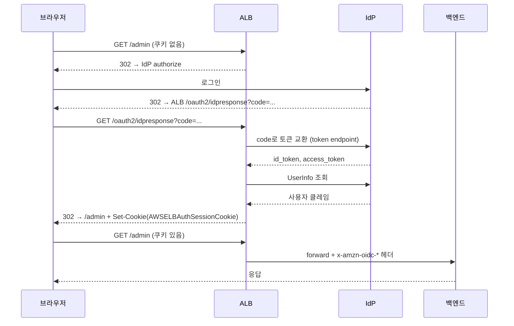

# ALB 내장 인증 (authenticate-oidc / authenticate-cognito)

ALB 리스너 규칙에는 `forward`, `redirect`, `fixed-response` 말고 인증 액션이 두 개 더 있다. `authenticate-oidc`와 `authenticate-cognito`다. 백엔드 앞단에서 ALB가 직접 OIDC 인증을 처리하고, 인증이 끝난 요청만 백엔드로 흘려보낸다. 애플리케이션 코드에 인증 로직을 안 넣어도 로그인 게이트를 세울 수 있다.

사내 어드민, 대시보드, 내부 도구처럼 "직원만 들어오면 되는" 화면 앞에 붙이기 좋다. Grafana, Kibana, 사내 배포 콘솔 앞에 ALB 인증을 깔고 Google Workspace나 Okta를 IdP로 물리는 구성이 흔하다.

문제는 이게 브라우저 세션 기반이라는 점이다. 쿠키로 세션을 들고 다니고, 302 리다이렉트로 IdP를 왕복한다. 그래서 브라우저가 아닌 클라이언트(서버 간 호출, CLI, 모바일 네이티브)가 같은 경로로 들어오면 막힌다. 이 동작을 모르고 붙였다가 API 트래픽이 통째로 죽는 사고가 자주 난다.

## 두 액션의 차이

`authenticate-cognito`는 Cognito User Pool을 IdP로 쓴다. User Pool ARN, App Client ID, User Pool Domain 세 개만 넣으면 된다. Cognito가 OIDC 디스커버리, 토큰 엔드포인트, JWKS를 다 관리해준다.

`authenticate-oidc`는 임의의 OIDC 제공자를 직접 연결한다. Issuer, Authorization Endpoint, Token Endpoint, UserInfo Endpoint, Client ID, Client Secret을 전부 손으로 적어야 한다. Google, Okta, Azure AD, Auth0, Keycloak 같은 외부 IdP를 붙일 때 쓴다.

기능적으로는 둘 다 똑같이 동작한다. 쿠키 발급, 헤더 주입, 세션 관리 방식이 동일하다. Cognito를 중간에 끼우느냐 마느냐의 차이다. Cognito를 굳이 안 쓸 거면 `authenticate-oidc`로 IdP에 바로 붙이는 게 구성 요소가 적어 디버깅이 쉽다.

## 인증 흐름

ALB가 인증되지 않은 요청을 받으면 IdP로 302를 던지고, IdP에서 로그인을 마치고 돌아오면 ALB가 콜백을 받아 토큰을 교환한 뒤 세션 쿠키를 굽는다.



콜백 경로 `/oauth2/idpresponse`는 ALB가 예약한 경로다. IdP의 App Client 설정에서 Redirect URI(Callback URL)에 `https://도메인/oauth2/idpresponse`를 반드시 등록해야 한다. 안 그러면 IdP가 `redirect_uri_mismatch`를 뱉고 로그인 루프에 빠진다. 이 경로는 ALB가 가로채므로 백엔드까지 가지 않는다.

## Terraform 설정

`authenticate-oidc`를 Google에 붙이는 예시다. 인증 액션을 먼저 평가하고, 통과하면 `forward`로 넘기는 구조다. 액션 순서가 중요하다. `authenticate-oidc`의 `order`가 `forward`보다 작아야 한다.

```hcl
resource "aws_lb_listener_rule" "admin_auth" {
  listener_arn = aws_lb_listener.https.arn
  priority     = 100

  action {
    type  = "authenticate-oidc"
    order = 1

    authenticate_oidc {
      issuer                 = "https://accounts.google.com"
      authorization_endpoint = "https://accounts.google.com/o/oauth2/v2/auth"
      token_endpoint         = "https://oauth2.googleapis.com/token"
      user_info_endpoint     = "https://openidconnect.googleapis.com/v1/userinfo"
      client_id              = var.google_client_id
      client_secret          = var.google_client_secret

      scope                          = "openid email"
      session_cookie_name            = "AWSELBAuthSessionCookie"
      session_timeout                = 3600
      on_unauthenticated_request     = "authenticate"
    }
  }

  action {
    type             = "forward"
    order            = 2
    target_group_arn = aws_lb_target_group.admin.arn
  }

  condition {
    path_pattern {
      values = ["/admin/*"]
    }
  }
}
```

`client_secret`은 Terraform state에 평문으로 박힌다. state를 S3 + KMS로 암호화하거나 Secrets Manager 참조로 빼야 한다. 그리고 `client_secret`은 `terraform plan`에서 항상 변경된 것처럼 잡힌다(ALB API가 secret을 다시 안 돌려줘서 비교 불가). `ignore_changes`로 막든가 매번 무시하든가 해야 한다.

`authenticate-cognito`는 더 짧다.

```hcl
action {
  type  = "authenticate-cognito"
  order = 1

  authenticate_cognito {
    user_pool_arn       = aws_cognito_user_pool.this.arn
    user_pool_client_id = aws_cognito_user_pool_client.this.id
    user_pool_domain    = aws_cognito_user_pool_domain.this.domain
    session_timeout     = 3600
  }
}
```

CLI로 같은 걸 하면 이렇게 된다.

```bash
aws elbv2 modify-listener \
  --listener-arn "$LISTENER_ARN" \
  --default-actions '[
    {
      "Type": "authenticate-oidc",
      "Order": 1,
      "AuthenticateOidcConfig": {
        "Issuer": "https://accounts.google.com",
        "AuthorizationEndpoint": "https://accounts.google.com/o/oauth2/v2/auth",
        "TokenEndpoint": "https://oauth2.googleapis.com/token",
        "UserInfoEndpoint": "https://openidconnect.googleapis.com/v1/userinfo",
        "ClientId": "...",
        "ClientSecret": "...",
        "Scope": "openid email",
        "SessionTimeout": 3600,
        "OnUnauthenticatedRequest": "authenticate"
      }
    },
    {"Type": "forward", "Order": 2, "TargetGroupArn": "'"$TG_ARN"'"}
  ]'
```

## 세션 쿠키와 4KB 분할 문제

인증이 끝나면 ALB가 `AWSELBAuthSessionCookie`라는 쿠키를 굽는다. 이 안에 암호화된 토큰 정보가 들어간다. 그런데 id_token이 크면 쿠키 하나에 안 들어간다. HTTP 헤더 하나의 크기 제한(브라우저/서버 기준 보통 4KB~8KB) 때문에 ALB는 쿠키를 쪼갠다.

쪼개진 쿠키는 `AWSELBAuthSessionCookie-0`, `AWSELBAuthSessionCookie-1`처럼 인덱스가 붙는다. 클레임이 많은 IdP(Azure AD가 그룹 클레임을 잔뜩 실어 보내는 경우)에서는 쿠키가 2~3개로 쪼개진다.

여기서 실무 사고가 두 가지 난다.

첫째, 백엔드나 중간 프록시(nginx, CloudFront)의 헤더 크기 제한에 걸린다. 쿠키가 3개로 쪼개지면 Cookie 헤더 전체가 12KB를 넘기도 한다. nginx 기본 `large_client_header_buffers`는 `4 8k`라 넘치면 `400 Bad Request`가 뜬다. 갑자기 일부 사용자만 400을 맞는데 그 사용자들이 죄다 그룹이 많은 계정이면 이거다.

```nginx
# nginx를 ALB 뒤에 또 두는 경우 (드물지만 있다)
large_client_header_buffers 8 16k;
```

둘째, ALB 앞에 CloudFront를 두면 CloudFront가 쿠키를 origin으로 안 넘기게 설정돼 있을 때 세션이 통째로 깨진다. CloudFront 캐시 정책에서 `AWSELBAuthSessionCookie*`를 origin으로 forward하도록 명시해야 한다. 와일드카드로 잡아야 `-0`, `-1`까지 다 넘어간다.

세션 쿠키를 줄이려면 `scope`를 최소화하는 게 답이다. `openid email`만 받고 그룹/프로필을 안 받으면 토큰이 작아진다. 정말 그룹 정보가 필요하면 토큰에 다 싣지 말고 백엔드에서 UserInfo를 별도 조회하는 방향으로 빼는 게 낫다.

## OnUnauthenticatedRequest 분기

인증 안 된 요청을 어떻게 처리할지를 `OnUnauthenticatedRequest`가 정한다. 값이 세 개다.

- `authenticate` (기본값): IdP로 302 리다이렉트해서 로그인시킨다. 브라우저 화면 앞에 쓴다.
- `deny`: 401을 즉시 반환한다. 로그인 시도조차 안 시킨다.
- `allow`: 인증 없이 그냥 백엔드로 통과시킨다. 단, 쿠키가 있으면 검증해서 헤더는 채워준다.

`allow`가 헷갈리는데, 이건 "인증을 옵션으로" 만들 때 쓴다. 로그인한 사용자에게는 `x-amzn-oidc-*` 헤더를 주고, 안 한 사용자는 그냥 통과시킨다. 백엔드가 헤더 유무로 분기하는 구조에 맞는다. 공개 페이지인데 로그인하면 개인화되는 사이트 같은 거다.

브라우저용과 API용 경로를 같은 ALB에서 나눌 때 이걸 쓴다. 사람이 보는 `/admin/*`은 `authenticate`, 머신이 때리는 `/api/*`은 `deny`(또는 인증 액션을 아예 안 걸기)로 규칙을 분리한다.

## 비브라우저 클라이언트가 302에 막히는 문제

`authenticate` 모드는 인증 안 된 요청에 무조건 302를 던진다. 브라우저는 302를 따라가 로그인 폼을 보여주지만, `curl`, axios, 서버 SDK, 모바일 네이티브 HTTP 클라이언트는 302를 받으면 그냥 IdP 로그인 페이지의 HTML을 받거나 리다이렉트를 못 따라가 깨진다.

```bash
# 인증 걸린 경로를 API로 때리면
curl -i https://admin.example.com/api/users
# HTTP/2 302
# location: https://accounts.google.com/o/oauth2/v2/auth?...
# → JSON 기대했는데 IdP 로그인 페이지로 튕긴다
```

해결은 경로를 분리하는 거다. 같은 ALB라도 리스너 규칙을 나눠서 머신 트래픽 경로에는 인증 액션을 안 걸거나, 걸더라도 IdP 토큰을 직접 검증하는 별도 인증을 백엔드에 두고 ALB 인증은 빼야 한다. ALB 내장 인증은 본질이 브라우저 세션이라 서버 간 통신에 끼우는 물건이 아니다.

굳이 같은 IdP를 머신에도 쓰고 싶으면 클라이언트가 client_credentials 그랜트로 받은 토큰을 `Authorization: Bearer`에 실어 보내고, 그 경로는 ALB 인증 없이 백엔드에서 직접 JWT를 검증하게 한다. ALB 인증과 백엔드 JWT 검증을 경로별로 갈라야 한다.

## 백엔드로 넘어오는 헤더와 서명 검증

인증을 통과한 요청을 백엔드로 forward할 때 ALB가 헤더 세 개를 추가한다.

- `x-amzn-oidc-accesstoken`: IdP가 발급한 access token 원본
- `x-amzn-oidc-identity`: 사용자 식별자(subject)
- `x-amzn-oidc-data`: 사용자 클레임을 담은 JWT. **이걸 검증해야 한다.**

`x-amzn-oidc-data`는 ALB가 자기 키로 서명한 JWT다. 그냥 디코드해서 쓰면 안 된다. 누군가 백엔드에 직접 도달할 수 있으면(같은 VPC 안, 보안그룹 구멍) 이 헤더를 위조해서 보낼 수 있다. ALB의 공개키로 서명을 검증해야 진짜 ALB가 붙인 헤더라고 신뢰할 수 있다.

검증 절차가 좀 까다롭다. JWT 헤더의 `kid`(키 ID)와 `signer`(ALB ARN)를 읽어서, 리전별 공개키 엔드포인트에서 PEM을 받아 ES256으로 검증한다.

```
https://public-keys.auth.elb.{region}.amazonaws.com/{kid}
```

Node.js 검증 예시다.

```javascript
const jwt = require('jsonwebtoken');

async function verifyAlbToken(token, region) {
  // 1. 서명 없이 헤더만 먼저 디코드해서 kid를 꺼낸다
  const decoded = jwt.decode(token, { complete: true });
  if (!decoded) throw new Error('malformed token');

  const { kid, signer, alg } = decoded.header;
  if (alg !== 'ES256') throw new Error('unexpected alg');

  // 2. signer가 우리 ALB ARN인지 확인 (다른 ALB의 토큰 차단)
  if (signer !== process.env.EXPECTED_ALB_ARN) {
    throw new Error('unexpected signer');
  }

  // 3. 리전별 엔드포인트에서 공개키 PEM을 받는다
  const url = `https://public-keys.auth.elb.${region}.amazonaws.com/${kid}`;
  const res = await fetch(url);
  const pubKey = await res.text();

  // 4. ES256으로 서명 검증
  const claims = jwt.verify(token, pubKey, { algorithms: ['ES256'] });
  return claims; // email, sub, exp 등
}
```

여기서 자주 틀리는 게 두 가지다. 하나, `alg`를 검증 안 하면 `none` 알고리즘 우회 공격에 노출된다. 받은 토큰의 `alg`가 `ES256`인지 코드에서 강제해야 한다. 둘, `signer`를 확인 안 하면 같은 리전의 다른 누군가의 ALB가 서명한 토큰도 통과한다. 공개키 엔드포인트는 리전 단위로 공유되므로 `kid`만으로는 우리 ALB가 보낸 게 맞는지 보장이 안 된다. ARN을 반드시 대조해야 한다.

공개키는 자주 안 바뀌지만 캐싱할 때 `kid`를 키로 캐싱해야 한다. ALB가 키를 로테이션하면 새 `kid`가 오므로 `kid`별로 받아두면 자동으로 갱신된다.

## SessionTimeout과 토큰 갱신

`SessionTimeout`은 ALB 세션 쿠키의 수명이다. 기본 7일, 최대 7일이다. 이 시간이 지나면 쿠키가 만료돼 다시 로그인 흐름을 탄다.

헷갈리는 게, 이건 IdP의 access token 수명과 별개다. ALB는 자체 세션을 SessionTimeout만큼 유지하고, 그 안에서 IdP refresh token으로 access token을 갱신한다. 단, IdP가 refresh token을 줬을 때만 그렇다. `scope`에 `offline_access`를 안 넣으면 refresh token이 안 와서 access token이 만료되는 순간 ALB가 더 못 갱신하고, 백엔드로 넘어가는 `x-amzn-oidc-accesstoken`이 만료된 토큰이 된다.

백엔드가 그 access token으로 다른 API(Google API 등)를 호출한다면 이게 문제가 된다. `scope`에 `offline_access`를 넣어 refresh token을 받게 해야 ALB가 갱신을 이어간다.

```hcl
scope = "openid email offline_access"
```

SessionTimeout을 짧게 잡으면(예: 1시간) 보안은 올라가지만 한 시간마다 로그인 리다이렉트가 돈다. 이미 IdP 세션이 살아 있으면 사용자 눈에는 화면이 깜빡이고 마는 정도지만, IdP 세션도 끊겨 있으면 다시 로그인 폼을 본다.

## SessionCookieName 함정

`SessionCookieName`을 기본값 `AWSELBAuthSessionCookie`에서 바꿀 수 있다. 같은 도메인에 여러 ALB나 여러 인증 규칙이 쿠키를 굽는 경우 이름이 충돌하면 세션이 섞인다. 그럴 때 규칙별로 다른 이름을 줘서 격리한다.

단, 이름을 바꾸면 위에서 말한 4KB 분할 쿠키도 그 이름 기준으로 `{이름}-0`, `{이름}-1`이 된다. CloudFront forward 설정이나 백엔드 헤더 필터를 기본 이름으로 하드코딩해놨으면 이름 바꾼 순간 세션이 안 넘어간다. 이름을 바꿀 거면 와일드카드로 잡힌 곳을 다 같이 바꿔야 한다.

도메인 단위 쿠키라 서브도메인 간 공유도 주의해야 한다. `Domain` 속성을 ALB가 어떻게 잡느냐에 따라 `a.example.com`에서 구운 쿠키가 `b.example.com`에 안 갈 수 있다. 멀티 서브도메인 SSO를 ALB 인증으로 흉내 내려다 안 되는 경우가 여기서 나온다.

## 로그아웃이 안 끊기는 문제

ALB 인증에는 표준 로그아웃 엔드포인트가 없다. 로그아웃을 구현하려면 `AWSELBAuthSessionCookie` 쿠키를 만료시키는 응답을 백엔드가 직접 내려줘야 한다.

```javascript
// 백엔드 로그아웃 핸들러
app.get('/logout', (req, res) => {
  // ALB 세션 쿠키 만료 (-0, -1 분할까지 다 지운다)
  res.cookie('AWSELBAuthSessionCookie-0', '', { expires: new Date(0), path: '/' });
  res.cookie('AWSELBAuthSessionCookie-1', '', { expires: new Date(0), path: '/' });
  res.redirect('/');
});
```

문제는 이게 ALB 세션만 지운다는 점이다. IdP쪽 세션(Google, Okta에 로그인된 상태)은 멀쩡하게 살아 있다. 그래서 로그아웃 누르고 다시 접속하면 ALB가 IdP로 302를 던지고, IdP는 이미 로그인된 상태라 로그인 폼 없이 바로 통과시켜버린다. 사용자 눈에는 "로그아웃했는데 다시 들어가진다"로 보인다.

진짜 로그아웃을 하려면 IdP의 로그아웃 엔드포인트까지 호출해야 한다. ALB 쿠키를 지운 다음 IdP의 end-session/logout URL로 리다이렉트한다.

```javascript
app.get('/logout', (req, res) => {
  res.cookie('AWSELBAuthSessionCookie-0', '', { expires: new Date(0), path: '/' });
  res.cookie('AWSELBAuthSessionCookie-1', '', { expires: new Date(0), path: '/' });
  // IdP 세션까지 끊는다 (Cognito 예시)
  const logoutUrl =
    `https://${domain}/logout?client_id=${clientId}` +
    `&logout_uri=${encodeURIComponent('https://admin.example.com/')}`;
  res.redirect(logoutUrl);
});
```

Cognito는 `/logout` 엔드포인트가 있고, Okta는 `/oauth2/v1/logout`, Azure AD는 `end_session_endpoint`가 있다. IdP마다 파라미터 이름이 다르니 디스커버리 문서(`/.well-known/openid-configuration`)의 `end_session_endpoint`를 보고 맞춰야 한다. 공유 PC에서 로그아웃이 안 끊기면 다음 사람이 그대로 들어가는 사고가 나므로 사내 도구에서 특히 챙겨야 한다.

## 정리

ALB 내장 인증은 코드 없이 로그인 게이트를 세우는 데는 빠르고 편하다. 사내 어드민, 대시보드처럼 브라우저로만 접근하는 화면 앞에 깔면 손이 거의 안 간다. 대신 세 가지를 기억해야 한다. 쿠키가 4KB 넘으면 쪼개진다는 것, 비브라우저 클라이언트는 302에 막힌다는 것, 로그아웃은 IdP 세션까지 직접 끊어야 한다는 것이다. 백엔드에서 `x-amzn-oidc-data`를 받으면 반드시 서명·`signer`·`alg`를 검증하고 써야 한다.
