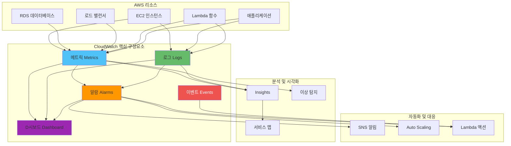
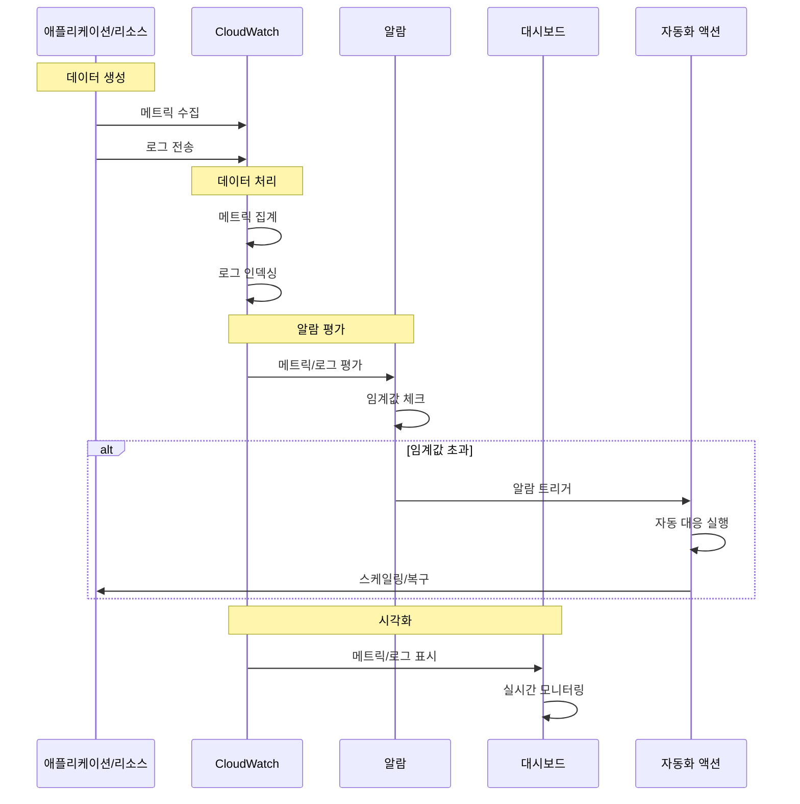
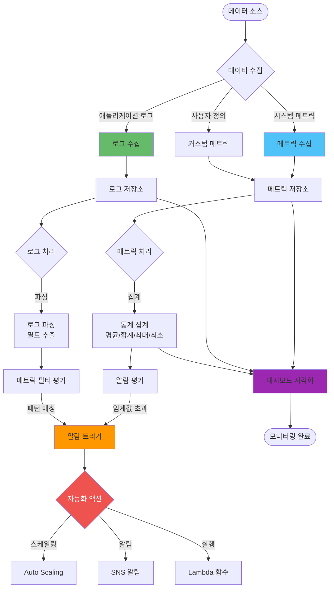
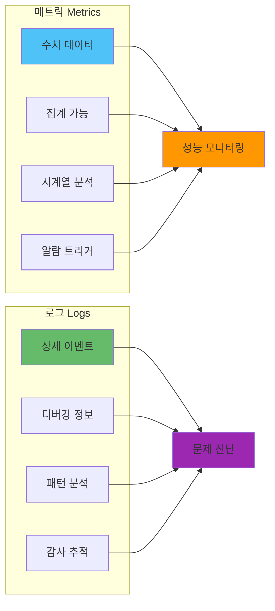
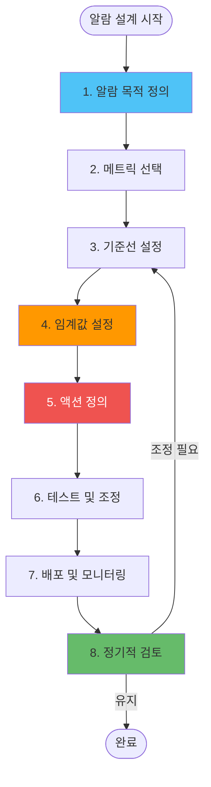
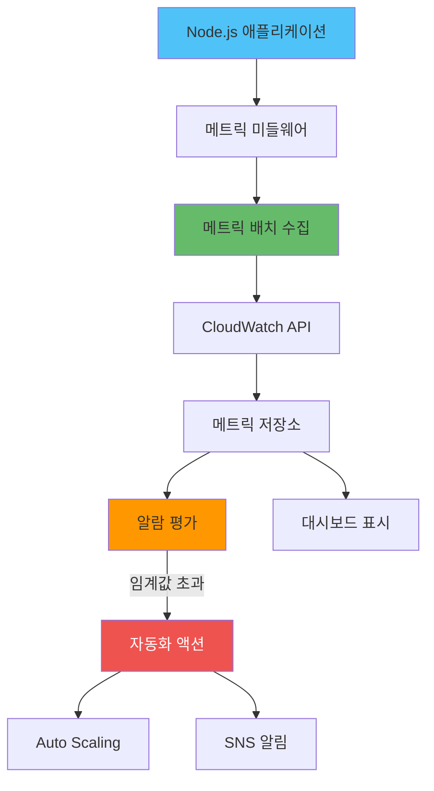
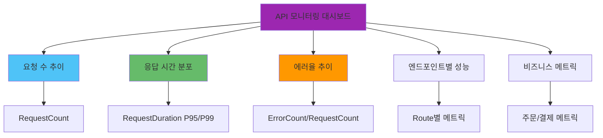
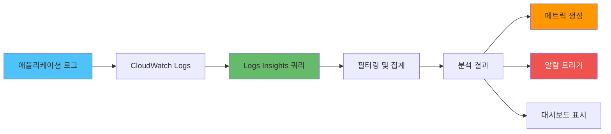
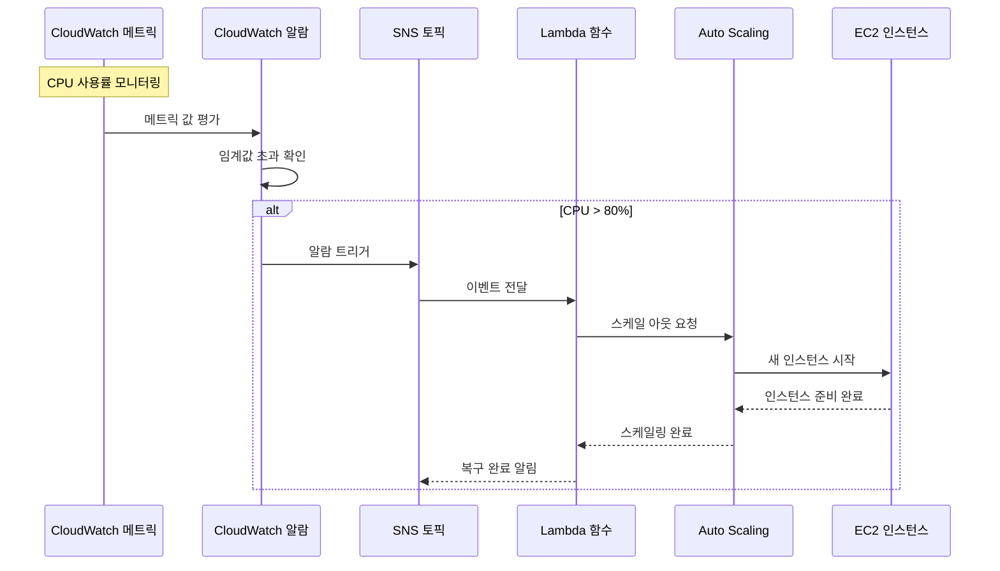
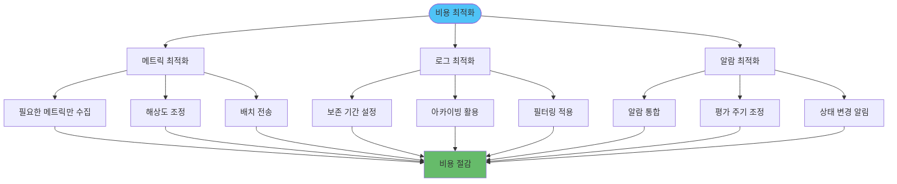

# AWS CloudWatch 완전 가이드

## CloudWatch란 무엇인가?

AWS CloudWatch는 AWS 클라우드 환경에서 실행되는 리소스와 애플리케이션을 실시간으로 모니터링하고 관찰할 수 있는 종합적인 모니터링 서비스입니다. 단순히 데이터를 수집하는 것을 넘어서, 수집된 데이터를 분석하고 시각화하며, 특정 조건에 따라 자동화된 대응을 수행할 수 있는 지능적인 모니터링 플랫폼입니다.

CloudWatch의 핵심 가치는 **가시성(Visibility)**과 **자동화(Automation)**에 있습니다. 복잡한 클라우드 인프라에서 발생하는 모든 활동을 투명하게 관찰하고, 문제가 발생하기 전에 미리 감지하여 자동으로 대응할 수 있게 해줍니다.

## CloudWatch 아키텍처 개요

CloudWatch는 AWS 인프라와 애플리케이션의 모니터링을 위한 통합 아키텍처를 제공합니다. 다음 다이어그램은 CloudWatch의 핵심 구성 요소와 그들 간의 관계를 보여줍니다.



### CloudWatch 데이터 흐름

CloudWatch는 데이터 수집부터 자동 대응까지의 전체 흐름을 관리합니다. 다음 다이어그램은 데이터가 어떻게 수집되고 처리되는지를 보여줍니다.



### CloudWatch 구성 요소 간 상호작용

메트릭, 로그, 알람은 서로 밀접하게 연관되어 작동합니다. 각 구성 요소의 역할과 상호작용을 이해하는 것이 효과적인 모니터링 전략 수립의 핵심입니다.

**메트릭 → 알람 흐름:**
- 메트릭이 수집되면 알람이 주기적으로 평가합니다
- 임계값을 초과하면 알람 상태가 변경되고 액션이 트리거됩니다
- 여러 메트릭을 조합하여 복합 알람을 생성할 수 있습니다

**로그 → 알람 흐름:**
- 로그 패턴을 기반으로 메트릭 필터를 생성합니다
- 메트릭 필터가 특정 패턴을 감지하면 알람이 트리거됩니다
- 예: 에러 로그가 1분에 10개 이상 발생하면 알람 발생

**대시보드 통합:**
- 메트릭, 로그, 알람 상태를 하나의 대시보드에 통합하여 표시합니다
- 실시간 모니터링과 히스토리 분석을 동시에 제공합니다

## CloudWatch의 핵심 구성 요소

### 1. 메트릭(Metrics) - 시스템의 건강 상태 측정

메트릭은 CloudWatch의 가장 기본적인 구성 요소로, 시간에 따른 데이터 포인트의 집합입니다. 이는 시스템의 건강 상태를 수치로 표현한 것으로, 마치 의사가 환자의 체온이나 혈압을 측정하는 것과 같습니다.

**기본 메트릭의 특징:**
- **네임스페이스(Namespace)**: 메트릭이 속한 카테고리 (예: AWS/EC2, AWS/RDS)
- **메트릭 이름**: 측정하고자 하는 지표 (예: CPUUtilization, NetworkIn)
- **차원(Dimensions)**: 메트릭을 구분하는 키-값 쌍 (예: InstanceId, DatabaseName)
- **타임스탬프**: 데이터가 수집된 시간
- **값**: 실제 측정된 수치

**사용자 정의 메트릭의 중요성:**
AWS에서 제공하는 기본 메트릭 외에도, 애플리케이션의 비즈니스 로직에 특화된 사용자 정의 메트릭을 생성할 수 있습니다. 예를 들어, 웹 애플리케이션의 응답 시간, 데이터베이스 쿼리 성능, 특정 기능의 사용 빈도 등을 측정할 수 있습니다.

### 2. 로그(Logs) - 시스템의 상세한 활동 기록

CloudWatch Logs는 애플리케이션과 시스템에서 생성되는 모든 로그 데이터를 중앙에서 수집, 저장, 분석할 수 있는 서비스입니다. 로그는 문제 발생 시 원인을 추적하고, 시스템의 동작을 이해하는 데 필수적인 정보를 제공합니다.

**로그 그룹과 로그 스트림:**
- **로그 그룹(Log Group)**: 관련된 로그 스트림들을 논리적으로 그룹화한 단위
- **로그 스트림(Log Stream)**: 실제 로그 이벤트들이 순차적으로 기록되는 단위

**로그 보존 정책:**
로그 데이터는 무한정 저장되지 않으며, 비용 최적화를 위해 보존 기간을 설정할 수 있습니다. 중요한 로그는 S3나 Glacier로 아카이브하여 장기 보관할 수 있습니다.

### 3. 알람(Alarms) - 자동화된 모니터링과 대응

알람은 메트릭이나 로그 패턴을 기반으로 특정 조건이 충족될 때 자동으로 트리거되는 메커니즘입니다. 단순한 알림을 넘어서 자동화된 대응 액션을 수행할 수 있습니다.

**알람의 평가 방식:**
- **임계값 기반**: 특정 수치를 초과하거나 미달할 때
- **이상 탐지**: 기계 학습을 통한 정상 패턴에서의 벗어남 감지
- **로그 패턴**: 특정 로그 패턴이나 에러 메시지 감지

**알람 상태:**
- **OK**: 정상 상태
- **ALARM**: 임계값을 초과한 상태
- **INSUFFICIENT_DATA**: 데이터가 부족한 상태

### 4. 대시보드(Dashboard) - 시각적 모니터링

대시보드는 여러 메트릭과 로그를 하나의 화면에 시각적으로 표시하여 시스템의 전체적인 상태를 한눈에 파악할 수 있게 해줍니다. 위젯을 통해 차트, 그래프, 숫자 표시 등을 자유롭게 구성할 수 있습니다.

**대시보드의 활용:**
- **운영 대시보드**: 실시간 시스템 상태 모니터링
- **비즈니스 대시보드**: 비즈니스 지표 추적
- **보안 대시보드**: 보안 관련 이벤트 모니터링

### 5. 이벤트(Events) - 이벤트 기반 자동화

CloudWatch Events(현재 Amazon EventBridge로 통합)는 AWS 서비스에서 발생하는 이벤트를 실시간으로 감지하고, 이에 따라 자동화된 워크플로우를 실행할 수 있게 해줍니다.

**이벤트 소스:**
- AWS 서비스 이벤트 (EC2 인스턴스 시작/중지, S3 객체 생성 등)
- 사용자 정의 애플리케이션 이벤트
- 스케줄 기반 이벤트 (Cron 표현식)

## CloudWatch 데이터 수집 및 처리 흐름

CloudWatch는 다양한 소스로부터 데이터를 수집하고 처리하는 일관된 파이프라인을 제공합니다. 다음 다이어그램은 데이터가 수집되어 최종적으로 대시보드나 자동화 액션으로 전달되는 전체 과정을 보여줍니다.



### 데이터 수집 전략

**자동 수집:**
- AWS 서비스(EC2, RDS, Lambda 등)는 자동으로 메트릭을 CloudWatch에 전송합니다
- 별도의 설정 없이 기본 메트릭을 즉시 사용할 수 있습니다
- 5분 간격으로 기본 메트릭이 수집되며, 상세 모니터링을 활성화하면 1분 간격으로 수집됩니다

**애플리케이션 통합:**
- CloudWatch Agent를 설치하여 커스텀 메트릭과 로그를 수집할 수 있습니다
- AWS SDK를 통해 애플리케이션에서 직접 메트릭을 전송할 수 있습니다
- 구조화된 로그 형식(JSON)을 사용하면 더 효율적인 분석이 가능합니다

**수집 주기 최적화:**
- 비용과 성능의 균형을 고려하여 적절한 수집 주기를 설정합니다
- 중요한 메트릭은 1분 간격, 일반 메트릭은 5분 간격으로 수집합니다
- 배치 전송을 통해 API 호출 비용을 최적화합니다

## CloudWatch의 실제 운영 시나리오

### 시나리오 1: 웹 애플리케이션 모니터링

전자상거래 웹사이트를 운영하는 경우, 다음과 같은 메트릭들을 모니터링해야 합니다:

**시스템 메트릭:**
- EC2 인스턴스의 CPU, 메모리, 디스크 사용률
- 로드 밸런서의 응답 시간과 에러율
- 데이터베이스의 연결 수와 쿼리 성능

**애플리케이션 메트릭:**
- 페이지 로딩 시간
- 주문 처리 시간
- 결제 성공률
- 동시 사용자 수

**로그 분석:**
- 웹 서버 액세스 로그에서 느린 요청 패턴 분석
- 애플리케이션 로그에서 에러 패턴 추적
- 보안 로그에서 의심스러운 활동 감지

### 시나리오 2: 마이크로서비스 아키텍처 모니터링

마이크로서비스 환경에서는 각 서비스의 독립적인 모니터링과 전체 시스템의 통합 모니터링이 모두 필요합니다:

**서비스별 모니터링:**
- 각 마이크로서비스의 응답 시간과 처리량
- 서비스 간 통신 지연 시간
- 데이터베이스 연결 풀 상태

**분산 추적:**
- 요청이 여러 서비스를 거쳐 처리되는 전체 경로 추적
- 병목 지점 식별
- 의존성 서비스 장애 영향 분석

### 시나리오 3: 비용 최적화 모니터링

CloudWatch를 통해 리소스 사용 패턴을 분석하여 비용을 최적화할 수 있습니다:

**리소스 사용률 분석:**
- 사용률이 낮은 EC2 인스턴스 식별
- 스토리지 사용 패턴 분석
- 네트워크 트래픽 패턴 파악

**자동 스케일링 연동:**
- CPU 사용률에 따른 자동 인스턴스 추가/제거
- 트래픽 패턴에 따른 로드 밸런서 설정 조정

### 실전 운영 전략: 웹 애플리케이션 모니터링

웹 애플리케이션을 운영할 때는 시스템 레벨과 애플리케이션 레벨의 모니터링을 모두 고려해야 합니다. 다음은 효과적인 모니터링 전략입니다.

**1단계: 핵심 메트릭 정의**
- **가용성 메트릭**: 서비스 가동률, 헬스체크 성공률
- **성능 메트릭**: 응답 시간(P50, P95, P99), 처리량(TPS)
- **에러 메트릭**: 에러율, 에러 유형별 분류
- **리소스 메트릭**: CPU, 메모리, 네트워크 사용률

**2단계: 알람 계층 구조 설계**
- **Critical 알람**: 서비스 중단, 데이터 손실 위험 → 즉시 대응 필요
- **Warning 알람**: 성능 저하, 리소스 부족 → 모니터링 강화
- **Info 알람**: 트렌드 변화, 비정상 패턴 → 분석 필요

**3단계: 대시보드 구성**
- **실시간 운영 대시보드**: 현재 상태를 한눈에 파악
- **성능 분석 대시보드**: 트렌드 분석 및 병목 지점 식별
- **비즈니스 대시보드**: 사용자 활동, 비즈니스 지표 추적

**4단계: 자동화 대응 설정**
- 알람 발생 시 자동 스케일링 트리거
- 에러율 증가 시 자동 롤백 또는 트래픽 제한
- 리소스 부족 시 알림 및 자동 확장

### 실전 운영 전략: 마이크로서비스 모니터링

마이크로서비스 아키텍처에서는 각 서비스의 독립적인 모니터링과 전체 시스템의 통합 모니터링이 모두 중요합니다.

**서비스별 모니터링 전략:**
- 각 마이크로서비스는 독립적인 네임스페이스를 사용하여 메트릭을 분리합니다
- 서비스 간 통신 지연 시간을 측정하여 병목 지점을 식별합니다
- 의존성 서비스의 상태를 모니터링하여 장애 전파를 방지합니다

**분산 추적 통합:**
- CloudWatch와 X-Ray를 통합하여 요청의 전체 경로를 추적합니다
- 서비스 간 호출 체인을 시각화하여 의존성을 파악합니다
- 느린 요청의 정확한 위치를 식별하여 성능을 개선합니다

**장애 대응 전략:**
- Circuit Breaker 패턴을 구현하여 장애 서비스로의 요청을 차단합니다
- Fallback 메커니즘을 설정하여 서비스 장애 시 대체 동작을 수행합니다
- 장애 복구 후 자동으로 정상 상태로 복귀하는 메커니즘을 구축합니다

### 실전 운영 전략: 비용 최적화 모니터링

CloudWatch 자체의 비용도 최적화해야 합니다. 불필요한 메트릭 수집과 로그 보관은 비용을 증가시킬 수 있습니다.

**메트릭 최적화 전략:**
- 비즈니스에 중요한 메트릭만 선별하여 수집합니다
- 사용하지 않는 커스텀 메트릭은 정기적으로 정리합니다
- 메트릭 해상도를 적절히 조정합니다(1분 vs 5분)

**로그 최적화 전략:**
- 로그 보존 기간을 비즈니스 요구사항에 맞게 설정합니다
- 중요한 로그는 S3로 아카이브하고, 일반 로그는 짧은 보존 기간을 설정합니다
- 로그 필터링을 통해 불필요한 로그 수집을 방지합니다

**알람 최적화 전략:**
- 중복되는 알람을 통합하여 알람 피로도를 방지합니다
- 알람 평가 주기를 적절히 설정하여 비용을 절감합니다
- 알람 상태 변경 시에만 알림을 발송하도록 설정합니다

## CloudWatch의 고급 기능

### 1. 이상 탐지(Anomaly Detection)

기계 학습 알고리즘을 사용하여 메트릭의 정상 패턴을 학습하고, 이에서 벗어나는 이상 상황을 자동으로 감지합니다. 이는 고정된 임계값으로는 감지하기 어려운 점진적인 성능 저하나 예상치 못한 트래픽 증가를 조기에 발견할 수 있게 해줍니다.

### 2. 인사이트(Insights)

CloudWatch Insights는 로그 데이터를 쿼리하고 분석할 수 있는 강력한 도구입니다. SQL과 유사한 쿼리 언어를 사용하여 대용량 로그 데이터에서 특정 패턴을 찾거나 통계를 계산할 수 있습니다.

### 3. 합성 모니터링(Synthetic Monitoring)

실제 사용자 시나리오를 시뮬레이션하여 애플리케이션의 가용성과 성능을 지속적으로 테스트합니다. 웹사이트의 특정 페이지에 주기적으로 접속하여 응답 시간과 가용성을 측정합니다.

### 4. 서비스 맵(Service Map)

분산 애플리케이션의 서비스 간 의존성을 시각적으로 표시하여 전체 시스템 아키텍처를 이해하고 장애의 전파 경로를 파악할 수 있게 해줍니다.

## CloudWatch 운영 모범 사례

### 1. 메트릭 설계 원칙

**의미 있는 메트릭 선택:**
- 비즈니스에 중요한 지표에 집중
- 너무 많은 메트릭으로 인한 노이즈 방지
- 적절한 집계 기간 설정 (1분, 5분, 15분 등)

**메트릭 네이밍 규칙:**
- 일관된 네이밍 컨벤션 사용
- 메트릭의 목적과 의미를 명확히 표현
- 차원을 활용한 세분화

### 2. 알람 설정 전략

**적절한 임계값 설정:**
- 과거 데이터 분석을 통한 기준선 설정
- 계절성과 트렌드를 고려한 동적 임계값
- 단계별 알람 레벨 (Warning, Critical)

**알람 피로도 방지:**
- 불필요한 알람 최소화
- 알람 그룹핑을 통한 관련 알람 통합
- 알람 상태 변경 시에만 알림 발송

### 3. 로그 관리 전략

**로그 구조화:**
- JSON 형태의 구조화된 로그 사용
- 일관된 로그 포맷 적용
- 적절한 로그 레벨 사용

**로그 보존 정책:**
- 비즈니스 요구사항에 따른 보존 기간 설정
- 중요한 로그의 장기 보관 계획
- 비용과 가치의 균형 고려

### 4. 대시보드 설계

**사용자별 맞춤 대시보드:**
- 개발자, 운영자, 경영진별 다른 관점의 대시보드
- 역할별 필요한 정보에 집중
- 실시간성과 정확성의 균형

## CloudWatch와 다른 AWS 서비스와의 통합

### 1. AWS Lambda와의 통합

CloudWatch는 Lambda 함수의 실행 로그와 메트릭을 자동으로 수집합니다. 함수의 실행 시간, 에러율, 동시 실행 수 등을 모니터링할 수 있으며, 특정 조건에서 다른 Lambda 함수를 트리거할 수 있습니다.

### 2. Auto Scaling과의 통합

CloudWatch 메트릭을 기반으로 Auto Scaling 그룹의 인스턴스 수를 자동으로 조정할 수 있습니다. CPU 사용률, 네트워크 트래픽, 사용자 정의 메트릭 등을 스케일링 조건으로 사용할 수 있습니다.

### 3. SNS, SQS와의 통합

알람이 발생했을 때 SNS를 통해 이메일, SMS, 모바일 푸시 알림을 발송하거나, SQS 큐에 메시지를 전송하여 비동기 처리를 수행할 수 있습니다.

## CloudWatch의 비용 최적화

### 1. 메트릭 최적화

- 필요한 메트릭만 수집
- 적절한 메트릭 해상도 설정
- 사용하지 않는 사용자 정의 메트릭 정리

### 2. 로그 최적화

- 로그 보존 기간 최적화
- 불필요한 로그 수집 중단
- 로그 압축 및 아카이빙 활용

### 3. 알람 최적화

- 중복되는 알람 통합
- 불필요한 알람 삭제
- 알람 평가 주기 최적화

---

## CloudWatch 운영 의사결정 가이드

### 메트릭 vs 로그: 언제 무엇을 사용할가?

효과적인 모니터링을 위해서는 메트릭과 로그의 특성을 이해하고 적절히 활용해야 합니다.



**메트릭을 사용하는 경우:**
- 시스템의 전반적인 상태를 빠르게 파악하고 싶을 때
- 시간에 따른 트렌드를 분석하고 싶을 때
- 자동화된 스케일링이나 알람이 필요할 때
- 대량의 데이터를 효율적으로 처리해야 할 때

**로그를 사용하는 경우:**
- 특정 문제의 원인을 상세히 추적해야 할 때
- 사용자 행동이나 비즈니스 이벤트를 분석해야 할 때
- 보안 감사나 규정 준수를 위해 기록이 필요할 때
- 디버깅이나 문제 해결을 위해 상세 정보가 필요할 때

### 알람 설계 전략

효과적인 알람을 설계하기 위해서는 단계별 접근이 필요합니다.



**알람 설계 체크리스트:**
1. **목적 명확화**: 이 알람이 해결하려는 문제는 무엇인가?
2. **메트릭 선택**: 가장 정확하게 문제를 나타내는 메트릭은 무엇인가?
3. **기준선 설정**: 정상 상태에서의 메트릭 값은 어떻게 되는가?
4. **임계값 설정**: 어떤 값에서 알람을 트리거할 것인가?
5. **액션 정의**: 알람 발생 시 어떤 조치를 취할 것인가?
6. **테스트**: 알람이 올바르게 작동하는지 확인했는가?
7. **문서화**: 알람의 목적과 대응 방법을 문서화했는가?

### 대시보드 설계 원칙

효과적인 대시보드는 사용자의 역할과 목적에 맞게 설계되어야 합니다.

**개발자 대시보드:**
- 애플리케이션 성능 메트릭에 집중
- 에러율과 응답 시간을 실시간으로 모니터링
- 배포 후 성능 변화를 추적

**운영자 대시보드:**
- 인프라 리소스 사용률에 집중
- 시스템 가용성과 상태를 한눈에 파악
- 알람 상태와 최근 이벤트를 표시

**경영진 대시보드:**
- 비즈니스 지표에 집중
- 사용자 활동과 수익 지표를 추적
- 서비스 품질 지표를 요약

## 실전 고급 활용 예제

### 예제 1: Node.js 애플리케이션 통합 모니터링

**시나리오**: Express.js 기반 API 서버의 성능, 에러, 비즈니스 메트릭을 CloudWatch로 통합 모니터링

**아키텍처 개요:**
Node.js 애플리케이션에서 CloudWatch로 메트릭을 전송하는 구조는 다음과 같습니다:



**핵심 구현 전략:**
- 메트릭을 배치로 수집하여 API 호출 비용을 최적화합니다
- 비동기 방식으로 메트릭을 전송하여 애플리케이션 성능에 영향을 최소화합니다
- 차원(Dimensions)을 활용하여 메트릭을 세분화하여 분석합니다

**구현 예시:**

```javascript
// cloudwatch-metrics.js
const AWS = require('aws-sdk');
const cloudwatch = new AWS.CloudWatch({ region: 'ap-northeast-2' });

class CloudWatchMetrics {
  constructor(namespace = 'MyApp/API') {
    this.namespace = namespace;
    this.metrics = [];
  }

  // 메트릭 배치 수집 (비용 최적화)
  putMetric(name, value, unit = 'Count', dimensions = {}) {
    this.metrics.push({
      MetricName: name,
      Value: value,
      Unit: unit,
      Dimensions: Object.entries(dimensions).map(([Name, Value]) => ({
        Name,
        Value: String(Value)
      }))
    });

    // 20개씩 배치 전송 (CloudWatch 제한)
    if (this.metrics.length >= 20) {
      this.flush();
    }
  }

  async flush() {
    if (this.metrics.length === 0) return;

    const params = {
      Namespace: this.namespace,
      MetricData: this.metrics
    };

    try {
      await cloudwatch.putMetricData(params).promise();
      this.metrics = [];
    } catch (error) {
      console.error('CloudWatch putMetricData error:', error);
    }
  }

  // HTTP 요청 메트릭
  recordRequest(method, route, statusCode, duration) {
    this.putMetric('RequestCount', 1, 'Count', {
      Method: method,
      Route: route,
      StatusCode: statusCode
    });

    this.putMetric('RequestDuration', duration, 'Milliseconds', {
      Method: method,
      Route: route
    });

    if (statusCode >= 500) {
      this.putMetric('ErrorCount', 1, 'Count', {
        Method: method,
        Route: route,
        StatusCode: statusCode
      });
    }
  }

  // 비즈니스 메트릭
  recordBusinessMetric(metricName, value, userId = null) {
    const dimensions = {};
    if (userId) {
      dimensions.UserId = userId;
    }
    this.putMetric(metricName, value, 'Count', dimensions);
  }
}

// Express 미들웨어
const metrics = new CloudWatchMetrics();

app.use((req, res, next) => {
  const startTime = Date.now();
  
  res.on('finish', () => {
    const duration = Date.now() - startTime;
    metrics.recordRequest(
      req.method,
      req.route?.path || req.path,
      res.statusCode,
      duration
    );
  });
  
  next();
});

// 주기적 플러시 (1분마다)
setInterval(() => {
  metrics.flush();
}, 60000);
```

**대시보드 구성 전략:**
대시보드는 다음과 같은 위젯으로 구성하여 API의 전반적인 상태를 모니터링합니다:



**대시보드 JSON 설정:**

```json
{
  "widgets": [
    {
      "type": "metric",
      "properties": {
        "metrics": [
          ["MyApp/API", "RequestCount", { "stat": "Sum", "period": 60 }],
          [".", "ErrorCount", { "stat": "Sum", "period": 60 }]
        ],
        "period": 300,
        "stat": "Sum",
        "region": "ap-northeast-2",
        "title": "API 요청 및 에러"
      }
    },
    {
      "type": "metric",
      "properties": {
        "metrics": [
          ["MyApp/API", "RequestDuration", { "stat": "p95", "period": 60 }],
          [".", ".", { "stat": "p99", "period": 60 }]
        ],
        "period": 300,
        "stat": "Average",
        "region": "ap-northeast-2",
        "title": "응답 시간 (P95, P99)"
      }
    }
  ]
}
```

### 예제 2: CloudWatch Logs Insights를 활용한 실시간 분석

**시나리오**: 애플리케이션 로그에서 에러 패턴 및 성능 이슈 실시간 분석

**로그 분석 파이프라인:**
CloudWatch Logs Insights를 활용한 로그 분석 프로세스는 다음과 같습니다:



**분석 전략:**
- 구조화된 로그 형식(JSON)을 사용하여 필드별 분석이 용이하도록 합니다
- 자주 사용하는 쿼리를 저장하여 빠르게 재사용합니다
- 메트릭 필터를 활용하여 로그 패턴을 실시간으로 모니터링합니다

**주요 쿼리 패턴:**

```javascript
// CloudWatch Logs Insights 쿼리 예제

// 1. 최근 1시간 에러 로그 분석
fields @timestamp, @message, level, error
| filter level = "error"
| sort @timestamp desc
| limit 100

// 2. API 엔드포인트별 응답 시간 분석
fields @timestamp, @message, method, route, duration
| filter ispresent(duration)
| stats avg(duration) as avgDuration, 
        max(duration) as maxDuration,
        count() as requestCount
  by route
| sort avgDuration desc

// 3. 에러율 추이 분석
fields @timestamp, @message, statusCode
| filter statusCode >= 500
| stats count() as errorCount by bin(5m)
| sort @timestamp asc

// 4. 느린 쿼리 감지
fields @timestamp, @message, query, duration
| filter duration > 1000
| sort duration desc
| limit 50
```

**자동화된 인사이트:**

```javascript
// AWS SDK를 사용한 Logs Insights 쿼리 실행
const cloudwatchLogs = new AWS.CloudWatchLogs();

async function analyzeLogs(logGroupName, query) {
  const params = {
    logGroupName,
    startTime: Date.now() - 3600000, // 1시간 전
    endTime: Date.now(),
    queryString: query
  };

  const result = await cloudwatchLogs.startQuery(params).promise();
  
  // 쿼리 완료 대기
  let queryResult;
  do {
    await new Promise(resolve => setTimeout(resolve, 1000));
    queryResult = await cloudwatchLogs.getQueryResults({
      queryId: result.queryId
    }).promise();
  } while (queryResult.status === 'Running');

  return queryResult.results;
}

// 주기적 분석 및 알림
setInterval(async () => {
  const errorCount = await analyzeLogs(
    '/aws/lambda/my-function',
    'fields @message | filter level = "error" | stats count()'
  );
  
  if (errorCount[0]?.value > 10) {
    // SNS를 통한 알림
    await sns.publish({
      TopicArn: 'arn:aws:sns:...',
      Message: `에러 발생: ${errorCount[0].value}건`
    }).promise();
  }
}, 300000); // 5분마다
```

### 예제 3: CloudWatch Alarms와 Lambda를 통한 자동 복구

**시나리오**: CPU 사용률이 높을 때 자동으로 인스턴스 스케일링

**자동 복구 아키텍처:**
CloudWatch 알람과 Lambda를 통한 자동 복구 메커니즘은 다음과 같이 동작합니다:



**자동화 전략:**
- 알람이 트리거되면 SNS를 통해 Lambda 함수를 호출합니다
- Lambda 함수는 상황에 따라 적절한 복구 액션을 수행합니다
- 복구 완료 후 결과를 로깅하고 필요시 추가 알림을 발송합니다

**CloudFormation 템플릿:**

```yaml
# CloudFormation 템플릿
Resources:
  HighCPUAlarm:
    Type: AWS::CloudWatch::Alarm
    Properties:
      AlarmName: HighCPUUsage
      MetricName: CPUUtilization
      Namespace: AWS/EC2
      Statistic: Average
      Period: 300
      EvaluationPeriods: 2
      Threshold: 80
      ComparisonOperator: GreaterThanThreshold
      AlarmActions:
        - !Ref AutoScalingPolicy
      Dimensions:
        - Name: InstanceId
          Value: !Ref EC2Instance

  AutoScalingPolicy:
    Type: AWS::AutoScaling::ScalingPolicy
    Properties:
      AdjustmentType: ChangeInCapacity
      AutoScalingGroupName: !Ref AutoScalingGroup
      Cooldown: 300
      ScalingAdjustment: 1

  AutoRecoveryFunction:
    Type: AWS::Lambda::Function
    Properties:
      FunctionName: AutoRecovery
      Runtime: nodejs18.x
      Handler: index.handler
      Code:
        ZipFile: |
          const AWS = require('aws-sdk');
          const ec2 = new AWS.EC2();
          
          exports.handler = async (event) => {
            const instanceId = event.detail.instance-id;
            
            // 인스턴스 상태 확인
            const instances = await ec2.describeInstances({
              InstanceIds: [instanceId]
            }).promise();
            
            const state = instances.Reservations[0].Instances[0].State.Name;
            
            if (state === 'running') {
              // 자동 복구: 인스턴스 재시작
              await ec2.rebootInstances({
                InstanceIds: [instanceId]
              }).promise();
              
              console.log(`인스턴스 ${instanceId} 재시작 완료`);
            }
          };
```

### 예제 4: 비용 최적화를 위한 메트릭 필터링

**비용 최적화 전략:**
CloudWatch 비용을 최적화하기 위한 주요 전략은 다음과 같습니다:



**핵심 최적화 기법:**
- **샘플링**: 모든 요청이 아닌 일정 비율만 메트릭으로 수집
- **집계**: 로컬에서 메트릭을 집계한 후 CloudWatch로 전송
- **배치 전송**: 여러 메트릭을 한 번에 전송하여 API 호출 비용 절감

**구현 예시:**

```javascript
// 비용 효율적인 메트릭 수집 전략
class OptimizedCloudWatchMetrics {
  constructor() {
    this.sampleRate = 0.1; // 10% 샘플링
    this.metricCache = new Map();
    this.flushInterval = 60000; // 1분
  }

  // 샘플링을 통한 비용 절감
  shouldRecord() {
    return Math.random() < this.sampleRate;
  }

  // 집계된 메트릭 전송
  recordAggregatedMetric(name, value, dimensions) {
    const key = `${name}_${JSON.stringify(dimensions)}`;
    
    if (!this.metricCache.has(key)) {
      this.metricCache.set(key, {
        name,
        dimensions,
        values: [],
        count: 0
      });
    }

    const metric = this.metricCache.get(key);
    metric.values.push(value);
    metric.count++;

    // 1분마다 평균값으로 전송
    if (this.metricCache.size >= 20 || Date.now() - this.lastFlush > this.flushInterval) {
      this.flushAggregated();
    }
  }

  async flushAggregated() {
    const metricData = [];
    
    for (const [key, metric] of this.metricCache.entries()) {
      const avgValue = metric.values.reduce((a, b) => a + b, 0) / metric.values.length;
      
      metricData.push({
        MetricName: metric.name,
        Value: avgValue,
        Unit: 'Count',
        Dimensions: Object.entries(metric.dimensions).map(([Name, Value]) => ({
          Name,
          Value: String(Value)
        })),
        StatisticValues: {
          SampleCount: metric.count,
          Sum: metric.values.reduce((a, b) => a + b, 0),
          Minimum: Math.min(...metric.values),
          Maximum: Math.max(...metric.values)
        }
      });
    }

    if (metricData.length > 0) {
      await cloudwatch.putMetricData({
        Namespace: 'MyApp/Optimized',
        MetricData: metricData
      }).promise();
    }

    this.metricCache.clear();
    this.lastFlush = Date.now();
  }
}
```

---

## 결론

AWS CloudWatch는 단순한 모니터링 도구를 넘어서 클라우드 운영의 핵심 인프라입니다. 효과적인 CloudWatch 활용을 위해서는 비즈니스 요구사항을 명확히 이해하고, 적절한 메트릭과 알람을 설계하며, 지속적인 최적화를 수행해야 합니다.

CloudWatch를 통해 얻은 인사이트는 단순히 문제를 해결하는 데 그치지 않고, 시스템의 성능을 개선하고 비용을 최적화하며, 사용자 경험을 향상시키는 데 활용할 수 있습니다. 이는 클라우드 환경에서 안정적이고 효율적인 서비스를 운영하기 위한 필수적인 요소입니다.

---

### 관련 문서

- [AWS 모니터링 및 알람 전략](../모니터링/모니터링_및_알람_전략.md) - CloudWatch 고급 활용
- [Observability 전략](../../Framework/Node/모니터링/Observability_전략.md) - 분산 추적 및 모니터링
- [로깅 전략](../../Framework/Node/로깅/로깅_전략.md) - CloudWatch Logs 활용
- [Prometheus 메트릭 수집](../../DevOps/Monitoring/Prometheus_메트릭_수집.md) - 메트릭 수집 패턴
- [Grafana 대시보드](../../DevOps/Monitoring/Grafana.md) - 시각화 및 대시보드
- [인프라 모니터링 전략](../../DevOps/Monitoring/인프라_모니터링_전략.md) - 인프라 모니터링

---

## 참조

- AWS CloudWatch 공식 문서: https://docs.aws.amazon.com/cloudwatch/
- AWS Well-Architected Framework - 운영 우수성: https://aws.amazon.com/architecture/well-architected/
- CloudWatch 모범 사례 가이드: https://docs.aws.amazon.com/AmazonCloudWatch/latest/monitoring/cloudwatch_bestpractices.html
- AWS 모니터링 및 관찰성 가이드: https://docs.aws.amazon.com/whitepapers/latest/monitoring-and-observability/