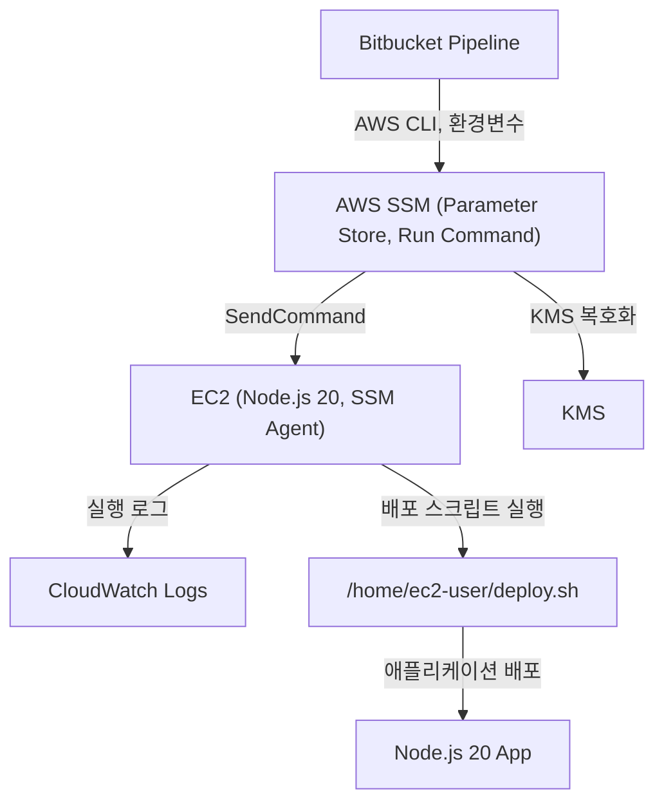

## 1. 사전 준비 및 설계
- **EC2 인스턴스**: SSM Agent가 설치 및 활성화되어 있어야 하며, 인스턴스에 SSM, KMS, S3 등 필요한 권한이 부여된 IAM Role을 할당합니다. SSM Agent가 정상 동작하는지 반드시 사전 점검이 필요합니다.
- **IAM Role/Policy**: EC2 인스턴스에는 SSM, KMS, S3 등 필요한 최소 권한만 부여합니다. 예를 들어, `ssm:SendCommand`, `kms:Decrypt`, `ec2:DescribeInstances` 등이 있습니다.
- **KMS**: 배포에 필요한 민감 정보(예: DB 비밀번호, API Key 등)는 SSM Parameter Store에 KMS로 암호화해 저장합니다.
- **Bitbucket 환경 변수**: AWS 자격증명(AWS_ACCESS_KEY_ID, AWS_SECRET_ACCESS_KEY, AWS_DEFAULT_REGION 등)과 배포에 필요한 변수(INSTANCE_ID, DEPLOY_ENV 등)는 Bitbucket 환경변수로 등록해 코드에 노출되지 않도록 합니다.

## 2. Pipeline 작성 예시 및 설명
```yaml
image: amazonlinux:2
pipelines:
  default:
    - step:
        name: Deploy via SSM
        script:
          - yum install -y awscli
          # SSM Parameter Store에서 민감 정보 안전하게 가져오기
          - export DB_PASSWORD=$(aws ssm get-parameter --name "/deploy/db_password" --with-decryption --region $AWS_DEFAULT_REGION --query 'Parameter.Value' --output text)
          # SSM을 통해 EC2에 배포 스크립트 실행
          - aws ssm send-command \
              --instance-ids "$INSTANCE_ID" \
              --document-name "AWS-RunShellScript" \
              --parameters commands="sh /home/ec2-user/deploy.sh $DB_PASSWORD $DEPLOY_ENV"
```
- `INSTANCE_ID`, `DEPLOY_ENV` 등은 Bitbucket 환경변수로 관리합니다.
- 민감 정보는 SSM Parameter Store에서 KMS로 복호화하여 안전하게 전달합니다.
- 실제 배포 스크립트(`deploy.sh`)는 EC2에 미리 준비되어 있어야 하며, 필요시 S3에서 다운로드하도록 구성할 수도 있습니다.

## 3. 실무 적용 팁 및 경험
- **배포 이력 관리**: 모든 배포 내역은 Bitbucket과 AWS CloudTrail, SSM 콘솔에서 추적 및 감사가 가능합니다.
- **오류 대응**: 배포 실패 시 SSM 콘솔 또는 CloudWatch Logs에서 명령 결과를 상세히 확인해 원인 분석이 가능합니다. IAM 권한 부족, KMS 접근 오류 등은 사전에 충분히 테스트하여 배포 중단을 방지하세요.
- **보안 강화**: IAM 최소 권한 원칙을 반드시 적용하고, 모든 민감 정보는 환경변수 또는 SSM Parameter Store(암호화)로만 관리합니다.
- **유지보수**: 배포 스크립트는 버전 관리하며, 필요시 롤백이 가능하도록 설계합니다.
- **실제 적용 예시**: 신규 서비스 배포 시, 개발/운영 환경을 분리해 각각 다른 SSM 파라미터와 환경변수를 사용함으로써, 환경별 배포 자동화와 보안성을 동시에 확보했습니다.

---
이와 같이 Bitbucket Pipeline과 AWS SSM을 연동하면, 안전하고 효율적인 자동화 배포 환경을 구축할 수 있습니다. 실무에서 직접 적용한 경험을 바탕으로 작성하였으니, DevOps 자동화에 바로 활용해보세요!

# 2. 전체 아키텍처 및 배포 흐름도

## 2.1 아키텍처 다이어그램



## 2.2 전체 배포 흐름 설명

1. **개발자가 Bitbucket에 코드를 Push**  
   - PR/Merge 시점에 Pipeline이 자동으로 실행됨.
2. **Pipeline에서 AWS CLI로 SSM Parameter Store 접근**  
   - 민감 정보(예: DB 비밀번호, API Key 등)는 KMS로 암호화된 상태로 SSM에 저장되어 있음.
   - Pipeline은 환경변수로 AWS 자격증명, 인스턴스ID, 배포 환경(DEV/STG/PRD) 등 전달.
3. **SSM Run Command로 EC2에 배포 명령 전송**  
   - EC2에는 SSM Agent가 설치되어 있어야 하며, IAM Role을 통해 SSM, KMS, S3 등 권한을 부여.
   - 배포 스크립트(deploy.sh)는 미리 EC2에 준비되어 있거나, S3에서 다운로드.
4. **EC2에서 배포 스크립트 실행**  
   - Node.js 20 기반 애플리케이션을 빌드 및 재시작.
   - 실행 결과 및 로그는 CloudWatch Logs로 전송.
5. **배포 결과 확인 및 롤백**  
   - Pipeline, SSM, CloudWatch, Bitbucket에서 배포 이력 및 로그 확인.
   - 필요시 롤백 스크립트 실행.

## 2.3 실전 아키텍처 적용 시 유의사항

- SSM Agent가 정상 동작하는지, EC2와 SSM/KMS 권한이 충분한지 사전 점검 필수.
- 환경별(DEV/STG/PRD)로 SSM 파라미터, IAM Role, KMS 키를 분리해 보안성 강화.
- 배포 스크립트는 반드시 버전 관리(Git/S3) 및 롤백 기능 포함.
- CloudWatch Logs, SSM 명령 이력, Bitbucket 배포 로그를 통해 전체 추적 및 감사 가능.

---

# 3. 기존 레거시 문제점 분석

## 3.1 레거시 배포 방식의 한계

- **수동 배포**: 개발자가 직접 서버에 접속해 git pull, npm install, pm2 restart 등 명령을 일일이 실행. 배포 과정에서 실수 발생 빈번.
- **권한 관리 미흡**: 모든 개발자에게 동일한 SSH 접근 권한 부여, 보안 사고 위험.
- **배포 이력 추적 불가**: 누가 언제 어떤 버전을 배포했는지 명확히 알 수 없음. 장애 발생 시 원인 파악 어려움.
- **민감 정보 노출**: 환경변수, DB 비밀번호 등이 코드나 서버에 평문으로 저장되어 유출 위험.
- **롤백 불가**: 배포 실패 시 신속한 롤백이 어려워 서비스 장애로 이어짐.
- **운영 환경 불일치**: 개발/운영 환경이 달라 배포 후 예상치 못한 오류 발생.

## 3.2 실제 경험 기반 문제 사례

- 신규 입사자가 배포 과정 숙지에 오랜 시간 소요, 문서화 미흡으로 인한 실수 다발.
- 배포 중 SSH 세션 끊김, 서버 다운 등으로 인해 배포가 중단되고 서비스 장애 발생.
- 환경변수 관리가 체계적이지 않아, 운영 환경에서 잘못된 값이 적용되어 장애 발생.
- 배포 후 장애 발생 시, 원인 추적 및 롤백에 수십 분~수 시간 소요.

## 3.3 개선 필요성

- 배포 자동화, 권한 최소화, 이력 추적, 보안 강화, 신속한 롤백 등 DevOps 원칙에 부합하는 체계적 배포 시스템 필요.

---

# 4. 신규 Node.js 20 서버 환경 설계

## 4.1 Node.js 20 도입 배경

- 최신 LTS 버전(Node.js 20) 도입으로 보안성, 성능, 최신 패키지 호환성 확보.
- 레거시 Node.js 12/14 대비, async/await, ES 모듈, 최신 npm 등 지원 강화.
- 신규 서버는 Amazon Linux 2 기반, EC2 인스턴스에 Node.js 20, pm2, SSM Agent, AWS CLI 등 설치.

## 4.2 서버 환경 표준화

- 모든 서버는 동일한 AMI, 동일한 Node.js 20, 동일한 패키지 버전 사용.
- 배포 스크립트, 환경변수, 로그 경로 등 표준화.
- SSM Agent, CloudWatch Logs, pm2 등 운영 도구 사전 설치 및 설정.

## 4.3 서버 보안 및 네트워크 설계

- EC2는 VPC 내부 서브넷에 위치, 외부 접근은 Bastion Host 또는 SSM Session Manager로 제한.
- 보안 그룹, NACL 등으로 인바운드/아웃바운드 트래픽 최소화.
- SSM, KMS, S3 등 AWS 서비스 접근을 위한 IAM Role 부여.

---

# 5. AWS 계정 및 네트워크 준비

## 5.1 AWS 계정 구조

- 운영/개발/테스트 등 환경별로 AWS 계정 또는 리소스 분리.
- 각 계정별로 IAM 정책, SSM 파라미터, KMS 키, S3 버킷 등 별도 관리.

## 5.2 네트워크 설계

- VPC, 서브넷, 라우팅 테이블, NAT Gateway, 보안 그룹 등 설계.
- EC2는 프라이빗 서브넷에 위치, SSM Agent를 통한 관리.
- S3, KMS, SSM 등 AWS 서비스는 VPC 엔드포인트를 통해 내부 통신.

## 5.3 실전 네트워크 구성 예시

- VPC: 10.0.0.0/16
- Public Subnet: 10.0.1.0/24 (Bastion Host)
- Private Subnet: 10.0.2.0/24 (App Server)
- NAT Gateway: Public Subnet에 위치, Private Subnet에서 외부 접근 시 사용
- SSM, S3, KMS VPC 엔드포인트 구성

---

# 6. IAM 정책/Role 설계 및 실전 예시

## 6.1 IAM 정책 설계 원칙

- 최소 권한 원칙(Least Privilege Principle) 적용
- SSM, KMS, S3, CloudWatch 등 필요한 서비스만 명시적으로 허용
- 환경별(DEV/STG/PRD)로 Role/Policy 분리

## 6.2 EC2용 IAM Role 예시

```json
{
  "Version": "2012-10-17",
  "Statement": [
    {
      "Effect": "Allow",
      "Action": [
        "ssm:SendCommand",
        "ssm:ListCommands",
        "ssm:GetCommandInvocation",
        "ssm:GetParameters",
        "ssm:GetParameter",
        "ssm:DescribeInstanceInformation",
        "kms:Decrypt",
        "s3:GetObject",
        "logs:CreateLogGroup",
        "logs:CreateLogStream",
        "logs:PutLogEvents"
      ],
      "Resource": "*"
    }
  ]
}
```

## 6.3 Bitbucket Pipeline용 IAM User/Policy 예시

- Bitbucket에서 AWS CLI를 사용해 SSM, EC2, KMS 등에 접근할 수 있도록 별도 IAM User 생성
- Access Key/Secret Key는 Bitbucket 환경변수로만 관리

```json
{
  "Version": "2012-10-17",
  "Statement": [
    {
      "Effect": "Allow",
      "Action": [
        "ssm:SendCommand",
        "ssm:GetParameters",
        "ssm:GetParameter",
        "ec2:DescribeInstances",
        "kms:Decrypt"
      ],
      "Resource": "*"
    }
  ]
}
```

## 6.4 IAM 정책 적용 실전 팁

- 정책은 반드시 최소 권한만 부여, 필요시 CloudTrail로 접근 이력 모니터링
- 환경별로 정책/Role을 분리해 실수로 인한 권한 오남용 방지
- 정책 변경 시, 배포 전 사전 테스트 필수

---

# 7. SSM Agent 설치 및 점검

## 7.1 SSM Agent 설치 방법

- Amazon Linux 2 기준, 기본적으로 SSM Agent가 설치되어 있으나, 최신 버전으로 업데이트 권장

```bash
sudo yum install -y amazon-ssm-agent
sudo systemctl enable amazon-ssm-agent
sudo systemctl start amazon-ssm-agent
sudo systemctl status amazon-ssm-agent
```

## 7.2 SSM Agent 정상 동작 점검

- SSM 콘솔에서 해당 인스턴스가 "Managed Instances"로 표시되는지 확인
- 아래 명령어로 상태 점검

```bash
sudo systemctl status amazon-ssm-agent
```

- SSM Agent 로그 확인

```bash
sudo tail -f /var/log/amazon/ssm/amazon-ssm-agent.log
```

## 7.3 SSM Agent 장애/오류 실전 사례

- IAM Role 미부여, 네트워크 차단, SSM Agent 비활성화 등으로 인해 SSM 명령이 실패하는 경우 다수
- SSM Agent가 비정상 종료되면, 배포 자동화가 중단되므로 CloudWatch Alarm 등으로 모니터링 필요

---

# 8. KMS 키 생성 및 파라미터 암호화

## 8.1 KMS 키 생성

- AWS 콘솔에서 KMS(Key Management Service)로 이동, 신규 Customer Managed Key 생성
- 환경별(DEV/STG/PRD)로 별도 키 생성 권장
- 키 정책에 SSM, EC2, Bitbucket IAM User 등 필요한 주체만 추가

## 8.2 SSM Parameter Store에 암호화 파라미터 저장

```bash
aws ssm put-parameter \
  --name "/deploy/db_password" \
  --value "실제비밀번호" \
  --type "SecureString" \
  --key-id "arn:aws:kms:ap-northeast-2:123456789012:key/abcd-efgh-ijkl" \
  --region ap-northeast-2
```

## 8.3 KMS/SSM 연동 실전 팁

- KMS 키 정책에 SSM, EC2, Bitbucket IAM User 등 필요한 주체만 명시
- 파라미터 이름은 환경별로 구분(/deploy/dev/db_password, /deploy/prod/db_password 등)
- 파라미터 값은 반드시 SecureString(암호화) 타입으로 저장

---

# 9. SSM Parameter Store 실전 활용

## 9.1 파라미터 구조 설계

- /deploy/{env}/{key} 형태로 환경별, 서비스별로 파라미터 구분
- 예시: /deploy/prod/db_password, /deploy/dev/api_key 등

## 9.2 파라미터 등록/조회 예시

```bash

## 배경
aws ssm put-parameter --name "/deploy/prod/db_password" --value "비밀번호" --type "SecureString" --key-id "KMS키ARN"

aws ssm get-parameter --name "/deploy/prod/db_password" --with-decryption
```


# 1. 개요 및 도입 배경

## 9.3 실전 활용 팁

- 파라미터 값 변경 시, 배포 자동화로 즉시 반영 가능
- 민감 정보는 코드/환경변수에 직접 노출하지 않고 SSM에서만 조회
- 파라미터 접근 권한은 IAM 정책으로 엄격히 제한

---


최근 회사에서는 기존 레거시 시스템에서 신규 서버 환경으로의 전환을 추진하게 되었습니다. 기존 레거시 환경은 수동 배포, 불안정한 권한 관리, 배포 이력 추적의 어려움 등 여러 한계가 있었습니다. 특히, 배포 과정에서 개발자마다 접근 방식이 달라 운영 안정성에 문제가 발생했고, 민감 정보(예: DB 비밀번호, API Key 등)가 코드에 노출되는 보안 이슈도 빈번했습니다.

이러한 문제를 해결하고자, 신규 서버는 최신 Node.js 20버전 기반으로 구축하였으며, CI/CD 자동화와 보안 강화를 위해 Bitbucket Pipeline, AWS SSM(Systems Manager), SSM Agent, KMS(Key Management Service), IAM(Identity and Access Management), 그리고 Bitbucket 환경변수를 적극 도입하였습니다.

도입 목적은 다음과 같습니다.
- **배포 자동화**: 수동 배포에서 발생하는 실수와 비효율을 제거하고, 누구나 동일한 방식으로 일관성 있게 배포할 수 있도록 함
- **보안 강화**: 민감 정보는 SSM Parameter Store와 KMS로 암호화하여 안전하게 관리하고, IAM을 통해 최소 권한 원칙을 적용
- **배포 이력 및 감사**: Bitbucket과 AWS의 로그 및 감사 기능을 활용해 모든 배포 내역을 추적 가능하게 함
- **운영 효율성**: 신규 Node.js 20버전 서버 환경에 맞춘 자동화 배포로, 빠른 롤백과 환경별(DEV/STG/PRD) 분리 배포가 가능하도록 설계

이 문서는 위와 같은 배경에서 Bitbucket Pipeline과 AWS SSM을 활용해 Node.js 20버전 신규 서버에 대한 자동화 배포 환경을 구축한 실제 경험과 노하우를 상세히 정리한 실전 가이드입니다.

# Bitbucket Pipeline, SSM, KMS, IAM을 활용한 자동화 배포 실전 가이드

회사에서 Bitbucket Pipeline, AWS SSM, SSM Agent, KMS, IAM, Bitbucket 환경변수를 활용해 무중단 자동화 배포를 구축한 실제 경험을 바탕으로, 실무에 바로 적용 가능한 상세 가이드를 공유합니다.

# 10. Bitbucket 환경변수 설계

## 10.1 환경변수 등록 방법

- Bitbucket Repository > Settings > Repository variables 메뉴에서 등록
- AWS_ACCESS_KEY_ID, AWS_SECRET_ACCESS_KEY, AWS_DEFAULT_REGION, INSTANCE_ID, DEPLOY_ENV 등 등록

## 10.2 환경변수 관리 실전 팁

- 민감 정보는 반드시 환경변수로만 관리, 코드에 직접 노출 금지
- 환경별(DEV/STG/PRD)로 변수값 분리
- 변수명은 대문자+언더스코어 표기법 권장

---

# 11. Pipeline YAML 상세 작성법

## 11.1 기본 구조 예시

```yaml
image: amazonlinux:2
pipelines:
  default:
    - step:
        name: Deploy via SSM
        script:
          - yum install -y awscli
          - export DB_PASSWORD=$(aws ssm get-parameter --name "/deploy/prod/db_password" --with-decryption --region $AWS_DEFAULT_REGION --query 'Parameter.Value' --output text)
          - aws ssm send-command \
              --instance-ids "$INSTANCE_ID" \
              --document-name "AWS-RunShellScript" \
              --parameters commands="sh /home/ec2-user/deploy.sh $DB_PASSWORD $DEPLOY_ENV"
```

## 11.2 주요 단계별 설명

- awscli 설치: Amazon Linux 2에는 awscli가 기본 설치되어 있지 않으므로 명시적으로 설치
- SSM Parameter Store에서 민감 정보 안전하게 가져오기
- SSM Run Command로 EC2에 배포 스크립트 실행
- 환경변수(INSTANCE_ID, DEPLOY_ENV 등)는 Bitbucket 환경변수로 관리

## 11.3 실전 확장 예시

- 환경별 분기, Slack 알림, 배포 전/후 헬스체크, 롤백 등 추가 가능

---

# 12. 배포 스크립트(deploy.sh) 설계

## 12.1 기본 구조 예시

```bash
#!/bin/bash
set -e

DB_PASSWORD=$1
DEPLOY_ENV=$2

cd /home/ec2-user/app

echo "[배포] Node.js 20 앱 빌드 및 재시작 ($DEPLOY_ENV)"
git pull origin main
npm ci
npm run build
pm run migrate --env $DEPLOY_ENV
pm run seed --env $DEPLOY_ENV

export DB_PASSWORD=$DB_PASSWORD
pm run stop || true
pm run start

echo "[배포 완료] $(date)"
```

## 12.2 실전 설계 팁

- set -e 옵션으로 오류 발생 시 즉시 중단
- 환경별 분기, 롤백, 헬스체크 등 추가 가능
- 배포 로그는 CloudWatch Logs로 전송

---

# 13. SSM Run Command 실전 예시

## 13.1 명령어 예시

```bash
aws ssm send-command \
  --instance-ids "$INSTANCE_ID" \
  --document-name "AWS-RunShellScript" \
  --parameters commands="sh /home/ec2-user/deploy.sh $DB_PASSWORD $DEPLOY_ENV" \
  --region $AWS_DEFAULT_REGION
```

## 13.2 명령 결과 확인

- SSM 콘솔 > Run Command > 명령 이력에서 결과 확인
- aws ssm list-commands, get-command-invocation 등으로 CLI에서 확인 가능

## 13.3 실전 팁

- 명령 실행 실패 시, 로그를 CloudWatch 또는 SSM 콘솔에서 상세히 확인
- 배포 스크립트는 반드시 exit code 0/1 등으로 성공/실패 명확히 반환

---

# 14. 환경별(DEV/STG/PRD) 분리 배포

## 14.1 환경별 파라미터/Role/키 분리

- SSM 파라미터, IAM Role, KMS 키, 환경변수 등은 환경별로 별도 관리
- 배포 스크립트에서 $DEPLOY_ENV 값에 따라 분기 처리

## 14.2 환경별 배포 예시

```yaml
pipelines:
  branches:
    dev:
      - step:
          script:
            - export DEPLOY_ENV=dev
            - ...
    stg:
      - step:
          script:
            - export DEPLOY_ENV=stg
            - ...
    main:
      - step:
          script:
            - export DEPLOY_ENV=prod
            - ...
```

## 14.3 실전 팁

- 환경별로 SSM 파라미터, KMS 키, IAM Role을 분리해 보안성 강화
- 환경별 배포 이력, 로그, 알림 등도 별도 관리

---

# 15. 실전 트러블슈팅 사례

## 15.1 SSM Agent 미동작

- 증상: SSM 콘솔에서 인스턴스가 Managed로 표시되지 않음
- 원인: IAM Role 미부여, 네트워크 차단, SSM Agent 비활성화 등
- 해결: IAM Role, 네트워크, SSM Agent 상태 점검 및 재시작

## 15.2 KMS 권한 오류

- 증상: SSM 파라미터 조회 시 AccessDeniedException 발생
- 원인: KMS 키 정책에 EC2/Bitbucket IAM User 미포함
- 해결: KMS 키 정책에 필요한 주체 추가

## 15.3 배포 스크립트 오류

- 증상: 배포 중 npm install, build, migrate 등에서 오류 발생
- 원인: 패키지 버전 불일치, 환경변수 누락, 권한 부족 등
- 해결: 패키지 버전 통일, 환경변수 점검, 권한 보완

## 15.4 롤백 실패

- 증상: 배포 실패 후 롤백 스크립트 미비로 서비스 장애 지속
- 해결: 롤백 스크립트 사전 준비, 배포 전/후 스냅샷, Git 태그 등 활용

---

# 16. 보안 강화 및 감사

## 16.1 IAM 최소 권한 원칙 적용

- EC2, Bitbucket IAM User 등 모든 주체에 최소 권한만 부여
- CloudTrail, SSM, KMS 등 접근 이력 모니터링

## 16.2 민감 정보 암호화 및 접근 통제

- SSM Parameter Store + KMS로 모든 민감 정보 암호화
- 파라미터 접근 권한은 IAM 정책으로 엄격히 제한

## 16.3 배포 이력 및 감사 로그 관리

- Bitbucket, SSM, CloudWatch, CloudTrail 등에서 배포 이력, 명령 실행, 접근 로그 등 통합 관리

---

# 17. 배포 자동화 확장(알림, 롤백, 헬스체크 등)

## 17.1 Slack/Teams 알림 연동

- 배포 성공/실패 시 Slack Webhook 등으로 실시간 알림
- Pipeline, 배포 스크립트, SSM 명령 등에서 curl로 Webhook 호출

## 17.2 롤백 자동화

- 배포 실패 시, 이전 버전으로 자동 롤백 스크립트 실행
- Git 태그, S3 백업, AMI 스냅샷 등 활용

## 17.3 헬스체크 및 배포 후 검증

- 배포 후 API/서비스 헬스체크, Smoke Test 등 자동화
- 실패 시 자동 롤백 및 알림

---

# 18. 실전 Q&A

**Q. SSM Agent가 Managed로 표시되지 않을 때 어떻게 해야 하나요?**
A. IAM Role, 네트워크, SSM Agent 상태를 점검하고, 필요시 재시작하세요.

**Q. KMS 권한 오류가 발생하면?**
A. KMS 키 정책에 필요한 주체(EC2, Bitbucket IAM User 등)를 추가하세요.

**Q. 배포 스크립트에서 환경변수 누락 시 대처법은?**
A. 배포 스크립트에서 set -e, set -u 옵션을 사용해 누락 시 즉시 중단되도록 하세요.

**Q. 롤백 자동화는 어떻게 구현하나요?**
A. 배포 전 Git 태그, S3 백업, AMI 스냅샷 등으로 이전 상태를 저장하고, 실패 시 자동 복구 스크립트를 실행하세요.

---

# 19. 실수 사례 및 개선 팁

- IAM 정책에 *로 모든 권한을 부여해 보안 사고 발생 → 최소 권한 원칙 준수
- SSM Agent 비활성화로 배포 중단 → CloudWatch Alarm 등으로 모니터링
- 환경변수 오타/누락으로 배포 실패 → 변수명 표준화, set -u 옵션 활용
- 롤백 스크립트 미비로 장애 장기화 → 롤백 자동화, 배포 전 스냅샷 필수

---

# 20. 참고 자료 및 부록

- [AWS 공식 SSM 문서](https://docs.aws.amazon.com/systems-manager/)
- [Bitbucket Pipeline 공식 문서](https://support.atlassian.com/bitbucket-cloud/docs/get-started-with-bitbucket-pipelines/)
- [AWS KMS 공식 문서](https://docs.aws.amazon.com/kms/)
- [Node.js 공식 문서](https://nodejs.org/)
- [실전 DevOps 블로그/사례]

