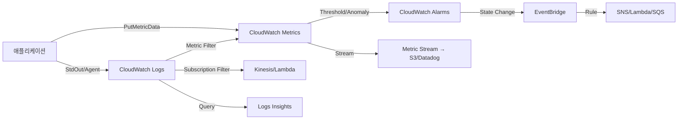

# AWS CloudWatch 심화

CloudWatch는 AWS 콘솔에서 하나의 탭처럼 보이지만 내부적으로는 서로 다른 API와 과금 체계를 가진 여러 서비스의 묶음이다. Logs, Metrics, Alarms, Events(현재 EventBridge), Logs Insights, Dashboards, Contributor Insights, Synthetics, RUM, Evidently까지 포함되며 각각 SDK 호출 경로가 다르다. 실무에서는 이 구성요소들을 조합해 한 장애 상황에서 로그 → 메트릭 → 알람 → 자동화 액션까지 연결되도록 구성한다.

기존 문서가 Logs 수집, Alarms, Logs Insights 쿼리를 각각 분리해서 다루고 있는데, 실제 운영에서는 이 셋이 독립적으로 쓰이는 경우가 거의 없다. 예를 들어 Lambda 에러율이 치솟았을 때 담당자는 알람 → CloudWatch 메트릭 차트 → 해당 시간대 Logs Insights 쿼리 → 관련 X-Ray 트레이스 순서로 드릴다운한다. 이 전체 흐름을 어떻게 설계하는지가 문서의 초점이다.

---

## 1. CloudWatch 전체 구성과 데이터 흐름

CloudWatch 내부는 크게 세 개의 저장소로 나뉜다.

- **Metrics 저장소**: 시계열 숫자 데이터. namespace/dimension/metric name으로 식별되며 15개월간 보관. 해상도에 따라 집계 주기가 달라진다.
- **Logs 저장소**: 텍스트(또는 JSON) 라인 기반. Log Group → Log Stream 구조. 기본 보존 무기한(과금 주의), 기간 설정 가능.
- **Events Bus(EventBridge)**: AWS 서비스 이벤트와 커스텀 이벤트를 규칙에 따라 타겟으로 라우팅. 상태를 저장하지 않는 pub/sub.

세 저장소는 서로를 참조할 수 있다. 메트릭 필터(Metric Filter)는 로그를 읽어 메트릭을 만들고, 알람은 메트릭을 읽어 EventBridge 이벤트를 발생시킨다. Subscription Filter는 로그를 Kinesis/Lambda로 흘려보낸다.



이 전체 구조를 이해하지 못한 채 "알람은 SNS로만 연결해야 한다"거나 "로그에서 메트릭을 뽑으려면 Lambda를 써야 한다"라고 생각하면 불필요한 구성이 쌓인다. 알람도 EventBridge 이벤트를 발생시키므로 Step Functions나 Systems Manager Automation으로 직접 연결할 수 있고, 로그에서 메트릭 추출은 Metric Filter로 Lambda 없이 처리된다.

---

## 2. 메트릭 수집 방식 세 가지

### 2.1 PutMetricData API

가장 기본이 되는 방식. 애플리케이션이 직접 `cloudwatch:PutMetricData`를 호출해 메트릭을 적재한다.

```python
import boto3
from datetime import datetime

cw = boto3.client("cloudwatch")
cw.put_metric_data(
    Namespace="MyService/Order",
    MetricData=[
        {
            "MetricName": "OrderCreated",
            "Dimensions": [
                {"Name": "Environment", "Value": "prod"},
                {"Name": "Region", "Value": "ap-northeast-2"},
            ],
            "Timestamp": datetime.utcnow(),
            "Value": 1,
            "Unit": "Count",
            "StorageResolution": 60,
        }
    ],
)
```

문제는 호출마다 과금이 발생한다는 점이다. PutMetricData는 요청 1,000건당 약 $0.01인데, 초당 100건 요청이 모이면 한 달에 수십만 원이 나간다. 실제로 초당 수백 건 호출하는 서비스에서 CloudWatch 비용의 대부분이 PutMetricData였던 경우가 많다.

PutMetricData는 요청 하나에 최대 1,000개 메트릭 값을 묶을 수 있으므로, 애플리케이션에서는 보통 메모리에 1~10초간 집계해서 한 번에 보낸다. 그런데 이 집계 로직을 직접 짜는 것 자체가 버그의 원천이다. EMF를 쓰면 이 문제가 사라진다.

### 2.2 EMF (Embedded Metric Format)

로그를 JSON으로 쓰면 CloudWatch가 자동으로 메트릭을 추출한다. Lambda, ECS, EKS에서 기본으로 쓰는 방식이다.

```json
{
  "_aws": {
    "Timestamp": 1714000000000,
    "CloudWatchMetrics": [
      {
        "Namespace": "MyService/Order",
        "Dimensions": [["Environment", "Region"]],
        "Metrics": [
          {"Name": "OrderLatency", "Unit": "Milliseconds"},
          {"Name": "OrderAmount", "Unit": "None"}
        ]
      }
    ]
  },
  "Environment": "prod",
  "Region": "ap-northeast-2",
  "OrderLatency": 125,
  "OrderAmount": 49000,
  "OrderId": "ord-1234"
}
```

stdout으로 이 JSON을 출력하면 CloudWatch Logs로 들어가면서 동시에 `OrderLatency`, `OrderAmount` 메트릭이 자동 집계된다. PutMetricData 호출이 필요 없고, 원본 로그에 `OrderId`까지 남아 있어서 메트릭이 튀었을 때 Logs Insights로 바로 역추적 가능하다.

파이썬에서는 `aws-embedded-metrics` 라이브러리로 쉽게 쓸 수 있다.

```python
from aws_embedded_metrics import metric_scope

@metric_scope
async def handler(event, context, metrics):
    metrics.set_namespace("MyService/Order")
    metrics.set_dimensions({"Environment": "prod"})
    metrics.put_metric("OrderLatency", 125, "Milliseconds")
    metrics.set_property("OrderId", "ord-1234")
```

EMF는 로그 적재 비용만 발생하고 메트릭 추출은 무료다. 다만 Dimension 조합마다 커스텀 메트릭이 생성되므로 High-cardinality Dimension(예: userId)을 Dimension에 넣으면 메트릭 폭발로 비용이 급증한다. userId 같은 값은 Property로 남기고 Dimension에는 environment, region, api_name 정도만 넣는다.

### 2.3 CloudWatch Agent (StatsD/CollectD)

EC2/온프레미스에서 OS 메트릭(디스크, 메모리, 프로세스 수)을 수집할 때 쓴다. agent 설정 파일에 StatsD/CollectD 수신 포트를 열어두면 애플리케이션이 UDP로 메트릭을 쏠 수 있다.

```json
{
  "metrics": {
    "metrics_collected": {
      "statsd": {
        "service_address": ":8125",
        "metrics_collection_interval": 10,
        "metrics_aggregation_interval": 60
      },
      "mem": {"measurement": ["mem_used_percent"]},
      "disk": {"measurement": ["used_percent"], "resources": ["/"]}
    }
  }
}
```

StatsD 방식은 UDP라서 손실 가능성이 있고 EMF만큼 유연하지 않다. 신규 서비스에서는 EMF를 우선 고려하고, StatsD는 이미 StatsD 기반 코드베이스가 있을 때만 쓴다.

---

## 3. 해상도와 보관 주기

CloudWatch 메트릭은 해상도에 따라 데이터가 다르게 저장된다.

| 해상도 | 집계 주기 | 보관 기간 |
| --- | --- | --- |
| 표준(Standard) | 60초 | 3시간(raw), 15일(1분 집계), 63일(5분), 15개월(1시간) |
| 고해상도(High-Resolution) | 1, 5, 10, 30초 중 선택 | 3시간(raw), 이후는 표준과 동일 |

주의할 점은 15일이 지나면 1분 해상도 데이터가 자동으로 5분 집계로 롤업된다는 것이다. 15일 이전 그래프는 1분 단위로 보이지만 한 달 전 동일 이벤트를 봤을 때 해상도가 달라지는 이유다. 장기 분석이 필요하면 원본을 Metric Stream으로 S3에 내보내두는 편이 낫다.

고해상도는 PutMetricData에서 `StorageResolution=1`로 지정한다. 1초 해상도는 DDoS 방어나 트레이딩 시스템처럼 초 단위 이상 징후가 중요한 경우에만 쓴다. 알람도 고해상도 전용(10초/30초 평가)으로 설정 가능한데 과금이 훨씬 비싸다. 표준 알람은 알람당 $0.10/월, 고해상도 알람은 $0.30/월이다.

---

## 4. Metric Math와 복합 지표

단일 메트릭만으로 표현하기 어려운 상황이 많다. 예를 들어 에러율은 `5xx 개수 / 전체 요청 수`로 계산되는데, 각각은 별개 메트릭이다. Metric Math로 해결한다.

```yaml
# CloudFormation 알람의 Metrics 정의
Metrics:
  - Id: e1
    Expression: "IF(m2 > 10, (m1 / m2) * 100, 0)"
    Label: "ErrorRate(%)"
    ReturnData: true
  - Id: m1
    MetricStat:
      Metric:
        Namespace: AWS/ApplicationELB
        MetricName: HTTPCode_Target_5XX_Count
        Dimensions:
          - Name: LoadBalancer
            Value: app/my-alb/abc123
      Period: 60
      Stat: Sum
    ReturnData: false
  - Id: m2
    MetricStat:
      Metric:
        Namespace: AWS/ApplicationELB
        MetricName: RequestCount
        Dimensions:
          - Name: LoadBalancer
            Value: app/my-alb/abc123
      Period: 60
      Stat: Sum
    ReturnData: false
```

`IF(m2 > 10, ...)` 조건을 넣은 이유는 트래픽이 적을 때 분모가 0 또는 극소값이 되면 에러율이 비정상적으로 튀기 때문이다. 예전에 새벽 시간대 요청 2건 중 1건이 5xx면 에러율 50%로 알람이 터진 적이 있다. 최소 요청 수 조건을 같이 걸어야 한다.

Metric Math는 `SUM`, `AVG`, `PERCENTILE` 같은 통계 함수뿐 아니라 `ANOMALY_DETECTION_BAND`, `FILL`, `REMOVE_EMPTY` 같은 함수도 지원한다. `REMOVE_EMPTY(m1)`는 Missing Data가 있는 구간을 제거해서 평균 계산이 왜곡되는 것을 막는다.

---

## 5. 알람 설계

### 5.1 평가 주기와 데이터 부족 처리

알람 설정에서 가장 실수가 많은 부분이 `EvaluationPeriods`, `DatapointsToAlarm`, `TreatMissingData`다.

- **EvaluationPeriods**: 몇 개의 주기를 확인할지.
- **DatapointsToAlarm**: 그 중 몇 개가 임계치를 넘어야 알람이 트리거될지(M out of N).
- **TreatMissingData**: 데이터가 없을 때 어떻게 처리할지(`missing`, `notBreaching`, `breaching`, `ignore`).

5분 중 3분 이상 CPU 80% 초과 시 알람을 울리려면 `Period=60, EvaluationPeriods=5, DatapointsToAlarm=3`으로 설정한다. 한 번 튀는 스파이크를 걸러내면서 지속적인 이상을 잡는 패턴이다.

`TreatMissingData`는 서비스 특성에 따라 다르게 설정해야 한다.

- Lambda 호출 수 같은 이벤트성 메트릭: `notBreaching` (호출이 없는 것이 정상)
- EC2 CPU 같은 지속성 메트릭: `breaching` 또는 `missing` (없으면 이상)
- 가끔씩만 실행되는 배치: `ignore` (이전 상태 유지)

잘못 설정하면 새벽에 호출이 없는 Lambda가 알람을 계속 울리거나, 반대로 EC2가 죽어서 메트릭 자체가 안 올라오는데 알람이 안 울리는 일이 생긴다.

### 5.2 Composite Alarm(복합 알람)

단일 메트릭 임계치로는 실제 장애 상황을 구분하기 어렵다. "ALB 에러율 상승 AND DB CPU 상승"이면 진짜 장애지만, ALB만 튀면 클라이언트 문제일 수 있다. Composite Alarm은 여러 알람을 AND/OR/NOT으로 조합한다.

```hcl
resource "aws_cloudwatch_composite_alarm" "real_incident" {
  alarm_name = "prod-real-incident"
  alarm_rule = join(" ", [
    "ALARM(prod-alb-5xx-high)",
    "AND",
    "(ALARM(prod-rds-cpu-high) OR ALARM(prod-rds-connections-high))"
  ])
  alarm_actions = [aws_sns_topic.incident_pager.arn]
}
```

Composite Alarm의 장점은 알람 폭주(Alarm Storm) 완화다. 네트워크 장애 한 번으로 하위 알람 수십 개가 동시에 울리는 것을 상위 Composite 한 개로 묶어 PagerDuty로 단일 알람만 보낸다. 하위 알람은 SNS 연결을 빼고 상태 확인용으로만 쓴다.

`ActionsSuppressor` 기능으로 특정 알람이 울리는 동안 다른 알람 액션을 억제할 수 있다. 예를 들어 AZ 전체 장애 알람이 울리는 동안 개별 EC2 알람을 억제해서 수백 개 알림이 쏟아지는 것을 막는다.

### 5.3 Anomaly Detection(이상 탐지)

정해진 임계치가 아닌 학습된 패턴에서 벗어나는 것을 탐지한다. 트래픽이 시간대별로 다른 서비스에서 고정 임계치는 의미가 없다. 새벽 3시 CPU 50%는 이상이지만 오후 2시 50%는 정상이다.

```hcl
resource "aws_cloudwatch_metric_alarm" "anomaly_cpu" {
  alarm_name          = "prod-ec2-cpu-anomaly"
  comparison_operator = "GreaterThanUpperThreshold"
  evaluation_periods  = 3
  threshold_metric_id = "ad1"

  metric_query {
    id          = "m1"
    return_data = true
    metric {
      namespace   = "AWS/EC2"
      metric_name = "CPUUtilization"
      period      = 300
      stat        = "Average"
      dimensions  = { InstanceId = "i-0abcd1234" }
    }
  }

  metric_query {
    id          = "ad1"
    expression  = "ANOMALY_DETECTION_BAND(m1, 2)"
    label       = "CPU (expected)"
    return_data = true
  }
}
```

`ANOMALY_DETECTION_BAND(m1, 2)`에서 2는 표준편차 배수다. 값이 클수록 관대해지고 작을수록 민감해진다. 처음에는 3으로 시작해서 점차 줄이는 편이 운영 부담이 적다. 학습에는 최소 2주치 데이터가 필요하고, 그 전에는 밴드가 넓게 잡혀서 알람이 거의 안 울린다.

---

## 6. CloudWatch Events → EventBridge 전환

CloudWatch Events는 2019년 EventBridge로 재브랜딩됐다. API는 여전히 `events.amazonaws.com`이지만 콘솔은 EventBridge로 이동했고, 기능이 확장됐다.

| 항목 | CloudWatch Events | EventBridge |
| --- | --- | --- |
| AWS 서비스 이벤트 | 지원 | 지원 |
| 커스텀 이벤트 버스 | default 하나만 | 여러 개 생성 가능 |
| SaaS 통합(파트너 이벤트) | 불가 | Zendesk, Datadog, PagerDuty 등 |
| 이벤트 아카이브/리플레이 | 불가 | 지원 |
| 스키마 레지스트리 | 불가 | 지원 |
| 입력 변환(Input Transformer) | 제한적 | 강화 |

전환 자체는 투명하다. 기존 CloudWatch Events 규칙은 EventBridge default 버스에서 그대로 동작한다. 새로 만드는 규칙은 EventBridge를 쓰면 된다.

이벤트 버스를 분리하는 이유는 격리와 권한 관리다. default 버스에는 AWS 서비스 이벤트가 다 쏟아져서 커스텀 이벤트와 섞인다. 커스텀 이벤트 버스를 따로 만들면 IAM 정책으로 계정 간 PutEvents 권한을 제한할 수 있다.

### 6.1 규칙과 이벤트 패턴

EventBridge 규칙은 패턴 매칭 또는 스케줄 기반으로 동작한다. 패턴은 JSON 구조로 정의한다.

```json
{
  "source": ["aws.ec2"],
  "detail-type": ["EC2 Instance State-change Notification"],
  "detail": {
    "state": ["stopped", "terminated"],
    "instance-id": [{"prefix": "i-prod-"}]
  }
}
```

`prefix`, `suffix`, `anything-but`, `numeric`, `exists` 같은 매칭 연산자를 지원한다. 타겟은 Lambda, SNS, SQS, Step Functions, API Destination(외부 HTTP), Kinesis, ECS Task 등 20여 가지가 있다.

### 6.2 스케줄 규칙과 EventBridge Scheduler

cron 기반 스케줄로 Lambda를 주기적으로 실행하는 용도로 많이 쓰였는데, 2022년에 별도 서비스인 EventBridge Scheduler가 나왔다. 차이점은:

- EventBridge Scheduler는 스케줄당 제한이 훨씬 높다(백만 개 이상).
- One-time 스케줄 지원(특정 시각 1회 실행).
- Dead Letter Queue와 Retry 정책을 스케줄마다 지정.
- Time zone 지정 가능(Rules는 UTC 고정).

신규 작업은 EventBridge Scheduler를 우선 고려하고, 기존 Rules는 유지해도 된다.

---

## 7. Logs Insights 고급 쿼리

Logs Insights는 Log Group을 대상으로 하는 쿼리 언어다. 기본 문법은 별도 문서에 있으므로 여기서는 자주 쓰는 심화 패턴만 다룬다.

### 7.1 parse로 비정형 로그 처리

구조화되지 않은 로그(nginx access log 같은)를 쿼리할 때 쓴다.

```
parse @message /(?<ip>\d+\.\d+\.\d+\.\d+) - - \[(?<time>[^\]]+)\] "(?<method>\w+) (?<path>[^ ]+)/
| filter method = "POST"
| stats count() as request_count, avg(strlen(@message)) as avg_size by path
| sort request_count desc
| limit 20
```

정규식 named capture group이 필드로 바뀐다. JSON 로그는 자동 파싱되므로 parse가 필요 없다.

### 7.2 bin으로 시계열 집계

`bin(5m)`은 타임스탬프를 5분 단위로 그룹화한다.

```
fields @timestamp, @message
| filter level = "ERROR"
| stats count() as error_count by bin(1m), service
| sort @timestamp desc
```

결과를 Logs Insights 차트로 바로 렌더링할 수 있고, Dashboard 위젯으로 저장하면 메트릭처럼 보인다.

### 7.3 percentile

응답 시간 p50/p95/p99를 한 번에 계산한다.

```
fields @timestamp, @duration, api_name
| filter @type = "REPORT"
| stats
    count() as req,
    pct(@duration, 50) as p50,
    pct(@duration, 95) as p95,
    pct(@duration, 99) as p99,
    max(@duration) as max
by api_name
| sort p99 desc
```

Lambda의 `REPORT` 로그는 자동으로 `@duration`, `@maxMemoryUsed`, `@billedDuration` 필드를 노출한다. 별도 설정 없이 성능 분포를 볼 수 있다.

### 7.4 쿼리 비용

Logs Insights는 스캔한 데이터량 기준으로 과금된다(GB당 약 $0.005). 전체 Log Group을 대상으로 한 달치 쿼리를 돌리면 수십 GB가 스캔돼서 한 번에 수천 원이 나간다. 실무에서는:

- `filter`를 앞쪽에 배치해 스캔 전 필터링(실제 과금은 전체 스캔이지만 쿼리 속도가 빨라짐).
- 시간 범위를 명시적으로 좁힌다.
- 자주 쓰는 분석은 Metric Filter로 메트릭화해서 매번 쿼리하지 않도록 한다.

---

## 8. 구조화 로깅과 JSON 필터

CloudWatch는 JSON 로그를 자동 파싱한다. 텍스트 로그는 `filter @message like /ERROR/`처럼 문자열 매칭만 가능하지만, JSON이면 필드 접근이 된다.

```python
import json, logging, time

class JsonFormatter(logging.Formatter):
    def format(self, record):
        return json.dumps({
            "time": int(time.time() * 1000),
            "level": record.levelname,
            "service": "order-api",
            "trace_id": getattr(record, "trace_id", None),
            "message": record.getMessage(),
        })

logger = logging.getLogger()
handler = logging.StreamHandler()
handler.setFormatter(JsonFormatter())
logger.addHandler(handler)
```

Metric Filter 패턴도 JSON이면 훨씬 강력하다.

```
{ $.level = "ERROR" && $.service = "order-api" && $.status_code >= 500 }
```

텍스트 패턴으로는 `[status_code >= 500, ...]` 같은 구문이 있지만 공백과 순서에 민감해서 로그 포맷이 조금만 바뀌어도 깨진다. JSON 기반 패턴은 필드 이름만 맞으면 순서 무관하다.

주의할 점은 한 줄에 여러 JSON 객체가 있거나 중간에 stack trace 같은 비정형 텍스트가 끼면 파싱이 실패한다는 것이다. 예외 로깅 시에는 stack trace도 JSON 필드(`exception.stacktrace`)에 문자열로 넣어야 한다.

---

## 9. Dashboard와 JSON 정의

Dashboard는 GUI로 만들면 편하지만 수정 이력이 없고 팀원 간 공유가 어렵다. Dashboard body는 JSON이고 Terraform으로 관리하는 편이 장기적으로 낫다.

```hcl
resource "aws_cloudwatch_dashboard" "main" {
  dashboard_name = "prod-overview"
  dashboard_body = jsonencode({
    widgets = [
      {
        type   = "metric"
        x      = 0
        y      = 0
        width  = 12
        height = 6
        properties = {
          metrics = [
            ["AWS/ApplicationELB", "RequestCount", "LoadBalancer", "app/prod-alb/abc"],
            [".", "HTTPCode_Target_5XX_Count", ".", "."],
            [".", "HTTPCode_Target_4XX_Count", ".", "."]
          ]
          period = 60
          stat   = "Sum"
          region = "ap-northeast-2"
          title  = "ALB Requests"
          view   = "timeSeries"
        }
      },
      {
        type   = "log"
        x      = 0
        y      = 6
        width  = 24
        height = 6
        properties = {
          query = "SOURCE '/aws/lambda/order-api' | fields @timestamp, @message | filter level = 'ERROR' | sort @timestamp desc | limit 100"
          region = "ap-northeast-2"
          title  = "Recent Errors"
          view   = "table"
        }
      }
    ]
  })
}
```

위젯 종류는 `metric`, `log`, `text`, `alarm`, `explorer` 등이 있다. `text` 위젯에 Markdown을 넣어 Runbook 링크를 박아두면 온콜 담당자가 대시보드만 보고도 대응할 수 있다.

메트릭 위젯의 `metrics` 배열에 `"."`을 쓰면 바로 위 행의 값을 재사용한다는 의미로, 같은 Dimension을 반복하지 않아도 된다. 이 문법은 콘솔에서 생성한 JSON을 복사할 때 혼란을 주는데 의미만 알면 간단하다.

Live 데이터 대시보드는 `periodOverride=auto`로 두면 확대/축소 시 자동으로 해상도를 바꾼다. 1분 데이터가 필요하면 `liveData=true`와 짧은 period(60초)를 조합한다.

---

## 10. Cross-Account/Cross-Region 관측

멀티 계정 환경에서 계정마다 콘솔에 들어가 로그를 보는 방식은 장애 상황에 치명적이다. CloudWatch는 두 가지 방식으로 계정 간 관측을 지원한다.

### 10.1 Cross-Account Observability (2022~)

모니터링 계정을 "Monitoring Account"로 지정하고 소스 계정들을 "Source Account"로 연결한다. 모니터링 계정에서 소스 계정의 Metrics, Logs, Traces를 직접 볼 수 있다.

```hcl
# Monitoring Account
resource "aws_oam_sink" "main" {
  name = "monitoring-sink"
}

resource "aws_oam_sink_policy" "main" {
  sink_identifier = aws_oam_sink.main.id
  policy = jsonencode({
    Version = "2012-10-17"
    Statement = [{
      Effect = "Allow"
      Principal = { AWS = ["arn:aws:iam::111111111111:root", "arn:aws:iam::222222222222:root"] }
      Action = ["oam:CreateLink", "oam:UpdateLink"]
      Resource = "*"
    }]
  })
}

# Source Account
resource "aws_oam_link" "main" {
  label_template = "$AccountName"
  resource_types = ["AWS::CloudWatch::Metric", "AWS::Logs::LogGroup", "AWS::XRay::Trace"]
  sink_identifier = "arn:aws:oam:ap-northeast-2:999999999999:sink/monitoring-sink"
}
```

설정 후 모니터링 계정 콘솔에서 계정 드롭다운으로 소스 계정을 선택할 수 있다. 기존의 Cross-Account Dashboard 공유보다 훨씬 투명하다.

### 10.2 Cross-Region

한 계정 내에서 여러 리전의 메트릭을 한 대시보드에 표시하려면 위젯의 `region` 속성을 각각 다르게 지정한다. 쿼리 레벨에서 리전 간 조인은 안 되지만 나란히 놓고 비교는 된다.

글로벌 서비스 모니터링(CloudFront, Route 53 헬스 체크)은 항상 `us-east-1`에서 메트릭이 발행된다. 리전을 한국으로 제한하면 이 메트릭이 안 보이니 주의해야 한다.

---

## 11. Contributor Insights

메트릭만으로는 "누가/무엇이" 이상 행동을 하는지 모른다. Contributor Insights는 로그를 분석해 상위 기여자를 실시간으로 보여준다.

```json
{
  "Schema": { "Name": "CloudWatchLogRule", "Version": 1 },
  "AggregateOn": "Count",
  "Contribution": {
    "Filters": [
      { "Match": "$.httpMethod", "In": ["POST"] },
      { "Match": "$.statusCode", "GreaterThan": 499 }
    ],
    "Keys": ["$.clientIp", "$.apiPath"]
  },
  "LogFormat": "JSON",
  "LogGroupNames": ["/aws/apigateway/prod"]
}
```

Keys에 지정한 필드 조합별로 카운트를 집계해 Top N을 보여준다. DDoS 의심 상황에서 어떤 IP가 가장 많이 5xx를 유발했는지 즉시 확인할 수 있다.

AWS가 기본 제공하는 Contributor Insights Rules도 있다. VPC Flow Logs 기반 상위 Talker, Route 53 Resolver 쿼리 상위 도메인 등이다.

---

## 12. Metric Stream으로 외부 연동

CloudWatch Metrics를 외부 시스템(Datadog, New Relic, Splunk, S3)에 실시간으로 내보내는 기능이다. 과거에는 `GetMetricData` API를 폴링하거나 수십 개 지표를 정해서 CloudWatch → Lambda → 외부로 보내는 식이었는데, 이 방식은 지연이 크고 비쌌다.

Metric Stream은 Firehose Delivery Stream으로 메트릭을 스트리밍한다.

```hcl
resource "aws_cloudwatch_metric_stream" "main" {
  name          = "prod-to-datadog"
  role_arn      = aws_iam_role.metric_stream.arn
  firehose_arn  = aws_kinesis_firehose_delivery_stream.datadog.arn
  output_format = "opentelemetry1.0"

  include_filter {
    namespace = "AWS/EC2"
  }
  include_filter {
    namespace = "AWS/RDS"
  }
}
```

출력 포맷은 `json`, `opentelemetry0.7`, `opentelemetry1.0`이다. Datadog은 OpenTelemetry 1.0을 지원한다. 계정 내 모든 네임스페이스 메트릭을 내보내면 비용이 빠르게 늘어나므로 `include_filter`/`exclude_filter`로 제한한다.

S3로 내보낸 메트릭은 Athena로 장기 분석하거나, 15개월 이상 보관해야 하는 규제 대응용으로 쓴다.

---

## 13. Container Insights / Lambda Insights

### 13.1 Container Insights

EKS/ECS/Fargate에서 컨테이너 단위 CPU/메모리/네트워크/디스크 메트릭을 수집한다. EKS는 DaemonSet으로 CloudWatch Agent와 Fluent Bit을 띄우고, ECS는 Cluster 설정에서 활성화만 하면 된다.

```yaml
# EKS CloudWatch Agent 활성화 (헬름)
helm upgrade --install aws-cloudwatch-metrics \
  eks/aws-cloudwatch-metrics \
  --namespace amazon-cloudwatch \
  --set clusterName=prod-eks
```

Container Insights는 Pod 단위 메트릭을 커스텀 메트릭으로 적재하므로 비용이 크다. 노드 수 × Pod 수 × 메트릭 종류 만큼 곱해지는데, 수백 Pod 클러스터에서는 한 달에 수백 달러 수준이다. 대안으로는 Prometheus + AMP(Amazon Managed Prometheus)가 더 저렴한 경우가 많다.

### 13.2 Lambda Insights

Lambda 런타임 수준의 메트릭(CPU 사용률, 메모리, 네트워크)을 수집한다. 기본 Lambda 메트릭에는 invocation 수, duration, error 수만 있고 런타임 내부는 안 보여서 메모리 누수 같은 문제를 진단하기 어려웠다.

활성화는 Lambda Layer 추가로 끝난다.

```hcl
resource "aws_lambda_function" "api" {
  # ...
  layers = [
    "arn:aws:lambda:ap-northeast-2:580247275435:layer:LambdaInsightsExtension:38"
  ]
  tracing_config {
    mode = "Active"  # X-Ray
  }
}
```

`/aws/lambda-insights` Log Group에 초 단위 메트릭이 쌓이고 CloudWatch에서 Lambda Insights 화면으로 볼 수 있다. 메모리 사용률이 평소와 다르게 튀는 시점과 요청을 매칭해서 누수 여부를 빠르게 판단한다.

---

## 14. 로그 보존과 내보내기

### 14.1 보존 정책

Log Group의 기본 보존은 무기한이다. 설정하지 않으면 몇 년 치 로그가 계속 쌓이고 매달 저장 비용이 나간다. 실무에서는 Log Group 생성 시점에 반드시 `retention_in_days`를 지정한다.

```hcl
resource "aws_cloudwatch_log_group" "api" {
  name              = "/aws/lambda/order-api"
  retention_in_days = 30
  kms_key_id        = aws_kms_key.logs.arn
}
```

일반적인 기준:

- 애플리케이션 로그: 30~90일
- 감사 로그(CloudTrail 포함): 1년 이상 S3로 내보내기
- 디버그 로그: 7~14일

보존 기간을 줄이는 것은 되돌릴 수 없다. 예전에 400일 보존된 Log Group을 30일로 바꾸자마자 370일치 로그가 삭제되는 사고가 있었다. 중요한 로그는 먼저 S3로 Export한 뒤 줄인다.

### 14.2 S3 Export

Log Group 전체 또는 일부 기간을 S3로 내보내는 기능이다. 콘솔 또는 `CreateExportTask` API로 실행하며, 비동기로 처리된다.

```python
logs = boto3.client("logs")
logs.create_export_task(
    logGroupName="/aws/lambda/order-api",
    fromTime=int(datetime(2026, 1, 1).timestamp() * 1000),
    to=int(datetime(2026, 2, 1).timestamp() * 1000),
    destination="my-log-archive-bucket",
    destinationPrefix="order-api/2026-01",
)
```

동시에 하나의 Export Task만 실행 가능하다는 제한이 있다. 여러 Log Group을 한꺼번에 아카이브할 때는 순차 실행 로직이 필요하다.

### 14.3 KMS 암호화

Log Group을 KMS로 암호화하면 Log Group 자체에 읽기 권한이 있어도 KMS Decrypt 권한이 없으면 로그를 볼 수 없다. 감사 로그나 PII 포함 로그에 유용하다.

KMS 키 정책에 CloudWatch Logs 서비스 주체가 `kms:Encrypt`, `kms:Decrypt`, `kms:ReEncrypt*`, `kms:GenerateDataKey*`, `kms:Describe*`를 쓸 수 있도록 허용해야 한다. 이 설정을 빼먹으면 로그 전송 자체가 실패하는데 에러 메시지가 `InvalidParameterException`으로만 떠서 원인 파악이 어렵다.

---

## 15. Subscription Filter로 실시간 파이프라인

로그를 다른 서비스에 실시간으로 전달해야 할 때 쓴다. 타겟은 Kinesis Data Streams, Kinesis Data Firehose, Lambda다.

```hcl
resource "aws_cloudwatch_log_subscription_filter" "to_es" {
  name            = "to-elasticsearch"
  log_group_name  = aws_cloudwatch_log_group.api.name
  filter_pattern  = "{ $.level = \"ERROR\" }"
  destination_arn = aws_lambda_function.log_to_es.arn
}
```

한 Log Group당 Subscription Filter는 최대 2개까지 가능하다. 이 제한을 넘어야 할 때는 Firehose 한 개를 분기시키거나, Log Group을 나눈다.

주의할 점은 Subscription Filter는 base64 + gzip 인코딩된 페이로드를 보낸다는 것이다. Lambda 코드에서 디코딩이 필요하다.

```python
import base64, gzip, json

def handler(event, context):
    payload = base64.b64decode(event["awslogs"]["data"])
    data = json.loads(gzip.decompress(payload))
    for log_event in data["logEvents"]:
        print(log_event["message"])
```

---

## 16. 실무 장애 대응 시나리오

### 16.1 알람 폭주

한 번의 네트워크 장애로 수백 개 알람이 동시에 울려 PagerDuty가 마비된 경험이 있다. 원인은 인프라 알람과 애플리케이션 알람이 한 SNS Topic을 공유하고 있었기 때문이다.

대응 방법은:

- 상위 Composite Alarm을 만들고, 하위 알람은 SNS 연결을 끊는다.
- SNS Topic을 심각도(critical/warning/info)로 분리한다.
- PagerDuty 측에서 Deduplication Key를 서비스 단위로 지정해 병합한다.
- ActionsSuppressor로 AZ 전체 장애 시 하위 알람을 일괄 억제한다.

### 16.2 Flapping Alarm

알람 상태가 OK ↔ ALARM을 짧게 반복하는 문제. 원인은 대부분 EvaluationPeriods가 너무 짧거나 메트릭 자체가 변동성이 크다.

- `M out of N`으로 일시적 스파이크 필터링(5 중 3).
- Anomaly Detection으로 바꾸거나, 임계치를 더 보수적으로 설정.
- 평가 주기(Period)를 60초에서 300초로 늘려 스무딩.
- EC2 Auto Scaling 알람이라면 `BreachDuration`을 길게 잡아 스케일링 진동 방지.

### 16.3 Missing Data

메트릭이 안 들어와서 알람이 동작하지 않거나 비정상 상태로 빠지는 경우. 전형적인 케이스:

- Lambda 호출이 없어 `Errors` 메트릭이 0도 안 들어옴 → `TreatMissingData=notBreaching`
- EC2 인스턴스가 죽어 CloudWatch Agent가 멈춤 → `TreatMissingData=breaching` + StatusCheckFailed 알람 병행
- RDS 장애로 메트릭 중단 → RDS AWS 관리형 알람 사용

`missing`으로 두면 INSUFFICIENT_DATA 상태가 되는데, Composite Alarm에서 이 상태를 어떻게 취급할지도 명시해야 한다. 기본은 INSUFFICIENT_DATA가 OK로 평가되므로 놓치기 쉽다.

### 16.4 비용 폭주

CloudWatch 비용이 갑자기 두세 배 뛰는 경우 대부분 원인은 셋 중 하나다.

- 디버그 로그를 켰다가 안 끔. Log Group 적재량을 Cost Explorer에서 확인.
- 새로 배포한 서비스가 High-cardinality Dimension으로 EMF 메트릭을 생성. 네임스페이스별 커스텀 메트릭 수를 확인.
- Logs Insights 쿼리를 대시보드에 박아두고 auto-refresh로 돌림. 1분마다 수 GB 스캔이면 한 달에 큰 비용.

대응은 Cost Explorer에서 서비스별, 사용 유형(Usage Type)별로 필터링해서 원인을 찾고, Log Group 단위로 억제하거나 샘플링한다.

---

## 17. Terraform 통합 예제

실제 운영 서비스에서 쓰는 최소 구성 예제다. ALB + ECS 서비스에 대해 에러율 알람, Logs Insights Dashboard, Metric Filter를 묶는다.

```hcl
locals {
  service = "order-api"
  env     = "prod"
}

resource "aws_cloudwatch_log_group" "app" {
  name              = "/ecs/${local.env}/${local.service}"
  retention_in_days = 30
  kms_key_id        = aws_kms_key.logs.arn
}

resource "aws_cloudwatch_log_metric_filter" "app_error" {
  name           = "${local.env}-${local.service}-error-count"
  log_group_name = aws_cloudwatch_log_group.app.name
  pattern        = "{ $.level = \"ERROR\" }"

  metric_transformation {
    name      = "ErrorCount"
    namespace = "App/${local.service}"
    value     = "1"
    default_value = "0"
    dimensions = {
      Env = local.env
    }
  }
}

resource "aws_cloudwatch_metric_alarm" "error_rate" {
  alarm_name          = "${local.env}-${local.service}-error-rate"
  comparison_operator = "GreaterThanThreshold"
  evaluation_periods  = 5
  datapoints_to_alarm = 3
  threshold           = 1.0
  treat_missing_data  = "notBreaching"

  metric_query {
    id         = "e1"
    expression = "IF(m2 > 10, (m1 / m2) * 100, 0)"
    label      = "ErrorRate(%)"
    return_data = true
  }

  metric_query {
    id = "m1"
    metric {
      metric_name = "ErrorCount"
      namespace   = "App/${local.service}"
      period      = 60
      stat        = "Sum"
      dimensions  = { Env = local.env }
    }
  }

  metric_query {
    id = "m2"
    metric {
      metric_name = "RequestCount"
      namespace   = "AWS/ApplicationELB"
      period      = 60
      stat        = "Sum"
      dimensions = {
        LoadBalancer = aws_lb.main.arn_suffix
      }
    }
  }

  alarm_actions = [aws_sns_topic.alerts.arn]
  ok_actions    = [aws_sns_topic.alerts.arn]
}

resource "aws_cloudwatch_dashboard" "service" {
  dashboard_name = "${local.env}-${local.service}"
  dashboard_body = jsonencode({
    widgets = [
      {
        type = "metric", x = 0, y = 0, width = 12, height = 6,
        properties = {
          metrics = [
            [{ "expression" = "(m1 / m2) * 100", "label" = "ErrorRate" }],
            ["App/${local.service}", "ErrorCount", "Env", local.env, { "id" = "m1", "visible" = false }],
            ["AWS/ApplicationELB", "RequestCount", "LoadBalancer", aws_lb.main.arn_suffix, { "id" = "m2", "visible" = false }]
          ]
          period = 60, stat = "Sum", region = data.aws_region.current.name,
          title = "Error Rate (%)"
        }
      },
      {
        type = "log", x = 0, y = 6, width = 24, height = 8,
        properties = {
          query = "SOURCE '${aws_cloudwatch_log_group.app.name}' | fields @timestamp, level, message, trace_id | filter level = 'ERROR' | sort @timestamp desc | limit 50"
          region = data.aws_region.current.name, title = "Recent Errors", view = "table"
        }
      }
    ]
  })
}
```

이 구성이 실제 쓸 때 필요한 최소 단위다. 여기에 Composite Alarm, Anomaly Detection, Container Insights를 필요한 만큼 더한다. 한 번에 모든 것을 설정하려고 하면 유지 보수가 안 되고, 팀에서 아무도 왜 이 알람이 있는지 기억하지 못하는 상태가 된다. 알람 수가 늘어나면 Alarm Fatigue로 진짜 문제를 놓친다. 10개 정도의 핵심 알람만 운영하고, 나머지는 Dashboard 관찰용으로 두는 편이 현실적이다.

---

## 18. 정리하면서

CloudWatch는 기능이 방대해서 전부 써보기 전에는 전체 구조가 잘 그려지지 않는다. 실무에서 자주 하는 실수는:

- 알람을 너무 많이 만든다. 진짜 울려야 할 것 10개와 참고 지표 100개를 구분하지 않는다.
- EMF를 쓰지 않고 PutMetricData 호출로 비용을 낭비한다.
- 로그 보존 기간을 설정하지 않고 무기한 쌓아둔다.
- High-cardinality Dimension으로 커스텀 메트릭을 폭발시킨다.
- Subscription Filter, Metric Stream 같은 외부 연동 수단을 모르고 Lambda를 직접 짜서 처리한다.
- EventBridge로 전환했다는 사실을 모르고 Rules만 쓴다.

각 구성요소를 단독으로 이해하는 것보다, 장애 상황에서 알람 → 대시보드 → Logs Insights → 트레이스로 이어지는 드릴다운 경로를 팀 내에서 정하고 Runbook에 적는 것이 훨씬 중요하다. 도구는 결국 이 경로를 빠르게 하기 위한 수단이다.
