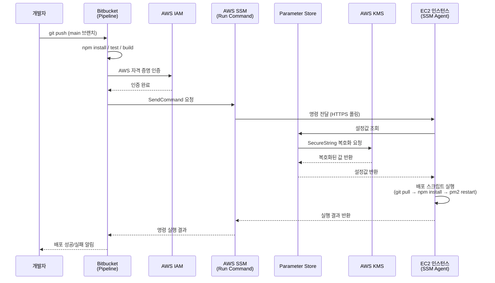
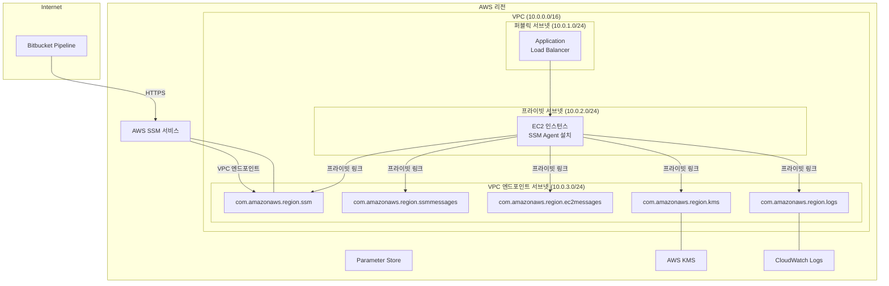
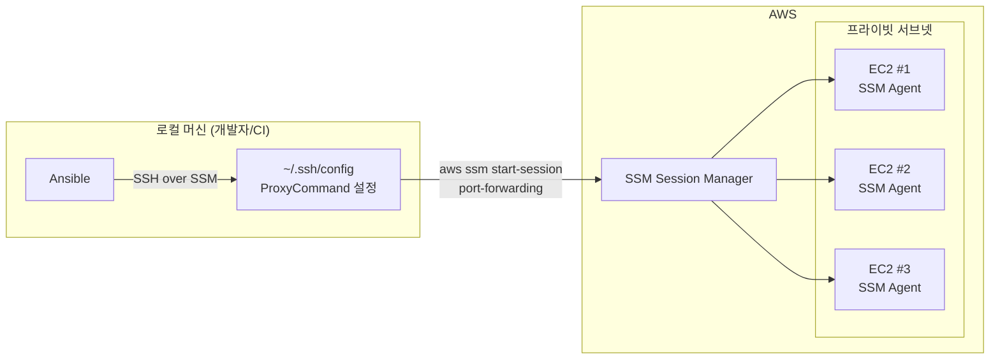
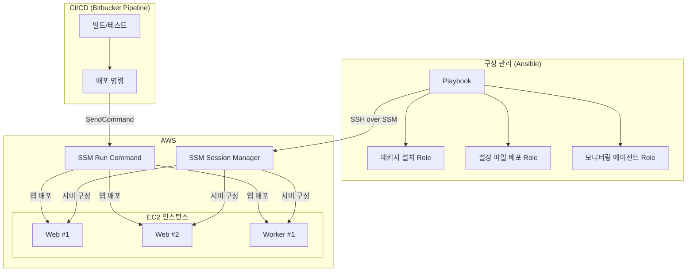

# AWS SSM을 활용한 자동화 배포

## 개요

Bitbucket Pipeline과 AWS SSM을 연동해 Node.js 애플리케이션의 자동화 배포 시스템을 구축한다.

**해결하는 문제:**
- 수동 배포의 비효율성
- 보안 취약점 (SSH 키 관리, 권한 관리)
- 운영 안정성 문제 (일관성 부족, 배포 이력 부재)

**구성 요소:**
- Bitbucket Pipeline: CI/CD 파이프라인
- AWS SSM: 원격 명령 실행
- Parameter Store: 설정값 관리
- KMS: 암호화

## 배포 아키텍처 다이어그램

### Bitbucket Pipeline → SSM → EC2 배포 흐름

전체 배포 흐름은 다음 구조를 따른다. 개발자가 코드를 푸시하면, Bitbucket Pipeline이 빌드와 테스트를 수행한 뒤 AWS SSM Run Command를 호출한다. SSM은 EC2 인스턴스의 SSM Agent에 명령을 전달하고, Agent가 배포 스크립트를 실행한다.



여기서 핵심은 SSH 연결이 어디에도 없다는 점이다. SSM Agent가 아웃바운드 HTTPS로 SSM 서비스에 연결하는 구조라서, EC2의 인바운드 포트를 열 필요가 없다.

### VPC/서브넷/엔드포인트 네트워크 구성

프라이빗 서브넷에 EC2를 배치하고 VPC 엔드포인트를 통해 SSM과 통신하는 구성이다. NAT Gateway 없이도 SSM 통신이 가능하다.



VPC 엔드포인트는 최소 3개가 필요하다.

| 엔드포인트 | 용도 |
|---|---|
| `com.amazonaws.region.ssm` | SSM API 호출 |
| `com.amazonaws.region.ssmmessages` | Session Manager 통신 채널 |
| `com.amazonaws.region.ec2messages` | Run Command 메시지 수신 |

선택 사항으로 `kms`(SecureString 복호화)와 `logs`(CloudWatch 로그 전송) 엔드포인트를 추가한다. 빠뜨리면 NAT Gateway가 있어야 해당 서비스와 통신할 수 있다.

**VPC 엔드포인트 보안 그룹:**
엔드포인트에 연결하는 보안 그룹은 EC2가 속한 서브넷의 CIDR에서 443 포트 인바운드만 허용한다. 불필요하게 0.0.0.0/0으로 열면 의미가 없다.

```bash
# 엔드포인트용 보안 그룹 생성
aws ec2 create-security-group \
  --group-name "ssm-endpoint-sg" \
  --description "Security group for SSM VPC endpoints" \
  --vpc-id "vpc-1234567890abcdef0"

# EC2 프라이빗 서브넷 CIDR에서만 443 허용
aws ec2 authorize-security-group-ingress \
  --group-id "sg-endpoint-id" \
  --protocol tcp \
  --port 443 \
  --cidr "10.0.2.0/24"
```

## 기존 배포 방식의 문제점

### 레거시 배포 방식의 한계

기존의 수동 배포 방식은 여러 문제가 있었다.

**인적 의존성:**
개발자가 직접 서버에 SSH로 접속해 `git pull`, `npm install`, `pm2 restart` 등의 명령을 순차적으로 실행하는 방식이다.

**일관성 부족:**
개발자마다 배포 절차가 달랐다. 어떤 개발자는 `npm install`을 먼저 실행하고, 어떤 개발자는 `git pull` 후 바로 `pm2 restart`를 실행했다. 이런 불일치는 예측하기 어려운 배포 실패로 이어졌다.

**권한 관리의 복잡성:**
모든 개발자에게 동일한 SSH 접근 권한을 부여해야 했다. 보안상 위험할 뿐만 아니라, 누가 언제 어떤 작업을 했는지 추적하기 어려웠다.

**배포 이력의 부재:**
수동 배포는 추적 가능한 이력이 남지 않았다. 어떤 버전이 언제 배포되었는지, 누가 배포했는지에 대한 기록이 없어 롤백이나 문제 해결이 어려웠다.

**민감 정보 노출:**
데이터베이스 비밀번호, API 키 등의 민감한 정보가 코드나 서버 설정 파일에 평문으로 저장되어 있었다.

### 자동화 배포의 필요성

이 문제들을 해결하기 위해 자동화 배포 시스템이 필요하다.

**자동화 배포의 목표:**
- 일관성 확보: 모든 배포가 동일한 절차를 거치도록 한다
- 보안 강화: 최소 권한 원칙을 적용하고, 민감 정보는 암호화한다
- 추적성 확보: 모든 배포 과정이 로그로 남는다
- 효율성 증대: 수동 작업을 최소화한다

## AWS SSM의 핵심 개념

### SSM(Systems Manager)이란?

AWS Systems Manager는 AWS 리소스를 관리하고 운영 작업을 자동화하는 서비스다. SSM의 핵심 기능 중 하나가 Run Command다.

**에이전트 기반 관리:**
EC2 인스턴스에 SSM Agent가 설치되어 있으면, SSH 접속 없이도 AWS 콘솔이나 CLI를 통해 인스턴스에 명령을 실행할 수 있다.

**보안상 장점:**
- SSH 포트 오픈 불필요
- SSH 키 관리 불필요
- IAM 기반 접근 제어
- 모든 명령 실행이 CloudTrail에 기록됨

### SSM Agent의 동작 원리

SSM Agent는 EC2 인스턴스에서 실행되는 소프트웨어다. AWS SSM 서비스와 지속적으로 통신해 대기 중인 명령이 있는지 확인한다.

**역방향 연결:**
일반적인 SSH는 클라이언트가 서버에 직접 연결하는 방식이지만, SSM Agent는 서버(EC2)에서 AWS 서비스로 연결을 시작한다. 방화벽 설정을 단순화하고 보안을 강화한다.

**통신 방식:**
- HTTPS(443 포트)를 통해 통신
- 폴링 기반으로 주기적으로 명령 확인
- 별도의 포트 오픈 불필요

### Parameter Store의 역할

SSM Parameter Store는 설정 데이터와 민감한 정보를 안전하게 저장하는 서비스다.

**SecureString 타입:**
KMS를 통해 자동으로 암호화된다.

**중앙 집중식 관리:**
여러 서버에서 동일한 설정값을 사용해야 할 때, 각 서버에 개별적으로 설정하지 않고 Parameter Store에서 중앙 관리할 수 있다.

**사용 예시:**
```bash
# 파라미터 저장
aws ssm put-parameter \
  --name "/myapp/database/password" \
  --value "secret123" \
  --type "SecureString"

# 애플리케이션에서 조회
aws ssm get-parameter \
  --name "/myapp/database/password" \
  --with-decryption
```

**실무 팁:**
환경별로 네임스페이스를 구분한다. 예: `/myapp/dev/database/password`, `/myapp/prod/database/password`

## 보안 아키텍처

### IAM 최소 권한 원칙

자동화 배포 시스템에서 가장 중요한 보안 원칙은 최소 권한 원칙이다.

**EC2 인스턴스 IAM Role 권한:**
```json
{
  "Version": "2012-10-17",
  "Statement": [
    {
      "Effect": "Allow",
      "Action": [
        "ssm:UpdateInstanceInformation",
        "ssmmessages:CreateControlChannel",
        "ssmmessages:CreateDataChannel"
      ],
      "Resource": "*"
    },
    {
      "Effect": "Allow",
      "Action": [
        "ssm:GetParameters",
        "ssm:GetParameter"
      ],
      "Resource": "arn:aws:ssm:*:*:parameter/myapp/*"
    },
    {
      "Effect": "Allow",
      "Action": [
        "kms:Decrypt"
      ],
      "Resource": "arn:aws:kms:*:*:key/my-key-id"
    },
    {
      "Effect": "Allow",
      "Action": [
        "logs:CreateLogGroup",
        "logs:PutLogEvents"
      ],
      "Resource": "arn:aws:logs:*:*:log-group:/aws/ssm/*"
    }
  ]
}
```

**실무 팁:**
세분화된 권한 부여는 보안 사고 발생 시 피해 범위를 최소화한다. 감사 시에도 어떤 권한이 사용되었는지 명확히 파악할 수 있다.

### KMS를 활용한 암호화

민감한 정보는 반드시 암호화해야 한다. AWS에서는 KMS를 통해 암호화를 제공한다.

**고객 관리 키:**
AWS가 제공하는 기본 키 대신 고객이 직접 생성하고 관리하는 키를 사용할 수 있다. 키의 생성, 삭제, 권한 관리에 대한 제어가 가능하다.

**키 정책:**
KMS 키는 정책을 통해 어떤 주체가 어떤 작업을 수행할 수 있는지 세밀하게 제어할 수 있다. 예를 들어, 특정 IAM Role만 복호화를 수행할 수 있도록 제한할 수 있다.

**감사 추적:**
KMS는 모든 키 사용에 대한 상세한 로그를 CloudTrail을 통해 제공한다. 누가 언제 어떤 키를 사용했는지 추적할 수 있다.

**사용 예시:**
```bash
# KMS 키 생성
aws kms create-key \
  --description "My application encryption key"

# 키 정책 설정
aws kms put-key-policy \
  --key-id "key-id-here" \
  --policy file://key-policy.json
```

### 네트워크 보안 설계

EC2 인스턴스는 가능한 한 프라이빗 서브넷에 배치해야 한다.

**장점:**
- 공격 표면 최소화: 외부에서 직접 접근할 수 없어 공격 가능성이 줄어든다
- SSM을 통한 관리: SSH 접속이 불가능하더라도 SSM을 통해 모든 관리 작업이 가능하다
- VPC 엔드포인트 활용: AWS 서비스와의 통신을 VPC 내부에서 처리할 수 있어 보안과 성능을 확보할 수 있다

**VPC 엔드포인트 설정:**
```bash
# SSM VPC 엔드포인트 생성
aws ec2 create-vpc-endpoint \
  --vpc-id "vpc-1234567890abcdef0" \
  --service-name "com.amazonaws.region.ssm" \
  --subnet-ids "subnet-1234567890abcdef0"
```

**실무 팁:**
프라이빗 서브넷에서는 VPC 엔드포인트를 사용하면 NAT Gateway 비용을 절감할 수 있다.

## CI/CD 파이프라인 설계

### Bitbucket Pipeline의 역할

Bitbucket Pipeline은 코드 저장소와 연동된 CI/CD 서비스다. 코드가 저장소에 푸시되거나 특정 브랜치에 머지될 때 자동으로 파이프라인이 실행된다.

**파이프라인의 역할:**
- 코드 품질 검증: 테스트 실행, 코드 스타일 검사 등
- 빌드 및 패키징: 애플리케이션 빌드, 의존성 설치 등
- 배포 자동화: AWS SSM을 통한 원격 배포 실행

**파이프라인 설정 예시:**
```yaml
# bitbucket-pipelines.yml
image: node:20

pipelines:
  branches:
    main:
      - step:
          name: Build and Deploy
          script:
            - npm install
            - npm test
            - npm run build
            - |
              aws ssm send-command \
                --instance-ids "$INSTANCE_ID" \
                --document-name "AWS-RunShellScript" \
                --parameters 'commands=["cd /app && git pull && npm install && pm2 restart all"]'
```

### 환경 변수 관리

Bitbucket Pipeline에서는 환경 변수를 통해 민감한 정보를 안전하게 관리할 수 있다.

**주요 환경 변수:**
- `AWS_ACCESS_KEY_ID`, `AWS_SECRET_ACCESS_KEY`: AWS 자격 증명
- `AWS_DEFAULT_REGION`: AWS 리전 정보
- `INSTANCE_ID`: 배포 대상 EC2 인스턴스 ID
- `DEPLOY_ENV`: 배포 환경 (dev, staging, production)

**설정 방법:**
Bitbucket 저장소 설정 > Pipelines > Repository variables에서 설정한다.

**실무 팁:**
환경 변수는 암호화되어 저장된다. 프로덕션 환경은 별도의 변수로 관리한다.

### 배포 스크립트 설계

배포 스크립트는 실제 애플리케이션 배포를 담당하는 핵심 구성 요소다.

**멱등성(Idempotency):**
동일한 스크립트를 여러 번 실행해도 동일한 결과를 보장해야 한다. 현재 상태를 확인하고 필요한 작업만 수행한다.

**오류 처리:**
각 단계에서 발생할 수 있는 오류를 적절히 처리하고, 실패 시 명확한 오류 메시지를 제공한다.

**롤백 지원:**
배포 실패 시 이전 상태로 복구할 수 있는 메커니즘을 포함한다.

**배포 스크립트 예시:**
```bash
#!/bin/bash
set -e  # 오류 발생 시 즉시 종료

INSTANCE_ID=$1
DEPLOY_ENV=$2

# 배포 전 상태 확인
echo "Checking current deployment status..."
CURRENT_VERSION=$(aws ssm send-command \
  --instance-ids "$INSTANCE_ID" \
  --document-name "AWS-RunShellScript" \
  --parameters 'commands=["cd /app && git rev-parse HEAD"]' \
  --query 'Command.CommandId' \
  --output text)

# 배포 실행
echo "Deploying application..."
DEPLOY_COMMAND_ID=$(aws ssm send-command \
  --instance-ids "$INSTANCE_ID" \
  --document-name "AWS-RunShellScript" \
  --parameters "commands=[\"cd /app && git pull && npm install && pm2 restart all\"]" \
  --query 'Command.CommandId' \
  --output text)

# 배포 완료 대기
aws ssm wait command-executed \
  --command-id "$DEPLOY_COMMAND_ID" \
  --instance-id "$INSTANCE_ID"

# 배포 결과 확인
RESULT=$(aws ssm get-command-invocation \
  --command-id "$DEPLOY_COMMAND_ID" \
  --instance-id "$INSTANCE_ID" \
  --query 'Status' \
  --output text)

if [ "$RESULT" != "Success" ]; then
  echo "Deployment failed. Rolling back..."
  # 롤백 로직
  exit 1
fi

echo "Deployment completed successfully"
```

## 모니터링 및 로깅

### CloudWatch Logs 활용

모든 배포 과정과 애플리케이션 로그는 CloudWatch Logs에 중앙 집중식으로 수집한다.

**이점:**
- 통합 로그 관리: 여러 서버의 로그를 하나의 곳에서 관리
- 실시간 모니터링: CloudWatch 알람을 설정해 특정 조건 발생 시 즉시 알림
- 로그 분석: CloudWatch Insights를 사용해 로그 데이터를 분석하고 문제 진단

**로그 수집 설정:**
```bash
# SSM Agent 로그를 CloudWatch Logs로 전송
aws ssm update-instance-information \
  --instance-id "i-1234567890abcdef0" \
  --cloud-watch-output-enabled
```

### 배포 이력 추적

모든 배포는 추적 가능한 이력을 남겨야 한다.

**기록하는 정보:**
- 배포 시작/완료 시간
- 배포한 사용자 (Git 커밋 정보)
- 배포된 코드 버전 (Git 커밋 해시)
- 배포 결과 (성공/실패)
- 배포 과정에서 발생한 오류

**이력 조회:**
```bash
# SSM 명령 실행 이력 조회
aws ssm list-command-invocations \
  --instance-id "i-1234567890abcdef0" \
  --max-results 10

# 특정 명령의 상세 정보
aws ssm get-command-invocation \
  --command-id "command-id-here" \
  --instance-id "i-1234567890abcdef0"
```

**실무 팁:**
배포 이력은 Bitbucket, SSM, CloudWatch Logs 등 여러 곳에 분산되어 기록된다. 필요 시 통합해 조회한다.

## 환경별 분리

### 환경 분리의 필요성

개발, 스테이징, 프로덕션 환경은 서로 다른 목적과 요구사항을 가진다. 각 환경은 독립적으로 관리되어야 한다.

**개발 환경:**
- 빠른 반복 개발을 위해 자동화된 배포가 중요하다
- 자동 배포 활성화

**스테이징 환경:**
- 프로덕션과 유사한 환경에서 최종 테스트를 수행한다
- 수동 승인 후 배포

**프로덕션 환경:**
- 안정성과 보안이 최우선이다
- 신중한 배포가 필요하다
- 수동 승인 필수

### 환경별 리소스 분리

각 환경은 다음 리소스를 독립적으로 가져야 한다.

**AWS 계정 분리:**
가능하다면 환경별로 별도의 AWS 계정을 사용하는 게 가장 안전하다.

**IAM 정책 분리:**
각 환경별로 독립적인 IAM 정책과 역할을 생성한다.

**KMS 키 분리:**
환경별로 별도의 KMS 키를 사용해 암호화를 수행한다.

**SSM 파라미터 분리:**
환경별로 다른 네임스페이스를 사용해 파라미터를 구분한다.

**예시:**
```
/myapp/dev/database/password
/myapp/staging/database/password
/myapp/prod/database/password
```

**실무 팁:**
환경별로 다른 인스턴스 ID를 사용하고, Bitbucket Pipeline에서 환경 변수로 구분한다.

## 장애 대응 및 롤백

### 장애 감지

자동화된 배포 시스템에서는 장애를 빠르게 감지하고 대응하는 것이 중요하다.

**헬스 체크:**
배포 후 애플리케이션이 정상적으로 응답하는지 확인한다.

```bash
# 헬스 체크 스크립트
HEALTH_CHECK_URL="https://api.example.com/health"
MAX_RETRIES=5
RETRY_INTERVAL=10

for i in $(seq 1 $MAX_RETRIES); do
  if curl -f "$HEALTH_CHECK_URL" > /dev/null 2>&1; then
    echo "Health check passed"
    exit 0
  fi
  echo "Health check failed. Retrying in $RETRY_INTERVAL seconds..."
  sleep $RETRY_INTERVAL
done

echo "Health check failed after $MAX_RETRIES attempts"
exit 1
```

**메트릭 모니터링:**
CPU, 메모리, 네트워크 등의 시스템 메트릭을 모니터링한다.

**로그 분석:**
오류 로그나 예외 상황을 실시간으로 분석한다.

### 자동 롤백

배포 실패 시 자동으로 이전 버전으로 롤백하는 메커니즘을 구축해야 한다.

**Git 태그 활용:**
각 배포마다 Git 태그를 생성해 이전 버전을 쉽게 식별할 수 있도록 한다.

**롤백 스크립트 예시:**
```bash
#!/bin/bash
set -e

INSTANCE_ID=$1
PREVIOUS_TAG=$2

# 이전 버전으로 롤백
aws ssm send-command \
  --instance-ids "$INSTANCE_ID" \
  --document-name "AWS-RunShellScript" \
  --parameters "commands=[\"cd /app && git checkout $PREVIOUS_TAG && npm install && pm2 restart all\"]"
```

**데이터베이스 마이그레이션 롤백:**
데이터베이스 스키마 변경이 포함된 경우, 롤백 스크립트를 미리 준비한다.

**설정 복원:**
환경 설정이나 파라미터 변경사항도 함께 롤백해야 한다.

**실무 팁:**
배포 전에 항상 이전 버전 태그를 기록해둔다. 롤백이 필요할 때 빠르게 복구할 수 있다.

## 실전 운영 경험

### 초기 구축 시 주의사항

자동화 배포 시스템을 처음 구축할 때는 다음 점들을 주의해야 한다.

**점진적 도입:**
모든 것을 한 번에 자동화하려 하지 말고, 단계적으로 도입한다. 먼저 개발 환경에서 시작해 안정화된 후 스테이징, 프로덕션 순으로 확장한다.

**충분한 테스트:**
실제 배포 전에 다양한 시나리오를 테스트한다. 특히 실패 상황에 대한 테스트가 중요하다.

**문서화:**
모든 설정과 절차를 상세히 문서화한다. 팀원들이 쉽게 이해하고 유지보수할 수 있도록 한다.

### 운영 중 발생하는 문제들

실제 운영 중에는 다음 문제들이 발생할 수 있다.

**SSM Agent 장애:**
네트워크 문제나 IAM 권한 문제로 SSM Agent가 정상 동작하지 않을 수 있다. 정기적인 헬스 체크가 필요하다.

**확인 방법:**
```bash
# SSM Agent 상태 확인
aws ssm describe-instance-information \
  --instance-information-filter-list "key=InstanceIds,valueSet=i-1234567890abcdef0"

# SSM Agent 로그 확인
sudo tail -f /var/log/amazon/ssm/amazon-ssm-agent.log
```

**KMS 권한 오류:**
키 정책 변경이나 IAM 권한 변경으로 인해 암호화된 파라미터에 접근하지 못할 수 있다.

**해결 방법:**
IAM 역할에 `kms:Decrypt` 권한이 있는지 확인한다. 키 정책에서 해당 역할을 허용했는지 확인한다.

**배포 스크립트 오류:**
환경 변화나 의존성 변경으로 인해 배포 스크립트가 실패할 수 있다.

**해결 방법:**
배포 스크립트에 오류 처리를 추가하고, 각 단계에서 상태를 확인한다.

### 지속적인 개선

자동화 배포 시스템은 한 번 구축하고 끝나는 것이 아니다. 지속적인 모니터링과 개선이 필요하다.

**성능 최적화:**
배포 시간을 단축하고 리소스 사용량을 최적화한다.

**보안 강화:**
새로운 보안 위협에 대응하고 보안 정책을 업데이트한다.

**사용성 개선:**
개발자들이 더 쉽게 사용할 수 있도록 인터페이스나 프로세스를 개선한다.

**실무 팁:**
정기적으로 배포 이력을 검토하고, 실패한 배포의 원인을 분석해 개선한다.


## Ansible 연동 시나리오

SSM을 사용하다 보면 Ansible과 역할이 겹치는 부분이 생긴다. 둘 다 원격 서버에 명령을 실행하고 구성을 관리하는 도구이기 때문이다. 실무에서는 두 가지 방식으로 조합해서 쓰는 경우가 많다.

### SSM Session Manager를 통한 Ansible 프록시 접속

프라이빗 서브넷의 EC2에 SSH로 직접 접근할 수 없는 환경에서, SSM Session Manager를 SSH 프록시로 사용해 Ansible을 실행하는 방법이다.



**SSH config 설정:**

`~/.ssh/config`에 ProxyCommand를 설정하면, Ansible이 SSH 연결을 시도할 때 자동으로 SSM Session Manager를 경유한다.

```
# ~/.ssh/config
Host i-* mi-*
    ProxyCommand sh -c "aws ssm start-session \
      --target %h \
      --document-name AWS-StartSSHSession \
      --parameters 'portNumber=%p'"
    User ec2-user
    IdentityFile ~/.ssh/my-key.pem
```

**Ansible inventory 설정:**

인스턴스 ID를 호스트명으로 사용한다. SSH config의 패턴 매칭이 `i-*`를 잡아서 SSM 프록시를 타게 된다.

```ini
# inventory/hosts
[web]
i-0abcd1234efgh5678
i-0abcd1234efgh9012

[web:vars]
ansible_user=ec2-user
ansible_ssh_private_key_file=~/.ssh/my-key.pem
```

**주의사항:**

- EC2에 SSH 키가 등록되어 있어야 한다. SSM Session Manager는 터널링만 해주고, 인증은 여전히 SSH 키로 한다.
- `session-manager-plugin`이 로컬에 설치되어 있어야 한다. 없으면 ProxyCommand가 실패한다.
- CI 환경에서 사용하려면 IAM 자격 증명과 session-manager-plugin 설치를 파이프라인에 포함해야 한다.

```bash
# session-manager-plugin 설치 확인
session-manager-plugin --version

# 연결 테스트
aws ssm start-session --target i-0abcd1234efgh5678

# Ansible ping 테스트
ansible web -m ping -i inventory/hosts
```

### SSM Run Command vs Ansible: 구성 관리 비교

SSM Run Command로만 배포하다가 서버 대수가 늘어나면 Ansible로 전환할지 고민하게 된다. 두 도구의 성격이 다르기 때문에 상황에 따라 선택이 달라진다.

| 비교 항목 | SSM Run Command | Ansible |
|---|---|---|
| **접근 방식** | 에이전트 기반 (SSM Agent가 폴링) | SSH 기반 (push 방식) |
| **인증** | IAM Role | SSH 키 또는 SSM 프록시 |
| **상태 관리** | 없음 (명령 실행만) | 선언적 상태 관리 가능 |
| **멱등성** | 스크립트로 직접 구현해야 함 | 모듈이 멱등성 보장 |
| **구성 변경 추적** | CloudTrail 로그 수준 | Playbook이 곧 문서 |
| **서버 수 10대 이하** | 적합 | 과한 감이 있음 |
| **서버 수 수십 대 이상** | 스크립트 복잡도가 급격히 증가 | 역할/그룹으로 관리 가능 |
| **러닝 커브** | AWS 경험 있으면 낮음 | YAML 문법 + 모듈 학습 필요 |

**SSM Run Command가 맞는 경우:**

- 서버가 몇 대 안 되고, 배포 스크립트가 단순할 때
- 이미 Bitbucket Pipeline에서 SSM SendCommand로 배포 파이프라인을 만들어둔 상태일 때
- 팀에 Ansible 경험자가 없을 때

**Ansible로 전환을 고려할 시점:**

- 같은 배포 스크립트에 환경별 분기가 3개 이상 생길 때. SSM 스크립트에 `if`문이 늘어나면 유지보수가 어렵다.
- 패키지 설치, 설정 파일 배포, 서비스 재시작 등 구성 관리 작업이 반복될 때
- 서버 구성을 코드로 관리하고 Git에서 변경 이력을 추적하고 싶을 때

### Ansible + SSM 조합 구성

실무에서는 "배포는 SSM, 구성 관리는 Ansible"로 역할을 나누는 경우가 많다.



**배포(SSM Run Command):**

- Bitbucket Pipeline에서 트리거
- `git pull → npm install → pm2 restart` 같은 애플리케이션 배포
- 빠르고 단순한 명령 실행에 적합

**구성 관리(Ansible):**

- 새 서버 프로비저닝 시 초기 설정
- 패키지 업데이트, 보안 패치 적용
- nginx 설정, 로그 로테이션 설정 같은 인프라 구성
- SSM Session Manager를 SSH 프록시로 사용해 프라이빗 서브넷 접근

```yaml
# ansible/playbooks/server-setup.yml
---
- hosts: web
  become: yes
  tasks:
    - name: Node.js 20 설치
      shell: |
        curl -fsSL https://rpm.nodesource.com/setup_20.x | bash -
        yum install -y nodejs
      args:
        creates: /usr/bin/node

    - name: PM2 글로벌 설치
      npm:
        name: pm2
        global: yes
        state: present

    - name: CloudWatch Agent 설정 파일 배포
      template:
        src: templates/cloudwatch-agent-config.json.j2
        dest: /opt/aws/amazon-cloudwatch-agent/etc/config.json
      notify: restart cloudwatch-agent

    - name: 로그 로테이션 설정
      copy:
        src: files/app-logrotate
        dest: /etc/logrotate.d/myapp
        mode: '0644'

  handlers:
    - name: restart cloudwatch-agent
      service:
        name: amazon-cloudwatch-agent
        state: restarted
```

이렇게 역할을 나누면, 배포 파이프라인은 단순하게 유지하면서 서버 구성은 Ansible Playbook으로 코드화해서 관리할 수 있다. 새 서버를 추가할 때 Playbook 한 번 실행하면 동일한 환경이 만들어지니, "이 서버에는 뭘 설치했더라?" 같은 문제가 사라진다.

## 참고

- AWS Systems Manager 공식 문서: https://docs.aws.amazon.com/systems-manager/
- AWS KMS 공식 문서: https://docs.aws.amazon.com/kms/
- Bitbucket Pipelines 공식 문서: https://support.atlassian.com/bitbucket-cloud/docs/get-started-with-bitbucket-pipelines/
- AWS Well-Architected Framework: https://aws.amazon.com/architecture/well-architected/
- AWS SSM Session Manager로 SSH 프록시 구성: https://docs.aws.amazon.com/systems-manager/latest/userguide/session-manager-getting-started-enable-ssh-connections.html
