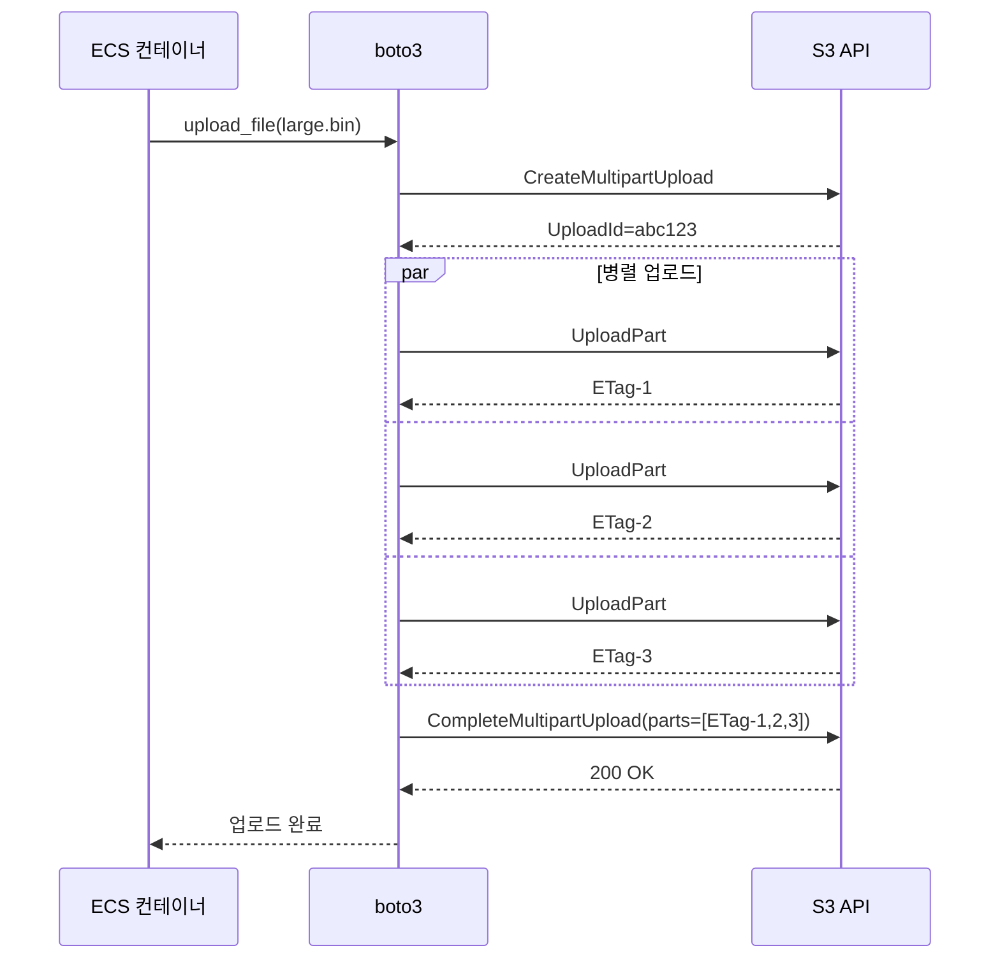

# ALB → ECS → S3 요청 흐름 (DNS부터 S3 업로드까지)

브라우저에서 `https://api.example.com/upload`로 파일을 던지면 그 패킷이 ECS 컨테이너에 닿고, 컨테이너가 S3에 putObject를 호출하기까지 어떤 일이 벌어지는지 6단계로 끊어서 본다. 단계마다 실제 운영하면서 밟았던 지뢰를 끼워 넣어 두었다.

전체 흐름은 이렇다.

```
  사용자 브라우저
        |
        |  (1) Route 53 조회 → api.example.com → ALB DNS 이름 → 다중 A 레코드
        |
        v
    인터넷
        |
        |  (2) TCP/443 패킷이 ALB Public IP로
        |
        v
   [Internet Gateway]
        |
        |  (3) Public Subnet의 ENI(ALB)로 라우팅
        |
        v
   [ALB — 퍼블릭 서브넷, AZ-a / AZ-c]
        |
        |  (4) 리스너 규칙 평가 → 매칭 target group 선택
        |
        v
   [ECS Task ENI — 프라이빗 서브넷, awsvpc 모드]
        |
        |  (5) 컨테이너가 요청 처리 → multipart upload 시작
        |
        v
   [S3 — putObject 아웃바운드]
        (6) NAT Gateway 경로 또는 S3 Gateway Endpoint 경로 중 하나
```

이 그림은 정상적인 경로다. 실무에서 패킷이 막히면 (1)~(6) 중 어느 단계인지 좁히는 게 디버깅의 절반이다.

---

## STEP 1. DNS 조회 — `api.example.com`에서 ALB IP를 얻기까지

### Route 53 hosted zone에서 일어나는 일

브라우저가 `api.example.com`을 입력받으면 로컬 리졸버 → ISP DNS → 권한 있는 네임서버 순으로 거슬러 올라간다. 도메인이 Route 53 hosted zone에 등록되어 있다면 권한 네임서버는 AWS의 `ns-XXX.awsdns-XX.com` 같은 4개 NS다. 등록자(레지스트라)의 NS 설정이 Route 53 NS를 가리키지 않으면 hosted zone에 아무리 레코드를 박아도 의미가 없다. 외주에서 받은 도메인을 Route 53에 옮길 때 NS 변경을 빠뜨려서 반나절 헤매는 사례가 흔하다.

ALB를 가리키는 레코드는 보통 alias 레코드로 잡는다.

```hcl
resource "aws_route53_record" "api" {
  zone_id = aws_route53_zone.main.zone_id
  name    = "api.example.com"
  type    = "A"

  alias {
    name                   = aws_lb.api.dns_name
    zone_id                = aws_lb.api.zone_id
    evaluate_target_health = true
  }
}
```

alias는 Route 53이 ALB의 DNS 이름(`internal-api-1234.ap-northeast-2.elb.amazonaws.com`)을 조회 시점에 A 레코드 묶음으로 풀어준다. CNAME과 다르게 zone apex(`example.com` 같은 루트 도메인)에도 쓸 수 있고, 추가 조회 한 단계가 사라져 응답이 빠르다.

### ALB DNS는 왜 IP가 여러 개인가

ALB의 DNS 이름을 dig으로 찍어 보면 A 레코드가 보통 AZ 수만큼 나온다.

```bash
$ dig +short internal-api-1234.ap-northeast-2.elb.amazonaws.com
10.0.11.42
10.0.12.118
```

ALB는 각 가용 영역마다 자체 ENI를 하나씩 들고 있다. 클라이언트는 그중 하나의 IP로 TCP 연결을 맺는다. 어느 IP에 연결되든 같은 리스너 규칙이 평가되니까 동작은 동일하다.

여기서 자주 밟는 지뢰가 TTL이다. ALB의 DNS TTL은 60초다. 스케일링이나 AZ 장애로 ALB가 새 ENI를 띄우면 60초 안에 클라이언트 캐시가 갈린다. 그런데 일부 SDK나 JVM 기본값은 TTL을 무시하고 무한 캐시한다(JVM의 `networkaddress.cache.ttl`이 기본 -1이라 영원히 캐싱). ALB IP가 바뀐 뒤에도 옛 IP로 계속 때리다가 `connection refused`나 타임아웃이 난다. JVM 기반 클라이언트는 반드시 TTL을 30~60초로 명시해야 한다.

```bash
# JVM 옵션
-Dsun.net.inetaddr.ttl=60
-Dsun.net.inetaddr.negative.ttl=10
```

### 클라이언트 입장에서 본 응답 흐름

```
브라우저 ─┐
          │ api.example.com A?
          v
   로컬 리졸버 (OS)
          │ 캐시 miss
          v
     ISP DNS
          │ 권한 네임서버 위임 추적
          v
   Route 53 NS
          │ alias 풀이 → ALB의 A 레코드 세트
          v
   10.0.11.42, 10.0.12.118 반환
```

DNS 응답이 돌아오면 브라우저는 그중 하나의 IP로 TCP SYN을 보낸다. ALB가 public-facing이라면 이 IP는 퍼블릭 IP다. 인터넷 라우팅이 시작된다.

---

## STEP 2. 인터넷 → Internet Gateway

### IGW가 하는 일

Internet Gateway는 흔히 "VPC를 인터넷에 연결하는 장치"라고 설명되지만 실제로는 두 가지를 한다.

1. VPC로 들어오는 패킷을 받아 라우팅 테이블을 따라 서브넷으로 전달
2. 퍼블릭 IP를 가진 ENI에 대해 1:1 NAT를 수행 — 외부에서 들어오는 패킷의 destination을 ENI의 프라이빗 IP로 바꾸고, 나가는 패킷의 source를 퍼블릭 IP로 바꾼다

ALB의 Public-facing 모드는 각 ENI가 EIP나 AWS가 할당한 퍼블릭 IP를 가진다. 외부에서 보면 ALB의 IP는 퍼블릭이지만 ENI 자체는 서브넷의 프라이빗 IP(`10.0.11.42`)를 들고 있다. IGW가 둘을 매핑한다.

### 라우팅 테이블의 0.0.0.0/0

퍼블릭 서브넷이 "퍼블릭"인 이유는 라우팅 테이블에 IGW가 박혀 있어서다.

```hcl
resource "aws_route_table" "public" {
  vpc_id = aws_vpc.main.id

  route {
    cidr_block = "0.0.0.0/0"
    gateway_id = aws_internet_gateway.main.id
  }
}

resource "aws_route_table_association" "public_a" {
  subnet_id      = aws_subnet.public_a.id
  route_table_id = aws_route_table.public.id
}
```

서브넷 자체에 "public"이라는 속성이 있는 게 아니라, 그 서브넷이 연결된 라우팅 테이블에 IGW로 향하는 0.0.0.0/0이 있으면 퍼블릭이 된다. 똑같은 CIDR 블록을 잡아 놓고 라우팅만 NAT GW로 바꾸면 프라이빗 서브넷이 된다.

### 자주 밟는 지뢰: 인바운드는 IGW가 받지만 응답이 못 나가는 경우

새로 만든 ALB가 외부에서 안 닿을 때 점검 순서는 이렇다.

1. ALB가 "internet-facing"으로 만들어졌는지 (internal과 헷갈리는 경우가 많다)
2. ALB가 속한 서브넷의 라우팅 테이블에 `0.0.0.0/0 → igw-xxxx`가 있는지
3. ALB ENI의 시큐리티 그룹 인바운드에 443/80이 열려 있는지
4. 서브넷의 NACL 인바운드/아웃바운드가 ephemeral port(1024-65535)까지 열려 있는지

NACL은 stateless라 응답 트래픽도 별도 규칙이 필요하다. NACL 인바운드만 443 열고 아웃바운드 ephemeral을 막아 두면 인바운드 SYN은 들어오는데 ALB가 SYN-ACK을 못 보내서 TCP 핸드셰이크가 안 끝난다. 패킷 캡처를 떠 보면 SYN만 잡히고 응답이 없다.

---

## STEP 3. IGW → 퍼블릭 서브넷 (ALB가 사는 곳)

### ALB는 ENI 모음일 뿐이다

ALB는 추상적인 리소스라기보다 가용 영역마다 하나씩 띄워진 ENI들의 묶음에 가깝다. ALB를 만들 때 "subnets"에 최소 2개 AZ의 서브넷을 지정해야 하는 이유가 이거다. 각 서브넷마다 ENI가 하나 생기고, IGW는 그 ENI로 패킷을 전달한다.

```hcl
resource "aws_lb" "api" {
  name               = "api-alb"
  internal           = false
  load_balancer_type = "application"
  security_groups    = [aws_security_group.alb.id]
  subnets            = [
    aws_subnet.public_a.id,
    aws_subnet.public_c.id,
  ]
}
```

여기서 `internal = false`면 internet-facing ALB가 만들어진다. `true`면 ENI에 퍼블릭 IP가 안 붙는다.

### 시큐리티 그룹: ALB 입구

ALB 자체에 붙은 SG는 외부에서 ALB로 들어오는 트래픽을 통제한다.

```hcl
resource "aws_security_group" "alb" {
  name   = "api-alb-sg"
  vpc_id = aws_vpc.main.id

  ingress {
    from_port   = 443
    to_port     = 443
    protocol    = "tcp"
    cidr_blocks = ["0.0.0.0/0"]
  }

  ingress {
    from_port   = 80
    to_port     = 80
    protocol    = "tcp"
    cidr_blocks = ["0.0.0.0/0"]
  }

  egress {
    from_port   = 0
    to_port     = 0
    protocol    = "-1"
    cidr_blocks = ["0.0.0.0/0"]
  }
}
```

ALB SG의 아웃바운드는 ECS Task SG로 가는 트래픽을 허용해야 한다. 기본값(`0.0.0.0/0` 전체 허용)이면 문제 없지만 보안 강화를 위해 아웃바운드를 좁혀 둔 환경에서는 누락되기 쉽다.

### NACL이 한 번 더 본다

패킷은 ALB ENI에 닿기 전에 서브넷의 NACL을 통과한다. SG는 stateful, NACL은 stateless. SG가 ENI 단위라면 NACL은 서브넷 단위다.

평가 순서는 패킷이 들어올 때 기준으로 이렇다.

```
인터넷에서 들어오는 패킷
    │
    v
[서브넷 NACL 인바운드 규칙]   ← stateless, 번호 순서대로 첫 매칭 적용
    │
    v
[ALB ENI의 SG 인바운드 규칙]  ← stateful, 한 번 허용되면 응답도 자동 허용
    │
    v
   ALB
    │  (응답 SYN-ACK)
    v
[ALB ENI SG 아웃바운드]       ← SG는 응답을 자동 허용
    │
    v
[서브넷 NACL 아웃바운드]      ← stateless라 응답도 별도 허용 필요
    │
    v
인터넷
```

NACL은 기본값이 all allow다. 직접 좁혀 둔 적이 없으면 신경 쓸 일이 적은데, 보안팀이 컴플라이언스 요구로 좁혀 놓은 환경에서 트러블슈팅이 어려워진다.

---

## STEP 4. ALB가 리스너 규칙을 평가한다

### 리스너와 규칙

ALB는 포트별로 리스너를 만든다. HTTPS면 443, HTTP면 80. 리스너 안에는 규칙(rule)이 우선순위 순서대로 정렬되어 있다. 평가는 number 작은 것부터, 첫 매칭에서 멈춘다.

```hcl
resource "aws_lb_listener" "https" {
  load_balancer_arn = aws_lb.api.arn
  port              = 443
  protocol          = "HTTPS"
  ssl_policy        = "ELBSecurityPolicy-TLS13-1-2-2021-06"
  certificate_arn   = aws_acm_certificate.api.arn

  default_action {
    type             = "forward"
    target_group_arn = aws_lb_target_group.api.arn
  }
}

resource "aws_lb_listener_rule" "upload" {
  listener_arn = aws_lb_listener.https.arn
  priority     = 100

  action {
    type             = "forward"
    target_group_arn = aws_lb_target_group.upload.arn
  }

  condition {
    path_pattern {
      values = ["/upload", "/upload/*"]
    }
  }

  condition {
    host_header {
      values = ["api.example.com"]
    }
  }
}

resource "aws_lb_listener_rule" "admin" {
  listener_arn = aws_lb_listener.https.arn
  priority     = 50

  action {
    type             = "forward"
    target_group_arn = aws_lb_target_group.admin.arn
  }

  condition {
    http_header {
      http_header_name = "X-Admin-Token"
      values           = ["*"]
    }
  }
}
```

위 설정에서 `/upload` 경로 요청이 오면 priority 50의 admin 규칙은 헤더 미스매치라 패스, priority 100의 upload 규칙이 매칭되어 upload target group으로 forward된다. 어느 규칙에도 안 걸리면 default action으로 떨어진다.

### 평가 가능한 조건 종류

ALB가 매칭할 수 있는 건 host header, path pattern, HTTP header, HTTP method, query string, source IP다. 같은 규칙 내의 조건은 AND, values 배열은 OR로 묶인다. 정규식은 못 쓰고 와일드카드(`*`, `?`)만 가능하다는 점이 가끔 발목을 잡는다. 복잡한 라우팅은 ALB 단에서 풀려 하지 말고 애플리케이션 내부에서 처리하는 게 낫다.

### 우선순위 충돌

priority가 같은 규칙은 만들 수 없다. 다만 path는 같은데 host만 다른 규칙이 우선순위가 비슷한 경우 의도와 다르게 매칭되는 경우가 있다. 운영 중에 새 규칙을 끼워 넣을 때 우선순위를 10단위로 띄워 두면 사이에 끼워 넣기 쉽다(50, 100, 150...).

### Sticky session

업로드처럼 상태를 가진 요청이 같은 컨테이너에 가야 하면 target group에 stickiness를 켠다.

```hcl
resource "aws_lb_target_group" "upload" {
  name        = "upload-tg"
  port        = 8080
  protocol    = "HTTP"
  vpc_id      = aws_vpc.main.id
  target_type = "ip"  # awsvpc 모드 ECS는 ip 타입

  health_check {
    path                = "/health"
    interval            = 30
    timeout             = 5
    healthy_threshold   = 2
    unhealthy_threshold = 3
    matcher             = "200"
  }

  stickiness {
    type            = "lb_cookie"
    cookie_duration = 3600
    enabled         = true
  }
}
```

stickiness가 켜져 있으면 ALB가 `AWSALB` 쿠키를 심어서 같은 컨테이너로 라우팅한다. 단, 컨테이너가 죽거나 deregister되면 쿠키와 무관하게 다른 컨테이너로 간다. 멱등하지 않은 multipart upload는 클라이언트가 처음부터 다시 보내야 한다. 이 케이스를 무시하고 sticky만 믿었다가 ECS 롤링 배포 중 업로드가 깨지는 일이 생긴다.

### Target group 헬스체크

ALB는 30초마다(설정 가능) target group의 모든 타겟에 헬스체크를 날린다. 위 설정이면 `/health`에 200을 두 번 연속 받아야 healthy로 본다. unhealthy로 떨어지면 라우팅에서 제외된다.

운영하면서 가장 자주 보는 헬스체크 사고는 다음 셋이다.

첫째, 헬스체크 경로가 DB나 외부 서비스에 의존한다. DB가 잠깐 느려지면 헬스체크가 타임아웃 나고, ALB가 모든 컨테이너를 unhealthy로 만들고, 결국 503이 떨어진다. `/health`는 의존성 없이 200만 뱉어야 한다. 의존성까지 보는 deep check는 `/health/ready` 같은 별도 엔드포인트로 분리하고 운영 알람용으로만 쓴다.

둘째, 헬스체크 SG 누락. ALB SG가 ECS Task SG의 헬스체크 포트로 outbound가 안 되거나, ECS Task SG가 ALB SG로부터 inbound를 안 받으면 헬스체크가 다 실패한다.

셋째, healthy_threshold가 너무 높다. 2회면 60초만에 healthy로 올라오는데, 5회로 잡으면 첫 배포 후 2분 30초간 모든 트래픽이 default action으로 떨어진다. 새 컨테이너가 띄워졌는데 503이 나면 우선 healthy_threshold부터 확인한다.

---

## STEP 5. ALB → 프라이빗 서브넷 (ECS Task ENI)

### awsvpc 네트워크 모드

ECS Fargate와 EC2 launch type 중 awsvpc 모드를 쓰면 task마다 자체 ENI가 생긴다. 이 ENI는 프라이빗 서브넷 안에 위치하며 고유한 프라이빗 IP를 가진다. 컨테이너는 host의 IP를 공유하지 않고 자기 IP로 통신한다.

bridge 모드라면 task가 EC2 host의 ENI를 공유하면서 동적 포트 매핑을 쓰지만, awsvpc는 task = ENI라서 컨테이너 → S3 같은 아웃바운드도 host와 무관하게 task ENI로 나간다. ECS Fargate는 사실상 awsvpc 모드만 지원한다.

```json
{
  "family": "upload-task",
  "networkMode": "awsvpc",
  "requiresCompatibilities": ["FARGATE"],
  "cpu": "512",
  "memory": "1024",
  "executionRoleArn": "arn:aws:iam::123456789012:role/ecsTaskExecutionRole",
  "taskRoleArn": "arn:aws:iam::123456789012:role/upload-task-role",
  "containerDefinitions": [
    {
      "name": "app",
      "image": "123456789012.dkr.ecr.ap-northeast-2.amazonaws.com/upload:1.2.3",
      "portMappings": [
        { "containerPort": 8080, "protocol": "tcp" }
      ],
      "essential": true
    }
  ]
}
```

`executionRoleArn`은 ECS agent가 ECR pull, CloudWatch Logs 쓰기에 쓰는 role이고, `taskRoleArn`은 컨테이너 프로세스가 AWS API를 호출할 때 쓰는 role이다. S3 putObject 권한은 taskRole에 붙는다. 이 둘을 혼동하면 컨테이너는 떠 있는데 S3 호출이 403으로 떨어진다.

### SG 체인 — ALB → ECS Task

ALB에서 ECS task로 트래픽이 가려면 두 SG가 짝을 이뤄야 한다.

```hcl
resource "aws_security_group" "ecs_task" {
  name   = "upload-task-sg"
  vpc_id = aws_vpc.main.id

  ingress {
    from_port       = 8080
    to_port         = 8080
    protocol        = "tcp"
    security_groups = [aws_security_group.alb.id]  # ALB SG에서만 인바운드 허용
  }

  egress {
    from_port   = 0
    to_port     = 0
    protocol    = "-1"
    cidr_blocks = ["0.0.0.0/0"]
  }
}
```

ingress의 `security_groups`로 ALB SG를 지정하면 ALB ENI에서 오는 트래픽만 허용된다. CIDR로 잡으면 같은 서브넷의 다른 자원도 접근 가능해진다. SG 간 참조가 보안상 더 좁다.

### ALB → Task 패킷 경로

ALB ENI는 퍼블릭 서브넷, Task ENI는 프라이빗 서브넷에 있다. 같은 VPC라서 IGW나 NAT GW를 거치지 않고 VPC 내부 라우팅으로 직접 간다. 패킷 흐름은 이렇다.

```
ALB ENI (10.0.11.42, public subnet)
    │
    │  ALB가 application 레이어에서 새 TCP 연결을 만든다 (HTTP/1.1 keepalive)
    │  source IP: ALB ENI의 프라이빗 IP
    │  destination IP: target group에 등록된 task ENI IP
    v
[ALB SG egress] → [NACL public outbound] → [VPC 라우팅] → [NACL private inbound]
    │
    v
[ECS Task SG ingress: 8080]
    │
    v
ECS Task ENI (10.0.21.55, private subnet) → 컨테이너 8080
```

여기서 중요한 건 source IP다. ALB는 클라이언트의 진짜 IP를 그대로 넘기지 않는다. 컨테이너 입장에서 보이는 source IP는 ALB ENI의 프라이빗 IP다. 클라이언트의 실제 IP는 `X-Forwarded-For` 헤더에 들어 있다.

```python
# Flask 예시
from flask import request

@app.route("/upload", methods=["POST"])
def upload():
    client_ip = request.headers.get("X-Forwarded-For", request.remote_addr)
    # client_ip가 콤마로 여러 개 들어올 수 있음 (proxy chain)
    real_ip = client_ip.split(",")[0].strip()
    ...
```

`X-Forwarded-For`는 신뢰할 수 있는 proxy를 거쳤을 때만 쓴다. ALB 앞에 CloudFront가 있고, 그 앞에 또 다른 LB가 있으면 헤더가 chain으로 쌓인다. 가장 왼쪽이 실제 클라이언트지만, 클라이언트가 임의로 헤더를 위조할 수 있으므로 신뢰 경계를 정확히 잡아야 한다.

### NACL/SG 평가 순서 정리

ALB → Task 한 방향 패킷의 평가 순서다.

```
[ALB ENI에서 패킷 송출]
    │
    v
[ALB SG egress 평가]            ← 허용되어야 나갈 수 있음
    │
    v
[퍼블릭 서브넷 NACL outbound]   ← stateless, 별도 평가
    │
    v
   VPC 내부 라우팅 (라우팅 테이블 local 엔트리)
    │
    v
[프라이빗 서브넷 NACL inbound]  ← stateless
    │
    v
[Task SG ingress 평가]           ← 8080 허용 여부
    │
    v
[Task ENI 수신]
```

응답 패킷(Task → ALB)은 반대 방향으로 같은 게이트를 다시 거친다. SG는 stateful이라 연결을 기억하지만 NACL은 stateless라 양방향 모두 명시적 허용이 필요하다.

---

## STEP 6. ECS가 S3에 파일 업로드

### 두 가지 경로 — NAT Gateway vs S3 Gateway Endpoint

프라이빗 서브넷의 ECS task가 `s3.ap-northeast-2.amazonaws.com`을 호출하려면 트래픽이 VPC 밖으로 나가야 한다. 두 가지 방법이 있다.

**경로 A: NAT Gateway**

```
Task ENI (private subnet)
    │
    │  destination: s3.ap-northeast-2.amazonaws.com (퍼블릭 IP)
    │  라우팅 테이블: 0.0.0.0/0 → nat-gw-xxxx
    v
NAT Gateway (퍼블릭 서브넷)
    │
    │  source IP를 NAT GW의 EIP로 NAT
    v
IGW
    │
    v
인터넷
    │
    v
S3 퍼블릭 엔드포인트
```

**경로 B: S3 Gateway VPC Endpoint**

```
Task ENI (private subnet)
    │
    │  destination: s3.ap-northeast-2.amazonaws.com
    │  라우팅 테이블: pl-XXXX (S3 prefix list) → vpce-xxxx
    v
S3 Gateway Endpoint (VPC 내부)
    │
    v
S3 (인터넷 거치지 않음)
```

차이는 셋이다.

첫째, 비용. NAT GW는 데이터 처리량당 0.045 USD/GB(서울 기준)를 받는다. S3에 1TB 올리면 NAT GW 처리비만 45 USD가 추가로 나온다. Gateway Endpoint는 무료다.

둘째, 보안 경계. NAT 경로는 인터넷을 거친다(TLS는 끝까지 유지되지만 경로상 퍼블릭). Gateway Endpoint는 AWS 내부망에만 머문다.

셋째, 라우팅 방식. Gateway Endpoint는 ENI를 만들지 않고 라우팅 테이블에 prefix list를 박는 방식이다. 그래서 `vpc_endpoint_type = "Gateway"`로 만들어진 건 S3와 DynamoDB뿐이다. 나머지는 모두 Interface Endpoint(ENI 기반, PrivateLink).

```hcl
resource "aws_vpc_endpoint" "s3" {
  vpc_id            = aws_vpc.main.id
  service_name      = "com.amazonaws.ap-northeast-2.s3"
  vpc_endpoint_type = "Gateway"
  route_table_ids   = [aws_route_table.private.id]

  policy = jsonencode({
    Version = "2012-10-17"
    Statement = [{
      Effect    = "Allow"
      Principal = "*"
      Action    = ["s3:PutObject", "s3:GetObject"]
      Resource = [
        "arn:aws:s3:::upload-bucket",
        "arn:aws:s3:::upload-bucket/*"
      ]
    }]
  })
}
```

`route_table_ids`에 등록한 라우팅 테이블에 S3 prefix list 라우트가 자동으로 박힌다. 이 라우팅 테이블에 연결된 서브넷의 트래픽 중 S3로 가는 것만 Endpoint를 타고, 나머지는 기존 0.0.0.0/0(NAT GW) 라우트를 탄다.

### VPC Endpoint policy의 함정

위 정책에서 `Resource`를 `*`로 두면 모든 S3 버킷에 접근 가능해진다. 보안팀이 데이터 유출 방지를 위해 좁혀 두는 게 흔하다. 그런데 여기서 빠지기 쉬운 함정이 있다.

ECR이 컨테이너 이미지를 저장하는 S3 버킷도 있다. ECS Fargate가 이미지를 pull할 때 내부적으로 S3에 접근한다. Endpoint policy에 사용자 버킷만 적어 두면 ECR pull이 실패하면서 task가 안 뜬다. CloudWatch Logs도 마찬가지로 내부적으로 S3 버킷을 쓴다.

ECR/Logs 관련 버킷까지 허용해야 한다.

```hcl
policy = jsonencode({
  Version = "2012-10-17"
  Statement = [
    {
      Effect    = "Allow"
      Principal = "*"
      Action    = ["s3:PutObject", "s3:GetObject"]
      Resource = [
        "arn:aws:s3:::upload-bucket",
        "arn:aws:s3:::upload-bucket/*"
      ]
    },
    {
      # ECR 이미지 레이어 저장소
      Effect    = "Allow"
      Principal = "*"
      Action    = ["s3:GetObject"]
      Resource = [
        "arn:aws:s3:::prod-ap-northeast-2-starport-layer-bucket/*"
      ]
    }
  ]
})
```

이 prod-ap-northeast-2-starport-layer-bucket은 AWS가 관리하는 ECR의 내부 버킷이다. 리전마다 이름이 다르다.

### IAM 권한 — Task Role의 putObject

컨테이너가 S3에 PutObject를 호출하려면 Task Role에 권한이 있어야 한다.

```json
{
  "Version": "2012-10-17",
  "Statement": [
    {
      "Effect": "Allow",
      "Action": [
        "s3:PutObject",
        "s3:PutObjectAcl",
        "s3:AbortMultipartUpload",
        "s3:ListBucketMultipartUploads",
        "s3:ListMultipartUploadParts"
      ],
      "Resource": [
        "arn:aws:s3:::upload-bucket/*"
      ]
    },
    {
      "Effect": "Allow",
      "Action": ["s3:ListBucket"],
      "Resource": "arn:aws:s3:::upload-bucket"
    }
  ]
}
```

PutObject만 있고 multipart 관련 액션이 없으면 큰 파일 업로드가 중간에 실패한다. AWS SDK는 5MB 이상 파일을 자동으로 multipart로 쪼개 올리는데, `CreateMultipartUpload`, `UploadPart`, `CompleteMultipartUpload`는 `s3:PutObject` 권한으로 커버되지만, 중간 실패 시 정리하는 `AbortMultipartUpload`는 별도 권한이다. 이게 없으면 실패한 업로드 잔재가 버킷에 쌓여 비용으로 돌아온다.

`Resource`도 자주 틀린다. `arn:aws:s3:::upload-bucket`은 버킷 자체에 대한 리소스고(`ListBucket`용), `arn:aws:s3:::upload-bucket/*`이 객체에 대한 리소스다(`PutObject`용). 둘을 헷갈리면 403이 떨어진다.

### Multipart upload — 컨테이너 안에서 일어나는 일

5MB 이상의 파일을 받았을 때 SDK가 multipart upload를 어떻게 진행하는지 보면 이렇다.

```python
import boto3
from botocore.config import Config

s3 = boto3.client(
    "s3",
    config=Config(
        retries={"max_attempts": 3, "mode": "adaptive"},
        max_pool_connections=20,
    ),
)

# 자동 multipart — managed upload
s3.upload_file(
    Filename="/tmp/large.bin",
    Bucket="upload-bucket",
    Key="uploads/2026/05/large.bin",
    Config=boto3.s3.transfer.TransferConfig(
        multipart_threshold=8 * 1024 * 1024,   # 8MB 넘으면 multipart
        multipart_chunksize=8 * 1024 * 1024,
        max_concurrency=10,
    ),
)
```

SDK 내부에서 일어나는 일을 다이어그램으로 보면:



여기서 알아 둘 점이 몇 가지 있다.

`UploadPart` 호출 하나하나가 별도의 TCP 연결이다(SDK는 connection pool로 재사용한다). 각각이 NAT GW나 S3 Endpoint를 거친다. 컨테이너의 SG egress가 일시적으로 다수의 outbound connection을 처리해야 한다는 뜻이다.

업로드 도중 컨테이너가 죽으면 진행 중이던 multipart는 버킷에 "incomplete multipart upload"로 남는다. S3 Lifecycle 정책으로 7일 후 자동 삭제하도록 걸어 두는 게 안전하다.

```hcl
resource "aws_s3_bucket_lifecycle_configuration" "upload" {
  bucket = aws_s3_bucket.upload.id

  rule {
    id     = "abort-incomplete-multipart"
    status = "Enabled"

    abort_incomplete_multipart_upload {
      days_after_initiation = 7
    }
  }
}
```

### S3로 향하는 패킷의 평가 순서

`PutObject` 한 번의 outbound 패킷 흐름은 이렇다(Gateway Endpoint 경로 기준).

```
컨테이너 프로세스
    │
    │  boto3 → HTTPS 연결 시도
    v
Task ENI (프라이빗 IP, 프라이빗 서브넷)
    │
    │  destination: s3.ap-northeast-2.amazonaws.com → DNS 조회
    │
    │  Endpoint 활성 상태라면 DNS가 VPC 내부 IP를 반환
    │
    v
[Task SG egress 평가]                    ← 443 허용 필요
    │
    v
[프라이빗 서브넷 NACL outbound]          ← stateless
    │
    v
[라우팅 테이블 평가]                      ← pl-XXXX → vpce-xxxx
    │
    v
S3 Gateway Endpoint
    │
    v
[Endpoint Policy 평가]                    ← 버킷 ARN 매칭 확인
    │
    v
[S3 Bucket Policy 평가]                   ← Principal/Action/Resource 확인
    │
    v
[IAM Task Role 권한 평가]                 ← s3:PutObject 권한 확인
    │
    v
S3 PutObject 실행
```

응답이 오면 stateful SG는 자동 허용하지만, NACL은 outbound 응답을 위해 ephemeral port(1024-65535) inbound 허용이 필요하다.

---

## 자주 마주치는 트러블슈팅 사례

### 사례 1: ALB로는 닿는데 컨테이너에서 502가 떨어진다

증상: 브라우저에서 요청하면 502 Bad Gateway. ALB CloudWatch 메트릭에서 `HTTPCode_ELB_502_Count`가 올라간다.

원인 후보:
1. ECS task가 healthy로 잡혀 있지만 실제로는 8080을 안 열고 있음 (헬스체크 경로와 실제 포트가 다른 경우)
2. 컨테이너가 응답을 보내는데 ALB가 keepalive 끊김을 처리 못 함 (컨테이너의 idle timeout이 ALB의 idle timeout(기본 60초)보다 짧으면 발생)
3. 컨테이너가 응답을 보내기 전에 OOM으로 죽음

확인 순서:
```bash
# 컨테이너에서 직접 healthcheck 호출
aws ecs execute-command --cluster prod --task <task-id> --container app \
  --interactive --command "/bin/sh"

# 컨테이너 내부에서
curl -v http://localhost:8080/health
```

컨테이너 안에서 200이 안 떨어지면 애플리케이션 문제다. 200이 떨어지는데 ALB가 502를 내면 keepalive timeout이 의심된다. 애플리케이션의 idle timeout을 ALB(60초)보다 길게(예: 75초) 잡는 게 정석이다.

### 사례 2: 새 환경에서 S3 putObject가 403

증상: 컨테이너 로그에 `An error occurred (AccessDenied) when calling the PutObject operation`.

확인 순서:
1. Task Role의 정책 — `aws iam list-attached-role-policies --role-name upload-task-role`
2. 정책 내용에서 `Resource`의 ARN이 실제 버킷과 일치하는지 (`upload-bucket-prod` vs `upload-bucket-dev` 같은 오타)
3. 버킷 정책에 deny가 있는지 — `aws s3api get-bucket-policy --bucket upload-bucket`
4. S3 Gateway Endpoint policy가 좁혀져 있어 차단되는지
5. SSE-KMS 암호화 버킷이면 `kms:GenerateDataKey` 권한도 필요

403이 떨어지면 어디서 막혔는지 메시지로는 거의 알 수 없다. CloudTrail에서 PutObject 이벤트를 찾으면 정확한 deny 원인이 나온다.

```bash
aws cloudtrail lookup-events \
  --lookup-attributes AttributeKey=EventName,AttributeValue=PutObject \
  --max-results 10
```

### 사례 3: 프라이빗 서브넷에서 인터넷이 안 됨

증상: 컨테이너가 외부 API(예: Stripe, 외부 OAuth)에 못 닿는다. S3는 잘 됨.

원인: S3는 Gateway Endpoint로 빠지는데 NAT GW가 없거나 라우팅 테이블에 0.0.0.0/0이 없는 경우다. Endpoint가 잘 동작해서 S3는 되니까 "네트워크가 되는 줄" 착각한다.

확인:
```bash
aws ec2 describe-route-tables \
  --filters "Name=association.subnet-id,Values=subnet-xxxx" \
  --query 'RouteTables[].Routes'
```

여기서 `0.0.0.0/0`에 대한 라우팅이 NAT GW를 가리키지 않으면 인터넷이 안 된다. `pl-xxxx → vpce-xxxx`만 있고 `0.0.0.0/0`이 없으면 S3 외에는 다 막힌다.

### 사례 4: ALB Listener Rule 매칭이 의도와 다름

증상: `/api/admin`은 admin target group으로 보내려 했는데 default action으로 떨어진다.

원인: path_pattern에서 `/api/admin`만 적고 `/api/admin/*`을 안 적었다. ALB는 정확히 매칭이라 `/api/admin/users` 같은 하위 경로가 안 잡힌다.

```hcl
condition {
  path_pattern {
    values = ["/api/admin", "/api/admin/*"]  # 둘 다 필요
  }
}
```

### 사례 5: VPC Endpoint가 동작하지 않는다

증상: Gateway Endpoint를 만들었는데 컨테이너에서 S3 호출이 여전히 NAT GW를 탄다(VPC Flow Logs에서 확인).

원인 후보:
1. Endpoint의 `route_table_ids`에 컨테이너 서브넷이 연결된 라우팅 테이블이 빠져 있음
2. Endpoint policy가 너무 좁아 deny되고 SDK가 IAM은 통과한 줄 알고 NAT로 fallback하는 게 아니라 그냥 403 (이 경우는 별도 사고)
3. S3 SDK가 다른 리전 엔드포인트를 호출하는 경우 (`us-east-1` 리전의 버킷을 서울 리전 Endpoint로 가려 하면 안 됨)

확인:
```bash
aws ec2 describe-vpc-endpoints --vpc-endpoint-ids vpce-xxxx \
  --query 'VpcEndpoints[].[RouteTableIds,State,PolicyDocument]'
```

route_table_ids가 비어 있거나 의도한 라우팅 테이블이 빠져 있으면 prefix list 라우트가 안 박힌다.

---

## 전체 평가 순서 한눈에 보기

요청 한 번이 들어와 응답이 나가기까지 평가되는 게이트를 다 적으면 이렇다.

**인바운드 (클라이언트 → 컨테이너):**

```
[1] DNS — Route 53 hosted zone alias → ALB A 레코드
[2] IGW — VPC route 0.0.0.0/0 → igw-xxxx
[3] Public Subnet NACL inbound — 443/80, ephemeral
[4] ALB SG inbound — 443/80
[5] ALB Listener — TLS termination + 인증서 매칭
[6] ALB Listener Rule — priority 순 평가
[7] Target Group — healthy target 선택 (stickiness 적용)
[8] ALB SG egress
[9] Public Subnet NACL outbound
[10] VPC 내부 라우팅 (local)
[11] Private Subnet NACL inbound
[12] Task SG inbound — 8080 from ALB SG
[13] 컨테이너 처리
```

**아웃바운드 (컨테이너 → S3):**

```
[14] Task SG egress — 443 to anywhere or S3 prefix list
[15] Private Subnet NACL outbound
[16] 라우팅 테이블 — pl-XXXX → vpce-xxxx (Endpoint 경로) 또는 0.0.0.0/0 → nat-xxxx
[17] (NAT 경로일 때) NAT GW EIP로 source NAT
[18] (NAT 경로일 때) IGW 통과
[19] S3 Endpoint Policy 평가
[20] S3 Bucket Policy 평가
[21] Task IAM Role 권한 평가
[22] S3 PutObject 실행
```

응답은 SG가 stateful이라 자동 허용되지만, NACL은 stateless라 모든 게이트의 반대 방향도 명시적으로 열려 있어야 한다. 패킷이 막혔을 때 위 22단계 중 어디서 막혔는지 좁히는 게 디버깅이다. 보통 5분 안에 막힌 단계를 찾고, 나머지 시간은 정확한 원인 파악과 수정에 쓴다.

---

## 참고할 운영 팁

VPC Flow Logs는 매번 켜 두는 게 좋다. 패킷이 막혔을 때 어느 ENI에서 ACCEPT/REJECT가 떨어졌는지가 로그에 남아 디버깅 시간을 크게 줄인다.

```hcl
resource "aws_flow_log" "vpc" {
  log_destination      = aws_cloudwatch_log_group.flow.arn
  log_destination_type = "cloud-watch-logs"
  traffic_type         = "ALL"
  vpc_id               = aws_vpc.main.id
  iam_role_arn         = aws_iam_role.flow_log.arn
}
```

ALB Access Log는 S3에 적재한다. 클라이언트 IP, 요청 시각, 응답 코드, target group 처리 시간이 다 들어 있어 ALB 단의 문제와 컨테이너 단의 문제를 가를 때 가장 빠른 근거가 된다. Athena로 쿼리하면 5분 안에 502가 어느 target에서 났는지 찾는다.

ECS Service의 deployment_circuit_breaker도 켜 둔다. 헬스체크에 실패하는 새 task가 계속 뜨다 죽는 무한 루프를 막아 준다.

```hcl
resource "aws_ecs_service" "upload" {
  # ...
  deployment_circuit_breaker {
    enable   = true
    rollback = true
  }
}
```

이 전체 흐름은 처음 설계할 때보다 운영하면서 더 자주 마주친다. 새 환경을 만들 때마다 22단계 게이트 중 한두 개가 빠지고, 빠진 게이트가 어디인지 찾는 데 한 시간씩 쓴다. 패턴이 머리에 박히면 SG 누락인지 라우팅인지 IAM인지 증상만 보고 30초 안에 좁혀진다.
