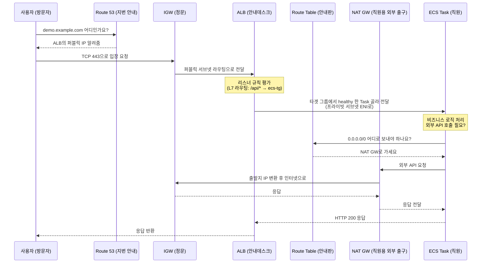

# AWS 네트워크 구성요소를 건물 비유로 이해하기

처음 VPC를 만들 때 가장 헷갈리는 건 구성요소가 한두 개가 아니라는 점이다. VPC, 서브넷, 라우팅 테이블, IGW, ALB, ECS… 이름은 들어봤는데 뭐가 뭐를 감싸고 뭐가 뭐 위에 얹히는지 그림이 잘 안 잡힌다. 신입한테 설명할 때 자주 쓰는 비유가 "VPC = 건물"이다. 이 글은 그 비유를 처음부터 끝까지 한 번 깔아 두고, 비유가 어디서 깨지는지까지 같이 본다. 비유는 도입용이지 설계 도구가 아니다.

## 한눈에 보는 매핑

| 건물 비유 | AWS 구성요소 | 실제로 하는 일 |
|---|---|---|
| 건물 전체 | VPC | 격리된 가상 네트워크 한 채. CIDR 대역 보유 |
| 건물 안의 방 | Subnet | VPC CIDR을 쪼갠 IP 블록. AZ 한 곳에 묶임 |
| 방마다 붙은 길 안내판 | Route Table | "이 목적지면 저 게이트웨이로 나가라" 규칙표 |
| 건물 정문 | Internet Gateway (IGW) | VPC를 인터넷에 연결하는 통로. 양방향 |
| 방 안 안내데스크 | ALB | 외부에서 온 요청을 어떤 직원에게 보낼지 정함 |
| 일하는 직원 | ECS Task / 컨테이너 | 실제 요청을 처리하는 워크로드 |
| 방문 출입 카드키 | Security Group | ENI 단위 스테이트풀 방화벽 |
| 복도 검문소 | NACL | 서브넷 단위 스테이트리스 방화벽 |
| 건물 동(棟) | Availability Zone (AZ) | 물리적으로 분리된 데이터센터 그룹 |

이 표만 외워도 신입 첫날은 넘어간다. 다만 비유의 각 칸이 실제 동작과 어긋나는 지점이 한두 개씩 있으니, 아래에서 하나씩 본다.

## VPC = 건물 전체

VPC는 AWS 안에 격리되어 있는 가상 네트워크 한 채다. 다른 계정의 VPC와 IP 대역이 겹쳐도 충돌하지 않는다. 건물 안에서 어떤 일이 일어나든 옆 건물에서는 안 보인다. CIDR을 정하는 순간 그 건물의 주소 체계가 결정된다.

비유의 한계가 하나 있다. 건물은 한 번 지으면 평수를 늘리기 까다롭지만, VPC는 Secondary CIDR을 추가해 IP 대역을 확장할 수 있다. 다만 Primary CIDR은 생성 후 변경 불가다. 처음 그릴 때 `10.0.0.0/16`처럼 넉넉하게 잡아라. `10.0.0.0/24` 같은 좁은 대역으로 시작하면 6개월 뒤에 후회한다.

## 서브넷 = 건물 안의 각 방

서브넷은 VPC CIDR을 더 작게 쪼갠 IP 블록이고, 반드시 하나의 AZ에 묶인다. 한 방은 한 층에만 있는 셈이다. VPC가 리전 단위라면 서브넷은 AZ 단위다.

여기서 비유가 가장 크게 어긋난다. **서브넷 자체는 실제로는 격리된 방이 아니다.** 같은 VPC 안의 서브넷끼리는 기본적으로 서로 통신할 수 있다(VPC의 Local 라우트가 항상 살아 있다). 격리를 만드는 건 서브넷이라는 경계 자체가 아니라 그 서브넷에 붙은 라우팅 테이블과 보안 그룹이다.

이게 왜 중요하냐면, 신입이 "프라이빗 서브넷에 두면 외부 접근이 막힌다"고 잘못 외우는 경우가 많다. 막아 주는 건 서브넷이 아니라 그 서브넷의 라우팅 테이블에 `0.0.0.0/0 → IGW` 라우트가 없다는 사실이다. 라우팅 테이블이 잘못 붙으면 "프라이빗"이라는 이름의 서브넷도 그냥 퍼블릭이 된다.

서브넷의 퍼블릭/프라이빗 구분은 AWS가 부여하는 속성이 아니라, 라우팅 테이블의 라우트가 결정하는 결과적 분류일 뿐이다.

## 라우팅 테이블 = 방마다 붙은 길 안내판

라우팅 테이블은 서브넷에서 패킷이 나갈 때 어느 게이트웨이로 보낼지를 결정한다. 방문에 "엘리베이터는 좌측, 비상구는 우측" 같은 안내판이 붙어 있는 셈이다.

```
Destination          Target
10.0.0.0/16         local
0.0.0.0/0           igw-xxx     ← 퍼블릭 서브넷의 라우트
```

`10.0.0.0/16 → local`은 같은 VPC 내부로 가는 트래픽을 의미한다. 이 라우트는 자동으로 들어가고 삭제할 수 없다. `0.0.0.0/0`(기본 라우트)이 어느 타겟을 가리키느냐가 그 서브넷의 성격을 결정한다.

- IGW를 가리키면 → 퍼블릭 서브넷
- NAT Gateway를 가리키면 → 프라이빗 서브넷(아웃바운드만 인터넷)
- 어디도 가리키지 않으면 → 격리된 서브넷(외부 단절)

비유의 한계: 안내판은 사람이 한 번 읽고 끝나지만, 라우팅 테이블은 매 패킷마다 평가된다. 그리고 더 구체적인(긴 prefix) 라우트가 우선한다. `10.1.0.0/16 → tgw-xxx`이 `10.0.0.0/8 → igw-xxx`보다 우선한다는 뜻이다. 이걸 모르면 Transit Gateway 도입 후 트래픽이 엉뚱한 곳으로 빠진다.

## IGW = 건물 정문

Internet Gateway는 VPC를 인터넷에 연결하는 통로다. VPC당 하나만 붙일 수 있다. 정문이라는 비유가 맞긴 한데, 두 가지 결정적 차이가 있다.

**첫째, IGW는 단방향 정문이 아니라 양방향 통로다.** 사용자가 들어올 수도, 안에 있는 리소스가 나갈 수도 있다. 그리고 NAT 변환을 하지 않는다. IGW를 거치는 리소스는 본인의 퍼블릭 IP(또는 EIP)를 갖고 있어야 한다. EC2가 프라이빗 IP만 가진 채로 IGW가 붙은 서브넷에 있으면 인터넷 통신이 안 된다. 비유로 따지면 "정문은 열려 있는데 내가 외부에서 식별 가능한 명함이 없는 상태"다.

**둘째, IGW는 "붙인다고" 트래픽이 흐르지 않는다.** VPC에 IGW를 attach해도 라우팅 테이블에 `0.0.0.0/0 → igw-xxx` 라우트가 없으면 아무도 못 쓴다. 정문이 있어도 안내판이 그 문을 가리키지 않으면 그쪽으로 가는 사람이 없는 셈이다.

프라이빗 서브넷에서 외부로 나가야 하는 경우(예: ECS Task가 외부 API 호출)에는 IGW가 아니라 NAT Gateway를 거친다. NAT GW가 출발지 IP를 자신의 퍼블릭 IP로 바꿔서 IGW로 내보낸다. 들어오는 트래픽은 받지 않는다(아웃바운드 전용).

## ALB = 방 안의 안내데스크

Application Load Balancer는 외부에서 들어온 HTTP/HTTPS 요청을 받아서 뒤에 있는 ECS Task, EC2, Lambda 등으로 분배한다. 안내데스크에 비유하면 직관적이다. 방문자가 "결제팀 누구를 만나러 왔어요"라고 하면 안내데스크가 해당 직원에게 연결해 준다.

비유에 안 잡히는 ALB의 실제 역할이 몇 개 있다.

**L7 라우팅.** 단순 분배가 아니라 HTTP 경로(`/api/*`), 호스트 헤더(`api.example.com`), 메서드, 쿼리스트링까지 보고 어디로 보낼지 결정한다. 안내데스크가 방문자의 명찰만 보는 게 아니라 가져온 서류 내용까지 읽어 보는 셈이다.

**타겟 그룹.** ALB는 직접 인스턴스를 가리키지 않고 타겟 그룹을 가리킨다. 타겟 그룹 안에 ECS Task, EC2 등이 등록되고, 그 안에서 헬스체크가 돈다. 안내데스크가 "결제팀"이라는 직군을 알고 있고, 그 직군 안에서 누가 출근했는지(헬스체크 통과)만 확인하고 연결하는 구조다.

**헬스체크.** ALB는 주기적으로 타겟에 HTTP 요청을 보내서 살아 있는지 확인한다. 헬스체크에 실패하면 트래픽을 그쪽으로 안 보낸다. 신입이 가장 많이 디버깅하는 게 "헬스체크 경로가 200이 아니라 302를 반환해서 unhealthy로 잡힘" 같은 케이스다.

**ALB는 최소 두 개의 AZ에 걸쳐야 한다.** 단일 AZ에 ALB는 만들 수 없다. 그래서 ALB용 퍼블릭 서브넷은 최소 두 개를 준비해야 한다. 안내데스크가 한 건물 동에만 있으면 그 동이 정전될 때 전체가 끊기는 걸 막기 위한 구조다.

## ECS 컨테이너 = 일하는 직원

ECS Task의 컨테이너가 실제 비즈니스 로직을 처리한다. 안내데스크가 분배한 요청을 받아서 처리하는 직원이다.

비유로 잘 안 잡히는 부분이 둘 있다.

**Task 단위로 묶인다.** 컨테이너 한 개가 한 명의 직원이라기보다, Task 한 개가 "한 팀"에 가깝다. Task definition에 컨테이너를 여러 개 정의하면 사이드카(예: 로그 수집, 프록시)가 같은 Task에 들어간다. 같은 Task 안의 컨테이너는 같은 ENI를 공유한다(awsvpc 모드 기준).

**ENI를 공유한다.** awsvpc 네트워크 모드에서 Task 하나는 자기 전용 ENI를 받고 프라이빗 IP를 하나 갖는다. 컨테이너끼리는 `localhost`로 통신한다. 같은 Task 안의 컨테이너끼리 통신할 때 보안 그룹 룰을 추가할 필요가 없다. 이건 직원 비유로는 직관이 안 잡힌다. "같은 방의 직원끼리 인터폰 없이 그냥 말로 한다" 정도가 가까운 비유다.

**ECS 컨테이너가 일하는 방은 보통 프라이빗 서브넷이다.** 외부에서 직접 닿지 않는다. ALB(안내데스크)가 있는 퍼블릭 서브넷이 외부와의 유일한 접점이고, ALB가 프라이빗 서브넷의 Task ENI로 트래픽을 넘긴다. 외부 API를 호출할 때는 NAT GW를 거친다.

## 비유에 없는 보안 계층

신입에게 건물 비유로 설명할 때 자주 빠지는 것들이다. 이게 빠지면 보안 사고가 난다.

### Security Group = 방문 카드키 (방문자별)

보안 그룹은 ENI 단위 스테이트풀 방화벽이다. "이 직원(ENI)에게 누가 어떤 포트로 들어올 수 있는지"를 정의한다. 카드키가 출입자별로 발급되는 것에 가깝다.

신입이 흔히 오해하는 지점:
- SG는 deny 룰이 없다. allow만 있고, 명시되지 않은 건 차단이다.
- 스테이트풀이라 응답 트래픽은 자동 허용된다. 인바운드 80 허용하면 응답을 위한 아웃바운드 룰을 따로 안 만들어도 된다.
- SG의 source/destination에 다른 SG를 지정할 수 있다. `ALB의 SG → ECS의 SG 인바운드 허용` 같은 식으로 IP 대신 SG ID로 연결하는 게 표준이다. 이걸 모르면 Auto Scaling으로 IP가 바뀔 때마다 SG를 수정해야 한다.

### NACL = 복도 검문소 (서브넷 입구)

NACL은 서브넷 단위 스테이트리스 방화벽이다. 서브넷 입구의 복도에서 들어가는 사람과 나가는 사람을 모두 검문하는 셈이다.

비유와 어긋나는 점:
- 스테이트리스다. 인바운드 허용했다고 응답이 자동으로 나가지 않는다. 아웃바운드 룰도 명시해야 한다. 보통 이걸 잊어버려서 "왜 응답이 안 돌아오지" 디버깅이 한 시간 날아간다.
- NACL은 deny 룰을 명시할 수 있다. SG와 다르다. 특정 IP를 차단할 때 쓴다.
- 운영 환경에서 NACL은 기본 allow 그대로 두고 SG로 모든 걸 통제하는 게 일반적이다. NACL을 건드리면 디버깅 비용이 급격히 올라간다.

### AZ = 건물 동(棟)

Availability Zone은 물리적으로 분리된 데이터센터 그룹이다. 같은 리전 안에서도 AZ가 다르면 다른 발전소, 다른 네트워크 회선을 쓴다. 한 동(棟)이 정전돼도 다른 동은 멀쩡한 구조다.

비유와 다른 점:
- 한 동(서브넷)이 통째로 다른 동에 있는 게 아니라, **서브넷마다 어느 AZ에 속할지 명시해야 한다.** VPC는 리전 전체에 깔리지만 서브넷은 AZ 하나에 묶인다. 멀티 AZ 구조를 만들고 싶으면 AZ별로 서브넷을 따로 만들어야 한다.
- AZ 이름(예: `ap-northeast-2a`)은 계정마다 매핑이 다를 수 있다. 내 계정의 `2a`와 다른 계정의 `2a`가 실제로는 같은 물리 AZ가 아닐 수 있다. AZ ID(`apne2-az1` 같은 형식)가 진짜 물리 AZ를 가리킨다.

## Terraform으로 한 채 짓기

위 비유에 나온 구성요소를 전부 한 번에 배치하는 미니 VPC다. AZ 두 개, 퍼블릭/프라이빗 서브넷 각 두 개, IGW, NAT GW, ALB, ECS Task까지 들어간다.

```hcl
# 변수
variable "region" {
  default = "ap-northeast-2"
}

variable "azs" {
  default = ["ap-northeast-2a", "ap-northeast-2c"]
}

# 건물 한 채
resource "aws_vpc" "main" {
  cidr_block           = "10.0.0.0/16"
  enable_dns_hostnames = true
  enable_dns_support   = true

  tags = { Name = "demo-vpc" }
}

# 정문
resource "aws_internet_gateway" "igw" {
  vpc_id = aws_vpc.main.id
  tags   = { Name = "demo-igw" }
}

# 방 (퍼블릭 서브넷 2개 — ALB용)
resource "aws_subnet" "public" {
  count                   = 2
  vpc_id                  = aws_vpc.main.id
  cidr_block              = "10.0.${count.index + 1}.0/24"
  availability_zone       = var.azs[count.index]
  map_public_ip_on_launch = true

  tags = { Name = "public-${var.azs[count.index]}" }
}

# 방 (프라이빗 서브넷 2개 — ECS Task용)
resource "aws_subnet" "private" {
  count             = 2
  vpc_id            = aws_vpc.main.id
  cidr_block        = "10.0.${count.index + 11}.0/24"
  availability_zone = var.azs[count.index]

  tags = { Name = "private-${var.azs[count.index]}" }
}

# 정문으로 나가는 NAT (프라이빗 → 인터넷 아웃바운드용)
resource "aws_eip" "nat" {
  domain = "vpc"
}

resource "aws_nat_gateway" "nat" {
  allocation_id = aws_eip.nat.id
  subnet_id     = aws_subnet.public[0].id  # NAT는 퍼블릭 서브넷에 둔다
  tags          = { Name = "demo-nat" }
}

# 퍼블릭 방의 안내판 (0.0.0.0/0 → IGW)
resource "aws_route_table" "public" {
  vpc_id = aws_vpc.main.id

  route {
    cidr_block = "0.0.0.0/0"
    gateway_id = aws_internet_gateway.igw.id
  }

  tags = { Name = "public-rt" }
}

resource "aws_route_table_association" "public" {
  count          = 2
  subnet_id      = aws_subnet.public[count.index].id
  route_table_id = aws_route_table.public.id
}

# 프라이빗 방의 안내판 (0.0.0.0/0 → NAT GW)
resource "aws_route_table" "private" {
  vpc_id = aws_vpc.main.id

  route {
    cidr_block     = "0.0.0.0/0"
    nat_gateway_id = aws_nat_gateway.nat.id
  }

  tags = { Name = "private-rt" }
}

resource "aws_route_table_association" "private" {
  count          = 2
  subnet_id      = aws_subnet.private[count.index].id
  route_table_id = aws_route_table.private.id
}

# 안내데스크용 카드키 (외부 → ALB)
resource "aws_security_group" "alb" {
  name   = "alb-sg"
  vpc_id = aws_vpc.main.id

  ingress {
    from_port   = 443
    to_port     = 443
    protocol    = "tcp"
    cidr_blocks = ["0.0.0.0/0"]
  }

  egress {
    from_port   = 0
    to_port     = 0
    protocol    = "-1"
    cidr_blocks = ["0.0.0.0/0"]
  }
}

# 직원용 카드키 (ALB → ECS Task만 허용)
resource "aws_security_group" "ecs" {
  name   = "ecs-sg"
  vpc_id = aws_vpc.main.id

  ingress {
    from_port       = 8080
    to_port         = 8080
    protocol        = "tcp"
    security_groups = [aws_security_group.alb.id]  # IP가 아니라 SG로 지정
  }

  egress {
    from_port   = 0
    to_port     = 0
    protocol    = "-1"
    cidr_blocks = ["0.0.0.0/0"]
  }
}

# 안내데스크 (ALB)
resource "aws_lb" "alb" {
  name               = "demo-alb"
  internal           = false
  load_balancer_type = "application"
  subnets            = aws_subnet.public[*].id  # 퍼블릭 서브넷에 배치
  security_groups    = [aws_security_group.alb.id]
}

resource "aws_lb_target_group" "ecs" {
  name        = "demo-ecs-tg"
  port        = 8080
  protocol    = "HTTP"
  target_type = "ip"  # awsvpc 모드는 ip 타겟 타입
  vpc_id      = aws_vpc.main.id

  health_check {
    path                = "/health"
    matcher             = "200"
    interval            = 30
    healthy_threshold   = 2
    unhealthy_threshold = 3
  }
}

resource "aws_lb_listener" "https" {
  load_balancer_arn = aws_lb.alb.arn
  port              = 443
  protocol          = "HTTPS"
  certificate_arn   = "arn:aws:acm:ap-northeast-2:123456789012:certificate/xxx"

  default_action {
    type             = "forward"
    target_group_arn = aws_lb_target_group.ecs.arn
  }
}

# 직원이 일하는 곳 (ECS Service — Task가 프라이빗 서브넷에 뜬다)
resource "aws_ecs_cluster" "main" {
  name = "demo-cluster"
}

resource "aws_ecs_service" "app" {
  name            = "demo-app"
  cluster         = aws_ecs_cluster.main.id
  task_definition = aws_ecs_task_definition.app.arn
  desired_count   = 2
  launch_type     = "FARGATE"

  network_configuration {
    subnets          = aws_subnet.private[*].id  # 프라이빗 서브넷에 배치
    security_groups  = [aws_security_group.ecs.id]
    assign_public_ip = false  # 외부에서 직접 접근 금지
  }

  load_balancer {
    target_group_arn = aws_lb_target_group.ecs.arn
    container_name   = "app"
    container_port   = 8080
  }
}

resource "aws_ecs_task_definition" "app" {
  family                   = "demo-app"
  network_mode             = "awsvpc"  # Task마다 ENI 받음
  requires_compatibilities = ["FARGATE"]
  cpu                      = "512"
  memory                   = "1024"

  container_definitions = jsonencode([{
    name      = "app"
    image     = "123456789012.dkr.ecr.ap-northeast-2.amazonaws.com/demo:latest"
    portMappings = [{ containerPort = 8080 }]
  }])
}
```

이 한 세트가 비유에 나온 "건물 한 채"의 실제 모습이다. `terraform apply`를 돌리면 안내데스크(ALB)부터 직원(ECS Task)까지 전부 한 번에 선다.

## 트래픽 흐름 — 비유와 실제 hop 병렬

사용자가 `https://demo.example.com/api/order`로 요청을 보내고 ECS Task가 응답하기까지의 흐름을, 비유와 실제 AWS 동작을 같이 본다.



비유로 다시 풀어 쓰면 이렇다.

1. 방문자가 건물 주소를 묻는다 → Route 53이 알려준다.
2. 방문자가 정문으로 들어온다 → IGW가 받아 퍼블릭 서브넷의 ALB ENI로 라우팅한다.
3. 안내데스크(ALB)가 가져온 서류(HTTP 경로/호스트)를 보고 어느 직원에게 보낼지 결정한다 → 리스너 규칙 평가.
4. 안내데스크가 직원에게 인터폰을 건다 → 타겟 그룹에서 healthy Task의 프라이빗 IP로 요청 전달.
5. 직원이 외부 자료가 필요해서 다른 건물에 전화한다 → Task가 외부 API 호출. 프라이빗 서브넷의 안내판은 외부 통화를 NAT GW로 보내라고 한다.
6. NAT GW가 직원의 내선번호를 자기 외부 번호로 바꿔서 정문으로 내보낸다 → SNAT.
7. 응답이 역순으로 돌아온다.

## 신입에게 설명할 때 주의할 비유 함정

비유는 빠르게 그림을 잡게 해 주지만, 잘못 외우면 운영에서 사고가 난다. 신입이 가장 자주 빠지는 함정들이다.

**"프라이빗 서브넷에 두면 안전하다"**

서브넷의 이름은 단지 라벨일 뿐이다. 격리를 만드는 건 라우팅 테이블이다. `0.0.0.0/0 → IGW` 라우트가 붙은 서브넷에 RDS를 두면 그 RDS는 인터넷에서 닿을 수 있는 상태가 된다. 이름이 `private-subnet`이어도 마찬가지다. 항상 라우팅 테이블의 실제 라우트를 확인해라.

**"보안 그룹을 풀면 통신이 된다"**

SG는 ENI 단위라 양쪽 모두 풀려야 한다. ALB SG에서 ECS SG로 나가는 룰은 자동 허용(스테이트풀)이지만, ECS SG가 ALB의 인바운드를 명시적으로 허용해야 한다. 한쪽만 풀고 안 된다고 며칠씩 뒤지는 케이스가 흔하다.

**"NAT GW가 없으면 외부 통신이 안 된다"**

프라이빗 서브넷의 ECS Task가 S3에 접근할 때 NAT GW를 거치면 트래픽 비용이 나온다. S3 Gateway Endpoint를 만들고 라우팅 테이블에 라우트를 추가하면 NAT를 우회해서 AWS 내부 네트워크로 간다. 비유로 따지면 "건물 내부 전용 통로"가 따로 있는 셈이다.

**"AZ는 같은 동에 있다"**

같은 리전이라도 AZ가 다르면 트래픽이 AZ 경계를 넘는다. 데이터 전송 비용이 발생하고 레이턴시도 늘어난다. ALB가 AZ-a의 Target에게 보내는 트래픽 vs AZ-c의 Target에게 보내는 트래픽은 비용이 다르다. Cross-AZ traffic은 운영 환경에서 청구서 살펴볼 때 자주 튀어나오는 항목이다.

**"ALB만 있으면 외부에서 접근 가능"**

ALB는 ENI를 가진다. 그 ENI에 SG가 붙어 있다. SG에서 인바운드 443을 안 열어 두면 외부에서 못 들어온다. ALB를 만들었다고 자동으로 외부에 노출되지 않는다. 그리고 ALB가 internal로 설정되어 있으면 퍼블릭 IP가 없고 VPC 내부에서만 접근 가능하다. 외부에 노출되려면 `internal = false`로 만들어야 한다.

**"ECS 컨테이너에 SSH로 들어가서 보면 된다"**

awsvpc 모드의 Fargate Task에는 SSH로 못 들어간다. 컨테이너 내부 디버깅은 `ECS Exec`(SSM Session Manager 기반)으로 한다. 신입이 "ENI가 있고 IP가 있는데 왜 SSH가 안 되지"로 한참 헤매는 케이스다.

## 정리

VPC를 건물에 비유하면 처음 그림 잡기는 빠르다. 하지만 실제 운영에서는 비유가 깨지는 지점이 더 중요하다. 서브넷의 격리는 라우팅 테이블이 만들고, IGW는 자동으로 흐름을 만들지 않고, ALB는 단순 분배기가 아니라 L7 라우터이고, ECS Task는 직원 한 명이 아니라 ENI를 공유하는 사이드카 묶음이다. 비유로 시작해서 실제 동작으로 옮겨 가는 게 신입을 키우는 순서다.
