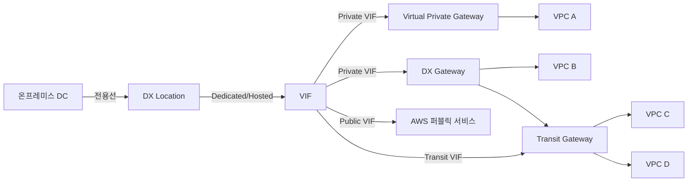
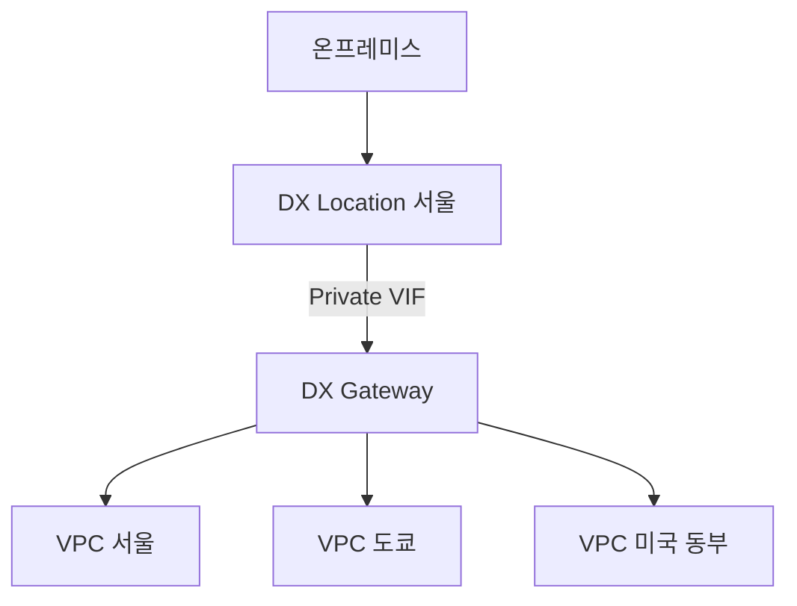
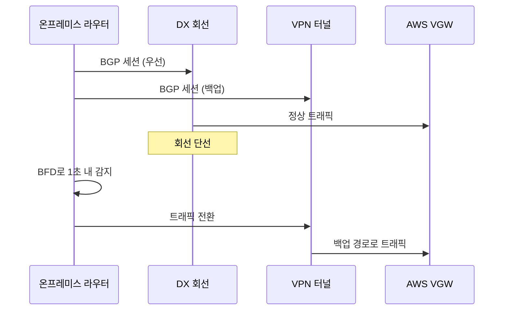

# AWS Direct Connect

## 개요

Direct Connect(이하 DX)는 온프레미스 데이터센터와 AWS 사이를 전용선으로 잇는 서비스다. 인터넷 구간을 거치지 않고 통신사 회선을 통해 AWS 리전과 직결된다. 트래픽이 인터넷을 타지 않으니 지연 시간이 일정해지고, 대용량 데이터 전송 비용이 인터넷보다 싸진다. 회선 자체는 통신사가 깔고 AWS는 그 끝단에 가상 인터페이스(VIF)를 붙여주는 구조다.

DX를 처음 도입할 때 가장 헷갈리는 게 회선·VIF·Gateway의 관계다. 물리 회선이 한 가닥 있고, 그 위에 논리 회선인 VIF가 여러 개 올라가고, 다시 VIF를 VPC나 다른 리전과 연결하기 위해 DX Gateway를 쓴다. 세 계층을 분리해서 이해해야 설계가 잡힌다.



DX는 인터넷 회선과 다르게 끊기면 즉시 복구가 안 된다. 통신사가 출동해서 회선을 점검해야 하고, 광케이블이 끊긴 경우 며칠씩 걸린다. 단일 회선만 깔고 운영하다가 굴착 사고로 회선이 끊겨 서비스가 멈춘 사례가 많다. DX는 반드시 이중화 또는 VPN 백업을 같이 설계한다고 보면 된다.

## 회선 종류: Dedicated와 Hosted

물리 회선 계약 형태는 크게 두 가지다. 둘 중 무엇을 고르냐가 도입 일정과 비용을 결정한다.

### Dedicated Connection

AWS와 직접 계약하는 전용 회선이다. 1Gbps, 10Gbps, 100Gbps 세 가지 속도가 있고, 회선 한 가닥을 통째로 받는다.

도입 흐름이 길다. AWS 콘솔에서 Connection을 신청하면 LOA-CFA(Letter of Authorization - Connecting Facility Assignment)라는 문서가 나온다. 이걸 통신사에 전달하면 통신사가 자기 POP에서 AWS DX Location까지 점퍼 케이블을 깔아준다. 동시에 온프레미스에서 통신사 POP까지 백홀 회선도 따로 신청해야 한다. 이 두 구간이 다 연결돼야 회선이 살아난다.

Dedicated를 고르는 경우는 트래픽이 많거나 회선을 직접 통제해야 할 때다. 한 회선에 VIF를 50개까지 만들 수 있어서 여러 계정·여러 VPC를 한 회선으로 분배할 때 유리하다.

### Hosted Connection

AWS Direct Connect Partner라는 이름이 붙은 통신사·MSP가 자기 Dedicated 회선을 잘라서 재판매하는 형태다. 50Mbps부터 10Gbps까지 잘게 끊어서 산다.

신청부터 개통까지 빠르면 며칠, 보통 2~4주 안에 끝난다. Dedicated가 6주~3개월 걸리는 것에 비하면 빠르다. 작은 회사에서 백오피스 용도로 쓰거나, 본격 회선이 들어오기 전 임시로 쓸 때 적합하다.

Hosted Connection은 한 회선에 VIF가 1개만 붙는다. 여러 VIF가 필요하면 Hosted Connection을 여러 개 사야 한다. 또 Hosted Connection에서는 Jumbo Frame(MTU 9001) 옵션이 안 되는 경우가 있어서 통신사 스펙을 미리 확인한다.

### Hosted VIF

비슷한 이름인데 다른 개념이다. Hosted Connection은 회선 자체를 재판매한 것, Hosted VIF는 통신사가 자기 회선 위에 VIF를 만들어서 AWS 계정으로 던져주는 것이다. 회선 소유권은 통신사에 있고 고객은 VIF만 받아서 자기 VPC에 붙이는 식이다. 회선 관리 책임이 적은 대신 회선 운영 정보를 직접 못 본다.

## VIF: 가상 인터페이스의 세 종류

물리 회선 위에 올리는 논리 회선을 VIF(Virtual Interface)라고 한다. VLAN 태그로 구분한다. 한 회선에 여러 VIF를 올려서 트래픽을 분리한다.

### Private VIF

VPC 내부 사설 IP 대역과 통신할 때 쓴다. 가장 흔하게 쓰이는 형태다. Private VIF는 Virtual Private Gateway(VGW) 또는 DX Gateway에 붙는다.

VGW에 직접 붙이면 한 VPC만 연결된다. DX Gateway에 붙이면 여러 VPC, 여러 리전과 연결된다. 처음에는 VGW로 시작했다가 VPC가 늘어나면 DX Gateway로 마이그레이션하는 경우가 많다.

Private VIF에서 광고할 수 있는 BGP 프리픽스는 VPC 측 100개, 온프레미스 측 100개로 제한된다. 이 한도를 넘기면 BGP 세션이 idle 상태로 떨어진다. 처음 구축할 때는 여유롭지만 회사가 커지면서 VPC가 늘어나면 슬슬 한도에 닿는다. 이때 prefix를 summary로 묶어서 광고하거나, Transit VIF로 전환을 검토한다.

### Public VIF

S3, DynamoDB, EC2 퍼블릭 엔드포인트 같은 AWS 퍼블릭 서비스에 인터넷이 아닌 DX 회선으로 접근할 때 쓴다. AWS의 모든 퍼블릭 IP 대역을 BGP로 받아온다.

Public VIF를 쓰려면 BGP 피어링에 사용할 공인 IP가 있어야 한다. 회사가 갖고 있는 공인 IP를 쓰거나, RIPE/APNIC에서 임대받은 IP를 써야 한다. 사설 IP는 안 된다. 공인 IP가 없으면 AWS가 임시로 /31 대역을 할당해주기도 하는데, 이 경우 BGP 피어링만 가능하고 그 IP로 외부에서 접근은 안 된다.

Public VIF로 S3에 붙이면 인터넷 게이트웨이를 거치지 않는다. 데이터 송신 비용이 인터넷보다 싸지고, 트래픽이 회사 망 안에서만 돈다. S3에 매일 수 TB씩 백업하는 회사면 Public VIF가 비용을 크게 줄여준다.

### Transit VIF

Transit Gateway에 붙는 VIF다. Transit Gateway 자체가 여러 VPC를 묶는 허브 역할이라, Transit VIF로 들어오면 한 회선으로 수십 개 VPC와 통신한다.

Transit VIF는 반드시 DX Gateway를 거쳐야 한다. 직접 Transit Gateway에 붙지 못한다. 또 한 DX Gateway에 Transit VIF는 최대 3개까지 붙는다. 회선 이중화를 위해 Transit VIF를 두 개 운영하는 건 흔하지만, 한 DX Gateway에 4개 이상 붙이려고 하면 안 된다.

회선 속도가 1Gbps 미만이면 Transit VIF를 못 만든다. 1Gbps 이상 회선에서만 지원한다. 50Mbps Hosted Connection에서 Transit Gateway에 붙이려는 시도가 자주 막히는 이유다.

## DX Gateway

DX Gateway는 글로벌 리소스다. 리전 경계를 넘어 동작한다. Direct Connect 회선이 어느 리전에 들어와 있든, 전 세계 모든 리전의 VPC에 같은 회선으로 접근하게 해주는 게 DX Gateway다.

서울 리전에 회선이 들어왔어도 도쿄·싱가포르·미국 동부 VPC와 통신할 수 있다. 회선이 도쿄에 있어도 서울 VPC와 통신한다. 본사가 한국에 있고 해외 지사·해외 리전을 묶을 때 이 구조가 들어온다.



제약이 두 가지 있다. 첫째, DX Gateway에 직접 붙은 VPC들끼리는 통신이 안 된다. VPC A와 VPC B가 같은 DX Gateway에 붙어 있어도 서로 못 본다. VPC 간 통신은 별도로 VPC Peering이나 Transit Gateway로 해결한다. 둘째, DX Gateway 자체는 라우팅 테이블이 없다. 단순히 BGP 광고를 받아서 적절한 VPC로 전달할 뿐이다.

DX Gateway에 연결할 수 있는 VGW는 최대 20개, Transit Gateway는 최대 6개다. 이걸 넘으면 DX Gateway를 추가로 만든다. 한 회선에 여러 DX Gateway를 붙일 수 없으니, 회선과 DX Gateway는 1:1로 보고 설계한다. 정확히 말하면 한 회선의 한 VIF가 한 DX Gateway에 붙는 구조라, VIF를 여러 개 만들어서 여러 DX Gateway에 분산시키는 건 가능하다.

## Site-to-Site VPN 백업 구성

DX는 끊기면 복구가 느리다. 광케이블 단선, 통신사 장비 장애, DX Location 화재 등 시나리오가 다양하다. 단일 DX 회선만 운영하는 건 위험하다. 보통 두 가지 백업 패턴 중 하나를 쓴다.

### 패턴 1: DX 이중화

회선을 두 가닥 깐다. 가능하면 서로 다른 통신사, 서로 다른 DX Location을 쓴다. 같은 통신사의 같은 DX Location에 두 회선을 깔면 통신사 장비가 죽거나 DX Location이 죽으면 둘 다 끊긴다. 비용은 두 배지만 가용성이 보장된다.

BGP가 두 회선의 부하 분산과 failover를 자동으로 해준다. 한쪽 BGP 세션이 죽으면 다른 쪽으로 트래픽이 즉시 넘어간다. AS path prepending이나 MED 값으로 우선순위를 조정해서 평소에는 한 회선을 메인으로 쓰고 다른 회선을 백업으로 두는 구성도 가능하다.

### 패턴 2: DX + Site-to-Site VPN

DX 회선 하나 + 인터넷을 통한 IPsec VPN 하나로 백업한다. DX 이중화보다 싸다. DX는 회선 비용이 높아서 백업까지 회선으로 깔면 부담이 크다. VPN은 인터넷 회선만 있으면 추가 비용이 거의 없다.

평소 트래픽은 DX로 흐르고, DX가 죽으면 VPN으로 넘어간다. AWS는 BGP 세션 우선순위로 이 동작을 자동화한다. DX가 살아있을 때는 BGP가 DX 경로의 AS path를 더 짧게 광고하고, VPN 경로는 더 길게 광고한다. 라우터는 짧은 경로를 선호하니 자연스럽게 DX로 흐른다.

DX가 죽어서 BGP 세션이 끊기면 VPN 경로만 남으니 트래픽이 VPN으로 넘어간다. failover 시간은 BGP hold timer에 달렸다. 기본 90초인데, BFD(Bidirectional Forwarding Detection)를 켜면 1초 이내로 떨어진다. 운영 환경이면 BFD는 거의 필수다.



VPN 백업의 함정은 대역폭이다. DX가 10Gbps인데 인터넷 회선이 100Mbps면, DX 죽으면 트래픽이 100배 줄어드는 거다. 백업으로 넘어간 동안에도 핵심 서비스는 살아야 하니 트래픽 우선순위 설계가 필요하다. 백업 모드일 때 비핵심 트래픽은 차단하거나 큐잉하는 식으로.

## BGP ASN과 MD5 인증

DX는 BGP로 경로를 주고받는다. 정적 라우팅은 안 쓴다. BGP 설정에서 ASN과 MD5 키가 핵심이다.

### ASN

AWS 측 ASN은 기본값이 64512다. 64512~65534 대역은 Private ASN이라 인터넷에서 충돌하지 않는다. AWS 측 ASN을 바꿀 수 있다. VGW나 DX Gateway 만들 때 Amazon-side ASN으로 16비트 또는 32비트 Private ASN을 지정한다. 16비트는 64512~65534, 32비트는 4200000000~4294967294 범위.

온프레미스 측 ASN은 회사가 정한다. 사내에서 이미 BGP를 쓰고 있으면 기존 ASN을 그대로 쓰고, 없으면 적당한 Private ASN을 쓴다. 7224는 AWS Public 측 ASN이라 사용 못 한다.

ASN 충돌이 자주 생기는 케이스가 있다. 회사 본사 라우터 ASN과 데이터센터 ASN이 같으면 BGP가 자기 ASN을 다시 받아서 루프 방지로 경로를 버린다. 사이트마다 ASN을 다르게 잡거나, allowas-in 옵션을 켜서 자기 ASN을 허용하게 만든다.

### MD5 인증

BGP 세션에 MD5 키를 걸어서 위변조를 방지한다. AWS 콘솔에서 VIF를 만들 때 BGP authentication key를 입력한다. 안 넣으면 AWS가 자동 생성해서 알려준다.

MD5 키는 일반 문자열이다. 특수문자 일부가 라우터 설정에서 문제를 일으키니 영문+숫자만 쓰는 게 안전하다. 키를 길게 잡으면 좋다. 8자 이하면 brute force가 가능하다.

### Cisco 라우터 BGP 설정 예제

```
router bgp 65001
 bgp log-neighbor-changes
 neighbor 169.254.0.1 remote-as 64512
 neighbor 169.254.0.1 password 7 mySecretBgpKey2026
 neighbor 169.254.0.1 timers 10 30
 neighbor 169.254.0.1 fall-over bfd
 !
 address-family ipv4
  network 10.0.0.0 mask 255.255.0.0
  neighbor 169.254.0.1 activate
  neighbor 169.254.0.1 soft-reconfiguration inbound
  neighbor 169.254.0.1 prefix-list AWS-IN in
  neighbor 169.254.0.1 prefix-list AWS-OUT out
 exit-address-family
!
ip prefix-list AWS-OUT seq 10 permit 10.0.0.0/16
ip prefix-list AWS-IN seq 10 permit 0.0.0.0/0 le 32
!
bfd-template single-hop AWS-BFD
 interval min-tx 300 min-rx 300 multiplier 3
```

`169.254.0.1`은 AWS 측 BGP peer IP, `169.254.0.2`는 고객 측이라는 식으로 AWS가 /30 대역을 할당해준다. timers 10 30은 keepalive 10초, hold 30초로 짧게 잡은 것이고 BFD까지 켜면 장애 감지가 1초 이내다.

prefix-list로 광고 범위를 명확히 잡는다. 이걸 안 잡으면 라우팅 테이블 전체가 광고돼서 100개 한도를 넘기거나, 의도하지 않은 사내 대역이 AWS로 노출된다. inbound도 마찬가지로 받을 prefix를 제한한다. AWS에서 받는 default route 외에 다른 게 들어오면 보통 잘못 설정된 것이다.

### Junos(Juniper) 설정 예제

```
protocols {
    bgp {
        group AWS-DX {
            type external;
            local-address 169.254.0.2;
            authentication-key "mySecretBgpKey2026";
            export AWS-OUT;
            import AWS-IN;
            peer-as 64512;
            local-as 65001;
            bfd-liveness-detection {
                minimum-interval 300;
                multiplier 3;
            }
            neighbor 169.254.0.1;
        }
    }
}

policy-options {
    policy-statement AWS-OUT {
        term advertise-internal {
            from {
                route-filter 10.0.0.0/16 exact;
            }
            then accept;
        }
        then reject;
    }
    policy-statement AWS-IN {
        then accept;
    }
}
```

설정 자체는 단순한데, 라우팅 정책을 명시적으로 안 걸면 의도치 않은 경로가 광고된다. policy-statement에서 reject를 마지막에 두는 습관이 안전하다.

## 장애 시 failover 시나리오

DX 운영하면서 한 번씩 겪는 장애 패턴이다.

### 케이스 1: 단일 회선에서 BGP 세션 down

회선은 살아있는데 BGP만 죽는 경우. 라우터 재부팅, BGP 설정 실수, MD5 키 변경 등이 원인이다. AWS 콘솔에서 VIF의 BGP 상태가 down으로 보인다.

회선이 살아있으니 물리적으로 패킷은 흐를 수 있는데 BGP가 없어서 라우팅이 안 된다. 이 상황에서는 정적 라우트가 깔려있으면 트래픽이 블랙홀로 빠진다. 정적 라우트는 BGP가 죽어도 살아있어서 죽은 회선으로 패킷을 계속 보낸다. DX 환경에서는 정적 라우트와 BGP를 섞지 않는 게 좋다.

복구는 BGP 설정을 잡아서 다시 올린다. soft-reconfiguration inbound를 켜놨으면 세션을 끊지 않고도 정책 재적용이 가능하다.

### 케이스 2: 회선 자체 단선

회선이 물리적으로 끊긴 경우. 통신사 콜센터에 즉시 연락한다. 출동까지 시간이 걸린다. 광케이블이 굴착에 절단된 거면 며칠 단위. 이 시나리오를 대비한 백업이 필수다.

이중 회선이면 자동 failover. 단일 회선에 VPN 백업이면 BGP가 VPN 경로로 넘기고 트래픽이 흐른다. BFD 켜뒀으면 1초 내, 없으면 hold timer만큼(보통 90초) 트래픽이 끊긴다.

### 케이스 3: AWS 측 장애

DX Location 측 AWS 장비가 죽는 경우. 드물지만 있다. 회선과 BGP는 살아있는데 AWS 내부 라우팅이 안 되는 상황. 이건 고객이 할 수 있는 게 거의 없다. AWS 측 우회 경로가 자동으로 잡히길 기다리거나, VPN으로 넘어가게 한다.

AWS Health Dashboard와 회사 상태 페이지를 평소에 모니터링하는 게 좋다. CloudWatch에 DX 메트릭(ConnectionState, VirtualInterfaceState, BGPSessionState 등)을 알람으로 걸어둔다.

### 케이스 4: BGP 광고 prefix 한도 초과

VPC가 늘어나면서 100개 prefix 한도를 넘기는 경우. BGP 세션이 idle로 빠지면서 모든 트래픽이 끊긴다. 이게 가장 황당한 장애다. 회선도 멀쩡하고 라우터도 멀쩡한데 한도 때문에 죽는다.

VPC CIDR을 supernet으로 묶어 광고하거나, Transit Gateway 도입으로 prefix를 줄인다. 응급 처치는 광고하는 prefix를 줄여서 100개 이하로 맞추는 거고, 근본 해결은 네트워크 구조 재설계다.

### 케이스 5: AS path prepending 실수

회선 두 개 운영하다가 우선순위를 바꾸려고 prepending을 잘못 걸어서 트래픽이 한쪽으로만 몰리는 경우. 또는 비대칭 라우팅이 생겨서 패킷은 가는데 응답이 안 오는 경우. BGP 변경 작업은 트래픽 패턴을 바로 바꾸니까 변경 윈도우를 잡고 점진적으로 한다.

## 회선 도입 리드타임

DX 도입 일정을 잡을 때 가장 흔한 실수가 일정을 너무 빠듯하게 잡는 거다. 통신사 작업이 일주일이면 끝날 거라 보고 시작했다가 두 달이 걸리는 경우가 많다.

### Dedicated Connection 일정

전형적인 도입 일정은 이렇게 흐른다.

1. AWS 콘솔에서 Connection 신청 (즉시 ~ 1일)
2. AWS가 DX Location에 포트 할당 (1~3일)
3. LOA-CFA 발급 (1~2일)
4. 통신사에 LOA-CFA 전달, 회선 견적 (1주)
5. 회사 내부 결재 (1~3주)
6. 통신사 회선 신청 (1주)
7. DX Location까지 점퍼 케이블 작업 (1~2주)
8. 백홀 회선(통신사 POP ↔ 온프레미스) 구축 (2주 ~ 2개월)
9. 회선 테스트 (수일)
10. VIF 생성 및 BGP 설정 (1일)
11. 운영 절차 검증 (1주)

순서대로 더하면 빨라야 6주, 느리면 3~4개월이다. 백홀 회선이 변수다. 도심 빌딩이면 빠르고, 외곽 데이터센터면 토목 공사까지 들어가서 길어진다. 90일짜리 LOA-CFA 유효기간이 만료되면 재발급 받아야 하는 것도 함정이다.

### Hosted Connection 일정

Hosted는 통신사가 이미 깔아놓은 회선을 자르는 거라 빠르다. 신청부터 사용까지 1~3주. 통신사에 따라 1주 안에 되는 곳도 있다. PoC나 임시 운영에는 Hosted가 맞다.

### 이중화까지 고려한 일정

이중화하려면 두 회선을 동시에 진행하거나 순차적으로 한다. 동시 진행은 일정이 같이 끝나서 좋지만, 첫 회선 구축 중 발견된 문제가 두 번째 회선에도 영향을 준다. 순차 진행은 안전하지만 두 배 시간이 걸린다.

서로 다른 통신사로 이중화하면 통신사별 일정이 다르니 더 길어진다. 한 통신사가 4주, 다른 통신사가 8주면 8주 후에 이중화가 완성된다. 본사 결재, IP 대역 할당, 보안팀 검토 등 외부 변수까지 포함하면 6개월 잡고 시작하는 게 현실적이다.

## 운영 체크포인트

도입 후 운영하면서 신경 써야 할 지점들이다.

**모니터링**

CloudWatch에서 DX 메트릭을 모니터링한다. ConnectionState, ConnectionBpsEgress/Ingress, ConnectionPpsEgress/Ingress, ConnectionLightLevelTx/Rx 같은 메트릭이 나온다. ConnectionLightLevel은 광 신호 세기인데 이 값이 떨어지기 시작하면 광케이블 열화나 커넥터 오염을 의심한다. 회선이 죽기 전에 사전 감지 가능하다.

VirtualInterfaceBpsEgress/Ingress는 VIF 단위 트래픽이다. 어느 VIF가 트래픽을 많이 쓰는지 확인할 때 쓴다. BGP 세션 상태는 BGPSessionState 메트릭으로 본다. 이게 down으로 떨어지면 즉시 알람.

**비용**

DX 비용 구조가 인터넷과 다르다. 포트 시간당 요금(회선 속도별)과 데이터 송신 요금(GB당)이 따로 붙는다. 데이터 수신은 무료다. 인터넷 송신보다 DX 송신이 GB당 약 1/3 가격이라 대용량 트래픽이면 비용이 빠르게 줄어든다.

Hosted Connection은 통신사가 자체 요금 체계로 청구한다. AWS는 통신사에 받고, 통신사가 마진 붙여서 고객에게 청구. AWS 콘솔에 보이는 가격과 실제 청구 가격이 다르다.

데이터 전송 요금은 송신 측 리전에 따라 다르다. 도쿄가 서울보다 약간 비싸고, 미국 동부가 가장 싸다. 트래픽이 많으면 리전별 단가도 비교한다.

**라우팅 정책 관리**

BGP 광고 정책은 변경 윈도우를 잡고 한다. prefix-list 한 줄 잘못 바꾸면 트래픽이 다 끊기거나 의도치 않은 대역이 광고된다. 변경 전에 show ip bgp summary, show ip bgp neighbors advertised-routes로 현재 상태를 캡처해둔다. 변경 후 같은 명령으로 비교한다.

BGP communities를 활용하면 광고 우선순위 제어가 깔끔해진다. AWS는 7224:7100, 7224:7200, 7224:7300 같은 community로 라우팅 우선순위를 표시한다. 7224:7100은 low preference, 7224:7300은 high preference. 이 community를 받아서 자기 라우팅 정책을 짜면 동작이 명시적이다.

**MTU**

DX 기본 MTU는 1500이지만 Jumbo Frame(9001)을 켤 수 있다. Private VIF에서 켜면 VPC 내부 통신이 빨라진다. 단, Transit VIF는 8500까지만 지원한다. 또 VPN 백업으로 넘어가면 IPsec 오버헤드 때문에 1400 정도까지 떨어지니까 두 경로가 다른 MTU를 쓰면 application 레이어에서 PMTUD 문제가 생긴다. ICMP "fragmentation needed"가 차단된 환경이면 패킷이 그냥 사라진다.

**보안**

DX 회선 자체는 통신사 망을 통과한다. 통신사 직원이 트래픽을 들여다볼 수 있다는 의미다. 평문 트래픽을 그대로 흘리는 건 권하지 않는다. DX 위에 IPsec을 걸거나, 애플리케이션 레이어에서 TLS를 쓴다. AWS는 MAC Security(MACsec)를 100Gbps 회선에서 지원한다. 이걸 켜면 회선 구간이 암호화된다.

**용량 계획**

DX 회선이 80%를 넘기 시작하면 증설을 검토한다. 100% 차면 패킷 드롭이 생긴다. 1Gbps에서 10Gbps로 가는 건 보통 회선을 새로 깔아야 해서 시간이 걸린다. 트래픽 증가율을 보고 6개월 전부터 준비하는 게 안전하다. Hosted Connection은 속도 변경이 통신사 측에서 비교적 빠르게 되는 경우가 있어서 업그레이드 가능 여부를 통신사에 미리 확인한다.

**문서화**

회선 정보, VIF 매핑, BGP 설정, 백업 경로 동작, 장애 대응 절차를 한 곳에 정리한다. 운영자가 바뀌거나 새벽에 장애가 났을 때 이 문서가 없으면 복구가 늦어진다. AWS 계정 ID, Connection ID, VIF ID, VLAN, BGP ASN, peer IP, MD5 키 위치, 통신사 담당자 연락처까지 다 적어둔다. MD5 키는 비밀번호 관리 시스템에 두고 문서에는 위치만 적는다.
