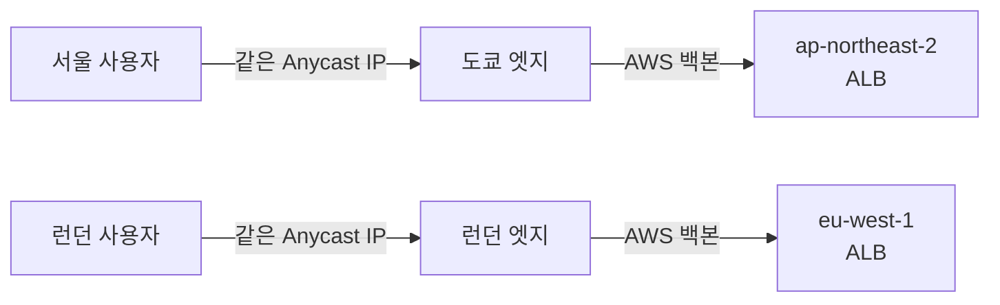
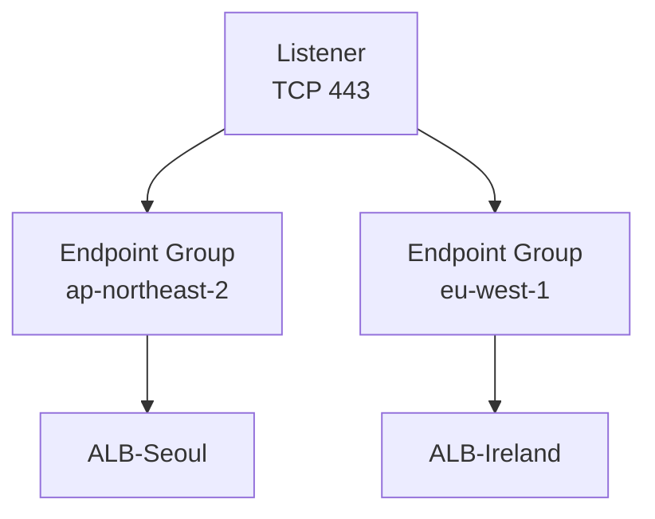
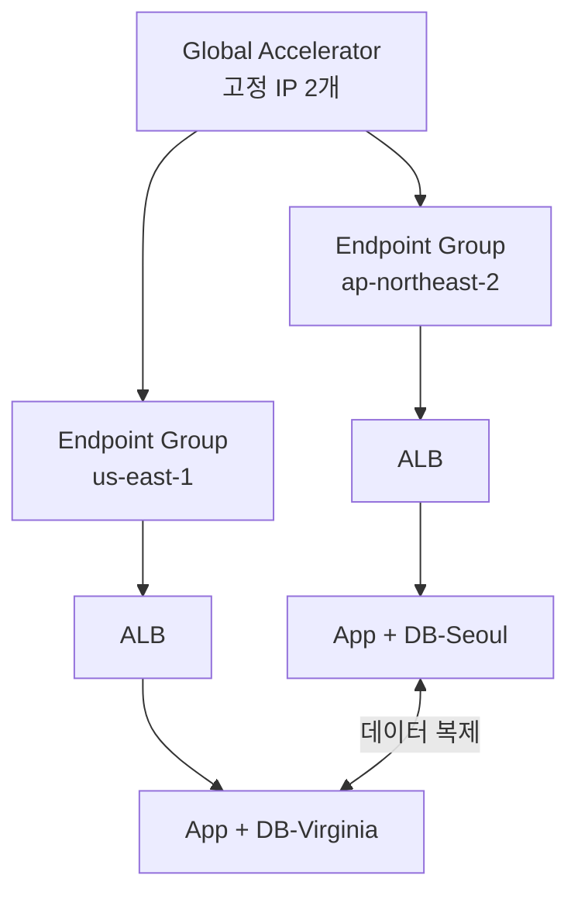

# AWS Global Accelerator

전 세계 사용자가 들어오는 TCP/UDP 트래픽을 AWS 엣지 네트워크 안으로 최대한 빨리 끌어들인 뒤, 그 안에서 백본을 타고 목적지 리전까지 보내는 서비스다. 사용자 입장에서는 고정된 IP 두 개로 접속하고, 그 IP가 실제로는 전 세계 엣지 로케이션 어디에나 떠 있는(애니캐스트) 구조다.

처음 이 서비스를 봤을 때 "그냥 Route 53 레이턴시 라우팅이랑 뭐가 다르냐"는 생각부터 들었다. 실제로 둘 다 사용자를 가까운 리전으로 보내는 게 목적이지만 동작 계층이 완전히 다르다. 이 차이를 이해하지 못하면 비용만 쓰고 효과를 못 본다.

## 애니캐스트 IP가 핵심이다

Global Accelerator를 만들면 정적 IP 두 개를 받는다. 이 IP는 BGP 애니캐스트로 광고된다. 무슨 말이냐면, 같은 IP 주소 블록이 전 세계 수십 개 엣지 로케이션에서 동시에 광고되고, 사용자의 패킷은 BGP 라우팅상 가장 가까운 엣지로 자동으로 빨려 들어간다.

서울 사용자가 이 IP에 접속하면 서울이나 도쿄 엣지로 들어가고, 런던 사용자가 같은 IP에 접속하면 런던 엣지로 들어간다. DNS가 아니라 네트워크 라우팅 레벨에서 분기가 일어난다.

DNS 기반 라우팅과 비교하면 이 지점이 결정적이다. Route 53 레이턴시 라우팅은 도메인을 질의하는 순간 "너는 도쿄 리전으로 가라"고 IP를 내려준다. 문제는 DNS에 TTL이 있고, 리졸버가 캐싱하고, 클라이언트가 한 번 받은 IP를 한참 들고 있다는 점이다. 리전 하나가 죽어도 TTL이 만료될 때까지는 죽은 IP로 계속 접속을 시도하는 경우가 있다. 모바일 환경에서 DNS 캐시가 꼬여서 페일오버가 몇 분씩 늦는 장애를 겪어본 사람이라면 이 부분이 왜 중요한지 안다.

Global Accelerator는 IP 자체가 안 바뀐다. 사용자는 항상 같은 두 IP로 접속하고, 뒤에서 어느 리전으로 보낼지는 AWS가 실시간으로 결정한다. 클라이언트 쪽 DNS 캐시가 끼어들 여지가 없다.

## 레이턴시가 줄어드는 진짜 이유

엣지로 빨리 들어가는 것 자체보다, 들어간 다음 AWS 백본을 탄다는 점이 더 크다. 공용 인터넷은 ISP 여러 곳을 거치면서 경로가 그때그때 달라지고 혼잡한 구간을 만나면 지연이 튄다. Global Accelerator를 쓰면 사용자~엣지 구간만 공용 인터넷이고, 엣지~리전 구간은 전부 AWS가 직접 깔아둔 백본을 탄다.

실제로 미국 동부 리전에 API를 두고 아시아 사용자를 받았을 때, 가속기를 붙이는 것만으로 p99 레이턴시가 눈에 띄게 떨어지는 경우가 있다. 거리상 가까워진 게 아니라 경로가 안정적이고 패킷 손실이 줄어서 그렇다. TCP는 패킷 손실에 민감해서 재전송이 한 번 걸리면 체감 지연이 크게 늘어나는데, 백본 구간에서는 그게 거의 안 생긴다.

다만 사용자와 리전이 애초에 가깝고 네트워크가 깨끗하면 효과가 미미하다. 같은 리전 안에서 도는 트래픽에 가속기를 붙이는 건 의미가 없다. 효과를 보려면 사용자와 백엔드 리전 사이에 물리적 거리나 네트워크 품질 문제가 실제로 있어야 한다.

## 리스너, 엔드포인트 그룹, 엔드포인트

구성 요소는 세 단계다.

- **리스너(Listener)**: 어떤 포트와 프로토콜(TCP/UDP)을 받을지 정의한다. 예를 들어 TCP 443, UDP 3478 같은 식.
- **엔드포인트 그룹(Endpoint Group)**: 리전 단위로 묶인다. `ap-northeast-2` 그룹, `eu-west-1` 그룹 이렇게. 트래픽 다이얼(traffic dial)로 그룹별 가중치를 준다.
- **엔드포인트(Endpoint)**: 실제 트래픽을 받는 대상. ALB, NLB, EC2 인스턴스, 또는 Elastic IP를 붙인다.

기본 동작은 사용자에게 가장 가까운 엔드포인트 그룹으로 보내는 것이다. 서울 사용자는 서울 그룹, 유럽 사용자는 아일랜드 그룹으로 간다. 트래픽 다이얼을 0~100으로 조정하면 특정 리전으로 가는 비율을 줄이는데, 리전 점검이나 단계적 롤아웃 때 쓴다. 예를 들어 아일랜드 그룹 다이얼을 50으로 내리면 원래 그쪽으로 갈 트래픽의 절반만 받고 나머지는 다음으로 가까운 그룹으로 넘어간다.

## 헬스체크와 페일오버

엔드포인트 그룹마다 헬스체크가 돈다. ALB나 NLB를 엔드포인트로 쓰면 그 로드밸런서 자체의 헬스 상태를 그대로 가져다 쓰고, EC2나 EIP면 Global Accelerator가 직접 체크한다.

특정 리전의 엔드포인트가 unhealthy로 떨어지면 가속기는 그 그룹을 빼고 다음으로 가까운 정상 그룹으로 트래픽을 넘긴다. 여기서 DNS가 안 끼는 게 다시 한번 효과를 본다. IP는 그대로고 라우팅만 바뀌므로 클라이언트는 아무것도 안 해도 되고, 페일오버가 초 단위로 일어난다.

헬스체크 설정에서 한 가지 주의할 점. ALB를 엔드포인트로 쓸 때 Global Accelerator는 ALB의 헬스 상태를 따르는데, ALB 자체는 타깃 그룹에 정상 타깃이 하나라도 있으면 healthy로 본다. 즉 ALB 뒤의 애플리케이션이 절반쯤 맛이 가도 ALB는 살아있다고 보고하고, 가속기는 그 리전을 계속 살아있는 걸로 취급한다. 애플리케이션 레벨 장애까지 잡으려면 ALB 타깃 그룹의 헬스체크 경로를 실제 의존성(DB 연결 등)까지 확인하는 엔드포인트로 잡아야 한다. 이걸 `/health`가 그냥 200만 뱉게 해두면 페일오버가 안 도는 경우가 있다.

## CloudFront와 뭐가 다른가

이름이 둘 다 "엣지 네트워크로 빠르게"라서 헷갈리지만 역할이 다르다.

| 구분 | CloudFront | Global Accelerator |
|---|---|---|
| 계층 | HTTP/HTTPS (L7) | TCP/UDP 패스스루 (L4) |
| 캐싱 | 엣지에 콘텐츠 캐싱 | 캐싱 안 함, 그대로 전달 |
| IP | 엣지마다 다른 IP | 고정 IP 2개 |
| 주 용도 | 정적/동적 웹 콘텐츠 배포 | 비-HTTP 프로토콜, 고정 IP 필요한 워크로드 |
| 페일오버 | 오리진 그룹 단위 | 엔드포인트 그룹 단위, 초 단위 |

CloudFront는 콘텐츠 전달 네트워크다. 엣지에 이미지, JS, 동영상 같은 걸 캐싱해두고 사용자에게 가까운 엣지에서 바로 내려준다. HTTP/HTTPS만 다루고, 콘텐츠를 이해하고 캐싱하는 게 핵심이다.

Global Accelerator는 캐싱하지 않는다. 패킷을 가속해서 그대로 백엔드까지 전달할 뿐이다. 그래서 캐싱이 의미 없는 워크로드 ― 게임 서버(UDP), MQTT, VoIP, 실시간 양방향 TCP, 또는 HTTP라도 매번 백엔드까지 가야 하는 API ― 에 맞는다.

판단 기준은 단순하다. 캐싱할 수 있는 정적 콘텐츠가 많으면 CloudFront. 캐싱이 안 되는 TCP/UDP 트래픽이거나 클라이언트에 화이트리스트로 등록할 고정 IP가 필요하면 Global Accelerator. 방화벽에 IP를 등록해야 하는 엔터프라이즈 클라이언트를 상대할 때 고정 IP 두 개는 생각보다 자주 요긴하다.

둘을 같이 쓰는 구성도 있다. 정적 자산은 CloudFront로 배포하고, WebSocket이나 실시간 API는 Global Accelerator로 보내는 식으로 트래픽 성격에 따라 나눈다.

## 멀티리전 active-active 구성

가속기의 진짜 쓸모는 여러 리전을 동시에 살려두는 active-active 구성에서 나온다. 단일 IP 두 개로 여러 리전을 받으니까 클라이언트는 리전이 몇 개인지 알 필요가 없다.

전형적인 그림은 이렇다. 같은 애플리케이션을 `ap-northeast-2`와 `us-east-1` 양쪽에 배포하고, 각 리전에 ALB를 두고, 그 두 ALB를 같은 리스너 아래 엔드포인트 그룹으로 등록한다.

아시아 사용자는 서울로, 미주 사용자는 버지니아로 자동으로 갈린다. 서울 리전이 통째로 죽으면 헬스체크가 감지하고 모든 트래픽이 버지니아로 넘어간다. IP는 안 바뀌므로 사용자는 끊김을 거의 못 느낀다.

여기서 진짜 어려운 부분은 네트워크가 아니라 데이터다. active-active를 제대로 하려면 양쪽 리전이 같은 데이터를 봐야 하는데, 그게 가속기가 해결해주는 영역이 아니다. 직접 겪은 함정 몇 가지.

- **데이터 일관성**: 양쪽에서 동시에 쓰기가 들어오면 충돌이 난다. DynamoDB Global Tables처럼 멀티리전 쓰기를 지원하는 저장소를 쓰거나, 쓰기는 한 리전으로만 보내고(active-passive write) 읽기만 양쪽에서 받는 식으로 타협하는 경우가 많다.
- **복제 지연**: 리전 간 복제는 비동기라 지연이 있다. 서울에서 쓴 데이터가 버지니아에 반영되기 전에 페일오버가 일어나면, 방금 쓴 게 사라진 것처럼 보인다. 복제 지연 시간 안에 페일오버가 겹치는 시나리오를 반드시 따져봐야 한다.
- **세션 처리**: 페일오버 후 다른 리전으로 넘어가면 그 리전엔 기존 세션이 없다. 세션을 stateless하게 토큰 기반으로 가거나, 리전 간 공유되는 세션 스토어를 쓰거나 둘 중 하나로 정리해야 한다.

가속기는 트래픽을 정확한 리전으로 빠르게 보내고 죽은 리전을 초 단위로 빼주는 것까지가 역할이다. 그 뒤 데이터 정합성은 애플리케이션과 저장소 설계로 풀어야 한다. 이걸 분리해서 생각하지 않으면 "가속기 붙였으니 멀티리전 끝났다"고 착각하다가 페일오버 순간에 데이터가 깨진다.

## 비용 관점

Global Accelerator는 고정 시간당 요금에 더해 전송 데이터에 비례하는 요금(DT-Premium)이 붙는다. 일반 데이터 전송보다 단가가 비싸다. 그래서 트래픽 전부를 무조건 가속기에 태우는 건 비용 낭비다.

레이턴시에 민감하고 페일오버 요구가 분명한 트래픽만 골라서 태우는 게 맞다. 정적 콘텐츠는 CloudFront로 빼고, 내부 통신이나 같은 리전 트래픽은 가속기를 거치지 않게 한다. 붙이기 전에 실제로 레이턴시가 얼마나 개선되는지 측정해보고 판단해야 한다. AWS가 제공하는 가속기 비교 도구로 가속 전후 차이를 미리 가늠해보니, 도입 전에 한 번 돌려보는 걸 권한다.