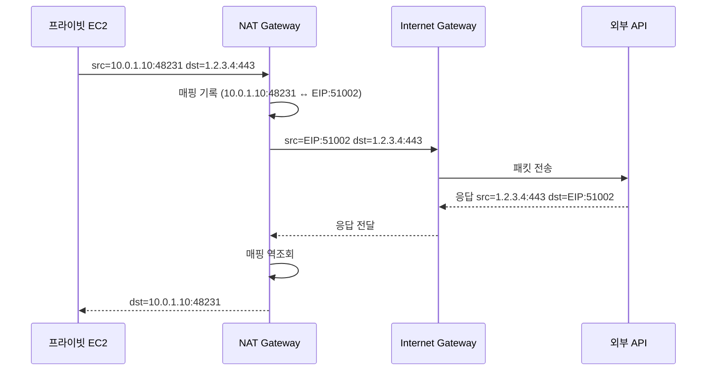

# AWS NAT Gateway

프라이빗 서브넷의 인스턴스를 인터넷으로 내보낼 때 거의 무조건 만나는 컴포넌트다. 설치는 클릭 몇 번이라 쉬워 보이지만, 운영하다 보면 포트 고갈, AZ 간 비용 폭탄, Lambda VPC 연결 이슈 같은 함정이 차례로 나온다. 한 번 데이고 나면 비로소 동작 원리를 다시 보게 되는 부류의 서비스다.

## NAT가 실제로 하는 일

NAT Gateway는 5-tuple(소스 IP, 소스 포트, 대상 IP, 대상 포트, 프로토콜)을 기반으로 연결 상태를 추적한다. 프라이빗 인스턴스가 외부로 패킷을 보내면 NAT Gateway가 다음 변환을 수행한다.

원본 패킷의 소스 IP는 NAT Gateway의 EIP로 바뀐다. 소스 포트는 NAT Gateway가 자체적으로 보유한 임시 포트 풀에서 새로 하나를 할당받아 매핑 테이블에 기록한다. 외부에서 응답이 돌아오면 이 매핑 테이블을 역방향으로 조회해 원래 프라이빗 IP와 포트를 복원하고, 라우팅 테이블에 따라 인스턴스로 되돌린다.

여기서 중요한 게 포트 풀이다. 하나의 NAT Gateway에 붙은 단일 EIP는 동일 대상 IP·포트 조합에 대해 약 55,000개의 포트만 동시에 매핑할 수 있다. 예를 들어 100대의 컨테이너가 동일한 외부 API(`api.example.com:443`)를 호출하면 이 모든 연결이 한 EIP의 동일한 대상으로 다중화된다. 평소엔 충분해 보이지만, 캠페인 시작이나 배치 작업이 동시에 떨어지는 순간 ErrorPortAllocation이 튀어 오른다.

다른 대상이면 같은 소스 포트를 재사용할 수 있다. 즉 `8.8.8.8:53`으로 가는 연결과 `1.1.1.1:53`으로 가는 연결은 같은 32768 포트를 동시에 쓸 수 있다. 진짜 한계는 "EIP × 동일 대상"마다 ~55K이라는 점이다. 외부 호출이 특정 API 한 곳으로 쏠리면 NAT Gateway 자체의 처리량이 남아돌아도 포트가 먼저 말라버린다.

또 하나, 끝난 연결의 포트가 곧바로 풀에 반환되지 않는다. TCP는 기본적으로 350초 정도 idle timeout이 적용된 뒤 매핑이 해제된다. 단시간에 짧은 연결을 대량으로 맺는 패턴은 실제로 동시 활성 연결보다 훨씬 많은 포트를 점유한다.



## 다중 AZ에서 흔히 밟는 함정

NAT Gateway는 AZ 단위 리소스다. `ap-northeast-2a`에 만든 NAT Gateway는 그 AZ에서만 살아 있다. 해당 AZ에 장애가 나면 NAT도 같이 죽는다. 그래서 운영 환경에서는 AZ마다 NAT Gateway를 하나씩 둔다.

여기서 첫 번째 함정. 라우팅 테이블을 AZ별로 분리하지 않고 프라이빗 서브넷 전부를 한 개의 라우팅 테이블에 묶어 두면, 모든 AZ의 트래픽이 그 라우팅 테이블이 가리키는 단 하나의 NAT Gateway로 빨려 들어간다. AZ-A의 NAT가 죽었을 때 트래픽을 AZ-B로 옮기려고 그렇게 했을 수도 있지만, 평상시에는 AZ-B와 AZ-C의 인스턴스가 죄다 AZ-A로 우회한다. 그러면 AZ 간 데이터 전송 요금(GB당 $0.01)이 그대로 발생한다.

내부 트래픽은 한 방향만 과금되는 게 아니다. 인스턴스 → NAT Gateway 구간과 NAT Gateway → 인스턴스(응답) 구간 양쪽에 발생한다. 즉 1GB의 외부 호출이 실제로는 2GB의 AZ 간 트래픽으로 환산된다. 여기에 NAT 처리량 요금($0.045/GB)이 따로 붙는다. 평상시 트래픽이 큰 서비스라면 라우팅 테이블 잘못 묶은 것 하나로 월 청구서가 두 배로 뛰는 일이 흔하다.

해결은 단순하다. AZ마다 라우팅 테이블을 하나씩 만들고, 각 라우팅 테이블의 `0.0.0.0/0`은 같은 AZ의 NAT Gateway를 가리키게 한다.

```hcl
# AZ별 NAT Gateway
resource "aws_nat_gateway" "az" {
  for_each      = aws_subnet.public
  allocation_id = aws_eip.nat[each.key].id
  subnet_id     = each.value.id
}

# AZ별 프라이빗 라우팅 테이블
resource "aws_route_table" "private" {
  for_each = aws_subnet.private
  vpc_id   = aws_vpc.main.id

  route {
    cidr_block     = "0.0.0.0/0"
    nat_gateway_id = aws_nat_gateway.az[each.key].id
  }
}

resource "aws_route_table_association" "private" {
  for_each       = aws_subnet.private
  subnet_id      = each.value.id
  route_table_id = aws_route_table.private[each.key].id
}
```

두 번째 함정은 장애 대응이다. AZ-A의 NAT Gateway가 죽었을 때 AZ-A 인스턴스들이 자동으로 AZ-B의 NAT로 우회해 주지 않는다. AZ-A 라우팅 테이블을 손으로 수정해 NAT를 AZ-B 쪽으로 돌려야 한다. 자동화하려면 Route 53 헬스체크와 Lambda를 묶거나, NAT Gateway 모니터링용 별도 람다가 라우팅 테이블을 갱신하도록 짜야 한다. 다만 AZ-A 워크로드 자체가 죽었을 가능성이 더 크니, NAT만 살려서 의미가 있는지부터 따져야 한다.

## 포트 고갈(ErrorPortAllocation) 대응

`ErrorPortAllocation` 메트릭이 0이 아닌 값으로 잡히기 시작하면 그 시점부터는 일부 외부 연결이 실패한다. 애플리케이션 로그에는 `connection timeout`이나 `connection refused`로 보일 텐데 NAT 쪽에서 패킷이 그냥 드롭되는 것이라 원인을 찾기가 까다롭다.

원인은 거의 항상 셋 중 하나다.

첫째, 외부 호출이 소수의 동일한 대상(IP+포트)으로 집중된다. 결제 게이트웨이, 외부 검색 API, 푸시 알림 서비스 같은 곳으로 트래픽이 쏠리는 경우다. 이때는 NAT Gateway에 secondary IP를 추가하면 포트 풀이 IP 수만큼 늘어난다. 한 NAT Gateway에 최대 8개의 EIP를 붙일 수 있고, 그러면 동일 대상에 대해 약 55K × 8 = 약 44만 포트까지 확장된다. EIP를 추가했을 때 어떤 출발지 IP가 어떤 EIP를 쓰는지는 NAT Gateway 내부 해시로 결정되니, 특정 인스턴스를 특정 EIP에 묶으려는 시도는 의미가 없다.

```bash
# secondary IP 할당
aws ec2 associate-nat-gateway-address \
    --nat-gateway-id nat-0abcd1234 \
    --allocation-ids eipalloc-aaa eipalloc-bbb
```

둘째, 애플리케이션이 연결을 재사용하지 않고 매 요청마다 새 TCP 연결을 맺는다. HTTP 클라이언트의 keep-alive 설정을 끄거나, 풀 크기를 너무 작게 잡았거나, 매번 짧게 끊는 패턴이 그렇다. Node.js의 `http.Agent`, Python의 `requests.Session`, Java의 OkHttp `ConnectionPool` 모두 기본 keep-alive를 켜놓되 풀 크기와 idle timeout을 조정해 NAT의 매핑 수명과 어긋나지 않게 맞추는 게 좋다.

셋째, NAT를 통하지 말아야 할 트래픽까지 NAT로 가고 있다. S3, DynamoDB, ECR, CloudWatch Logs 같은 AWS 서비스로 가는 트래픽이 NAT Gateway를 거치면 포트와 처리량을 모두 잡아먹는다. 다음 절에서 다룬다.

운영 중에 ErrorPortAllocation이 튀면 즉시 다음 순서로 본다.

1. CloudWatch에서 `ActiveConnectionCount`가 동시에 비정상적으로 높은지 확인. 높다면 트래픽 패턴 자체가 문제다.
2. VPC Flow Logs에서 NAT Gateway ENI의 destination IP 분포를 뽑는다. 한두 곳으로 집중되어 있으면 secondary EIP 추가가 즉효다.
3. ECR, S3, CloudWatch Logs로의 흐름이 보이면 VPC Endpoint로 분리한다.

## 비용이 폭발하는 진짜 이유

NAT Gateway는 시간당 요금($0.045/시간, 월 약 $32)보다 처리량 요금($0.045/GB)이 청구서를 무겁게 만든다. 1TB가 NAT를 통과하면 $46이 추가된다. 외부 API 호출만 있을 때는 별 게 아니지만, S3나 DynamoDB로 가는 트래픽이 NAT를 거치고 있으면 청구서가 단숨에 수백 달러로 뛴다.

가장 흔한 사례가 ECR이다. ECS나 EKS 노드가 컨테이너 이미지를 ECR에서 받아오는데, ECR은 퍼블릭 엔드포인트라 NAT Gateway를 통과한다. 이미지 한 개가 500MB라면 노드 100대가 새 버전을 받을 때마다 50GB가 NAT를 지난다. 배포가 잦으면 이 비용만 월 수십만 원이 된다.

해결은 VPC Endpoint다. S3, DynamoDB는 Gateway Endpoint로 무료(시간당 요금 없음)다. ECR, CloudWatch Logs, Secrets Manager, KMS, STS 같은 서비스는 Interface Endpoint로 붙이면 시간당 $0.01 정도, 처리량 요금은 GB당 $0.01이라 NAT보다 훨씬 싸다. Interface Endpoint를 AZ 수만큼 둬야 한다는 점은 알아둘 것.

```hcl
# S3 Gateway Endpoint (무료)
resource "aws_vpc_endpoint" "s3" {
  vpc_id            = aws_vpc.main.id
  service_name      = "com.amazonaws.ap-northeast-2.s3"
  vpc_endpoint_type = "Gateway"
  route_table_ids   = [for rt in aws_route_table.private : rt.id]
}

# ECR Interface Endpoint
resource "aws_vpc_endpoint" "ecr_api" {
  vpc_id              = aws_vpc.main.id
  service_name        = "com.amazonaws.ap-northeast-2.ecr.api"
  vpc_endpoint_type   = "Interface"
  subnet_ids          = [for s in aws_subnet.private : s.id]
  private_dns_enabled = true
  security_group_ids  = [aws_security_group.endpoint.id]
}

resource "aws_vpc_endpoint" "ecr_dkr" {
  vpc_id              = aws_vpc.main.id
  service_name        = "com.amazonaws.ap-northeast-2.ecr.dkr"
  vpc_endpoint_type   = "Interface"
  subnet_ids          = [for s in aws_subnet.private : s.id]
  private_dns_enabled = true
  security_group_ids  = [aws_security_group.endpoint.id]
}
```

ECR Endpoint를 붙일 때는 `ecr.api`와 `ecr.dkr` 두 개를 모두 만들어야 한다. 그리고 이미지 레이어가 S3에 저장되므로 S3 Gateway Endpoint도 함께 있어야 NAT를 완전히 우회한다. 셋 중 하나라도 빠지면 이미지 풀의 일부가 NAT로 새어 나간다.

비용 분석은 VPC Flow Logs를 켜고 NAT Gateway ENI의 트래픽을 destination 기준으로 집계한다. AWS의 IP 범위 JSON과 매칭해서 어느 서비스로 얼마나 가는지 보면, VPC Endpoint로 옮길 후보가 명확해진다.

## NAT Instance를 쓸 때가 있는가

거의 없다. 다음 두 경우 정도다.

소규모 개발/스테이징 환경에서 비용이 우선인 경우. t4g.nano 한 대(월 약 $3)에 SNAT을 켜면 NAT Gateway($32 + 처리량)보다 한참 싸다. 트래픽이 적고, 가용성 요구도 없다는 전제다.

특수한 요구사항이 있을 때. 예를 들어 아웃바운드 SNAT의 소스 포트를 특정 범위로 강제하거나, 외부에 노출할 EIP를 한 번 더 변환해야 하거나, NAT 인스턴스 위에 iptables 규칙을 직접 얹어야 하는 경우다. NAT Gateway는 사용자가 손댈 여지가 거의 없으므로 이런 요구는 NAT Instance 또는 자체 구축이 답이 된다.

다만 NAT Instance를 쓰는 순간 직접 관리해야 할 게 다 돌아온다. AMI 패치, source/destination check 비활성화, 가용성 구성, 인스턴스 타입에 따른 네트워크 처리량 한계, 헬스체크 등 모두 본인 몫이다. 운영 부담을 감안하면 어지간한 프로덕션은 NAT Gateway가 답이다.

## Lambda VPC 연결과 NAT 부하

Lambda를 VPC에 붙이면 함수 인스턴스마다 ENI가 필요하다. 2019년 이후로는 Hyperplane ENI로 ENI 한 개를 여러 함수 인스턴스가 공유하므로 콜드 스타트 지연과 ENI 한계 문제는 많이 줄었다. 그러나 NAT 부하 패턴은 여전히 신경 써야 한다.

VPC Lambda가 외부 API를 호출하면 그 트래픽은 무조건 NAT Gateway를 거친다. 함수 동시 실행 수가 수천 단위로 치솟으면 동일 외부 API로 가는 연결이 폭증해 포트 고갈을 부른다. Lambda는 매 호출마다 새 TCP 연결을 맺기 쉬운 구조(콜드 스타트 후 핸들러 외부에서 클라이언트를 만들지 않으면 그렇게 된다)라서 NAT 매핑이 빠르게 쌓인다.

대응은 두 가지다. 첫째, 핸들러 함수 바깥에서 HTTP 클라이언트와 DB 커넥션을 초기화한다. 컨테이너 재사용 동안 같은 클라이언트가 살아 있어 keep-alive가 동작한다. 둘째, AWS 서비스로의 호출이라면 Lambda를 VPC에 넣지 말거나, VPC Endpoint를 붙여 NAT를 우회한다. Lambda가 S3/DynamoDB만 부르는데 VPC 안에 있다면 거의 항상 잘못된 구성이다.

Lambda가 RDS Proxy를 통해 RDS에 붙는다면 VPC에 있어야 하니 NAT Gateway 의존이 생긴다. 이때 외부 API 호출이 잦은 함수와 RDS만 부르는 함수를 분리하면 NAT 부하를 줄이기 쉽다.

## 디버깅 순서

프라이빗 인스턴스에서 외부로 안 나간다는 신고가 들어오면 다음 순서대로 본다. 위에서부터 차례로 확인하면 거의 모든 케이스가 잡힌다.

1. **인스턴스에서 직접 외부 IP를 친다.** `curl -v https://1.1.1.1` 또는 `nc -zv 1.1.1.1 443`. DNS 문제와 라우팅 문제를 분리하기 위해 도메인이 아닌 IP를 쓴다.
2. **라우팅 테이블 확인.** 인스턴스가 속한 서브넷의 라우팅 테이블에 `0.0.0.0/0 → nat-xxxx`가 있는지 본다. 새 서브넷을 추가했을 때 라우팅 테이블 연결을 빠뜨려 메인 라우팅 테이블(인터넷 라우트 없음)에 묶여 있는 경우가 흔하다.
3. **NAT Gateway 상태 확인.** AWS 콘솔에서 `available` 상태인지, EIP가 정상적으로 붙어 있는지 본다. NAT Gateway 자체가 죽는 경우는 드물지만, 누군가 실수로 EIP를 해제한 사례가 의외로 있다.
4. **보안 그룹 아웃바운드 규칙.** 기본 SG는 아웃바운드 전체 허용이지만, 정책상 묶어 둔 환경에서는 443만 열려 있는 경우가 있다. 외부 API가 다른 포트를 쓰면 막힌다.
5. **NACL 확인.** 보안 그룹과 달리 NACL은 stateless다. 아웃바운드 규칙뿐 아니라 인바운드 규칙에도 ephemeral 포트 범위(1024-65535)가 열려 있어야 응답이 돌아온다. 직접 만든 NACL일 때 자주 빠뜨린다.
6. **VPC Flow Logs.** 위 단계가 깔끔한데 여전히 실패하면 Flow Logs로 ACCEPT/REJECT를 확인한다. NAT Gateway의 ENI에서 패킷이 보이는지, 어디서 끊기는지 추적할 수 있다.

라우팅 테이블과 NACL은 한 번 잘못 건드리면 영향 범위가 크니, 운영 환경에서는 Reachability Analyzer를 먼저 돌리는 게 안전하다.

## Reachability Analyzer 활용

콘솔에서 VPC → Reachability Analyzer로 들어가 소스(인스턴스 ENI)와 대상(IGW)을 지정하면 패킷이 어느 컴포넌트에서 통과하고 어디서 막히는지를 그림으로 보여준다. 라우팅 테이블, 보안 그룹, NACL, NAT Gateway까지 한 번에 체크한다.

```bash
# 분석 경로 생성: 프라이빗 ENI → IGW
aws ec2 create-network-insights-path \
    --source eni-0aaaa1111 \
    --destination igw-0bbb2222 \
    --protocol tcp \
    --destination-port 443

aws ec2 start-network-insights-analysis \
    --network-insights-path-id nip-0ccc3333
```

분석은 한 번에 약 $0.10이라 상시 모니터링용은 아니다. 대신 새 서브넷을 추가했거나 보안 그룹 정책을 크게 바꾼 직후, 또는 장애 디버깅 중에 빠르게 정답을 좁히는 용도로 쓴다. 결과에 "blocked by NACL rule 100"처럼 정확한 컴포넌트가 찍히므로 추리할 일이 줄어든다.

다만 Reachability Analyzer는 정적 분석이다. 실제로 패킷이 갔는지 보는 게 아니라 라우팅과 정책으로만 판정한다. NAT Gateway가 포트 고갈 상태일 때는 모든 분석이 "통과 가능"으로 나오는데 실제 호출은 실패한다. 이런 케이스는 Flow Logs와 CloudWatch 메트릭으로 가야 한다.

## 모니터링에서 봐야 하는 것

CloudWatch에서 NAT Gateway가 노출하는 메트릭 중 실제로 알람을 거는 건 다음 세 개다.

- `ErrorPortAllocation`: 0이 아니면 그 순간부터 일부 연결이 실패하고 있다. 즉시 알람.
- `ActiveConnectionCount`: 평상시 베이스라인 대비 급격한 증가는 외부 호출 폭주의 신호. 트래픽 패턴 점검 트리거.
- `BytesOutToDestination`: 비용과 직결. 일/주 단위 추이를 비용 알람과 묶는다.

`PacketsDropCount`는 헬스 신호로 같이 본다. 정상 상태에서는 거의 0이다.

VPC Flow Logs는 켜되 NAT Gateway의 ENI 트래픽을 별도로 추출해 destination 기준 집계를 주기적으로 돌리는 게 좋다. Athena 쿼리 한 번이면 어디로 트래픽이 가는지 일목요연하다. AWS 서비스로 가는 트래픽이 보이면 그게 곧 VPC Endpoint 후보다.

```sql
SELECT
    dstaddr,
    SUM(bytes) AS total_bytes,
    COUNT(*) AS flow_count
FROM vpc_flow_logs
WHERE interface_id = 'eni-nat-gateway'
    AND date BETWEEN date '2026-05-01' AND date '2026-05-07'
GROUP BY dstaddr
ORDER BY total_bytes DESC
LIMIT 50;
```

## GCP Cloud NAT와 비교 (참고)

[[gcp-cloud-nat]] 문서와 함께 보면 차이가 분명하다. Cloud NAT는 NAT IP 자체가 관리형 풀이고, 사용자가 인스턴스당 최소·최대 포트 수를 직접 설정한다(기본 64, 최대 65536). 동적 포트 할당도 켤 수 있어 트래픽 증가에 맞춰 인스턴스당 포트가 늘어난다.

NAT Gateway는 이런 인스턴스별 포트 할당 개념이 없다. 모든 인스턴스가 같은 풀을 공유하므로 한 인스턴스의 폭주가 다른 인스턴스에 영향을 준다. 대신 NAT Gateway는 secondary EIP를 붙여 풀 자체를 키우는 방식으로 대응한다.

가용성 모델도 다르다. Cloud NAT는 리전 단위로 동작해 단일 NAT가 모든 존을 커버하는 반면, AWS NAT Gateway는 AZ 단위라 운영자가 직접 AZ마다 배치하고 AZ별 라우팅 테이블을 분리해야 한다. 운영 부담은 NAT Gateway 쪽이 더 크지만, AZ 격리 측면에서는 명확하다.

비용 구조도 다르다. NAT Gateway는 시간당 + 처리량($0.045/시간 + $0.045/GB)이고, Cloud NAT는 게이트웨이 시간당 + 처리량(약 $0.0014/시간 + $0.045/GB)이라 베이스 비용은 Cloud NAT가 훨씬 싸다. 다만 GCP는 NAT IP를 EIP처럼 별도 청구하니 총액은 트래픽 패턴에 따라 갈린다.

## 참조

- [AWS NAT Gateway 공식 문서](https://docs.aws.amazon.com/vpc/latest/userguide/vpc-nat-gateway.html)
- [NAT Gateway 메트릭 목록](https://docs.aws.amazon.com/vpc/latest/userguide/vpc-nat-gateway-cloudwatch.html)
- [secondary IP로 포트 한계 늘리기](https://docs.aws.amazon.com/vpc/latest/userguide/nat-gateway-working-with.html)
- [VPC Endpoint 카탈로그](https://docs.aws.amazon.com/vpc/latest/privatelink/aws-services-privatelink-support.html)
- [Reachability Analyzer 가이드](https://docs.aws.amazon.com/vpc/latest/reachability/what-is-reachability-analyzer.html)
