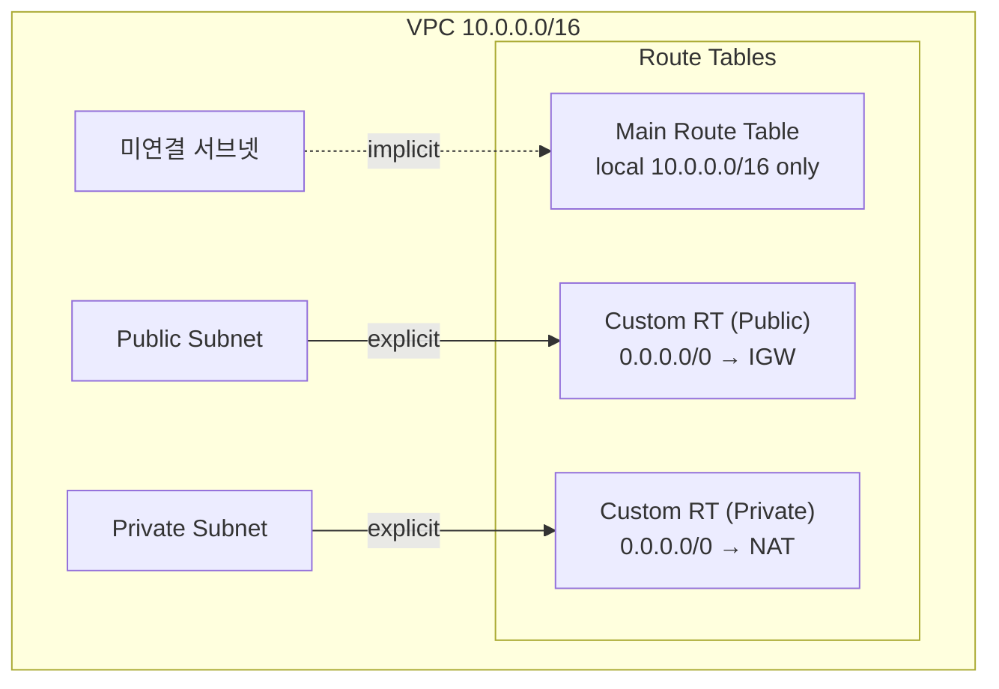

# AWS 라우팅 테이블

## 라우팅 테이블이 하는 일

VPC 안에서 트래픽이 어디로 흘러갈지 결정하는 규칙표다. 서브넷에 있는 ENI에서 패킷이 나갈 때, AWS의 가상 라우터는 라우팅 테이블을 읽고 목적지에 해당하는 라우트를 찾아 다음 홉을 정한다. 물리적인 라우터 장비가 어딘가에 있는 게 아니라, VPC가 깔린 SDN(소프트웨어 정의 네트워크) 자체가 이 테이블을 참조해서 포워딩한다.

라우팅 테이블은 VPC에 종속된다. VPC를 만들면 자동으로 Main Route Table 하나가 같이 생기고, 필요하면 그 안에서 Custom Route Table을 더 만들 수 있다. 테이블은 VPC 단위가 아니라 서브넷 단위로 적용된다. 같은 VPC 안에서도 서브넷마다 다른 라우팅 테이블을 붙여 퍼블릭/프라이빗을 나누는 구조가 일반적이다.

## Main Route Table과 Custom Route Table

VPC를 처음 만들면 Main Route Table이 자동으로 생긴다. 이 테이블은 두 가지 점에서 다르다.

- 서브넷을 만들 때 라우팅 테이블을 명시하지 않으면 Main RT가 암묵적으로 연결된다.
- 삭제하려면 다른 테이블을 Main으로 승격(Set as main route table)시킨 다음에야 가능하다.

Custom Route Table은 명시적으로 만들어서 특정 서브넷에 붙여 쓰는 테이블이다. 운영 환경에서는 거의 항상 Custom RT를 만들어 쓴다. 이유는 안전 때문이다. Main RT에 실수로 `0.0.0.0/0 → IGW` 라우트를 넣으면 그 VPC 안의 미연결 서브넷이 전부 퍼블릭이 된다. 신규로 서브넷을 만들 때 Associate를 빼먹어도 자동으로 인터넷에 노출된다는 뜻이다.

표준 패턴은 이렇다.

- Main RT는 비워 두거나 Local 라우트만 둔다. 외부 라우트는 절대 추가하지 않는다.
- Public Subnet용 Custom RT를 만들고 `0.0.0.0/0 → IGW` 라우트를 넣는다.
- Private Subnet용 Custom RT를 만들고 `0.0.0.0/0 → NAT GW` 라우트를 넣는다.
- 모든 서브넷은 명시적으로 RT에 Associate한다.

이렇게 하면 Associate를 빼먹은 서브넷이 생겨도 Main RT가 비어 있으니 안전한 격리 상태로 남는다.

## 명시적 연결과 암묵적 연결

서브넷이 라우팅 테이블에 붙는 방식은 두 가지다.

- **Explicit association**: 콘솔에서 "Edit subnet associations"로 직접 연결하거나, Terraform의 `aws_route_table_association`으로 붙인 경우. RT 콘솔에서 서브넷이 목록에 보인다.
- **Implicit association**: 명시 연결이 없는 서브넷은 자동으로 Main RT에 묶인다. RT 콘솔의 "Subnet associations" 탭에서 "Subnets without explicit associations"로 표시된다.

이 둘이 보안적으로 동일하지 않다. 명시 연결은 IaC에 흔적이 남고 실수로 끊어지면 알아챌 수 있다. 암묵 연결은 어디에도 안 보여서 RT가 바뀌면 서브넷의 라우팅이 통째로 같이 변한다. Main RT를 비워 두는 이유가 여기에 있다.



## Local 라우트의 특수성

모든 라우팅 테이블에는 VPC CIDR을 대상으로 하는 `local` 라우트가 자동으로 들어간다. Target은 `local`, 다음 홉은 가상 라우터 자기 자신이다. 이 라우트의 특징은 다음과 같다.

- 자동 생성되며 콘솔에서도 Terraform에서도 직접 만들 필요가 없다.
- 삭제할 수 없다. 콘솔에서 Delete 버튼이 비활성화되어 있다.
- VPC의 Secondary CIDR을 추가하면 그 CIDR도 자동으로 Local 라우트로 들어간다.
- 같은 VPC 안 서브넷끼리의 통신은 전부 이 Local 라우트로 처리된다. 라우트를 따로 추가할 일이 없다.

Local 라우트 자체는 못 지우지만 2021년 이후에는 Local 라우트의 Target을 변경할 수는 있다. 예를 들어 VPC 안에서 모든 서브넷 간 트래픽을 미들박스(인스펙션 인스턴스의 ENI)로 강제로 보내고 싶다면 Local 라우트의 Target을 ENI로 바꿔서 우회시킬 수 있다. 흔히 쓰는 기능은 아니고, 트래픽 인스펙션 어플라이언스를 둘 때 쓴다. 평소에는 건드릴 일이 없다.

VPC Peering이나 TGW로 연결된 다른 VPC의 CIDR은 Local이 아니다. 별도 라우트를 명시적으로 추가해야 한다. "같은 회사 VPC끼리는 알아서 통신되겠지"라는 착각으로 라우트를 빼먹는 사고가 가장 흔하다.

## Longest Prefix Match 규칙

라우팅 테이블에 여러 라우트가 있을 때, AWS 라우터는 가장 구체적인(prefix가 긴) 라우트를 우선한다. 일반적인 IP 라우팅 규칙과 동일하다.

예를 들어 다음 라우트가 같은 테이블에 있다고 하자.

```
10.0.0.0/16    → local
0.0.0.0/0      → nat-0abc
10.50.0.0/16   → pcx-0def (VPC Peering)
10.50.5.0/24   → eni-0xyz
```

목적지 `10.50.5.10`으로 가는 패킷은 `/24`가 매치되므로 ENI로 간다. `10.50.99.1`은 `/24`에 안 걸려 `/16`이 매치되어 Peering으로 간다. `8.8.8.8`은 어디에도 안 걸려 `0.0.0.0/0` 디폴트 라우트를 타고 NAT으로 간다.

같은 prefix 길이의 라우트가 동시에 존재하면 우선순위가 정해져 있다. AWS는 라우트 종류별로 우선순위를 부여한다. 직접 입력한 정적 라우트가 Propagated 라우트보다 우선하고, 같은 정적 라우트 안에서는 더 구체적인 prefix가 이긴다. 자세한 우선순위는 [VPC 라우팅 우선순위 문서](https://docs.aws.amazon.com/vpc/latest/userguide/route-table-options.html#route-tables-priority)에 표로 나와 있다. 실무에서는 prefix 길이만 의식해도 거의 충돌이 안 난다.

## 라우팅 대상 종류

라우트의 Target에 올 수 있는 것들이다. 운영하면서 한 번씩은 다 마주친다.

- **Internet Gateway (igw-...)**: VPC를 인터넷에 연결한다. 퍼블릭 서브넷에서 `0.0.0.0/0 → IGW`로 쓴다. IPv4와 IPv6 모두 처리한다.
- **NAT Gateway (nat-...)**: 프라이빗 서브넷의 아웃바운드 인터넷용. `0.0.0.0/0 → NAT`. IPv4 전용이다.
- **NAT Instance / ENI (eni-...)**: NAT 인스턴스를 직접 운영하거나, 트래픽을 특정 어플라이언스로 보낼 때. Target에 ENI ID를 직접 지정한다. ENI 라우팅은 미들박스를 끼우는 경우에 쓴다.
- **VPC Peering Connection (pcx-...)**: 다른 VPC로 가는 라우트. 상대 VPC의 CIDR을 prefix로 적는다.
- **Transit Gateway (tgw-...)**: TGW Attachment를 통해 다른 VPC, 온프레미스, VPN과 통신할 때. 여러 네트워크가 hub-and-spoke로 묶일 때 쓴다.
- **Virtual Private Gateway (vgw-...)**: Site-to-Site VPN이나 Direct Connect로 온프레미스와 연결할 때. TGW를 쓰지 않는 단순 구성에서 등장한다.
- **VPC Endpoint (vpce-...)**: Gateway Endpoint(S3, DynamoDB)와 Gateway Load Balancer Endpoint에 쓴다. Interface Endpoint는 ENI를 통해 동작하므로 라우팅 테이블이 아닌 DNS로 해결된다.
- **Carrier Gateway (cagw-...)**: Wavelength Zone에서 통신사 네트워크로 나갈 때. 일반 리전에서는 안 쓴다.
- **Egress-Only Internet Gateway (eigw-...)**: IPv6 전용 아웃바운드 게이트웨이. `::/0 → eigw-...`. IPv4의 NAT GW에 대응하는 역할인데 무료다. 인바운드는 차단된다.
- **Network Interface (Outpost LGW)**: Outposts의 Local Gateway. 일반 리전에는 등장하지 않는다.

prefix는 IPv4 CIDR, IPv6 CIDR, 또는 Managed Prefix List ID(`pl-...`)로 적을 수 있다. Managed Prefix List는 여러 CIDR을 묶어 이름으로 관리하는 기능이다. 예를 들어 사내 IP 대역이 6개 CIDR로 흩어져 있다면 Prefix List로 묶어서 라우트 하나로 처리한다.

## 퍼블릭/프라이빗 서브넷의 진짜 정의

서브넷 자체에는 "Public"이나 "Private" 속성이 없다. 콘솔에서 서브넷을 들여다봐도 그런 토글이 없다. 둘의 차이는 결국 어떤 라우팅 테이블에 붙어 있느냐로 결정된다.

- **퍼블릭 서브넷**: 라우팅 테이블에 `0.0.0.0/0 → IGW` 라우트가 있는 서브넷.
- **프라이빗 서브넷**: 그런 라우트가 없거나, NAT GW 또는 다른 곳을 가리키는 서브넷.

여기에 인스턴스 단에서 Public IP나 EIP가 붙어야 양방향 인터넷 통신이 된다. IGW 라우트만 있고 Public IP가 없으면 응답 패킷이 돌아오지 못해서 사실상 격리된다. 반대로 EIP가 있어도 라우팅 테이블에 IGW 라우트가 없으면 패킷이 나가지 못한다. 둘 다 있어야 동작한다.

운영하다 보면 "프라이빗 서브넷이라더니 인터넷이 왜 되지" 같은 의문이 생기는데, 라우팅 테이블을 까보면 항상 답이 나온다. 서브넷 이름이나 태그는 사람이 붙인 이름표일 뿐이고, 실제 동작은 RT가 결정한다.

## Route Propagation과 정적 라우팅

라우트가 테이블에 들어오는 방법은 두 가지다.

- **Static route(정적 라우트)**: 사람이 콘솔/CLI/Terraform으로 직접 넣은 라우트. 명시적으로 prefix와 target을 지정한다.
- **Propagated route(전파된 라우트)**: VGW나 TGW가 BGP나 자체 라우팅을 통해 자동으로 채워 넣는 라우트.

Propagation은 주로 두 곳에서 본다. 첫째, VPN을 VGW로 연결할 때 라우팅 테이블의 "Route Propagation" 항목을 활성화하면 온프레미스에서 광고하는 BGP prefix가 자동으로 들어온다. 직접 손으로 prefix를 적어 넣을 필요가 없어진다. 둘째, TGW Route Table은 자체적으로 Propagation을 지원해서 Attachment에 묶인 VPC CIDR을 자동으로 학습한다.

Propagated 라우트는 RT 콘솔에서 "Propagated: Yes" 표시가 붙고, 같은 prefix에 정적 라우트가 있으면 정적이 우선한다. 운영 환경에서 BGP가 흔들려서 라우트가 잠시 사라지더라도 정적 라우트가 백업으로 남도록 만드는 패턴도 있다.

정적 라우팅의 단점은 토폴로지가 바뀔 때마다 사람이 일일이 추가해야 한다는 점이다. VPC 50개를 TGW로 묶어 놓고 정적 라우트로 운영하면 한 VPC 추가에 모든 RT를 손봐야 한다. 그래서 TGW에서는 Propagation을 켜고 정적 라우트는 예외만 처리하는 게 보통이다.

## 블랙홀 라우트

Target으로 지정한 리소스가 사라지면 그 라우트는 `blackhole` 상태가 된다. 콘솔에서 Status가 "Blackhole"이라고 빨간색으로 표시된다. 라우트는 살아 있지만 매칭된 패킷은 어디로도 못 가고 버려진다.

자주 발생하는 케이스다.

- NAT Gateway를 비용 줄이려고 삭제했는데 라우팅 테이블의 `0.0.0.0/0 → nat-...` 라우트가 남아 있다. 프라이빗 서브넷의 모든 아웃바운드가 끊긴다. 새 NAT GW를 만들어 라우트를 교체하거나, 임시로 라우트를 지워야 한다.
- VPC Peering을 삭제했는데 `10.50.0.0/16 → pcx-...` 라우트가 그대로다. 해당 prefix로 가는 통신이 전부 죽는다.
- VGW를 분리했는데 Propagated 라우트가 정리되지 않고 남았다. 일시적인 잔존 후에 자동 정리되지만, 그 사이에 트래픽이 새는 경우가 있다.
- TGW Attachment를 떼었는데 RT에 정적 라우트가 남았다.

디버깅할 때는 RT 콘솔의 Routes 탭에서 Status 컬럼을 먼저 확인한다. "Active" 외의 상태가 보이면 그게 원인이다. AWS CLI로 보려면 이렇게 한다.

```bash
aws ec2 describe-route-tables \
  --route-table-ids rtb-0abc1234 \
  --query 'RouteTables[0].Routes[?State==`blackhole`]'
```

블랙홀 라우트가 발견되면 Target을 새 리소스로 교체하거나 라우트 자체를 지운다. 같은 prefix에 살아 있는 라우트가 더 구체적이라면 그쪽으로 우회되므로 통신은 살아나지만, Longest Prefix Match에서 블랙홀이 이기는 구성이라면 그대로 트래픽이 끊긴다.

## VPC Endpoint Gateway 타입의 prefix list 자동 등록

S3와 DynamoDB용 Gateway Endpoint를 만들 때는 라우팅 테이블 동작이 특이하다. Endpoint 생성 시 어떤 라우팅 테이블에 연결할지 선택하는데, 그 시점에 AWS가 자동으로 prefix list를 RT에 라우트로 박아 넣는다.

예를 들어 S3 Gateway Endpoint를 ap-northeast-2 리전에 만들고 Private RT를 선택하면, 그 RT에 다음과 같은 라우트가 추가된다.

```
pl-78a54011 (com.amazonaws.ap-northeast-2.s3) → vpce-0abc1234
```

`pl-...`은 S3 서비스의 CIDR을 모아 놓은 AWS 관리형 Prefix List다. 이 라우트가 추가되는 순간부터 해당 서브넷에서 S3로 가는 모든 트래픽은 NAT GW나 IGW를 거치지 않고 Endpoint로 직행한다.

여기서 흔히 빠지는 함정이 두 가지 있다.

첫째, S3 Gateway Endpoint를 끄면 prefix list 라우트도 RT에서 자동으로 사라진다. 그러면 그 순간부터 S3 트래픽은 다시 `0.0.0.0/0` 라우트를 타고 NAT으로 흘러간다. 트래픽이 NAT GW로 몰리면 데이터 처리 요금이 한꺼번에 늘어난다. 비용 절감 목적으로 Endpoint를 만들었다가 누가 실수로 떼면 청구서가 폭증한다.

둘째, Endpoint Policy 또는 S3 버킷 정책에서 Endpoint를 통한 접근만 허용하도록 설정했다면, Endpoint를 끄는 순간 어플리케이션의 S3 호출이 전부 AccessDenied로 실패한다. NAT으로 빠져나가는 트래픽의 출발지 IP가 버킷 정책의 조건을 통과 못 하기 때문이다. 변경 영향 범위를 미리 본 다음에 떼야 한다.

Interface Endpoint(privatelink)는 prefix list가 들어오지 않는다. ENI 기반이라 DNS resolution으로 동작하기 때문에 라우팅 테이블에는 흔적이 없다. RT만 봐서는 Interface Endpoint를 쓰는지 알 수 없다.

## 서브넷 분리 운영 시 RT 설계 패턴

서브넷을 어떻게 자르느냐와 RT를 어떻게 묶느냐는 같이 결정된다. 실무에서 자주 쓰는 패턴 몇 가지다.

**3-tier 기본 패턴.** Public, App(Private), DB(Private) 3계층으로 자른다. RT는 보통 두 개다. Public 서브넷은 IGW를 가리키는 Public RT를 공유하고, App/DB 서브넷은 NAT을 가리키는 Private RT를 공유한다. DB 계층까지 NAT을 둘 이유가 없으면 DB용 RT를 따로 만들어 외부 라우트를 빼고 Local만 둔다. DB가 실수로 인터넷으로 패키지 다운로드를 시도하는 것까지 막힌다.

**AZ별 NAT 분리 패턴.** AZ a, c, d 세 곳에 각각 NAT GW를 두고, 각 AZ의 Private 서브넷은 같은 AZ의 NAT을 가리키는 RT에 묶는다. RT가 AZ 수만큼 늘어난다. AZ 간 데이터 전송 비용을 피하기 위한 구성이고, AZ 한 곳에 NAT 장애가 나도 다른 AZ는 살아남는다.

**Inspection VPC 패턴.** Transit Gateway 뒤에 인스펙션용 VPC를 두고 모든 VPC 트래픽이 그곳을 거치게 한다. RT 설계가 복잡해진다. TGW Route Table을 환경별로 쪼개고, 인스펙션 VPC의 내부 RT에서 ENI로 트래픽을 강제로 보낸 다음 다시 TGW로 돌려보낸다.

**개발/운영 환경 분리 RT.** 같은 VPC에 dev/staging이 같이 살아야 한다면 서브넷을 환경별로 자르고 RT도 별도로 둔다. dev는 인터넷 접근을 막고 stg는 허용하는 식의 차별화가 가능하다. 보안 그룹과 NACL로 같은 일을 할 수도 있지만 RT 수준에서 막아 두면 실수로 SG가 열려도 라우트 자체가 없어서 통신이 안 된다.

## Terraform 리소스 예제

라우팅 테이블을 IaC로 다룰 때 자주 쓰는 리소스는 세 개다.

```hcl
resource "aws_vpc" "main" {
  cidr_block           = "10.0.0.0/16"
  enable_dns_hostnames = true
  enable_dns_support   = true
}

resource "aws_internet_gateway" "this" {
  vpc_id = aws_vpc.main.id
}

resource "aws_subnet" "public" {
  count                   = 2
  vpc_id                  = aws_vpc.main.id
  cidr_block              = cidrsubnet(aws_vpc.main.cidr_block, 8, count.index)
  availability_zone       = element(["ap-northeast-2a", "ap-northeast-2c"], count.index)
  map_public_ip_on_launch = true
  tags = { Name = "public-${count.index}" }
}

resource "aws_subnet" "private" {
  count             = 2
  vpc_id            = aws_vpc.main.id
  cidr_block        = cidrsubnet(aws_vpc.main.cidr_block, 8, count.index + 10)
  availability_zone = element(["ap-northeast-2a", "ap-northeast-2c"], count.index)
  tags = { Name = "private-${count.index}" }
}

resource "aws_eip" "nat" {
  count  = 2
  domain = "vpc"
}

resource "aws_nat_gateway" "this" {
  count         = 2
  allocation_id = aws_eip.nat[count.index].id
  subnet_id     = aws_subnet.public[count.index].id
}
```

여기까지가 사전 준비. RT는 이렇게 만든다.

```hcl
resource "aws_route_table" "public" {
  vpc_id = aws_vpc.main.id
  tags   = { Name = "public-rt" }
}

resource "aws_route" "public_default" {
  route_table_id         = aws_route_table.public.id
  destination_cidr_block = "0.0.0.0/0"
  gateway_id             = aws_internet_gateway.this.id
}

resource "aws_route_table_association" "public" {
  count          = 2
  subnet_id      = aws_subnet.public[count.index].id
  route_table_id = aws_route_table.public.id
}

resource "aws_route_table" "private" {
  count  = 2
  vpc_id = aws_vpc.main.id
  tags   = { Name = "private-rt-${count.index}" }
}

resource "aws_route" "private_default" {
  count                  = 2
  route_table_id         = aws_route_table.private[count.index].id
  destination_cidr_block = "0.0.0.0/0"
  nat_gateway_id         = aws_nat_gateway.this[count.index].id
}

resource "aws_route_table_association" "private" {
  count          = 2
  subnet_id      = aws_subnet.private[count.index].id
  route_table_id = aws_route_table.private[count.index].id
}
```

Public RT는 하나만 만들어 두 서브넷에 같이 붙이고, Private RT는 AZ별 NAT을 가리키게 두 개를 만들었다. AZ a의 프라이빗 서브넷은 AZ a의 NAT을 가리키고, AZ c도 마찬가지로 같은 AZ의 NAT을 본다.

`aws_route_table`의 inline `route { ... }` 블록을 쓰는 방법도 있지만, 라우트가 늘어나면 충돌이 잘 난다. Terraform이 정적 라우트만 알고 있는데 Endpoint가 prefix list 라우트를 끼워 넣으면 매번 plan에서 "extra route를 지우겠다"고 시도한다. inline 블록과 별도 `aws_route` 리소스를 섞어 쓰지 말고, RT는 메타데이터만 정의하고 라우트는 항상 `aws_route`로 빼는 게 안전하다.

S3 Gateway Endpoint를 추가할 때는 RT를 넘겨준다.

```hcl
resource "aws_vpc_endpoint" "s3" {
  vpc_id            = aws_vpc.main.id
  service_name      = "com.amazonaws.ap-northeast-2.s3"
  vpc_endpoint_type = "Gateway"
  route_table_ids   = aws_route_table.private[*].id
}
```

이 시점에 각 Private RT에 prefix list 라우트가 자동으로 들어간다. Terraform state에는 들어가지 않는다. `aws_route` 리소스로 별도 관리하지 않으니 state 충돌은 없지만, 콘솔에서 RT를 보면 Terraform 외의 라우트가 자동으로 추가된 것처럼 보인다. 이게 정상 동작이다.

VPC Peering이나 TGW로 가는 라우트는 별개 prefix를 다 적어 줘야 한다.

```hcl
resource "aws_route" "to_peer_vpc" {
  for_each                  = toset(aws_route_table.private[*].id)
  route_table_id            = each.value
  destination_cidr_block    = "10.50.0.0/16"
  vpc_peering_connection_id = aws_vpc_peering_connection.peer.id
}

resource "aws_route" "to_tgw" {
  for_each               = toset(aws_route_table.private[*].id)
  route_table_id         = each.value
  destination_cidr_block = "10.100.0.0/16"
  transit_gateway_id     = aws_ec2_transit_gateway.this.id
}
```

`for_each`로 모든 Private RT에 같은 라우트를 한 번에 박는 방식이다. RT가 늘어나도 자동으로 적용된다.

## 트러블슈팅 실전 사례

운영 중에 실제로 겪는 라우팅 테이블 관련 장애들이다.

### 사례 1: 프라이빗 EC2에서 NAT을 못 탄다

증상: 프라이빗 서브넷의 EC2에서 `yum update`, `apt update`, `curl https://...`가 전부 타임아웃이다. 보안 그룹은 outbound 전체 허용으로 잡혀 있다.

원인 후보 순서대로 점검한다.

1. 그 서브넷이 어떤 RT에 붙어 있나? `aws ec2 describe-subnets`로 보거나 콘솔에서 확인한다. 명시적 연결이 없으면 Main RT에 묶여 있다. Main RT를 비워 두는 컨벤션을 따랐다면 외부 라우트가 없으니 당연히 안 나간다.
2. RT에 `0.0.0.0/0 → nat-...` 라우트가 있나? 라우트는 있는데 Status가 blackhole이면 NAT GW가 삭제된 상태다.
3. NAT GW 자체의 상태는? `available`인가 `failed`인가. EIP가 떨어졌거나 NAT GW가 만들어진 서브넷이 퍼블릭이 아니면 동작 안 한다.
4. NAT GW가 위치한 퍼블릭 서브넷의 RT에 `0.0.0.0/0 → IGW` 라우트가 있나? 이게 없으면 NAT GW 자체가 인터넷으로 못 나간다. 의외로 자주 빠뜨린다.

라우팅 문제는 RT를 위에서부터 끝까지 따라가면 거의 잡힌다.

### 사례 2: RDS에 접속이 안 된다

증상: 같은 VPC 안의 EC2에서 RDS로 접속하려는데 타임아웃. 보안 그룹은 EC2 보안 그룹에서 인바운드를 허용하도록 잡았다.

이 경우는 보통 라우팅이 아니라 보안 그룹 문제다. 같은 VPC 안에서는 Local 라우트가 자동으로 동작하므로 RT 때문에 통신이 막힐 일은 거의 없다. 하지만 다음 케이스는 RT가 원인이다.

- EC2가 다른 VPC에 있고 Peering으로 묶었는데 RT에 Peering 라우트를 안 넣었다. 양쪽 VPC 모두에 라우트가 필요하다. 한 쪽만 넣으면 요청은 가는데 응답이 못 돌아온다.
- TGW 뒤에 있는 RDS다. TGW Attachment는 만들었는데 VPC RT에 TGW로 가는 라우트를 빠뜨렸다.
- DB가 Outposts나 다른 리전에 있고 VPN을 거친다. VPN을 종단하는 VGW의 Route Propagation이 꺼져 있거나, 온프레미스에서 광고하는 prefix가 RT에 들어오지 않았다.

증상이 "어떤 EC2는 되고 어떤 EC2는 안 된다"라면 서브넷별 RT 차이를 의심한다. 동일한 RT라면 SG 또는 NACL 문제, 다른 RT라면 라우트 차이일 가능성이 높다.

### 사례 3: S3 Gateway Endpoint를 만들었더니 갑자기 다른 트래픽도 변했다

증상: 프라이빗 서브넷에 S3 Gateway Endpoint를 추가한 직후, 모니터링상 NAT GW 처리량이 급감했다. 동시에 일부 어플리케이션의 S3 업로드가 AccessDenied로 실패하기 시작했다.

원인: 첫째, Endpoint 추가로 RT에 prefix list 라우트가 자동으로 박혔다. S3 트래픽이 NAT을 안 거치고 Endpoint로 직행하니 NAT 사용량이 떨어지는 게 정상이다. 둘째, AccessDenied는 버킷 정책에 `aws:SourceVpce` 조건이 걸려 있고 Endpoint ID 화이트리스트에 새로 만든 Endpoint가 없어서다. Endpoint ID는 새로 만들 때마다 바뀌므로 IaC로 만들었다면 출력값을 받아 버킷 정책을 같이 업데이트해야 한다.

다른 함정: 어플리케이션이 S3에 IAM Role로 접근할 때 STS 토큰을 가져오는 호출이 있다. STS는 S3가 아니다. STS Interface Endpoint를 따로 만들거나 NAT을 통해 나가야 한다. S3 Endpoint만 만들고 NAT을 떼어 버리면 STS 호출이 끊긴다.

### 사례 4: TGW Attachment 후에 통신이 안 된다

증상: TGW에 새 VPC를 Attachment로 붙였다. TGW Route Table에서 두 VPC가 서로 보인다. 그런데 통신이 안 된다.

원인: VPC 내부의 라우팅 테이블에 TGW로 가는 라우트가 없다. TGW Attachment는 TGW 쪽의 라우팅만 설정해 준다. VPC 안에서 TGW로 트래픽을 보내려면 VPC의 서브넷 RT에 `상대VPC CIDR → tgw-...` 라우트를 사람이 직접 넣어야 한다.

흔히 빠지는 부분: Attachment 생성 시 "Default route table propagation/association" 옵션이 활성화되어 있어서 TGW 쪽은 자동으로 처리된다. 그래서 한 번 성공적으로 TGW를 써본 사람은 다음번에도 자동으로 되리라 믿는다. VPC RT는 자동이 아니다. Terraform으로 관리한다면 새 VPC를 추가할 때 양쪽 VPC의 모든 RT에 라우트를 추가하는 모듈을 만들어 두는 게 안전하다.

```bash
# Attachment 후 통신 안 될 때 점검
aws ec2 describe-route-tables --filters "Name=vpc-id,Values=vpc-0abc" \
  --query 'RouteTables[].Routes[?TransitGatewayId!=null]'
```

이 명령으로 TGW 라우트가 어느 RT에도 없다면 RT마다 라우트를 추가한다.

### 사례 5: Route Propagation으로 라우트가 너무 많이 들어와 한도를 친다

증상: VGW Propagation을 켜고 온프레미스에서 BGP로 prefix를 광고 받기 시작했더니, 어느 순간부터 신규 라우트 추가가 실패한다.

원인: VPC 라우팅 테이블당 라우트 수 한도가 있다. 기본 50개고, 증가 요청해서 최대 1000까지 늘릴 수 있는데, 한도를 키울수록 라우터 성능에 영향이 있어 권장하지는 않는다. 온프레미스 BGP에서 광고하는 prefix를 정리 안 하고 그대로 받으면 수십, 수백 개까지 늘어난다.

해결책: 온프레미스 라우터에서 광고 prefix를 묶어서 보내거나(Summarization), Customer Gateway 쪽에서 prefix list를 거른다. VGW Propagation을 끄고 필요한 prefix만 정적으로 받는 것도 방법이다.

## 라우팅 테이블 한도

VPC 라우팅 관련 한도는 운영 규모가 커지면 자주 부딪힌다.

| 항목 | 기본값 | 조정 가능 한도 |
|------|--------|---------------|
| VPC당 라우팅 테이블 수 | 200 | 요청 시 증가 |
| 라우팅 테이블당 라우트 수 (정적+propagated 합산) | 50 | 최대 1000 |
| 라우팅 테이블당 BGP propagated 라우트 수 | 100 | 조정 불가 |
| VPC당 IPv4 CIDR 블록 수 | 5 | 50 |
| VPC당 IPv6 CIDR 블록 수 | 1 | 5 |

라우트 수 한도를 늘릴 때는 Service Quotas 콘솔에서 "Routes per route table" 항목을 찾아 증가 요청을 넣는다. AWS 권장 한도는 100~125이고 그 이상은 성능 저하가 있을 수 있다는 안내가 붙는다.

실무에서는 한도를 늘리기 전에 prefix summarization, Prefix List 활용, TGW를 통한 라우팅 통합을 먼저 검토한다. 한도를 늘리는 건 가능한 마지막 수단이다. 라우트가 수백 개가 되면 사람이 읽고 디버깅하기도 어렵다.

## RT 상태를 확인하는 CLI 명령

운영 중에 RT를 빠르게 보는 명령들이다.

```bash
# 특정 VPC의 모든 RT 목록과 라우트
aws ec2 describe-route-tables --filters "Name=vpc-id,Values=vpc-0abc1234"

# 특정 서브넷이 어떤 RT에 묶여 있는지
aws ec2 describe-route-tables \
  --filters "Name=association.subnet-id,Values=subnet-0xyz" \
  --query 'RouteTables[].RouteTableId'

# 블랙홀 라우트만 추출
aws ec2 describe-route-tables \
  --query 'RouteTables[].Routes[?State==`blackhole`]'

# Main RT만 찾기
aws ec2 describe-route-tables \
  --filters "Name=association.main,Values=true" \
  --query 'RouteTables[].{VPC:VpcId,RT:RouteTableId}'

# Reachability Analyzer로 라우팅 경로 검증
aws ec2 create-network-insights-path \
  --source eni-0src --destination eni-0dst \
  --protocol tcp --destination-port 443
```

마지막 줄의 Reachability Analyzer는 두 ENI 사이의 라우팅이 통과 가능한지 AWS가 시뮬레이션해 준다. RT, SG, NACL, Endpoint Policy를 모두 평가해서 어디서 막히는지 알려준다. 라우팅 문제를 디버깅할 때 가장 유용하다. 분석 한 번에 0.1 USD가 들지만 사람이 들여다보는 시간 대비 이득이 크다.
