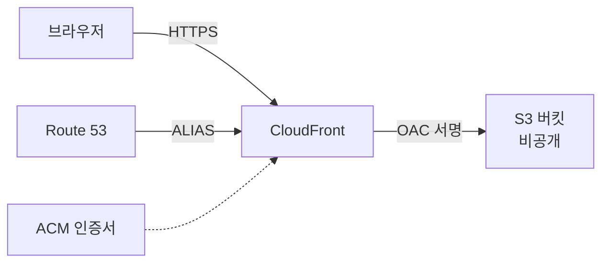

# S3 정적 웹사이트 호스팅

## 시작하기 전에

S3 정적 웹 호스팅은 두 가지 방식이 있다. 하나는 S3가 직접 제공하는 Website Hosting 기능이고, 다른 하나는 S3를 비공개 버킷으로 두고 CloudFront 앞단에 붙이는 방식이다. 실무에서 진지하게 운영하는 사이트는 거의 다 후자다. 앞쪽은 학습용이나 임시 데모용으로만 쓴다고 봐도 된다. 이 문서는 두 방식을 다 다루는데, 왜 후자로 가야 하는지를 이해하는 게 먼저다.

먼저 S3 정적 웹 호스팅을 켜는 방법을 보고, 거기서 막히는 지점을 짚은 다음, CloudFront + OAC 구성으로 옮겨가는 흐름으로 정리한다.

## 정적 웹 호스팅 활성화

S3 콘솔에서 버킷을 만든 다음 Properties 탭 하단의 "Static website hosting"을 Enable로 바꾸면 된다. 활성화하면 두 가지를 묻는다.

- **Index document**: 기본 진입 파일 이름. 보통 `index.html`로 둔다.
- **Error document**: 404 같은 에러 시 응답할 파일. 보통 `error.html`이나 `index.html`(SPA의 경우).

이 두 값이 입력되면 페이지 하단에 웹사이트 엔드포인트 URL이 표시된다. 형식은 리전마다 살짝 다르다.

```
# us-east-1
http://bucket-name.s3-website-us-east-1.amazonaws.com

# ap-northeast-2 (서울)
http://bucket-name.s3-website.ap-northeast-2.amazonaws.com
```

us-east-1만 하이픈(`-`)을 쓰고 나머지는 점(`.`)을 쓴다는 점이 함정이다. CloudFront에서 Origin Domain Name으로 이 주소를 박을 때 잘못 쓰면 DNS 조회가 안 된다.

CLI로 켜는 방법은 이렇다.

```bash
aws s3api put-bucket-website \
  --bucket my-site-bucket \
  --website-configuration '{
    "IndexDocument": {"Suffix": "index.html"},
    "ErrorDocument": {"Key": "error.html"}
  }'
```

여기까지 하고 브라우저로 들어가면 `403 Forbidden`이 뜬다. 호스팅 기능은 켰지만 객체 자체가 비공개라서 그렇다. 다음 단계가 퍼블릭 액세스 허용이다.

## 퍼블릭 액세스 차단 해제와 버킷 정책

S3는 2018년부터 신규 버킷에 "Block all public access"가 기본으로 켜져 있다. 정적 웹 호스팅을 쓰려면 이걸 풀어야 하는데, 무지성으로 다 끄면 안 된다. 네 개의 옵션이 있다.

- Block public access to buckets and objects granted through new ACLs
- Block public access to buckets and objects granted through any ACLs
- Block public access to buckets and objects granted through new public bucket or access point policies
- Block public access to buckets and objects granted through any public bucket or access point policies

정적 웹 호스팅에 필요한 건 세 번째와 네 번째(버킷 정책 관련)만 해제하는 것이다. ACL 관련 두 개는 켜둔 채로 둔다. ACL은 2023년부터 신규 버킷에서 기본 비활성화 상태이고, 정책 기반으로만 권한을 부여하는 게 표준이다.

콘솔에서 Permissions → Block public access → Edit에서 정책 관련 두 항목만 해제한다. 그 다음 버킷 정책을 붙인다.

```json
{
  "Version": "2012-10-17",
  "Statement": [
    {
      "Sid": "PublicReadGetObject",
      "Effect": "Allow",
      "Principal": "*",
      "Action": "s3:GetObject",
      "Resource": "arn:aws:s3:::my-site-bucket/*"
    }
  ]
}
```

`Resource`의 끝에 `/*`가 들어간다는 점이 중요하다. `arn:aws:s3:::my-site-bucket`(슬래시 없음)은 버킷 자체에 대한 권한이고, `arn:aws:s3:::my-site-bucket/*`은 그 안의 객체에 대한 권한이다. 슬래시를 빼먹으면 ListBucket이 필요한 경우엔 적용되지만 GetObject는 통하지 않는다. 정적 사이트 권한 줄 때 이 실수가 가장 흔하다.

`Principal: "*"`은 익명 접근을 허용한다는 뜻이다. SCP(Service Control Policy)에서 익명 접근을 막아둔 조직 계정에서는 이 정책을 붙이는 순간 `AccessDenied`가 뜬다. 정책 시뮬레이터로 검증해도 통과하는데 실제론 막힌다면 SCP나 Permission Boundary를 확인해야 한다.

## 웹사이트 엔드포인트 vs REST 엔드포인트

같은 버킷에 두 종류 엔드포인트가 동시에 존재한다. 둘이 동작하는 방식이 다르다.

| 항목 | 웹사이트 엔드포인트 | REST 엔드포인트 |
|------|---------------------|------------------|
| 주소 | `bucket.s3-website-region.amazonaws.com` | `bucket.s3.region.amazonaws.com` |
| 프로토콜 | HTTP만 | HTTP/HTTPS |
| 인덱스 문서 자동 매핑 | O (`/foo/` → `/foo/index.html`) | X |
| 에러 문서 라우팅 | O | X |
| 리디렉션 규칙 | O | X |
| 인증 | 익명만 | SigV4 서명 |
| CORS 헤더 처리 | 웹사이트 설정 기반 | 버킷 CORS 설정 기반 |

REST 엔드포인트로 `/foo/`를 호출하면 그냥 객체가 없다고 응답한다. 웹사이트 엔드포인트는 `/foo/index.html`을 자동으로 찾는다. 디렉터리 인덱스 동작이 필요하면 웹사이트 엔드포인트를 써야 한다.

CloudFront Origin으로 박을 때 어느 쪽을 선택하느냐가 OAC를 쓸 수 있느냐를 결정한다. OAC는 REST 엔드포인트에서만 동작한다. 웹사이트 엔드포인트는 익명 접근만 받기 때문에 OAC로 서명된 요청을 처리하지 못한다.

## HTTPS 한계와 CloudFront 연동

S3 웹사이트 엔드포인트는 HTTP만 지원한다. ACM 인증서를 붙일 수 없고, 커스텀 도메인을 직접 연결하려고 해도 인증서 없이 평문으로만 서비스된다. 요즘 브라우저는 HTTPS가 아니면 SEO도 깎이고 보안 경고도 띄운다. 그래서 거의 모든 운영 사이트는 CloudFront를 앞에 둔다.

CloudFront를 붙이면 얻는 게 이렇다.

- HTTPS 지원(ACM 무료 인증서 사용)
- 전 세계 엣지 캐싱
- 커스텀 도메인 + SSL
- WAF 연동
- HTTP/2, HTTP/3 지원
- 압축(gzip, brotli) 자동 처리

CloudFront에서 Origin으로 S3를 가리키는 방법은 두 가지다.

1. **S3 REST 엔드포인트 + OAC**: 버킷은 비공개로 유지하고 CloudFront만 접근 권한을 가진다. 권장 방식.
2. **S3 웹사이트 엔드포인트**: 버킷을 공개로 두고 CloudFront가 일반 HTTP 오리진으로 접근. 디렉터리 인덱스나 리디렉션 규칙이 필요한 레거시 케이스에서만.



## OAC로 버킷 비공개 유지하기

OAC(Origin Access Control)는 OAI(Origin Access Identity)의 후속이다. OAI는 SigV2만 지원하고 일부 리전에서는 동작하지 않는 등 한계가 많아서 2022년 이후로는 OAC를 쓰는 게 표준이다. 신규 구성에서 OAI를 새로 만들 이유는 없다.

OAC를 쓰면 버킷의 퍼블릭 액세스 차단을 전부 켜둔 상태로 둘 수 있다. CloudFront가 SigV4로 서명된 요청을 보내고, 버킷 정책이 그 요청만 허용한다.

CloudFront 콘솔에서 Distribution 생성 시 Origin 설정에서 "Origin access" 항목을 "Origin access control settings"로 고른 다음 OAC를 새로 만든다. 만들고 나면 버킷 정책 스니펫이 표시되는데, 이걸 S3 버킷 정책에 붙여넣는다.

```json
{
  "Version": "2012-10-17",
  "Statement": [
    {
      "Sid": "AllowCloudFrontServicePrincipal",
      "Effect": "Allow",
      "Principal": {
        "Service": "cloudfront.amazonaws.com"
      },
      "Action": "s3:GetObject",
      "Resource": "arn:aws:s3:::my-site-bucket/*",
      "Condition": {
        "StringEquals": {
          "AWS:SourceArn": "arn:aws:cloudfront::123456789012:distribution/E1ABCDEF12345"
        }
      }
    }
  ]
}
```

`Condition`의 `AWS:SourceArn`이 핵심이다. 이게 빠지면 같은 계정의 다른 CloudFront 배포에서도 이 버킷을 가져갈 수 있다. 다중 계정/다중 배포 환경이라면 더더욱 박아둬야 한다.

OAC로 바꾼 뒤에는 S3 버킷의 "Block all public access"를 모두 켜도 동작한다. 정책 기반 접근에서도 막히지만 CloudFront의 서명된 요청은 통과하기 때문이다.

## Route 53 ALIAS로 커스텀 도메인 연결

CloudFront 배포를 만들면 `d1234.cloudfront.net` 같은 주소가 생긴다. 이걸 `www.example.com`으로 연결하려면 Route 53에서 ALIAS 레코드를 만든다.

CNAME 대신 ALIAS를 쓰는 이유는 두 가지다.

- ALIAS는 Apex 도메인(`example.com`)에도 쓸 수 있다. CNAME은 Apex에 못 붙인다.
- ALIAS는 Route 53 내부에서 IP 조회까지 한 번에 처리한다. CNAME은 두 단계로 조회한다.

콘솔에서 Hosted Zone → Create Record → "Alias" 토글 ON → "Route traffic to"에서 "Alias to CloudFront distribution" 선택. 리전은 자동으로 `Global`이 잡힌다.

ACM 인증서는 반드시 us-east-1(N. Virginia)에서 발급받아야 한다. CloudFront가 us-east-1의 ACM만 인식한다. 서울 리전에서 받은 인증서는 CloudFront에 못 붙는다. 이거 모르고 서울 리전에서 발급받았다가 다시 발급받는 경우가 많다.

CloudFront Distribution의 "Alternate domain names (CNAMEs)"에 `www.example.com`을 추가하고, "Custom SSL certificate"에서 ACM 인증서를 고른다. 이 두 가지가 다 설정되어야 도메인이 동작한다. CNAME만 추가하고 인증서를 안 붙이면 SSL 핸드셰이크가 실패한다.

## SPA 라우팅 처리

React, Vue, Svelte 같은 SPA는 클라이언트 라우터로 경로를 처리한다. `/users/123` 같은 URL은 서버에는 그런 경로가 없고 `index.html`만 있다. 사용자가 그 URL을 새로고침하거나 직접 입력하면 S3가 객체를 못 찾고 `404`나 `403`을 반환한다.

방법은 두 가지다.

**1. S3 웹사이트 호스팅의 Error document를 index.html로 설정**

웹사이트 엔드포인트를 쓸 때 가장 간단하다. Error document를 `index.html`로 지정하면 404가 발생할 때 `index.html`을 200으로 응답한다. 클라이언트 라우터가 그 페이지에서 URL을 읽고 알아서 렌더링한다.

문제는 응답 상태 코드가 200이 아니라 404로 나간다는 점이다. S3 웹사이트 호스팅은 에러 문서를 응답할 때 원래 상태 코드를 유지한다. SEO나 모니터링 도구가 헷갈릴 수 있다.

**2. CloudFront Custom Error Response**

CloudFront에서 권장하는 방식이다. Distribution → Error pages → Create custom error response.

```
HTTP error code: 403
Customize error response: Yes
Response page path: /index.html
HTTP response code: 200
```

`404`와 `403` 두 개를 모두 등록한다. OAC로 비공개 버킷을 쓰면 없는 객체에 대해 S3가 `403`을 반환한다(LIST 권한이 없으니까 객체 존재 여부도 노출하지 않는다). 그래서 `404`만 등록하면 SPA 라우팅이 안 잡힌다.

**3. CloudFront Functions로 viewer-request 처리**

좀 더 세밀하게 가고 싶으면 CloudFront Functions를 쓴다. 확장자가 없는 경로를 `index.html`로 리라이트한다.

```javascript
function handler(event) {
    var request = event.request;
    var uri = request.uri;

    if (uri.endsWith('/')) {
        request.uri += 'index.html';
    } else if (!uri.includes('.')) {
        request.uri = '/index.html';
    }

    return request;
}
```

Custom Error Response 방식보다 응답이 깔끔하다. 진짜 404(존재하지 않는 자산 파일)와 SPA 라우팅을 구분할 수 있다. 단점은 함수 호출 비용이 추가된다.

## 캐시 무효화와 버전드 파일명 전략

CloudFront는 캐시 TTL이 끝나기 전까지 새 파일을 보여주지 않는다. 배포 후 사이트가 안 바뀐다는 문의가 들어오면 캐시 때문일 가능성이 가장 높다. 해결책은 두 가지다.

**1. Invalidation(캐시 무효화)**

CloudFront 콘솔이나 CLI로 캐시를 강제로 비운다.

```bash
aws cloudfront create-invalidation \
  --distribution-id E1ABCDEF12345 \
  --paths "/*"
```

비용이 든다. 무효화 경로 1000개까지는 월 무료, 그 이상은 path당 $0.005다. 매 배포마다 `/*`로 전체 무효화하면 path 1개로 계산되니까 한 달에 1000번 배포해도 무료다. 그런데 여러 경로를 나눠 무효화하면 빠르게 비용이 쌓인다.

무효화는 즉시 적용되지 않는다. 평균 5~10분, 길면 15분 걸린다. 배포 직후 바로 확인해보고 안 바뀐다고 다시 무효화하면 안 된다. 그냥 기다리거나, 다음 방식을 쓴다.

**2. 버전드 파일명 전략**

빌드 시 파일명에 해시를 박는다. webpack, vite, esbuild 같은 번들러는 기본으로 지원한다.

```
dist/
├── index.html
├── assets/
│   ├── main.a3f2c891.js
│   ├── main.a3f2c891.css
│   └── logo.7d1e4b22.png
```

`index.html`만 짧은 TTL로 두고, 나머지 자산은 매우 긴 TTL로 둔다.

```bash
# 자산 파일: 1년 캐시
aws s3 sync ./dist s3://my-site-bucket \
  --exclude "*.html" \
  --cache-control "public, max-age=31536000, immutable"

# HTML: 캐시 없음
aws s3 sync ./dist s3://my-site-bucket \
  --exclude "*" --include "*.html" \
  --cache-control "no-cache, no-store, must-revalidate"
```

`index.html`은 항상 최신이고, 그 안에서 참조하는 JS/CSS는 해시가 다르니 새 파일을 받아간다. 무효화 자체가 거의 필요 없어진다.

`--cache-control`에 `immutable`을 박는 이유는 브라우저가 새로고침(F5)할 때도 캐시된 파일을 사용하게 하기 위해서다. 이게 없으면 새로고침마다 `If-Modified-Since` 요청이 나가서 304를 받는데, 그 자체가 네트워크 비용이다.

## 라우팅 규칙(redirect rules)

S3 웹사이트 호스팅에는 자체 리디렉션 규칙이 있다. 특정 경로나 에러 코드에 대해 다른 위치로 보낼 수 있다.

```json
[
  {
    "Condition": {
      "KeyPrefixEquals": "old-blog/"
    },
    "Redirect": {
      "ReplaceKeyPrefixWith": "blog/",
      "HttpRedirectCode": "301"
    }
  },
  {
    "Condition": {
      "HttpErrorCodeReturnedEquals": "404"
    },
    "Redirect": {
      "ReplaceKeyWith": "error/404.html"
    }
  }
]
```

이 규칙은 웹사이트 엔드포인트에서만 동작한다. REST 엔드포인트는 무시한다. 그리고 규칙 개수가 50개로 제한된다. 복잡한 라우팅이 필요하면 CloudFront Functions나 Lambda@Edge로 처리하는 게 낫다.

실무에서 이걸 적극적으로 쓰는 경우는 드물다. 도메인 마이그레이션 같은 일회성 작업 정도다. 어차피 CloudFront로 바꾸면 그 안에서 처리하는 게 더 유연하다.

## CORS 설정

다른 도메인의 페이지에서 S3 객체를 fetch하거나 XHR로 가져갈 때 CORS가 필요하다. 예를 들어 `app.example.com`의 JS가 `assets.example.com`의 폰트나 이미지를 가져가는 경우다.

S3 버킷의 Permissions → Cross-origin resource sharing에 JSON을 붙인다.

```json
[
  {
    "AllowedHeaders": ["*"],
    "AllowedMethods": ["GET", "HEAD"],
    "AllowedOrigins": ["https://app.example.com"],
    "ExposeHeaders": ["ETag"],
    "MaxAgeSeconds": 3000
  }
]
```

`AllowedOrigins`에 `*`를 쓰지 마라. 사양상 가능하지만 fetch credentials를 쓰는 요청에서는 거부된다. 도메인을 명시적으로 박는다.

CloudFront를 앞에 두면 CORS 헤더가 캐시되기 때문에 또 한 가지 신경 쓸 게 있다. Origin 헤더가 캐시 키에 안 들어가면, 한 도메인에서 받은 CORS 헤더가 다른 도메인 응답에도 그대로 캐시된다. CloudFront의 Cache policy에서 Origin 헤더를 Header allow list에 넣어야 한다.

CloudFront Managed Policy 중 `CORS-S3Origin`이 이 설정을 미리 갖고 있다. 직접 만들 필요 없이 골라 쓰면 된다.

## 배포 자동화

가장 흔한 패턴은 CI에서 빌드 후 `aws s3 sync`를 돌리는 것이다.

```bash
#!/bin/bash
set -e

BUCKET=my-site-bucket
DIST_ID=E1ABCDEF12345

# 1. 자산 파일 먼저 (긴 캐시, --delete 없이)
aws s3 sync ./dist s3://$BUCKET \
  --exclude "*.html" \
  --cache-control "public, max-age=31536000, immutable" \
  --metadata-directive REPLACE

# 2. HTML 나중에 (짧은 캐시, --delete로 정리)
aws s3 sync ./dist s3://$BUCKET \
  --exclude "*" --include "*.html" \
  --cache-control "no-cache, no-store, must-revalidate" \
  --delete \
  --metadata-directive REPLACE

# 3. HTML만 무효화
aws cloudfront create-invalidation \
  --distribution-id $DIST_ID \
  --paths "/index.html" "/" "/*.html"
```

순서가 중요하다. HTML을 먼저 올리면 잠깐 동안 새 HTML이 옛 JS를 참조하는 시점이 생긴다. 자산 파일을 먼저 다 올리고 HTML을 나중에 올려야 사용자가 망가진 페이지를 보지 않는다.

`--delete`도 주의해야 한다. 빌드 산출물에 없는 파일을 버킷에서 지운다. 자산 파일에 `--delete`를 쓰면 옛 버전의 JS를 받던 사용자(브라우저 캐시에서 HTML만 들고 있는)가 갑자기 404를 만난다. HTML 동기화 시에만 `--delete`를 쓰거나, 자산은 라이프사이클 정책으로 30일 후 자동 삭제로 처리하는 게 안전하다.

`--metadata-directive REPLACE`를 안 쓰면 `--cache-control` 같은 메타데이터가 기존 객체에 덮어쓰이지 않는다. 이미 한번 업로드된 객체를 같은 이름으로 다시 올렸을 때 캐시 헤더가 안 바뀌는 문제가 여기서 나온다.

GitHub Actions로 자동화한다면 OIDC 연동으로 IAM Role을 쓰는 게 좋다. 액세스 키를 Secret에 박지 않는다.

```yaml
- uses: aws-actions/configure-aws-credentials@v4
  with:
    role-to-assume: arn:aws:iam::123456789012:role/deploy-role
    aws-region: ap-northeast-2

- run: |
    npm ci
    npm run build
    ./scripts/deploy.sh
```

## 트러블슈팅

### 403 AccessDenied: 원인별 분류

`AccessDenied`만 보고는 어디가 문제인지 알 수 없다. 응답 헤더와 본문을 잘 봐야 한다.

**원인 1: 객체가 존재하지 않음**

OAC로 비공개 버킷을 쓰는 경우 `s3:ListBucket` 권한이 없으면 객체 존재 여부조차 노출하지 않으려고 S3가 404 대신 403을 반환한다. `curl -I`로 헤더를 보면 `x-amz-error-code: NoSuchKey`가 들어 있는 경우가 있다. 키 이름 오타, 대소문자 차이를 확인한다.

**원인 2: 버킷 정책 누락**

CloudFront에서 OAC를 만들었지만 버킷 정책에 그 OAC를 허용하는 Statement가 없는 경우. 콘솔에서 OAC 만들면 정책 스니펫이 나오는데 그걸 복사해서 안 붙이는 실수가 흔하다.

**원인 3: SourceArn 조건 불일치**

OAC 정책의 `Condition.AWS:SourceArn`이 실제 CloudFront 배포 ARN과 다른 경우. 배포를 다시 만들면서 ARN이 바뀌었는데 정책은 그대로인 경우가 많다.

**원인 4: 객체 자체가 다른 계정 소유**

다른 계정에서 `aws s3 cp`로 올린 객체는 그 계정이 소유자가 된다. 버킷 소유자가 읽으려고 해도 막힌다. 버킷의 "Object Ownership" 설정을 "Bucket owner enforced"로 두면 ACL 자체가 비활성화되고 항상 버킷 소유자가 객체를 소유한다. 신규 버킷은 이게 기본값이지만 오래된 버킷은 바꿔야 한다.

**원인 5: KMS 키 권한 누락**

버킷 기본 암호화가 SSE-KMS로 되어 있으면 객체를 읽는 주체가 KMS 키에 대해 `kms:Decrypt` 권한도 있어야 한다. CloudFront OAC의 경우 OAC 서비스 프린시펄을 KMS 키 정책에도 추가해야 한다. 정적 사이트는 SSE-S3로 두는 게 무난하다.

### MIME 타입 오설정으로 다운로드되는 문제

`aws s3 cp`나 `sync`가 확장자를 보고 Content-Type을 자동으로 추정한다. 그런데 추정이 실패하면 `application/octet-stream`이 박혀서 브라우저가 파일을 다운로드한다.

자주 깨지는 케이스.

- `.svg` 파일이 `text/xml`로 잡혀서 인라인 표시는 되지만 어떤 SVG 기능이 막힘
- `.wasm` 파일이 `application/octet-stream`으로 잡혀서 `WebAssembly.instantiateStreaming` 실패
- `.woff2` 폰트가 octet-stream으로 잡혀서 캐시 정책이 깨짐
- 확장자 없는 파일(예: `Dockerfile` 같은 걸 실수로 올린 경우)

해결은 업로드 시 `--content-type`을 명시하거나 sync 후에 일괄 보정한다.

```bash
aws s3 cp ./dist/wasm/app.wasm s3://my-site-bucket/wasm/app.wasm \
  --content-type "application/wasm"

# 이미 올라간 파일 보정
aws s3 cp s3://my-site-bucket/app.svg s3://my-site-bucket/app.svg \
  --metadata-directive REPLACE \
  --content-type "image/svg+xml"
```

`s3 cp`로 자기 자신에게 복사하면서 메타데이터만 바꾸는 트릭이다. `--metadata-directive REPLACE`가 핵심이다.

### CloudFront 캐시 때문에 새 배포가 안 보이는 문제

배포는 끝났는데 브라우저에서 보면 옛날 페이지다. 점검 순서.

1. **브라우저 캐시**: 시크릿 창이나 다른 브라우저로 확인. F5가 아니라 Ctrl+Shift+R(강력 새로고침).
2. **CloudFront 엣지 캐시**: `curl -I https://www.example.com/`로 응답 헤더 확인. `x-cache: Hit from cloudfront`면 엣지 캐시 히트, `Miss`면 S3에서 가져온 것.
3. **S3 객체 자체**: `aws s3api head-object --bucket my-site-bucket --key index.html`로 `LastModified` 확인. 배포 시각과 맞는지.
4. **Invalidation 진행 상태**: CloudFront 콘솔의 Invalidations 탭에서 InProgress인지 Completed인지 확인. 평균 5~10분.

가장 흔한 원인은 (4)다. 배포 직후 바로 확인하고 안 바뀐다고 다시 또 무효화 돌리는 패턴이 반복되면 비용도 늘고 디버깅도 헷갈린다.

다음으로 흔한 원인은 (3)이다. CI에서 빌드 산출물이 안 바뀐 채로 sync가 돌아 S3 객체의 `LastModified`가 갱신되지 않은 경우다. 빌드 캐시 문제거나, 같은 커밋을 두 번 배포했거나.

### 웹사이트 엔드포인트가 응답하지 않음

- 도메인 입력 시 `https://`를 붙이지 않았는지: 웹사이트 엔드포인트는 HTTP만 지원한다.
- 리전별 도메인 형식 혼동: us-east-1만 하이픈, 나머지는 점.
- 정적 웹 호스팅이 비활성화 상태인지: Properties 탭 확인.
- 버킷 정책의 `Resource`에 `/*`가 빠졌는지.

### CloudFront Distribution을 만든 직후 NoSuchKey 또는 403

배포 자체가 글로벌 전파 중인 경우다. Distribution 상태가 "Deploying"이면 일부 엣지는 아직 설정을 못 받았다. 보통 5~15분 걸린다. 같은 도메인이라도 다른 엣지에서 받으면 다른 응답이 올 수 있다.

`dig www.example.com`으로 어느 IP가 잡혔는지 보고, 다른 지역에서 테스트해보면 진행 상황이 보인다.

## 어디까지 S3로 가고 어디서 CloudFront로 넘어갈지

판단 기준은 간단하다.

| 조건 | 선택 |
|------|------|
| 사내 데모, 임시 페이지, 며칠 안 쓰고 버릴 사이트 | S3 웹사이트 호스팅만 |
| 외부에 노출되는 운영 사이트 | CloudFront + S3(OAC) |
| HTTPS가 필요한 경우 | CloudFront 필수 |
| 커스텀 도메인이 필요한 경우 | CloudFront(인증서 때문에) |
| SPA + 깊은 URL을 직접 입력하는 케이스 | CloudFront(Custom Error Response나 Functions) |
| 글로벌 사용자 | CloudFront |
| WAF, 봇 차단, 지역 차단이 필요 | CloudFront |

S3 웹사이트 호스팅만 쓰는 케이스는 점점 줄고 있다. 비용 차이도 크지 않다. CloudFront 무료 사용량(매월 1TB 전송, 1000만 요청)이 작은 사이트는 다 커버한다. 운영 사이트라면 처음부터 CloudFront로 가는 게 깔끔하다.
