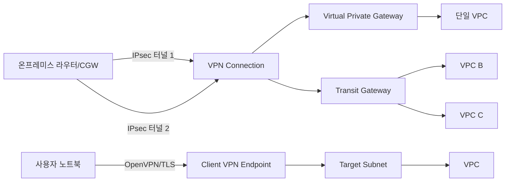
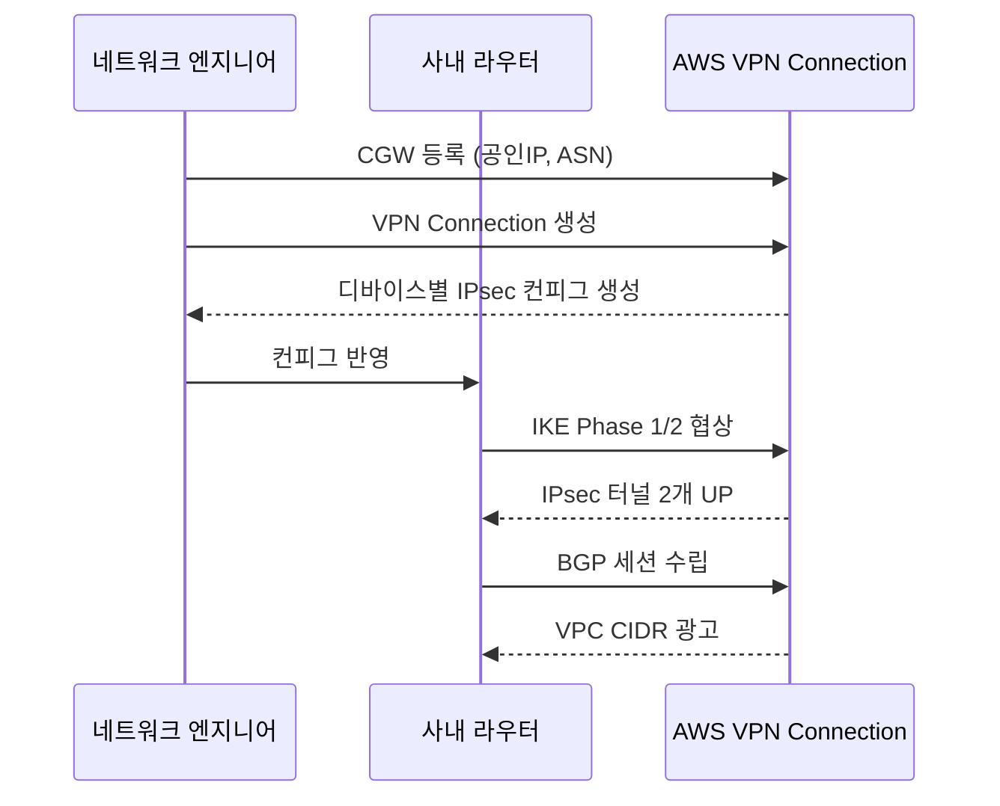
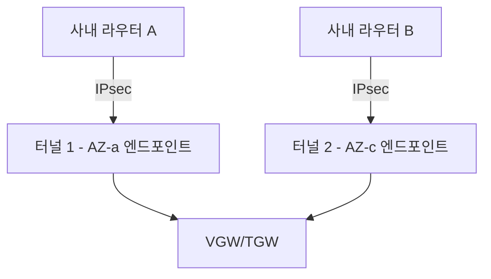
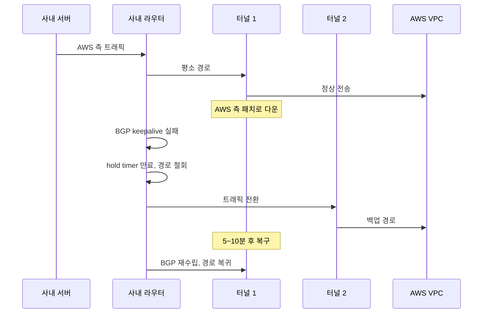
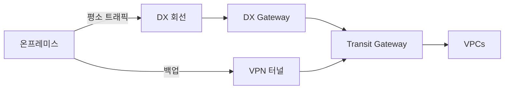
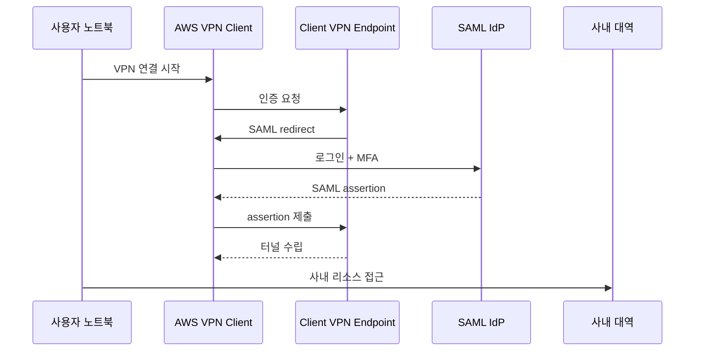

# AWS Site-to-Site VPN & Client VPN

## 개요

AWS VPN은 두 종류가 있다. 사무실·데이터센터를 AWS와 잇는 Site-to-Site VPN, 개인 노트북에서 사설 대역으로 들어가는 Client VPN. 둘 다 IPsec(Site-to-Site)·OpenVPN(Client) 위에서 돈다는 점은 같지만 운영 모델이 완전히 다르다.

Site-to-Site VPN은 라우터 대 라우터 연결이다. 한쪽 끝은 AWS의 Virtual Private Gateway(VGW) 또는 Transit Gateway, 반대쪽 끝은 회사 사옥·DC에 깔린 방화벽이나 라우터다. AWS가 만드는 쪽 끝점을 VPN Connection, 회사 측 라우터의 추상화를 Customer Gateway(CGW)라고 부른다. 한 VPN Connection은 항상 IPsec 터널 두 개로 구성된다. 이게 처음 만지면 헷갈리는 첫 지점이다.

Client VPN은 사용자가 자기 단말에서 VPN 클라이언트를 띄워서 붙는다. AWS가 관리형 OpenVPN 엔드포인트를 띄워주고, 사용자는 인증서·AD·SAML로 인증해서 사설 대역에 들어간다. 평소엔 IAM·Bastion으로 운영하다가, 개발자가 RDS에 직접 붙거나 사내 도구를 써야 할 때 추가로 들어온다.

VPN은 인터넷 위에서 도는 IPsec이라 회선 품질에 따라 지연·패킷 로스가 심하게 흔들린다. DX(Direct Connect)와 비교하면 안정성이 떨어지고, 대신 도입이 빠르고 싸다. 임시 연결, 백업 회선, 소규모 지사, 개발 환경에 어울리고, 미션 크리티컬 회선으로는 DX와 묶어서 쓰는 게 보통이다.

## Site-to-Site VPN의 어태치먼트: VGW vs Transit Gateway

VPN Connection을 만들 때 가장 먼저 결정하는 게 어디에 붙일지다. VGW에 붙이느냐, Transit Gateway에 붙이느냐. 잘못 고르면 VPC가 늘어났을 때 다시 만들고 라우팅을 다 갈아엎어야 한다.

### Virtual Private Gateway(VGW)

VGW는 VPC 한 개에 1:1로 붙는 게이트웨이다. 단순하다. VPC를 만들고 VGW를 attach하면 그 VPC 라우팅 테이블에서 온프레미스 대역을 VGW로 보내는 식이다.

VPC가 한두 개일 때 적당하다. 작은 회사가 단일 VPC에 모든 워크로드를 몰고 사옥과 잇는 정도면 VGW로 충분하다. VPN 트래픽이 다른 VPC로 전이되지 않으니 보안 경계도 단순하다.

문제는 VPC가 늘어날 때다. VGW는 VPC 한 개에만 붙으니 VPC가 5개면 VPN Connection도 5개를 만들거나, VPC들끼리 Peering·Transit Gateway로 묶고 그 중 하나에만 VGW를 다는 변칙이 필요해진다. 변칙을 쓰기 시작하면 라우팅이 꼬인다.

### Transit Gateway 어태치먼트

VPN Connection을 Transit Gateway에 붙이면 한 VPN으로 TGW에 연결된 모든 VPC와 통신할 수 있다. VPC가 둘 이상이면 처음부터 TGW 어태치먼트로 가는 게 정답이다.

TGW 어태치먼트는 ECMP(Equal-Cost Multi-Path)를 지원한다. VPN Connection을 여러 개 묶어서 한 TGW에 붙이면, 두 터널의 대역을 동시에 활용한다. 기본 VPN 터널 한 개당 약 1.25 Gbps가 한도인데, ECMP로 4개 VPN Connection을 묶으면 이론상 10 Gbps까지 끌어올린다. 단, ECMP는 BGP 라우팅에서만 작동한다. 정적 라우팅을 쓰면 ECMP가 안 된다.

VGW와 TGW를 동시에 쓰는 구성도 가능은 한데 라우팅 우선순위가 꼬인다. 같은 VPC가 VGW에도 attach돼 있고 TGW를 통한 경로도 보면 두 경로가 충돌한다. 한 VPC는 둘 중 하나로만 가는 게 운영하기 편하다.

마이그레이션은 한 번 겪으면 안 잊는다. VGW VPN을 운영하다 TGW로 옮기는 작업은 VPN Connection을 새로 만들고, 라우팅 테이블을 갈아끼우고, 온프레미스 라우터의 BGP 피어 IP를 바꾸는 동시 작업이 된다. 다운타임 없이 하려면 신구 VPN을 잠시 병행 운영하고 BGP local preference로 트래픽을 천천히 옮긴다.

## Customer Gateway 설정

CGW는 AWS 입장에서 "온프레미스 라우터가 이렇게 생겼다"는 메타데이터다. 실제 라우터를 AWS가 만지지는 않고, BGP 피어링과 IPsec 협상을 할 때 필요한 정보만 등록한다.

등록할 항목은 단순하다. CGW의 공인 IP, BGP ASN(BGP를 쓰는 경우), 디바이스 이름. 공인 IP는 NAT 뒤에 있으면 안 된다. NAT 뒤에 있는 경우 NAT 디바이스가 IPsec NAT-T를 정상적으로 통과시켜야 하는데, 일부 SOHO 공유기는 UDP 4500 포워딩이 제대로 안 된다. 사옥 라우터를 인터넷 회선에 직결하든지, 공유기에서 IPsec passthrough를 명시적으로 켠다.

ASN은 64512~65534(16비트 Private), 또는 4200000000~4294967294(32비트 Private)에서 고른다. 사내에서 이미 BGP를 쓰고 있으면 기존 ASN을 가져온다. 7224(AWS Public)·9059·17943 등은 못 쓴다. 정적 라우팅만 쓸 거면 ASN을 입력은 하지만 의미가 없다.

CGW를 만들 때 가장 흔히 빠뜨리는 게 회선의 NAT 여부 점검이다. ISP가 CGNAT(Carrier-Grade NAT) 뒤로 회선을 깔아주는 경우가 있다. 그러면 라우터 WAN IP가 사설 대역(100.64.0.0/10)이고 외부에서 보이는 IP는 ISP의 풀이라, IKE Phase 1 협상이 IDr 불일치로 실패한다. 회선 계약할 때 공인 IP를 명시적으로 요청한다.

라우터 쪽 IPsec 설정 파일은 AWS 콘솔에서 디바이스 모델별로 generate해준다. Cisco ASA, Juniper SRX, Palo Alto, Fortinet, Generic 등을 고르면 그대로 붙여 넣을 수 있는 컨피그가 나온다. 다만 그대로 쓰면 BGP timer가 기본값(90초 hold, 30초 keepalive)이라 failover가 느리다. 운영에 넣을 때는 30초/10초 정도로 줄인다.

## 두 개의 IPsec 터널이 항상 만들어지는 이유

VPN Connection 하나를 만들면 무조건 터널 두 개가 만들어진다. 끄거나 한 개만 쓸 수 없다. 처음에는 "쓸 일도 없는데 왜 둘이지" 싶은데, AWS가 강제하는 데는 이유가 있다.

AWS는 VPN 엔드포인트를 한 가용 영역에 두지 않고 두 AZ에 분산한다. 터널 1은 AZ-a의 VPN 엔드포인트, 터널 2는 AZ-c의 엔드포인트로 종단된다. AZ 장애가 나거나 AWS 측 VPN 인스턴스가 패치·교체될 때 한쪽 터널만 끊고 다른 쪽으로 트래픽이 흐르게 한다. 운영 중 무중단 패치를 위한 구조다.

CGW 측은 한 라우터에서 두 터널을 다 받든, 라우터를 두 대 두고 한 대당 하나씩 받든 선택지가 있다. 라우터 한 대가 두 터널을 받으면 AWS 쪽 장애는 막지만 사내 라우터 장애는 못 막는다. 라우터 두 대(CGW 두 개)에 터널을 분산하면 양쪽 다 막는다. 가용성이 중요한 곳은 라우터를 이중화한다.

두 터널은 active-active로 동시에 살아있을 수 있지만, 기본 동작은 active-standby에 가깝다. BGP 광고에서 두 터널의 AS path 길이가 같으면 AWS 측은 두 터널로 들어오는 트래픽을 분산해 받지만, AWS에서 온프레미스로 나가는 트래픽은 한 터널을 골라서 보낸다. 진짜 active-active로 양방향 분산을 하고 싶으면 TGW 어태치먼트에 ECMP를 켠다.

## BGP vs Static 라우팅

VPN Connection을 만들 때 라우팅 방식을 BGP와 Static 중에서 고른다. 한 번 정하면 바꿀 수 없고, 변경하려면 VPN Connection을 새로 만들어야 한다.

### BGP 동적 라우팅

기본 선택지다. CGW와 AWS 측이 BGP로 경로를 주고받는다. 온프레미스에서 사내 대역을 광고하면 AWS가 VPC 라우팅 테이블에 자동으로 반영하고, AWS는 VPC CIDR을 광고해서 사내에 알린다.

장점은 자동화다. 새 VPC를 만들거나 사내에 신규 대역이 추가돼도 BGP가 알아서 광고한다. failover도 BGP가 처리한다. 터널 하나의 BGP 세션이 끊기면 다른 터널로 트래픽이 자연스럽게 넘어간다.

단점은 사내 라우터에 BGP를 설정할 줄 아는 사람이 있어야 한다. 소규모 회사에서 네트워크 담당이 없거나 외주 통신사가 BGP를 안 만지면 BGP 설정 자체가 부담이다.

BGP 라우팅에서 자주 보는 트러블이 한도 초과다. AWS 측에 광고할 수 있는 prefix는 기본 100개로 제한된다. 사내에 서브넷이 잘게 쪼개져 있으면 100개를 금방 넘긴다. 100개를 넘기면 BGP 세션이 idle로 떨어지고, 광고된 경로가 통째로 날아간다. 사내 서브넷을 summary로 묶거나, AWS 지원 케이스로 한도 상향을 요청한다.

### Static 라우팅

CGW에서 광고할 사내 대역을 콘솔에 직접 입력한다. 양쪽 라우터는 단순히 IPsec 터널만 살리고, 어디로 트래픽을 보낼지는 AWS가 정적으로 안다.

작은 사옥에 사내 대역 하나(예: 10.10.0.0/16)만 광고하면 되는 경우엔 static이 더 단순하다. BGP 설정도 필요 없고 ASN도 신경 안 쓴다.

failover가 미묘하다. Static + 2 터널 구성에서 한 터널이 죽었을 때 AWS는 BGP가 없으니 어느 터널이 살았는지를 따로 감지해야 한다. VPN Connection의 양 터널 상태를 모니터링해서 죽은 터널은 라우팅에서 빼는데, 감지 시간이 BGP보다 느리다. 트래픽이 죽은 터널로 잠시 흘러서 끊기는 시간이 길어진다. 그래서 Static을 고를 거면 터널 두 개를 active-standby로 운영하고, 사내 라우터에서도 IP SLA 등으로 죽은 터널을 빠르게 감지해서 트래픽을 옮기는 설정을 추가한다.

ECMP는 BGP에서만 된다. Static + TGW 어태치먼트로는 대역폭을 못 늘린다. 1.25 Gbps 한도를 넘기려면 BGP로 가야 한다.

## 터널 한쪽이 죽었을 때 페일오버 동작

운영 중 한쪽 터널이 죽는 일은 생각보다 자주 생긴다. AWS의 VPN 인스턴스 패치, AZ 장애, 사내 라우터 리로드, 회선 깜빡임 등 원인은 다양하다. 핵심은 사용자가 모르게 다른 터널로 넘어가는 것.

BGP 구성에서 한 터널의 BGP 세션이 끊기면 AWS 라우팅 테이블에서 해당 경로의 광고가 사라지고, 다른 터널의 경로만 남는다. 트래픽이 즉시 살아있는 터널로 흐른다. 감지 속도는 BGP hold timer에 달렸다. 기본 90초는 너무 길다. 30초 이하로 줄이거나 BFD를 켤 수 있으면 1초 내 감지한다. 다만 AWS Site-to-Site VPN은 BFD를 공식 지원하지 않는다. hold timer를 줄이는 게 현실적 선택지다.

Static 라우팅은 좀 더 거칠다. AWS는 터널이 살아있는지 헬스체크로 판단하고 살아있는 터널로 트래픽을 보낸다. 사내 라우터 쪽도 양 터널의 상태를 따로 봐야 한다. 그렇지 않으면 트래픽이 죽은 터널로 계속 흘러서 블랙홀이 된다.

페일오버 자체보다 더 자주 사고나는 게 복구 후 동작이다. 죽었던 터널이 다시 살아나면 BGP가 양쪽 경로를 다 보게 되는데, 우선순위 설정이 없으면 라우터가 어느 쪽을 메인으로 쓸지 매번 다르게 정한다. 트래픽이 두 터널 사이를 왔다 갔다 하면 SYN/ACK이 다른 경로로 가서 비대칭 라우팅이 생기고, 방화벽이 세션을 못 따라가서 패킷이 드롭된다. local preference나 MED로 한 터널을 우선으로 못박는다.

## MTU/MSS clamping과 단편화

VPN을 처음 띄우면 SSH는 잘 되는데 큰 파일 전송이나 git clone이 멈추는 현상이 자주 나온다. 100% MTU 문제다.

이더넷 MTU는 1500바이트다. IPsec 헤더, ESP 헤더, AES 패딩이 붙으면서 한 패킷당 50~70바이트가 추가로 먹힌다. VPN 터널 안에서 실제로 보낼 수 있는 페이로드는 1380~1438바이트 수준으로 줄어든다. 정확한 값은 IKE 버전, 암호 알고리즘, NAT-T 사용 여부에 따라 달라진다.

OS가 1500바이트 패킷을 만들어서 VPN 라우터로 보내면, 라우터가 그 패킷을 잘라야(fragment) 하거나, DF(Don't Fragment) 비트가 켜져 있으면 ICMP "Fragmentation Needed" 메시지를 송신자에게 돌려보내서 작게 다시 보내라고 알린다(Path MTU Discovery). 문제는 ICMP가 사내·사외 방화벽에서 차단되는 경우가 많다는 점이다. 송신자는 응답을 못 받으니 계속 1500바이트로 보내고, 라우터는 계속 드롭한다. 결과는 작은 패킷은 통과하고 큰 패킷은 침묵하며 죽는 현상.

해결책은 MSS clamping이다. TCP 핸드셰이크의 SYN 패킷에 들어가는 MSS 값을 강제로 1360 정도로 낮춘다. 그러면 양쪽 OS가 처음부터 작은 패킷만 만들어서 보내니 단편화가 발생하지 않는다. AWS VPN Connection은 기본적으로 MSS clamping을 1379로 적용해주지만, 사내 라우터 쪽에서도 같은 설정을 해야 양방향이 깔끔하다. Cisco는 `ip tcp adjust-mss 1360`, Linux는 iptables의 `--set-mss` 옵션.

UDP는 MSS clamping이 없으니 단편화를 피할 수 없다. UDP 기반 프로토콜(DNS, QUIC, 일부 게임 트래픽)이 VPN을 거치면서 잘리고 사라지는 현상은 별도로 대응한다. DNS는 TCP fallback이 잘 동작하지만, 사내 DNS가 큰 응답을 자주 돌려주면 EDNS UDP 버퍼 크기를 1232 이하로 줄이는 게 안전하다.

증상을 잡는 빠른 방법: 사내에서 AWS 측 인스턴스로 `ping -M do -s 1400 <ip>`를 쏴서 사이즈를 늘려가며 어디서 끊기는지 본다. 1400은 되는데 1450부터 안 되면 MTU 문제 확정이다.

## Accelerated VPN

기본 Site-to-Site VPN은 사내에서 가장 가까운 AWS PoP까지 일반 인터넷 경로로 들어간다. 회사가 한국에 있고 VPC가 서울에 있으면 경로가 짧지만, VPC가 미국 동부에 있으면 트래픽이 ISP·국제 ISP·미국 ISP를 거쳐서 들어간다. 도중에 어느 ISP에서든 폭주가 나면 지연이 튄다.

Accelerated Site-to-Site VPN은 사내에서 가장 가까운 AWS Global Accelerator Edge로 먼저 들어가고, 그 다음부터는 AWS 백본을 타고 목적지 리전까지 간다. 인터넷 구간을 최소화한다. 글로벌 분산된 회사·해외 리전에 붙는 VPN에서 지연·jitter가 크게 줄어든다.

켜는 방법은 VPN Connection 생성 시 "Enable Acceleration" 옵션 하나다. 다만 제약이 있다.

- TGW 어태치먼트에서만 지원된다. VGW로는 못 쓴다.
- 한 번 생성 후엔 옵션을 못 바꾼다. 기존 VPN에 사후 활성화 불가.
- 비용이 추가된다. Global Accelerator 시간당 요금과 데이터 전송 요금이 따로 붙는다.
- 일부 리전에서 미지원이거나 늦게 풀리는 경우가 있다.

같은 리전에 같은 국가에서 붙는 VPN이면 별 효과가 없다. 국가·대륙을 가로지르는 VPN, 또는 ISP 품질이 들쭉날쭉한 신흥 시장에서 들어가는 VPN에서 의미가 있다.

## Direct Connect와의 비교, 그리고 함께 쓰는 패턴

Site-to-Site VPN과 DX는 둘 다 사내·AWS를 잇지만 성격이 다르다.

| 항목 | Site-to-Site VPN | Direct Connect |
|---|---|---|
| 회선 | 일반 인터넷 | 통신사 전용선 |
| 도입 시간 | 수 시간 | 수 주~수 개월 |
| 대역폭 | 터널당 ~1.25 Gbps | 1/10/100 Gbps |
| 지연 | 인터넷 의존, 변동 큼 | 일정 |
| 비용 | 시간당 약 $0.05 + 데이터 전송 | 회선료 + 포트 요금, 비싸다 |
| 장애 복구 | 인터넷 회복 시 자동 | 광케이블 복구까지 며칠 |
| 보안 | IPsec 암호화 | 비암호화, 필요하면 MACsec |

DX는 일정 회선, VPN은 인터넷 회선이다. DX가 빠르고 일정하지만, 단일 장애점이고 복구가 느리다. VPN은 인터넷 끊기지 않는 이상 어떻게든 우회 경로가 살아 있다.

가장 흔한 운영 패턴은 DX를 메인, VPN을 백업으로 같이 쓰는 구성이다. 평소엔 DX로 트래픽이 흐르고, DX가 죽으면 VPN으로 자동 페일오버한다. BGP가 양쪽을 다 보고 있다가 DX의 AS path를 더 짧게 광고해서 메인으로 두고, 죽으면 VPN 경로만 남으니 자연스럽게 넘어간다.

이 구성의 함정은 VPN 백업의 대역폭이 DX보다 한참 작다는 점이다. DX가 10 Gbps인데 VPN이 1 Gbps면, DX 죽고 VPN으로 넘어간 순간 트래픽이 10배 줄어든다. 백업 중에도 핵심 서비스는 살아야 하니, 비핵심 트래픽(로그 동기화, 대용량 백업)은 백업 모드에서 차단하거나 QoS로 후순위로 미루는 설계를 미리 해둔다. 사고가 나서야 알게 되면 늦다.

VPN만으로 메인 회선을 쓰는 회사도 있다. 트래픽이 적고 DX 비용이 부담스러우면 VPN 두 회선(서로 다른 ISP)을 묶어서 메인을 만들 수 있다. 다만 인터넷 의존이라 지연·로스가 들쭉날쭉한 점은 감수한다.

## Client VPN의 인증 방식

Client VPN은 사용자 단말에서 AWS가 띄운 OpenVPN 엔드포인트로 붙는다. 인증 방식이 세 가지고, 회사 규모와 기존 IdP에 맞춰 고른다.

### Mutual Authentication (인증서 기반)

서버 인증서와 클라이언트 인증서를 각각 발급해서 양방향 인증한다. ACM에 서버 인증서를 올리고, 클라이언트 인증서는 각 사용자에게 발급한다.

장점은 단순하고 추가 인프라가 필요 없다는 점. 인증서만 있으면 인증된다. 단점은 사용자가 늘면 인증서 발급·회수·갱신을 일일이 챙겨야 한다는 점. 직원이 퇴사해도 인증서를 회수하지 않으면 계속 붙을 수 있다.

CRL(Certificate Revocation List)을 운영해서 폐기된 인증서를 등록하고, 30분마다 Client VPN이 CRL을 다시 읽도록 설정한다. CRL을 안 돌리면 폐기가 즉시 반영되지 않는다. 작은 팀에서 사용자 수십 명 수준이면 쓸 만하고, 그 이상이면 부담스럽다.

### Active Directory 인증

AWS Managed Microsoft AD나 온프레미스 AD를 연동한다. 사용자가 자기 사내 계정으로 VPN에 붙는다. 비밀번호를 바꾸면 VPN 인증도 바뀐 비밀번호로 동작하고, 퇴사 처리하면 AD에서 계정을 비활성화하는 순간 VPN도 막힌다.

회사가 AD를 이미 쓰고 있으면 자연스러운 선택이다. MFA(Multi-Factor Authentication)는 AD에 RADIUS 서버를 붙여서 별도로 구현한다. 기본 AD 연동만으로는 MFA가 없다.

### SAML 2.0 (SSO)

Okta, Azure AD, OneLogin 등 IdP와 SAML로 연동한다. 사용자가 OpenVPN 클라이언트에서 SAML 로그인 창을 띄워서 IdP에 로그인하고, IdP가 발급한 assertion으로 VPN 세션을 받는다.

IdP가 이미 회사 표준이면 가장 깔끔하다. MFA·conditional access 정책이 IdP에 다 들어 있으니 VPN에 별도 설정이 필요 없다. 사용자 추가·삭제도 IdP 한 곳에서만 관리한다.

다만 OpenVPN 클라이언트 중에서 SAML을 지원하는 게 한정적이다. AWS Client VPN 공식 클라이언트는 SAML을 지원하지만, 일반 OpenVPN 클라이언트는 안 되거나 별도 플러그인이 필요하다. 사용자가 자기가 쓰던 OpenVPN 클라이언트를 그대로 쓰지 못하고 AWS 전용 클라이언트로 갈아타야 하는 점이 첫 도입 때 마찰을 만든다.

## 분할 터널링과 사내망 라우팅 누락 사고

Client VPN을 켜면 기본적으로 모든 트래픽이 VPN 터널로 들어간다. 사용자가 유튜브를 봐도 트래픽이 회사 망을 거쳐서 나간다. 회사 인터넷 회선과 AWS 데이터 전송 비용이 다 부담된다.

분할 터널링(Split Tunneling)은 특정 대역만 VPN으로 보내고 나머지는 단말의 일반 인터넷으로 직접 나가게 한다. 사용자 입장에서도 동영상·일반 웹 브라우징이 빨라지고, 회사 입장에서도 비용이 절감된다. 운영상 거의 필수 설정에 가깝다.

설정은 Client VPN Endpoint의 Route Table에 "VPN으로 보낼 대역"만 등록한다. 예를 들어 10.0.0.0/16(VPC), 172.20.0.0/16(사내 DC), 192.168.10.0/24(레거시 사옥) 같이 사내·사설 대역만 라우팅 테이블에 넣고, 나머지(0.0.0.0/0)는 등록하지 않는다. 사용자 단말은 등록된 대역만 VPN으로 보내고 나머지는 직접 인터넷으로 나간다.

여기서 사고가 나는 패턴이 있다. 초기 설정 때 VPC 대역만 등록하고 사내 DC 대역을 빠뜨리는 거다. 사용자가 RDS에 붙는 건 잘 되는데, 사내 Jira·GitLab·DNS 서버는 안 보인다. "VPN 붙어 있는데 사내 위키가 안 열려요" 같은 문의가 쏟아진다.

다른 패턴은 사내 DNS가 분할 터널링에 빠지는 경우다. 사용자가 사내 도메인(예: `corp.example.local`)을 조회하면 사내 DNS 서버로 쿼리가 가야 하는데, 분할 터널링 설정에서 DNS 서버 대역이 누락돼서 일반 인터넷 DNS로 쿼리가 나간다. 인터넷 DNS는 사내 도메인을 모르니 NXDOMAIN을 돌려준다. 사용자는 IP로는 붙는데 도메인으로는 못 붙는 미궁에 빠진다.

이걸 막으려면 Client VPN Endpoint 설정에서 DNS Server를 사내 DNS 서버의 IP로 명시하고, 그 DNS 서버 대역도 라우팅 테이블에 반드시 포함시킨다. DNS 서버가 사내 DC에 있다면 DC 대역이 라우팅에 들어가야 DNS 자체가 통한다.

VPN을 끊었을 때 단말의 DNS 설정이 원래대로 복구되는지도 확인한다. 일부 OS·클라이언트에서 VPN 종료 후에도 사내 DNS 서버가 단말에 남아 있다가 일반 인터넷 도메인 조회가 깨지는 경우가 있다.

분할 터널링 라우팅을 잘못 잡아서 한 번 사고가 나면 회사 전체에 동시다발로 영향이 간다. 변경할 때는 작은 그룹의 사용자에게 먼저 적용해서 사내 주요 서비스(위키·GitLab·메일·DNS)가 다 도는지 확인한 다음 전체에 푼다. 같은 의미로, Authorization Rule도 잘못 풀면 사용자가 못 가야 할 곳에 가게 되니 분할 터널링 변경과 같이 검토한다.

## 자주 마주치는 트러블

운영하면서 자주 보는 증상과 원인을 정리한다.

- **터널은 UP인데 트래픽이 안 흐른다**: 라우팅 테이블에 VGW/TGW propagation이 안 켜져 있다. VPC 라우팅 테이블에서 Route propagation을 활성화하거나 정적으로 사내 대역을 추가한다.
- **BGP 세션이 자꾸 끊긴다**: 광고 prefix 한도(기본 100개) 초과. CloudWatch에서 BGP 상태 메트릭을 보면 idle 상태가 잡힌다.
- **VPN 붙은 직후엔 되는데 몇 분 후 끊긴다**: NAT-T를 거치는 경로에서 NAT 디바이스가 UDP 4500 세션 타임아웃을 짧게 잡아둔 경우. IPsec keepalive(DPD) 주기를 NAT 타임아웃보다 짧게 줄인다.
- **단편화로 큰 패킷만 막힌다**: MSS clamping 누락. 양쪽 라우터에서 TCP MSS를 1360 이하로 강제한다.
- **failover는 되는데 복구 후 트래픽이 깜빡인다**: 두 터널의 우선순위가 같아서 BGP가 매번 다르게 고른다. local preference나 MED로 우선순위를 못박는다.
- **Client VPN에서 사내 도메인이 안 풀린다**: 분할 터널링에서 사내 DNS 대역 누락. DNS Server IP를 명시하고 해당 대역을 라우팅에 추가한다.
- **VPN 연결 자체가 안 된다(IKE Phase 1 실패)**: CGW의 공인 IP가 NAT 뒤에 있거나 ASN이 잘못 입력됐다. CGW 설정과 실제 라우터의 외부 IP를 다시 맞춘다.
