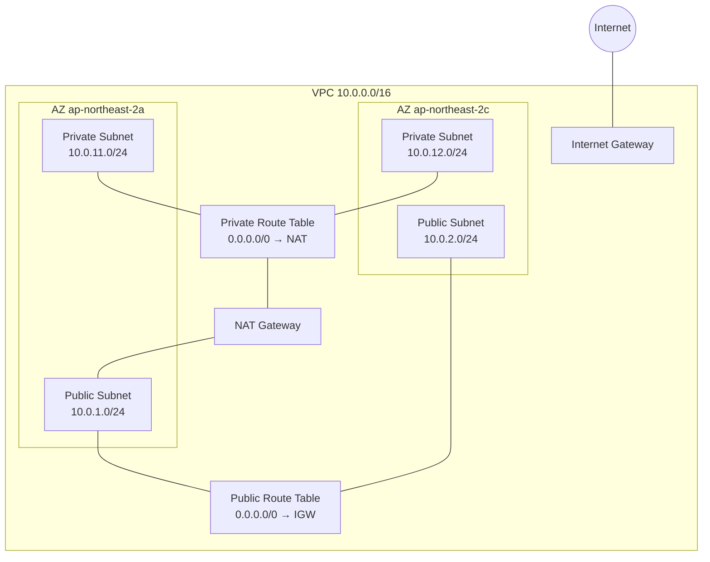

# AWS VPC

## 개요

VPC(Virtual Private Cloud)는 AWS 계정 안에서 논리적으로 격리된 가상 네트워크다. 물리적으로는 AWS 데이터센터 안에 있지만 네트워크 수준에서는 완전히 분리되어 있다. EC2, RDS, ECS, Lambda(VPC 연결 모드) 같은 대부분의 리소스가 VPC 안에서 동작한다.

VPC를 "내 계정 안의 데이터센터"로 생각하면 편하다. IP 대역을 직접 정하고, 서브넷을 자르고, 라우팅을 설계하고, 방화벽 규칙을 걸 수 있다. 사내 온프레미스 네트워크를 AWS에 그대로 옮겨놓는 구조다.

신규 AWS 계정은 리전마다 기본 VPC(Default VPC) 하나를 자동으로 만들어 준다. 172.31.0.0/16 대역에 AZ마다 퍼블릭 서브넷이 있고 IGW가 붙어 있다. 실습이나 임시 테스트에는 편하지만 운영 환경에서는 직접 설계한 VPC를 쓰는 게 맞다. 기본 VPC는 모든 서브넷이 퍼블릭이고 보안 그룹이 느슨해서 실수로 노출되기 쉽다.

## VPC의 기본 구성 요소

VPC 하나를 만들면 다음과 같은 요소들이 따라온다.

- **CIDR 블록**: VPC에 할당한 IP 주소 범위. 최초 생성 시 Primary CIDR 하나를 지정하고, 필요하면 Secondary CIDR을 추가할 수 있다.
- **서브넷(Subnet)**: VPC의 CIDR을 쪼갠 작은 네트워크. 반드시 하나의 AZ에 속한다. VPC는 리전 단위, 서브넷은 AZ 단위다.
- **라우팅 테이블(Route Table)**: 서브넷에서 나가는 트래픽이 어디로 갈지 결정한다.
- **인터넷 게이트웨이(IGW)**: VPC를 인터넷에 연결하는 게이트웨이. VPC당 하나만 붙일 수 있다.
- **NAT 게이트웨이/NAT 인스턴스**: 프라이빗 서브넷에서 외부로 나갈 때 출발지 IP를 변환해 주는 장치.
- **보안 그룹(Security Group)**: ENI 수준의 스테이트풀 방화벽.
- **NACL(Network ACL)**: 서브넷 수준의 스테이트리스 방화벽.
- **DHCP 옵션 세트**: VPC 내부에서 쓰는 DNS 서버, 도메인 이름 등을 지정한다.
- **ENI(Elastic Network Interface)**: 실제 IP가 할당되는 가상 NIC. EC2, RDS, Lambda-in-VPC 전부 뒤에서 ENI를 사용한다.



## CIDR 설계

CIDR은 VPC 설계에서 가장 먼저 결정해야 하고, 한번 결정하면 나중에 바꾸기 어렵다. 운영 중인 VPC의 Primary CIDR은 변경할 수 없다. 잘못 잡으면 몇 년을 고생한다.

### 사용 가능한 범위

AWS는 RFC 1918 프라이빗 대역을 VPC CIDR로 권장한다.

- 10.0.0.0/8 (10.0.0.0 ~ 10.255.255.255)
- 172.16.0.0/12 (172.16.0.0 ~ 172.31.255.255)
- 192.168.0.0/16 (192.168.0.0 ~ 192.168.255.255)

VPC CIDR 크기는 /16 ~ /28 사이여야 한다. /16이 최대(65,536개 IP), /28이 최소(16개 IP)다. 실무에서는 거의 대부분 /16으로 잡는다. /20이나 /24로 작게 잡으면 서비스가 커졌을 때 IP가 금방 고갈된다.

### 설계할 때 고려할 점

**기존 네트워크와 겹치지 않게 잡아라.** VPC Peering, Transit Gateway, Site-to-Site VPN, Direct Connect 같은 걸 쓰면 다른 VPC나 온프레미스 네트워크와 라우팅을 공유한다. 이때 CIDR이 겹치면 피어링 자체가 불가능하거나, 연결되더라도 라우팅이 꼬인다.

실무에서 자주 겹치는 대역:

- 10.0.0.0/16: 너무 흔해서 다른 팀/계정 VPC와 겹치기 쉽다
- 192.168.0.0/24: 사내 유무선 네트워크와 겹친다
- 172.17.0.0/16: Docker 기본 브리지 네트워크 대역
- 172.18.0.0/16 ~ 172.20.0.0/16: Docker compose 네트워크들

회사 전체 IP 할당 정책을 먼저 정하는 게 맞다. 예를 들어 이런 식으로.

- 개발 계정: 10.10.0.0/16
- 스테이징 계정: 10.20.0.0/16
- 프로덕션 서울: 10.100.0.0/16
- 프로덕션 도쿄: 10.101.0.0/16
- 공용 서비스 VPC: 10.200.0.0/16
- 온프레미스: 172.16.0.0/12

**충분히 크게 잡아라.** VPC가 작으면 서브넷을 세밀하게 나누기 어렵다. /16으로 잡으면 65,536개 IP가 있어서 AZ별로 /20씩 4개를 만들어도 여유가 있다. 크게 잡았다고 과금되지 않는다. VPC는 무료다.

### Secondary CIDR

Primary CIDR이 부족하면 Secondary CIDR을 추가할 수 있다. 같은 VPC에 최대 5개(쿼터 증설 시 50개)까지 CIDR을 붙일 수 있다.

Secondary CIDR은 IP 부족을 해결하는 방법이지만 주의사항이 있다.

- 같은 RFC 1918 범위 안에서만 추가할 수 있다. 예: Primary가 10.x.x.x면 Secondary도 10.x.x.x 대역을 쓰는 게 일반적이다.
- 100.64.0.0/10(Carrier-Grade NAT 대역)을 Secondary로 쓰는 사례가 많다. AWS EKS에서 Pod IP 할당에 자주 쓴다.
- 다른 VPC/온프레미스와의 라우팅도 Secondary CIDR 전부를 고려해야 한다.

## 서브넷 분할

서브넷은 VPC CIDR을 잘게 쪼갠 단위다. 하나의 서브넷은 반드시 하나의 AZ에 묶인다. 멀티 AZ 구성은 같은 역할의 서브넷을 AZ마다 하나씩 만들어 쌍으로 운영한다.

### 서브넷 타입

- **퍼블릭 서브넷**: 라우팅 테이블에 `0.0.0.0/0 → IGW` 라우트가 있다. 그리고 `auto-assign public IP` 옵션이 켜져 있거나 EIP가 붙은 ENI가 있다. ALB, NAT Gateway, Bastion 호스트 등이 들어간다.
- **프라이빗 서브넷**: IGW 라우트가 없다. 외부로 나가려면 NAT Gateway를 거친다. 애플리케이션 서버, 내부 서비스가 들어간다.
- **격리 서브넷(Isolated)**: 외부로 나가는 경로 자체가 없다. 0.0.0.0/0 라우트가 없고 NAT도 없다. RDS, ElastiCache 같은 DB 계층에 쓴다. VPC Endpoint를 통해서만 AWS API와 통신한다.

### 서브넷 크기

`/24` 서브넷은 IP 256개처럼 보이지만 실제로는 **251개**만 쓸 수 있다. AWS가 각 서브넷에서 5개를 예약한다.

예: 10.0.1.0/24

- 10.0.1.0: 네트워크 주소
- 10.0.1.1: VPC 라우터
- 10.0.1.2: DNS(Amazon-provided DNS)
- 10.0.1.3: 예약(미래 사용)
- 10.0.1.255: 브로드캐스트

EKS, ECS Fargate, Lambda 같이 ENI를 많이 만드는 워크로드는 IP를 생각보다 훨씬 빠르게 먹는다. 특히 EKS는 Pod 하나마다 IP를 하나씩 쓴다(VPC CNI 기본 모드). Pod가 2,000개 뜨면 IP 2,000개를 먹는다. `/24` 서브넷 하나로는 부족하다.

### 실무에서 자주 쓰는 분할

`10.0.0.0/16` VPC 기준.

| 서브넷 | CIDR | 용도 |
|--------|------|------|
| Public-A | 10.0.0.0/20 | AZ-a 퍼블릭 (ALB, NAT) |
| Public-B | 10.0.16.0/20 | AZ-b 퍼블릭 |
| Public-C | 10.0.32.0/20 | AZ-c 퍼블릭 |
| App-A | 10.0.64.0/19 | AZ-a 애플리케이션 |
| App-B | 10.0.96.0/19 | AZ-b 애플리케이션 |
| App-C | 10.0.128.0/19 | AZ-c 애플리케이션 |
| DB-A | 10.0.192.0/22 | AZ-a DB |
| DB-B | 10.0.196.0/22 | AZ-b DB |
| DB-C | 10.0.200.0/22 | AZ-c DB |

애플리케이션 계층을 크게 잡은 이유는 EKS/ECS에서 IP를 많이 쓰기 때문이다. DB 계층은 RDS 인스턴스가 많지 않으니 /22(약 1,000개 IP)로 충분하다.

## 라우팅 테이블

라우팅 테이블은 서브넷에서 나가는 트래픽이 어느 타깃으로 가는지 정한다. 서브넷 하나는 정확히 하나의 라우팅 테이블과 연결된다. 명시적으로 연결하지 않으면 VPC의 Main Route Table이 자동으로 적용된다.

### 라우트 평가 규칙

라우팅 테이블에는 여러 라우트가 있을 수 있고, 가장 구체적인(Longest Prefix Match) 라우트가 우선한다.

예시:

```
10.0.0.0/16 → local              # VPC 내부 (자동)
172.16.0.0/12 → tgw-xxxx         # 온프레미스 (TGW)
172.16.5.0/24 → pcx-xxxx         # 특정 서브넷만 Peering으로
0.0.0.0/0 → nat-xxxx             # 나머지는 NAT
```

172.16.5.100으로 가는 트래픽은 `/24`가 더 구체적이므로 Peering으로 간다. 172.16.10.100은 `/12` 라우트에 걸려서 TGW로 간다.

### local 라우트

모든 라우팅 테이블에는 VPC CIDR에 대한 `local` 라우트가 자동으로 들어간다. 이건 지울 수 없다. VPC 안의 서브넷끼리는 이 라우트 덕분에 기본적으로 통신이 된다. 보안 그룹이나 NACL로 막지 않는 한 모두 연결된다.

Secondary CIDR을 추가하면 그 대역에 대한 local 라우트도 자동으로 들어간다.

### 라우트 충돌

정확히 같은 목적지 CIDR을 두 라우트가 갖고 있으면 라우트를 추가할 때 에러가 난다. 하지만 더 흔한 문제는 **라우트가 의도와 다르게 작동하는 경우**다.

사례 1: NAT 게이트웨이 라우트가 안 잡혀서 프라이빗 서브넷 EC2가 패키지 설치를 못 한다. 프라이빗 서브넷이 퍼블릭 라우팅 테이블에 연결되어 있었다. 이 경우 `0.0.0.0/0 → IGW` 라우트가 있지만 EIP가 없으니 인터넷으로 나가도 응답을 못 받는다.

사례 2: Peering으로 다른 VPC DB에 접근하는데 연결이 안 된다. Peering은 생성했지만 라우팅 테이블에 상대 VPC CIDR 라우트를 안 넣었다. Peering Connection은 라우팅을 자동으로 넣어주지 않는다.

## Internet Gateway와 NAT Gateway

### IGW

IGW는 VPC를 인터넷에 연결하는 단일 게이트웨이다. VPC당 하나만 붙일 수 있다. IGW 자체는 가용성이 AWS에서 관리하는 리전 단위 리소스라 사용자가 AZ나 이중화를 신경 쓸 필요가 없다.

퍼블릭 서브넷의 조건:

1. 서브넷이 연결된 라우팅 테이블에 `0.0.0.0/0 → IGW` 라우트가 있어야 한다.
2. 해당 ENI에 퍼블릭 IP(자동 할당 또는 EIP)가 있어야 한다.

둘 중 하나라도 빠지면 인터넷 통신이 안 된다. `ssh: connection timed out`이 나면 이 두 가지를 먼저 확인한다.

### NAT Gateway

프라이빗 서브넷에서 인터넷으로 나갈 때 쓴다. NAT Gateway는 AZ 단위 리소스다. 다른 AZ의 NAT Gateway를 쓰면 AZ 간 데이터 전송 비용이 발생한다.

이중화를 위해 AZ마다 NAT Gateway를 하나씩 두는 게 표준이다. 프라이빗 서브넷은 같은 AZ의 NAT Gateway를 가리키는 라우팅 테이블을 쓴다.

NAT Gateway는 비싸다. 시간당 요금 + 데이터 처리 요금이 있다. 서울 리전 기준 월 $30~40 + GB당 $0.045. 트래픽이 많으면 여기서 생각보다 많은 비용이 나온다. 가능한 한 VPC Endpoint로 대체할 수 있는 건 대체하는 게 좋다.

## DNS 옵션

VPC에는 두 가지 DNS 관련 옵션이 있다.

- **enableDnsSupport**: VPC 내부에서 Amazon-provided DNS(서브넷 CIDR의 +2 주소, 예: 10.0.0.2)를 쓸 수 있게 해준다. 기본값은 true.
- **enableDnsHostnames**: VPC 안에서 생성된 EC2 인스턴스에 퍼블릭/프라이빗 DNS 호스트네임을 자동 할당할지 여부. 기본값은 VPC 종류에 따라 다르다.

`enableDnsHostnames`가 꺼져 있으면 VPC Endpoint(Interface Type)가 제대로 동작하지 않는다. S3/DynamoDB Gateway Endpoint는 상관없지만 Interface Endpoint는 프라이빗 DNS 네임에 의존한다. 커스텀 VPC에서는 이 옵션을 켜야 하는 경우가 많으니 자주 확인한다.

### DHCP 옵션 세트

VPC 안의 EC2가 DHCP로 받는 설정들이다. 기본 DHCP 옵션 세트는 AmazonProvidedDNS를 DNS 서버로 준다. 온프레미스 DNS(Active Directory 등)로 통합하려면 DHCP 옵션 세트를 새로 만들어서 사내 DNS 서버 IP를 지정한다.

## VPC Endpoint

VPC Endpoint는 VPC 안에서 AWS 서비스(S3, DynamoDB, SQS, SSM 등)를 인터넷을 거치지 않고 프라이빗하게 호출할 수 있게 해준다. 두 종류가 있다.

- **Gateway Endpoint**: S3, DynamoDB 전용. 라우팅 테이블에 접두사 라우트가 추가되는 방식. 요금이 없다.
- **Interface Endpoint(PrivateLink)**: 그 외 대부분의 서비스. VPC 안에 ENI가 생성되고 프라이빗 DNS가 엔드포인트로 해석된다. 시간당 요금 + 데이터 처리 요금이 있다.

프라이빗 서브넷에서 S3에 많이 접근하는 워크로드라면 Gateway Endpoint를 안 쓰면 NAT Gateway 비용이 크게 증가한다. 웬만하면 S3/DynamoDB Gateway Endpoint는 기본으로 깔고 시작한다.

## 플로우 로그(VPC Flow Logs)

VPC, 서브넷, ENI 단위로 트래픽을 기록한다. 출발지/목적지 IP, 포트, 프로토콜, 수락/거부 여부, 바이트 수 등이 남는다. CloudWatch Logs 또는 S3로 보낼 수 있다.

플로우 로그는 디버깅에 굉장히 유용하다. 보안 그룹/NACL 때문에 트래픽이 막히는지 확인할 때 가장 먼저 보는 게 플로우 로그다.

```
2 123456789012 eni-abc 10.0.1.5 10.0.10.7 52345 3306 6 5 260 1680000000 1680000060 ACCEPT OK
2 123456789012 eni-abc 10.0.1.5 10.0.10.7 52346 3306 6 1 40  1680000000 1680000060 REJECT OK
```

`REJECT`가 보이면 방화벽에서 막혔다는 의미다. 보안 그룹은 스테이트풀이라 아웃바운드만 열려 있어도 응답은 자동으로 돌아오지만, NACL은 스테이트리스라 양방향 규칙이 필요하다. 왕복 중 한 방향만 REJECT가 찍히면 NACL 문제일 가능성이 높다.

단점은 로그 양이 어마어마하다는 것이다. 대규모 VPC에서는 S3로 보내고 Athena로 분석하는 게 현실적이다. CloudWatch Logs로 그대로 보내면 비용이 금방 커진다. 운영 VPC에서는 보통 샘플링하거나 필요할 때만 켠다.

## 리소스 한계와 쿼터

VPC를 설계할 때 놓치기 쉬운 한계들이 있다.

### IP 주소 관련

- **서브넷당 예약 IP 5개**: 이미 설명한 대로. `/28`은 실제 11개만 쓸 수 있다.
- **VPC당 CIDR**: Primary 1개 + Secondary 4개 = 기본 5개. 증설 가능.
- **리전당 VPC**: 기본 5개. 증설 가능.
- **서브넷 수**: VPC당 200개. 증설 가능.

### ENI와 IP

EC2 인스턴스 타입마다 붙일 수 있는 ENI 수와 ENI당 IP 수가 정해져 있다. `t3.medium`은 ENI 3개, ENI당 6개 IP로 총 18개, `m5.large`는 ENI 3개 × 10개 IP = 30개. 인스턴스 타입이 크면 IP를 더 많이 쓴다.

EKS에서는 이 제약이 바로 Pod 밀도로 이어진다. `t3.medium` 노드 하나에 Pod가 17개(+ 자기 자신 IP 1개)밖에 못 뜬다. 이게 싫으면 `VPC CNI prefix delegation`을 켜서 IP 대신 /28 블록을 할당받는 식으로 늘릴 수 있다.

### 보안 그룹

- ENI당 보안 그룹 **5개** (최대 16개까지 쿼터 증설 가능)
- 보안 그룹당 인바운드/아웃바운드 규칙 각 **60개**
- 계정당 보안 그룹 **2,500개** 까지

규칙이 많은 보안 그룹을 여러 ENI에 붙이면 `rules per ENI` 제한(기본 250, 최대 1,000)에도 걸린다. 세밀하게 쪼갠 보안 그룹 20개를 하나의 ENI에 붙이면 성능 문제가 아니라 쿼터 문제가 먼저 터진다.

## 실무에서 자주 겪는 문제

### CIDR 겹침

**증상**: Peering 생성은 성공했는데 상대 VPC와 통신이 안 된다. 혹은 TGW에 두 VPC를 붙였는데 라우팅이 이상하다.

**원인**: 두 VPC의 CIDR이 겹친다. `10.0.0.0/16`끼리는 연결할 수 없다. AWS Peering은 겹친 CIDR에 대해 Peering 자체를 거부한다. TGW도 같은 CIDR을 가진 VPC가 여러 개 붙어 있으면 라우팅 우선순위가 꼬인다.

**해결**: 회사 차원의 CIDR 할당 정책이 필요하다. 처음부터 겹치지 않게 분배한다. 이미 겹쳤으면 한쪽 VPC를 다시 만들어야 한다. CIDR 변경은 불가능하다.

### IP 고갈

**증상**: EKS에서 Pod가 `FailedScheduling`으로 뜨지 않는다. 노드가 있는데도 `insufficient pods` 에러가 난다. 혹은 ALB Target Group에 새 Target이 안 붙는다.

**원인**: 서브넷 IP가 고갈됐다. `/24` 서브넷(251개 IP)인데 EKS Pod가 이미 200개 이상 떠 있다. ENI 한 개씩 만들 때마다 IP가 하나씩 줄어드는 걸 놓쳤다.

**해결**:

1. 서브넷에 남은 IP를 CLI로 확인.

```bash
aws ec2 describe-subnets \
  --subnet-ids subnet-xxxx \
  --query 'Subnets[0].AvailableIpAddressCount'
```

2. Secondary CIDR을 VPC에 추가하고 새 서브넷을 만든다.
3. 100.64.0.0/10 대역을 Secondary로 추가해서 EKS용 IP 풀로 쓰는 패턴이 많이 쓰인다.

### 라우트 테이블 연결 누락

**증상**: 신규 서브넷을 만들었는데 인터넷/NAT 연결이 안 된다.

**원인**: 서브넷을 만들면 자동으로 VPC의 Main Route Table에 연결된다. 커스텀 라우팅 테이블이 따로 있으면 명시적으로 연결해줘야 한다. Terraform이나 CDK로 만들다 보면 Associate를 빼먹는 경우가 있다.

**해결**: 서브넷 생성 후 반드시 라우팅 테이블을 지정해서 연결한다. IaC라면 `aws_route_table_association` 리소스를 빠뜨리지 않는다.

### 보안 그룹과 NACL 혼동

**증상**: 보안 그룹은 열려 있는데 트래픽이 막힌다.

**원인**: NACL이 막고 있다. NACL은 스테이트리스라 인바운드/아웃바운드를 양쪽 다 허용해야 한다. 인바운드 80을 열어놓고 아웃바운드 ephemeral 포트(1024-65535)를 막아 놓으면 TCP 응답이 못 나간다.

**해결**: 플로우 로그에서 REJECT를 확인한다. NACL 아웃바운드에 `0.0.0.0/0, 포트 1024-65535, ALLOW` 규칙이 있는지 본다. 특별한 사유가 없다면 NACL은 기본값(모두 허용)으로 두고 보안 그룹으로 통제하는 게 실무에서 편하다.

### VPC Endpoint 프라이빗 DNS 문제

**증상**: 프라이빗 서브넷에서 SSM Session Manager 연결이 안 된다. `ssm.ap-northeast-2.amazonaws.com`을 못 찾는다.

**원인**: SSM Interface Endpoint는 만들었는데 VPC의 `enableDnsHostnames`가 꺼져 있거나, Endpoint의 Private DNS 옵션이 꺼져 있다.

**해결**: VPC의 DNS 옵션 두 개를 모두 켠다. Endpoint도 Private DNS Enabled로 설정한다. SSM은 `ssm`, `ssmmessages`, `ec2messages` 세 개 Endpoint가 전부 필요하다.

### DNS 옵션을 끈 VPC에서 RDS 연결 실패

**증상**: 애플리케이션에서 RDS 엔드포인트 도메인이 resolve 안 된다.

**원인**: VPC의 `enableDnsSupport`가 꺼져 있다. RDS 엔드포인트는 AWS가 관리하는 도메인이고, VPC 내부에서는 Amazon-provided DNS를 통해 프라이빗 IP로 해석된다. DNS 지원을 끄면 이 해석이 안 된다.

**해결**: 특별한 사정이 없으면 `enableDnsSupport`는 무조건 켠다.

## VPC 설계 시 고려할 관점

VPC를 처음 만들 때 결정해야 하는 것들.

**멀티 AZ 고가용성.** 최소 2개, 권장 3개 AZ에 서브넷을 각각 배치한다. AZ 하나가 죽어도 서비스가 계속 동작하게 해야 한다. 비용 때문에 단일 AZ에 몰면 AZ 장애 시 전체가 내려간다.

**계층 분리.** 퍼블릭(ALB/NAT) / 애플리케이션 / DB 세 계층으로 나눈다. 각 계층 사이는 보안 그룹으로 통제한다. 애플리케이션이 DB 보안 그룹의 소스로 지정되어 있어야 한다. IP가 아닌 보안 그룹 ID로 참조하면 IP 변경에 영향을 안 받는다.

**IaC로 관리.** VPC는 CloudFormation/Terraform/CDK로 관리한다. 콘솔에서 수동으로 만들면 재현이 어렵고 DR 환경 구축이 힘들다. 한번 만든 VPC 템플릿은 계정이 늘어나도 계속 재사용할 수 있어야 한다.

**비용 관점.** VPC 자체는 무료다. 서브넷, 라우팅 테이블, IGW, 보안 그룹, NACL 전부 무료다. 돈이 나가는 건 NAT Gateway, Interface Endpoint, VPN, Direct Connect, AZ 간 데이터 전송이다. 이 부분의 구성을 미리 잘 잡는 게 비용 최적화의 핵심이다.

## 관련 문서

- [Public Subnet vs Private Subnet](./Private_Subnet__vs__Public_Subnet.md)
- [NAT Gateway](./Nat_Gateway.md)
- [VPC Peering](./VPC_Peering.md)
- [Transit Gateway](./Transit_Gateway.md)
- [PrivateLink](./PrivateLink.md)
- [Security Groups vs NACLs](./Security_Groups_vs_NACLs.md)
