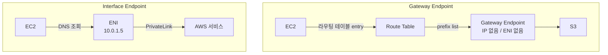
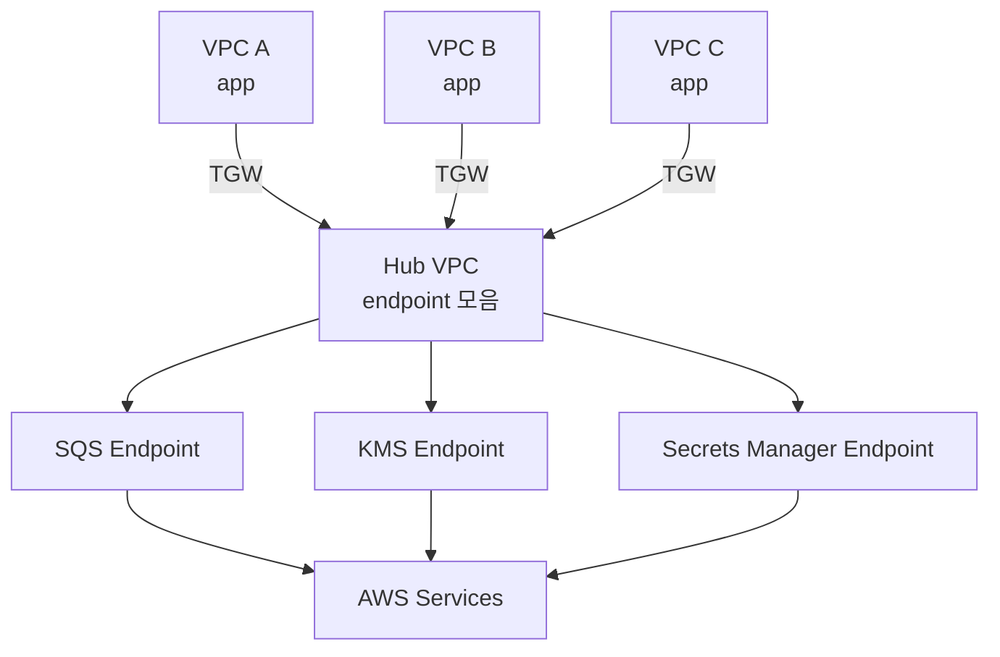

# VPC Endpoints

## 한 줄 정의

VPC 엔드포인트는 VPC 안의 리소스가 인터넷이나 NAT Gateway, VPN을 거치지 않고 AWS 서비스나 다른 VPC의 서비스에 닿게 해주는 통로다. 엔드포인트 종류에 따라 동작 원리, 라우팅 방식, 비용이 전혀 다르다. 처음 보면 둘 다 "프라이빗 연결"이라는 단어 때문에 헷갈리지만, 실제로는 거의 다른 물건이라고 봐야 한다.

## 두 가지 엔드포인트 타입

### Gateway Endpoint

Gateway Endpoint는 라우팅 테이블에 추가되는 "타겟"이다. 실체가 있는 ENI(Elastic Network Interface)도 아니고, IP 주소도 없다. 라우터에 "S3 prefix list로 가는 패킷은 이 엔드포인트로 보내라"는 항목 하나가 추가될 뿐이다.

지원하는 서비스는 두 개뿐이다.

- S3
- DynamoDB

이 두 서비스만 Gateway Endpoint를 쓸 수 있고, 그 외 모든 서비스는 Interface Endpoint를 써야 한다. AWS가 Gateway Endpoint를 새로 추가하지 않은 지 오래됐다. 신규 서비스는 전부 Interface Endpoint 쪽으로 가는 추세다.

### Interface Endpoint

Interface Endpoint는 VPC 안에 ENI를 만든다. 서브넷마다 ENI 하나씩 박힌다고 보면 된다. 이 ENI는 프라이빗 IP를 가지고, 서비스의 DNS 이름을 이 IP로 풀어주는 방식으로 동작한다.

내부적으로는 PrivateLink 기술이다. AWS 서비스든 다른 VPC의 서비스든, 사용자가 만든 서비스든 모두 같은 메커니즘이다.

지원 서비스는 매년 늘어난다. SQS, SNS, KMS, ECR, Secrets Manager, CloudWatch Logs, STS 등 거의 모든 AWS 서비스가 Interface Endpoint를 제공한다.

## 둘의 결정적 차이



핵심 차이를 표로 정리한다.

| 항목 | Gateway Endpoint | Interface Endpoint |
|---|---|---|
| 실체 | 라우팅 테이블 항목 | 서브넷 안의 ENI |
| IP 주소 | 없음 | 프라이빗 IP 보유 |
| 지원 서비스 | S3, DynamoDB | 그 외 거의 전부 |
| 비용 | 무료 | 시간 요금 + 데이터 처리 요금 |
| DNS | prefix list로 라우팅 | 프라이빗 DNS로 ENI IP 반환 |
| 온프레미스에서 사용 | 불가 | 가능 (Direct Connect/VPN 경유) |
| 보안 그룹 | 적용 안 됨 | 적용됨 (ENI니까) |
| 가용 영역 | VPC 단위 | AZ 단위로 ENI 생성 |

이 표만 보면 "그래서 둘 다 그냥 프라이빗 연결 아니냐"고 생각하기 쉬운데, 실무에서 부딪히는 문제는 거의 다 이 차이에서 나온다.

## 라우팅 동작

### Gateway Endpoint의 라우팅

Gateway Endpoint를 만들면 AWS가 prefix list를 자동으로 만들어준다. `pl-xxxxxxxx` 형태의 ID를 가진 IP 대역 묶음이다. S3의 경우 그 리전 S3의 모든 IP가 들어 있다.

라우팅 테이블에 이렇게 들어간다.

```
Destination          Target
10.0.0.0/16         local
0.0.0.0/0           nat-gateway-id
pl-63a5400a (S3)    vpce-12345678
```

EC2가 S3에 요청을 보내면, 커널이 라우팅 테이블을 보고 prefix list에 매칭되는지 검사한다. 매칭되면 엔드포인트로, 안 되면 default route(NAT Gateway나 IGW)로 간다.

여기서 함정이 하나 있다. **라우팅 테이블에 엔드포인트를 연결하지 않으면 동작하지 않는다.** 엔드포인트 자체는 만들었는데, 정작 EC2가 속한 서브넷의 라우팅 테이블에 엔드포인트가 연결 안 돼 있어서 S3 호출이 NAT Gateway로 빠지는 사례를 본 적이 있다. CloudWatch에서 NAT Gateway 트래픽이 의심스러우면 이걸 가장 먼저 의심해야 한다.

### Interface Endpoint의 라우팅

Interface Endpoint는 라우팅 테이블이 아니라 DNS로 동작한다. 프라이빗 DNS를 활성화하면 `secretsmanager.ap-northeast-2.amazonaws.com` 같은 공개 도메인이 ENI의 프라이빗 IP로 해석된다.

```bash
# 엔드포인트 만들기 전
$ dig +short secretsmanager.ap-northeast-2.amazonaws.com
52.95.194.34   # 퍼블릭 IP

# 엔드포인트 만든 후 (프라이빗 DNS 활성화)
$ dig +short secretsmanager.ap-northeast-2.amazonaws.com
10.0.1.45      # ENI 프라이빗 IP
```

이 동작 때문에 애플리케이션 코드를 손댈 필요가 없다. SDK가 평소에 호출하던 도메인을 그대로 쓰면 자동으로 엔드포인트로 라우팅된다.

다만 프라이빗 DNS를 활성화하지 않은 경우, 엔드포인트별 전용 DNS 이름을 직접 지정해야 한다. `vpce-xxx-xxx.secretsmanager.ap-northeast-2.vpce.amazonaws.com` 같은 형태다. 이건 도메인이 다르기 때문에 SDK 설정을 바꿔야 한다. 멀티 VPC 환경에서는 일부러 프라이빗 DNS를 끄고 이 방식을 쓰는 경우가 있다.

## 비용 구조

### Gateway Endpoint

무료다. 시간 요금도, 데이터 요금도 없다. S3와 DynamoDB만 지원하는 대신 비용이 0이다.

### Interface Endpoint

두 가지 요금이 붙는다.

1. **시간 요금**: AZ당 ENI 1개 기준으로 시간당 과금된다. 서울 리전 기준 시간당 약 $0.013. 한 달 약 $9.5 정도. AZ 3개에 배포하면 한 달 $28.5.
2. **데이터 처리 요금**: 엔드포인트를 통과하는 데이터에 대해 GB당 과금. $0.01/GB 수준이지만 트래픽이 많으면 무시 못 한다.

엔드포인트 종류가 늘어나면 비용이 빠르게 누적된다. SQS, KMS, Secrets Manager, ECR(API + DKR 둘 다 필요), CloudWatch Logs, STS만 깔아도 6개 서비스 × AZ 3개 × $9.5 = 한 달 $171. 거기에 데이터 요금까지.

비용 검토할 때 자주 나오는 질문이 "엔드포인트 안 쓰고 NAT Gateway만 쓰면 더 싸지 않냐"인데, 트래픽 양에 따라 다르다. NAT Gateway는 GB당 $0.045 + 시간당 $0.059이다. 데이터가 많으면 엔드포인트가 압도적으로 싸고, 적으면 NAT Gateway가 싸다.

## S3 Gateway Endpoint로 NAT Gateway 비용 절감

Gateway Endpoint의 가장 실용적인 쓰임새가 이거다. 한 번은 운영 중인 서비스의 NAT Gateway 트래픽 비용이 한 달 $400씩 나오는 걸 본 적이 있다. VPC Flow Logs를 분석해보니 80%가 S3 호출이었다. 이미지 처리 워커가 S3에서 원본 받고 가공해서 다시 S3에 올리는 구조였다.

S3 Gateway Endpoint를 추가하니까 NAT Gateway 트래픽이 그날부터 80% 빠졌다. 비용은 사라졌고 속도도 빨라졌다. 작업량은 단 하나, 라우팅 테이블에 엔드포인트 연결.

```bash
# Gateway Endpoint 생성
aws ec2 create-vpc-endpoint \
  --vpc-id vpc-1234 \
  --service-name com.amazonaws.ap-northeast-2.s3 \
  --route-table-ids rtb-private-1 rtb-private-2 rtb-private-3
```

`--route-table-ids`에 프라이빗 서브넷용 라우팅 테이블을 전부 넣어야 한다. 빠뜨린 라우팅 테이블의 EC2는 여전히 NAT Gateway를 탄다.

DynamoDB도 똑같다. DynamoDB 호출이 많은 서비스라면 Gateway Endpoint를 안 쓰는 건 돈을 버리는 거다.

## 엔드포인트 정책

엔드포인트 정책은 IAM 정책 문법으로 작성하지만, 효과는 다르다. **엔드포인트를 통과할 수 있는 요청을 제한**한다. IAM 정책이 "사용자 단위 권한"이라면, 엔드포인트 정책은 "통로 단위 권한"이다.

기본 정책은 `*` 허용이다. 즉, 아무 제한이 없다.

### 실무 사례: 회사 S3 버킷만 허용

S3 Gateway Endpoint를 통해 외부 공개 버킷이나 다른 계정 버킷에 접근하지 못하게 막고 싶을 때.

```json
{
  "Version": "2012-10-17",
  "Statement": [
    {
      "Effect": "Allow",
      "Principal": "*",
      "Action": "*",
      "Resource": [
        "arn:aws:s3:::my-company-*",
        "arn:aws:s3:::my-company-*/*"
      ]
    }
  ]
}
```

이렇게 깔면 EC2가 우연히 다른 회사 버킷이나 공개 버킷에 접근하려 해도 엔드포인트에서 막힌다. 데이터 유출 방지에 유효하다.

### 함정: 엔드포인트 정책이 너무 엄격할 때

엔드포인트 정책을 좁게 잡았는데 SDK가 엉뚱한 호출을 보내서 실패하는 경우가 있다. 예를 들어 ECR에서 이미지 pull할 때 내부적으로 STS, CloudWatch Logs 호출도 같이 일어난다. 이걸 모르고 ECR 엔드포인트 정책에 ecr 액션만 허용해 놓으면 다른 호출이 깨질 수 있다.

처음에는 정책을 `*`로 두고 동작 확인부터 한 다음, 점진적으로 좁혀가는 게 안전하다.

## 멀티 VPC, 멀티 리전 공유

### 멀티 VPC에서 엔드포인트 공유

VPC가 10개 있는데 각각에 Interface Endpoint를 깔면 비용이 폭증한다. 한 곳에 몰아두는 패턴이 있다.

**중앙 VPC + Transit Gateway 방식**



Hub VPC에만 엔드포인트를 깔고, 다른 VPC는 Transit Gateway로 Hub에 연결한다. 엔드포인트 비용을 1/N로 줄일 수 있다.

문제는 DNS다. 프라이빗 DNS는 엔드포인트가 있는 VPC에서만 작동한다. 다른 VPC에서 호출하려면 Route 53 Resolver Inbound Endpoint나 Private Hosted Zone을 별도로 구성해야 한다.

```
App VPC → DNS query → Route 53 Resolver Outbound Endpoint
       → Hub VPC의 Inbound Endpoint
       → ENI 프라이빗 IP 응답
       → TGW 통해 Hub VPC의 ENI로 트래픽 전달
```

설정이 복잡한데, 엔드포인트가 많으면 그만큼 절감 효과도 크다. 손익분기점은 보통 VPC 5개 이상부터.

### 멀티 리전

엔드포인트는 리전 단위 리소스다. 서울 리전 엔드포인트로 도쿄 리전 S3에 접근할 수 없다. 리전마다 따로 만들어야 한다.

크로스 리전 호출은 엔드포인트로 해결되지 않는다. 인터넷이나 VPC Peering을 거쳐야 한다. 이게 헷갈려서 "왜 엔드포인트 깔았는데 도쿄 S3 호출이 NAT로 가지?"라는 질문을 가끔 받는다. 엔드포인트는 같은 리전 안에서만 동작한다.

## 끊김 트러블슈팅 사례

실제로 겪은 장애 패턴 몇 개를 정리한다.

### 사례 1: 라우팅 테이블 누락

증상: 일부 EC2에서만 S3 호출이 느리다. CloudWatch에서 NAT Gateway 트래픽이 의심스럽게 많다.

원인: VPC에 서브넷이 6개 있었는데, 라우팅 테이블이 3개로 분리돼 있었다. S3 Gateway Endpoint를 만들 때 라우팅 테이블 2개에만 연결했다. 나머지 1개에 속한 EC2는 NAT를 탔다.

해결: 모든 프라이빗 라우팅 테이블에 엔드포인트 연결.

```bash
# 어느 라우팅 테이블에 연결됐는지 확인
aws ec2 describe-vpc-endpoints \
  --vpc-endpoint-ids vpce-12345 \
  --query 'VpcEndpoints[].RouteTableIds'
```

### 사례 2: 보안 그룹

증상: Interface Endpoint 만들었는데 호출이 timeout 난다.

원인: Interface Endpoint의 ENI에 붙은 보안 그룹이 default였다. default는 같은 보안 그룹에서만 인바운드를 받는다. EC2의 보안 그룹과 달랐기 때문에 차단됐다.

해결: 엔드포인트 보안 그룹의 인바운드에 EC2 보안 그룹(또는 VPC CIDR) 443 허용 추가.

```
Type: HTTPS
Protocol: TCP
Port: 443
Source: sg-ec2-application
```

이 패턴은 엔드포인트 만들 때마다 한 번씩 부딪힌다. AWS가 default 보안 그룹을 자동으로 붙이기 때문에 매번 바꿔줘야 한다.

### 사례 3: 프라이빗 DNS 비활성화

증상: 엔드포인트는 active 상태인데, 애플리케이션이 여전히 퍼블릭 IP로 호출한다.

원인: 엔드포인트 만들 때 "Enable Private DNS Name" 체크를 안 했다.

확인 방법:

```bash
# EC2에서
$ nslookup secretsmanager.ap-northeast-2.amazonaws.com
# 퍼블릭 IP가 나오면 프라이빗 DNS 비활성화 상태
```

해결: 엔드포인트 수정해서 프라이빗 DNS 활성화. 다만 같은 서비스에 대한 엔드포인트가 이미 있으면 활성화 안 된다. 한 VPC에 같은 서비스에 대해 프라이빗 DNS 엔드포인트는 하나만 가능하다.

### 사례 4: VPC DNS 설정

증상: 프라이빗 DNS 활성화했는데도 퍼블릭 IP로 해석된다.

원인: VPC의 `enableDnsSupport` 또는 `enableDnsHostnames`가 false였다. 두 옵션 다 true여야 프라이빗 DNS가 동작한다.

```bash
aws ec2 describe-vpc-attribute \
  --vpc-id vpc-1234 \
  --attribute enableDnsSupport

aws ec2 modify-vpc-attribute \
  --vpc-id vpc-1234 \
  --enable-dns-support
```

### 사례 5: AZ 미스매치

증상: 특정 AZ의 EC2에서만 Interface Endpoint 호출이 느리거나 실패한다.

원인: Interface Endpoint를 모든 AZ에 깔지 않았다. 엔드포인트가 없는 AZ의 EC2는 다른 AZ의 ENI로 가는데, 이게 cross-AZ 트래픽이 되어 비용도 더 들고 latency도 늘어난다. 심하면 PrivateLink 응답에서 끊김이 생기기도 한다.

해결: 엔드포인트를 만들 때 모든 프라이빗 서브넷을 선택. 비용은 AZ 수만큼 늘지만 안정성과 성능을 위해서는 필요하다.

### 사례 6: 엔드포인트 정책의 Resource 제한

증상: ECR에서 이미지 pull 안 된다. `AccessDenied` 에러.

원인: ECR 엔드포인트 정책에 Resource를 우리 계정 ECR로 제한했는데, ECR pull 과정에서 S3로 layer를 받는 부분이 있다. 이 S3 호출이 ECR 엔드포인트 정책에 막힌 게 아니라, S3 Gateway Endpoint 정책에 막혔다. 결국 ECR pull은 ECR 엔드포인트 + S3 엔드포인트 둘 다 통과해야 동작한다.

해결: S3 Gateway Endpoint 정책에 ECR이 사용하는 S3 버킷(`prod-${region}-starport-layer-bucket`) 허용 추가.

## 정리

VPC 엔드포인트는 단순히 "프라이빗 연결" 한 마디로 묶을 수 없는 두 종류의 리소스다. Gateway Endpoint는 S3와 DynamoDB만 위한 무료 라우팅 트릭이고, Interface Endpoint는 거의 모든 AWS 서비스를 위한 PrivateLink 기반 ENI다. 비용, 라우팅, DNS, 보안 그룹 적용이 모두 다르기 때문에 둘을 같은 도구로 생각하면 디버깅이 꼬인다.

NAT Gateway 트래픽이 비싸 보이면 일단 S3와 DynamoDB부터 Gateway Endpoint로 빼라. 그것만으로 비용이 절반 이하로 떨어지는 경우가 흔하다. Interface Endpoint는 비용이 누적되니까 정말 필요한 서비스부터 깔고, 멀티 VPC라면 Hub VPC 패턴으로 공유하는 걸 검토해라.
