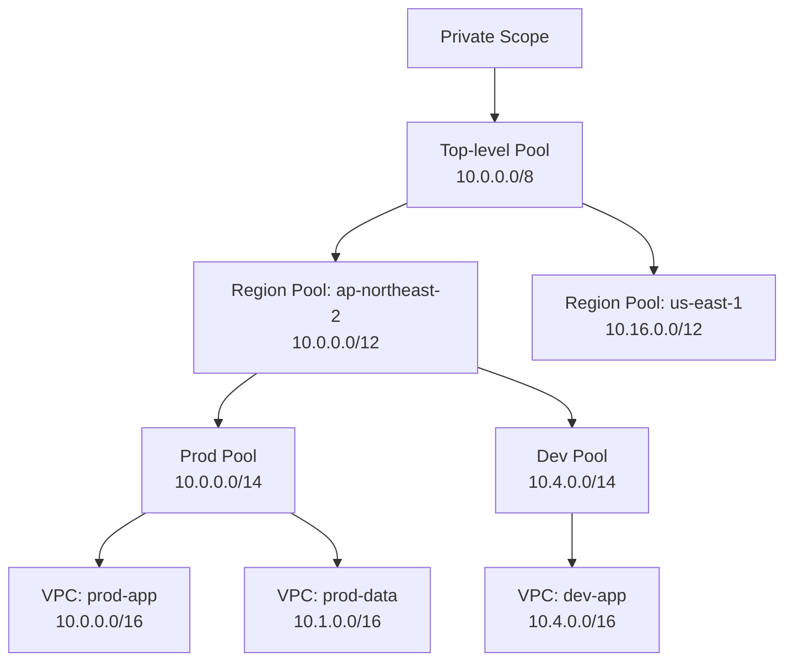
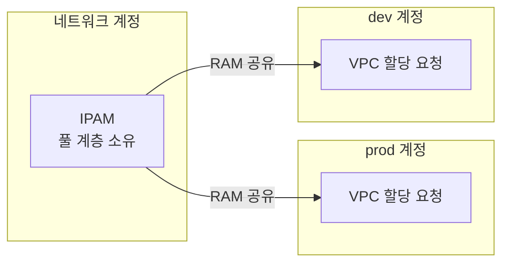

# AWS VPC IPAM (IP Address Manager)

## 개요

IPAM은 AWS 계정과 리전, 여러 VPC에 걸쳐 IP 주소를 한곳에서 관리하는 서비스다. 정식 이름은 Amazon VPC IP Address Manager다.

계정이 한두 개일 때는 IPAM이 필요 없다. VPC도 몇 개 안 되고 CIDR 대역도 머릿속에 들어온다. 문제는 계정이 늘어나면서 시작된다. Organizations로 계정을 30개, 50개씩 쪼개고 각 계정마다 VPC를 여러 개 만들면, 누가 어떤 대역을 쓰는지 아무도 모르는 상태가 된다. 스프레드시트로 관리하다가 두 팀이 같은 `10.20.0.0/16`을 잡아버리는 일이 실제로 일어난다.

[VPC.md](VPC.md)의 CIDR 설계 부분에서 다뤘듯이 VPC CIDR은 한 번 정하면 줄이거나 바꿀 수 없다. 그리고 [VPC_Peering.md](VPC_Peering.md)에서 본 것처럼 CIDR이 겹치는 두 VPC는 Peering이나 Transit Gateway로 연결할 수 없다. 이 두 제약이 합쳐지면, 대역 배분 실수 하나가 나중에 VPC 재생성이라는 큰 작업으로 돌아온다. IPAM은 그 실수를 처음부터 막으려는 도구다.

## 스프레드시트 관리가 깨지는 지점

IPAM 없이 멀티 계정 환경을 운영해 본 사람은 다음 상황을 안다.

- 새 계정을 만들 때마다 누군가 노션이나 엑셀을 열어 "다음 빈 대역"을 찾아서 알려준다.
- 그 문서를 업데이트하는 걸 깜빡한 사람이 한 명이라도 있으면 중복이 발생한다.
- 어떤 대역이 실제로 쓰이고 있고 어떤 게 예약만 해두고 안 쓰는지 구분이 안 된다.
- VPC를 지웠는데 문서에는 여전히 사용 중으로 남아 대역이 영원히 묶인다.
- Peering을 걸려다가 그제서야 두 VPC CIDR이 겹친다는 걸 발견한다.

IPAM은 이 수작업 문서를 AWS 리소스로 대체한다. 대역을 "할당받는" 순간 IPAM이 기록하고, VPC가 삭제되면 자동으로 회수한다. 중복을 막는 건 사람의 주의력이 아니라 서비스 제약이 된다.

## 풀(Pool) 계층 구조

IPAM의 핵심은 풀(pool)을 트리로 쌓는 구조다. 위에 있는 큰 풀을 잘라서 아래 작은 풀에 나눠주고, 맨 아래 풀에서 VPC가 실제 CIDR을 가져간다.



위 그림처럼 보통 4단계로 설계한다.

1. **최상위 풀(Top-level pool)**: 조직 전체가 쓸 가장 큰 대역. 사설 IP라면 `10.0.0.0/8` 같은 RFC 1918 대역을 통째로 잡는다.
2. **리전 풀(Regional pool)**: 리전별로 나눈다. IPAM 풀은 리전에 묶이기 때문에 멀티 리전이면 리전마다 풀을 둬야 한다.
3. **환경/팀 풀**: prod, dev, staging 또는 팀 단위로 자른다.
4. **VPC가 할당받는 풀**: 실제 VPC가 CIDR을 가져가는 최하위 풀.

이렇게 나눠두면 대역만 보고도 어느 환경 어느 리전인지 짐작이 된다. `10.0.x.x`면 서울 prod, `10.4.x.x`면 서울 dev 하는 식이다. 운영 중에 VPC Flow Log나 라우팅 테이블에서 IP만 봐도 출처를 알 수 있다는 게 생각보다 크다.

### 스코프(Scope)

풀 위에는 스코프가 있다. IPAM을 만들면 Private Scope와 Public Scope가 기본으로 하나씩 생긴다. 사설 대역(RFC 1918)은 Private Scope에서, 공인 IP나 BYOIP로 가져온 대역은 Public Scope에서 관리한다. 사설끼리는 겹치면 안 되지만 서로 다른 스코프 사이에서는 대역이 겹쳐도 IPAM이 막지 않는다. 대부분의 실무는 Private Scope 하나로 끝난다.

## 계정에 CIDR 자동 할당

풀을 만들 때 두 가지 동작 방식을 정할 수 있다. 이 둘의 차이가 IPAM 운영의 핵심이다.

### 자동 할당(Auto-import / Allocation)

VPC를 만들 때 CIDR을 직접 입력하지 않고 "이 IPAM 풀에서 /16 하나 줘"라고 요청한다. IPAM이 풀 안에서 비어 있는 대역을 찾아 자동으로 떼어 준다. 사람이 대역을 고를 일이 없으니 중복이 원천적으로 불가능하다.

Terraform으로 쓰면 이렇게 된다.

```hcl
# 최하위 풀 (이미 상위 풀에서 10.0.0.0/14를 받아둔 상태)
resource "aws_vpc_ipam_pool" "prod_seoul" {
  address_family = "ipv4"
  ipam_scope_id  = aws_vpc_ipam.main.private_default_scope_id
  locale         = "ap-northeast-2"
}

resource "aws_vpc_ipam_pool_cidr" "prod_seoul" {
  ipam_pool_id = aws_vpc_ipam_pool.prod_seoul.id
  cidr         = "10.0.0.0/14"
}

# VPC가 풀에서 /16을 자동으로 받아간다. cidr_block을 직접 안 쓴다.
resource "aws_vpc" "prod_app" {
  ipv4_ipam_pool_id   = aws_vpc_ipam_pool.prod_seoul.id
  ipv4_netmask_length = 16

  tags = { Name = "prod-app" }

  depends_on = [aws_vpc_ipam_pool_cidr.prod_seoul]
}
```

`cidr_block = "10.0.0.0/16"`을 직접 쓰는 대신 `ipv4_ipam_pool_id`와 `ipv4_netmask_length`만 준다. 어떤 대역이 떨어질지는 IPAM이 정한다. 똑같은 코드를 prod-data VPC에 복사해도 IPAM이 알아서 다른 `/16`을 준다.

`depends_on`을 빼먹으면 풀에 CIDR이 프로비저닝되기 전에 VPC가 할당을 시도해서 실패하는 경우가 있다. 풀에 대역을 넣는 `aws_vpc_ipam_pool_cidr`이 먼저 완료되도록 명시해야 한다.

### 할당 규칙(Allocation rules)

풀마다 어떤 크기로 떼어 줄지 규칙을 걸 수 있다.

- **최소/최대 넷마스크**: `/16`보다 크게도 작게도 못 받게 막는다. 누가 실수로 `/12`를 통째로 가져가는 걸 방지한다.
- **기본 넷마스크**: 넷마스크를 안 주면 이 크기로 준다.
- **태그 기반 할당**: 특정 태그가 붙은 요청에만 풀을 열어준다.

실무에서는 최소 넷마스크를 걸어두는 게 중요하다. 풀 크기 계획 없이 큰 대역을 떼어 가면 풀이 금방 마른다.

### 공유(RAM, Resource Access Manager)

멀티 계정에서 다른 계정의 VPC가 중앙 풀에서 대역을 받으려면 IPAM 풀을 RAM으로 공유해야 한다. IPAM 자체는 보통 네트워크 전용 계정이나 관리 계정에 두고, 각 워크로드 계정에 풀을 공유한다. 공유받은 계정은 그 풀에서 VPC CIDR을 할당받지만 풀 구조를 바꾸지는 못한다.



Organizations를 쓰면 IPAM을 Organization 단위로 위임(delegated admin)할 수 있다. 이러면 관리 계정이 아니라 지정한 네트워크 계정에서 IPAM을 운영하게 된다. 관리 계정에 권한을 몰아두지 않는 쪽이 안전하다.

## 사용률 모니터링

IPAM의 두 번째 역할이 모니터링이다. 어떤 풀이 얼마나 찼는지, 어떤 VPC가 대역을 받아갔는지 IPAM 콘솔과 API에서 본다.

각 풀에는 사용률(allocation ratio)이 뜬다. `10.0.0.0/14` 풀에서 `/16` VPC를 두 개 할당했으면 4개 중 2개를 쓴 셈이라 50%다. 이 숫자가 80%를 넘으면 슬슬 상위 풀에서 대역을 더 받아와 풀을 키울 준비를 해야 한다.

### IPAM 모니터링 데이터 활용

IPAM은 사용률 데이터를 CloudWatch 지표와 S3로 내보낸다. 풀별 사용률을 CloudWatch 알람으로 걸어두면 풀이 차오를 때 미리 알 수 있다.

```bash
# 풀 사용률 조회
aws ec2 get-ipam-pool-allocations \
  --ipam-pool-id ipam-pool-0abc123 \
  --query 'IpamPoolAllocations[].{CIDR:Cidr,Type:ResourceType,Id:ResourceId}' \
  --output table

# 스코프 안에서 실제 할당된 리소스 검색 (Flow Log/스프레드시트 대체)
aws ec2 get-ipam-resource-cidrs \
  --ipam-scope-id ipam-scope-0abc123 \
  --resource-type vpc \
  --query 'IpamResourceCidrs[].{CIDR:ResourceCidr,Account:ResourceOwnerId,Util:IpUsage.UtilizationRatio}' \
  --output table
```

`get-ipam-resource-cidrs`가 특히 쓸모 있다. 어느 계정의 어느 VPC가 어떤 대역을 쓰고 사용률이 몇 퍼센트인지 한 번에 나온다. 예전에 스프레드시트로 하던 "전체 대역 현황"을 이걸로 대체한다.

### 컴플라이언스 상태

IPAM은 각 CIDR이 풀 규칙에 맞는지도 평가한다. IPAM을 도입하기 전에 수동으로 만든 VPC가 있으면, 그 대역이 IPAM 풀 안에 들어오는지 검사해서 `compliant` / `noncompliant` / `unmanaged`로 표시한다. 기존 환경을 IPAM으로 흡수할 때 이 상태를 보면서 정리하면 된다. 이미 돌고 있는 VPC를 IPAM이 강제로 바꾸지는 않는다. 현황만 보여주고 판단은 운영자가 한다.

## IP 고갈 대응과의 연결

[VPC.md](VPC.md)에서 본 IP 고갈 문제는 두 층위로 나뉜다. 서브넷 안에서 IP가 마르는 것과, VPC 자체의 CIDR이 부족해지는 것이다. IPAM은 후자, VPC 레벨 대역 관리에 관여한다.

서브넷이 마르면 [VPC.md](VPC.md)에 나온 대로 Secondary CIDR을 VPC에 추가한다. 이때도 Secondary CIDR을 직접 입력하는 대신 IPAM 풀에서 받아오면 중복 걱정이 없다. EKS Pod IP 고갈로 `/14`짜리 대역을 통째로 추가해야 하는 상황에서도, 그 큰 대역이 다른 계정과 안 겹친다는 걸 IPAM이 보장한다.

풀 계층을 설계할 때 처음부터 여유를 둬야 한다. `/8`을 최상위로 잡고 리전에 `/12`씩 주면 리전당 VPC를 충분히 만들 수 있다. 반대로 최상위를 `/16`으로 짜게 잡으면 IPAM을 쓰더라도 금방 마른다. IPAM은 대역을 늘려주는 도구가 아니라 정해진 대역을 겹치지 않게 배분하는 도구라는 점을 잊으면 안 된다.

## Peering / Transit Gateway 제약과의 연결

[VPC_Peering.md](VPC_Peering.md)의 가장 큰 제약은 CIDR이 겹치는 VPC끼리 연결이 안 된다는 것이다. Transit Gateway로 수십 개 VPC를 별 모양으로 묶을 때 이 제약은 더 치명적이다. 한 VPC라도 대역이 겹치면 라우팅이 모호해져 연결 자체가 막힌다.

IPAM을 처음부터 쓰면 모든 VPC가 같은 최상위 풀에서 서로 겹치지 않는 대역을 받기 때문에, 나중에 어떤 VPC를 Peering이나 Transit Gateway로 묶어도 CIDR 충돌이 없다. "연결할 일이 생길지 모르니 일단 안 겹치게 받아두는" 게 기본값이 된다. 반대로 IPAM 없이 각 팀이 알아서 대역을 잡은 환경에서는, 나중에 두 VPC를 연결하려다 겹친 걸 발견하고 한쪽 VPC를 통째로 다시 만드는 일이 생긴다. 운영 중인 VPC의 CIDR은 바꿀 수 없으니 리소스를 새 VPC로 옮기는 마이그레이션이 된다. 이 작업을 한 번 겪어보면 IPAM을 왜 처음부터 깔아야 하는지 알게 된다.

## 도입 시 주의사항

기존 멀티 계정 환경에 IPAM을 나중에 끼워 넣는 건 신규 환경보다 손이 많이 간다.

- 이미 떠 있는 VPC들의 CIDR을 먼저 전수 조사해야 한다. 여기서 이미 겹치는 대역이 발견되는 경우가 흔하다. IPAM이 이걸 자동으로 풀어주지는 않는다. 어느 VPC를 옮길지는 사람이 정한다.
- IPAM 풀 계층을 기존 대역 배치에 맞춰 설계해야 한다. 깔끔한 트리를 그리고 싶어도 이미 흩어진 대역 때문에 풀이 지저분해질 수 있다.
- 기존 VPC를 IPAM 풀에 흡수(import)시키면 IPAM이 그 대역을 사용 중으로 인식한다. 흡수 전에는 IPAM이 그 대역을 빈 걸로 보고 다른 VPC에 또 줄 수 있으니, 도입 초기 순서를 조심해야 한다.
- IPAM 자체는 추가 비용이 든다. 관리하는 활성 IP 개수에 따라 과금되므로, 대역이 큰 조직은 비용을 미리 확인하는 게 좋다. 무료로 쓰던 스프레드시트와 직접 비교하면 비싸 보이지만, 중복 사고 한 번의 비용을 생각하면 다른 얘기가 된다.

신규로 멀티 계정 랜딩 존을 짤 때는 망설일 이유가 없다. VPC를 하나라도 만들기 전에 IPAM 풀 계층부터 설계하고, 모든 VPC가 풀에서 대역을 받게 강제하는 게 제일 깔끔하다. 나중에 끼워 넣는 것보다 처음부터 까는 게 압도적으로 쉽다.
