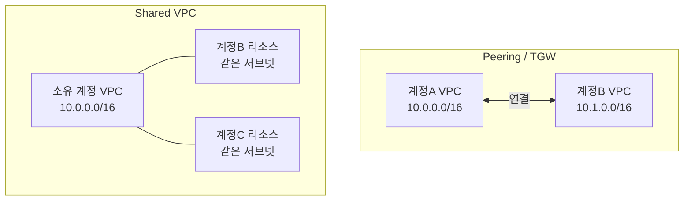

# AWS VPC Sharing (Shared VPC)

## 개요

Shared VPC는 한 계정이 소유한 VPC의 서브넷을 RAM(Resource Access Manager)으로 다른 계정에 공유하는 방식이다. 공유받은 계정은 그 서브넷에 자기 리소스(EC2, RDS, ELB 등)를 직접 띄운다. VPC를 새로 만들지 않고, 라우팅이나 Peering도 걸지 않는다. 서브넷 하나를 여러 계정이 같이 쓰는 구조다.

Peering이나 Transit Gateway가 "각자 VPC를 가진 계정들을 네트워크로 연결"하는 거라면, Shared VPC는 "VPC 자체를 공유"한다. 연결할 네트워크가 애초에 하나라서 라우팅 설정이 필요 없다. 같은 서브넷 안이면 그냥 로컬 통신이다.

조직(AWS Organizations) 안에서 네트워크 팀이 VPC를 중앙 관리하고, 애플리케이션 팀 계정들이 그 안에 워크로드만 올리는 형태로 많이 쓴다.

### 용어 정리

- **소유 계정(Owner / Participant가 아닌 쪽)**: VPC와 서브넷을 만들고 소유하는 계정. 라우팅 테이블, NAT Gateway, IGW, VPC Endpoint, NACL 등 네트워크 인프라를 전부 관리한다.
- **참여 계정(Participant)**: 공유받은 서브넷에 리소스를 띄우는 계정. 자기 리소스만 관리한다. 서브넷 자체는 못 건드린다.

이 책임 분리가 Shared VPC의 핵심이다.

## 왜 Peering/Transit Gateway 대신 서브넷 공유인가

세 가지 다 멀티 계정 네트워킹 도구지만 푸는 문제가 다르다.



**Peering / Transit Gateway가 맞는 경우:**
- 각 계정이 독립된 VPC와 CIDR 대역을 가져야 한다
- 네트워크 경계를 계정별로 명확히 나누고 싶다
- 계정 간 통신이 "가끔, 특정 서비스만" 필요하다

**서브넷 공유가 맞는 경우:**
- 여러 계정의 리소스가 같은 네트워크 대역 안에 있어야 한다
- IP 주소 공간을 중앙에서 한 번에 관리하고 싶다 (계정마다 CIDR 쪼개서 나눠주는 게 싫다)
- NAT Gateway, VPC Endpoint 같은 비싼 네트워크 인프라를 여러 계정이 공유해서 비용을 줄이고 싶다
- 같은 서브넷 안 리소스끼리는 라우팅 없이 바로 통신해야 한다

실무에서 가장 크게 와닿는 건 NAT Gateway와 VPC Endpoint 공유다. Peering 구조로 계정마다 VPC를 따로 두면 NAT Gateway도 계정마다 따로 만들어야 한다. NAT Gateway는 시간당 요금 + 데이터 처리 요금이 둘 다 붙어서 계정 수만큼 곱해지면 금방 커진다. Shared VPC면 소유 계정에 NAT Gateway 하나 두고 모든 참여 계정이 같이 쓴다.

반대로 계정 간 네트워크 격리가 보안 요구사항이라면 Shared VPC는 안 맞는다. 같은 서브넷에 있으면 SG로 막지 않는 한 서로 보인다.

## 공유 설정

### 사전 조건

RAM으로 서브넷을 공유하려면 보통 AWS Organizations 안이어야 한다. 정확히는 조직 외부 계정에도 공유는 되지만, 조직 내 공유를 켜두면 계정 ID만으로 바로 공유되고 참여 계정이 별도로 수락(accept)하지 않아도 된다.

Organizations 관리 계정에서 RAM의 조직 공유를 활성화한다.

```bash
aws ram enable-sharing-with-aws-organization
```

이걸 안 켜면 조직 내 계정에 공유해도 참여 계정이 RAM 콘솔에서 초대를 수락해야 한다.

### 서브넷 공유 (소유 계정에서)

리소스 공유(Resource Share)를 만들고 서브넷 ARN과 대상 계정을 넣는다.

```bash
aws ram create-resource-share \
  --name shared-app-subnets \
  --resource-arns arn:aws:ec2:ap-northeast-2:111111111111:subnet/subnet-0aaa1111 \
  --principals 222222222222
```

`--principals`에는 계정 ID, OU ARN, 조직 ARN을 넣을 수 있다. OU 전체에 공유하면 그 OU에 들어오는 계정이 자동으로 공유받는다.

이미 만든 공유에 서브넷이나 계정을 추가할 때:

```bash
aws ram associate-resource-share \
  --resource-share-arn arn:aws:ram:ap-northeast-2:111111111111:resource-share/abcd-1234 \
  --resource-arns arn:aws:ec2:ap-northeast-2:111111111111:subnet/subnet-0bbb2222
```

공유하는 건 VPC가 아니라 서브넷이다. 서브넷 단위로 골라서 공유한다. 어떤 서브넷은 App 계정에, 다른 서브넷은 Data 계정에만 주는 식으로 나눌 수 있다.

### 참여 계정에서 보기

조직 내 공유가 켜져 있으면 참여 계정에서 별도 작업 없이 서브넷이 바로 보인다.

```bash
aws ec2 describe-subnets \
  --filters "Name=owner-id,Values=111111111111"
```

`owner-id`가 소유 계정으로 찍힌다. 이 서브넷에 EC2를 띄우면 인스턴스는 참여 계정 소유, 서브넷은 소유 계정 소유로 분리된다.

```bash
aws ec2 run-instances \
  --image-id ami-0abc1234 \
  --instance-type t3.micro \
  --subnet-id subnet-0aaa1111 \
  --security-group-ids sg-0app5678
```

여기서 `sg-0app5678`은 참여 계정이 만든 SG여야 한다. 소유 계정의 SG는 못 쓴다(아래 보안 그룹 절 참고).

## 소유 계정과 참여 계정의 책임 분리

이 구분을 헷갈리면 "왜 내 계정에서 이게 안 보이지"로 시간을 많이 쓴다.

| 항목 | 소유 계정 | 참여 계정 |
|------|-----------|-----------|
| VPC, 서브넷 생성/삭제 | O | X |
| 라우팅 테이블, NACL | O | X |
| NAT Gateway, IGW | O | X |
| VPC Endpoint | O | X (소유 계정 것 사용) |
| EC2/RDS/ELB 등 워크로드 | O | O (공유받은 서브넷에) |
| 워크로드용 Security Group | 각자 | 각자 |

참여 계정이 띄운 EC2는 참여 계정 콘솔에서 보이고, 그 계정이 청구받고 관리한다. 하지만 그 EC2가 올라간 서브넷, 라우팅, NAT는 소유 계정 것이다. 참여 계정은 인터넷으로 나가는 경로를 바꿀 수 없다. NAT Gateway가 죽으면 참여 계정 워크로드가 다 같이 끊긴다.

그래서 네트워크 장애 대응 책임이 소유 계정(보통 네트워크 플랫폼 팀)에 집중된다. 참여 팀은 "왜 안 나가지"를 자기 계정에서 디버깅해도 답이 안 나온다. 라우팅 테이블이 다른 계정에 있으니까. 이 경계를 운영 시작 전에 양쪽이 명확히 합의해 둬야 한다.

## 보안 그룹과 라우팅 동작

### Security Group 참조

같은 Shared VPC 안에서는 참여 계정이 소유 계정의 SG, 또는 다른 참여 계정의 SG를 **인바운드 규칙의 소스로 참조**할 수 있다. 같은 VPC라서 가능하다. Peering(다른 VPC)에서는 같은 리전이어야 SG 참조가 됐지만, Shared VPC는 애초에 하나의 VPC라 제약이 덜하다.

다만 SG를 만들고 인스턴스에 붙이는 행위는 각 계정이 자기 SG로 한다. 참여 계정이 인스턴스를 띄울 때 소유 계정의 SG를 직접 붙일 수는 없다. 붙이는 건 자기 SG, 그 SG의 규칙 안에서 소유 계정 SG ID를 소스로 참조하는 건 된다.

```
참여 계정 인스턴스의 SG (sg-0app5678)
Inbound:
- Type: PostgreSQL (5432)
- Source: sg-0db9999  (다른 참여 계정의 DB SG, 같은 VPC면 참조 가능)
```

이 동작 덕분에 같은 서브넷에 올라온 여러 계정 리소스끼리 CIDR 대신 SG로 세밀하게 통제할 수 있다.

### 라우팅

라우팅 테이블은 전부 소유 계정 소유다. 참여 계정은 못 본다(describe는 제한적으로 되지만 수정 불가). 같은 서브넷이나 같은 VPC 안 다른 서브넷 간 통신은 로컬 라우팅으로 자동 처리된다. 별도 경로 추가가 필요 없다.

외부로 나가는 경로(NAT, IGW, Endpoint, TGW attachment)는 전부 소유 계정이 설정한다. 참여 계정은 그 경로를 그대로 따라간다. 그래서 "참여 계정이 자기만의 NAT를 쓰고 싶다" 같은 요구는 Shared VPC 구조에서 안 된다. 그게 필요하면 별도 VPC + TGW로 가야 한다.

## 과금 주체

과금은 "누가 만든 리소스냐"로 갈린다.

- **참여 계정 청구**: 자기가 띄운 EC2, RDS, EBS 등 워크로드. 거기서 나가는 데이터 전송 요금.
- **소유 계정 청구**: VPC 자체, NAT Gateway 시간 요금, VPC Endpoint 시간 요금, 소유 계정이 만든 인프라.

여기서 자주 헷갈리는 게 NAT Gateway 데이터 처리 요금이다. NAT Gateway를 통과하는 트래픽의 처리 요금($/GB)은 NAT Gateway를 소유한 계정, 즉 소유 계정에 청구된다. 참여 계정 인스턴스가 인터넷으로 많이 나가도 그 NAT 처리 비용은 소유 계정이 낸다. 비용 분담 정산을 따로 합의해 두지 않으면 네트워크 팀 계정 청구서만 커지는 상황이 생긴다.

VPC Endpoint도 비슷하다. 소유 계정이 Interface Endpoint를 만들면 시간 요금과 데이터 처리 요금이 소유 계정에 붙는다. 여러 참여 계정이 같이 쓰니 Endpoint를 계정마다 만드는 것보다는 싸지만, 그 비용을 누가 부담하는지는 조직 차원에서 정해야 한다.

## 실무 제약 — 일부 리소스는 공유 서브넷 미지원

서브넷을 공유받았다고 그 안에서 모든 AWS 서비스를 다 쓸 수 있는 건 아니다. 참여 계정이 공유 서브넷에서 못 만들거나 제약이 걸리는 대표적인 케이스가 있다.

- **다른 계정 리소스 참조 불가한 일부 서비스**: 참여 계정은 공유 서브넷에 자기 리소스는 띄우지만, 소유 계정이 만든 보안 그룹/네트워크 리소스를 자기 것처럼 다루지는 못한다. SG 참조(소스로 쓰기)는 되지만 수정·삭제는 안 된다.
- **Route 53 Resolver, 일부 게이트웨이 계열**: 서브넷 라우팅이나 DNS 설정을 건드려야 하는 리소스는 소유 계정만 관리한다. 참여 계정이 공유 서브넷에 Route 53 Resolver 엔드포인트 같은 걸 만들 때 제약이 있다.
- **네트워크 인프라 리소스 일반**: NAT Gateway, Internet Gateway, VPC Endpoint, Transit Gateway attachment 등은 참여 계정이 공유 서브넷에 못 만든다. 전부 소유 계정 몫이다.

핵심 원칙은 "참여 계정은 워크로드(컴퓨트/DB/로드밸런서)는 띄우지만, 네트워크 경로를 정의하는 리소스는 못 만든다"는 것이다. 특정 서비스를 공유 서브넷에서 쓸 계획이면 그 서비스가 Shared VPC를 지원하는지 사전에 확인해야 한다. AWS 문서에 서비스별 지원 여부가 정리돼 있고, 신규 서비스는 지원이 늦게 붙는 경우가 있다.

실제로 겪는 흔한 막힘:
- 참여 계정에서 ALB를 띄우려는데 서브넷은 보이지만 라우팅 동작 확인이 안 돼서 헤매는 경우. 라우팅은 소유 계정 책임이라 그쪽에 확인해야 한다.
- 참여 계정이 자기 VPC Endpoint를 만들려다 막히는 경우. Endpoint는 소유 계정이 만들어 공유해야 한다.

## 공유 서비스 VPC와의 관계

[VPC_Peering](VPC_Peering.md)의 "공유 서비스 VPC" 절에서는 중앙 서비스 VPC를 만들고 App VPC들이 Peering으로 붙는 구조를 다뤘다. AD, DNS, 모니터링 같은 공용 서비스를 한 곳에 모으는 패턴이다.

Shared VPC는 같은 목적을 다른 방식으로 푼다. Peering 기반 공유 서비스 VPC는 "VPC가 계정마다 따로 있고 그걸 연결"하는 반면, Shared VPC는 "VPC가 하나고 계정들이 그 안에 들어온다".

| 구분 | Peering 공유 서비스 VPC | Shared VPC |
|------|------------------------|------------|
| VPC 개수 | 계정마다 따로 | 하나 |
| 연결 설정 | Peering + 라우팅 양방향 | 불필요(같은 VPC) |
| IP 대역 | 계정마다 독립 CIDR | 단일 CIDR 공유 |
| 격리 수준 | VPC 경계로 강함 | 같은 서브넷이면 약함(SG로 통제) |
| NAT/Endpoint 공유 | 어려움(계정별 필요) | 쉬움(소유 계정 하나) |

둘은 배타적이지 않다. 큰 조직은 Shared VPC로 워크로드를 묶고, 그 위에 Transit Gateway를 얹어 다른 리전이나 온프레미스, 별도 VPC와 연결하는 식으로 같이 쓴다. "같은 네트워크에 묶을 계정들"은 Shared VPC로, "독립 네트워크끼리 연결"은 TGW로 역할을 나눈다.

## 트러블슈팅

### 참여 계정에서 서브넷이 안 보인다

1. RAM 조직 공유가 켜져 있는지 확인한다(`enable-sharing-with-aws-organization`). 안 켜져 있으면 참여 계정이 RAM에서 초대를 수락해야 한다.
2. Resource Share에 해당 계정 ID나 OU가 principal로 들어가 있는지 확인한다.
3. 서브넷 ARN이 공유에 실제로 associate 됐는지 확인한다.

```bash
aws ram get-resource-share-associations \
  --association-type RESOURCE \
  --resource-share-arns arn:aws:ram:ap-northeast-2:111111111111:resource-share/abcd-1234
```

### 인스턴스는 떴는데 인터넷이 안 나간다

라우팅과 NAT는 소유 계정 책임이다. 참여 계정에서 아무리 봐도 라우팅 테이블이 안 보이거나 수정이 안 된다. 소유 계정에 다음을 확인 요청한다.

- 해당 서브넷의 라우팅 테이블에 NAT Gateway(또는 IGW) 경로가 있는지
- NAT Gateway가 정상 상태인지
- NACL이 막고 있지 않은지

### 다른 계정 리소스로 통신이 안 된다

같은 VPC 안이라도 SG가 막으면 안 통한다. 상대 SG ID를 소스로 참조하거나 CIDR을 허용했는지 확인한다. 같은 서브넷이라고 자동으로 열리지 않는다. 보안 그룹은 계정과 무관하게 평소처럼 동작한다.

## 참고

- VPC 공유 문서: https://docs.aws.amazon.com/vpc/latest/userguide/vpc-sharing.html
- RAM 사용자 가이드: https://docs.aws.amazon.com/ram/latest/userguide/what-is.html
- VPC 공유 지원 리소스 목록: https://docs.aws.amazon.com/vpc/latest/userguide/vpc-sharing.html#vpc-share-limitations
- Shared VPC 비용 고려사항: https://docs.aws.amazon.com/whitepapers/latest/building-scalable-secure-multi-vpc-network-infrastructure/vpc-sharing.html
