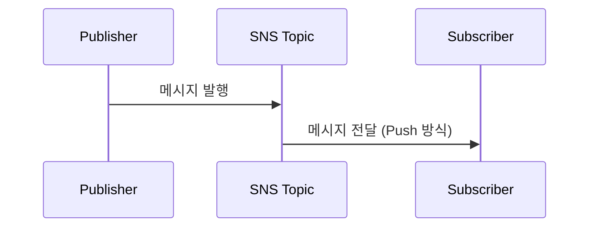

# AWS SNS (Simple Notification Service) 개요

## ✨ AWS SNS란?
AWS SNS(Simple Notification Service)는 AWS에서 제공하는 **관리형 메시지 알림 서비스**입니다. **푸시(Push) 기반**으로 다수의 구독자(Subscriber)에게 메시지를 전달하는 역할을 하며, **높은 확장성과 가용성**을 제공합니다.

---

## 📌 AWS SNS의 주요 특징
### 1️⃣ **푸시 기반 메시징 시스템**
- 메시지를 직접 전송(Push)하여 빠르게 알림 전달
- 사용자가 주기적으로 데이터를 가져올 필요 없음

### 2️⃣ **다양한 메시지 전송 대상 지원**
- 이메일(E-Mail)
- SMS(문자 메시지)
- 모바일 푸시 알림 (APNS, GCM 등)
- AWS Lambda, SQS, HTTP(S) 엔드포인트

### 3️⃣ **고가용성과 확장성**
- 대량의 트래픽을 효율적으로 처리
- 글로벌 서비스와의 원활한 연동 가능

### 4️⃣ **퍼블리셔(Publisher) - 구독자(Subscriber) 모델**
- 한 개의 퍼블리셔가 여러 구독자에게 메시지를 전달 가능

---

## 🚀 AWS SNS 작동 방식
### 👉🏻 **기본 개념**
1. **퍼블리셔(Publisher)**: 메시지를 SNS 주제(Topic)에 발행하는 역할
2. **주제(Topic)**: 메시지를 저장하고 전달하는 중심 개체
3. **구독자(Subscriber)**: SNS 주제를 구독하고 메시지를 수신하는 역할

```python
import boto3

# AWS SNS 클라이언트 생성
sns = boto3.client('sns', region_name='ap-northeast-2')

# 새 SNS 주제(Topic) 생성
response = sns.create_topic(Name='MyTopic')
topic_arn = response['TopicArn']

# 이메일 구독자 추가
sns.subscribe(
    TopicArn=topic_arn,
    Protocol='email',
    Endpoint='example@example.com'
)

# 메시지 발행 (Publisher 역할)
sns.publish(
    TopicArn=topic_arn,
    Message='Hello, this is a test notification!',
    Subject='AWS SNS Test'
)
```

#### 📌 **코드 설명**
1. `boto3.client('sns')`: AWS SNS 클라이언트를 생성합니다.
2. `create_topic()`: 새로운 SNS 주제를 생성합니다.
3. `subscribe()`: 이메일 구독자를 SNS 주제에 추가합니다.
4. `publish()`: SNS 주제에 메시지를 발행하여 모든 구독자에게 전송합니다.

---

## 🔹 AWS SNS의 메시지 흐름



### 💡 **메시지 처리 과정**
1. **Publisher가 메시지를 SNS Topic으로 발행**
2. **SNS Topic이 등록된 모든 Subscriber에게 메시지를 전송**

---

## 🔥 AWS SNS와 SQS 연동
SNS는 **SQS와 연동**하여 비동기식으로 메시지를 처리할 수 있습니다.

```python
# SQS 구독 추가
sns.subscribe(
    TopicArn=topic_arn,
    Protocol='sqs',
    Endpoint='arn:aws:sqs:ap-northeast-2:123456789012:MyQueue'
)
```

#### 📌 **설명**
- **SNS → SQS 연결**: SNS 메시지를 SQS로 전송하여 큐에서 비동기 처리 가능

---

## ✅ AWS SNS 사용 사례

### 1️⃣ **긴급 알림 시스템**
- 장애 발생 시 관리자에게 SMS, 이메일, 모바일 푸시 알림 발송

### 2️⃣ **마이크로서비스 간 메시지 브로커 역할**
- 한 서비스에서 여러 서비스로 메시지 전달 가능

### 3️⃣ **SQS 및 Lambda와 연동하여 이벤트 기반 아키텍처 구축**
- SNS → SQS → Lambda 트리거를 활용한 자동화 가능

---

## 🌟 AWS SNS 관련 FAQ
### ❓ **Q: SNS와 SQS의 차이점은?**
👉🏻 SNS는 **푸시(Push) 방식**, SQS는 **폴링(Polling) 방식**으로 메시지를 가져옵니다.

### ❓ **Q: SNS 메시지를 JSON 형식으로 전송할 수 있나요?**
👉🏻 가능합니다. `MessageStructure='json'` 옵션을 사용하면 JSON 형식으로 메시지를 발행할 수 있습니다.

```python
sns.publish(
    TopicArn=topic_arn,
    Message='{"default": "Hello!", "email": "Hello via Email!"}',
    MessageStructure='json'
)
```

---

## 🔗 참고 자료
- [AWS 공식 문서 - SNS](https://docs.aws.amazon.com/ko_kr/sns/latest/dg/welcome.html)
- [Boto3 라이브러리 - SNS](https://boto3.amazonaws.com/v1/documentation/api/latest/reference/services/sns.html)

---

## 🎯 결론
AWS SNS는 **푸시 기반 메시지 전달 및 이벤트 알림**에 최적화된 서비스입니다. **고가용성, 확장성, 다양한 전송 대상**을 지원하여 **효율적인 알림 시스템을 구축**하는 데 유용합니다! 🚀
