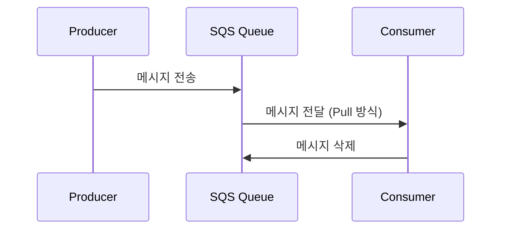

# AWS SQS (Simple Queue Service) 개요

## ✨ AWS SQS란?
AWS SQS(Simple Queue Service)는 AWS에서 제공하는 **완전관리형 메시지 큐 서비스**입니다. **비동기식**으로 분산 시스템 간 메시지를 전달하는 역할을 하며, **높은 확장성**과 **가용성**을 제공합니다.

---

## 📌 AWS SQS의 주요 특징
### 1️⃣ **완전관리형 서비스**
- 서버를 직접 운영할 필요 없이 AWS에서 자동으로 관리
- 확장성과 유지보수 부담 감소

### 2️⃣ **비동기 메시지 처리**
- 프로듀서(생산자)와 컨슈머(소비자)가 독립적으로 운영 가능
- 메시지가 저장되고, 소비자가 필요할 때 가져가는 방식

### 3️⃣ **유연한 메시지 보존 기간**
- 기본적으로 4일 동안 메시지를 보관하며, 최대 14일까지 연장 가능

### 4️⃣ **높은 확장성**
- 대량의 트래픽을 처리할 수 있도록 자동 확장됨

### 5️⃣ **다양한 유형의 큐 지원**
- **표준(Standard) 큐**: 기본 큐, 메시지 순서가 보장되지 않음
- **FIFO(First-In-First-Out) 큐**: 순서 보장 및 중복 제거 기능 제공

---

## 🚀 AWS SQS 작동 방식
### 👉🏻 **기본 개념**
1. **생산자(Producer)**: 메시지를 큐에 전송하는 역할
2. **큐(Queue)**: 메시지를 저장하는 곳
3. **소비자(Consumer)**: 큐에서 메시지를 가져와 처리하는 역할

```python
import boto3

# AWS SQS 클라이언트 생성
sqs = boto3.client('sqs', region_name='ap-northeast-2')

# 메시지 전송 (Producer 역할)
sqs.send_message(
    QueueUrl='https://sqs.ap-northeast-2.amazonaws.com/123456789012/MyQueue',
    MessageBody='Hello, this is a test message!'
)

# 메시지 수신 (Consumer 역할)
response = sqs.receive_message(
    QueueUrl='https://sqs.ap-northeast-2.amazonaws.com/123456789012/MyQueue',
    MaxNumberOfMessages=1,
    WaitTimeSeconds=10
)

# 받은 메시지 출력
print(response.get('Messages', []))
```

#### 📌 **코드 설명**
1. `boto3.client('sqs')`: AWS SQS 클라이언트를 생성합니다.
2. `send_message()`: 큐에 메시지를 전송합니다.
3. `receive_message()`: 큐에서 메시지를 가져옵니다.
4. `print(response.get('Messages', []))`: 수신한 메시지를 출력합니다.

---

## 🔹 AWS SQS의 메시지 흐름



### 💡 **메시지 처리 과정**
1. **Producer가 메시지를 SQS Queue로 전송**
2. **Consumer가 메시지를 폴링(Polling)하여 가져감**
3. **Consumer가 메시지 처리 후 삭제 요청**

---

## 🔥 AWS SQS의 메시지 삭제 개념
SQS는 메시지를 수신했다고 해서 자동 삭제되지 않습니다. **Consumer가 명시적으로 삭제 요청을 해야 합니다.**

```python
if 'Messages' in response:
    receipt_handle = response['Messages'][0]['ReceiptHandle']
    
    # 메시지 삭제 요청
    sqs.delete_message(
        QueueUrl='https://sqs.ap-northeast-2.amazonaws.com/123456789012/MyQueue',
        ReceiptHandle=receipt_handle
    )
```

#### 📌 **코드 설명**
1. `response['Messages'][0]['ReceiptHandle']`: 메시지를 삭제할 때 필요한 핸들 값을 가져옵니다.
2. `delete_message()`: 해당 메시지를 삭제하여 큐에서 제거합니다.

---

## ✅ AWS SQS 사용 사례

### 1️⃣ **비동기 데이터 처리**
- 대량의 요청을 처리하는 서비스에서 데이터베이스에 직접 쓰는 대신 SQS를 통해 큐에 적재하고, 백그라운드에서 소비자가 처리

### 2️⃣ **마이크로서비스 간 메시지 전달**
- 서로 다른 마이크로서비스가 직접 통신하는 대신 SQS를 활용하여 유연하게 메시지를 전달 가능

### 3️⃣ **이벤트 기반 처리**
- 특정 이벤트가 발생하면 메시지를 SQS로 보내고, 소비자가 해당 메시지를 처리하여 특정 작업을 수행

---

## 🌟 AWS SQS 관련 FAQ
### ❓ **Q: SQS 메시지의 최대 크기는 얼마인가요?**
👉🏻 기본적으로 메시지 크기는 **256KB**까지 지원됩니다.

### ❓ **Q: 메시지가 중복으로 소비되는 경우는?**
👉🏻 표준 큐(Standard Queue)는 **중복 가능성이 있음**, FIFO 큐는 **중복 방지 기능 제공**

### ❓ **Q: FIFO 큐와 표준 큐의 차이는?**
| 기능 | 표준 큐 | FIFO 큐 |
|------|--------|--------|
| 메시지 순서 보장 | ❌ | ✅ |
| 중복 제거 | ❌ | ✅ |
| 처리 속도 | 빠름 | 상대적으로 느림 |

---

## 🔗 참고 자료
- [AWS 공식 문서 - SQS](https://docs.aws.amazon.com/ko_kr/AWSSimpleQueueService/latest/SQSDeveloperGuide/welcome.html)
- [Boto3 라이브러리 - SQS](https://boto3.amazonaws.com/v1/documentation/api/latest/reference/services/sqs.html)

---

## 🎯 결론
AWS SQS는 **비동기 처리 및 마이크로서비스 간 통신**에 매우 유용한 서비스입니다. **확장성과 안정성**을 고려할 때, 적절하게 활용하면 서비스의 성능을 크게 향상시킬 수 있습니다! 🚀
