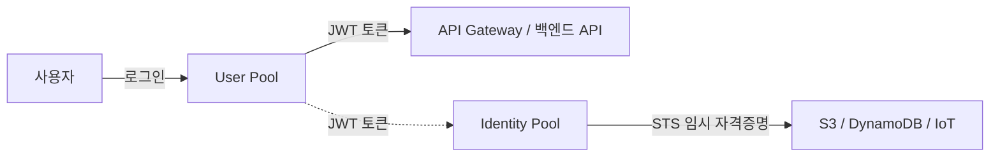
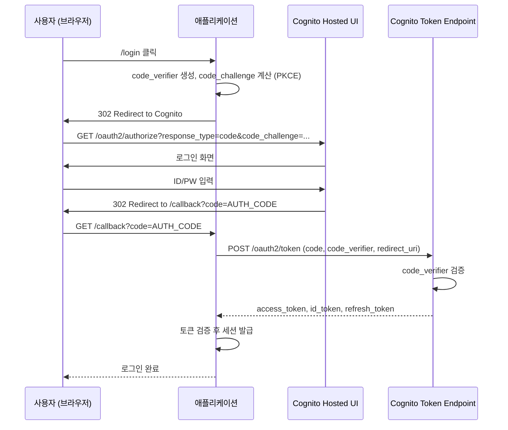

# AWS Cognito

## 개요

AWS Cognito는 회원가입, 로그인, 소셜 로그인, MFA, 토큰 발급까지 인증/인가 전반을 관리해주는 서비스다. 직접 인증 시스템을 만들면 비밀번호 해시 정책부터 토큰 갱신, 소셜 로그인 콜백, 비밀번호 분실 메일까지 코드를 작성하고 운영해야 하지만 Cognito는 그 부분을 떼어 가져간다. 대신 Cognito 자체의 동작 방식과 한계를 알아야 운영 단계에서 인증 장애를 피할 수 있다.

기본적으로 두 가지 풀로 구분된다.

| 구성 요소 | 역할 | 관점 |
|----------|------|------|
| User Pool | 사용자 디렉토리 + 인증 | "누구인가" (Authentication) |
| Identity Pool | AWS 자격증명 발급 | "AWS 리소스에 접근할 수 있는가" (Authorization) |

User Pool은 사용자 계정과 비밀번호를 저장하고 JWT를 발급한다. Identity Pool은 그 JWT를 받아서 STS 임시 자격증명으로 교환해 S3, DynamoDB 같은 AWS 리소스를 직접 호출할 수 있게 해준다. 둘은 독립적으로 쓸 수 있고, 일반적인 백엔드 API 인증에는 User Pool만 쓰는 경우가 많다.



## User Pool 토큰 구조

로그인이 성공하면 세 종류의 토큰을 받는다. 각각 용도가 다르고 만료 시간도 다르게 설정해야 한다.

| 토큰 | 용도 | 기본 만료 | 보관 위치 |
|------|------|----------|----------|
| ID Token | 사용자 정보(이메일, 이름 등) | 1시간 | 메모리 또는 임시 저장 |
| Access Token | API 호출 인가 (scope, groups) | 1시간 | 메모리 또는 임시 저장 |
| Refresh Token | Access/ID Token 재발급 | 30일 (5분~10년 설정 가능) | HttpOnly 쿠키 또는 안전한 저장소 |

ID Token과 Access Token은 보통 같이 발급되고 만료 시간도 동일하지만 용도가 다르다. ID Token은 "이 사용자가 누구인지"를 담고 있어서 프론트엔드에서 사용자 이름이나 이메일을 표시할 때 쓴다. Access Token은 "이 사용자가 무엇을 할 수 있는지"를 담고 있어서 백엔드 API 호출의 `Authorization` 헤더에 넣는다. 백엔드는 ID Token이 아닌 Access Token으로 인가를 결정해야 한다.

Refresh Token은 만료된 Access/ID Token을 재발급받기 위한 토큰이다. 절대 프론트엔드 JavaScript에서 직접 접근 가능한 곳(`localStorage`)에 두면 안 되고, 가능하면 HttpOnly 쿠키나 백엔드 세션에 보관한다.

## OAuth2 Authorization Code Flow

Cognito Hosted UI를 사용하는 경우 표준 OAuth2 Authorization Code Flow가 사용된다. SPA에서는 PKCE를 추가한 형태(Authorization Code Flow with PKCE)를 사용한다. 흐름을 정확히 이해해야 콜백에서 토큰을 어떻게 교환하는지, 어떤 단계에서 무엇을 검증해야 하는지 알 수 있다.



핵심은 인가 코드(`code`)와 토큰 교환을 분리하는 것이다. 브라우저는 인가 코드만 받고, 토큰은 백엔드(또는 SPA의 토큰 엔드포인트 호출)에서 교환한다. 이 방식이 Implicit Flow보다 안전한 이유는 토큰이 URL 파라미터로 노출되지 않기 때문이다.

PKCE(`code_verifier` + `code_challenge`)는 모바일 앱이나 SPA처럼 클라이언트 시크릿을 안전하게 보관할 수 없는 환경에서 인가 코드 탈취를 방어하기 위해 추가된 메커니즘이다. 클라이언트 시크릿이 없는 App Client를 만들면 PKCE가 강제된다.

## API Gateway와 Cognito Authorizer

API Gateway에 Cognito Authorizer를 붙이면 JWT 검증을 API Gateway가 대신 처리한다. 백엔드 Lambda나 ALB 뒤의 컨테이너는 검증된 클레임을 컨텍스트로 받기만 하면 된다.

```yaml
Resources:
  MyApi:
    Type: AWS::Serverless::Api
    Properties:
      Auth:
        DefaultAuthorizer: CognitoAuthorizer
        Authorizers:
          CognitoAuthorizer:
            UserPoolArn: !GetAtt UserPool.Arn
            Identity:
              Header: Authorization
```

다만 Cognito Authorizer는 ID Token을 기준으로 검증하기 때문에, Access Token만으로 호출하는 클라이언트가 있으면 호환성 문제가 생길 수 있다. REST API와 HTTP API가 동작 방식이 약간 다르므로 어느 쪽을 쓸지 결정할 때 토큰 타입(ID vs Access)도 같이 고려해야 한다.

## Lambda 트리거

Cognito는 인증 흐름의 각 단계에서 Lambda를 호출할 수 있다. 가장 자주 쓰는 트리거는 다음과 같다.

| 트리거 | 시점 | 자주 쓰는 용도 |
|--------|------|---------------|
| Pre Sign-up | 회원가입 직전 | 도메인 화이트리스트, 중복 검사 |
| Post Confirmation | 이메일/SMS 인증 완료 후 | DB에 사용자 레코드 생성 |
| Pre Authentication | 로그인 시도 직전 | IP 차단, 비활성 계정 차단 |
| Post Authentication | 로그인 성공 후 | 로그인 이력 기록, 마지막 로그인 시간 갱신 |
| Pre Token Generation | 토큰 발급 직전 | 커스텀 클레임 추가 (역할, 테넌트 ID) |
| Custom Message | 이메일/SMS 발송 직전 | 메시지 본문 한국어화, 템플릿 커스텀 |

Pre Token Generation 트리거는 운영하다 보면 거의 반드시 쓰게 된다. Cognito 기본 클레임만으로는 부족한 경우(예: 멀티 테넌트의 `tenant_id`, 사내 권한 시스템의 `roles`)가 많기 때문이다.

```javascript
// Pre Token Generation: 커스텀 클레임 주입
exports.handler = async (event) => {
    const userId = event.userName;
    const profile = await db.getUserProfile(userId);

    event.response = {
        claimsOverrideDetails: {
            claimsToAddOrOverride: {
                tenant_id: profile.tenantId,
                roles: profile.roles.join(','),
                plan: profile.plan
            },
            groupOverrideDetails: {
                groupsToOverride: profile.roles
            }
        }
    };
    return event;
};
```

`claimsToAddOrOverride`에 객체를 넣을 수는 없고 문자열만 가능하다. 배열은 콤마 구분 문자열로 직렬화하거나 JSON 문자열로 넣어야 한다. 백엔드에서 다시 파싱해야 하는 부담이 있지만 Cognito 사양상 어쩔 수 없다.

## Spring Boot 연동

Spring Security의 `oauth2-resource-server`로 Cognito Access Token을 검증한다. JWKS 자동 갱신과 캐싱을 Spring이 처리한다.

```yaml
spring:
  security:
    oauth2:
      resourceserver:
        jwt:
          issuer-uri: https://cognito-idp.ap-northeast-2.amazonaws.com/${COGNITO_USER_POOL_ID}
          jwk-set-uri: https://cognito-idp.ap-northeast-2.amazonaws.com/${COGNITO_USER_POOL_ID}/.well-known/jwks.json
```

```java
@Configuration
@EnableWebSecurity
public class SecurityConfig {

    @Value("${app.cognito.client-id}")
    private String clientId;

    @Bean
    public SecurityFilterChain filterChain(HttpSecurity http) throws Exception {
        http
            .csrf(csrf -> csrf.disable())
            .sessionManagement(s -> s.sessionCreationPolicy(SessionCreationPolicy.STATELESS))
            .authorizeHttpRequests(auth -> auth
                .requestMatchers("/api/public/**", "/health").permitAll()
                .requestMatchers("/api/admin/**").hasAuthority("ROLE_admin")
                .anyRequest().authenticated()
            )
            .oauth2ResourceServer(oauth2 -> oauth2
                .jwt(jwt -> jwt
                    .jwtAuthenticationConverter(cognitoJwtConverter())
                    .decoder(cognitoJwtDecoder())
                )
            );
        return http.build();
    }

    @Bean
    public JwtDecoder cognitoJwtDecoder() {
        NimbusJwtDecoder decoder = NimbusJwtDecoder
            .withJwkSetUri("https://cognito-idp.ap-northeast-2.amazonaws.com/" 
                + userPoolId + "/.well-known/jwks.json")
            .build();

        OAuth2TokenValidator<Jwt> withIssuer = JwtValidators.createDefaultWithIssuer(
            "https://cognito-idp.ap-northeast-2.amazonaws.com/" + userPoolId);

        OAuth2TokenValidator<Jwt> withAudience = jwt -> {
            // Access Token은 client_id 클레임, ID Token은 aud 클레임에 client_id가 들어있다
            String tokenUse = jwt.getClaimAsString("token_use");
            String audience = "access".equals(tokenUse)
                ? jwt.getClaimAsString("client_id")
                : jwt.getAudience().stream().findFirst().orElse(null);

            return clientId.equals(audience)
                ? OAuth2TokenValidatorResult.success()
                : OAuth2TokenValidatorResult.failure(
                    new OAuth2Error("invalid_audience"));
        };

        decoder.setJwtValidator(new DelegatingOAuth2TokenValidator<>(withIssuer, withAudience));
        return decoder;
    }

    private JwtAuthenticationConverter cognitoJwtConverter() {
        JwtGrantedAuthoritiesConverter authoritiesConverter = new JwtGrantedAuthoritiesConverter();
        authoritiesConverter.setAuthoritiesClaimName("cognito:groups");
        authoritiesConverter.setAuthorityPrefix("ROLE_");

        JwtAuthenticationConverter converter = new JwtAuthenticationConverter();
        converter.setJwtGrantedAuthoritiesConverter(authoritiesConverter);
        converter.setPrincipalClaimName("sub");
        return converter;
    }
}
```

`audience` 검증을 직접 추가한 이유는 Cognito Access Token에는 `aud` 클레임이 없고 `client_id` 클레임에 App Client ID가 들어가기 때문이다. ID Token은 반대로 `aud`에 들어간다. 이 차이를 모르고 기본 검증만 쓰면 다른 App Client에서 발급된 토큰도 통과한다.

```java
@RestController
public class MeController {

    @GetMapping("/api/me")
    public Map<String, Object> me(@AuthenticationPrincipal Jwt jwt) {
        return Map.of(
            "userId", jwt.getSubject(),
            "email", jwt.getClaimAsString("email"),
            "groups", jwt.getClaimAsStringList("cognito:groups"),
            "tenantId", jwt.getClaimAsString("tenant_id")
        );
    }
}
```

## NestJS 연동

NestJS는 Passport와 `passport-jwt`로 Cognito JWT를 검증한다. JWKS 키 가져오기는 `jwks-rsa` 라이브러리에 맡긴다.

```typescript
// cognito.strategy.ts
import { Injectable, UnauthorizedException } from '@nestjs/common';
import { PassportStrategy } from '@nestjs/passport';
import { Strategy, ExtractJwt } from 'passport-jwt';
import { passportJwtSecret } from 'jwks-rsa';

@Injectable()
export class CognitoStrategy extends PassportStrategy(Strategy, 'cognito') {
  constructor() {
    const region = process.env.AWS_REGION;
    const userPoolId = process.env.COGNITO_USER_POOL_ID;
    const clientId = process.env.COGNITO_CLIENT_ID;
    const issuer = `https://cognito-idp.${region}.amazonaws.com/${userPoolId}`;

    super({
      secretOrKeyProvider: passportJwtSecret({
        cache: true,
        cacheMaxAge: 10 * 60 * 1000,
        rateLimit: true,
        jwksRequestsPerMinute: 10,
        jwksUri: `${issuer}/.well-known/jwks.json`,
      }),
      jwtFromRequest: ExtractJwt.fromAuthHeaderAsBearerToken(),
      issuer,
      algorithms: ['RS256'],
    });

    this.clientId = clientId;
  }

  async validate(payload: any) {
    // Access Token과 ID Token 구분
    if (payload.token_use === 'access') {
      if (payload.client_id !== this.clientId) {
        throw new UnauthorizedException('Invalid client_id');
      }
    } else if (payload.token_use === 'id') {
      if (payload.aud !== this.clientId) {
        throw new UnauthorizedException('Invalid audience');
      }
    } else {
      throw new UnauthorizedException('Unknown token_use');
    }

    return {
      userId: payload.sub,
      email: payload.email,
      groups: payload['cognito:groups'] ?? [],
      tenantId: payload.tenant_id,
    };
  }
}
```

```typescript
// auth.guard.ts
import { Injectable } from '@nestjs/common';
import { AuthGuard } from '@nestjs/passport';

@Injectable()
export class CognitoAuthGuard extends AuthGuard('cognito') {}

// 컨트롤러에서 사용
@Controller('api')
export class ApiController {
  @UseGuards(CognitoAuthGuard)
  @Get('me')
  getMe(@Req() req) {
    return req.user;
  }
}
```

`jwks-rsa`의 `cache: true`와 `rateLimit: true`는 반드시 켜둔다. 이게 없으면 매 요청마다 JWKS 엔드포인트를 호출하게 되어 Cognito rate limit에 걸리고 응답 지연이 발생한다.

## 트러블슈팅 사례

### Refresh Token 만료 후 처리

운영하다 보면 가장 많이 보는 패턴이다. 사용자가 30일 동안 앱을 안 쓰면 Refresh Token이 만료되고, 클라이언트에서 토큰 갱신 요청을 보내면 `NotAuthorizedException: Refresh Token has expired`가 떨어진다. 문제는 이 에러를 access token 만료와 같이 처리해서 무한 갱신 루프에 빠지는 경우다.

```typescript
async function refreshAccessToken(refreshToken: string) {
  try {
    const result = await cognito.initiateAuth({
      AuthFlow: 'REFRESH_TOKEN_AUTH',
      ClientId: clientId,
      AuthParameters: { REFRESH_TOKEN: refreshToken },
    }).promise();
    return result.AuthenticationResult;
  } catch (e: any) {
    // NotAuthorizedException은 두 가지 의미를 가진다:
    // 1. Refresh Token이 만료됨
    // 2. Refresh Token이 revoke됨 (글로벌 사인아웃, 비밀번호 변경)
    // 3. App Client 시크릿 불일치
    if (e.code === 'NotAuthorizedException') {
      // 재로그인 유도. 갱신 재시도하지 말 것.
      throw new ReloginRequiredError(e.message);
    }
    throw e;
  }
}
```

추가로 주의할 점은 비밀번호 변경, 사용자 삭제, 글로벌 사인아웃(`GlobalSignOut`) 호출 시 발급된 Refresh Token이 모두 무효화된다는 것이다. 사용자가 다른 디바이스에서 비밀번호를 바꾸면 현재 디바이스의 Refresh Token은 즉시 죽는다. 이 케이스도 동일하게 재로그인 유도로 처리해야 한다.

Access Token은 stateless라 비밀번호를 바꿔도 만료 시간(보통 1시간)까지는 유효하다. 즉시 무효화하려면 Cognito Token Revocation을 활성화하거나 백엔드에서 자체 블랙리스트를 운영해야 한다.

### Lambda 트리거 타임아웃

Cognito Lambda 트리거는 5초 타임아웃이 걸려 있고, 이건 Lambda 함수 자체의 타임아웃 설정과는 별개다. Lambda 타임아웃을 30초로 잡아도 Cognito 쪽에서 5초 안에 응답이 안 오면 인증 자체가 실패한다. 콜드 스타트가 자주 일어나는 함수에서 특히 문제가 된다.

증상: 사용자 회원가입이 간헐적으로 실패하면서 `UnexpectedLambdaException`이 떨어진다. CloudWatch에는 Lambda가 정상 종료된 로그가 남아 있는데 Cognito는 실패로 처리한다.

원인:

- Lambda 콜드 스타트 (특히 VPC 내부 Lambda)
- Post Confirmation에서 외부 API 호출 (메일링 서비스, 결제 시스템 등)
- DynamoDB나 RDS 첫 연결 지연

대응:

```javascript
// Post Confirmation 트리거 안티패턴
exports.handler = async (event) => {
    await sendWelcomeEmail(event);     // 외부 SMTP, 2~3초 소요
    await registerToCRM(event);         // 외부 API, 3~5초 소요
    await createUserInDB(event);        // DynamoDB
    return event;
};
```

위 코드는 합쳐서 5초를 넘기기 쉽다. 핵심은 동기적으로 꼭 해야 하는 일과 비동기로 미뤄도 되는 일을 분리하는 것이다.

```javascript
// 동기는 DB 생성만, 나머지는 SQS/SNS로 비동기 처리
exports.handler = async (event) => {
    await createUserInDB(event);

    await sns.publish({
        TopicArn: process.env.USER_REGISTERED_TOPIC,
        Message: JSON.stringify({
            userId: event.userName,
            email: event.request.userAttributes.email,
            registeredAt: new Date().toISOString(),
        }),
    }).promise();

    return event;
};
```

웰컴 메일과 CRM 등록은 SNS 구독자 Lambda에서 처리한다. 이 Lambda가 실패해도 회원가입 자체는 성공한 상태이므로 사용자 경험을 해치지 않는다. 콜드 스타트가 걱정되면 Provisioned Concurrency를 1~2 정도로 둔다.

### 이메일 검증 코드 재전송 제한

회원가입 후 이메일 인증 코드를 받지 못한 사용자가 재전송 버튼을 여러 번 누르면 `LimitExceededException: Attempt limit exceeded, please try after some time` 에러가 발생한다. 기본 제한은 사용자당 시간 단위로 카운트되며, 정확한 수치는 공개되어 있지 않지만 5~6회 정도다. 한 번 걸리면 약 10~15분 정도 풀리지 않는다.

이 에러는 코드 검증 시도(`ConfirmSignUp`)와 코드 재전송(`ResendConfirmationCode`) 모두에 적용된다. 사용자 경험상 가장 안 좋은 패턴은 다음과 같다.

1. 사용자가 회원가입
2. 메일이 안 와서 재전송 버튼 클릭
3. 메일이 또 안 와서 재전송 버튼 클릭
4. ... (5회 반복)
5. 갑자기 가입 자체가 막힘

대응 방법은 클라이언트에서 재전송 쿨타임을 두고, 백엔드에서 에러 처리를 명확히 하는 것이다.

```typescript
// 60초 쿨타임을 클라이언트에서 강제
const RESEND_COOLDOWN_MS = 60_000;

async function resendCode(username: string) {
  const last = localStorage.getItem(`resend:${username}`);
  if (last && Date.now() - Number(last) < RESEND_COOLDOWN_MS) {
    throw new Error('잠시 후 다시 시도해주세요');
  }

  try {
    await cognito.resendConfirmationCode({
      ClientId: clientId,
      Username: username,
    }).promise();
    localStorage.setItem(`resend:${username}`, String(Date.now()));
  } catch (e: any) {
    if (e.code === 'LimitExceededException') {
      throw new Error('재전송 한도를 초과했습니다. 10분 후 다시 시도하거나 고객센터로 문의해주세요.');
    }
    throw e;
  }
}
```

근본적으로는 메일 도달률을 높이는 게 우선이다. Cognito 기본 SES 설정으로는 도착률이 낮은 편이라, 운영 환경에서는 자체 SES(검증된 도메인 + DKIM/SPF 설정)를 연동하거나 SendGrid 같은 외부 메일 서비스로 Custom Message 트리거를 통해 발송하는 것이 일반적이다.

### 토큰 캐싱과 시계 오차

JWT 검증 시 `exp` 클레임을 검증할 때 서버 시계가 어긋나 있으면 정상 토큰을 만료로 판단한다. EC2는 ntpd가 자동으로 도는 편이지만 컨테이너 환경에서는 호스트 시간이 어긋나 있는 경우가 가끔 있다. JWT 라이브러리 대부분은 `clockSkew` 옵션으로 30~60초의 허용 오차를 둘 수 있으니 적당히 설정해둔다.

JWKS 캐시도 주의해야 한다. Cognito가 키를 로테이션하면 `kid`가 바뀌는데, 캐시된 공개키 목록에 새 `kid`가 없으면 `kid not found` 에러로 모든 토큰 검증이 실패한다. `kid` 미스 시 강제 갱신 로직이 반드시 있어야 한다.

## Cognito 선택 기준

자체 인증 시스템과 비교했을 때 Cognito가 어울리는 경우와 그렇지 않은 경우가 명확히 갈린다.

| 항목 | Cognito | 자체 구축 | Auth0 |
|------|---------|----------|-------|
| 비용 | MAU 기반 (50K까지 무료) | 서버/운영 비용 | MAU 기반 (7K까지 무료) |
| 구현 시간 | 며칠 | 수개월 | 며칠 |
| 커스텀 | Lambda 트리거로 제한적 | 완전 자유 | 커스텀 규칙 (JS) |
| AWS 통합 | 네이티브 | 별도 구현 | SDK 필요 |
| 소셜 로그인 | 기본 제공 | 직접 구현 | 기본 제공 |
| 멀티 테넌시 | App Client 분리 | 자유롭게 설계 | Tenant 모델 제공 |

AWS 위에서 운영하는 서비스이고 사용자 수가 수만~수십만 단위라면 Cognito가 가성비가 좋다. 다만 사용자 데이터 모델이 복잡하거나(가족 계정, 팀 권한, 위임 등), 인증 흐름에 비표준 단계가 많거나, 멀티 클라우드 환경이면 자체 구축이나 Auth0 쪽이 낫다.

## 더 깊이 들어가기

JWT 검증 내부, JWKS 키 캐싱 전략, Lambda 트리거 디자인 패턴 등 운영 단계의 세부 사항은 [Cognito 심화](Cognito_Deep_Dive.md) 문서를 참고한다.

## 참고

- [AWS Cognito 공식 문서](https://docs.aws.amazon.com/cognito/)
- [IAM](IAM.md) — AWS 리소스 접근 제어
- [API Gateway](../Network/API_Gateway.md) — Cognito Authorizer 설정
- [인증 전략](../../Backend/Authentication/Authentication_Strategy.md) — 인증 방식 비교
