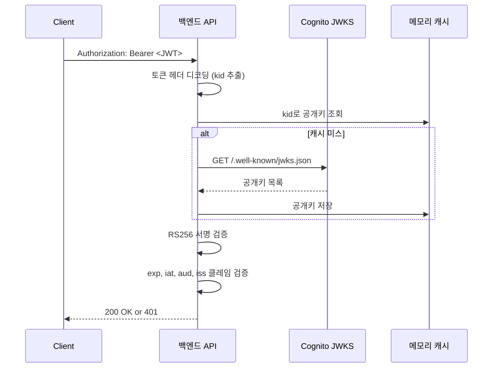

# AWS Cognito 심화

기본 개념은 [Cognito 가이드](./Cognito.md)를 참고하고, 이 문서는 실제 운영하면서 부딪히는 문제 위주로 정리한다. Cognito는 처음 붙일 때는 단순해 보이지만, JWT 검증을 잘못 하거나 Lambda 트리거 설계를 잘못하면 운영 단계에서 인증 장애로 이어진다. SaaS 환경에서 5년 가까이 Cognito를 운영하면서 겪은 함정과 패턴을 모았다.

## 1. JWT 토큰 검증 내부 동작

Cognito가 발급하는 JWT는 RS256 비대칭 서명을 사용한다. HS256과 다르게 검증 측에서는 공개키만 있으면 되고, 비밀키는 Cognito가 보관한다. 이 공개키는 JWKS(JSON Web Key Set) 엔드포인트에서 가져온다.

JWKS URL 형식은 고정되어 있다.

```
https://cognito-idp.<region>.amazonaws.com/<userPoolId>/.well-known/jwks.json
```

이 엔드포인트는 보통 두 개의 키를 반환한다. 하나는 ID Token용, 하나는 Access Token용이다. 키는 `kid`(key id) 필드로 구분되고, 토큰 헤더에도 같은 `kid`가 들어 있다. 검증 코드는 토큰 헤더의 `kid`로 JWKS에서 매칭되는 키를 찾아 서명을 검증한다.

### 검증 흐름



JWKS 엔드포인트를 매 요청마다 호출하면 안 된다. Cognito 측 rate limit에 걸리고 응답 지연도 무시 못 한다. 보통 메모리 캐시에 5~10분 정도 보관하고 `kid`가 매칭 안 되는 경우에만 강제 갱신한다. 키 로테이션 자체는 수년 단위로 일어나기 때문에 자주 갱신할 필요는 없다.

### 검증 코드 예제 (Node.js)

`aws-jwt-verify` 라이브러리가 JWKS 캐싱과 검증 로직을 모두 처리해준다. 직접 `jsonwebtoken`과 `jwks-rsa`를 조합하는 것보다 훨씬 안전하다.

```typescript
import { CognitoJwtVerifier } from "aws-jwt-verify";

const verifier = CognitoJwtVerifier.create({
  userPoolId: "ap-northeast-2_xxxxxx",
  tokenUse: "access",
  clientId: "1a2b3c4d5e6f7g8h",
  // 클럭 스큐 5초 허용 (서버 시간이 약간 빠른 경우 대비)
  graceSeconds: 5,
});

export async function verifyToken(token: string) {
  try {
    const payload = await verifier.verify(token);
    return payload;
  } catch (e) {
    // JwtExpiredError, JwtInvalidSignatureError 등 세분화된 에러
    throw new Error(`Token verification failed: ${e.message}`);
  }
}
```

직접 구현할 때 자주 빠뜨리는 검증 항목이 있다.

- `iss` 클레임이 `https://cognito-idp.<region>.amazonaws.com/<userPoolId>` 와 정확히 일치하는지
- `token_use` 클레임이 `access` 또는 `id` 중 기대한 값인지
- Access Token의 경우 `client_id`가 자기 앱의 client id와 일치하는지
- ID Token의 경우 `aud`가 자기 앱의 client id와 일치하는지
- `exp` 만료 시간 검증 (대부분 라이브러리가 자동 처리)

`aud`와 `client_id`는 토큰 종류에 따라 위치가 다르다는 점이 헷갈리는 부분이다. ID Token은 `aud`에, Access Token은 `client_id`에 들어간다. OAuth2 표준 차이 때문에 이렇게 갈렸다.

### 클럭 스큐 처리

서버 시간이 약간 빠르면 토큰이 발급된 직후에도 `iat`(issued at) 검증에서 실패할 수 있다. 분산 환경에서 NTP 동기화가 완벽하지 않으면 ±몇 초 차이가 흔하다. `graceSeconds` 또는 `clockTolerance` 옵션으로 5~10초 정도 허용하는 게 안전하다. 단, 너무 크게 잡으면 만료 시간 검증이 느슨해진다.

## 2. ID Token vs Access Token 용도 구분

이 둘을 헷갈리면 보안 사고로 이어진다. 가장 흔한 실수는 백엔드 API에서 ID Token을 인증에 쓰는 경우다.

| 항목 | ID Token | Access Token |
|------|----------|--------------|
| 용도 | 사용자 신원 증명 (Authentication) | 리소스 접근 권한 (Authorization) |
| 표준 | OIDC (OpenID Connect) | OAuth 2.0 |
| 포함 클레임 | email, name, custom 속성 등 사용자 정보 | scope, groups, username |
| 수신자 | 클라이언트 앱 자신 | 리소스 서버 (백엔드 API) |
| 폐기 가능 여부 | 불가 (만료 전까지 유효) | GlobalSignOut으로 무효화 가능 |

ID Token은 클라이언트가 "내 사용자가 누구인지" 알기 위한 것이다. 그래서 `aud` 클레임이 클라이언트 앱 ID로 설정된다. 백엔드 API에 ID Token을 그대로 넘기면, API 입장에서는 자기에게 발급된 토큰이 아니라 클라이언트에게 발급된 토큰을 받는 셈이다. OAuth2 위협 모델에서 명시적으로 금지하는 패턴이다.

### ID Token을 백엔드 인증에 쓰면 생기는 실제 문제

- 사용자 PII가 매 요청마다 백엔드로 흘러간다. 로그에 토큰이 찍히면 GDPR/개인정보보호법 위반 소지
- ID Token은 GlobalSignOut으로 무효화할 수 없다. 사용자가 로그아웃해도 토큰 만료 전까지 살아있다
- Custom Scope을 못 쓴다. ID Token에는 OAuth scope 개념이 없다
- 토큰 크기가 커진다 (사용자 속성이 많을수록). HTTP 헤더 크기 제한에 걸릴 수 있다

백엔드 API 인증은 무조건 Access Token을 써야 한다. ID Token은 SPA가 사용자 프로필을 보여줄 때만 쓰고, 백엔드로는 보내지 않는다.

## 3. Refresh Token 회전과 Revocation

Access Token은 짧게(기본 1시간), Refresh Token은 길게(기본 30일) 살아있는 구조다. Refresh Token이 탈취되면 30일간 무제한으로 토큰을 발급받을 수 있기 때문에 보호가 중요하다.

### Refresh Token Rotation

Cognito는 2024년부터 Refresh Token Rotation을 지원한다. Refresh Token으로 새 Access Token을 받을 때마다 Refresh Token도 새 것으로 교체되는 방식이다. 이전 Refresh Token은 짧은 grace period 후 무효화된다.

App Client 설정에서 `EnableTokenRevocation`과 함께 활성화한다. 이걸 켜면 동일 Refresh Token을 두 번 사용하면 두 번째는 거부되고, 의심스러운 활동으로 탐지하면 전체 세션을 무효화하는 식의 방어가 가능하다.

### Revocation 방법

토큰 무효화 방법은 세 가지다.

1. **GlobalSignOut**: 사용자가 직접 자기 모든 디바이스 로그아웃. Access Token으로 호출.
2. **AdminUserGlobalSignOut**: 관리자가 특정 사용자 강제 로그아웃. AWS 자격증명 필요.
3. **RevokeToken**: 특정 Refresh Token만 무효화. App Client에서 `EnableTokenRevocation`이 켜져 있어야 함.

```typescript
import {
  CognitoIdentityProviderClient,
  AdminUserGlobalSignOutCommand,
  RevokeTokenCommand,
} from "@aws-sdk/client-cognito-identity-provider";

const client = new CognitoIdentityProviderClient({ region: "ap-northeast-2" });

// 관리자가 사용자 강제 로그아웃 (탈취 의심시)
async function forceSignOut(username: string) {
  await client.send(
    new AdminUserGlobalSignOutCommand({
      UserPoolId: "ap-northeast-2_xxxxxx",
      Username: username,
    })
  );
}

// 특정 Refresh Token만 무효화 (로그아웃 시)
async function revokeRefreshToken(refreshToken: string) {
  await client.send(
    new RevokeTokenCommand({
      ClientId: "1a2b3c4d5e6f7g8h",
      Token: refreshToken,
    })
  );
}
```

운영하면서 부딪히는 함정은 GlobalSignOut을 호출해도 **이미 발급된 Access Token은 만료 전까지 살아있다**는 점이다. Cognito가 무효화하는 건 Refresh Token과 새로운 토큰 발급 능력이지, 이미 외부로 나간 Access Token이 아니다. Access Token까지 차단하려면 백엔드에서 별도로 블랙리스트(예: Redis에 jti 저장)를 운영하거나, Access Token 수명을 5분 정도로 짧게 가져가야 한다.

## 4. Lambda 트리거 동시성 함정

Cognito Lambda 트리거는 동기 호출이다. 사용자가 가입/로그인할 때마다 Lambda가 실행되고, 응답이 오기 전까지 Cognito가 대기한다. 5초 넘으면 타임아웃 나고 사용자에게 에러가 노출된다.

### Post Confirmation 멱등성

Post Confirmation 트리거는 사용자 확인 직후 호출된다. 보통 자체 DB에 사용자 레코드를 INSERT하는 용도로 쓴다. 문제는 이 트리거가 **재시도될 수 있다**는 점이다.

```typescript
// 잘못된 예 — 재시도 시 중복 INSERT 또는 unique 위반
export const handler = async (event: PostConfirmationTriggerEvent) => {
  await db.user.create({
    cognitoSub: event.request.userAttributes.sub,
    email: event.request.userAttributes.email,
  });
  return event;
};

// 올바른 예 — UPSERT로 멱등성 보장
export const handler = async (event: PostConfirmationTriggerEvent) => {
  await db.user.upsert({
    where: { cognitoSub: event.request.userAttributes.sub },
    update: {},
    create: {
      cognitoSub: event.request.userAttributes.sub,
      email: event.request.userAttributes.email,
    },
  });
  return event;
};
```

재시도가 일어나는 시나리오는 여러 가지다.

- Lambda가 5초 내 응답했지만 Cognito가 응답을 받기 전에 네트워크 단절
- Lambda 콜드 스타트로 응답 지연
- DB 일시 장애로 Lambda가 에러 반환했다가 클라이언트가 재시도

`cognitoSub`(불변 사용자 식별자)를 키로 UPSERT하면 안전하다. 이메일을 키로 쓰면 안 된다 — 사용자가 이메일을 변경할 수 있고, 같은 이메일로 두 번 가입할 수도 있다.

### Pre Token Generation 무한 호출 방지

Pre Token Generation 트리거는 토큰 발급 직전에 호출된다. 여기서 토큰 클레임을 추가/수정할 수 있다. 자주 쓰는 패턴은 자체 DB에서 권한 정보를 가져와 토큰에 넣는 것이다.

```typescript
export const handler = async (event: PreTokenGenerationTriggerEvent) => {
  const sub = event.request.userAttributes.sub;
  const userRole = await db.user.findUnique({
    where: { cognitoSub: sub },
    select: { role: true, tenantId: true },
  });

  event.response = {
    claimsOverrideDetails: {
      claimsToAddOrOverride: {
        "custom:role": userRole.role,
        "custom:tenantId": userRole.tenantId,
      },
    },
  };
  return event;
};
```

이 트리거는 토큰이 발급될 때마다 호출된다. Refresh Token으로 새 Access Token 받을 때도 호출된다. 즉, Access Token이 1시간마다 갱신되면 사용자 1명당 시간당 1번 호출된다. 사용자가 1만 명이면 시간당 1만 번. DB 조회를 매번 하면 부담이 크다.

흔히 빠지는 함정은 **Pre Token Generation 안에서 Cognito API를 호출**하는 경우다. 예를 들어 AdminGetUser로 사용자 정보를 다시 가져오면, 그 호출 자체가 Pre Token Generation을 트리거하지는 않지만 다른 작업이 토큰 갱신을 일으키면 무한 루프 비슷한 상황이 만들어진다. 더 큰 문제는 Cognito API rate limit에 걸리는 것이다 — Cognito는 초당 호출 수 제한이 까다롭다.

권한 정보는 가능하면 DB에서 한 번 조회해서 ElastiCache 같은 곳에 짧게(30~60초) 캐시하는 패턴이 안전하다.

## 5. 사용자 마이그레이션 트리거로 점진 이관

기존 자체 인증 시스템에서 Cognito로 옮길 때, 모든 사용자 비밀번호를 한 번에 옮길 수 없다. 비밀번호는 해시로 저장돼 있어 평문을 모른다. 이때 User Migration Lambda 트리거를 쓴다.

흐름은 이렇다.

1. 사용자가 Cognito로 로그인 시도
2. Cognito에 해당 사용자가 없음 → User Migration 트리거 호출
3. Lambda가 기존 DB에서 사용자 조회, 비밀번호 검증
4. 검증 성공하면 Lambda가 사용자 속성 반환
5. Cognito가 그 정보로 사용자를 자동 생성 + 로그인 처리

```typescript
export const handler = async (event: UserMigrationTriggerEvent) => {
  if (event.triggerSource === "UserMigration_Authentication") {
    const user = await legacyDb.user.findUnique({
      where: { email: event.userName },
    });

    if (!user) {
      throw new Error("User not found");
    }

    const valid = await bcrypt.compare(event.request.password, user.passwordHash);
    if (!valid) {
      throw new Error("Invalid password");
    }

    event.response = {
      userAttributes: {
        email: user.email,
        email_verified: "true",
        "custom:legacyId": String(user.id),
      },
      finalUserStatus: "CONFIRMED",
      messageAction: "SUPPRESS", // 환영 메일 안 보냄
    };
    return event;
  }

  if (event.triggerSource === "UserMigration_ForgotPassword") {
    // 비밀번호 재설정 시에도 호출됨 — 비밀번호 검증 없이 사용자 정보만 반환
    const user = await legacyDb.user.findUnique({
      where: { email: event.userName },
    });
    event.response = {
      userAttributes: { email: user.email, email_verified: "true" },
      finalUserStatus: "CONFIRMED",
      messageAction: "SUPPRESS",
    };
    return event;
  }
};
```

운영하면서 주의할 점이 몇 가지 있다.

- **App Client의 인증 흐름을 `USER_PASSWORD_AUTH`로 설정**해야 User Migration이 동작한다. SRP는 클라이언트가 비밀번호 평문을 서버로 안 보내기 때문에 마이그레이션 트리거가 평문 비밀번호를 받을 수 없다.
- 마이그레이션 완료 후에는 `USER_SRP_AUTH`로 전환하는 게 보안상 안전하다. USER_PASSWORD_AUTH는 평문 비밀번호가 TLS 위로 흐른다.
- 기존 DB에 락이 걸리거나 부하가 심한 경우 로그인 자체가 느려진다. 마이그레이션 기간에는 기존 DB 부하를 모니터링해야 한다.
- 마이그레이션이 끝난 사용자는 다시 호출되지 않는다. 90일 후 미이관 사용자는 별도로 처리할 전략이 필요하다.

## 6. Cognito Groups vs Identity Pool Rule

권한 매핑 방식이 두 가지인데, 헷갈리는 부분이라 정리한다.

### Cognito Groups

User Pool 내부의 그룹 개념이다. 사용자를 그룹에 넣으면 토큰 클레임에 `cognito:groups` 배열이 들어간다.

```json
{
  "cognito:groups": ["admin", "developer"],
  "username": "user123",
  ...
}
```

백엔드 API에서 이 클레임을 읽어 권한 판단을 하면 된다. RBAC 구현이 단순하다. Identity Pool과 무관하게 작동한다.

각 그룹에 IAM Role을 매핑할 수도 있는데, 이건 Identity Pool과 연계할 때 의미가 있다. Identity Pool이 사용자에게 IAM 자격증명을 발급할 때 그룹의 IAM Role을 줄 수 있다.

### Identity Pool Rule 기반 Role 매핑

Identity Pool에서 토큰 클레임 값에 따라 IAM Role을 동적으로 매핑하는 기능이다. 예를 들어 토큰의 `custom:tier` 값이 "premium"이면 PremiumRole, "free"면 FreeRole을 부여하는 식이다.

```
규칙 예: claim "custom:department" Equals "engineering" -> EngineeringRole
```

이 방식의 장점은 그룹 멤버십에 의존하지 않고 임의의 클레임으로 권한을 결정할 수 있다는 것이다. 단점은 Identity Pool 콘솔에서 규칙을 관리해야 하고, 디버깅이 어렵다는 것이다.

### 언제 무엇을 쓰나

| 상황 | 추천 |
|------|------|
| 백엔드 API 권한 판단 | Cognito Groups → 토큰 클레임으로 처리 |
| AWS 리소스 직접 접근 (S3, DynamoDB) | Identity Pool + 그룹별 IAM Role |
| 클라이언트가 AWS SDK로 S3 업로드 | Identity Pool 필수 |
| 모든 요청이 백엔드 통하는 단순 SaaS | Identity Pool 불필요, Cognito Groups만 |

실제로는 Identity Pool 없이 User Pool만 쓰는 경우가 더 많다. 백엔드가 모든 AWS 리소스 접근을 대행하면 클라이언트가 직접 IAM 자격증명을 가질 이유가 없다.

## 7. Advanced Security Features

별도 과금되지만 보안이 중요한 서비스라면 켜는 게 좋다. 두 가지 핵심 기능이 있다.

### Adaptive Authentication

로그인 시도의 위험도를 분석해서 동적으로 MFA를 요구한다. 평소 한국에서만 로그인하던 사용자가 갑자기 다른 국가에서 시도하면 위험도 점수가 올라간다. 위험도가 임계값을 넘으면 MFA를 강제하거나 차단한다.

위험도 판단 기준은 IP, 디바이스, 접속 시간 패턴 등이다. AWS가 학습한 모델을 쓰기 때문에 직접 튜닝은 못 하지만, 차단 임계값(Low/Medium/High)은 조절할 수 있다.

토큰 클레임에 `risk_decision`(`Allow`/`Block`/`NoAction`)이 들어오기 때문에 백엔드에서 이 값을 보고 추가 검증을 할 수도 있다.

### Compromised Credentials

다크웹 등에서 유출된 자격증명 데이터베이스와 대조해서, 사용자가 유출된 비밀번호를 사용 중이면 차단하거나 비밀번호 재설정을 강제한다. 회원가입/비밀번호 변경 시점에 검사한다.

함정은 기존 사용자에게는 즉시 적용되지 않는다는 것이다. 다음 로그인 시점에 검사된다. 그리고 false positive가 아예 없는 건 아니라서, "Block" 모드보다는 "MFA 강제" 모드로 시작하는 게 사용자 경험에 안전하다.

월별 활성 사용자(MAU) 기준으로 추가 과금이라 비용 산정 시 주의해야 한다.

## 8. 토큰 만료 후 Refresh 처리 패턴

클라이언트에서 Access Token이 만료되면 Refresh Token으로 갱신해야 한다. 단순해 보이지만 동시 요청 처리가 까다롭다.

문제 시나리오: SPA가 동시에 5개의 API를 호출했는데 모두 401(토큰 만료)을 받는다. 각 요청이 독립적으로 Refresh를 시도하면 Refresh Token을 5번 쓰게 된다. Token Rotation이 켜져 있으면 첫 번째만 성공하고 나머지는 실패하면서 사용자가 강제 로그아웃된다.

### Refresh 큐잉 패턴

```typescript
let refreshPromise: Promise<string> | null = null;

async function getValidToken(): Promise<string> {
  const token = localStorage.getItem("accessToken");
  if (token && !isExpired(token)) return token;

  // 이미 진행 중인 refresh가 있으면 그 Promise를 공유
  if (refreshPromise) {
    return refreshPromise;
  }

  refreshPromise = doRefresh().finally(() => {
    refreshPromise = null;
  });
  return refreshPromise;
}

async function doRefresh(): Promise<string> {
  const refreshToken = localStorage.getItem("refreshToken");
  const res = await fetch("/auth/refresh", {
    method: "POST",
    body: JSON.stringify({ refreshToken }),
  });
  if (!res.ok) {
    // Refresh 실패 시 강제 로그아웃
    localStorage.clear();
    window.location.href = "/login";
    throw new Error("Refresh failed");
  }
  const { accessToken, refreshToken: newRefresh } = await res.json();
  localStorage.setItem("accessToken", accessToken);
  localStorage.setItem("refreshToken", newRefresh);
  return accessToken;
}
```

서버 측에서도 Refresh 엔드포인트는 동일 사용자/Refresh Token에 대해 짧은 시간 내 중복 호출되지 않도록 락을 잡는 게 좋다. Redis에 키를 잡고 SETNX 패턴으로 처리한다.

만료 판단도 정확해야 한다. `exp` 시간을 그대로 비교하지 말고 30~60초 정도 여유를 두는 게 안전하다. 네트워크 왕복 중에 만료되면 401이 떠서 재시도해야 하기 때문이다.

## 9. MAU 과금 산정 방식

Cognito 과금이 단순해 보이지만 함정이 있다.

### MAU 정의

MAU는 한 달 동안 한 번이라도 인증 활동을 한 사용자 수다. "활동"의 정의가 중요하다.

- 로그인 (InitiateAuth, AdminInitiateAuth)
- 회원가입 (SignUp, AdminCreateUser)
- 비밀번호 변경, 속성 변경
- Refresh Token으로 토큰 갱신

Refresh로 토큰만 받아도 MAU에 포함된다. 즉, 한 번 로그인한 사용자가 한 달 내내 토큰만 갱신해도 MAU 1명으로 카운트된다. 반대로 가입만 하고 활동이 없는 사용자는 MAU에 포함 안 된다.

월 단위로 리셋되며, 같은 사용자가 100번 로그인해도 1명이다. 월간 활성 사용자가 5만 명 미만이면 무료(Free Tier)다.

### M2M (Machine-to-Machine) 별도 과금

Client Credentials Grant로 토큰을 받는 M2M 인증은 MAU와 별도로 **요청 수 기반 과금**이다. 백엔드 서비스간 통신에 Cognito를 쓰면 비용 구조가 완전히 달라진다.

M2M은 각 토큰 발급당 과금되기 때문에, Access Token을 캐시 없이 매 요청마다 발급받으면 비용이 빠르게 늘어난다. Access Token 수명에 맞춰 클라이언트 측에서 캐시하는 게 필수다.

```typescript
let cachedToken: { token: string; expiresAt: number } | null = null;

async function getServiceToken(): Promise<string> {
  if (cachedToken && cachedToken.expiresAt > Date.now() + 60_000) {
    return cachedToken.token;
  }

  const res = await fetch(`https://${domain}/oauth2/token`, {
    method: "POST",
    headers: {
      "Content-Type": "application/x-www-form-urlencoded",
      Authorization: `Basic ${btoa(`${clientId}:${clientSecret}`)}`,
    },
    body: "grant_type=client_credentials&scope=api/read",
  });
  const { access_token, expires_in } = await res.json();
  cachedToken = {
    token: access_token,
    expiresAt: Date.now() + expires_in * 1000,
  };
  return access_token;
}
```

비용 청구서를 보면 User Pool MAU와 M2M Token Requests가 별도 라인으로 잡힌다. 한 번 정확히 분석해보지 않으면 비용이 어디서 발생했는지 추적하기 어렵다.

## 10. Hosted UI 도메인과 ACM 인증서

Hosted UI는 Cognito가 제공하는 로그인 페이지다. 도메인 설정 방법이 두 가지인데, 운영 환경에서는 커스텀 도메인을 쓰는 게 일반적이다.

### Cognito 기본 도메인

`<prefix>.auth.<region>.amazoncognito.com` 형식. 무료고 즉시 사용 가능하지만 브랜딩이 안 된다. 사용자가 amazoncognito.com 도메인으로 리다이렉트되면 피싱 의심을 받는다.

### 커스텀 도메인

`auth.example.com` 같은 자기 도메인을 쓰려면 ACM 인증서가 필요한데, 제약이 까다롭다.

- ACM 인증서는 **반드시 us-east-1(N. Virginia) 리전에서 발급**받아야 한다. Cognito User Pool이 다른 리전에 있어도 인증서는 us-east-1이다. CloudFront 백엔드를 쓰기 때문이다.
- 커스텀 도메인은 루트 도메인에 직접 못 붙인다. `example.com`은 안 되고 `auth.example.com` 같은 서브도메인만 가능하다.
- DNS A 레코드(별칭)로 CloudFront 배포에 연결한다. CNAME도 가능하다.
- 도메인 변경 시 전파에 1시간 정도 걸린다. 운영 중 변경은 신중해야 한다.

처음 셋업 후에는 거의 건드릴 일이 없지만, 인증서 갱신 시 ACM 자동 갱신이 동작하는지 확인해야 한다. ACM은 자동 갱신되지만 DNS 검증 레코드가 사라지면 갱신 실패한다.

## 11. Terraform으로 User Pool 관리할 때 schema 함정

Cognito User Pool을 Terraform으로 관리하려고 하면 곧바로 부딪히는 함정이 있다. **Schema(custom 속성)는 한 번 정의하면 변경/삭제가 불가능하다.**

```hcl
resource "aws_cognito_user_pool" "main" {
  name = "my-pool"

  schema {
    name                = "tenantId"
    attribute_data_type = "String"
    mutable             = true
    string_attribute_constraints {
      min_length = 1
      max_length = 256
    }
  }
}
```

이 schema 블록을 나중에 수정하려고 하면 Terraform이 User Pool 전체를 destroy/create 하려고 한다. **이러면 모든 사용자가 날아간다.** Production 환경에서는 절대 일어나면 안 되는 일이다.

대처 방법은 몇 가지다.

- `lifecycle { ignore_changes = [schema] }` 로 Terraform이 schema를 무시하게 한다. 변경은 콘솔이나 CLI로 직접.
- 새 속성 추가는 `aws cognito-idp add-custom-attributes` CLI 명령으로 추가한다. 이건 가능하다.
- 기존 속성의 데이터 타입이나 제약 변경은 불가능. 새 속성을 만들고 데이터를 마이그레이션해야 한다.
- `mutable: true`로 만든 속성은 값을 바꿀 수 있지만, `mutable: false`는 한 번 정해진 값을 바꿀 수 없다.

Custom 속성은 25개까지만 만들 수 있다는 제약도 있다. 처음 설계할 때 신중하게 결정해야 한다. "혹시 모르니까" 식으로 마구 추가하면 나중에 후회한다.

User Pool을 처음 만든 후에는 Terraform import로 가져와서 `ignore_changes`를 추가해 두는 패턴이 안전하다.

## 12. App Client Secret과 인증 흐름

App Client는 Client Secret 발급 여부에 따라 사용 가능한 인증 흐름이 달라진다.

### Client Secret이 있는 경우

서버 사이드 앱(백엔드 서비스)에서 사용한다. 모든 인증 요청에 `SECRET_HASH`가 필요하다.

```typescript
import { createHmac } from "crypto";

function calculateSecretHash(username: string, clientId: string, secret: string): string {
  return createHmac("sha256", secret)
    .update(username + clientId)
    .digest("base64");
}

// InitiateAuth 호출 시 SecretHash 포함
await client.send(
  new InitiateAuthCommand({
    ClientId: clientId,
    AuthFlow: "USER_PASSWORD_AUTH",
    AuthParameters: {
      USERNAME: username,
      PASSWORD: password,
      SECRET_HASH: calculateSecretHash(username, clientId, clientSecret),
    },
  })
);
```

SECRET_HASH 빠뜨려서 NotAuthorizedException 받는 케이스가 정말 흔하다. 에러 메시지가 친절하지 않아서 디버깅이 어렵다.

### Client Secret이 없는 경우

SPA, 모바일 앱처럼 코드가 사용자에게 노출되는 환경에서 사용한다. Client Secret을 안전하게 보관할 수 없기 때문이다. SECRET_HASH 없이 호출 가능하다.

### USER_SRP_AUTH vs USER_PASSWORD_AUTH

| 흐름 | 비밀번호 전송 | 사용 환경 |
|------|--------------|----------|
| USER_SRP_AUTH | 평문 전송 안 함 (SRP 프로토콜) | SDK 사용 가능한 환경 권장 |
| USER_PASSWORD_AUTH | 평문 전송 (TLS 보호) | User Migration 트리거 필요 시, 단순 환경 |
| ADMIN_USER_PASSWORD_AUTH | 평문 전송 (서버에서) | 백엔드에서 사용자 인증 대행 |
| CUSTOM_AUTH | 커스텀 챌린지 | OTP, 패스워드리스 등 |

SRP는 비밀번호 평문을 네트워크에 안 보낸다. 클라이언트가 챌린지를 받아 응답하는 방식. AWS Amplify SDK가 자동으로 처리해줘서 SDK를 쓰면 신경 안 써도 된다.

USER_PASSWORD_AUTH는 비밀번호가 평문으로 Cognito까지 간다. TLS로 암호화되긴 하지만 SRP보다는 약하다. User Migration 트리거를 쓰려면 이 흐름이 필수다.

ADMIN_USER_PASSWORD_AUTH는 백엔드에서 사용자 비밀번호를 직접 받아 Cognito로 인증하는 방식이다. 비밀번호가 백엔드를 통과하기 때문에 백엔드 신뢰가 전제된다. 잘 안 쓰지만, 커스텀 로그인 페이지를 만들 때 사용한다.

## 13. ALB Cognito 통합 vs API Gateway Authorizer

Cognito와 통합 가능한 AWS 서비스가 여러 개 있는데, 각각 동작 방식이 다르다.

### ALB Cognito 통합

Application Load Balancer가 직접 Cognito 인증을 처리한다. 인증되지 않은 요청은 ALB 단계에서 Hosted UI로 리다이렉트된다. 백엔드 코드는 인증을 신경 쓸 필요가 없다.

장점은 백엔드 변경 없이 인증을 추가할 수 있다는 것. 단점은 너무 강제적이다 — 부분적으로 인증 없이 접근 가능한 엔드포인트(예: 헬스체크, 공개 API)를 만들기 까다롭다. ALB Listener Rule로 분기시켜야 한다.

ALB는 인증 후 백엔드로 요청을 보낼 때 사용자 정보를 헤더에 추가한다.

```
x-amzn-oidc-data: <JWT>
x-amzn-oidc-identity: <subject>
x-amzn-oidc-accesstoken: <access token>
```

`x-amzn-oidc-data` 헤더의 JWT는 ALB가 자체 키로 서명한 것이다. Cognito JWKS가 아닌 ALB의 공개키로 검증해야 한다.

```
https://public-keys.auth.elb.<region>.amazonaws.com/<kid>
```

ALB 키는 1주일마다 로테이션되기 때문에 캐시 갱신 주기가 짧아야 한다.

### API Gateway Cognito Authorizer

REST API용 Cognito Authorizer는 Authorization 헤더에서 토큰을 받아 Cognito에 직접 검증한다. 검증 결과는 캐시된다(기본 5분).

장점은 설정이 단순하고 메소드별로 인증 여부를 지정할 수 있다는 것. 단점은 토큰 검증 외 추가 로직(예: 권한 체크)을 못 한다. 추가 로직이 필요하면 Lambda Authorizer를 써야 한다.

HTTP API는 JWT Authorizer를 쓴다. JWT를 직접 검증하기 때문에 Cognito 호출이 없어 더 빠르다.

### 언제 무엇을 쓰나

| 상황 | 추천 |
|------|------|
| 백엔드 변경 없이 인증 추가 | ALB Cognito |
| 공개 + 인증 엔드포인트 혼재 | API Gateway Authorizer |
| 마이크로서비스 게이트웨이 | API Gateway HTTP API + JWT Authorizer |
| 복잡한 권한 정책 (RBAC, ABAC) | Lambda Authorizer + 자체 검증 |

대부분의 백엔드 서비스에서는 ALB나 API Gateway에 의존하지 않고 **백엔드 코드 안에서 JWT를 직접 검증**하는 게 가장 유연하다. 권한 로직, 멀티테넌시, 감사 로그 등 비즈니스 요구사항을 자유롭게 처리할 수 있다.

## 14. 트러블슈팅 사례

운영하면서 자주 만나는 에러들을 정리한다. Cognito 에러 메시지가 추상적이라 원인 추적이 어렵다.

### NotAuthorizedException

가장 자주 보는 에러. 원인이 너무 다양하다.

- 비밀번호 틀림 (가장 흔한 케이스)
- SECRET_HASH 누락 또는 잘못 계산됨
- App Client에서 해당 인증 흐름이 비활성화됨 (예: USER_PASSWORD_AUTH 미허용)
- 사용자가 DISABLED 상태
- Refresh Token이 무효화됨 (GlobalSignOut 후)
- Token Rotation 켜진 상태에서 같은 Refresh Token 두 번 사용

CloudTrail에서 InitiateAuth 호출 로그를 보면 더 구체적인 errorCode를 확인할 수 있다.

### UserNotConfirmedException

회원가입은 했지만 이메일/SMS 확인이 안 된 상태에서 로그인 시도. 클라이언트가 이 에러를 받으면 확인 코드 입력 화면으로 보내야 한다.

자동 확인 트리거(Pre Sign-up Lambda에서 `autoConfirmUser: true`)를 설정하면 회피 가능하다. 단 보안상 권장은 아니다.

### 토큰 검증 실패 원인 추적

토큰 검증이 실패할 때 흔한 원인들.

- **`kid` 매칭 실패**: JWKS 캐시가 오래되어 새 키를 모르는 경우. JWKS 강제 갱신 후 재시도.
- **`iss` 불일치**: User Pool ID가 다른 토큰. 멀티 User Pool 환경에서 흔함. region이 잘못된 경우도 있음.
- **`aud` / `client_id` 불일치**: 다른 App Client에서 발급된 토큰. 각 App Client마다 별도로 검증해야 함.
- **`exp` 만료**: 가장 흔함. 클럭 스큐 5초 정도 허용했는지 확인.
- **`token_use` 불일치**: ID Token을 Access Token으로 검증하려는 경우. 또는 그 반대.
- **서명 알고리즘 오인**: Cognito는 RS256만 사용. HS256 검증 시도하면 실패.

토큰을 jwt.io에 붙여넣으면 헤더와 페이로드를 디코딩해서 클레임을 확인할 수 있다(서명 검증은 안 됨). 디버깅 시 유용하지만 production 토큰을 외부 사이트에 붙여넣는 건 위험하다는 점 주의.

### Lambda 트리거 에러로 가입/로그인 실패

Lambda 트리거에서 throw하거나 5초 타임아웃 나면 가입/로그인이 실패한다. 이때 사용자에게 보이는 에러는 `UserLambdaValidationException` 정도로 추상적이다.

CloudWatch Logs에서 해당 Lambda 로그를 확인해야 진짜 원인을 알 수 있다. 트리거 디버깅 시에는 Lambda에 충분한 로그를 남기고, 에러는 try/catch로 감싸 의미 있는 메시지로 변환하는 게 좋다.

```typescript
export const handler = async (event: PostConfirmationTriggerEvent) => {
  try {
    await db.user.upsert({ ... });
  } catch (e) {
    console.error("Post confirmation failed", { sub: event.request.userAttributes.sub, error: e });
    // 사용자 가입은 막지 않고 비동기로 재처리
    await dlq.send({ event });
  }
  return event;
};
```

Post Confirmation에서 에러 throw하면 사용자 가입 자체가 실패하지 않는다 — 사용자는 이미 confirmed 상태가 됐다. 다만 DB 동기화가 깨져서 운영상 문제가 된다. DLQ나 SQS로 재처리 큐를 두는 게 안전하다.

### Rate Limit 관련 에러

Cognito는 API별로 까다로운 rate limit이 있다.

- AdminInitiateAuth: 30 req/sec (계정 단위)
- InitiateAuth: 120 req/sec
- AdminGetUser: 25 req/sec
- AdminUpdateUserAttributes: 25 req/sec

`TooManyRequestsException`을 받으면 exponential backoff으로 재시도한다. 대량 사용자 마이그레이션이나 일괄 속성 업데이트 작업 시 쉽게 부딪힌다. SQS로 큐잉해서 천천히 처리하는 패턴이 안전하다.

quota 증가 요청은 Service Quotas에서 가능하지만 승인까지 며칠 걸리고, 일부 limit은 증가가 불가능하다. 처음 설계 단계에서 rate limit을 고려해야 한다.
