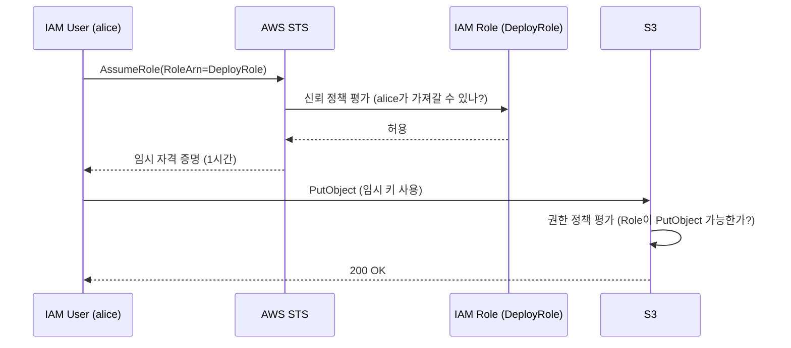
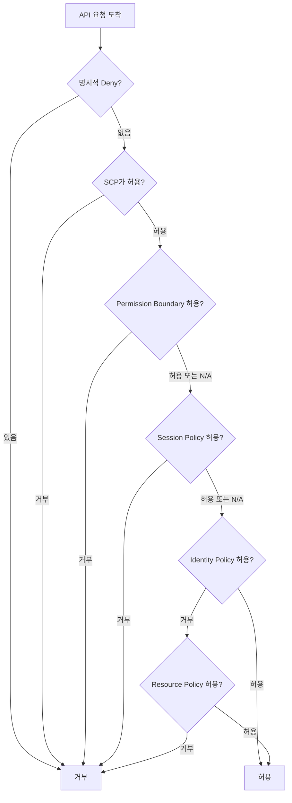

# AWS IAM

AWS에서 보안 사고가 터지는 경로는 거의 다 IAM이다. EC2가 털리는 게 아니라, EC2에 붙어있던 역할이 너무 넓은 권한을 가지고 있어서 털린다. S3 버킷이 공개된 게 아니라, 엉뚱한 IAM 사용자가 PutBucketPolicy 권한을 가지고 있어서 공개된다. IAM을 제대로 이해하지 못하면 다른 보안 서비스를 아무리 쌓아도 의미가 없다.

이 문서는 IAM의 4가지 핵심 객체(User/Group/Role/Policy)와 STS, 신뢰 정책, Permission Boundary, 최소 권한 설계에서 자주 놓치는 포인트를 다룬다.

---

## 4가지 객체의 차이

IAM에는 User, Group, Role, Policy 4가지 객체가 있다. 이름은 비슷해 보여도 역할이 다 다르다.

### User

사람이나 시스템이 AWS에 접근할 때 쓰는 영구 자격 증명이다. 영구라는 말이 핵심이다. 한 번 만들면 비활성화하거나 지우기 전까지 계속 살아있고, 액세스 키를 발급하면 그 키도 영구적이다.

User에는 두 가지 자격 증명이 붙는다.

- 콘솔 로그인용 패스워드
- 프로그래매틱 접근용 액세스 키 (Access Key ID + Secret Access Key)

문제는 액세스 키가 평문으로 한 번 보여주고 끝난다는 점이다. 잃어버리면 재발급해야 한다. 이 키가 git에 올라가면 1분 안에 봇이 채굴 인스턴스를 돌리기 시작한다. 실제로 토요일 새벽에 친구 계정에서 미국 리전에 c5.24xlarge 30대가 떠 있는 걸 본 적이 있다. 원인은 GitHub 퍼블릭 레포에 푸시된 .env 파일이었다.

요즘 AWS는 사람용 User 생성을 권장하지 않는다. IAM Identity Center(구 SSO)를 쓰거나, 외부 IdP에서 OIDC/SAML로 페더레이션하는 쪽이 표준이다. User는 CI 시스템처럼 페더레이션이 어려운 워크로드용으로만 남기는 게 좋다.

### Group

User들을 묶는 컨테이너다. Group 자체는 권한을 행사하지 않는다. Group에 정책을 붙이면 그 Group에 속한 User들이 정책을 상속받는다.

자주 헷갈리는 점이 두 가지 있다.

첫째, Group은 Group을 포함할 수 없다. 중첩이 안 된다. 그래서 "백엔드팀 안에 결제팀" 같은 계층 구조를 만들고 싶다면 Group으로는 못 만들고, Path 속성이나 태그로 구분해야 한다.

둘째, Role은 Group에 들어갈 수 없다. Group은 User만 담는다. Role을 묶고 싶다면 Permission Boundary나 SCP(Service Control Policy)로 묶어야 한다.

### Role

임시 자격 증명을 발급받는 객체다. User와 가장 큰 차이는 영구 키가 없다는 것이다. Role은 누군가가 AssumeRole을 호출해야만 자격 증명이 생기고, 그 자격 증명은 길어야 12시간 후에 만료된다.

Role은 두 종류의 정책을 가진다.

- 신뢰 정책 (Trust Policy): 이 Role을 누가 가져갈 수 있는가
- 권한 정책 (Permissions Policy): 이 Role을 가져간 사람이 무엇을 할 수 있는가

이 두 정책은 완전히 다른 역할을 한다. 신뢰 정책이 인증, 권한 정책이 인가에 가깝다고 보면 된다.

### Policy

JSON으로 작성된 권한 명세다. Policy는 단독으로 존재하다가 User/Group/Role/리소스에 붙어서 효과를 발휘한다. 붙지 않은 Policy는 아무 의미가 없다.

Policy의 종류는 어디에 붙느냐로 나뉜다.

- Identity-based Policy: User/Group/Role에 붙는 정책. "이 사람은 무엇을 할 수 있다"
- Resource-based Policy: S3 버킷, SQS 큐, KMS 키 등에 붙는 정책. "이 리소스는 누구의 접근을 허용한다"
- Permission Boundary: User/Role의 권한 상한선
- SCP: Organizations 단위의 권한 상한선
- Session Policy: AssumeRole 시에 인라인으로 전달하는 추가 제약

여러 정책이 한 요청에 동시에 평가되는 경우가 흔해서, 평가 순서를 모르면 디버깅이 매우 힘들어진다.

---

## AssumeRole과 STS

### STS가 뭘 하는가

STS(Security Token Service)는 임시 자격 증명을 발급하는 서비스다. Role을 사용하려면 무조건 STS를 거친다.

AssumeRole을 호출하면 STS가 다음 3개를 묶어서 돌려준다.

```
AccessKeyId:     ASIA...
SecretAccessKey: <secret>
SessionToken:    <token>
```

여기서 SessionToken이 핵심이다. User의 영구 키에는 SessionToken이 없지만, Role에서 받은 임시 키에는 반드시 따라온다. SDK가 요청을 보낼 때 X-Amz-Security-Token 헤더로 이 토큰을 같이 보내야 인증된다. 토큰을 빠뜨리면 InvalidClientTokenId 에러가 난다.

### AssumeRole이 작동하는 흐름



신뢰 정책 평가와 권한 정책 평가가 다른 시점에 일어난다는 점이 중요하다. AssumeRole 시점에는 신뢰 정책만 본다. 실제 API 호출 시점에 권한 정책을 본다.

### AssumeRole의 변종들

기본 AssumeRole 외에 두 가지 변종이 더 있다.

- AssumeRoleWithSAML: SAML IdP(Active Directory Federation Services 같은)에서 받은 토큰으로 Role을 가져간다
- AssumeRoleWithWebIdentity: OIDC 토큰(Cognito, Google, GitHub Actions OIDC 등)으로 Role을 가져간다

GitHub Actions에서 AWS 자격 증명을 안전하게 쓰려면 AssumeRoleWithWebIdentity를 쓴다. 액세스 키를 GitHub Secrets에 넣지 않아도 된다.

```yaml
- uses: aws-actions/configure-aws-credentials@v4
  with:
    role-to-assume: arn:aws:iam::123456789012:role/GitHubActionsDeployRole
    aws-region: ap-northeast-2
```

### 세션 시간 제약

AssumeRole의 기본 세션 시간은 1시간이다. 최대 12시간까지 늘릴 수 있는데, 두 가지 제약이 있다.

첫째, Role의 MaxSessionDuration 속성을 먼저 늘려야 한다. 기본값은 3600초(1시간)이다.

둘째, Role Chaining(Role A에서 Role B로 다시 AssumeRole)을 하면 무조건 1시간이 상한이다. MaxSessionDuration을 12시간으로 설정해도 무시된다. 이 제약 때문에 장기 실행 배치에서 Role Chaining을 쓰면 도중에 토큰이 만료되는 사고가 난다.

---

## 신뢰 정책 vs 권한 정책

이 둘을 구분하지 못하면 Role을 못 쓴다. 같은 JSON 문법을 쓰지만 의미가 완전히 다르다.

### 신뢰 정책

Role 객체에 붙는 단 하나의 정책으로, "누가 이 Role을 AssumeRole 할 수 있는가"를 정한다. Action은 거의 항상 sts:AssumeRole이고, Principal에 신뢰할 주체를 명시한다.

EC2가 사용할 Role의 신뢰 정책은 보통 이렇게 생겼다.

```json
{
  "Version": "2012-10-17",
  "Statement": [
    {
      "Effect": "Allow",
      "Principal": {
        "Service": "ec2.amazonaws.com"
      },
      "Action": "sts:AssumeRole"
    }
  ]
}
```

Principal이 ec2.amazonaws.com 서비스라는 뜻이다. EC2 서비스가 인스턴스에 자격 증명을 넣어주려고 내부적으로 AssumeRole을 호출한다.

다른 계정의 사용자가 가져갈 Role이라면 이렇게 쓴다.

```json
{
  "Version": "2012-10-17",
  "Statement": [
    {
      "Effect": "Allow",
      "Principal": {
        "AWS": "arn:aws:iam::222222222222:root"
      },
      "Action": "sts:AssumeRole",
      "Condition": {
        "StringEquals": {
          "sts:ExternalId": "a8f9c2-prod-2026"
        },
        "Bool": {
          "aws:MultiFactorAuthPresent": "true"
        }
      }
    }
  ]
}
```

여기서 ExternalId는 SaaS 벤더가 고객 계정의 Role을 가져갈 때 쓰는 패턴이다. 일명 "Confused Deputy" 공격을 막는다. 벤더에게 Role ARN과 ExternalId를 같이 알려주고, 벤더는 두 값이 모두 일치할 때만 가져갈 수 있다.

### 권한 정책

Role을 가져간 주체가 무엇을 할 수 있는지 정한다. Identity-based Policy의 일종이고, 여러 개를 붙일 수 있다(관리형 최대 10개 + 인라인). Principal 필드는 없다(어차피 Role 자체가 주체니까).

```json
{
  "Version": "2012-10-17",
  "Statement": [
    {
      "Effect": "Allow",
      "Action": [
        "s3:GetObject",
        "s3:PutObject"
      ],
      "Resource": "arn:aws:s3:::my-app-uploads/*"
    }
  ]
}
```

### 가장 흔한 실수

신뢰 정책에 권한 정책 내용을 쓰는 실수를 자주 본다. EC2 인스턴스에서 S3에 못 쓰는 문제가 생겨서 신뢰 정책에 s3:PutObject를 추가하는 식이다. 신뢰 정책의 Action은 거의 항상 sts:AssumeRole 계열이어야 한다. s3:PutObject는 권한 정책에 들어가야 한다.

반대 실수도 있다. 권한 정책에 Principal을 넣고 적용 안 된다고 헷갈리는 경우다. Identity-based Policy에는 Principal 필드가 무시된다. Principal은 신뢰 정책이나 Resource-based Policy에서만 의미를 가진다.

---

## Permission Boundary

### 왜 필요한가

권한 위임 시나리오에서 쓴다. 예를 들어, 개발팀에게 IAM User를 만들 수 있는 권한을 주고 싶은데, 그 User가 너무 넓은 권한을 가지면 안 되는 상황이다. 개발자가 만든 User에게 AdministratorAccess를 붙여버리면 보안팀이 통제권을 잃는다.

Permission Boundary는 "이 User/Role이 가질 수 있는 최대 권한의 상한선"이다. 권한을 부여하는 게 아니라, 어떤 권한 정책을 붙여도 이 상한을 넘지 못하게 막는다.

### 평가 방식

실제 API 호출 시 평가는 이렇게 된다.

```
허용 = (Identity-based Policy가 허용) AND (Permission Boundary가 허용)
```

둘 중 하나라도 거부하면 거부된다. 즉, Identity Policy에 s3:* 가 있어도 Boundary에 s3:GetObject만 있으면 GetObject만 된다.

### 실전 예제

개발자가 만들 수 있는 Role의 Boundary를 정의해보면 이런 식이다.

```json
{
  "Version": "2012-10-17",
  "Statement": [
    {
      "Effect": "Allow",
      "Action": [
        "s3:*",
        "dynamodb:*",
        "logs:*",
        "lambda:InvokeFunction"
      ],
      "Resource": "*"
    },
    {
      "Effect": "Deny",
      "Action": [
        "iam:*",
        "organizations:*",
        "kms:Delete*",
        "kms:Disable*"
      ],
      "Resource": "*"
    }
  ]
}
```

이 Boundary가 붙은 Role은 IAM 조작이나 KMS 키 비활성화를 절대 못 한다. 개발자가 권한 정책에 iam:CreateUser를 추가해도 Boundary가 막는다.

여기서 또 자주 헷갈리는 점이 있다. Boundary는 거부만 하지 못한다. Boundary에 s3:*가 있다고 해서 권한이 생기는 게 아니다. Identity Policy에도 같은 권한이 있어야 한다. Boundary는 천장이고, Identity Policy는 실제 권한이다. 천장만 높이고 권한을 안 주면 아무것도 못 한다.

### SCP와의 차이

SCP(Service Control Policy)는 Organizations 단위의 상한선이고, Permission Boundary는 IAM Principal 단위의 상한선이다. 평가 순서로 보면 SCP가 가장 먼저, 그 다음 Boundary, 그 다음 Identity Policy다. 셋 다 통과해야 허용된다.

루트 계정도 SCP는 못 뚫지만 Permission Boundary는 적용받지 않는다.

---

## 최소 권한에서 자주 빠뜨리는 액션들

최소 권한 원칙은 말은 쉬운데 실제로 적용하면 자잘한 문제가 끝없이 나온다. 가장 흔한 함정이 액션 의존성이다.

### s3:ListBucket vs s3:GetObject

S3에서 파일 하나를 다운로드하려면 s3:GetObject만 있으면 될 것 같다. 실제로 키가 정확히 매칭되면 된다. 그런데 다음 같은 코드는 깨진다.

```python
import boto3
s3 = boto3.client("s3")

response = s3.list_objects_v2(Bucket="my-bucket", Prefix="logs/")
for obj in response["Contents"]:
    s3.get_object(Bucket="my-bucket", Key=obj["Key"])
```

list_objects_v2는 s3:ListBucket 권한을 요구한다. 이게 핵심 함정이다. 액션 이름은 "ListObjects"인데 권한 이름은 "ListBucket"이다.

게다가 Resource ARN도 다르다.

```json
{
  "Version": "2012-10-17",
  "Statement": [
    {
      "Effect": "Allow",
      "Action": "s3:ListBucket",
      "Resource": "arn:aws:s3:::my-bucket"
    },
    {
      "Effect": "Allow",
      "Action": "s3:GetObject",
      "Resource": "arn:aws:s3:::my-bucket/*"
    }
  ]
}
```

ListBucket은 버킷 자체(arn:aws:s3:::my-bucket)에, GetObject는 객체(arn:aws:s3:::my-bucket/*)에 적용된다. 슬래시 별표 한 끗 차이로 권한 거부가 난다. 디버깅하다가 시간 다 보낸다.

### 자주 꼬이는 다른 조합들

비슷하게 짝으로 다녀야 하는 권한들이 많다.

- KMS로 암호화된 S3 객체 다운로드: s3:GetObject + kms:Decrypt
- KMS로 암호화된 S3 객체 업로드: s3:PutObject + kms:GenerateDataKey
- DynamoDB Query: dynamodb:Query, GSI를 같이 쓰면 GSI ARN도 별도로 추가
- ECR에서 도커 이미지 풀: ecr:GetAuthorizationToken(Resource: *) + ecr:BatchGetImage + ecr:GetDownloadUrlForLayer
- Secrets Manager 시크릿 회전: secretsmanager:GetSecretValue + kms:Decrypt(시크릿이 KMS로 암호화된 경우)
- CloudWatch Logs 쓰기: logs:CreateLogStream + logs:PutLogEvents (로그 그룹이 없으면 logs:CreateLogGroup도)

ecr:GetAuthorizationToken은 특히 짜증난다. Resource ARN을 지정할 수 없고 무조건 *를 써야 한다. 다른 ECR 액션은 레포지토리 ARN을 받는데 이거 하나만 안 받는다.

### Condition 키로 좁히기

Resource로만 제한하기 어렵다면 Condition으로 좁힌다.

```json
{
  "Effect": "Allow",
  "Action": "ec2:RunInstances",
  "Resource": "arn:aws:ec2:*:*:instance/*",
  "Condition": {
    "StringEquals": {
      "aws:RequestTag/Project": "myapp"
    },
    "StringEqualsIfExists": {
      "ec2:InstanceType": ["t3.micro", "t3.small"]
    }
  }
}
```

aws:RequestTag는 리소스 생성 시점에 태그가 붙어있는지를 본다. aws:ResourceTag는 이미 만들어진 리소스의 태그를 본다. 이름이 비슷해서 자주 틀린다.

StringEqualsIfExists를 쓴 이유는 일부 호출에서는 InstanceType 키가 아예 없을 수 있어서다. StringEquals만 쓰면 키가 없을 때 거부되는데, 그게 의도가 아닌 경우가 많다.

### IAM Policy Simulator로 확인

정책을 작성한 다음에는 무조건 Policy Simulator로 시뮬레이션해본다. 콘솔에서 Role을 선택하고 액션과 Resource를 입력하면 어떤 Statement가 어떤 결과를 냈는지 보여준다. 운영에 배포하기 전에 한 번 돌려보는 것만으로도 사고를 많이 막는다.

CLI로도 된다.

```bash
aws iam simulate-principal-policy \
  --policy-source-arn arn:aws:iam::123456789012:role/AppRole \
  --action-names s3:GetObject \
  --resource-arns arn:aws:s3:::my-bucket/data.json
```

---

## Access Analyzer

IAM Access Analyzer는 두 가지 다른 기능이 같은 이름으로 묶여 있다. 헷갈리니 분리해서 본다.

### External Access Analyzer

리소스 기반 정책을 분석해서 "조직 외부 주체가 접근할 수 있는 리소스"를 찾아준다. 분석 대상은 S3 버킷, IAM Role 신뢰 정책, KMS 키, Lambda 함수 정책, SQS 큐 정책 등이다.

흔한 사고 시나리오 하나. 신입 개발자가 S3 버킷 정책을 디버깅하다가 임시로 Principal: "*"로 풀어놓고 잊어버린다. Access Analyzer가 이걸 자동으로 잡아서 콘솔에 띄워준다. 매일 아침 한 번 보는 것만으로 큰 사고를 막는다.

리전마다 별도로 활성화해야 한다는 점이 가끔 함정이 된다. 서울 리전만 켜놓고 도쿄 리전 버킷이 공개된 걸 놓치는 경우가 있다.

### Unused Access Analyzer

상대적으로 새로 나온 기능이다. 사용 데이터를 분석해서 "지난 N일 동안 사용되지 않은 권한"을 찾아준다. 분석 대상은 사용되지 않은 IAM User, 미사용 액세스 키, 미사용 IAM Role, Role에 붙어있지만 실제로 호출되지 않은 액션 등이다.

권한을 좁힐 때 가장 어려운 게 "이 Role이 진짜 뭘 쓰는지" 파악하는 거다. CloudTrail 로그를 직접 뒤지면 며칠이 걸린다. Unused Access Analyzer는 이 작업을 대신 해준다. 결과를 보고 안 쓰는 액션을 권한 정책에서 떼어내면 자연스럽게 최소 권한이 된다.

### Policy Generation

CloudTrail 활동 기록을 기반으로 권한 정책을 자동 생성하는 기능도 있다. 처음에 넓은 권한으로 운영해본 다음에 실제 사용 패턴을 토대로 좁히는 방식에 유용하다.

```bash
aws accessanalyzer start-policy-generation \
  --policy-generation-details principalArn=arn:aws:iam::123456789012:role/MyAppRole \
  --cloud-trail-details "trails=[{cloudTrailArn=arn:aws:cloudtrail:...,regions=[ap-northeast-2]}],accessRole=arn:aws:iam::...,startTime=2026-04-01T00:00:00Z"
```

생성된 정책을 그대로 쓰지는 않고 검토를 거친다. CloudTrail에 안 잡히는 데이터 플레인 액션(예: dynamodb:GetItem)이 빠질 수 있어서, 누락된 액션을 수동으로 채워야 한다.

---

## MFA 강제 정책

MFA를 활성화하라고만 하면 사람들은 안 한다. 활성화 안 했으면 아무것도 못 하게 만들어야 한다.

### 자기 자신만 관리할 수 있게

User가 자기 MFA만 등록하고 패스워드만 바꿀 수 있게 허용하되, MFA가 활성화되지 않았다면 다른 모든 작업을 거부하는 정책이다. 표준 패턴이라 통째로 외워둘 만하다.

```json
{
  "Version": "2012-10-17",
  "Statement": [
    {
      "Sid": "AllowViewAccountInfo",
      "Effect": "Allow",
      "Action": [
        "iam:GetAccountPasswordPolicy",
        "iam:ListVirtualMFADevices"
      ],
      "Resource": "*"
    },
    {
      "Sid": "AllowManageOwnPasswords",
      "Effect": "Allow",
      "Action": [
        "iam:ChangePassword",
        "iam:GetUser"
      ],
      "Resource": "arn:aws:iam::*:user/${aws:username}"
    },
    {
      "Sid": "AllowManageOwnMFA",
      "Effect": "Allow",
      "Action": [
        "iam:CreateVirtualMFADevice",
        "iam:EnableMFADevice",
        "iam:ListMFADevices",
        "iam:ResyncMFADevice"
      ],
      "Resource": [
        "arn:aws:iam::*:mfa/${aws:username}",
        "arn:aws:iam::*:user/${aws:username}"
      ]
    },
    {
      "Sid": "DenyAllExceptListedIfNoMFA",
      "Effect": "Deny",
      "NotAction": [
        "iam:CreateVirtualMFADevice",
        "iam:EnableMFADevice",
        "iam:GetUser",
        "iam:ListMFADevices",
        "iam:ListVirtualMFADevices",
        "iam:ResyncMFADevice",
        "sts:GetSessionToken"
      ],
      "Resource": "*",
      "Condition": {
        "BoolIfExists": {
          "aws:MultiFactorAuthPresent": "false"
        }
      }
    }
  ]
}
```

핵심은 마지막 Deny 블록이다. NotAction으로 MFA 등록에 필요한 액션만 빼고 나머지를 다 거부한다. Condition으로 MFA가 없을 때만 거부한다. 즉, MFA를 등록하고 MFA로 인증해서 토큰을 받으면 Deny가 풀린다.

### BoolIfExists를 쓰는 이유

BoolIfExists는 키가 있으면 비교하고 없으면 통과시킨다. 그냥 Bool을 쓰면 키가 없을 때 비교가 실패해서 의도와 다르게 작동한다.

aws:MultiFactorAuthPresent 키는 SAML이나 페더레이션 요청에는 없다. Bool로만 쓰면 그런 요청을 잘못 처리할 수 있어서 BoolIfExists를 쓴다.

### sts:GetSessionToken을 허용하는 이유

User는 영구 키로 STS에 GetSessionToken을 호출해서 MFA가 적용된 임시 키를 받는다. 이 호출에는 MFA 토큰을 같이 보낸다. 그러면 받은 임시 키에는 aws:MultiFactorAuthPresent=true가 박힌다.

이 액션을 Deny에 포함시키면 무한 루프에 빠진다. MFA가 없어서 GetSessionToken 못 함 → 그래서 MFA 있는 토큰 못 받음 → 영원히 MFA 인증된 세션 못 만듦.

### Role AssumeRole에 MFA 강제

Role의 신뢰 정책에 MFA 조건을 넣으면, MFA 인증된 세션에서만 그 Role을 가져갈 수 있다.

```json
{
  "Version": "2012-10-17",
  "Statement": [
    {
      "Effect": "Allow",
      "Principal": {"AWS": "arn:aws:iam::123456789012:root"},
      "Action": "sts:AssumeRole",
      "Condition": {
        "Bool": {"aws:MultiFactorAuthPresent": "true"},
        "NumericLessThan": {"aws:MultiFactorAuthAge": "3600"}
      }
    }
  ]
}
```

aws:MultiFactorAuthAge는 MFA 인증 후 몇 초가 지났는지를 본다. 1시간 이상 지난 세션은 다시 MFA를 요구하게 만들 수 있다. 운영용 Role에 이 조건을 걸어두면 자리를 비웠다가 돌아왔을 때 자동으로 재인증을 강제할 수 있다.

---

## 정책 평가 순서를 한 번에 정리

요청 하나가 들어왔을 때 IAM이 어떤 순서로 판단하는지 흐름이다.



요점만 추리면 이렇다.

- 어디서든 명시적 Deny가 나오면 즉시 거부된다
- 모든 게이트(SCP, Boundary, Session Policy)를 통과해야 한다
- 같은 계정 내에서는 Identity Policy 또는 Resource Policy 중 하나만 허용해도 된다
- 다른 계정의 리소스에 접근할 때는 Identity Policy와 Resource Policy 둘 다 허용해야 한다 (Cross-account)

마지막 항목이 자주 사고 친다. S3 버킷 정책에서 다른 계정 사용자에게 권한을 줬는데 안 된다고 하는 경우, 대부분 그쪽 계정의 IAM에서도 s3:GetObject가 허용되어 있어야 한다.

---

## 마무리

IAM은 시간 들여서 패턴을 외우는 게 빠르다. 신뢰 정책과 권한 정책을 헷갈리지 않고, ListBucket과 GetObject의 ARN 차이를 알고, MFA 강제 정책을 손으로 한 번 써보고, AssumeRole이 STS를 거치는 흐름을 이해하면 대부분의 IAM 문제는 30분 안에 잡힌다.

운영에서 IAM을 다룰 때 권장할 만한 습관이 몇 가지 있다.

- 새 Role을 만들 때 Policy Simulator로 한 번 돌려본다
- Access Analyzer를 모든 리전에 켜둔다
- Permission Boundary를 도입해서 개발자에게 IAM 권한을 위임한다
- CloudTrail을 켜두고 IAM 관련 이벤트(ConsoleLogin, AssumeRole, CreateAccessKey)에 알람을 건다
- 액세스 키는 최후의 수단으로만 쓴다. CI에서는 OIDC 페더레이션, 사람은 IAM Identity Center를 쓴다

---

## 관련 문서

- [IAM 권한 관리 심화](IAM_Permission_Management_Deep_Dive.md)
- [AWS 보안 기본](Basic.md)
- [KMS](KMS.md)
- [Secrets Manager](Secrets_Manager.md)

## 참고 자료

- [AWS IAM 사용자 가이드](https://docs.aws.amazon.com/IAM/latest/UserGuide/introduction.html)
- [IAM 정책 평가 로직](https://docs.aws.amazon.com/IAM/latest/UserGuide/reference_policies_evaluation-logic.html)
- [IAM Policy Simulator](https://policysim.aws.amazon.com/)
- [AWS Access Analyzer](https://docs.aws.amazon.com/IAM/latest/UserGuide/what-is-access-analyzer.html)
- [STS API 레퍼런스](https://docs.aws.amazon.com/STS/latest/APIReference/welcome.html)
