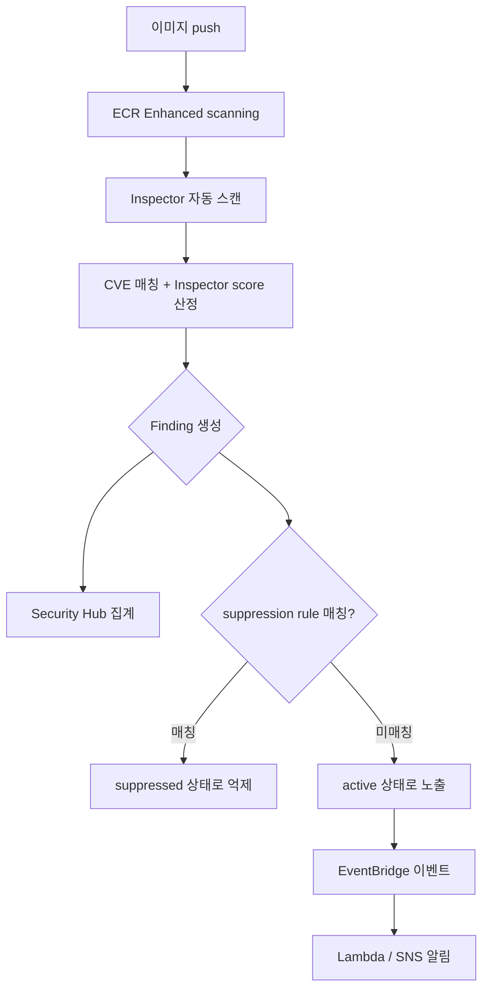

# AWS Inspector

## 개요

Inspector는 EC2, ECR 컨테이너 이미지, Lambda 함수의 취약점을 자동으로 스캔하는 서비스다. 지금 콘솔에서 보이는 건 전부 v2다. 예전 v1(Classic Inspector)은 에이전트를 직접 설치하고 평가 템플릿(assessment template)을 만들어서 수동으로 돌리는 방식이었는데, v2는 이런 게 전부 사라졌다. 한 번 활성화하면 대상 리소스를 자동으로 찾아서 계속 스캔한다.

스캔 대상은 두 종류로 나뉜다. 하나는 OS 패키지와 애플리케이션 의존성의 CVE를 보는 소프트웨어 취약점 스캔, 다른 하나는 코드 자체의 보안 문제를 보는 코드 스캔(Lambda 대상)이다. 운영에서 비중이 큰 건 CVE 스캔이다. `log4j` 터졌을 때 영향받는 이미지를 빠르게 찾아낸 게 이 서비스였다.

v1을 쓰던 사람이 v2로 넘어오면 가장 헷갈리는 게 "스캔을 언제 돌리지?"다. v2는 사용자가 스캔 시점을 정하는 게 아니다. 리소스가 바뀌면(EC2 패키지 변경, ECR 이미지 push, Lambda 코드 배포) Inspector가 알아서 다시 스캔한다. 새 CVE가 공개되면 이미 스캔했던 리소스도 다시 평가한다. 그래서 어제는 깨끗했던 이미지에 오늘 갑자기 Critical Finding이 붙는 경우가 생긴다.

## 활성화

계정 단위로 켜고, 스캔 타입을 골라서 활성화한다.

```bash
# 세 가지 스캔 타입 모두 활성화
aws inspector2 enable \
  --resource-types EC2 ECR LAMBDA \
  --account-ids 123456789012
```

`resource-types`에서 필요한 것만 골라도 된다. ECR만 쓰는 계정이면 `ECR`만 켜면 된다. 켜는 순간부터 과금이 시작되는데, 스캔한 리소스 수와 횟수 기준이다. EC2는 인스턴스당, ECR은 이미지당, Lambda는 함수당으로 계산된다. 이미지를 자주 push하는 CI 환경에서 ECR 스캔을 켜두면 비용이 생각보다 빨리 오른다. 같은 이미지를 태그만 바꿔서 여러 번 push하면 다이제스트가 같으니 중복 스캔은 안 되지만, 빌드마다 레이어가 바뀌면 매번 새 스캔이 돈다.

Organizations를 쓰면 위임 관리자(delegated administrator) 계정을 지정해서 멤버 계정 전체를 한 번에 켜고 관리할 수 있다. 신규 계정이 들어올 때 자동으로 Inspector를 켜는 auto-enable 설정도 여기서 한다.

```bash
# 위임 관리자 지정 (관리 계정에서 실행)
aws inspector2 enable-delegated-admin-account \
  --delegated-admin-account-id 111111111111

# 신규 멤버 계정 자동 활성화
aws inspector2 update-organization-configuration \
  --auto-enable ec2=true,ecr=true,lambda=true
```

## EC2 스캔 방식

EC2 스캔에는 두 가지 방식이 있다. 어느 쪽으로 스캔되는지 모르고 운영하면 결과가 비어 보이는 일이 생긴다.

에이전트 기반 스캔은 SSM Agent를 통해 인스턴스 안에서 패키지 목록을 읽는다. SSM Agent가 설치돼 있고 인스턴스에 적절한 IAM 역할(`AmazonSSMManagedInstanceCore` 같은)이 붙어 있어야 한다. 최신 Amazon Linux AMI는 SSM Agent가 기본 설치돼 있지만, 커스텀 AMI나 오래된 이미지는 빠져 있는 경우가 많다. 인스턴스를 띄웠는데 Inspector에 안 잡히면 거의 SSM 연결 문제다. Systems Manager의 Fleet Manager에서 인스턴스가 "Managed"로 보이는지 먼저 확인해야 한다.

에이전트리스(agentless) 스캔은 EBS 스냅샷을 떠서 그걸 분석한다. SSM Agent가 없어도 되니까 에이전트를 못 까는 환경에 쓴다. 대신 실시간성이 떨어진다. 에이전트 기반은 패키지가 바뀌면 거의 바로 반영되는데, 에이전트리스는 주기적으로 스냅샷을 떠서 보기 때문에 지연이 있다. 기본은 하이브리드 모드라 SSM이 되는 인스턴스는 에이전트 기반으로, 안 되는 건 에이전트리스로 스캔한다.

## ECR push 연동

ECR 스캔이 v2에서 제일 많이 쓰인다. ECR 리포지토리의 스캔 설정을 "Enhanced scanning"으로 바꾸면 Inspector가 붙는다. 기본 스캔(Basic scanning)은 ECR 자체 기능이고 Inspector와 별개다. Enhanced를 켜야 Inspector가 동작한다.

push 시점 자동 스캔이 핵심이다. 이미지를 push하면 Inspector가 그 다이제스트를 스캔해서 Finding을 만든다. CI 파이프라인에서 빌드한 이미지를 push하고, 스캔 결과를 기다렸다가 Critical이 있으면 배포를 막는 식으로 게이트를 건다.

```bash
# 리포지토리 단위로 push 시 스캔 + 재스캔 기간 설정
aws inspector2 update-configuration \
  --ecr-configuration '{"rescanDuration":"DAYS_30","pullDateRescanDuration":"DAYS_14"}'
```

`rescanDuration`은 push된 이미지를 얼마나 오래 계속 재스캔할지를 정한다. 30일로 두면 push 후 30일 동안은 새 CVE가 나올 때마다 다시 평가한다. 이 기간이 지나면 이미지가 "비활성(inactive)" 상태로 빠져서 더는 스캔하지 않는다. 오래된 이미지에 새 CVE가 안 붙길래 봤더니 rescan 기간이 끝나 있던 경우가 있다. 프로덕션에 장기간 떠 있는 이미지가 있으면 이 값을 길게 잡거나 `pullDateRescanDuration`을 활용해야 한다. `pullDateRescanDuration`은 마지막 pull 시점 기준으로 기간을 다시 센다. 자주 당겨 쓰는 이미지는 계속 스캔 대상에 남는다.

CI에서 push 후 스캔 결과를 받아오는 흐름은 이렇게 짠다.

```bash
# 이미지 push 후 스캔 완료까지 대기 → Critical 개수 확인
IMAGE_DIGEST=$(aws ecr describe-images \
  --repository-name my-app \
  --image-ids imageTag=latest \
  --query 'imageDetails[0].imageDigest' --output text)

# 스캔이 끝날 때까지 폴링 (scanStatus가 COMPLETE 될 때까지)
aws ecr describe-image-scan-findings \
  --repository-name my-app \
  --image-id imageDigest=$IMAGE_DIGEST \
  --query 'imageScanFindings.findingSeverityCounts'
```

push 직후 바로 결과를 조회하면 아직 `IN_PROGRESS`일 때가 많다. 스캔이 끝나는 데 이미지 크기에 따라 수십 초에서 몇 분이 걸린다. CI에서 곧바로 결과를 읽고 "취약점 0개"라고 판단하면 안 된다. 스캔 상태가 `COMPLETE`인지 먼저 확인하는 폴링을 넣어야 한다. 이 부분 빼먹고 게이트를 만들면 취약점 있는 이미지가 그냥 통과한다.

## Finding과 심각도 점수

Inspector는 CVE별로 Finding을 만들고, 심각도를 Critical / High / Medium / Low / Informational로 매긴다. 이 심각도는 단순히 CVSS 점수만 보는 게 아니라 Inspector 자체 점수(Inspector score)를 쓴다.

Inspector score가 CVSS base score와 다른 이유는 환경 정보를 반영하기 때문이다. 같은 CVE라도 그 패키지가 실제로 네트워크에 노출돼 있는지, 익스플로잇이 공개돼 있는지(EPSS, exploit availability) 같은 요소를 더해서 점수를 조정한다. 그래서 CVSS로는 9.8인 CVE가 Inspector에서는 우선순위가 낮게 잡히기도 하고 반대 경우도 있다.

운영에서 중요한 건 Finding을 무작정 다 처리하려고 하면 안 된다는 점이다. 컨테이너 이미지 하나에 CVE가 수백 개씩 붙는 게 보통이다. 베이스 이미지가 `ubuntu:22.04` 같은 풀 OS면 OS 패키지 CVE만 100개가 넘는다. 이걸 다 잡으려고 하면 끝이 없다. 그래서 우선순위를 정해야 한다.

먼저 보는 건 "수정 가능한(fixable)" Finding이다. Inspector는 패치 버전이 나와 있는 CVE를 따로 표시해준다. 수정 버전이 없는 CVE는 당장 할 수 있는 게 없으니 미뤄두고, 패치가 있는 Critical/High부터 처리한다.

```bash
# 수정 가능한 Critical Finding만 조회
aws inspector2 list-findings \
  --filter-criteria '{
    "severity":[{"comparison":"EQUALS","value":"CRITICAL"}],
    "fixAvailable":[{"comparison":"EQUALS","value":"YES"}]
  }' \
  --query 'findings[].{cve:vulnerabilityId,pkg:packageVulnerabilityDetails.vulnerablePackages[0].name,fix:packageVulnerabilityDetails.vulnerablePackages[0].fixedInVersion}'
```

컨테이너 이미지 CVE를 줄이는 가장 빠른 방법은 베이스 이미지를 가볍게 바꾸는 거다. `distroless`나 `alpine` 기반으로 옮기면 OS 패키지 자체가 거의 없어서 CVE 수가 크게 줄어든다. 개별 CVE를 하나씩 패치하는 것보다 베이스를 바꾸는 게 효과가 크다.

## Security Hub 연동

Inspector Finding을 Security Hub로 보내서 다른 보안 서비스(GuardDuty, Macie, Config 등) 결과와 한곳에서 본다. Security Hub를 활성화하고 Inspector 통합을 켜면 Finding이 자동으로 흘러간다. 별도 변환 코드 없이 ASFF(AWS Security Finding Format)로 정규화돼서 들어간다.

여러 계정을 Organizations로 묶어 운영하면 Security Hub를 집계 계정으로 두고 멤버 계정의 Inspector Finding을 한 화면에서 본다. 계정별로 콘솔을 돌아다닐 필요가 없다. 멀티 계정 환경에서는 이 구성이 사실상 필수다.

주의할 점은 Security Hub와 Inspector 양쪽에서 Finding을 관리하면 상태가 따로 논다는 거다. Inspector에서 suppression rule로 억제한 Finding이 Security Hub에서는 여전히 보이거나, Security Hub에서 워크플로 상태를 바꿔도 Inspector에는 반영이 안 되는 식이다. 어느 쪽을 운영의 기준으로 삼을지 정하고 거기서만 상태를 관리하는 게 낫다.

## 오탐 억제 (Suppression Rule)

Finding을 다 끄고 보면 처리할 수 없거나 위험하지 않은 게 많이 섞여 있다. 이런 걸 계속 화면에 띄워두면 진짜 중요한 Finding이 묻힌다. suppression rule로 특정 조건의 Finding을 억제한다.

억제는 Finding을 삭제하는 게 아니다. "억제됨(suppressed)" 상태로 바꿔서 기본 목록에서 안 보이게 할 뿐이다. 필터를 바꾸면 억제된 것도 다시 볼 수 있다. 그리고 억제해도 과금은 그대로 된다. 스캔 자체는 계속 돌기 때문이다.

```bash
# 특정 CVE를 억제하는 룰 생성
aws inspector2 create-filter \
  --name "suppress-cve-2023-12345-false-positive" \
  --action SUPPRESS \
  --filter-criteria '{
    "vulnerabilityId":[{"comparison":"EQUALS","value":"CVE-2023-12345"}]
  }'
```

`action`을 `SUPPRESS`로 주면 suppression rule이 된다. `NONE`으로 주면 단순 저장 필터다. 억제 조건은 CVE ID 말고도 리소스 태그, 패키지 이름, ECR 리포지토리, 심각도 등으로 잡을 수 있다.

실무에서 억제를 쓰는 경우는 정해져 있다. 수정 버전이 없는데 실제로는 그 취약 함수를 안 쓰는 CVE, 외부에 노출 안 된 내부 전용 인스턴스의 낮은 심각도 Finding, 베이스 이미지에 딸려오는데 우리가 어쩔 수 없는 OS 패키지 CVE 같은 것들이다.

억제할 때 주의할 점이 있다. CVE ID 단위로 전역 억제를 걸면 그 CVE는 모든 리소스에서 안 보인다. 지금은 안전한 인스턴스라 억제했는데, 나중에 다른 노출된 서비스에 같은 CVE가 떠도 묻혀버린다. 그래서 가능하면 억제 범위를 좁게 잡아야 한다. 특정 리포지토리, 특정 태그가 붙은 리소스로 한정하는 식이다.

```bash
# 특정 태그가 붙은 내부 전용 리소스의 Medium 이하만 억제
aws inspector2 create-filter \
  --name "suppress-internal-low-medium" \
  --action SUPPRESS \
  --filter-criteria '{
    "severity":[{"comparison":"EQUALS","value":"MEDIUM"}],
    "resourceTags":[{"comparison":"EQUALS","key":"exposure","value":"internal"}]
  }'
```

또 하나, 억제 룰을 너무 많이 만들면 나중에 왜 억제했는지 추적이 안 된다. 룰 이름에 억제 사유를 적어두고, 정기적으로 룰 목록을 점검해서 더는 유효하지 않은 억제를 정리해야 한다. "임시로 억제" 해둔 게 1년 넘게 남아 있는 경우가 흔하다.

## 동작 흐름

ECR push부터 결과 집계까지의 흐름.



active Finding은 EventBridge로 흘려서 알림을 걸 수 있다. Critical Finding이 새로 뜨면 Slack으로 쏘는 식이다. GuardDuty와 마찬가지로 Inspector도 탐지만 하지 차단은 안 하니까, 막으려면 EventBridge 뒤에 자동화를 붙여야 한다.

## v1에서 넘어올 때

아직 v1(Classic) 기준으로 문서나 코드를 들고 있으면 v2로 다 갈아엎어야 한다. API 자체가 다르다. v1은 `inspector`, v2는 `inspector2` 네임스페이스다. v1의 평가 템플릿, 평가 대상(assessment target), 룰 패키지(rules package) 개념은 v2에 없다. v1에서 쓰던 자동화 스크립트는 그대로 못 쓴다.

v1은 네트워크 도달 가능성(network reachability) 평가와 CIS 벤치마크 점검 같은 기능이 있었는데, v2는 CVE 스캔과 Lambda 코드 스캔에 집중한다. CIS 같은 구성 점검은 이제 Security Hub의 보안 표준이나 Config로 넘어갔다. v1을 끄기 전에 쓰던 기능이 v2에서 커버되는지 확인하고 옮겨야 한다.
