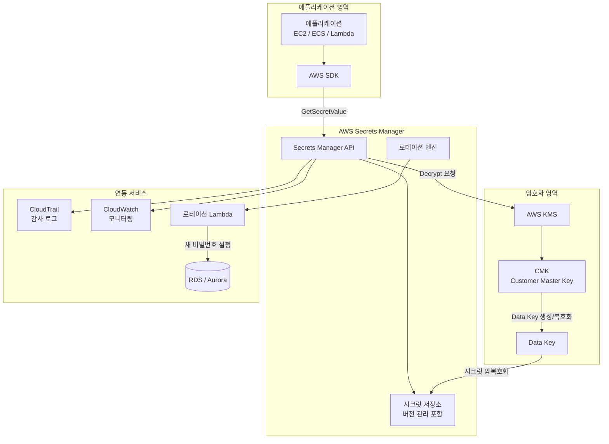
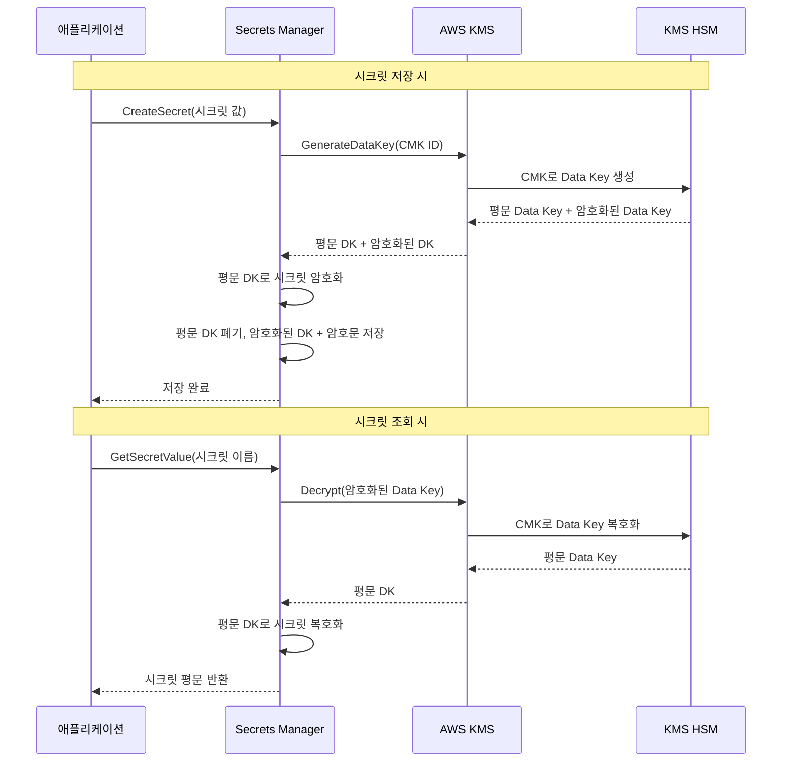
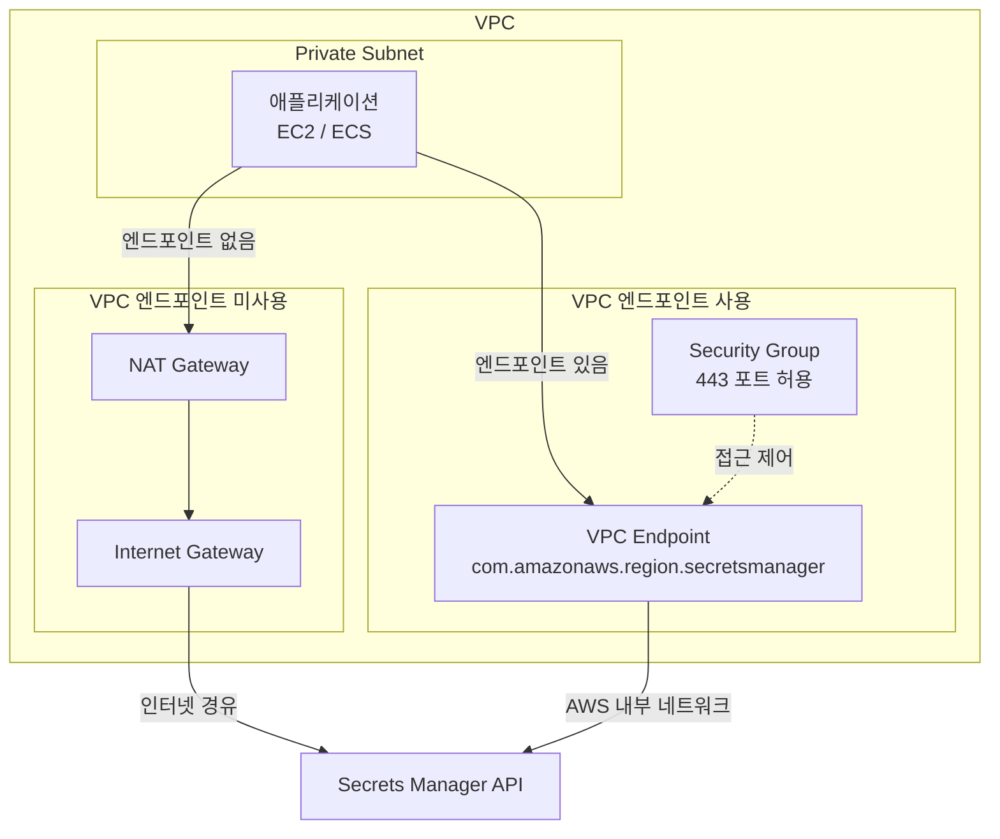
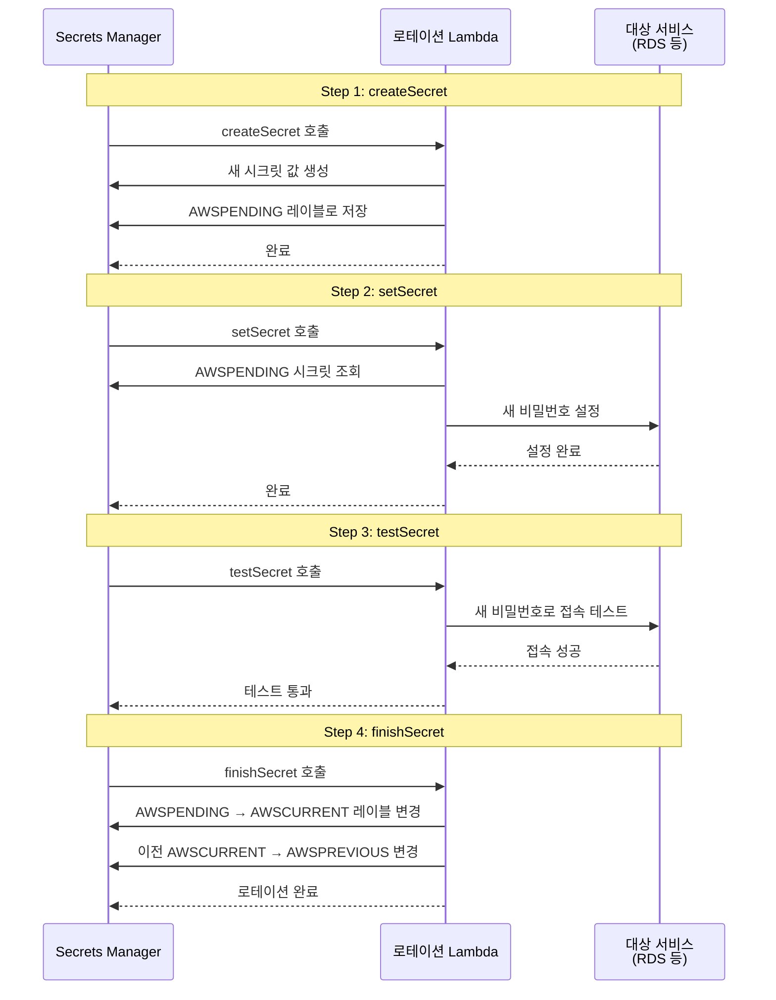
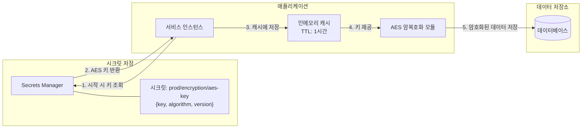
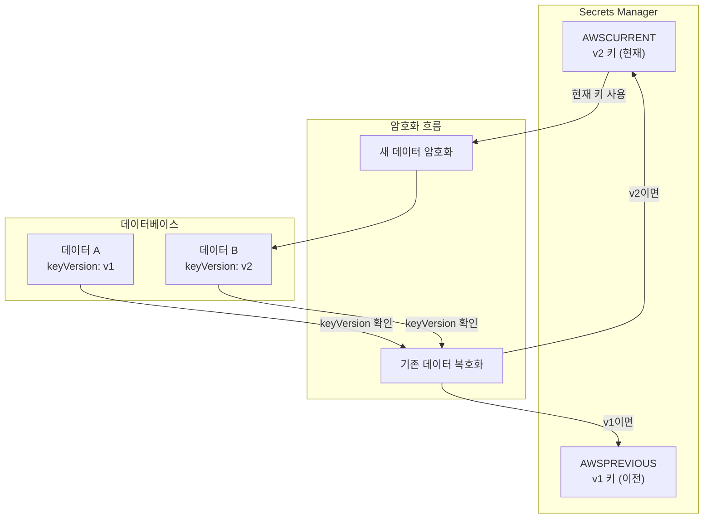
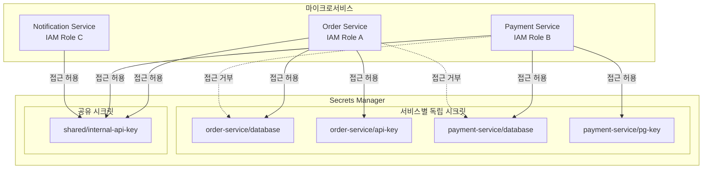
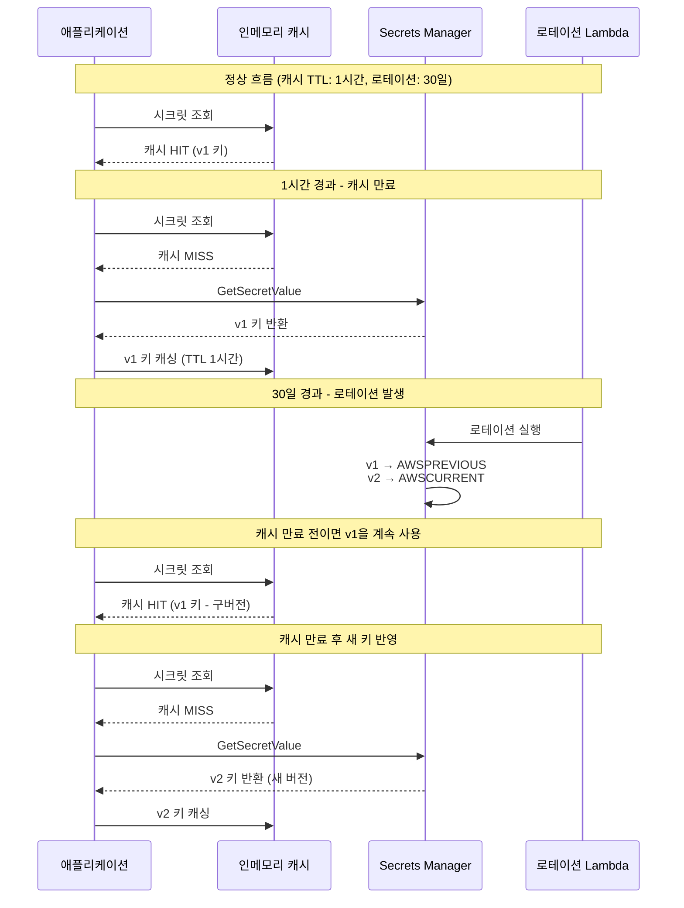
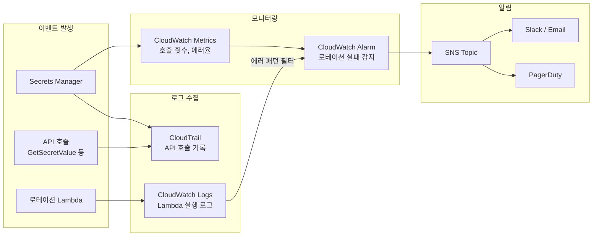

# AWS Secrets Manager 개요

AWS Secrets Manager는 민감한 정보를 저장하고 관리하는 완전관리형 서비스다. 데이터베이스 자격 증명, API 키, OAuth 토큰, 암호화 키 등 애플리케이션에서 사용하는 시크릿을 중앙에서 관리한다.

## 아키텍처 구성도

Secrets Manager가 전체 인프라에서 어떤 위치에 있는지 먼저 파악해야 한다.



핵심은 Secrets Manager가 시크릿의 수명주기를 관리하고, 실제 암호화는 KMS에 위임한다는 점이다. 애플리케이션은 SDK를 통해 시크릿을 조회하고, IAM 역할로 인증한다.

## KMS 연동 구조

Secrets Manager에 시크릿을 저장하면 내부적으로 KMS Envelope Encryption이 동작한다. 이 구조를 이해하지 못하면 키 권한 문제를 디버깅할 수 없다.



시크릿을 조회할 때마다 KMS Decrypt 호출이 발생한다. 그래서 KMS 키 정책에 Secrets Manager 서비스 권한이 없으면 `AccessDeniedException`이 터진다. 커스텀 CMK를 쓸 때 자주 놓치는 부분이다.

## 핵심 개념과 특징

### 1. 중앙집중형 시크릿 관리
기존에는 각 애플리케이션마다 시크릿을 별도로 관리하거나 환경변수, 설정 파일에 하드코딩하는 경우가 많았다. Secrets Manager는 모든 시크릿을 AWS 클라우드의 중앙 저장소에서 관리하여 일관성과 보안성을 확보한다.

### 2. 자동 로테이션 (Rotation)
시크릿의 가장 중요한 보안 원칙은 정기적인 교체다. Secrets Manager는 데이터베이스 비밀번호, API 키 등을 자동으로 주기적으로 교체할 수 있다.

### 3. 세밀한 접근 제어
IAM과 통합되어 누가 어떤 시크릿에 접근할 수 있는지 세밀하게 제어할 수 있다. 최소 권한 원칙을 적용하여 필요한 권한만 부여한다.

### 4. 암호화 및 보안
모든 시크릿은 AWS KMS를 사용하여 암호화된다. 전송 중(TLS)과 저장 중(KMS) 모든 단계에서 암호화가 적용된다.

### 5. 감사 및 모니터링
CloudTrail과 연동하여 시크릿에 대한 모든 접근과 변경 사항을 추적할 수 있다.

## 주요 구성 요소

### 시크릿 (Secret)
시크릿은 암호, API 키, 데이터베이스 연결 문자열 등 민감한 정보를 포함하는 객체다. 각 시크릿은 고유한 이름과 메타데이터를 가지며, 버전 관리가 된다.

### 시크릿 값 (Secret Value)
실제 민감한 데이터가 저장되는 부분이다. JSON 형태로 여러 키-값 쌍을 저장할 수 있어 복잡한 자격 증명도 하나의 시크릿으로 관리할 수 있다.

### 로테이션 설정 (Rotation Configuration)
시크릿을 자동으로 교체하기 위한 설정이다. 로테이션 주기, Lambda 함수, 대상 서비스 등을 구성한다.

## 다른 AWS 서비스와의 관계

### KMS (Key Management Service)와의 관계
- **Secrets Manager**: 시크릿의 수명주기, 로테이션, 접근 제어를 담당
- **KMS**: 암호화 키의 생성, 보관, 암복호화 작업을 담당
- Secrets Manager는 내부적으로 KMS를 사용하여 시크릿을 암호화한다.

### Parameter Store와의 차이점
| 구분 | Secrets Manager | Parameter Store |
|------|----------------|-----------------|
| **주요 목적** | 민감한 시크릿 관리 | 일반적인 설정값 관리 |
| **자동 로테이션** | 지원 (핵심 기능) | 기본적으로 미지원 |
| **암호화** | 항상 암호화됨 | 선택적 암호화 |
| **비용** | 유료 서비스 | 기본 무료 (고급 기능은 유료) |
| **사용 사례** | DB 자격증명, API 키 | 애플리케이션 설정, 환경변수 |

## 시크릿 생성 방법

### 시크릿 생성 방식

**1. AWS 콘솔:**
- Secrets Manager 콘솔에서 "Store a new secret" 선택
- 시크릿 유형 선택 (데이터베이스 자격 증명, 일반 시크릿 등)
- 시크릿 값 입력 (JSON 형식 또는 키-값 쌍)
- 시크릿 이름 지정 (예: `prod/database/mysql`)
- KMS 키 선택 (기본 키 또는 커스텀 키)
- 자동 로테이션 설정 (선택사항)

**2. AWS CLI:**
- `aws secretsmanager create-secret` 명령어 사용
- JSON 파일 또는 직접 값 입력
- 태그, 설명 등 메타데이터 추가 가능

**3. Infrastructure as Code:**
- Terraform, CloudFormation으로 시크릿 생성
- 코드로 관리하여 버전 관리 및 재현 가능

### 시크릿 이름 규칙

**권장 명명 규칙:**
- 환경/서비스/리소스 형태: `prod/database/mysql`, `dev/api/github-token`
- 계층 구조로 관리하여 IAM 정책에서 경로 기반 접근 제어 가능

### 시크릿 값 형식

**JSON 형식:**
- 여러 키-값 쌍을 하나의 시크릿에 저장
- 데이터베이스 자격 증명: `{"username": "admin", "password": "secret123"}`
- API 키: `{"apiKey": "xxx", "apiSecret": "yyy"}`
- 연결 문자열: `{"host": "db.example.com", "port": 3306, "database": "mydb"}`

**단일 값:**
- 하나의 값만 필요한 경우 (예: 단순 비밀번호)

## 애플리케이션에서 시크릿 조회 방법

### EC2/ECS에서 조회

**IAM 역할 기반 접근:**
- EC2 인스턴스에 IAM 역할 부여
- ECS Task에 Task Role 부여
- 애플리케이션이 AWS SDK를 통해 시크릿 조회
- 별도의 자격 증명 없이 자동으로 인증

**조회 과정:**
1. 애플리케이션 시작 시 Secrets Manager API 호출
2. IAM 역할의 자격 증명으로 인증
3. 시크릿 값 조회
4. 메모리에 캐싱 (선택사항)
5. 애플리케이션에서 사용

### Lambda에서 조회

**Lambda 실행 역할:**
- Lambda 함수에 실행 역할 부여
- 함수 시작 시 시크릿 조회
- Lambda 환경 변수와 함께 사용 가능

**성능 고려사항:**
- Cold Start 시 시크릿 조회로 인한 지연 발생 가능
- 시크릿을 Lambda 레이어나 환경 변수에 캐싱 고려
- 로테이션 주기와 캐싱의 균형 필요

### 로컬 개발 환경에서 조회

**AWS 자격 증명 설정:**
- AWS CLI 설정 (`aws configure`)
- 환경 변수 (`AWS_ACCESS_KEY_ID`, `AWS_SECRET_ACCESS_KEY`)
- 프로파일 사용 (`--profile` 옵션)

**개발 환경 분리:**
- 로컬에서는 환경 변수나 설정 파일 사용
- Secrets Manager는 운영 환경에서만 사용
- 개발/운영 환경 분리

## IAM 정책 설정

### 최소 권한 원칙 적용

**서비스별 시크릿 접근:**
- 각 서비스가 필요한 시크릿에만 접근 가능하도록 제한
- 경로 기반 정책으로 세밀한 제어

**예시 IAM 정책:**
```json
{
  "Version": "2012-10-17",
  "Statement": [
    {
      "Effect": "Allow",
      "Action": [
        "secretsmanager:GetSecretValue",
        "secretsmanager:DescribeSecret"
      ],
      "Resource": "arn:aws:secretsmanager:region:account:secret:prod/database/mysql-*"
    }
  ]
}
```

**권한 분리:**
- 읽기 권한: `GetSecretValue`, `DescribeSecret`
- 쓰기 권한: `CreateSecret`, `UpdateSecret`, `PutSecretValue`
- 삭제 권한: `DeleteSecret`
- 로테이션 권한: `RotateSecret`

### VPC 엔드포인트 활용

VPC 엔드포인트 유무에 따라 트래픽 경로가 완전히 달라진다.



엔드포인트 없이 쓰면 NAT Gateway를 경유해서 인터넷으로 나간 뒤 Secrets Manager에 도달한다. NAT Gateway 비용도 나가고, 시크릿이 인터넷을 타는 셈이다. VPC 엔드포인트를 만들면 AWS 내부 네트워크로 직접 통신하므로 비용과 보안 두 가지를 잡을 수 있다.

**프라이빗 네트워크 접근:**
- VPC 내에서 Secrets Manager 접근 시 인터넷 경유 방지
- VPC 엔드포인트 생성하여 프라이빗 네트워크로 통신
- 보안 그룹으로 접근 제어

**비용 절감:**
- NAT Gateway 비용 절감
- 데이터 전송 비용 절감

## 로테이션 설정

### 로테이션 흐름도

자동 로테이션은 4단계로 구성된다. 각 단계에서 문제가 생기면 이전 버전으로 롤백된다.



`testSecret` 단계가 실패하면 `finishSecret`이 실행되지 않는다. 이전 비밀번호(AWSCURRENT)가 그대로 유지되므로 서비스 중단은 발생하지 않는다. 하지만 AWSPENDING 상태의 시크릿이 남아 있으니, 로테이션 실패 시 CloudWatch 알람을 반드시 설정해야 한다.

### 로테이션 동작 원리

**로테이션 주기:**
- 최소 1일부터 설정 가능
- 데이터베이스: 30-90일 권장
- API 키: 서비스 정책에 따라

### 데이터베이스 로테이션

**지원 데이터베이스:**
- RDS MySQL, PostgreSQL, MariaDB, Oracle, SQL Server
- Aurora MySQL, Aurora PostgreSQL
- DocumentDB

**로테이션 Lambda 함수:**
- AWS 제공 템플릿 사용 가능
- 커스텀 Lambda 함수 작성 가능
- 데이터베이스에 새 비밀번호 설정
- 애플리케이션 연결 테스트

### 커스텀 로테이션

**외부 서비스 로테이션:**
- GitHub, Slack 등 외부 서비스 API 키 로테이션
- 커스텀 Lambda 함수 작성
- 외부 서비스 API를 통해 키 갱신
- Secrets Manager에 새 값 저장

**로테이션 Lambda 함수 요구사항:**
- `createSecret`: 새 시크릿 생성
- `setSecret`: 대상 서비스에 새 시크릿 설정
- `testSecret`: 새 시크릿 테스트
- `finishSecret`: 로테이션 완료

## AES 암호화 키를 Secrets Manager로 관리하기

AES 암호화를 애플리케이션에서 직접 구현할 때, 키를 코드나 설정 파일에 넣으면 안 된다. Secrets Manager에 키를 저장하고 런타임에 조회하는 패턴을 쓴다.

### 키 관리 아키텍처



### AES 키 시크릿 생성 (AWS CLI)

```bash
# AES-256 키를 Base64 인코딩하여 Secrets Manager에 저장
AES_KEY=$(openssl rand -base64 32)

aws secretsmanager create-secret \
  --name prod/encryption/aes-key \
  --description "AES-256 암호화 키 - 사용자 개인정보 암호화용" \
  --kms-key-id alias/app/encryption \
  --secret-string "{
    \"key\": \"$AES_KEY\",
    \"algorithm\": \"AES/GCM/NoPadding\",
    \"keyLength\": 256,
    \"version\": \"v1\"
  }"
```

시크릿에 `algorithm`, `keyLength` 같은 메타데이터를 함께 저장하면, 나중에 알고리즘을 변경하거나 키를 교체할 때 버전 관리가 수월하다.

### Java SDK 예제: AES 키를 Secrets Manager에서 조회하여 암복호화

Spring Boot 환경에서 Secrets Manager로 AES 키를 관리하는 구현이다. 실무에서 가장 많이 쓰는 패턴이다.

```java
import software.amazon.awssdk.regions.Region;
import software.amazon.awssdk.services.secretsmanager.SecretsManagerClient;
import software.amazon.awssdk.services.secretsmanager.model.GetSecretValueRequest;
import software.amazon.awssdk.services.secretsmanager.model.GetSecretValueResponse;
import com.fasterxml.jackson.databind.JsonNode;
import com.fasterxml.jackson.databind.ObjectMapper;

import javax.crypto.Cipher;
import javax.crypto.spec.GCMParameterSpec;
import javax.crypto.spec.SecretKeySpec;
import java.security.SecureRandom;
import java.util.Base64;

public class AesEncryptionService {

    private static final String SECRET_NAME = "prod/encryption/aes-key";
    private static final int GCM_TAG_LENGTH = 128;
    private static final int GCM_IV_LENGTH = 12;

    private final SecretsManagerClient smClient;
    private final ObjectMapper objectMapper;
    private volatile byte[] cachedKey;
    private volatile long cacheExpiry;

    public AesEncryptionService() {
        this.smClient = SecretsManagerClient.builder()
                .region(Region.AP_NORTHEAST_2)
                .build();
        this.objectMapper = new ObjectMapper();
    }

    /**
     * Secrets Manager에서 AES 키를 가져온다.
     * 캐시 TTL은 1시간. 매번 API를 호출하면 비용이 올라가고 지연도 생긴다.
     */
    private byte[] getAesKey() {
        if (cachedKey != null && System.currentTimeMillis() < cacheExpiry) {
            return cachedKey;
        }

        GetSecretValueResponse response = smClient.getSecretValue(
                GetSecretValueRequest.builder()
                        .secretId(SECRET_NAME)
                        .build()
        );

        try {
            JsonNode secret = objectMapper.readTree(response.secretString());
            String keyBase64 = secret.get("key").asText();
            cachedKey = Base64.getDecoder().decode(keyBase64);
            cacheExpiry = System.currentTimeMillis() + 3600_000; // 1시간
            return cachedKey;
        } catch (Exception e) {
            throw new RuntimeException("AES 키 파싱 실패", e);
        }
    }

    /**
     * AES-GCM으로 암호화한다.
     * CBC 대신 GCM을 쓰는 이유: 무결성 검증이 내장되어 있어 별도의 HMAC이 필요 없다.
     * 반환값은 "IV:암호문" 형태의 Base64 문자열이다.
     */
    public String encrypt(String plaintext) {
        try {
            byte[] key = getAesKey();
            byte[] iv = new byte[GCM_IV_LENGTH];
            new SecureRandom().nextBytes(iv);

            Cipher cipher = Cipher.getInstance("AES/GCM/NoPadding");
            SecretKeySpec keySpec = new SecretKeySpec(key, "AES");
            GCMParameterSpec gcmSpec = new GCMParameterSpec(GCM_TAG_LENGTH, iv);
            cipher.init(Cipher.ENCRYPT_MODE, keySpec, gcmSpec);

            byte[] ciphertext = cipher.doFinal(plaintext.getBytes("UTF-8"));

            // IV와 암호문을 합쳐서 저장한다. 복호화할 때 IV가 필요하다.
            String ivBase64 = Base64.getEncoder().encodeToString(iv);
            String ctBase64 = Base64.getEncoder().encodeToString(ciphertext);
            return ivBase64 + ":" + ctBase64;
        } catch (Exception e) {
            throw new RuntimeException("암호화 실패", e);
        }
    }

    /**
     * AES-GCM으로 복호화한다.
     * GCM 태그 검증이 실패하면 AEADBadTagException이 발생한다.
     * 이 경우 데이터가 변조된 것이므로 로그를 남기고 처리해야 한다.
     */
    public String decrypt(String encryptedText) {
        try {
            byte[] key = getAesKey();
            String[] parts = encryptedText.split(":");
            byte[] iv = Base64.getDecoder().decode(parts[0]);
            byte[] ciphertext = Base64.getDecoder().decode(parts[1]);

            Cipher cipher = Cipher.getInstance("AES/GCM/NoPadding");
            SecretKeySpec keySpec = new SecretKeySpec(key, "AES");
            GCMParameterSpec gcmSpec = new GCMParameterSpec(GCM_TAG_LENGTH, iv);
            cipher.init(Cipher.DECRYPT_MODE, keySpec, gcmSpec);

            byte[] plaintext = cipher.doFinal(ciphertext);
            return new String(plaintext, "UTF-8");
        } catch (Exception e) {
            throw new RuntimeException("복호화 실패", e);
        }
    }
}
```

주의할 점:
- `cachedKey`에 `volatile`을 붙인 이유는 멀티스레드 환경에서 가시성 보장 때문이다. 완벽한 동기화가 필요하면 `synchronized`를 쓰거나 `AtomicReference`를 쓴다. 하지만 캐시 갱신이 한두 번 중복되는 건 문제가 안 되므로 `volatile`로 충분하다.
- GCM 모드의 IV는 같은 키에 대해 절대 재사용하면 안 된다. `SecureRandom`으로 매번 생성한다.
- 키 조회 실패 시 애플리케이션이 죽는 게 낫다. 빈 키로 암호화하면 복구 불가능한 데이터가 만들어진다.

### Node.js SDK 예제: AES 키를 Secrets Manager에서 조회하여 암복호화

```javascript
const {
  SecretsManagerClient,
  GetSecretValueCommand
} = require('@aws-sdk/client-secrets-manager');
const crypto = require('crypto');

const SECRET_NAME = 'prod/encryption/aes-key';
const ALGORITHM = 'aes-256-gcm';
const IV_LENGTH = 12;
const AUTH_TAG_LENGTH = 16;

const smClient = new SecretsManagerClient({ region: 'ap-northeast-2' });

// 키 캐시. TTL 1시간.
let keyCache = { key: null, expiresAt: 0 };

async function getAesKey() {
  const now = Date.now();
  if (keyCache.key && now < keyCache.expiresAt) {
    return keyCache.key;
  }

  const response = await smClient.send(
    new GetSecretValueCommand({ SecretId: SECRET_NAME })
  );

  const secret = JSON.parse(response.SecretString);
  const key = Buffer.from(secret.key, 'base64');

  // 키 길이 검증. 32바이트가 아니면 AES-256이 아니다.
  if (key.length !== 32) {
    throw new Error(`AES 키 길이 오류: ${key.length}바이트 (32바이트 필요)`);
  }

  keyCache = { key, expiresAt: now + 3600_000 };
  return key;
}

/**
 * AES-256-GCM으로 암호화한다.
 * 반환값: base64로 인코딩된 "iv:authTag:ciphertext" 문자열
 */
async function encrypt(plaintext) {
  const key = await getAesKey();
  const iv = crypto.randomBytes(IV_LENGTH);

  const cipher = crypto.createCipheriv(ALGORITHM, key, iv, {
    authTagLength: AUTH_TAG_LENGTH
  });

  const encrypted = Buffer.concat([
    cipher.update(plaintext, 'utf8'),
    cipher.final()
  ]);
  const authTag = cipher.getAuthTag();

  return [
    iv.toString('base64'),
    authTag.toString('base64'),
    encrypted.toString('base64')
  ].join(':');
}

/**
 * AES-256-GCM으로 복호화한다.
 * authTag 검증 실패 시 에러가 발생한다. 데이터 변조를 의미한다.
 */
async function decrypt(encryptedText) {
  const key = await getAesKey();
  const [ivB64, tagB64, dataB64] = encryptedText.split(':');

  const iv = Buffer.from(ivB64, 'base64');
  const authTag = Buffer.from(tagB64, 'base64');
  const ciphertext = Buffer.from(dataB64, 'base64');

  const decipher = crypto.createDecipheriv(ALGORITHM, key, iv, {
    authTagLength: AUTH_TAG_LENGTH
  });
  decipher.setAuthTag(authTag);

  const decrypted = Buffer.concat([
    decipher.update(ciphertext),
    decipher.final()
  ]);

  return decrypted.toString('utf8');
}

// 사용 예
async function main() {
  const original = '주민번호: 901231-1234567';
  console.log('원본:', original);

  const encrypted = await encrypt(original);
  console.log('암호화:', encrypted);

  const decrypted = await decrypt(encrypted);
  console.log('복호화:', decrypted);
}

module.exports = { encrypt, decrypt };
```

### AES 키 로테이션 구현

AES 키를 교체할 때 가장 중요한 건 "이전 키로 암호화된 데이터를 여전히 복호화할 수 있어야 한다"는 점이다. 키 버전을 암호문에 포함시키는 패턴을 쓴다.



```java
// 키 버전을 포함한 암호화 결과 형식: "v2:IV:암호문"
public String encryptWithVersion(String plaintext) {
    // 항상 AWSCURRENT(최신) 키로 암호화
    String currentVersion = getCurrentKeyVersion(); // "v2"
    String encrypted = encrypt(plaintext);
    return currentVersion + ":" + encrypted;
}

public String decryptWithVersion(String encryptedText) {
    // 첫 번째 세그먼트가 키 버전
    String[] segments = encryptedText.split(":", 2);
    String keyVersion = segments[0]; // "v1" 또는 "v2"
    String cipherData = segments[1];

    // 버전에 맞는 키 조회
    byte[] key = getAesKeyByVersion(keyVersion);
    return decryptWithKey(key, cipherData);
}

/**
 * 특정 버전의 키를 조회한다.
 * AWSCURRENT, AWSPREVIOUS 스테이지를 사용하거나,
 * 시크릿 값의 version 필드로 구분한다.
 */
private byte[] getAesKeyByVersion(String version) {
    GetSecretValueResponse response = smClient.getSecretValue(
        GetSecretValueRequest.builder()
            .secretId(SECRET_NAME)
            .versionStage(version.equals(getCurrentKeyVersion())
                ? "AWSCURRENT" : "AWSPREVIOUS")
            .build()
    );
    // ... JSON 파싱 후 키 반환
}
```

키 로테이션 시 기존 데이터를 한꺼번에 재암호화(re-encryption)하는 배치 작업도 고려해야 한다. 데이터량이 많으면 점진적으로 처리하고, 이전 키는 재암호화가 완료될 때까지 유지해야 한다.

## MSA에서의 활용 패턴

### 서비스별 시크릿 분리

마이크로서비스 환경에서 시크릿을 어떻게 격리하는지 구조를 먼저 보면 이해가 빠르다.



각 서비스는 자기 경로 하위의 시크릿에만 접근할 수 있다. IAM 정책에서 `Resource`를 `arn:aws:secretsmanager:*:*:secret:order-service/*`처럼 경로 기반으로 제한하면 된다. 공유 시크릿은 별도 경로로 분리하고 필요한 서비스에만 권한을 준다.

**패턴 1: 서비스별 독립 시크릿**
- 각 마이크로서비스가 자신의 시크릿만 접근
- `service-name/database`, `service-name/api-key` 형태
- 서비스 간 시크릿 격리

**패턴 2: 공유 시크릿**
- 여러 서비스가 공유하는 시크릿 (예: 공통 API 키)
- `shared/api-key` 형태로 관리
- 접근 권한을 여러 서비스에 부여

### 시크릿 접근 패턴

**애플리케이션 시작 시 조회:**
- 서비스 시작 시 필요한 시크릿 모두 조회
- 메모리에 캐싱
- 로테이션 시에도 기존 값 사용 (재시작 시 새 값)

**지연 로딩:**
- 필요할 때 시크릿 조회
- 초기 시작 시간 단축
- 첫 사용 시 지연 발생 가능

**하이브리드 접근:**
- 필수 시크릿은 시작 시 조회
- 선택적 시크릿은 지연 로딩

### 시크릿 버전 관리

**버전별 접근:**
- 특정 버전의 시크릿 조회 가능
- 롤백 시 이전 버전 사용
- `AWSCURRENT`, `AWSPREVIOUS` 레이블 사용

## 실무에서 자주 겪는 문제와 해결

### 문제 1: 시크릿 조회 실패

**원인:**
- IAM 권한 부족
- 네트워크 문제
- 시크릿 이름 오타
- 리전 불일치

**해결:**
- IAM 정책 확인
- VPC 엔드포인트 설정 확인
- 시크릿 이름 검증
- 리전 확인

**에러 처리:**
- 재시도 로직 구현 (Exponential Backoff)
- 실패 시 기본값 사용 또는 애플리케이션 종료
- CloudWatch 알람 설정

### 문제 2: 로테이션 실패

**원인:**
- Lambda 함수 오류
- 데이터베이스 연결 실패
- 권한 부족

**해결:**
- Lambda 함수 로그 확인
- 데이터베이스 연결 정보 확인
- Lambda 실행 역할 권한 확인

**모니터링:**
- CloudWatch Logs로 Lambda 실행 로그 확인
- CloudWatch 알람으로 로테이션 실패 감지
- SNS로 알림 수신

### 문제 3: 시크릿 조회 지연

**원인:**
- 네트워크 지연
- API 호출 제한
- Cold Start (Lambda)

**해결:**
- 시크릿 캐싱 (메모리)
- VPC 엔드포인트 사용
- Lambda Provisioned Concurrency 사용

**캐싱 구현:**
- 애플리케이션 시작 시 조회 후 메모리 캐싱
- TTL 설정하여 주기적 갱신
- 로테이션 주기보다 짧은 TTL 권장

### 문제 4: 비용 증가

**원인:**
- 빈번한 API 호출
- 대량의 시크릿 저장
- 불필요한 시크릿 조회

**해결:**
- 시크릿 캐싱으로 API 호출 감소
- 사용하지 않는 시크릿 삭제
- Parameter Store와 비교하여 적절한 서비스 선택

### 문제 5: 로테이션 중 서비스 중단

**원인:**
- 로테이션 중 이전 비밀번호 즉시 무효화
- 애플리케이션이 새 비밀번호를 사용하지 못함

**해결:**
- 로테이션 Lambda에서 이전 버전 유지
- 애플리케이션 재시작 또는 시크릿 재조회
- 새 비밀번호 테스트 후 이전 비밀번호 무효화
- 애플리케이션 자동 재연결 로직 구현

### 문제 6: KMS 커스텀 키 사용 시 권한 오류

AES 키를 커스텀 CMK로 암호화하여 저장할 때 빠뜨리기 쉬운 권한이 있다.

```json
{
  "Sid": "AllowSecretsManagerToUseKey",
  "Effect": "Allow",
  "Principal": {
    "AWS": "arn:aws:iam::123456789012:role/my-app-role"
  },
  "Action": [
    "kms:Decrypt",
    "kms:DescribeKey",
    "kms:GenerateDataKey"
  ],
  "Resource": "*",
  "Condition": {
    "StringEquals": {
      "kms:ViaService": "secretsmanager.ap-northeast-2.amazonaws.com"
    }
  }
}
```

`kms:GenerateDataKey`를 빼먹으면 시크릿 저장은 되는데 조회가 안 되는 경우가 있다. KMS 키 정책의 `Condition`에 `kms:ViaService`를 넣어서 Secrets Manager를 통한 접근만 허용하는 게 보안상 맞다.

## 시크릿 캐싱

캐싱 TTL과 로테이션 주기의 관계를 잘못 잡으면 새 시크릿을 못 읽거나, 반대로 캐시가 너무 짧아서 API 비용이 폭증한다. 아래 타임라인으로 정리하면 감이 온다.



캐시 TTL이 로테이션 주기보다 길면 새 키를 읽지 못하는 시간이 길어진다. 로테이션 주기가 30일이면 캐시 TTL은 1시간 이내로 잡는 게 안전하다. DB 비밀번호 로테이션의 경우, 로테이션 직후 최대 TTL만큼 구버전 비밀번호를 쓸 수 있으므로 AWSPREVIOUS가 유효한 상태를 유지해야 한다.

### 메모리 캐싱

**장점:**
- 빠른 접근 속도
- API 호출 비용 절감
- 네트워크 지연 없음

**단점:**
- 로테이션된 시크릿 반영 지연
- 메모리 사용량 증가

**구현:**
- 애플리케이션 시작 시 조회
- TTL 설정하여 주기적 갱신
- 로테이션 주기보다 짧은 TTL 권장

### 외부 캐시 사용

**Redis/Memcached:**
- 여러 인스턴스가 공유 캐시 사용
- 중앙 집중식 캐시 관리
- 캐시 무효화로 새 시크릿 반영

**주의사항:**
- 캐시에 시크릿 저장 시 추가 보안 필요
- 캐시 무효화 타이밍 중요

## 모니터링 및 알림

Secrets Manager 관련 이벤트가 어디로 흘러가는지 전체 파이프라인을 파악해야 한다. 로테이션 실패를 모르고 지나가면 서비스 장애로 이어진다.



CloudTrail은 "누가 어떤 시크릿에 접근했는가"를 기록하고, CloudWatch Logs는 로테이션 Lambda의 실행 로그를 남긴다. 이 두 소스에서 CloudWatch Alarm을 걸어서 SNS로 알림을 보내는 구조다.

### CloudWatch 메트릭

**주요 메트릭:**
- API 호출 횟수
- 에러율
- 로테이션 성공/실패
- 시크릿 접근 패턴

**알람 설정:**
- 로테이션 실패 알람
- 비정상적인 접근 패턴 알람
- API 호출 급증 알람

### CloudTrail 로깅

**감사 추적:**
- 모든 시크릿 접근 로그
- 시크릿 생성/수정/삭제 로그
- 로테이션 실행 로그

**보안 감사:**
- 누가 언제 어떤 시크릿에 접근했는지 추적
- 컴플라이언스 요구사항 충족

## 비용 고려사항

### 비용 구조

**시크릿 저장 비용:**
- 시크릿당 월 $0.40
- 시크릿 크기에 관계없이 동일
- 삭제된 시크릿은 비용 발생 안 함

**API 호출 비용:**
- API 호출 10,000건당 $0.05
- `GetSecretValue`, `DescribeSecret` 등 모든 API 호출 포함
- 빈번한 호출 시 비용 증가

**로테이션 비용:**
- 로테이션 자체는 추가 비용 없음
- 로테이션 Lambda 함수 실행 비용 별도 (Lambda 비용)

### 비용 최적화

**시크릿 통합:**
- 관련된 여러 값을 하나의 시크릿에 저장
- 예: 데이터베이스 연결 정보를 하나의 시크릿에 통합
- 시크릿 개수 감소로 저장 비용 절감

**캐싱 활용:**
- 시크릿 조회 결과를 메모리에 캐싱
- API 호출 횟수 감소로 호출 비용 절감
- 로테이션 주기와 캐싱 TTL 조정

**Parameter Store와 비교:**
- 비용이 중요한 경우 Parameter Store 고려
- 자동 로테이션이 필요하면 Secrets Manager
- 단순 설정값은 Parameter Store 사용

---

## 관련 문서
- [IAM](./IAM.md) — 최소 권한 설계의 기반
- [KMS](./KMS.md) — 암호화 키 관리 배경
- [Secrets Manager vs KMS](./Secrets_Manager_vs_KMS.md) — 두 서비스의 차이와 선택 기준

## 참조
- AWS Secrets Manager 공식 문서: https://docs.aws.amazon.com/secretsmanager/
- AWS Secrets Manager 로테이션: https://docs.aws.amazon.com/secretsmanager/latest/userguide/rotating-secrets.html
- AWS SDK for Java - Secrets Manager: https://docs.aws.amazon.com/sdk-for-java/latest/developer-guide/
- AWS SDK for JavaScript - Secrets Manager: https://docs.aws.amazon.com/AWSJavaScriptSDK/v3/latest/
