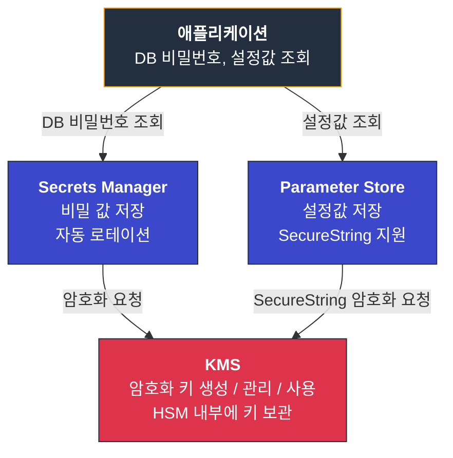
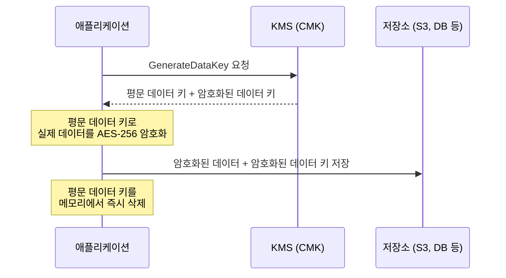
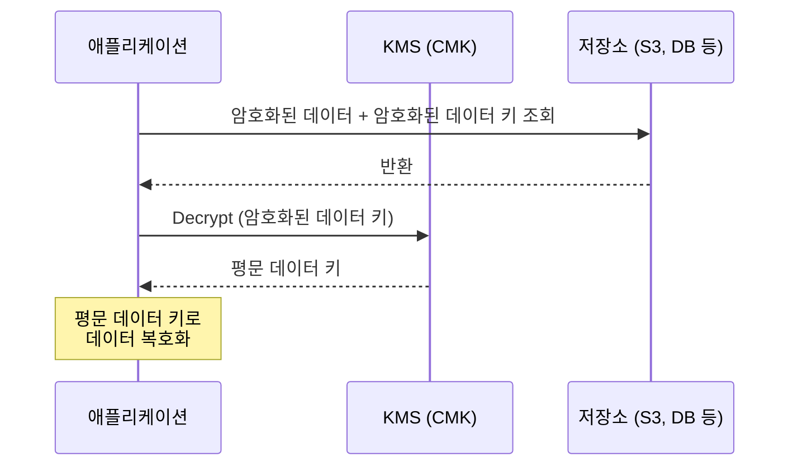
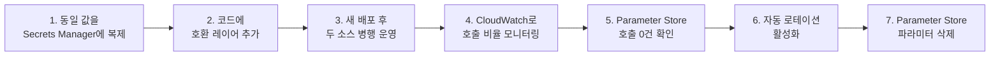
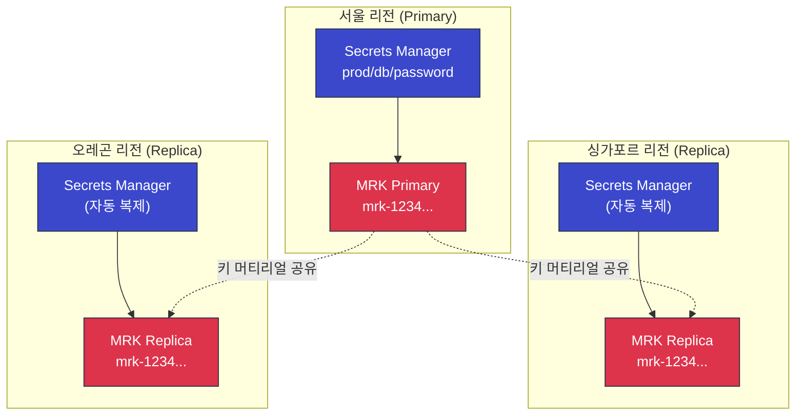
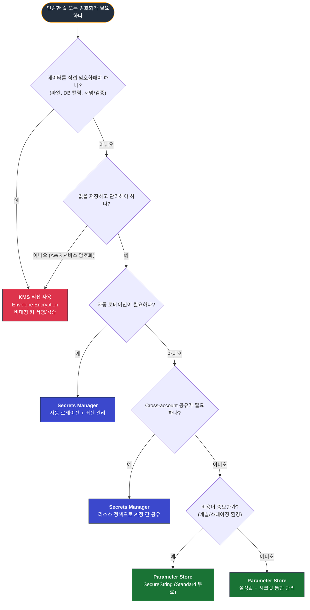
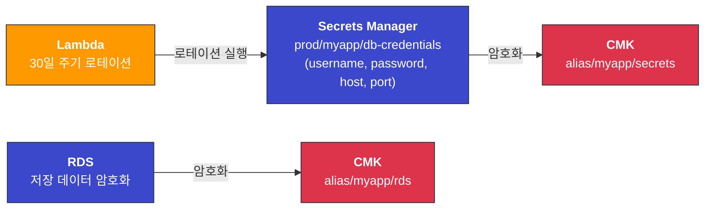

# Secrets Manager vs KMS — 뭘 써야 하나

AWS 보안 서비스를 처음 접하면 Secrets Manager, KMS, SSM Parameter Store가 비슷해 보인다. 셋 다 "민감한 값을 저장하는 서비스"로 오해하기 쉬운데, 실제로는 역할이 다르다. 이 문서에서는 각 서비스의 본질적인 차이와 실무에서 어떤 상황에 어떤 서비스를 쓰는지 정리한다.

---

## 역할부터 구분하자

### KMS — 암호화 키를 관리하는 서비스

KMS는 데이터를 직접 저장하지 않는다. 암호화/복호화에 쓰이는 "키"를 만들고, 그 키를 HSM(Hardware Security Module) 안에 보관하고, 키를 써서 암호화·복호화 API를 제공하는 서비스다.

S3에 파일을 올릴 때 SSE-KMS를 켜면, S3가 KMS에게 "이 키로 암호화해줘"라고 요청한다. EBS 볼륨 암호화도 마찬가지다. KMS는 직접 데이터를 갖고 있지 않고, 키만 관리한다.

핵심: **"데이터를 암호화하는 열쇠를 관리하는 금고"**

### Secrets Manager — 비밀 값을 저장하고 수명주기를 관리하는 서비스

Secrets Manager는 DB 비밀번호, API 키, OAuth 토큰 같은 실제 비밀 값을 저장한다. 저장할 때 내부적으로 KMS를 써서 암호화한다. 여기서 핵심은 자동 로테이션이다. Lambda를 연결해서 DB 비밀번호를 30일마다 자동으로 바꾸고, 애플리케이션은 항상 최신 값을 가져가는 구조를 만들 수 있다.

핵심: **"비밀번호를 넣어두고 알아서 바꿔주는 비서"**

### SSM Parameter Store — 설정값을 저장하는 서비스

Parameter Store는 Secrets Manager보다 범용적이다. 암호화가 필요 없는 일반 설정값(`String` 타입)도 저장하고, 암호화가 필요한 값(`SecureString` 타입)도 저장한다. SecureString은 내부적으로 KMS를 쓴다.

핵심: **"환경변수 저장소. 필요하면 암호화도 해줌"**

---

## 세 서비스의 관계



Secrets Manager와 Parameter Store 둘 다 KMS를 "내부 엔진"으로 사용한다. KMS는 이 둘과 독립적으로도 동작하며, S3·EBS·RDS 등 수십 개 AWS 서비스의 암호화를 담당한다.

---

## 3자 비교

| 항목 | KMS | Secrets Manager | SSM Parameter Store |
|------|-----|-----------------|---------------------|
| **본질** | 암호화 키 관리 | 비밀 값 저장 + 수명주기 관리 | 설정값/비밀 값 저장 |
| **저장 대상** | 키만 저장 (데이터 저장 안 함) | DB 비밀번호, API 키, 토큰 | 설정값, 비밀번호, 연결 문자열 |
| **암호화** | 암호화 자체를 수행 | KMS로 암호화 (항상) | KMS로 암호화 (SecureString만) |
| **자동 로테이션** | 키 자동 로테이션 (1년 주기) | Lambda 기반 시크릿 로테이션 | 미지원 |
| **값 크기 제한** | 4KB (직접 암호화) | 64KB | 8KB (Advanced) / 4KB (Standard) |
| **버전 관리** | 키 로테이션 시 자동 버전 관리 | AWSCURRENT, AWSPREVIOUS 레이블 | 미지원 (덮어쓰기) |
| **계층 구조** | 키 별칭(alias) | 이름에 `/`로 경로 구분 | 이름에 `/`로 경로 구분 |
| **Cross-account 접근** | 키 정책으로 가능 | 리소스 정책으로 가능 | 미지원 |
| **CloudFormation 연동** | 지원 | 지원 | Dynamic Reference 지원 |
| **API 처리량 한도** | 키 유형별 5,500~30,000 RPS | 10,000 RPS | Standard 40 TPS / Advanced 1,000 TPS |
| **멀티리전 복제** | Multi-Region Key (자체 메커니즘) | Replication (자동 복제) | 미지원 (수동 복사) |

---

## Envelope Encryption — 두 서비스가 맞물리는 지점

실무에서 KMS와 Secrets Manager(또는 다른 서비스)가 가장 밀접하게 연동되는 부분이 Envelope Encryption이다. 이 패턴을 이해해야 KMS 비용 구조와 성능 특성이 납득된다.

### 왜 Envelope Encryption이 필요한가

KMS API로 직접 암호화할 수 있는 데이터 크기는 **4KB**다. DB에 들어갈 고객 정보, S3에 올릴 파일은 4KB를 훌쩍 넘는다. 그래서 KMS는 "데이터 키"를 만들어주고, 실제 데이터 암호화는 애플리케이션이 직접 한다.

### 동작 흐름

**암호화 과정:**



**복호화 과정:**



이 구조에서 KMS API를 호출하는 횟수는 암호화할 때 1번(GenerateDataKey), 복호화할 때 1번(Decrypt)이다. 100MB 파일이든 1GB 파일이든 KMS 호출은 동일하다. KMS 호출 비용과 네트워크 지연을 최소화하면서도 HSM 수준의 키 보호를 받는 구조다.

### Secrets Manager 내부에서도 같은 일이 일어난다

시크릿을 저장할 때:
1. Secrets Manager가 KMS에 `GenerateDataKey` 요청
2. 받은 평문 데이터 키로 시크릿 값을 암호화
3. 암호화된 시크릿 + 암호화된 데이터 키를 저장
4. 평문 데이터 키 삭제

시크릿을 조회할 때:
1. 암호화된 데이터 키를 KMS에 `Decrypt` 요청
2. 받은 평문 데이터 키로 시크릿을 복호화
3. 복호화된 값을 애플리케이션에 반환

즉, `GetSecretValue` API를 호출할 때마다 내부적으로 KMS API가 한 번 호출된다. Secrets Manager 비용과 별도로 KMS 요청 비용이 쌓이는 이유가 여기 있다.

---

## 비용 비교

### 월 고정 비용

| 항목 | KMS | Secrets Manager | Parameter Store |
|------|-----|-----------------|-----------------|
| 보관 비용 | CMK당 $1/월 | 시크릿당 $0.40/월 | Standard: 무료 / Advanced: 파라미터당 $0.05/월 |

### API 호출 비용

| 항목 | KMS | Secrets Manager | Parameter Store |
|------|-----|-----------------|-----------------|
| 호출 비용 | 10,000건당 $0.03 | 10,000건당 $0.05 | Standard: 무료 / Advanced: 10,000건당 $0.05 |
| 무료 제공량 | 월 20,000건 | 없음 | Standard는 무료 |

### 실제 비용 계산 예시

DB 비밀번호 1개를 관리하는 경우를 생각해보자.

**Secrets Manager 사용 시:**
- 시크릿 1개 보관: $0.40/월
- 하루 1,000번 조회 × 30일 = 30,000건: $0.15/월
- 내부 KMS 호출 30,000건: $0.09/월 (20,000건 무료 차감 후)
- **합계: 약 $0.64/월**

**Parameter Store SecureString 사용 시:**
- Standard 파라미터 보관: 무료
- API 호출: 무료 (Standard 기준)
- 내부 KMS 호출 30,000건: $0.03/월 (무료 제공량 차감 후)
- **합계: 약 $0.03/월**

비용 차이가 20배다. 단, Parameter Store는 자동 로테이션이 없고, 버전 관리도 안 되고, Cross-account 공유도 안 된다. 비용만 보고 선택하면 안 되는 이유다.

---

## API 처리량과 쓰로틀링

비용보다 더 자주 발목을 잡는 게 처리량 한도다. 트래픽 설계할 때 어느 서비스가 병목이 되는지 미리 알아야 한다.

### 서비스별 한도 비교

| 서비스 | 한도 | 비고 |
|--------|------|------|
| KMS Symmetric CMK (Encrypt/Decrypt/GenerateDataKey) | 리전·CMK당 5,500 RPS (us-east-1·us-west-2·eu-west-1은 10,000~30,000 RPS) | 리전마다 다름. AWS 콘솔의 Service Quotas에서 확인 |
| KMS Asymmetric CMK (Sign/Verify) | 키당 500 RPS | RSA 키는 더 낮음 |
| Secrets Manager (GetSecretValue) | 계정·리전당 10,000 RPS | 시크릿별이 아니라 계정 합산 |
| Parameter Store Standard | 40 TPS | 매우 낮음 |
| Parameter Store Advanced | 1,000 TPS | 추가 비용 발생 |
| Parameter Store High Throughput Mode | 10,000 TPS | 리전당 활성화, 호출당 과금 |

### 실무에서 어디가 병목이 되나

KMS는 RPS가 높아 보이지만 키 1개당 한도다. 같은 CMK를 모든 서비스가 공유해서 쓰면 5,500 RPS에 빠르게 도달한다. RDS·S3·Secrets Manager가 모두 같은 CMK를 쓰는 구조에서 트래픽이 몰리면 `ThrottlingException`이 떨어진다. 키를 용도별로 분리하는 게 권한 분리뿐 아니라 처리량 분산 측면에서도 의미가 있다.

Secrets Manager 10,000 RPS는 계정·리전 합산이다. 시크릿이 100개라고 시크릿당 10,000 RPS가 아니다. 멀티 테넌트 SaaS에서 테넌트별 시크릿을 다 Secrets Manager에 넣으면, 트래픽이 집중될 때 전체가 막힌다. 그래서 캐싱이 필수다.

Parameter Store Standard 40 TPS는 정말 낮은 수치다. ECS Task가 30대 떠 있고 각 Task가 시작할 때 파라미터 5개를 읽으면 150번 호출이 거의 동시에 몰린다. Auto Scaling이 한꺼번에 Task를 띄울 때 `ThrottlingException`이 잦으면 의심해볼 부분이다. Advanced로 올리거나, ECS의 `secrets` 블록을 통해 Task 시작 시 한 번만 주입하고 런타임에는 환경변수로 쓰는 패턴이 안전하다.

### 쓰로틀링 발생 시 패턴

`ThrottlingException`은 재시도 가능한 에러다. AWS SDK는 기본적으로 지수 백오프 재시도를 한다. 다만 재시도 횟수가 늘어나면 응답 지연이 커지고, 결국 호출 측 타임아웃이 터진다. 캐싱으로 호출 자체를 줄이는 게 정답이다.

GuardDuty와 CloudTrail에서 `ThrottlingException` 빈도가 갑자기 늘면 트래픽 패턴 변화나 코드 리그레션을 의심해야 한다. 매 요청마다 시크릿을 새로 가져오는 코드가 들어갔을 가능성이 높다.

---

## GetSecretValue 캐싱 — AWS Caching Client

Secrets Manager 호출을 줄이는 가장 단순한 답은 AWS가 제공하는 캐싱 클라이언트 SDK를 쓰는 것이다. Python·Java·.NET·Go용이 있다.

### Python 캐싱 클라이언트

```python
from aws_secretsmanager_caching import SecretCache, SecretCacheConfig
import boto3

client = boto3.client('secretsmanager', region_name='ap-northeast-2')
cache_config = SecretCacheConfig(
    max_cache_size=1024,      # 캐시할 시크릿 개수
    secret_refresh_interval=3600  # 1시간 (초)
)
cache = SecretCache(config=cache_config, client=client)

def get_db_password():
    # 내부적으로 캐시 확인 → 만료되었으면 API 호출
    return cache.get_secret_string('prod/myapp/db-credentials')
```

핵심은 `secret_refresh_interval`이다. 기본값은 1시간(3,600초). 캐시 만료가 되면 백그라운드에서 비동기로 새 값을 가져오기 때문에, 호출 측은 만료 순간에도 지연을 느끼지 않는다.

### TTL과 로테이션 주기의 트레이드오프

TTL을 어떻게 잡느냐가 실무에서 가장 헷갈리는 부분이다.

| 로테이션 주기 | 권장 TTL | 이유 |
|--------------|----------|------|
| 30일 | 1시간 | 로테이션 직후 최악 1시간 동안 옛 값이 캐시에 남아도 새 비밀번호와 옛 비밀번호 둘 다 유효한 dual-secret 패턴이면 안전 |
| 7일 | 15~30분 | 로테이션 빈도가 잦으면 TTL을 줄여 갱신 지연을 짧게 |
| 24시간 (긴급 회수형) | 5분 이하 | 긴급 회수 시나리오면 TTL이 곧 노출 윈도우 |

Secrets Manager 로테이션은 `AWSCURRENT`와 `AWSPREVIOUS` 두 레이블을 유지한다. 로테이션 직후에도 `AWSPREVIOUS`(직전 비밀번호)가 잠시 유효하기 때문에 캐시 만료를 기다리는 동안 인증 실패가 거의 발생하지 않는다. 단, RDS 로테이션 템플릿이 single-user 모드인지 multi-user 모드인지에 따라 다르다. multi-user 모드는 두 계정을 번갈아 쓰기 때문에 캐시 TTL이 길어도 안전하지만, single-user 모드는 짧은 윈도우 동안 인증 실패가 나올 수 있다.

### Java Caching Client 차이점

Java SDK도 동일한 패턴이다. 다만 hook 패턴이 더 명시적이다.

```java
SecretCache cache = new SecretCache(
    SecretCacheConfiguration.builder()
        .withMaxCacheSize(1024)
        .withCacheItemTTL(TimeUnit.HOURS.toMillis(1))
        .build()
);

String secret = cache.getSecretString("prod/myapp/db-credentials");
```

캐싱 클라이언트는 내부적으로 `DescribeSecret`을 주기적으로 호출해 시크릿 버전 변경을 감지한다. 그래서 TTL이 길어도 로테이션 직후 비교적 빨리 새 값으로 갱신된다.

---

## Lambda 환경변수에 KMS 암호화 값 직접 넣기

Secrets Manager API 호출 비용·지연을 아끼면서 단순한 값 하나만 안전하게 넣고 싶을 때 쓰는 패턴이다. Lambda 환경변수는 기본적으로 AWS 관리형 키로 암호화되지만, 자체 CMK로 한 번 더 암호화해 전송 중 노출까지 막을 수 있다.

### 동작 방식

Lambda 콘솔에서 환경변수에 "Enable helpers for encryption in transit" 옵션을 켜면, 환경변수 값을 KMS로 암호화해서 저장한다. 코드는 시작 시 한 번만 `Decrypt` API를 호출해 평문을 얻는다.

```python
import os
import base64
import boto3

ENCRYPTED = os.environ['DB_PASSWORD']
DECRYPTED = boto3.client('kms').decrypt(
    CiphertextBlob=base64.b64decode(ENCRYPTED),
    EncryptionContext={'LambdaFunctionName': os.environ['AWS_LAMBDA_FUNCTION_NAME']}
)['Plaintext'].decode('utf-8')

def handler(event, context):
    # DECRYPTED는 cold start 때 1회만 복호화됨
    return use_password(DECRYPTED)
```

비용은 KMS Decrypt 호출당 $0.03/10,000건. Lambda cold start에만 호출되므로 warm 컨테이너에서는 추가 비용이 0이다. Secrets Manager를 매 호출마다 부르는 패턴 대비 비용이 90% 이상 절감된다.

### 한계가 명확하다

이 패턴은 다음 경우에 쓰면 안 된다.

값 회수(rotation)가 필요한 경우 — Lambda 환경변수는 함수 버전과 묶여 있다. 비밀번호를 바꾸려면 환경변수를 업데이트하고 함수를 재배포해야 한다. 30일마다 자동 회수가 필요한 상황이면 Secrets Manager가 답이다.

여러 함수가 같은 시크릿을 공유하는 경우 — 함수마다 환경변수를 복사해두면, 비밀번호 변경 시 모든 함수를 재배포해야 한다.

값 변경 이력이 필요한 경우 — Lambda 환경변수는 버전 라벨이 없다. 어제 무슨 값이었는지 추적이 불가능하다.

값이 자주 바뀌는 경우 — 배포 파이프라인에 환경변수 갱신이 끼면 운영 부담이 커진다.

요약하면, 거의 안 바뀌고 단순한 값(외부 API 키 1~2개 정도)만 이 패턴을 쓰고, 나머지는 Secrets Manager 또는 Parameter Store가 맞다.

---

## Parameter Store → Secrets Manager 마이그레이션

처음엔 Parameter Store SecureString으로 충분했는데, 어느 날 컴플라이언스 감사에서 "DB 비밀번호 90일 자동 회수" 요건이 추가되는 일이 흔하다. 이때 무중단으로 Secrets Manager로 옮기는 절차를 정리한다.

### 단계별 절차



**1단계 — 값 복제.** 기존 Parameter Store 값을 그대로 Secrets Manager에 만든다. 이 시점에 KMS 키도 새로 만들지(권장) 기존 키를 재사용할지 결정한다. 권한 분리를 위해 새 CMK가 안전하다.

```bash
# 기존 값 조회
VAL=$(aws ssm get-parameter --name /prod/db/password --with-decryption \
    --query 'Parameter.Value' --output text)

# Secrets Manager에 복제
aws secretsmanager create-secret \
    --name prod/db/password \
    --secret-string "$VAL" \
    --kms-key-id alias/myapp/secrets
```

**2단계 — 코드 호환 레이어.** 한 함수 안에서 둘 다 시도하는 추상화 레이어를 둔다.

```python
import boto3
import os
import json

USE_SECRETS_MANAGER = os.environ.get('SECRET_BACKEND', 'ssm') == 'secretsmanager'

def get_secret(name: str) -> str:
    if USE_SECRETS_MANAGER:
        sm = boto3.client('secretsmanager')
        resp = sm.get_secret_value(SecretId=name)
        return resp['SecretString']
    else:
        ssm = boto3.client('ssm')
        resp = ssm.get_parameter(Name=name, WithDecryption=True)
        return resp['Parameter']['Value']
```

환경변수 한 줄로 백엔드를 전환할 수 있게 만든다. 카나리 배포를 통해 일부 인스턴스만 새 백엔드로 보내면서 검증한다.

**3단계 — 병행 운영.** 신규 배포는 Secrets Manager를 보게 하되, 기존 Parameter Store 값도 그대로 둔다. 롤백이 필요할 때 환경변수만 바꾸면 된다.

**4단계 — 호출량 모니터링.** CloudTrail Data Events 또는 CloudWatch Metrics에서 Parameter Store `GetParameter` 호출이 0으로 떨어지는지 확인한다. 모든 인스턴스가 Secrets Manager로 넘어왔는지 검증하는 단계다.

**5~7단계 — 로테이션 활성화 후 정리.** Parameter Store 호출이 며칠간 0이면 자동 로테이션을 켠다. Lambda 로테이션 함수가 정상 동작하는지 첫 회수까지 지켜보고, 그 다음 Parameter Store 파라미터를 삭제한다.

### 자주 빠뜨리는 부분

JSON 구조 차이를 놓치면 코드 변경이 커진다. Parameter Store는 보통 단일 문자열이지만, Secrets Manager 시크릿은 JSON 객체로 만드는 게 일반적이다(`{"username": "...", "password": "..."}`). 호환 레이어에서 형식을 통일하거나, 마이그레이션 시점에 코드 호출부도 같이 정리한다.

ECS Task Definition의 `secrets` 블록은 ARN으로 참조하기 때문에, Parameter Store ARN을 Secrets Manager ARN으로 교체하고 Task Definition을 새로 등록해야 한다. Rolling update로 무중단 전환된다.

---

## DR과 멀티리전 설계

서울 리전이 통째로 다운된 시나리오를 가정해보자. RDS는 멀티리전 읽기 복제본을 띄워뒀는데, DB 비밀번호 시크릿은 서울에만 있다. 페일오버해도 시크릿을 읽을 수 없으면 의미가 없다.

### Secrets Manager Replication

Secrets Manager는 시크릿을 여러 리전으로 자동 복제하는 기능이 있다. 원본(primary)을 만들고 복제 리전을 지정하면, 원본이 갱신될 때마다 복제본도 자동으로 동기화된다.

```bash
aws secretsmanager replicate-secret-to-regions \
    --secret-id prod/db/password \
    --add-replica-regions Region=ap-southeast-1,KmsKeyId=alias/myapp/secrets \
                          Region=us-west-2,KmsKeyId=alias/myapp/secrets
```

주의할 점: 각 리전의 KMS 키를 별도로 지정해야 한다. 원본 리전의 KMS 키는 다른 리전에서 쓸 수 없다. 그래서 KMS Multi-Region Key가 필요해진다.

### KMS Multi-Region Key 조합 패턴

KMS Multi-Region Key는 여러 리전에 같은 키 머티리얼(material)을 공유하는 키다. 일반 KMS 키와 달리, 리전별 복제본이 같은 키 ID 접두사를 갖고, 한 리전에서 암호화한 데이터를 다른 리전에서 그대로 복호화할 수 있다.



S3 Cross-Region Replication에서 SSE-KMS를 쓸 때도 MRK가 필요하다. 일반 키로 암호화된 객체를 다른 리전 버킷으로 복제하려면, 복제 대상 버킷의 KMS 키로 다시 암호화해야 해서 비용이 두 배가 된다. MRK를 쓰면 그게 사라진다.

### 리전 페일오버 시나리오

DNS 페일오버(Route 53 헬스체크) 또는 Active-Active 구성을 가정하면 다음과 같은 흐름이다.

평상시: 서울 애플리케이션은 서울 리전 Secrets Manager에서 시크릿을 가져온다. 싱가포르 복제본은 hot standby로 동기화 상태 유지.

서울 리전 장애: 트래픽이 싱가포르로 넘어간다. 싱가포르 애플리케이션은 자기 리전 Secrets Manager(복제본)에서 시크릿을 가져온다. KMS도 싱가포르 MRK 복제본을 쓴다. 원본 리전 의존 0.

장애 복구 후: 복제 시크릿이 자동으로 동기화 재개. 페일백 시점에 원본을 다시 서울로 promote.

### 리전별 키 정책 분리

리전이 다르면 컴플라이언스 요구사항도 다를 수 있다. 예를 들어 EU 리전은 GDPR로 인해 키 사용자를 EU 거주 직원으로만 제한해야 한다. MRK는 키 머티리얼은 공유하지만 키 정책(policy)은 리전마다 독립적으로 설정 가능하다. 키 정책 자체는 리전별로 따로 관리해서 데이터 거버넌스 요구를 만족시킨다.

---

## 컴플라이언스 관점

감사 대응 때 자주 받는 질문과 답변을 정리한다.

### PCI-DSS

PCI-DSS 3.5는 카드 데이터 암호화 키를 "강력하게 보호된 환경"에 저장하라고 명시한다. AWS KMS는 FIPS 140-2 Level 2(일부 리전은 Level 3) 인증 HSM에서 키를 보관한다. PCI-DSS Level 1 가맹점도 KMS만으로 키 보관 요건을 충족한다.

카드 번호 자체는 Secrets Manager에 넣지 않는다. 카드 정보는 토큰화(예: Stripe·tokenization)해서 토큰만 저장하고, KMS는 그 토큰을 암호화하는 키 또는 가맹점 측 결제 자격증명을 암호화하는 용도로 쓴다.

### HIPAA

HIPAA는 PHI(보호 대상 건강 정보) 암호화를 요구한다. AWS BAA(Business Associate Agreement)를 체결한 계정에서 KMS·Secrets Manager·Parameter Store 모두 HIPAA-eligible 서비스로 분류된다. 단, 환자 식별 정보를 직접 저장하는 데는 RDS·S3 같은 데이터 스토어를 쓰고, KMS는 그 스토어를 암호화하는 용도다.

자동 회수 요건이 있는 인증 정보(EHR 시스템 접속 자격증명 등)는 Secrets Manager로 90일 회수 자동화를 설정해 감사 증적을 남긴다.

### ISO 27001

A.10.1 (Cryptographic Controls)는 키 관리 정책을 문서화하라고 요구한다. KMS는 키 생성·회수·삭제·접근 로그가 모두 CloudTrail에 기록되어 감사 증적이 자동으로 남는다. 키 정책과 IAM 정책으로 권한 분리를 문서화한 후, CloudTrail 로그를 별도 계정에 적재해 5~7년 보관하는 패턴이 일반적이다.

### CloudTrail Data Events 비용 폭증 주의

위 요건들을 만족시키려고 CloudTrail Data Events를 활성화하면, KMS API 호출 하나하나가 모두 기록된다. KMS는 Envelope Encryption 특성상 호출 수가 많은 서비스다. S3 SSE-KMS를 켠 버킷에 트래픽이 몰리면 KMS Data Events 비용이 EC2·RDS 비용을 능가하는 경우가 있다.

방어 방법: KMS Data Events는 특정 키만 선별적으로 로깅하도록 advanced event selector에서 필터를 건다. PCI/HIPAA 대상 데이터를 암호화하는 키만 로깅하고, 일반 시스템 키는 제외한다. 또한 S3 Bucket Keys 기능을 켜면 객체별 KMS 호출이 버킷 단위로 통합되어 호출 수가 99% 줄어든다.

---

## 서비스 선택 플로우차트

어떤 서비스를 써야 할지 헷갈릴 때 아래 흐름을 따라가면 된다.



---

## 실무 판단 기준

### Secrets Manager를 써야 하는 경우

**자동 로테이션이 필요할 때** — RDS 비밀번호를 30일마다 바꿔야 하는 컴플라이언스 요건이 있다면, Secrets Manager 외에 선택지가 없다. Lambda 기반 로테이션을 직접 구현할 수도 있지만, AWS가 제공하는 RDS/Aurora/Redshift용 로테이션 템플릿을 쓰면 검증된 방식으로 처리된다.

**Cross-account 시크릿 공유가 필요할 때** — 여러 AWS 계정에서 같은 시크릿에 접근해야 하는 경우. Parameter Store는 이걸 지원하지 않는다.

**시크릿 버전 관리가 필요할 때** — 로테이션 후 이전 값으로 롤백해야 하는 상황. `AWSCURRENT`, `AWSPREVIOUS` 레이블로 관리된다.

### Parameter Store SecureString을 써야 하는 경우

**비용에 민감한 환경** — 개발·스테이징 환경에서 DB 비밀번호를 저장하는데 자동 로테이션까지 필요하진 않은 경우. Standard 티어는 무료다.

**설정값과 시크릿을 한 곳에서 관리하고 싶을 때** — 서비스 설정값(`/app/config/max-retry`)과 비밀 값(`/app/secret/db-password`)을 같은 인터페이스로 관리하면 코드가 단순해진다.

**ECS/Lambda 환경변수 주입** — ECS Task Definition이나 CloudFormation에서 Parameter Store 값을 직접 참조하는 패턴이 많다. `{{resolve:ssm:/path/to/param}}` 같은 Dynamic Reference를 쓰면 배포 시점에 값이 주입된다.

### KMS를 직접 써야 하는 경우

**애플리케이션 레벨 암호화가 필요할 때** — DB 컬럼 단위로 암호화하거나, 파일을 암호화해서 S3에 올리는 경우. Secrets Manager는 "값을 저장하는 서비스"지 "데이터를 암호화하는 서비스"가 아니다.

**서명·검증이 필요할 때** — 비대칭 키(RSA/ECC)로 JWT 서명하거나, 메시지 무결성을 검증하는 경우.

**AWS 서비스의 서버사이드 암호화 커스터마이징** — S3 SSE-KMS, EBS 암호화 등에서 AWS 관리형 키 대신 자체 키를 써서 키 정책을 세밀하게 제어하고 싶을 때.

---

## 흔한 실수

### "KMS에 비밀번호를 저장하면 되지 않나?"

KMS는 데이터 저장소가 아니다. `Encrypt` API에 평문을 넘기면 암호문을 돌려주는데, 그 암호문을 어딘가에 저장해야 한다. 결국 S3든 DynamoDB든 저장소가 필요하다. 그러느니 Secrets Manager를 쓰는 게 맞다.

다만, 아주 단순한 경우 — 예를 들어 환경변수 하나를 KMS로 암호화해서 Lambda 환경변수에 넣어두고, 런타임에 복호화해서 쓰는 패턴은 있다. Secrets Manager API 호출 비용을 아끼면서 단순하게 처리할 때 쓸 수 있다.

### "Parameter Store가 무료니까 다 여기에 넣자"

Standard 티어는 파라미터 10,000개까지, 각 4KB까지 저장 가능하다. API 호출 TPS(초당 처리량)가 낮다 — Standard는 40 TPS, Advanced로 올려도 1,000 TPS다. 트래픽이 높은 서비스에서 매 요청마다 Parameter Store를 호출하면 스로틀링에 걸릴 수 있다. 캐싱 없이 쓰면 문제가 된다.

### "Secrets Manager와 Parameter Store를 혼용하면 복잡해진다"

오히려 실무에서는 혼용하는 게 자연스럽다. 자동 로테이션이 필요한 DB 비밀번호는 Secrets Manager에, 나머지 설정값과 단순 시크릿은 Parameter Store에 넣는 패턴이 일반적이다. 코드에서 두 서비스를 호출하는 건 SDK 한 줄 차이다.

### Parameter Store에 거대 JSON 한 덩어리로 넣기

자주 보는 안티패턴이다. 애플리케이션 설정 전체(`config.json`)를 Parameter Store 파라미터 한 개에 통째로 넣는다. 처음엔 편하다. 그런데 다음 문제가 줄줄이 따라온다.

값 크기 한도(Standard 4KB, Advanced 8KB)에 부딪힌다. 설정이 늘어나면 한도 초과로 저장 자체가 안 된다. 권한 분리가 불가능하다. 설정 안에 "유료 API 키"와 "단순 URL"이 섞여 있는데, IAM 정책은 파라미터 단위라 둘을 분리해서 권한을 줄 수 없다. 변경 추적도 어렵다. JSON 한 필드만 바꿔도 전체가 새 버전으로 기록되어 diff를 보기 힘들다.

설정은 키-값 단위로 쪼개 계층 구조로 저장한다(`/app/db/host`, `/app/db/port`, `/app/api/timeout`). 코드에서는 `GetParametersByPath`로 prefix 단위로 한 번에 가져온다.

### Secrets Manager로 설정값까지 다 옮긴 후 비용 폭증

반대 방향 실수도 있다. "보안 강화를 위해" 모든 설정을 Secrets Manager로 옮기는 경우. Secrets Manager는 시크릿당 $0.40/월이다. 설정값 100개면 $40/월이 보관 비용으로 들어간다. 매일 수천 번 호출되면 호출 비용까지 더해진다.

설정값은 본질적으로 비밀이 아니다. API 엔드포인트 URL, 타임아웃 값, 기능 플래그 같은 건 Parameter Store(Standard, 무료)에 넣는다. Secrets Manager는 진짜 비밀(DB 비밀번호, API 키, 인증서 프라이빗 키)에만 쓴다.

### 매 요청마다 GetSecretValue 호출하기

가장 흔한 코드 리그레션이다. 미들웨어나 매 핸들러에서 시크릿을 새로 가져오는 코드. 트래픽이 적을 때는 보이지 않다가, 트래픽이 늘어나면 두 가지 문제가 동시에 터진다.

비용 폭증 — 일 100만 건 호출이면 월 30,000,000건 × $0.05/10,000 = $150/월. 시크릿 1개당이다.

쓰로틀링 — Secrets Manager 10,000 RPS 한도에 도달하면 `ThrottlingException`이 전 인스턴스에서 동시에 발생한다. 장애로 이어진다.

수정 방법은 단순하다. 모듈 레벨 또는 싱글톤으로 시크릿을 1회 가져오고, AWS Caching Client로 백그라운드 갱신한다.

```python
# 안 좋은 패턴
def handler(event, ctx):
    secret = boto3.client('secretsmanager').get_secret_value(...)  # 매번 호출
    return query_db(secret)

# 좋은 패턴
from aws_secretsmanager_caching import SecretCache
_cache = SecretCache()  # 모듈 레벨 (Lambda warm 컨테이너 재사용)

def handler(event, ctx):
    secret = _cache.get_secret_string('prod/db/password')  # 캐시 적중
    return query_db(secret)
```

### 시크릿 값을 코드에서 로깅하기

디버깅 중에 `logger.debug(f"DB config: {secret}")` 같은 코드가 남는 경우. CloudWatch Logs에 평문 비밀번호가 남으면 사고다. CloudWatch Logs는 KMS 암호화를 켤 수 있지만, 그건 저장 시 암호화일 뿐 로그를 읽을 수 있는 사람이라면 누구나 본다.

로깅 전 마스킹 함수를 거치게 하거나, 시크릿 객체를 `repr` 시 마스킹된 값을 반환하는 클래스로 감싼다.

### Lambda 환경변수에 시크릿 평문으로 저장

KMS 암호화 없이 그냥 환경변수에 비밀번호를 넣는 경우. Lambda 콘솔에서 누구나 볼 수 있고, Lambda 함수 export 시 같이 따라가고, CloudFormation 템플릿에 평문이 그대로 남는다. 환경변수에 KMS 암호화를 켜거나, 위에서 다룬 Secrets Manager + Caching Client 패턴으로 옮긴다.

---

## 조합 패턴 예시

### 패턴 1: RDS + Secrets Manager + KMS



DB 접속 정보와 DB 저장 데이터를 각각 다른 CMK로 암호화하는 건 권한 분리 관점에서 좋은 습관이다. Secrets Manager에 접근할 수 있는 역할과 RDS 데이터를 복호화할 수 있는 역할을 분리할 수 있다.

### 패턴 2: ECS + Parameter Store + Secrets Manager

```python
# ECS Task Definition (Terraform)
container_definitions = jsonencode([{
  name = "myapp"
  secrets = [
    {
      # Secrets Manager에서 DB 비밀번호 주입
      name      = "DB_PASSWORD"
      valueFrom = "arn:aws:secretsmanager:ap-northeast-2:123456:secret:prod/db-password"
    },
    {
      # Parameter Store에서 설정값 주입
      name      = "API_ENDPOINT"
      valueFrom = "arn:aws:ssm:ap-northeast-2:123456:parameter/prod/api-endpoint"
    }
  ]
}])
```

ECS는 `secrets` 블록에서 Secrets Manager와 Parameter Store 값을 모두 주입할 수 있다. ARN 형식만 다르고 사용법은 동일하다.

### 패턴 3: 애플리케이션 레벨 Envelope Encryption

```python
import boto3
from cryptography.fernet import Fernet
import base64

kms = boto3.client('kms', region_name='ap-northeast-2')
CMK_ID = 'alias/myapp/data-encryption'

def encrypt_pii(plaintext: str) -> dict:
    """고객 PII를 Envelope Encryption으로 암호화"""
    # KMS에서 데이터 키 생성
    response = kms.generate_data_key(
        KeyId=CMK_ID,
        KeySpec='AES_256'
    )

    # 평문 데이터 키로 실제 데이터 암호화
    data_key = base64.urlsafe_b64encode(response['Plaintext'])
    f = Fernet(data_key)
    encrypted = f.encrypt(plaintext.encode())

    return {
        'encrypted_data': encrypted.decode(),
        'encrypted_key': base64.b64encode(response['CiphertextBlob']).decode()
    }
    # 평문 데이터 키는 이 함수가 끝나면 GC 대상


def decrypt_pii(encrypted_data: str, encrypted_key: str) -> str:
    """암호화된 PII 복호화"""
    # KMS에서 데이터 키 복호화
    response = kms.decrypt(
        CiphertextBlob=base64.b64decode(encrypted_key)
    )

    data_key = base64.urlsafe_b64encode(response['Plaintext'])
    f = Fernet(data_key)
    return f.decrypt(encrypted_data.encode()).decode()
```

이 패턴에서 KMS API 호출은 암호화·복호화 각 1회뿐이다. 데이터가 아무리 커도 KMS 비용은 같다.

---

## 정리

| 하고 싶은 일 | 쓸 서비스 |
|-------------|----------|
| DB 비밀번호를 저장하고 자동으로 바꾸고 싶다 | Secrets Manager |
| 애플리케이션 설정값을 중앙에서 관리하고 싶다 | Parameter Store |
| 비밀번호를 저장하는데 로테이션은 필요 없고 비용을 아끼고 싶다 | Parameter Store SecureString |
| S3/EBS/RDS 데이터를 암호화하고 싶다 | KMS (서비스 연동) |
| 애플리케이션에서 직접 데이터를 암호화하고 싶다 | KMS (Envelope Encryption) |
| JWT 서명/검증이 필요하다 | KMS (비대칭 키) |
| 여러 계정에서 같은 비밀번호를 공유해야 한다 | Secrets Manager |

세 서비스는 경쟁 관계가 아니라 레이어가 다르다. KMS가 바닥에 깔려 있고, 그 위에 Secrets Manager와 Parameter Store가 각자의 역할로 올라가 있다. 이 구조를 이해하면 어떤 상황에 뭘 써야 하는지 자연스럽게 판단할 수 있다.

---

## 관련 문서

- [KMS](./KMS.md) — KMS 상세 개념과 키 관리
- [Secrets Manager](./Secrets_Manager.md) — Secrets Manager 상세 기능과 로테이션
- [IAM](./IAM.md) — 서비스별 접근 권한 설계
