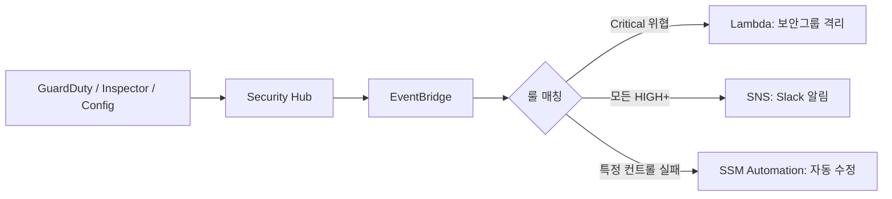

# AWS Security Hub

## 개요

Security Hub는 여러 보안 서비스가 뱉어내는 finding을 한 곳으로 모으고, 계정·리소스가 보안 표준을 지키고 있는지 자동으로 점검하는 서비스다. GuardDuty는 위협을, Inspector는 취약점을, Macie는 민감 데이터를 보는데 각각 콘솔이 따로 놀면 보안 담당자가 매일 콘솔 네 개를 돌아다녀야 한다. Security Hub를 켜면 이 결과가 전부 한 화면으로 들어온다.

켜는 이유는 두 가지로 갈린다. 하나는 finding 집계(aggregator)다. 여러 서비스, 여러 계정, 여러 리전의 finding을 ASFF(AWS Security Finding Format)라는 공통 포맷으로 정규화해서 모은다. 다른 하나는 보안 표준 점검이다. CIS, AWS 기본 보안 표준(Foundational Security Best Practices) 같은 룰셋을 켜두면 계정 설정을 주기적으로 검사해서 어긋난 항목을 finding으로 띄운다. 두 기능은 독립적이라 집계만 쓰고 표준 점검은 끌 수도 있다.

운영하면서 가장 먼저 부딪히는 건 비용과 노이즈다. 표준 점검은 Config 룰을 깔고 돌리는 구조라 Config가 켜져 있어야 하고, 점검 항목 하나하나가 Config 평가 횟수로 과금된다. 컨트롤 수백 개를 전부 켜면 계정당 finding이 수천 건씩 쌓인다. 처음 켜면 화면이 빨갛게 물드는데, 여기서 진짜 봐야 할 걸 골라내는 게 실무의 절반이다.

## 활성화와 Config 의존성

```bash
# Security Hub 활성화 (기본 표준 자동 구독)
aws securityhub enable-security-hub \
  --enable-default-standards
```

`--enable-default-standards`를 주면 AWS Foundational Security Best Practices와 CIS 표준이 자동으로 켜진다. 명시적으로 끄려면 `--no-enable-default-standards`로 켠 뒤 필요한 표준만 따로 구독한다.

여기서 놓치기 쉬운 게 Config다. Security Hub의 표준 점검은 내부적으로 AWS Config 룰을 깔고 그 평가 결과를 가져온다. Config가 꺼져 있으면 컨트롤이 전부 `No data` 상태로 뜨고 점검이 안 돈다. 그런데 Security Hub를 켜도 Config는 자동으로 안 켜진다. 별도로 Config recorder를 활성화하고 모든 리소스 타입을 기록하도록 설정해야 한다.

```bash
# Config recorder가 모든 리소스를 기록하는지 확인
aws configservice describe-configuration-recorders
```

이 부분에서 비용이 크게 갈린다. Config는 리소스 설정 변경(configuration item) 단위로 과금되는데, 표준 점검을 위해 모든 리소스 타입을 기록하면 EC2 오토스케일링이 잦은 계정에서 Config 비용이 Security Hub 본체보다 더 나오는 경우가 있다. 점검에 꼭 필요한 리소스 타입만 골라 기록하는 식으로 줄일 수 있지만, 그러면 일부 컨트롤이 `No data`로 빠진다. 어느 쪽을 택할지는 계정 성격을 보고 정해야 한다.

## finding 집계 구조

GuardDuty, Inspector, Macie, IAM Access Analyzer 같은 AWS 서비스는 Security Hub가 켜져 있으면 자동으로 finding을 보낸다. 별도 연동 설정이 거의 없다. 서드파티 보안 제품도 ASFF 포맷으로 `BatchImportFindings` API를 호출하면 같은 화면에 들어온다.

모든 finding은 ASFF라는 JSON 구조로 정규화된다. 핵심 필드 몇 개만 알면 된다.

```json
{
  "SchemaVersion": "2018-10-08",
  "Id": "arn:aws:guardduty:ap-northeast-2:123456789012:detector/.../finding/abc",
  "ProductArn": "arn:aws:securityhub:ap-northeast-2::product/aws/guardduty",
  "Severity": { "Label": "HIGH", "Normalized": 70 },
  "Workflow": { "Status": "NEW" },
  "RecordState": "ACTIVE",
  "Resources": [
    { "Type": "AwsEc2Instance", "Id": "arn:aws:ec2:...:instance/i-0abc" }
  ]
}
```

`Severity.Label`은 finding을 보낸 서비스가 매긴 심각도다. 서비스마다 기준이 다르다는 게 함정이다. GuardDuty의 HIGH와 Inspector의 HIGH가 같은 무게가 아니다. 그래서 Security Hub 화면의 심각도만 보고 우선순위를 정하면 한쪽 서비스 finding에 끌려다니게 된다. 실무에서는 리소스가 외부 노출됐는지, 운영 계정인지 같은 컨텍스트를 더해서 다시 줄을 세운다.

`Workflow.Status`와 `RecordState`를 헷갈리면 안 된다. `RecordState`는 finding이 여전히 유효한지를 나타내는 값으로 Security Hub가 관리한다. 문제가 해결되면 서비스가 다시 평가해서 `ARCHIVED`로 바꾼다. 반면 `Workflow.Status`는 사람이 이 finding을 어떻게 처리하기로 했는지를 표시하는 값이다. `NEW`, `NOTIFIED`, `SUPPRESSED`, `RESOLVED` 네 가지가 있고, 사람이 직접 바꾼다. 오탐을 끌 때는 `RecordState`를 건드리는 게 아니라 `Workflow.Status`를 `SUPPRESSED`로 바꾼다.

## finding 우선순위화

처음 켜면 finding이 수천 건이라 전부 보는 건 불가능하다. 줄이는 방법은 세 단계로 본다.

첫째, 오탐과 의도된 설정을 억제한다. 예를 들어 퍼블릭 S3 버킷을 의도적으로 쓰는 정적 사이트 호스팅이라면, 그 버킷 finding은 매번 뜰 필요가 없다. 억제 규칙(automation rule 또는 insight 필터)으로 특정 조건을 `SUPPRESSED`로 자동 전환한다.

```bash
# 특정 finding을 SUPPRESSED로 변경
aws securityhub batch-update-findings \
  --finding-identifiers '[{"Id":"<finding-arn>","ProductArn":"<product-arn>"}]' \
  --workflow '{"Status":"SUPPRESSED"}' \
  --note '{"Text":"정적 호스팅용 버킷, 의도된 퍼블릭 설정","UpdatedBy":"security-team"}'
```

둘째, automation rule로 들어오는 단계에서 자동 분류한다. Security Hub의 automation rule은 finding이 생성·업데이트될 때 조건에 맞으면 자동으로 필드를 바꾼다. 운영 계정의 Critical은 심각도를 올리고, 샌드박스 계정의 finding은 심각도를 낮추는 식으로 노이즈를 거른다.

셋째, 남은 것만 본다. 보통 `Workflow.Status = NEW`이고 `RecordState = ACTIVE`이며 심각도가 HIGH 이상인 것만 필터로 걸어두고 그 뷰만 매일 본다. 이 필터 뷰가 곧 실질적인 작업 큐가 된다.

## 멀티계정 통합

회사 규모가 커지면 계정이 수십 개가 되고, 계정마다 Security Hub를 따로 보는 건 불가능하다. Organizations와 연동해서 위임 관리자(delegated administrator) 계정 하나로 전부 모은다.

```bash
# 관리 계정에서 Security Hub 위임 관리자 지정
aws securityhub enable-organization-admin-account \
  --admin-account-id 111111111111

# 위임 관리자 계정에서 신규 계정 자동 등록 설정
aws securityhub update-organization-configuration \
  --auto-enable \
  --auto-enable-standards DEFAULT
```

`--auto-enable`을 켜면 Organizations에 새 계정이 들어올 때 Security Hub가 자동으로 켜진다. 이걸 안 켜두면 신규 계정이 보안 사각지대로 남는다. 실제로 계정 발급 자동화는 잘 해두고 Security Hub auto-enable은 빠뜨려서, 몇 달 뒤에 "이 계정 보안 점검이 한 번도 안 돌았네"를 발견하는 일이 흔하다.

리전 문제도 있다. Security Hub는 리전별 서비스다. 위임 관리자로 묶어도 리전마다 따로 켜야 하고, finding도 리전별로 쌓인다. 여러 리전을 쓰면 cross-region aggregation을 설정해서 한 리전(aggregation region)으로 다른 리전 finding을 모은다. 이걸 안 하면 서울 리전 콘솔을 보다가 도쿄 리전에서 터진 finding을 놓친다.

```bash
# 서울을 집계 리전으로, 나머지 활성 리전을 연결
aws securityhub create-finding-aggregator \
  --region-linking-mode ALL_REGIONS
```

멤버 계정에서도 finding을 볼 수는 있지만, 표준 점검 활성화/비활성화 같은 관리 작업은 위임 관리자 계정에서만 한다. 멤버 계정 담당자가 자기 계정 컨트롤을 끄려고 해도 안 되는 구조라, 끄려면 보안팀에 요청해야 한��. 이게 통제 측면에서는 맞는 방향이지만, 개발팀이 "왜 우리가 못 끄냐"고 항의하는 일이 생긴다.

## EventBridge 자동 대응 파이프라인

Security Hub의 모든 finding은 EventBridge로 흘러간다. 이걸 받아서 Lambda나 SSM Automation으로 자동 대응을 거는 게 실무에서 가장 많이 만드는 파이프라인이다.



EventBridge 룰은 finding의 ASFF 필드로 패턴 매칭한다. 심각도가 Critical이고 특정 위협 타입인 finding만 격리 Lambda로 보내는 식이다.

```json
{
  "source": ["aws.securityhub"],
  "detail-type": ["Security Hub Findings - Imported"],
  "detail": {
    "findings": {
      "Severity": { "Label": ["CRITICAL", "HIGH"] },
      "Workflow": { "Status": ["NEW"] }
    }
  }
}
```

이벤트 타입을 구분해야 한다. `Security Hub Findings - Imported`는 finding이 새로 들어오거나 업데이트될 때마다 발생한다. 반면 `Security Hub Findings - Custom Action`은 콘솔에서 사람이 특정 finding을 골라 "이거 처리해" 버튼을 눌렀을 때만 발생한다. 자동 대응은 보통 Imported를 쓰고, 사람이 검토 후 누르는 반자동 대응은 Custom Action을 쓴다.

Imported 룰을 만들 때 가장 흔한 사고는 무한 루프와 알림 폭탄이다. 대응 Lambda가 리소스를 바꾸면 Config가 그 변경을 감지해서 또 finding을 만들고, 그게 다시 EventBridge로 들어와 Lambda를 또 트리거하는 식이다. 그래서 룰 패턴에 `Workflow.Status = NEW` 조건을 꼭 넣어서, 이미 처리 중인 finding은 다시 안 걸리게 막는다. 알림 쪽도 마찬가지로, 같은 finding이 업데이트될 때마다 Slack이 울리면 사람들이 채널을 음소거해버린다. `RecordState = ACTIVE`이고 처음 들어온 것만 알림 보내도록 좁혀야 한다.

자동 격리 같은 파괴적 대응은 처음부터 전 계정에 풀로 켜면 안 된다. GuardDuty가 오탐으로 정상 인스턴스에 Critical을 붙이는 경우가 있는데, 그게 바로 격리 Lambda로 들어가면 멀쩡한 운영 인스턴스가 네트워크에서 끊긴다. 처음에는 알림만 보내고, 어떤 finding이 진짜 자동 대응해도 안전한지 한동안 지켜본 뒤에 격리 같은 동작을 거는 게 맞다.

## 정리

Security Hub는 그 자체로 위협을 탐지하거나 취약점을 찾지는 않는다. GuardDuty, Inspector, Config가 일하고 Security Hub는 그 결과를 모아서 보여주고 표준 점검을 얹는 역할이다. 그래서 Security Hub만 켜고 하위 서비스를 안 켜면 빈 화면만 본다. 켜는 순서는 Config와 하위 탐지 서비스를 먼저, 그 위에 Security Hub를 얹는 것이다.

비용은 Config 평가 횟수, finding 수집량, 표준 점검 컨트롤 수가 곱해지면서 커진다. 처음부터 모든 표준과 모든 리소스 기록을 켜기보다, 핵심 표준 하나와 필요한 리소스 타입부터 켜고 노이즈를 줄여가면서 범위를 넓히는 게 운영하기 편하다.