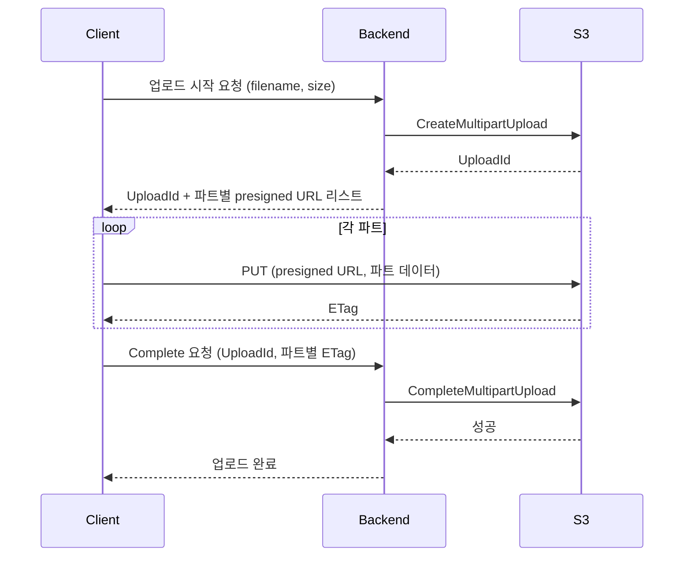

# S3 Multipart Upload 심층 정리

S3에 100MB짜리 파일을 PUT 한 번으로 올리면 보통은 잘 된다. 그런데 5GB짜리 비디오를 모바일 네트워크에서 올리려고 하면 그게 안 된다. 도중에 끊기면 처음부터 다시 올려야 하고, 5GB가 넘어가면 단일 PUT 자체가 불가능하다. S3는 단일 PUT의 최대 크기를 5GB로 제한한다.

Multipart Upload는 이걸 푸는 방법이다. 큰 파일을 여러 조각으로 나눠 병렬로 올리고, 다 올라가면 S3에 "이제 합쳐줘"라고 알려주는 방식이다. 개념은 단순한데 실제로 운영하면 파트 크기 선정, 실패 시 재시도, 정리 안 된 업로드의 비용 누수, ETag 검증 같은 함정이 끊임없이 나온다. 이 문서는 그 함정들을 다룬다.

---

## 라이프사이클: 3단계 API

Multipart Upload는 명시적인 시작과 종료가 있다. 일반 PUT처럼 한 번 호출하고 끝이 아니라, 트랜잭션처럼 시작·중간·종료가 따로 있다.

### CreateMultipartUpload

업로드 세션을 시작하는 API다. S3가 UploadId를 발급한다. 이게 이번 업로드 세션의 식별자다. 같은 객체 키에 대해 동시에 여러 개의 UploadId가 떠있을 수 있다. S3는 이걸 별개의 세션으로 본다.

```python
import boto3

s3 = boto3.client("s3")
resp = s3.create_multipart_upload(
    Bucket="my-bucket",
    Key="videos/2026/large.mp4",
    ContentType="video/mp4",
    ServerSideEncryption="AES256",
)
upload_id = resp["UploadId"]
```

여기서 지정한 메타데이터(ContentType, ServerSideEncryption, Metadata 등)는 이 시점에 고정된다. UploadPart 단계에서 바꿀 수 없다. CompleteMultipartUpload 단계에서도 못 바꾼다. 나중에 ContentType이 잘못된 걸 발견하면 객체를 다시 복사(CopyObject)해서 메타데이터를 갱신해야 한다.

### UploadPart

실제 데이터를 올리는 API다. 파트마다 PartNumber(1~10000)와 UploadId를 함께 보낸다. 각 파트가 끝나면 S3가 그 파트의 ETag를 응답으로 준다. 이 ETag를 클라이언트가 보관해야 한다. CompleteMultipartUpload에서 필요하다.

```python
with open("large.mp4", "rb") as f:
    parts = []
    part_number = 1
    while True:
        chunk = f.read(100 * 1024 * 1024)  # 100MB
        if not chunk:
            break
        resp = s3.upload_part(
            Bucket="my-bucket",
            Key="videos/2026/large.mp4",
            PartNumber=part_number,
            UploadId=upload_id,
            Body=chunk,
        )
        parts.append({"PartNumber": part_number, "ETag": resp["ETag"]})
        part_number += 1
```

PartNumber는 연속적일 필요가 없다. 1, 3, 7 이렇게 올려도 된다. 다만 Complete 시점에 PartNumber 오름차순으로 정렬해서 보내야 한다. 마지막 파트가 아닌 파트의 크기는 최소 5MB여야 한다. 마지막 파트만 5MB보다 작아도 된다.

### CompleteMultipartUpload

S3에 "이제 파트들을 합쳐서 하나의 객체로 만들어"라고 알리는 API다. PartNumber와 ETag의 리스트를 함께 보낸다. S3는 이 정보를 보고 내부적으로 파트들을 논리적으로 이어 붙인 객체를 만든다. 이 시점부터 객체가 GetObject로 보인다.

```python
s3.complete_multipart_upload(
    Bucket="my-bucket",
    Key="videos/2026/large.mp4",
    UploadId=upload_id,
    MultipartUpload={"Parts": parts},
)
```

여기서 ETag나 PartNumber가 하나라도 틀리면 전체 Complete가 실패한다. 일부 파트만 합치는 건 불가능하다. 그리고 Complete가 성공한 후에 UploadId는 무효화된다. 같은 UploadId로 다시 Complete를 호출하면 NoSuchUpload가 떨어진다.

---

## 파트 크기를 어떻게 정할 것인가

이게 운영하면서 가장 자주 고민하게 되는 부분이다. S3 자체 제약은 명확하다.

- 파트 크기: 최소 5MB, 최대 5GB (마지막 파트만 5MB 미만 허용)
- 파트 개수: 최대 10000개
- 객체 전체 크기: 최대 5TB

이 제약 안에서 어떻게 선정하느냐가 실제 문제다. 너무 작으면 파트 개수가 늘어나 오버헤드가 커진다. 너무 크면 파트 하나가 실패했을 때 재전송 비용이 크다.

### 권장값은 100MB 근처

AWS 공식 권장은 "파일 크기에 따라 조정"이지만, 실무에서는 100MB를 기본으로 잡고 시작하는 게 무난하다. 이유는 세 가지다.

첫째, 10000개 파트 제한을 거의 신경 안 써도 된다. 100MB × 10000 = 1TB까지 커버한다. 1TB 이상의 객체를 다룰 일이 자주 있는 환경이 아니라면 충분하다.

둘째, 파트 하나 실패 시 재전송 부담이 적당하다. 1GB 파트는 재전송이 부담스럽고, 10MB 파트는 너무 잘게 쪼개진다.

셋째, 네트워크 처리량과 잘 맞는다. 일반적인 클라우드 환경에서 100MB는 1~5초 사이에 올라간다. 이 정도면 한 파트의 라이프타임이 너무 길지도 짧지도 않다.

5TB짜리 객체를 다뤄야 한다면 500MB로 올리는 게 맞다(500MB × 10000 = 5TB). 모바일 클라이언트에서 직접 업로드하는 경우는 10~25MB로 내리기도 한다. 네트워크가 불안정해서 파트 실패율이 높을 때 재전송 비용을 낮추는 쪽이 낫다.

### 파트 크기와 무결성 검증

파트 크기가 작으면 ETag 검증이 빈번해진다. 이건 장점이다. S3는 UploadPart 응답으로 그 파트의 MD5 해시를 ETag로 준다. 클라이언트는 보내기 전에 로컬에서 MD5를 계산해서 비교하면 전송 중 손상을 잡을 수 있다.

```python
import hashlib

local_md5 = hashlib.md5(chunk).hexdigest()
resp = s3.upload_part(...)
remote_etag = resp["ETag"].strip('"')
if local_md5 != remote_etag:
    raise ValueError(f"Part {part_number} corrupted")
```

SSE-KMS를 쓰면 ETag가 MD5가 아닌 다른 값으로 나온다. 이 경우는 위 비교가 통하지 않는다. ContentMD5 헤더를 직접 보내서 S3가 검증하게 만드는 방식을 써야 한다.

---

## 동시성 설정

Multipart Upload의 진짜 가치는 병렬 전송에서 나온다. 파트 5개를 동시에 보내면 단일 PUT보다 5배 빠른 게 아니라, 네트워크 대역폭을 더 잘 활용해서 실제로는 그 이상 빨라지는 경우도 많다. TCP 슬로우 스타트 영향을 분산시키기 때문이다.

### boto3 TransferConfig

boto3는 `upload_file`이나 `upload_fileobj`를 호출하면 자동으로 Multipart Upload로 전환한다. 임계값과 동시성은 TransferConfig로 제어한다.

```python
from boto3.s3.transfer import TransferConfig

config = TransferConfig(
    multipart_threshold=100 * 1024 * 1024,  # 100MB 넘으면 멀티파트
    multipart_chunksize=100 * 1024 * 1024,  # 파트 크기 100MB
    max_concurrency=10,                      # 동시 업로드 스레드 10개
    use_threads=True,
)

s3.upload_file(
    Filename="large.mp4",
    Bucket="my-bucket",
    Key="videos/2026/large.mp4",
    Config=config,
)
```

`max_concurrency`를 무작정 늘리면 안 된다. 동시 연결이 늘면 메모리 사용량도 비례해서 늘어난다. 각 스레드가 파트 크기만큼의 버퍼를 잡고 있기 때문이다. 100MB × 10 = 1GB가 메모리에 떠있을 수 있다는 뜻이다. 컨테이너 메모리 제한이 2GB인데 동시성 20으로 설정하면 OOM 킬이 거의 확정이다.

실무에서는 동시성 5~10이 가장 흔하다. 그 이상 늘려도 단일 호스트의 네트워크 카드 한계에 부딪힌다.

### JS SDK v3 Upload

브라우저나 Node.js에서는 `@aws-sdk/lib-storage`의 `Upload` 클래스를 쓴다. boto3보다 좀 더 명시적이다.

```javascript
import { S3Client } from "@aws-sdk/client-s3";
import { Upload } from "@aws-sdk/lib-storage";

const client = new S3Client({ region: "ap-northeast-2" });

const upload = new Upload({
  client,
  params: {
    Bucket: "my-bucket",
    Key: "videos/2026/large.mp4",
    Body: fileStream,
  },
  queueSize: 4,           // 동시 업로드 4개
  partSize: 100 * 1024 * 1024,  // 100MB
  leavePartsOnError: false,     // 실패 시 자동 Abort
});

upload.on("httpUploadProgress", (progress) => {
  console.log(`${progress.loaded}/${progress.total}`);
});

await upload.done();
```

`leavePartsOnError: false`가 중요하다. 디폴트가 false라서 실패하면 자동으로 AbortMultipartUpload를 호출한다. 이걸 true로 두면 실패한 업로드가 그대로 남아 비용이 누수된다. 명시적인 재개 로직이 없으면 false를 유지하는 게 안전하다.

브라우저에서 큰 파일을 올릴 때 메모리 문제가 자주 발생한다. File 객체를 통째로 들고 있으면서 파트마다 슬라이스하는 구조라, 파일이 4GB면 메모리에 4GB가 떠있는 게 아니라 슬라이스된 파트만 메모리에 올라간다. 다만 동시성이 높으면 그만큼 메모리를 잡는다. 모바일 브라우저에서는 queueSize를 2 정도로 낮추는 게 안전하다.

---

## 실패 시나리오와 재시도

장기간 운영하면서 본 실패 패턴을 정리한다. Multipart Upload는 트랜잭션처럼 동작하니까 부분 실패가 까다롭다.

### 네트워크 끊김

가장 흔한 실패다. 한 파트만 실패한 경우, 그 파트만 다시 UploadPart하면 된다. 같은 PartNumber로 다시 호출하면 S3가 덮어쓴다. 이전 ETag는 무효화되고 새 ETag가 응답으로 온다. 클라이언트는 새 ETag로 교체해서 보관하면 된다.

```python
def upload_part_with_retry(part_number, chunk, max_retries=3):
    for attempt in range(max_retries):
        try:
            resp = s3.upload_part(
                Bucket="my-bucket",
                Key="videos/2026/large.mp4",
                PartNumber=part_number,
                UploadId=upload_id,
                Body=chunk,
            )
            return resp["ETag"]
        except (s3.exceptions.ClientError, ConnectionError) as e:
            if attempt == max_retries - 1:
                raise
            time.sleep(2 ** attempt)
```

boto3는 디폴트로 재시도 로직이 들어있다. 그래도 명시적인 재시도 래퍼를 두는 게 안전하다. boto3 디폴트 재시도는 5xx와 일부 4xx만 잡는다. 연결이 끊겨서 SSL 에러가 나는 케이스는 잡지 못할 때가 있다.

### 컨테이너 OOM

위에서 짚었지만, 동시성을 잘못 설정하면 OOM이 난다. 더 까다로운 건 ECS나 Kubernetes에서 OOMKilled로 컨테이너가 죽으면 어떤 정리 로직도 실행되지 않는다는 점이다. UploadId는 그대로 S3에 남아 있고, 부분적으로 올라간 파트들도 그대로 남아 비용을 계속 발생시킨다.

이걸 막으려면 두 가지를 같이 해야 한다. 첫째, 메모리 한도에 맞춰 동시성을 보수적으로 잡는다. 둘째, 라이프사이클 룰로 incomplete upload를 자동 정리하게 설정한다(아래에서 다룸).

### 인증서 만료, STS 토큰 만료

장시간 업로드 중에 자격증명이 만료되는 경우다. STS 임시 자격증명은 기본 12시간이지만 단축해서 1시간으로 설정한 경우가 많다. 5TB 객체를 100MB씩 올리면 네트워크가 좋아도 한 시간 넘게 걸린다.

boto3는 `RefreshableCredentials`를 자동으로 갱신한다. EC2 인스턴스 프로파일이나 IRSA(EKS)를 쓰면 SDK가 알아서 갱신한다. 직접 STS AssumeRole로 받은 자격증명을 정적으로 들고 있는 경우만 문제가 된다. 이 경우엔 클라이언트를 다시 만들거나, 자격증명 제공자를 RefreshableCredentials로 감싸야 한다.

UploadPart 도중에 자격증명이 만료되면 `ExpiredToken` 에러가 떨어진다. UploadId 자체는 무효화되지 않는다. 새 자격증명으로 클라이언트를 다시 만들고 같은 UploadId로 이어서 UploadPart를 호출하면 된다. UploadId는 자격증명 주체와 묶여 있는 게 아니라 객체 키 단위로 관리된다. 다만 IAM 정책이 그 객체 키에 권한을 허용해야 한다.

---

## AbortMultipartUpload와 비용 누수

이게 실무에서 가장 큰 함정이다. Multipart Upload 도중에 클라이언트가 죽거나, 사용자가 페이지를 닫거나, 에러로 중단되면 부분적으로 올라간 파트들이 S3에 그대로 남는다. 이 파트들은 GetObject로 보이지 않지만 스토리지 비용은 정상적으로 청구된다.

ListMultipartUploads로 확인할 수 있다.

```bash
aws s3api list-multipart-uploads --bucket my-bucket
```

이 명령은 진행 중이거나 중단된 업로드를 모두 보여준다. 운영 환경에서 처음 실행하면 깜짝 놀라는 경우가 많다. 몇 달 묵은 업로드가 수백 개 떠있는 경우가 흔하다.

명시적으로 정리하려면 AbortMultipartUpload를 호출한다.

```python
s3.abort_multipart_upload(
    Bucket="my-bucket",
    Key="videos/2026/large.mp4",
    UploadId=upload_id,
)
```

이걸 클라이언트 코드에서 매번 호출하게 만들 수도 있지만, 컨테이너가 갑자기 죽는 경우는 잡히지 않는다. 그래서 라이프사이클 룰로 자동 정리하는 게 표준이다.

### 라이프사이클 룰

버킷 라이프사이클 정책에 `AbortIncompleteMultipartUpload`를 넣으면 N일 지난 incomplete upload를 자동으로 정리한다.

```json
{
  "Rules": [
    {
      "ID": "abort-incomplete-multipart-uploads",
      "Status": "Enabled",
      "Filter": {},
      "AbortIncompleteMultipartUpload": {
        "DaysAfterInitiation": 7
      }
    }
  ]
}
```

7일은 보수적인 값이다. 정상적인 업로드가 7일 이상 걸리는 일은 거의 없다. 모바일 앱처럼 사용자가 업로드를 중간에 멈춰뒀다가 며칠 뒤에 재개하는 시나리오가 있다면 14일이나 30일로 잡는다. 그렇지 않다면 3일이면 충분하다.

새로 만드는 버킷에는 무조건 이 룰을 넣어야 한다. 한 번 깜빡하면 1년쯤 뒤에 비용 청구서를 보고 멘붕이 온다. 실제로 봤던 케이스 중에 incomplete multipart가 10TB 넘게 쌓여 있었던 경우가 있다. 매달 230달러쯤 새고 있었다.

---

## Transfer Acceleration과의 조합

Transfer Acceleration은 CloudFront 엣지를 통해 S3로 업로드를 라우팅하는 기능이다. 멀리 떨어진 리전의 S3에 업로드할 때 도움이 된다. 한국에서 us-east-1 버킷에 100MB 파일을 올리면 일반적으로는 30~60초 걸리는데, Transfer Acceleration을 켜면 10~20초로 줄어드는 경우가 많다.

Multipart Upload와 자연스럽게 조합된다. 엔드포인트만 바꾸면 된다.

```python
s3 = boto3.client(
    "s3",
    config=Config(
        s3={"use_accelerate_endpoint": True},
        retries={"max_attempts": 10, "mode": "adaptive"},
    ),
)
```

주의점이 두 가지 있다. 첫째, 버킷 이름에 점(`.`)이 있으면 안 된다. Transfer Acceleration은 가상 호스팅 스타일 URL을 쓰는데, 도메인에 점이 들어가면 SSL 인증서 검증이 실패한다. `my.bucket.name` 같은 이름은 못 쓰고 `my-bucket-name`만 가능하다.

둘째, 작은 파일에는 오히려 손해다. Transfer Acceleration은 추가 비용이 붙는다(GB당 0.04달러 수준). 5MB짜리 파일을 같은 리전에서 올리는데 켜놓으면 비용만 더 나간다. 같은 리전에서 올리는 트래픽은 가속이 거의 안 되니까 더 그렇다. 클라이언트 위치와 버킷 리전이 달라 RTT가 100ms 이상 차이날 때 의미가 있다.

AWS가 제공하는 Transfer Acceleration 속도 비교 페이지(`s3-accelerate-speedtest.s3-accelerate.amazonaws.com`)에서 미리 측정해볼 수 있다. 가속률이 10% 미만이면 꺼두는 게 비용 면에서 낫다.

---

## ETag의 정체

ETag는 단일 PUT으로 올린 객체와 Multipart로 올린 객체에서 형식이 다르다. 이걸 모르면 ETag로 무결성 검증을 시도하다가 헛다리를 짚는다.

단일 PUT 객체의 ETag는 객체 전체의 MD5 해시다.

```
"d41d8cd98f00b204e9800998ecf8427e"
```

Multipart 객체의 ETag는 그게 아니다. 각 파트의 MD5를 이어 붙인 뒤 그걸 다시 MD5로 해시한 값에 `-N`(N은 파트 개수)을 붙인 형식이다.

```
"a7d4f8e0c9b1d3e5f7a9b1c3d5e7f9a1-25"
```

이 형식을 보면 즉시 알 수 있다. "이 객체는 25개 파트로 멀티파트 업로드 됐구나."

이걸 직접 검증하려면 다음과 같이 계산한다.

```python
import hashlib

def multipart_etag(part_md5_hex_list):
    binary = b"".join(bytes.fromhex(md5) for md5 in part_md5_hex_list)
    combined_md5 = hashlib.md5(binary).hexdigest()
    return f"{combined_md5}-{len(part_md5_hex_list)}"
```

각 파트의 MD5를 알고 있으면 최종 ETag를 예측할 수 있다. 이걸 응답으로 받은 ETag와 비교하면 전체 무결성을 검증할 수 있다.

다만 SSE-KMS나 SSE-C로 암호화된 객체는 ETag가 MD5가 아니다. AWS가 내부적으로 다른 해시를 쓴다. 이 경우엔 ETag 기반 검증을 쓸 수 없고, S3 Object Integrity 체크섬(CRC32, SHA1, SHA256)을 명시적으로 활용해야 한다. 2022년에 추가된 기능인데, UploadPart 호출 시 `ChecksumSHA256` 같은 파라미터로 체크섬을 함께 보내면 S3가 검증한다.

---

## IAM 권한의 함정

Multipart Upload는 단일 API 호출이 아니라서 IAM 권한도 단순하지 않다. `s3:PutObject`만 있으면 될 것 같지만 실제로는 더 필요하다.

각 API와 필요 권한:

- CreateMultipartUpload: `s3:PutObject`
- UploadPart: `s3:PutObject`
- CompleteMultipartUpload: `s3:PutObject`
- AbortMultipartUpload: `s3:AbortMultipartUpload`
- ListMultipartUploads: `s3:ListBucketMultipartUploads`
- ListParts: `s3:ListMultipartUploadParts`

여기서 잘 빠뜨리는 게 `s3:AbortMultipartUpload`다. SDK가 자동으로 Abort를 호출하는 경우(JS SDK의 `leavePartsOnError: false` 같은 경우) 이 권한이 없으면 실패 시 정리가 안 된다. 더 나쁜 건 에러 메시지가 잘 안 보인다는 점이다. 메인 업로드 실패 에러에 묻혀버린다.

정책 예시는 다음과 같다.

```json
{
  "Version": "2012-10-17",
  "Statement": [
    {
      "Effect": "Allow",
      "Action": [
        "s3:PutObject",
        "s3:AbortMultipartUpload"
      ],
      "Resource": "arn:aws:s3:::my-bucket/*"
    },
    {
      "Effect": "Allow",
      "Action": [
        "s3:ListBucketMultipartUploads",
        "s3:ListMultipartUploadParts"
      ],
      "Resource": "arn:aws:s3:::my-bucket"
    }
  ]
}
```

Resource가 다른 게 주의점이다. `s3:ListBucketMultipartUploads`는 버킷 단위 리소스에 걸어야 하고, 나머지는 객체 단위에 건다.

KMS 암호화 버킷이라면 KMS 권한도 필요하다. CreateMultipartUpload 시점에 KMS 키로 데이터 키를 생성하니까 `kms:GenerateDataKey`가 있어야 한다. 이게 빠지면 CreateMultipartUpload 자체가 403으로 실패한다.

---

## Presigned Multipart URL

브라우저에서 직접 멀티파트 업로드를 해야 하는데 백엔드가 IAM 자격증명을 들고 있는 경우, presigned URL을 멀티파트 각 단계마다 발급해서 클라이언트에 넘기는 패턴을 쓴다.

전체 흐름은 이렇다.



백엔드는 CreateMultipartUpload와 CompleteMultipartUpload를 직접 호출한다. UploadPart는 presigned URL을 클라이언트에 넘겨서 클라이언트가 S3와 직접 통신하게 한다. 백엔드는 트래픽 경로에 끼지 않는다.

```python
def generate_presigned_part_urls(bucket, key, upload_id, num_parts):
    urls = []
    for part_number in range(1, num_parts + 1):
        url = s3.generate_presigned_url(
            "upload_part",
            Params={
                "Bucket": bucket,
                "Key": key,
                "UploadId": upload_id,
                "PartNumber": part_number,
            },
            ExpiresIn=3600,
        )
        urls.append({"part_number": part_number, "url": url})
    return urls
```

클라이언트는 이 URL로 직접 PUT 요청을 보낸다. 응답 헤더에서 ETag를 받아 보관한다.

```javascript
async function uploadPart(url, chunk) {
  const resp = await fetch(url, { method: "PUT", body: chunk });
  return resp.headers.get("ETag");
}
```

브라우저 CORS 설정에서 `ETag`를 ExposeHeaders에 넣어야 한다. 안 그러면 응답 헤더에서 ETag를 못 읽는다. 이걸 빼먹어서 ETag가 null로 들어가는 버그가 자주 나온다.

```json
{
  "CORSRules": [
    {
      "AllowedOrigins": ["https://app.example.com"],
      "AllowedMethods": ["PUT", "POST", "GET"],
      "AllowedHeaders": ["*"],
      "ExposeHeaders": ["ETag"],
      "MaxAgeSeconds": 3000
    }
  ]
}
```

Complete 단계도 presigned URL로 만들 수 있지만, ETag 리스트를 XML 바디로 보내야 해서 클라이언트가 직접 만들기엔 번거롭다. 보통은 클라이언트가 ETag 리스트를 백엔드에 다시 넘기고, 백엔드가 CompleteMultipartUpload를 호출하는 패턴을 쓴다.

---

## 트러블슈팅: 자주 만나는 에러

### EntityTooSmall

CompleteMultipartUpload 시 발생한다. 마지막이 아닌 파트가 5MB 미만일 때 떨어진다. 파트 크기 설정을 잘못해서 자주 발생한다. 1MB로 잘게 쪼개 올리면 모든 파트가 5MB 미만이라 Complete가 실패한다.

해결책은 단순하다. 파트 크기를 5MB 이상으로 잡는다. 동적으로 파트 크기를 조절하는 코드를 짠다면 마지막 파트만 5MB 미만이 되도록 신경 써야 한다.

### InvalidPart

Complete 시 보낸 PartNumber와 ETag 조합이 S3가 가진 정보와 다를 때 발생한다. 원인은 보통 세 가지다.

첫째, ETag를 잘못 보관했다. 응답 ETag에는 따옴표가 포함돼 있을 때가 있다(`"abc123"`). 어떤 SDK는 따옴표를 떼서 주고 어떤 SDK는 그대로 준다. Complete 호출 시에는 보통 따옴표 없이 보내야 한다. 라이브러리 동작을 확인해야 한다.

둘째, 같은 PartNumber에 다른 데이터로 다시 UploadPart를 호출한 후, 옛날 ETag를 그대로 보낸 경우다. 재전송 시 새 ETag로 갱신해야 한다.

셋째, 다른 UploadId의 파트 정보를 섞었다. 같은 객체 키에 대해 두 개의 UploadId를 동시에 진행하다가 ETag 리스트가 섞이는 케이스가 있다.

### NoSuchUpload

UploadId가 존재하지 않을 때 발생한다. 원인은 여러 가지다.

이미 Complete됐거나 Abort된 UploadId를 다시 쓰려고 하면 이 에러가 난다. 라이프사이클 룰로 자동 정리됐을 수도 있다. 7일 이상 걸리는 업로드가 있는데 라이프사이클 룰이 7일이면 어느 순간 사라진다.

리전이 다른 경우도 있다. CreateMultipartUpload는 ap-northeast-2에서 호출했는데 UploadPart는 us-east-1 클라이언트로 호출하면 NoSuchUpload가 떨어진다. 같은 리전 클라이언트로 통일해야 한다.

### SignatureDoesNotMatch (presigned URL 사용 시)

presigned multipart URL을 쓸 때 자주 나온다. UploadId나 PartNumber가 쿼리스트링에 포함된 채로 서명됐는데, 클라이언트가 URL을 가공하면서 일부를 빼먹거나 인코딩이 어긋난 경우다.

발급된 URL을 절대 가공하지 않고 그대로 PUT 메서드로만 호출해야 한다. fetch API의 일부 옵션은 URL을 재구성하는데 이때 인코딩이 달라지면 서명이 깨진다.

### RequestTimeout

파트 업로드 중에 클라이언트가 느려서 S3가 타임아웃 처리한 경우다. S3 측 타임아웃은 보통 20초 무전송 시 발동한다. 모바일에서 약한 신호로 업로드할 때 종종 발생한다.

해결책은 파트 크기를 줄이는 것이다. 100MB 파트가 약한 네트워크에서 한 번에 다 못 갈 수 있다. 10MB로 줄이면 한 파트가 짧은 시간에 끝나서 타임아웃을 피한다. 동시성도 같이 낮춰야 한다(약한 네트워크에서 동시성을 높여봤자 효과가 없고 메모리만 더 잡는다).

---

## 마무리

Multipart Upload는 큰 파일 처리의 표준이지만, 자동으로 알아서 잘 동작하는 마법은 아니다. 파트 크기, 동시성, 재시도, 정리 정책을 각자의 환경에 맞게 설정해야 안정적으로 돌아간다. 특히 incomplete multipart upload의 비용 누수는 운영을 시작하기 전에 반드시 라이프사이클 룰로 막아둬야 한다. 한 번 새기 시작하면 한참 뒤에야 발견하게 된다.

ETag, IAM 권한, presigned URL의 디테일은 처음 만났을 때 헷갈리지만, 한 번 짚어두면 트러블슈팅이 빨라진다. 위의 에러 메시지들은 거의 다 만나본 것들이라, 미리 알고 있으면 디버깅 시간을 크게 줄일 수 있다.
