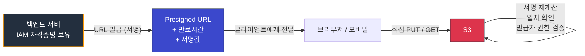
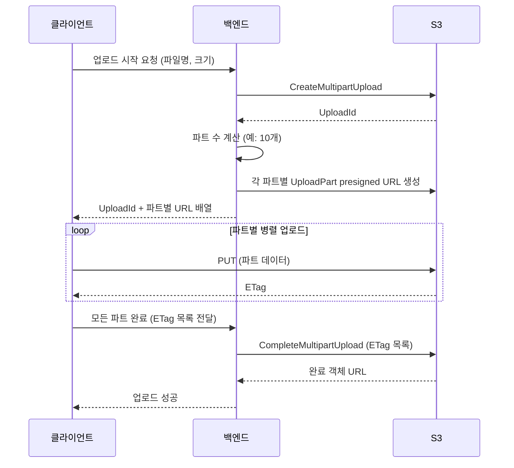

# S3 Presigned URL 심층 정리

S3 버킷을 처음 만들면 디폴트가 "퍼블릭 접근 차단"이다. 그런데 서비스 만들다 보면 사용자 브라우저에서 직접 S3에 파일을 올리거나 받게 해야 하는 상황이 계속 생긴다. 이미지 업로드, 첨부파일 다운로드, 대용량 영상 업로드 같은 경우다. 이때 백엔드 서버를 거치게 만들면 트래픽이 서버를 통과하면서 비용도 늘고 응답도 느려진다.

Presigned URL은 이 문제를 푸는 가장 표준적인 방법이다. 백엔드가 IAM 자격증명으로 서명한 임시 URL을 발급하고, 클라이언트는 그 URL로 S3와 직접 통신한다. 개념은 단순하지만 실제로 운영하면 만료 시간 설계, 헤더 강제, 권한 위임, 시그니처 미스매치 같은 함정이 끊임없이 나온다. 이 문서는 그 함정들을 다룬다.

---

## Presigned URL의 본질

### 무엇을 서명하는가

Presigned URL은 단순히 "이 사람은 이 객체에 접근해도 됨"이라고 적힌 토큰이 아니다. HTTP 요청 자체를 서명한 결과다. 메서드(GET/PUT/DELETE), 버킷, 객체 키, 쿼리스트링, 일부 헤더, 만료 시간을 모두 포함해서 HMAC-SHA256으로 서명을 만든다. 그래서 같은 객체에 대해 GET용 URL과 PUT용 URL은 서명이 다르고, 만료 시간이 1초만 달라도 서명이 다르다.

S3는 요청이 들어오면 URL에 포함된 정보로 똑같이 서명을 다시 계산해본다. 두 서명이 일치하면 통과시킨다. 그러니까 클라이언트가 URL에 적힌 메서드와 다른 메서드로 요청을 보내거나, 강제된 헤더를 빼먹으면 즉시 서명 불일치로 거부된다.

### 권한은 누가 주는가

흔히 오해하는 부분이다. Presigned URL을 만든다고 해서 새 권한이 생기는 게 아니다. URL을 서명한 주체(IAM 사용자, 역할, STS 세션)가 가진 권한을 임시로 위임하는 구조다. 백엔드 서버의 IAM 역할이 `s3:PutObject` 권한이 없으면, 그 서버가 만든 PUT presigned URL도 401이 떨어진다.

이게 중요한 이유는, Presigned URL을 만들었다고 항상 동작하는 게 아니라는 점이다. URL 자체는 만들어진다(SDK는 권한을 검증하지 않고 그냥 서명한다). 정작 사용자가 그 URL을 쓰는 순간에 가서야 S3가 권한을 확인한다. "어제는 됐는데 오늘 안 됨" 같은 신고가 들어오면 IAM 정책이 바뀌었는지 먼저 본다.

### 만료 시간

만료 시간은 URL 안에 `X-Amz-Expires` 쿼리 파라미터로 박혀 있다. Signature V4 기준 최대 7일이다. 단, 서명에 IAM 역할의 임시 자격증명(STS)을 사용하면 그 자격증명 자체의 만료 시간이 더 짧기 때문에 URL은 자격증명이 만료되는 순간 같이 죽는다. EC2 인스턴스 프로파일이나 ECS 태스크 역할로 발급한 URL이 "7일짜리로 만들었는데 1시간 만에 죽네?" 하는 케이스가 이거다.



---

## Presigned URL 만들기

### Python (boto3)

가장 흔히 쓰는 환경이다. GET용은 `get_object`, PUT용은 `put_object`를 인자로 넘긴다.

```python
import boto3
from botocore.config import Config

s3 = boto3.client(
    "s3",
    region_name="ap-northeast-2",
    config=Config(signature_version="s3v4"),
)

# 다운로드용 GET URL (10분)
get_url = s3.generate_presigned_url(
    ClientMethod="get_object",
    Params={
        "Bucket": "my-app-uploads",
        "Key": "user/123/profile.jpg",
    },
    ExpiresIn=600,
)

# 업로드용 PUT URL (5분, Content-Type 강제)
put_url = s3.generate_presigned_url(
    ClientMethod="put_object",
    Params={
        "Bucket": "my-app-uploads",
        "Key": "user/123/profile.jpg",
        "ContentType": "image/jpeg",
    },
    ExpiresIn=300,
)
```

여기서 `ContentType="image/jpeg"`를 넣으면 클라이언트가 PUT 할 때 반드시 `Content-Type: image/jpeg` 헤더를 보내야 한다. 빠뜨리면 서명이 안 맞는다. 처음 쓰면 헷갈리는 부분인데, 서버에서 강제한 헤더는 클라이언트가 일치시켜야만 통과한다.

`signature_version="s3v4"`를 명시한 이유는 일부 리전(서울 포함)에서 V2를 막아두기 때문이다. 명시 안 하면 SDK 버전에 따라 동작이 갈린다.

### Node.js (AWS SDK v3)

SDK v3은 클라이언트와 명령(Command)을 분리한다. URL 생성은 별도의 `getSignedUrl` 함수가 담당한다.

```javascript
import { S3Client, GetObjectCommand, PutObjectCommand } from "@aws-sdk/client-s3";
import { getSignedUrl } from "@aws-sdk/s3-request-presigner";

const s3 = new S3Client({ region: "ap-northeast-2" });

// GET URL
const getCmd = new GetObjectCommand({
  Bucket: "my-app-uploads",
  Key: "user/123/profile.jpg",
});
const getUrl = await getSignedUrl(s3, getCmd, { expiresIn: 600 });

// PUT URL + Content-Type 강제
const putCmd = new PutObjectCommand({
  Bucket: "my-app-uploads",
  Key: "user/123/profile.jpg",
  ContentType: "image/jpeg",
});
const putUrl = await getSignedUrl(s3, putCmd, { expiresIn: 300 });
```

브라우저에서 직접 이 URL로 fetch를 호출하면 된다. 주의할 점은 fetch의 `body`로 File 객체를 넘길 때 브라우저가 자동으로 `Content-Type`을 붙이는 경우가 있다는 것이다. 서명할 때 박은 값과 다르면 그대로 시그니처 미스매치다. 명시적으로 헤더를 지정해서 일치시켜야 한다.

```javascript
await fetch(putUrl, {
  method: "PUT",
  headers: { "Content-Type": "image/jpeg" },
  body: file,
});
```

### Java (AWS SDK v2)

Java SDK v2는 `S3Presigner`라는 전용 클래스가 있다.

```java
import software.amazon.awssdk.regions.Region;
import software.amazon.awssdk.services.s3.model.GetObjectRequest;
import software.amazon.awssdk.services.s3.model.PutObjectRequest;
import software.amazon.awssdk.services.s3.presigner.S3Presigner;
import software.amazon.awssdk.services.s3.presigner.model.GetObjectPresignRequest;
import software.amazon.awssdk.services.s3.presigner.model.PutObjectPresignRequest;

import java.time.Duration;

try (S3Presigner presigner = S3Presigner.builder()
        .region(Region.AP_NORTHEAST_2)
        .build()) {

    // GET URL
    GetObjectRequest getReq = GetObjectRequest.builder()
            .bucket("my-app-uploads")
            .key("user/123/profile.jpg")
            .build();

    String getUrl = presigner.presignGetObject(
            GetObjectPresignRequest.builder()
                    .signatureDuration(Duration.ofMinutes(10))
                    .getObjectRequest(getReq)
                    .build()
    ).url().toString();

    // PUT URL
    PutObjectRequest putReq = PutObjectRequest.builder()
            .bucket("my-app-uploads")
            .key("user/123/profile.jpg")
            .contentType("image/jpeg")
            .build();

    String putUrl = presigner.presignPutObject(
            PutObjectPresignRequest.builder()
                    .signatureDuration(Duration.ofMinutes(5))
                    .putObjectRequest(putReq)
                    .build()
    ).url().toString();
}
```

`S3Presigner`는 `Closeable`이라서 `try-with-resources`로 닫는 게 안전하다. 안 닫으면 내부 HTTP 클라이언트가 누수된다.

---

## 만료 시간 설계

만료 시간은 "짧을수록 안전, 길수록 편함" 사이의 트레이드오프다. 무조건 짧게 잡으면 안 되는 케이스가 몇 가지 있다.

### 일반 GET/PUT

다운로드 링크나 단일 파일 업로드는 보통 5~15분이면 충분하다. 사용자가 링크를 받고 클릭하기까지의 지연, 네트워크 끊김으로 인한 재시도까지 감안한 값이다. 1분 같이 너무 짧게 잡으면 모바일 환경에서 LTE↔Wi-Fi 전환만으로 만료된다.

### 멀티파트 업로드

수 GB짜리 파일을 파트로 쪼개서 올리는 경우다. 파트 하나당 따로 presigned URL을 만들고, 클라이언트가 병렬로 업로드한 뒤 마지막에 `CompleteMultipartUpload`를 호출한다. 이때 전체 업로드 시간이 길어질 수 있어서 URL을 1~6시간 정도로 잡는다.

여기서 함정: 파트별 URL 만료가 너무 짧으면 중간에 한 파트가 만료돼서 재업로드를 못 한다. 그렇다고 전부 24시간으로 두면 URL 유출 시 위험 노출 시간이 길어진다. 보통 "예상 업로드 시간 × 2" 정도로 잡는다.

### 이메일/메신저로 보내는 다운로드 링크

가장 위험한 케이스다. 받는 사람이 즉시 클릭한다는 보장이 없고, 메일/슬랙이 캐시되거나 미리보기 봇이 URL을 긁어가기도 한다. 이런 용도면 24시간 이상으로 잡지 말고, 차라리 만료 후 새 링크를 발급하는 API를 만드는 게 낫다.

### STS 임시 자격증명 만료의 트랩

앞서 언급한 EC2/ECS의 임시 자격증명 문제는 운영에서 자주 사고를 친다. ECS 태스크는 보통 6시간짜리 자격증명을 받는데, 그 자격증명으로 7일짜리 URL을 만들면 URL의 명시적 만료와 별개로 6시간 후에 죽는다. 백그라운드 잡으로 미리 발급해둔 다운로드 링크가 한꺼번에 죽는 사고가 이렇게 일어난다. 해결책은 두 가지다. 발급 직전 정도로 짧게 잡거나, 발급 시점에 IAM 사용자(액세스 키)로 서명하거나.

---

## Signature V2 vs V4

지금 새로 만들면 V4만 쓰면 된다. V2는 거의 모든 리전에서 끝났다고 보면 된다. 그래도 차이를 알아야 하는 이유는, 레거시 코드를 들여다보거나 옛날 라이브러리를 마이그레이션할 때 마주치기 때문이다.

| 항목 | V2 | V4 |
|------|-----|-----|
| 서명 알고리즘 | HMAC-SHA1 | HMAC-SHA256 |
| 서명 범위 | URL + 일부 헤더 | URL + 헤더 + 리전 + 서비스명 + 날짜 |
| 리전 지원 | 2014년 이전 리전만 | 모든 리전 |
| 최대 만료 시간 | 1주 (단, 일부 SDK는 제한) | 7일 |
| 시간 동기화 민감도 | 비교적 관대 | 5분 이내 일치 필요 |

V4는 리전을 서명에 포함시킨다. 그래서 서울 리전(`ap-northeast-2`)에서 만든 URL을 도쿄 엔드포인트로 보내면 서명이 안 맞는다. 클라이언트 SDK를 잘못 설정해서 다른 리전 엔드포인트로 요청이 가는 경우, 403이 나오는데 원인 추적이 어려워진다.

2020년 이후에 만들어진 리전(서울 포함)은 V2를 아예 받지 않는다. 옛날 라이브러리가 V2로 서명해서 보내면 무조건 거부된다.

---

## 헤더 강제 (Content-Type, Content-MD5)

### Content-Type

업로드 시 Content-Type을 서버 측에서 강제할 수 있다. 두 가지 의미가 있다.

첫째, 파일 종류를 제한할 수 있다. 이미지만 받는 엔드포인트라면 `image/jpeg`로 강제하고, 클라이언트가 다른 타입으로 보내면 막힌다. 단, 클라이언트가 헤더만 거짓말로 맞추면 통과하기 때문에 보안 수단으로는 약하다. 실제 검증은 업로드 후 Lambda 트리거에서 매직 넘버를 확인하는 식으로 해야 한다.

둘째, S3에 저장될 객체의 메타데이터로 박힌다. 나중에 `GetObject`로 받을 때 응답 헤더로 그대로 나간다. 이게 안 맞으면 브라우저가 잘못된 방식으로 처리한다. 이미지인데 `application/octet-stream`으로 저장되면 브라우저가 다운로드를 띄운다.

### Content-MD5

업로드 무결성을 보장하고 싶을 때 쓴다. 클라이언트가 파일의 MD5 해시를 계산해서 `Content-MD5` 헤더로 보내면, S3가 받은 데이터의 해시와 비교한다. 다르면 거부한다.

```python
import base64
import hashlib

with open("upload.bin", "rb") as f:
    data = f.read()
md5 = base64.b64encode(hashlib.md5(data).digest()).decode()

url = s3.generate_presigned_url(
    ClientMethod="put_object",
    Params={
        "Bucket": "my-bucket",
        "Key": "upload.bin",
        "ContentMD5": md5,
    },
    ExpiresIn=300,
)
```

MD5는 base64로 인코딩해야 한다. hex로 보내면 S3가 거부한다. 처음 다루면 거의 100% 한 번씩 틀리는 부분이다.

대용량 파일이면 MD5 계산 자체가 부담이라 멀티파트 업로드에서는 잘 안 쓴다. 멀티파트는 파트별 ETag(MD5 비슷한 값)로 무결성을 따로 관리한다.

---

## IAM 권한과 Presigned URL

### 권한 위임의 범위

URL을 만든 주체가 가진 권한을 그대로 위임한다고 했다. 더 정확히 말하면, "URL 사용 시점에 발급자의 권한이 여전히 유효한지" S3가 확인한다. 발급 시점이 아니라 사용 시점이 기준이다.

이게 운영에서 만드는 결과:

- 발급 시점에 IAM 역할이 `s3:PutObject`만 있어도, 사용 시점에 정책이 바뀌어서 권한이 빠지면 URL이 죽는다.
- SCP(Service Control Policy)로 버킷 접근이 막히면 URL이 만료 전이라도 거부된다.
- IAM 사용자가 비활성화되거나 액세스 키가 삭제되면 그 키로 만든 모든 URL이 즉시 죽는다.

이 점을 활용해서 "사고 났을 때 모든 Presigned URL을 한 번에 무효화"하고 싶으면, 전용 IAM 사용자를 만들어서 그 사용자만 URL 발급에 쓰고, 사고 시 액세스 키를 비활성화하는 패턴을 쓴다.

### 최소 권한

Presigned URL을 만들 때 자주 실수하는 게 "버킷 전체에 대해 *Object 권한을 줘버리는" 거다. 그러면 사용자가 발급받은 URL의 키만 알면 다른 사용자의 객체에도 동일 패턴으로 접근하려고 시도할 수 있다(서명이 다르니 실제로는 못 함). 하지만 IAM 정책 자체가 넓으면, 어플리케이션 버그로 다른 사용자 키를 지정해 URL을 만들 위험이 있다.

```json
{
  "Effect": "Allow",
  "Action": ["s3:PutObject", "s3:GetObject"],
  "Resource": "arn:aws:s3:::my-app-uploads/users/${aws:userid}/*"
}
```

이런 식으로 발급자 식별자가 키 prefix에 박히게 정책을 잠그는 패턴이 있긴 한데, 백엔드가 IAM 역할 하나로 모든 사용자 URL을 발급하는 구조에서는 `${aws:userid}`가 백엔드 역할 ID로 고정돼서 별 의미가 없다. 결국 애플리케이션 레벨에서 키 검증을 하는 게 정답이다.

```python
def make_upload_url(user_id: str, filename: str) -> str:
    if not user_id.isalnum():
        raise ValueError("invalid user_id")
    key = f"users/{user_id}/{filename}"
    return s3.generate_presigned_url(
        ClientMethod="put_object",
        Params={"Bucket": BUCKET, "Key": key},
        ExpiresIn=300,
    )
```

`user_id`를 검증 없이 URL 경로에 박으면 `../`나 다른 사용자 ID로 키를 조작당할 수 있다. 백엔드에서 한 번 막아야 한다.

---

## CORS 설정과의 상호작용

브라우저에서 직접 Presigned URL로 PUT을 쏠 때 가장 많이 겪는 문제가 CORS다. Presigned URL이 정상이어도 브라우저가 사전 요청(OPTIONS preflight)을 막아서 실제 PUT이 안 나간다.

S3 버킷에 CORS 규칙을 별도로 설정해야 한다.

```json
[
  {
    "AllowedOrigins": ["https://app.example.com"],
    "AllowedMethods": ["GET", "PUT", "POST", "HEAD"],
    "AllowedHeaders": ["*"],
    "ExposeHeaders": ["ETag", "x-amz-version-id"],
    "MaxAgeSeconds": 3000
  }
]
```

자주 빠뜨리는 항목:

- `AllowedMethods`에 PUT 빠짐. GET만 넣고 업로드가 안 된다고 헤맨다.
- `AllowedHeaders`에 `Content-Type`이 없음. 보통 `*`로 뚫어버리는 게 편하다.
- `ExposeHeaders`에 `ETag` 누락. 멀티파트 업로드는 ETag를 클라이언트가 읽어야 하는데, ExposeHeaders에 없으면 JS에서 못 읽는다.

CORS 에러는 보통 브라우저 콘솔에 명확히 찍히는데, 가끔 "Access to fetch ... has been blocked by CORS policy"만 뜨고 어떤 헤더가 문제인지 안 알려준다. 그럴 땐 응답 헤더를 직접 까서 `Access-Control-Allow-Origin`, `Access-Control-Allow-Headers`가 요청과 일치하는지 본다.

---

## 멀티파트 Presigned URL

5GB 이상이면 멀티파트 업로드가 필수다(단일 PUT은 5GB 제한). 그 이하라도 100MB 넘으면 멀티파트가 안정적이다. 멀티파트 자체는 S3의 표준 기능이고, 여기에 Presigned URL을 결합하는 방식은 다음 흐름이다.



파트별 URL을 만드는 코드는 다음과 같다.

```python
upload = s3.create_multipart_upload(Bucket=BUCKET, Key=key)
upload_id = upload["UploadId"]

# 파트별 URL 생성
part_urls = []
for part_number in range(1, total_parts + 1):
    url = s3.generate_presigned_url(
        ClientMethod="upload_part",
        Params={
            "Bucket": BUCKET,
            "Key": key,
            "UploadId": upload_id,
            "PartNumber": part_number,
        },
        ExpiresIn=3600,
    )
    part_urls.append(url)
```

주의할 점은 `CompleteMultipartUpload`는 보통 백엔드에서 직접 호출한다는 거다. 이 호출은 모든 파트의 ETag 목록을 받아서 S3에게 "이 파트들로 객체를 완성해라"라고 알린다. 클라이언트가 ETag만 백엔드로 보내고, 백엔드가 종결시키는 패턴이다.

`AbortMultipartUpload`도 잊지 말아야 한다. 사용자가 업로드 중에 창을 닫으면 파트가 S3에 남아서 비용이 발생한다. 라이프사이클 정책으로 "N일 지난 미완료 업로드는 자동 삭제"를 걸어두는 게 안전하다.

```json
{
  "Rules": [
    {
      "ID": "abort-incomplete-multipart",
      "Status": "Enabled",
      "AbortIncompleteMultipartUpload": { "DaysAfterInitiation": 7 }
    }
  ]
}
```

---

## CloudFront Signed URL과의 차이

이름이 비슷해서 혼동하기 쉬운데 용도가 다르다.

| 항목 | S3 Presigned URL | CloudFront Signed URL/Cookie |
|------|------------------|-----------------------------|
| 대상 | S3 객체 직접 접근 | CloudFront 배포(엣지) 경유 접근 |
| 서명 주체 | IAM 자격증명 | CloudFront Key Pair (별도 생성) |
| 캐싱 | 안 됨 (S3가 매번 인증) | 됨 (엣지 캐시 활용) |
| 조건 제어 | URL/메서드/만료 | URL/만료 + IP 범위 + 정책 JSON |
| 비용 | S3 요청 비용 | CloudFront 데이터 전송 비용 |
| HTTPS 강제 | 버킷 정책 별도 설정 | CloudFront에서 강제 |

언제 어느 걸 쓰나:

- 동영상 스트리밍, CDN 가속이 필요한 다운로드: CloudFront Signed URL. 만료된 사용자에게도 캐시된 콘텐츠를 빠르게 줄 수 있고, 글로벌 사용자에게 지연 시간이 짧다.
- 업로드 전반, 일회성 다운로드, 내부 API 간 객체 전달: S3 Presigned URL. 캐시가 의미 없고, 발급-사용이 빠르다.

CloudFront 뒤에 S3를 두고 Presigned URL을 발급하는 패턴은 잘 동작하지 않는다. CloudFront가 캐시 키에 쿼리스트링을 포함하지 않으면 첫 사용자의 응답이 다른 사용자에게도 캐시돼서 보안 사고가 난다. 캐시 키에 쿼리스트링을 포함시키면 매 URL마다 미스가 나서 CDN 의미가 없다. CloudFront 경유라면 CloudFront Signed URL을 써야 한다.

---

## 보안 사고 패턴

실제 경험과 보안 리포트에서 자주 나오는 사고 유형이다.

### URL 유출

가장 흔한 사고다. Presigned URL을 로그에 남기거나, 이메일/슬랙에 그대로 박거나, 클라이언트 JS에서 쿼리스트링이 그대로 노출되는 경우다. URL 안의 서명은 쿼리스트링이라서 로그·리퍼러·브라우저 히스토리에 그대로 남는다.

대응:

- 백엔드 로그에서 `X-Amz-Signature` 마스킹
- 만료 시간을 최대한 짧게(다운로드는 보통 5~10분)
- CloudFront 같은 중간 레이어를 두면 리퍼러 헤더가 외부로 안 나가게 막을 수 있다

### 만료 시간이 너무 김

"개발 편의상" 24시간으로 잡았다가 그대로 운영에 올라간 케이스를 정말 자주 본다. 사용자 한 명의 URL이 유출되면 24시간 동안 그 객체가 노출된다.

운영 룰: 다운로드 10분, 단일 PUT 5분, 멀티파트 1~2시간을 기본값으로 잡고, 예외가 필요할 때만 늘린다.

### IAM 권한이 너무 넓음

URL 발급용 IAM 역할에 `s3:*`이나 `s3:GetObject` 전체 버킷을 주는 경우다. 어플리케이션 버그로 다른 사용자 객체를 가리키는 URL을 만들 수 있다.

대응: 발급용 역할을 별도로 두고, 필요한 액션과 키 prefix로 좁힌다. 사용자별 prefix가 키 구조에 잡혀있으면 정책에서 패턴 매칭으로 잠근다.

### 검증 없는 키 입력

`key = f"users/{user_input}/{filename}"` 같이 사용자 입력을 그대로 키에 박는 경우. `user_input`이 `../admin`이면 다른 prefix로 빠져나간다. S3 키는 슬래시를 디렉토리로 처리하지 않지만, 정책의 prefix 매칭은 빠져나갈 수 있다.

대응: 사용자 입력은 정규식으로 검증하거나, 백엔드가 식별자(인증된 user_id 등)를 기반으로 키를 직접 만든다.

---

## 트러블슈팅

### 403 SignatureDoesNotMatch

가장 자주 보는 에러다. 원인은 거의 다음 중 하나다.

**1. 헤더 불일치.** 서명할 때 박은 헤더와 실제 요청 헤더가 다르면 무조건 떨어진다. 특히 `Content-Type`이 자주 문제다. fetch에서 File 객체를 body로 넘기면 브라우저가 자동으로 `multipart/form-data`를 붙이려고 하기도 한다. 명시적으로 헤더를 지정해야 한다.

**2. 호스트 스타일 vs 경로 스타일.** S3 엔드포인트는 두 가지 형태가 있다.

- 가상 호스트 스타일: `https://my-bucket.s3.ap-northeast-2.amazonaws.com/key`
- 경로 스타일: `https://s3.ap-northeast-2.amazonaws.com/my-bucket/key`

V4 서명에서 둘은 서명값이 다르다. SDK가 한 가지 스타일로 서명했는데 요청 시 다른 스타일로 보내면 미스매치다. 대부분 SDK 디폴트가 가상 호스트 스타일이라 문제는 없는데, 버킷 이름에 점(`.`)이 들어가면 HTTPS 인증서 와일드카드 매칭이 안 돼서 SDK가 자동으로 경로 스타일로 떨어진다. 이때 헷갈린다.

해결: 버킷 이름에 점을 쓰지 마라. 어쩔 수 없으면 SDK 설정에 `addressing_style="path"`를 명시한다.

**3. 리전 불일치.** V4는 리전이 서명에 포함된다. 클라이언트가 `s3.amazonaws.com`(글로벌 엔드포인트)로 보내면 us-east-1로 해석되는데, 서명은 ap-northeast-2 기준이면 미스매치다. SDK에 리전을 명시하고, URL의 호스트가 그 리전인지 확인한다.

**4. 시계 동기화.** V4는 요청 시각이 서명 생성 시각과 5분 이내여야 한다. 서버 시계가 NTP 동기화 안 돼서 어긋나면 그대로 깨진다.

```bash
# 서버 시간 확인
date -u
chronyc tracking  # 또는 timedatectl
```

오프셋이 몇 분 이상이면 NTP 설정을 확인한다. Docker 컨테이너에서 호스트 시간이 어긋나 있는 경우도 있다.

**5. 만료된 자격증명.** STS 세션이 만료된 자격증명으로 만든 URL은 만료 시간과 무관하게 죽는다. 임시 자격증명을 캐시해서 쓰는 코드에서 자주 발생한다.

**6. 특수 문자.** 키에 공백, `+`, `&`, 한글이 있으면 URL 인코딩이 SDK와 다른 곳에서 다르게 되는 경우가 있다. SDK가 만들어준 URL을 절대 수정하지 마라. 직접 인코딩을 다시 하면 거의 깨진다.

### 디버깅 순서

403이 떨어지면 다음 순서로 본다.

1. 응답 본문(XML)에서 에러 코드 확인. `SignatureDoesNotMatch`인지 `AccessDenied`인지로 갈린다. `AccessDenied`면 IAM 권한 문제다.
2. URL을 그대로 `curl`로 쏴본다. 브라우저 문제인지 URL 자체 문제인지 갈린다.
3. 서명할 때 박은 헤더 목록 확인. SDK 디버그 로그를 켜면 서명에 포함된 헤더가 다 찍힌다 (boto3는 `logging.getLogger('botocore').setLevel(logging.DEBUG)`).
4. 클라이언트가 보낸 실제 헤더와 비교. 브라우저 개발자도구의 Network 탭에서 본다.
5. 한 글자라도 다른 게 있으면 그게 원인이다.

### 100 Continue 관련 문제

대용량 PUT을 보낼 때 일부 HTTP 클라이언트가 `Expect: 100-continue` 헤더를 자동으로 붙인다. S3는 이걸 정상 처리하지만, 중간 프록시가 잘못 처리해서 응답이 꼬이는 경우가 있다. 업로드는 잘 됐는데 클라이언트가 응답을 못 받는 식이다. 헤더를 명시적으로 빼버리면 해결되는 경우가 많다.

### 객체는 올라갔는데 ETag가 다름

서버 측 암호화(SSE-KMS)가 켜진 버킷에서 멀티파트 업로드를 하면 파트별 ETag가 일반 MD5와 다르다. 클라이언트가 자체 계산한 MD5와 ETag를 비교하는 검증 로직은 SSE-KMS 환경에서 무조건 깨진다. ETag 비교 대신 객체 메타데이터에 SHA256을 따로 저장하거나, S3 Object Lambda로 검증하는 방식으로 우회한다.

---

## 운영 시 정리

- 새로 만들면 무조건 V4. 리전 명시.
- 만료 시간 디폴트: 다운로드 5~10분, 단일 PUT 5분, 멀티파트 1~2시간.
- Content-Type은 서명 시 박고 클라이언트가 일치시키게 강제.
- 발급용 IAM 역할은 별도로, 키 prefix와 액션 최소화.
- CORS는 버킷 단위로 별도 설정. AllowedMethods·ExposeHeaders 빠뜨리지 않게.
- 라이프사이클로 미완료 멀티파트 자동 정리(7일).
- 로그에서 `X-Amz-Signature`는 마스킹.
- 403이 나면 헤더, 리전, 시계, 버킷 이름의 점 여부를 차례로 본다.
