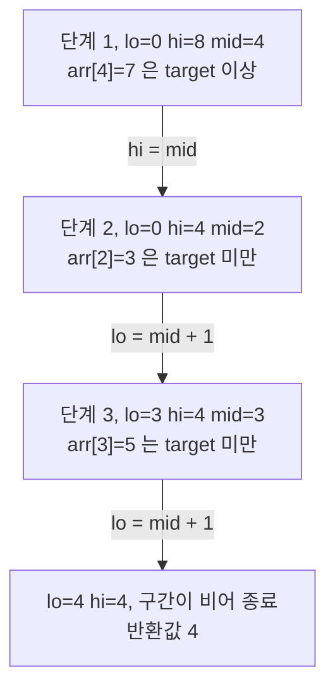
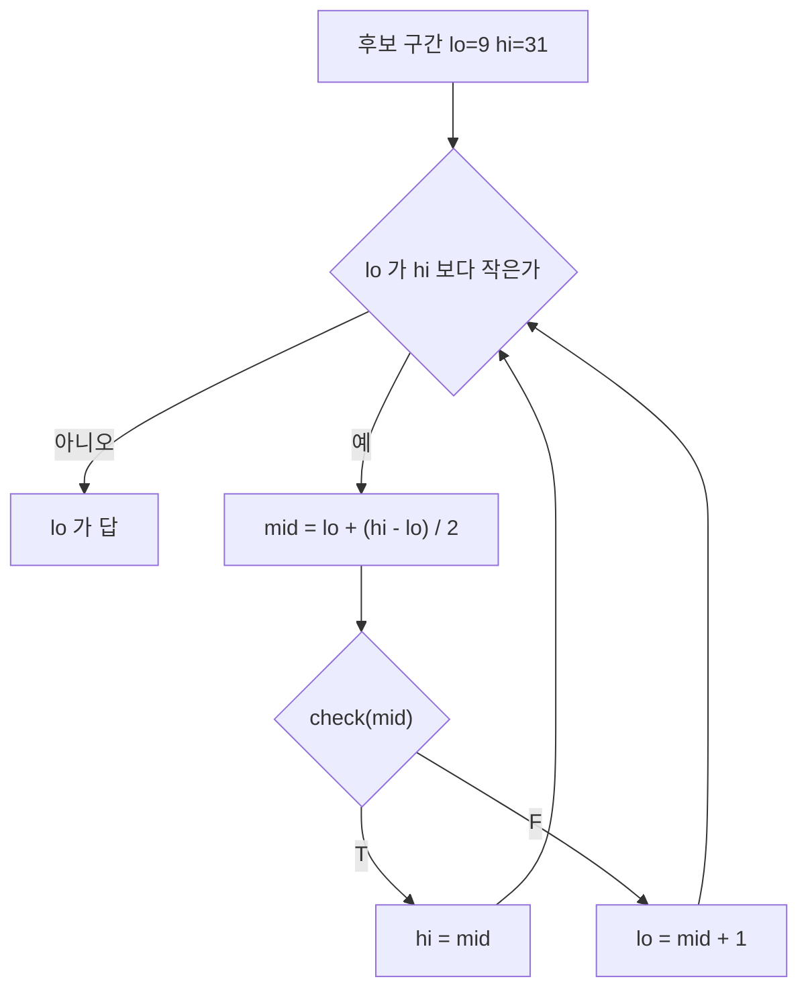
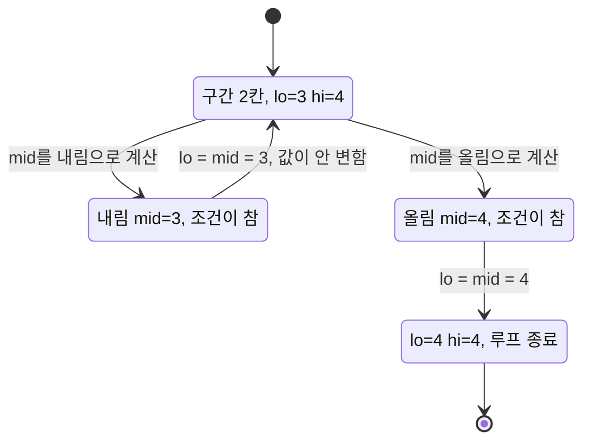
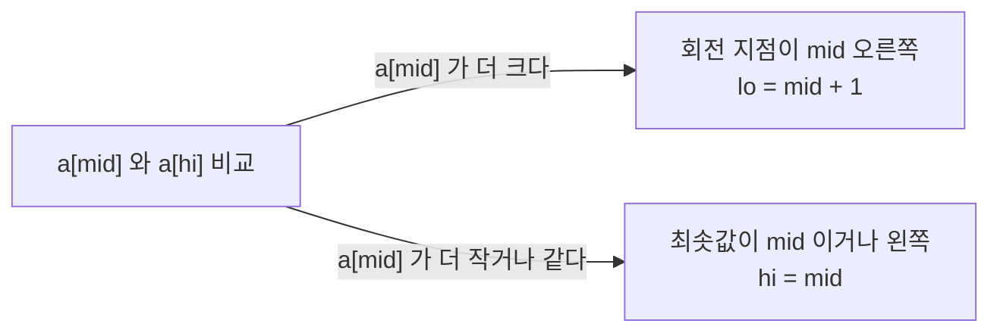
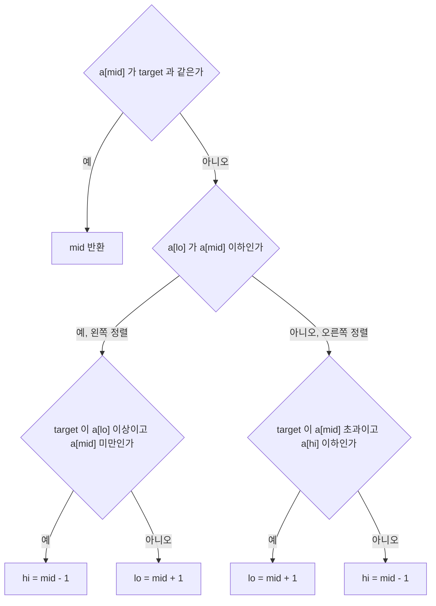
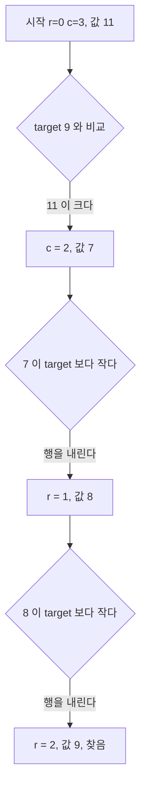
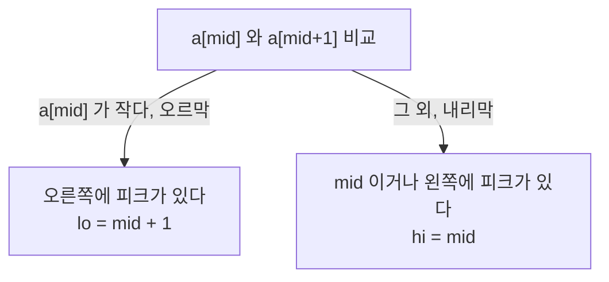

# Binary Search (이진 탐색)

## 들어가며

이진 탐색은 코드가 열 줄 남짓인데 손으로 쓰면 한 번은 경계에서 틀리는 알고리즘이다. 경계 조건 한 글자를 잘못 써서 무한 루프에 빠지거나, 답이 바로 옆 칸에 있는데 놓치는 일은 이 알고리즘을 써 본 사람이면 대부분 겪는다. 코딩테스트에서도, 실무 DB 쿼리 튜닝에서도, 자료구조 내부 구현에서도 계속 나온다.

이진 탐색의 본질은 "단조성"에 있다. 어떤 조건을 기준으로 true/false가 한 번만 바뀌는 구조라면 O(log N)으로 경계를 찾을 수 있다. 정렬된 배열에서 값 찾기는 이 개념의 가장 단순한 형태일 뿐이고, 실제로 쓸모 있는 이진 탐색은 대부분 파라메트릭 서치 쪽이다. "최소값을 찾아라, 단 조건을 만족해야 한다" 같은 문제에서 조건 판정 함수만 잘 만들면 답이 나온다.

## 기본 원리

### 단조성이 전부다

정렬되어 있다는 건 사실 핵심이 아니다. 핵심은 "어떤 경계 mid를 기준으로 왼쪽과 오른쪽이 다른 성질을 가진다"는 거다. 정렬된 배열에서 `arr[i] >= target`을 만족하는 최소 i를 찾는다고 해보자. i가 커질수록 `arr[i] >= target`은 false→true로 한 번만 바뀐다. 이 전환점이 이진 탐색이 찾는 답이다.

이 관점으로 보면 "정렬된 배열에서 값 찾기"는 `arr[i] == target`이라는 특수한 조건의 이진 탐색일 뿐이다. 더 일반적인 문제로 가면 조건 함수 `check(x)`가 `x`에 대해 단조(monotonic)면 이진 탐색이 성립한다.

```
인덱스:  0  1  2  3  4  5  6  7
arr:    [1, 3, 3, 5, 7, 7, 9, 9]
target = 7

check(i) = (arr[i] >= 7) = [F, F, F, F, T, T, T, T]
                                        ↑
                                    경계 = 4
```

### 반복 횟수

N개 원소에서 이진 탐색은 최대 `⌈log₂(N+1)⌉`번 비교한다. N이 10억이어도 30번 정도면 끝난다. 실무에서 이게 의미있는 건 디스크 I/O나 네트워크 호출처럼 한 번이 비싼 연산에서 O(N)과 O(log N)의 차이가 체감될 때다. 메모리 배열에서 단순 정수 비교라면 캐시 효율 때문에 오히려 작은 N에서는 선형 탐색이 빠른 경우도 있다.

## 기본 이진 탐색 구현

정확히 일치하는 값을 찾는 가장 단순한 형태다. 이것부터 실수 없이 쓸 수 있어야 한다.

```java
public int binarySearch(int[] arr, int target) {
    int lo = 0;
    int hi = arr.length - 1;

    while (lo <= hi) {
        int mid = lo + (hi - lo) / 2;

        if (arr[mid] == target) {
            return mid;
        } else if (arr[mid] < target) {
            lo = mid + 1;
        } else {
            hi = mid - 1;
        }
    }
    return -1;
}
```

여기서 자주 실수하는 지점이 세 군데다.

첫 번째, `mid = (lo + hi) / 2`로 쓰면 `lo + hi`가 int 범위를 넘어서 오버플로우가 난다. Java에서 `Integer.MAX_VALUE` 근처 인덱스를 다룰 일은 드물지만, C++에서 long long 배열 인덱스를 다룰 때는 자주 터진다. `lo + (hi - lo) / 2`로 쓰는 습관을 들여야 한다.

두 번째, `while (lo <= hi)`인지 `while (lo < hi)`인지는 구현 스타일에 따라 다르다. 위 코드처럼 `lo <= hi`면 탐색 범위가 빈 구간([lo > hi])이 될 때까지 돈다. `lo < hi`로 쓰는 스타일은 lower_bound 계열에서 주로 사용한다. 둘을 섞어 쓰면 무조건 버그가 난다.

세 번째, 값을 못 찾았을 때 반환값을 어떻게 할지. -1 반환이 흔하지만, 삽입 위치를 반환해야 하는 문제도 있다. Java의 `Arrays.binarySearch`는 `-(insertion_point) - 1`을 반환한다. 실무에서 Collections.binarySearch 결과 처리할 때 이 규칙 때문에 당한 적이 있다.

## lower_bound와 upper_bound

실전에서 "정확히 같은 값 찾기"보다 훨씬 자주 쓰는 게 lower_bound와 upper_bound다. 중복값이 있는 배열에서 범위 질의를 할 때 거의 무조건 이 두 함수를 쓴다.

### 정의

- **lower_bound(target)**: `arr[i] >= target`을 만족하는 최소 i
- **upper_bound(target)**: `arr[i] > target`을 만족하는 최소 i

두 함수의 차이는 등호 하나뿐이다. `upper_bound - lower_bound`가 target의 개수다. 이 성질 때문에 정렬된 배열에서 특정 값의 개수를 O(log N)에 구할 수 있다.

### 구현

```java
// arr[i] >= target을 만족하는 최소 i (없으면 arr.length)
public int lowerBound(int[] arr, int target) {
    int lo = 0;
    int hi = arr.length;

    while (lo < hi) {
        int mid = lo + (hi - lo) / 2;
        if (arr[mid] < target) {
            lo = mid + 1;
        } else {
            hi = mid;
        }
    }
    return lo;
}

// arr[i] > target을 만족하는 최소 i
public int upperBound(int[] arr, int target) {
    int lo = 0;
    int hi = arr.length;

    while (lo < hi) {
        int mid = lo + (hi - lo) / 2;
        if (arr[mid] <= target) {
            lo = mid + 1;
        } else {
            hi = mid;
        }
    }
    return lo;
}
```

기본 이진 탐색과 다른 점이 몇 가지 있다.

hi의 초기값이 `arr.length`지 `arr.length - 1`이 아니다. 답이 "배열 끝 바로 다음"일 수 있기 때문이다. target이 배열의 모든 원소보다 크면 lower_bound는 `arr.length`를 반환해야 한다.

루프 조건이 `lo < hi`고, 분기에서 `hi = mid`(mid - 1이 아님)로 줄인다. 이게 경계를 찾는 이진 탐색의 전형적인 패턴이다. "조건을 만족하지 않는 가장 오른쪽"과 "조건을 만족하는 가장 왼쪽" 사이를 계속 좁혀가는 방식이다.

### lo, hi, mid가 수렴하는 과정

크기 8 배열 `[1, 3, 3, 5, 7, 7, 9, 9]`에서 `lowerBound(arr, 7)`을 돌린 기록이다. 구간은 `[lo, hi)` 반열린 구간이고, 매 단계의 분기가 어느 쪽으로 갈라지는지를 따라가 보면 된다.



구간 크기가 8, 4, 1, 0으로 줄었다. 단계 2에서는 `arr[2]=3`이 target 미만이라 `lo = 3`으로 건너뛰어 4칸이 한 번에 1칸이 됐다. 절반씩만 줄어드는 게 아니라 분기 방향에 따라 더 크게 줄 수 있다. 비교는 3번이었고 `log2(8) = 3`과 같다.

target이 배열의 모든 원소보다 큰 10이면 같은 코드가 `lo=0 hi=8 mid=4`, `lo=5 hi=8 mid=6`, `lo=7 hi=8 mid=7`을 거쳐 `lo=8`을 반환한다. 매번 `lo = mid + 1` 쪽으로만 가서 `lo`가 `hi`에 붙는 경우고, 반환값 8은 유효한 인덱스가 아니라 "끝 바로 다음"이다. 호출하는 쪽에서 `arr[result]`를 바로 읽으면 여기서 예외가 난다.

### 두 함수가 가리키는 위치

중복이 있는 `[1, 2, 2, 2, 3]`에서 target 2를 넣었을 때 두 함수가 돌려주는 인덱스를 배열 위에 그리면 다음과 같다.

```text
인덱스:         0    1    2    3    4    5(끝)
arr:          [ 1 ][ 2 ][ 2 ][ 2 ][ 3 ]
                   ^              ^
        lower_bound(2) = 1   upper_bound(2) = 4

개수 = upper_bound - lower_bound = 4 - 1 = 3
```

두 함수는 원소가 아니라 원소 사이의 틈을 가리킨다고 보면 헷갈리지 않는다. lower_bound는 2가 시작되는 틈 앞, upper_bound는 2가 끝나는 틈 뒤다. 파이썬 `bisect_left(a, 2)`와 `bisect_right(a, 2)`로 돌리면 각각 1과 4가 나오고, 2가 없는 값에서는 두 함수가 같은 인덱스를 반환해 차이가 0이 된다. 같은 배열에서 target 0이면 `bisect_left`가 0, target 3이면 `bisect_right`가 5, target 4이면 `bisect_left`가 5다.

### 사용 예

정렬된 배열에서 값의 개수 세기.

```java
int[] arr = {1, 3, 3, 3, 5, 7, 7, 9};
int count = upperBound(arr, 3) - lowerBound(arr, 3);  // 3
```

범위 [a, b] 안의 원소 개수.

```java
int countInRange = upperBound(arr, b) - lowerBound(arr, a);
```

Java 표준 라이브러리에는 lower_bound/upper_bound가 직접 없고, `Arrays.binarySearch`는 동일한 값이 여러 개일 때 그중 아무거나 반환한다. 중복이 있는 배열에서 정확한 경계를 찾으려면 위 구현을 직접 써야 한다.

## 파라메트릭 서치 (Parametric Search)

이진 탐색의 진짜 활용은 여기서부터 시작한다. 파라메트릭 서치는 "최적화 문제를 결정 문제로 변환해서 이진 탐색을 돌리는" 기법이다.

### 기본 발상

최적화 문제는 보통 "X의 최솟값을 구하라" 또는 "Y의 최댓값을 구하라" 형태다. 이걸 바로 풀기 어려울 때, "X가 k일 때 조건을 만족하는가?"라는 결정 문제(decision problem)로 바꾼다. 이 결정 문제의 답이 k에 대해 단조라면 이진 탐색으로 답을 찾을 수 있다.

예를 들어 "N개의 나무를 잘라서 M미터 이상 얻으려면 절단기 높이의 최댓값은?"이라는 문제가 있다고 하자. 절단기 높이 H가 커질수록 얻는 나무 양은 단조감소한다. "H일 때 M미터 이상 얻을 수 있는가?"를 판정할 수 있으면, H에 대해 이진 탐색으로 최댓값을 찾을 수 있다.

### 전형적인 구현

```java
// 답의 범위 [lo, hi]에서 조건을 만족하는 최댓값을 찾는다
public long parametricSearch(long lo, long hi) {
    long answer = lo;

    while (lo <= hi) {
        long mid = lo + (hi - lo) / 2;

        if (check(mid)) {           // mid가 조건을 만족하면
            answer = mid;           // 답 후보로 저장
            lo = mid + 1;           // 더 큰 값 시도
        } else {
            hi = mid - 1;           // 조건을 만족 못 하면 작은 값으로
        }
    }
    return answer;
}

private boolean check(long x) {
    // x가 조건을 만족하는지 판정. 문제마다 다름
    return false;
}
```

이 틀을 머리에 넣어두면 파라메트릭 서치 문제의 절반은 풀린다. 나머지 절반은 `check` 함수를 어떻게 설계할지와 답의 범위를 어떻게 잡을지다.

### 설계 포인트

**check 함수의 시간 복잡도가 전체 복잡도를 결정한다.** 이진 탐색은 O(log R) 번만 호출되므로(R은 답의 범위), check가 O(N)이면 전체가 O(N log R)이다. check를 O(N²)으로 짜면 `log R`을 아무리 줄여도 의미가 없다.

**단조성 검증을 먼저 해야 한다.** 문제를 읽고 "답이 k일 때 가능하면 k+1일 때도 가능한가?" 또는 "k일 때 불가능하면 k-1일 때도 불가능한가?" 를 확인한다. 이게 안 되면 파라메트릭 서치가 아예 성립하지 않는다.

**답의 범위는 여유 있게 잡는다.** 상한이 애매하면 실제 최댓값보다 조금 더 크게 잡는다. 10^9 수준이면 10^10까지 잡아도 log 차이는 10번 정도밖에 안 늘어난다. 하한을 0으로 할지 1로 할지, -1로 할지도 문제마다 다르다.

### 예제: 랜선 자르기 (백준 1654)

K개의 랜선이 있고, 이걸 잘라서 길이가 같은 N개 이상의 랜선을 만들어야 한다. 랜선 하나의 최대 길이는?

```java
public long maxLanLength(int[] lines, int n) {
    long lo = 1;
    long hi = 0;
    for (int len : lines) hi = Math.max(hi, len);

    long answer = 0;
    while (lo <= hi) {
        long mid = lo + (hi - lo) / 2;
        long count = 0;
        for (int len : lines) count += len / mid;

        if (count >= n) {
            answer = mid;
            lo = mid + 1;
        } else {
            hi = mid - 1;
        }
    }
    return answer;
}
```

여기서 check는 "mid 길이로 자르면 n개 이상 나오는가"다. mid가 커지면 count는 단조감소한다. 그래서 `count >= n`을 만족하는 mid의 최댓값이 답이다.

### 최솟값을 찾는 변형과 판정 흐름

위 두 예제는 "만족하는 최댓값"이라 check 결과가 T에서 F로 넘어간다. 반대로 "만족하는 최솟값"을 찾는 문제는 F에서 T로 넘어가고, 구현은 lower_bound와 같은 `[lo, hi]` 모양을 쓴다. 화물 `[3, 1, 4, 1, 5, 9, 2, 6]`을 순서대로 3일 안에 나르려면 하루 적재 용량의 최솟값은 얼마인가 하는 문제로 돌려 봤다. `check(c)`는 용량 c로 필요한 일수가 3일 이하인지 묻는다.

```text
c        : 9  10  11  12  13  14  15
check(c) : F   F   F   F   F   T   T
                               ^
                           전환점 = 답 14
```

범위는 `lo = max(w) = 9`, `hi = sum(w) = 31`이다. 가장 무거운 화물보다 작은 용량은 처음부터 불가능하고, 전부 한 번에 싣는 용량이면 항상 가능하기 때문이다.

```python
def days(c):
    d, cur = 1, 0
    for x in w:
        if cur + x > c:
            d += 1
            cur = 0
        cur += x
    return d

lo, hi = max(w), sum(w)
while lo < hi:
    mid = lo + (hi - lo) // 2
    if days(mid) <= 3:
        hi = mid          # T면 mid도 답 후보라 버리지 않는다
    else:
        lo = mid + 1      # F면 mid는 확실히 아니다
print(lo)  # 14
```

판정 흐름은 아래 flowchart의 루프다. T가 나오면 `hi = mid`, F가 나오면 `lo = mid + 1`로 가기 때문에 전환점이 항상 `[lo, hi]` 안에 남는다.



실제 호출 기록은 `mid=20`(2일, T)에서 `hi=20`, `mid=14`(3일, T)에서 `hi=14`, `mid=11`(4일, F)에서 `lo=12`, `mid=13`(4일, F)에서 `lo=14`이고 `lo == hi`가 되어 14를 반환한다. 후보가 23개였는데 check는 4번 호출됐다.

T일 때 `answer = mid`를 따로 저장하는 앞의 `lo <= hi` 스타일과, 여기처럼 `hi = mid`로 두고 `lo`를 답으로 읽는 스타일은 섞어 쓰면 안 된다. 앞의 스타일은 루프가 끝난 뒤 `lo`가 `hi + 1`이라 `lo`를 읽으면 한 칸 틀린다.

## 실수 이진 탐색

답이 실수일 때는 정수 이진 탐색과 다르게 접근해야 한다. `lo <= hi` 같은 정수 조건을 그대로 쓸 수 없다.

### 반복 횟수 고정

가장 안전한 방법은 루프 횟수를 고정하는 거다. 100번 돌리면 범위가 2^100분의 1로 줄어든다. 웬만한 정밀도는 다 맞는다.

```java
public double realBinarySearch(double lo, double hi) {
    for (int i = 0; i < 100; i++) {
        double mid = (lo + hi) / 2;

        if (check(mid)) {
            lo = mid;    // 또는 hi = mid (문제에 따라)
        } else {
            hi = mid;
        }
    }
    return lo;
}
```

`while (hi - lo > eps)` 같은 조건은 권장하지 않는다. eps를 너무 작게 잡으면 부동소수점 오차 때문에 무한 루프가 돌고, 너무 크게 잡으면 정밀도가 부족하다. 고정 반복이 훨씬 안전하다.

### 부동소수점 함정

실수 이진 탐색에서 가장 골치 아픈 건 출력 형식이다. 문제에서 "소수점 아래 6자리까지 출력"을 요구하면 `%.6f`로 출력해야 하는데, 내부 계산에서 부동소수점 오차가 누적되어 `0.999999`가 나올 수 있다. 이럴 때 반올림 방식이 문제된다.

또 `check` 함수 안에서 실수 비교할 때 `a == b`는 절대 쓰면 안 된다. `Math.abs(a - b) < eps`로 비교해야 한다. eps는 보통 1e-9를 쓰지만 문제에 따라 다르다.

### 삼분 탐색과의 구분

실수 이진 탐색은 단조 함수에만 쓸 수 있다. 볼록 함수(아래로 볼록한 함수)의 최솟값을 찾는 문제는 삼분 탐색(ternary search)을 써야 한다. "이진 탐색으로 될 것 같은데 안 되네?" 싶으면 함수 모양이 단조가 아닌 볼록일 가능성을 의심해봐야 한다.

## 경계 조건 실수 패턴

이진 탐색에서 버그가 나는 지점은 거의 정해져 있다. 패턴을 알아두면 디버깅이 훨씬 빠르다.

### 무한 루프

`while (lo < hi)`에서 `lo = mid`로 줄이면 `hi - lo == 1`일 때 `mid`가 내림으로 계산돼 `mid == lo`가 되고, 갱신해도 `lo`가 그대로라 루프가 안 끝난다. 이진 탐색 코드를 짤 때 `lo`는 반드시 `mid + 1`로, `hi`는 `mid` 또는 `mid - 1`로 줄여야 한다. 또는 반대로 `hi`는 `mid - 1`로, `lo`는 `mid`로 두되 `mid = lo + (hi - lo + 1) / 2`처럼 mid를 위쪽으로 치우치게 계산한다.

전형적인 무한 루프 패턴.

```java
while (lo < hi) {
    int mid = lo + (hi - lo) / 2;
    if (check(mid)) {
        lo = mid;       // 버그. lo == hi - 1일 때 mid == lo로 수렴
    } else {
        hi = mid - 1;
    }
}
```

이 경우 mid를 `lo + (hi - lo + 1) / 2`로 바꾸면 해결된다. "lo를 mid로 두는 이진 탐색은 mid를 위쪽으로" 하고 외우면 편하다.

위 코드에서 `lo=3, hi=4`로 들어온 상황을 상태로 그리면 다음과 같다. 왼쪽 자기 루프가 멈추지 않는 경로고, 오른쪽이 mid를 올림해서 빠져나오는 경로다.



`lo = 3, hi = 4`를 그대로 돌려 5번 찍어 보면 매번 `lo=3 hi=4 mid=3`이 나온다. 구간이 2칸이 되기 전까지는 정상적으로 줄어들기 때문에, 조건이 참으로 끝나는 입력에서만 시간 초과로 드러난다.

### off-by-one

답이 경계에 있을 때 한 칸 차이로 못 찾는 버그다. lower_bound를 써야 할 자리에 upper_bound를 쓰거나, `arr.length - 1`과 `arr.length`를 혼동하거나, 답 반환 후 `answer - 1`을 반환할지 `answer`를 반환할지 헷갈릴 때 발생한다.

디버깅 방법은 원시적이지만 확실하다. 크기 1, 2, 3짜리 입력을 직접 넣어보고 손으로 추적한다. 배열에 원소가 하나만 있을 때, 찾는 값이 배열 맨 앞 또는 맨 뒤일 때, 찾는 값이 배열에 아예 없을 때 이 네 케이스를 꼭 테스트한다.

### 오버플로우

`mid = (lo + hi) / 2`에서 lo + hi가 오버플로우되는 건 앞에서 언급했다. 파라메트릭 서치에서 답의 범위가 10^18 수준으로 커지면 long을 써도 더하기에서 터질 수 있다. `lo + (hi - lo) / 2` 관용구를 습관화해야 한다.

다른 오버플로우 패턴. check 함수 안에서 누적합을 구할 때 int로 시작했다가 터지는 경우. 중간 계산이 int 범위를 넘어설 것 같으면 처음부터 long으로 선언한다.

### 단조성 착각

가장 무서운 버그다. 문제가 이진 탐색으로 풀릴 것 같아서 풀었는데 사실 단조가 아닌 경우. 예제는 맞는데 히든 케이스에서 틀린다. 이럴 때는 다음을 의심한다.

- 답이 커지면 조건이 느슨해지는가 엄격해지는가, 일관되게 한 방향인가
- 특정 값에서 뒤집히는 경우는 없는가 (포함 관계가 꼬일 때)
- check 함수가 결정적인가, 같은 입력에 다른 결과를 내지 않는가

단조성이 의심되면 브루트포스로 작은 케이스를 전부 돌려서 답이 k에 대해 어떻게 변하는지 찍어보는 게 확실하다.

## 디버깅 팁

이진 탐색 버그를 잡을 때 쓰는 방법들이다.

**로그를 찍는다.** `lo, hi, mid, check(mid)` 값을 매 반복마다 출력한다. 진행이 이상하면 바로 보인다. 한 번에 `lo > hi`가 되면 답을 못 찾고 탈출하는 거고, `lo`와 `hi`가 계속 같은 값이면 무한 루프다.

**손으로 추적한다.** 크기 3~5짜리 테스트 케이스를 직접 돌린다. `lo = 0, hi = 4`에서 시작해서 mid 계산, 분기 결정, 갱신을 종이에 써본다. 귀찮아 보여도 이게 가장 빠르다.

**표준 라이브러리와 비교한다.** Java의 `Arrays.binarySearch`, C++의 `lower_bound`/`upper_bound`, Python의 `bisect` 모듈을 기준으로 삼아 답을 대조한다. 정렬된 배열에서 값 찾기라면 표준 라이브러리가 훨씬 안전하다.

**이진 탐색 범위를 넓게 잡는다.** 처음부터 딱 맞는 범위를 잡으려고 하면 경계 실수가 나기 쉽다. 일단 확실히 답이 들어 있는 범위를 잡고, 나중에 최적화한다.

## 회전된 정렬 배열

정렬된 배열을 어느 지점에서 잘라 앞뒤를 바꿔 붙인 `[4, 5, 6, 7, 0, 1, 2]` 같은 배열이다. 전체로는 단조가 아니지만 mid를 잡으면 `[lo, mid]`와 `[mid, hi]` 중 적어도 한쪽은 반드시 정렬 상태다. 회전 지점은 한 곳뿐이라 두 구간 모두에 걸칠 수 없기 때문이다. 이 배열을 이진 탐색으로 다루는 문제는 "어느 쪽이 정렬돼 있는가"를 판별하는 기준 하나로 정리된다.

### 최솟값 찾기

최솟값은 회전 지점 바로 오른쪽에 있다. 비교 기준은 `a[lo]`가 아니라 `a[hi]`로 잡는다. `a[lo]`와 비교하면 회전하지 않은 `[1, 2, 3, 4, 5]`에서 `a[mid] >= a[lo]`가 참인데 최솟값은 왼쪽 끝에 있어서, 따로 예외 처리가 필요해진다. `a[hi]`는 구간의 마지막 값이라 mid가 이보다 크면 회전 지점이 mid와 hi 사이에 있다는 게 곧바로 나온다.



`[4, 5, 6, 7, 0, 1, 2]`를 이 규칙으로 돌린 기록이다.

```text
단계  lo  hi  mid  a[mid]  a[hi]  분기
1     0   6   3    7       2      7 > 2 이므로 lo = 4
2     4   6   5    1       2      1 <= 2 이므로 hi = 5
3     4   5   4    0       1      0 <= 1 이므로 hi = 4
lo == hi == 4, 최솟값 a[4] = 0
```

```python
def rotated_min(a):
    lo, hi = 0, len(a) - 1
    while lo < hi:
        mid = lo + (hi - lo) // 2
        if a[mid] > a[hi]:
            lo = mid + 1
        else:
            hi = mid
    return lo
```

`hi = mid`로 두는 이유는 `a[mid]`가 최솟값일 수 있기 때문이다. 여기서 `hi = mid - 1`로 쓰면 정답을 지나쳐 버린다.

### target 찾기

최솟값을 먼저 찾아 두 구간으로 나눈 뒤 각각 탐색하는 방법도 있다. 한 번에 끝내려면 mid에서 정렬된 쪽을 판별하고, target이 그 정렬된 구간 안에 들어가는지 검사한다.



```python
def rotated_search(a, t):
    lo, hi = 0, len(a) - 1
    while lo <= hi:
        mid = (lo + hi) // 2
        if a[mid] == t:
            return mid
        if a[lo] <= a[mid]:
            if a[lo] <= t < a[mid]:
                hi = mid - 1
            else:
                lo = mid + 1
        else:
            if a[mid] < t <= a[hi]:
                lo = mid + 1
            else:
                hi = mid - 1
    return -1
```

`[4, 5, 6, 7, 0, 1, 2]`에서 target 0, 4, 2, 3, 7을 넣으면 인덱스 4, 0, 6, -1, 3이 나온다. 원소 수 1~12개에 중복 없는 무작위 배열 2만 개를 회전시켜 `in` 연산과 대조했을 때 어긋난 경우는 없었다. `a[lo] <= a[mid]`의 등호는 구간이 한 칸일 때(`lo == mid`) 왼쪽을 정렬 상태로 보내기 위한 것이라 빼면 안 된다.

### 중복이 있으면 O(log N)이 깨진다

원소가 같은 값이 섞이면 위 판별 기준이 무너진다. `a[lo] == a[mid] == a[hi]`이면 어느 쪽이 정렬 구간인지 알 수 없다. `[1, 1, 1, 0, 1]`에서 `a[mid] > a[hi]`가 거짓이면 `hi = mid`로 보내는 기존 규칙을 쓰면 인덱스 0을 반환하는데, 실제 최솟값 0은 인덱스 3에 있다.

같은 값이면 판별할 수 없으니 `hi`를 한 칸 줄이는 방법밖에 없다. 버려지는 `a[hi]`와 같은 값이 `a[mid]`에 남아 있어서 최솟값을 잃지는 않는다.

```python
def rotated_min_dup(a):
    lo, hi = 0, len(a) - 1
    while lo < hi:
        mid = lo + (hi - lo) // 2
        if a[mid] > a[hi]:
            lo = mid + 1
        elif a[mid] < a[hi]:
            hi = mid
        else:
            hi -= 1
    return lo
```

문제는 이 `hi -= 1` 분기가 반복되는 입력이다. `[1, 0, 1, 1, ..., 1]` 모양, 즉 최솟값 0이 왼쪽 끝 근처에 있고 나머지가 전부 1인 배열에서는 mid가 계속 `a[hi]`와 같은 값을 만나 한 칸씩만 줄어든다. 비교 횟수를 센 결과다.

| 배열 크기 | 중복 없음 | 중복 처리 규칙, 위 모양 |
|---|---|---|
| 16 | 4 | 14 |
| 1,024 | 10 | 1,022 |
| 65,536 | 16 | 65,534 |

중복이 없으면 `log2 N`이고, 이 모양에서는 `N - 2`다. 최악 O(N)이라서 이진 탐색을 쓰는 의미가 없어진다. 문제에서 중복을 허용한다고 하면 평균은 빠르지만 입력 보장은 못 한다고 봐야 한다. 같은 이유로 target 탐색에서도 `a[lo] == a[mid] == a[hi]`일 때 `lo += 1; hi -= 1`로 양쪽을 한 칸씩 줄이는 분기를 넣어야 하고, 같은 방식으로 최악 O(N)이 된다. 값 범위를 0~3으로 줄인 무작위 배열 2만 개로 최솟값과 존재 여부를 `min`, `in`과 대조해 이 처리가 맞는 것은 확인했다.

## 2차원 정렬 행렬

행렬이 어떻게 정렬돼 있느냐에 따라 푸는 방법이 갈린다.

행을 이어 붙였을 때 전체가 정렬되는 경우(각 행의 첫 값이 이전 행의 마지막 값보다 큰 경우)는 `m x n`을 길이 `m*n`의 1차원 배열로 보고 그대로 이진 탐색한다. 인덱스 `mid`는 `(mid // n, mid % n)`으로 환산한다. `[[1,3,5,7],[10,11,16,20],[23,30,34,60]]`에서 16은 `(1, 2)`에서 나오고 13은 없다.

행과 열이 각각 정렬만 돼 있는 경우는 사정이 다르다. 행 끝과 다음 행 시작의 대소 관계가 보장되지 않아 1차원으로 펼 수 없다. 오른쪽 위 모서리에서 시작해 값이 target보다 크면 왼쪽, 작으면 아래로 가는 방법이 표준이다.

```text
 1   4   7  11
 2   5   8  12
 3   6   9  16
10  13  14  17
```



위 행렬에서 9는 `(2, 2)`에서 4번의 비교로 찾고, 없는 15는 5번 비교한 뒤 범위를 벗어나 종료한다. 한 번에 행 하나나 열 하나가 지워지므로 최대 `m + n`번이고 구간이 절반으로 줄지는 않는다. 이건 이진 탐색이 아니라 단조성을 두 축에서 번갈아 쓰는 탐색이다. 행마다 이진 탐색을 돌리면 `O(m log n)`이라 한쪽이 극단적으로 작을 때는 그쪽이 낫다.

## 피크 원소, 단조성이 기울기인 경우

`[1, 3, 2, 5, 6, 4, 2]`에서 피크(양옆보다 큰 원소)를 찾는 문제는 값이 정렬돼 있지 않은데도 이진 탐색이 된다. 단조인 것은 값이 아니라 기울기의 부호다. `a[mid] < a[mid+1]`이면 오르막이므로 오른쪽 어딘가에 피크가 있다. 오르막이 끝나지 않고 배열 끝까지 가도 마지막 원소가 피크가 되기 때문이다. 반대쪽도 마찬가지다.



```python
def find_peak(a):
    lo, hi = 0, len(a) - 1
    while lo < hi:
        mid = (lo + hi) // 2
        if a[mid] < a[mid + 1]:
            lo = mid + 1
        else:
            hi = mid
    return lo
```

위 배열에서는 `(lo, hi, mid)`가 `(0, 6, 3)`, `(4, 6, 5)`, `(4, 5, 4)`로 가서 인덱스 4(값 6)를 반환한다. 인접한 값이 다른 배열 2만 개를 무작위로 만들어 반환 인덱스가 실제로 양옆보다 큰지 검사했다.

주의할 점이 두 가지다. 첫째, 인접한 값이 같으면 기울기가 정의되지 않는다. `[1, 2, 2, 3]`을 넣으면 인덱스 1을 반환하는데 `a[2]`와 같고 오른쪽에 더 큰 값이 있어서 피크가 아니다. 둘째, 반환되는 것은 피크 중 하나일 뿐 최댓값이 아니다. `[9, 1, 9, 0, 7, 4, 8]`에서는 인덱스 6(값 8)이 나오고 최댓값 9는 지나친다. 문제가 "전체 최댓값"을 요구하는지 "피크 아무거나"를 요구하는지 먼저 확인해야 한다.

## 실무에서의 이진 탐색

코딩테스트 밖에서도 이진 탐색은 계속 나온다. 어디서 쓰이는지 알아두면 개념이 정착된다.

**DB 인덱스.** B-tree 기반 인덱스에서 특정 키를 찾을 때 내부적으로 이진 탐색이 일어난다. 정렬되어 있고 단조라는 조건이 맞기 때문이다. `EXPLAIN`에서 인덱스 스캔이 찍히면 내부에서 O(log N) 탐색이 돈다.

**깃 bisect.** `git bisect`는 커밋 히스토리에서 버그를 일으킨 커밋을 이진 탐색으로 찾는다. "이 커밋에서 버그가 있는가"가 시간에 대해 단조라는 가정이 깔려 있다. 커밋 수가 1000개여도 10번 정도 테스트하면 찾는다. 실무에서 디버깅에 엄청 유용하다.

**API 레이트 리밋 테스트.** 어느 정도의 요청량까지 서버가 버티는지 찾을 때 이진 탐색을 쓴다. RPS 100은 되고 1000은 안 된다면 이진 탐색으로 한계점을 찾아나간다.

**정렬된 데이터 구조 탐색.** TreeMap, TreeSet 같은 자료구조는 내부적으로 이진 탐색을 한다. `ceilingKey`, `floorKey`, `higherKey`, `lowerKey` 같은 메서드가 lower_bound/upper_bound와 같은 개념이다.

### Python bisect와 Java TreeMap 대응

정렬된 리스트에 대한 `bisect`와 `TreeMap`의 탐색 메서드는 같은 질문에 다른 이름을 붙인 것이다. `a = [10, 20, 30, 40]`에 대해 실제로 돌린 결과와 함께 정리했다.

| TreeMap | 조건 | bisect로 쓰면 | q=5 | q=20 | q=25 | q=45 |
|---|---|---|---|---|---|---|
| `ceilingKey(q)` | q 이상 중 최소 | `a[bisect_left(a, q)]` | 10 | 20 | 30 | null |
| `higherKey(q)` | q 초과 중 최소 | `a[bisect_right(a, q)]` | 10 | 30 | 30 | null |
| `floorKey(q)` | q 이하 중 최대 | `a[bisect_right(a, q) - 1]` | null | 20 | 20 | 40 |
| `lowerKey(q)` | q 미만 중 최대 | `a[bisect_left(a, q) - 1]` | null | 10 | 20 | 40 |

`bisect_left`가 lower_bound, `bisect_right`가 upper_bound다. TreeMap의 null에 해당하는 경계 밖 처리를 파이썬에서는 직접 해야 한다. `a[bisect_right(a, 5) - 1]`은 인덱스가 -1이 돼서 예외 없이 `a[-1]`, 즉 40을 돌려주고 floorKey가 null이어야 하는 자리에서 틀린 값이 나온다. 인덱스가 0 미만이거나 `len(a)` 이상인지 먼저 검사해야 한다.

Java의 `Arrays.binarySearch`는 이 표에 들어가지 않는다. 같은 배열에서 20을 찾으면 1을, 없는 25, 5, 45는 각각 -3, -1, -5를 반환한다. 삽입 위치는 `-(반환값) - 1`로 복원하며 25는 2, 5는 0, 45는 4로 `bisect_left` 결과와 같다. 중복이 있는 `[1, 2, 2, 2, 3]`에서 2를 찾으면 인덱스 2, 즉 가운데를 반환하므로 첫 번째나 마지막이 보장되지 않는다.

파이썬 3.10부터 `bisect_left`, `bisect_right`에 `key` 인자가 생겼다. 레코드 리스트를 한 필드로 탐색할 때 별도 키 리스트를 만들 필요가 없다.

```python
from bisect import bisect_left, bisect_right

rows = [("a", 10), ("b", 20), ("c", 20), ("d", 35)]
bisect_left(rows, 20, key=lambda r: r[1])    # 1
bisect_right(rows, 20, key=lambda r: r[1])   # 3
```

`key`는 리스트의 원소에만 적용되고 찾는 값 `x`에는 적용되지 않는다. 위 호출에서 20 대신 `("z", 20)`을 넘기면 `int`와 `tuple`을 비교하다가 `TypeError`가 난다. `insort`는 반대로 `x`에도 `key`를 적용하므로 둘의 동작이 다르다는 점을 알고 써야 한다.

## 마무리

이진 탐색은 단순해 보이지만 제대로 쓰려면 여러 변형을 익혀야 한다. 기본 구현에서 멈추지 말고 lower_bound, upper_bound, 파라메트릭 서치까지 손에 익혀야 실전에서 써먹을 수 있다. 특히 파라메트릭 서치는 알고리즘 문제 풀이에서 빈도 높은 주제고, check 함수를 설계하는 감각이 생기면 난이도가 훅 올라가는 문제도 풀 수 있게 된다.

경계 조건 실수는 연습으로만 줄어든다. 새 이진 탐색 코드를 짤 때마다 크기 1, 2짜리 입력을 먼저 돌려 보면 디버깅 시간이 크게 줄어든다.
