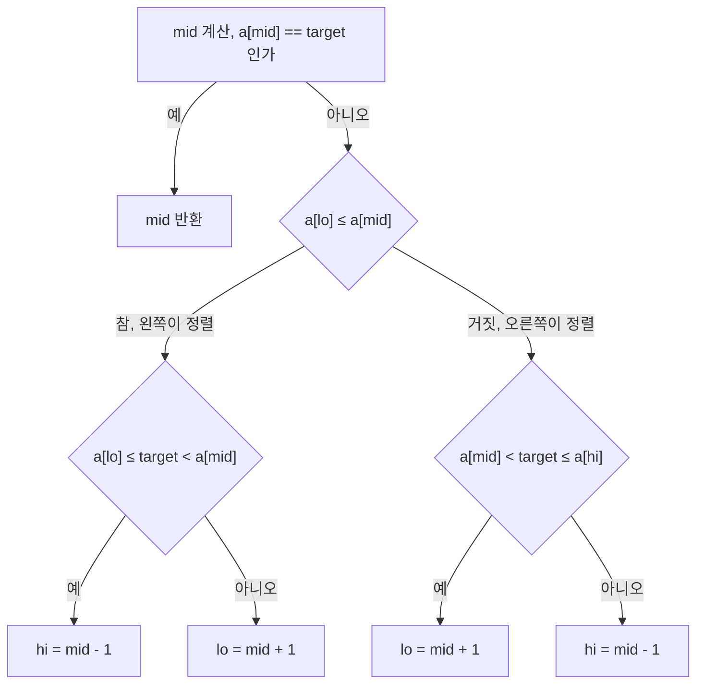
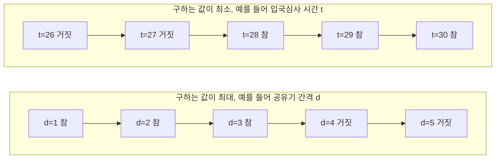
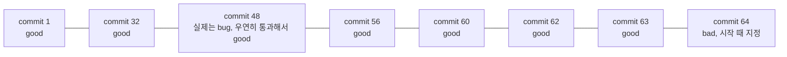
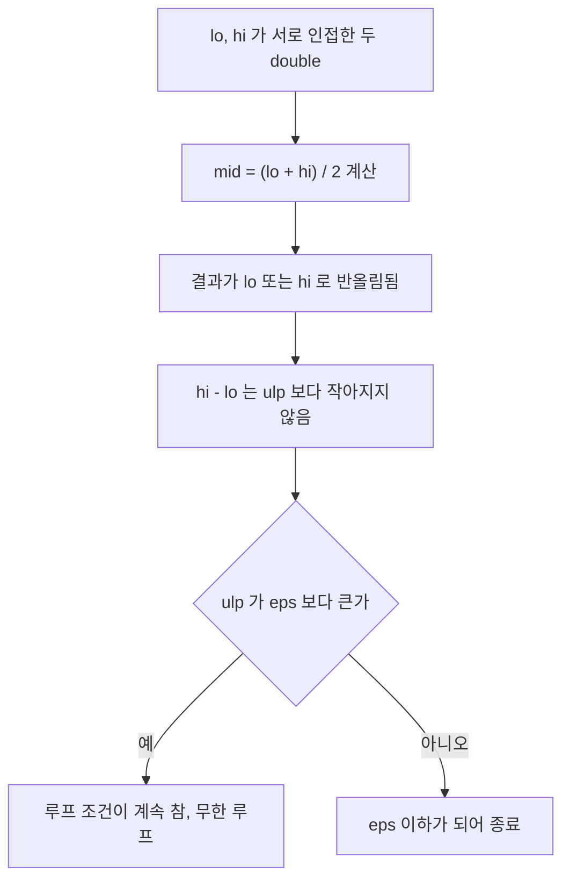

# Binary Search 패턴

[Binary Search](Binary_Search.md)에서 기본 구현, lower_bound/upper_bound, 파라메트릭 서치의 골격, 경계 실수를 다뤘다. 이 문서는 그 위에서 자주 마주치는 변형만 모았다. 회전 배열, 판정 방향이 뒤집히는 파라메트릭 문제, 정렬과 묶어 쓰는 풀이, 이진 탐색이 코드 밖에서 쓰이는 경우, 그리고 통과는 하는데 답이 틀리는 지점이다.

본문의 코드는 전부 `/tmp`에서 실제로 돌려 출력을 확인했다. 무작위 입력을 브루트포스와 대조한 경우에는 케이스 수를 적었다.

## 회전 정렬 배열

`[4, 5, 6, 7, 0, 1, 2]`처럼 정렬된 배열을 한 지점에서 잘라 앞뒤를 바꿔 붙인 배열이다. 전체는 단조가 아니지만 `[lo, mid]`와 `[mid, hi]` 중 한쪽은 항상 정렬돼 있다. 회전점이 한 곳뿐이라 두 구간에 동시에 걸칠 수 없어서다. 두 가지 풀이가 있고, 어느 쪽을 쓸지는 회전점 자체가 필요한지로 갈린다.

### 한 번에 target을 찾는 분기

회전점이 필요 없고 target의 위치만 알면 되는 경우다. mid를 잡고 어느 쪽이 정렬 상태인지 먼저 보고, 정렬된 쪽에 target이 들어가는지 확인한다.



분기가 두 단계라는 점을 보면 된다. 첫 단계는 정렬된 쪽을 고르고, 둘째 단계는 target이 그 정렬된 쪽의 범위 안인지 묻는다. 범위 밖이면 반대쪽으로 넘어간다. 부등호에서 한쪽 끝만 등호가 붙는 이유는 `a[mid] == target`을 이미 위에서 걸렀기 때문이다.

```python
def search(a, target):
    lo, hi = 0, len(a) - 1
    while lo <= hi:
        mid = (lo + hi) // 2
        if a[mid] == target:
            return mid
        if a[lo] <= a[mid]:                    # 왼쪽이 정렬
            if a[lo] <= target < a[mid]:
                hi = mid - 1
            else:
                lo = mid + 1
        else:                                  # 오른쪽이 정렬
            if a[mid] < target <= a[hi]:
                lo = mid + 1
            else:
                hi = mid - 1
    return -1
```

원소가 서로 다른 길이 1~8 배열을 모든 회전 위치와 target 후보(배열 밖 값 포함) 756가지로 돌려 `list.index` 결과와 비교했고, 불일치는 0건이었다.

### 회전점을 먼저 찾고 인덱스를 되돌리는 방식

회전점이 필요하거나, 같은 배열에 target 질의가 여러 번 들어오는 경우다. 최솟값의 위치 `k`를 한 번 구하면 이후 질의는 `(i + k) % n`으로 인덱스를 되돌려 평범한 이진 탐색을 한다.

```python
def find_min(a):
    lo, hi = 0, len(a) - 1
    while lo < hi:
        mid = (lo + hi) // 2
        if a[mid] > a[hi]:
            lo = mid + 1     # 회전점은 mid 오른쪽
        else:
            hi = mid         # mid 가 최솟값이거나 그 왼쪽
    return lo
```

`[4, 5, 6, 7, 0, 1, 2]`에서 실행하면 `(lo, hi, mid)`가 `(0,6,3)` → `(4,6,5)` → `(4,5,4)`로 움직이고 인덱스 4(값 0)에서 끝난다. 비교 대상을 `a[lo]`가 아니라 `a[hi]`로 잡은 것이 요점이다. 회전하지 않은 배열에서도 별도 예외 처리 없이 같은 코드로 맞는다.

### 중복이 있으면 hi를 한 칸씩 줄여야 한다

`a[mid] == a[hi]`이면 회전점이 어느 쪽에 있는지 알 수 없다. `[1, 1, 1, 0, 1]`에서 `find_min`을 그대로 쓰면 인덱스 0을 돌려주는데 정답은 3이다. 이때는 `hi -= 1`로 한 칸만 버린다.

```python
def find_min_dup(a):
    lo, hi = 0, len(a) - 1
    while lo < hi:
        mid = (lo + hi) // 2
        if a[mid] > a[hi]:
            lo = mid + 1
        elif a[mid] < a[hi]:
            hi = mid
        else:
            hi -= 1
    return lo
```

값이 0~3인 길이 1~9 중복 배열 20,000개를 무작위로 만들어 대조했다. 중복을 처리하지 않은 버전은 168건 틀렸고, 가장 짧은 반례는 `[3, 3, 1, 3]`이었다. `hi -= 1` 버전은 0건이었다. 한 번에 target을 찾는 버전도 같은 입력(target은 0~3 무작위)에서 23건 틀렸다. 중복 때문에 `a[lo] <= a[mid]`만으로는 왼쪽이 정렬됐는지 판단할 수 없어서다.

대가는 시간 복잡도다. 원소 n개 중 가운데 하나만 0이고 나머지가 전부 1인 배열에서 `hi -= 1`이 도는 횟수를 세면 n=1,024에서 520, n=65,536에서 32,782였다. 거의 n/2에 가깝다. 중복을 허용하는 순간 이 문제는 O(log N)이 아니라 최악 O(N)이다. 입력에 중복이 들어올 수 있는지 문제 조건을 먼저 확인해야 하는 이유다.

## 답에 대한 이진 탐색, 판정 방향이 갈리는 유형

파라메트릭 서치의 골격은 기본 문서에 있다. 실전에서 틀리는 곳은 골격이 아니라 `check(x)`가 x가 커질 때 참에서 거짓으로 가는지, 거짓에서 참으로 가는지 잘못 잡는 데 있다. 방향이 정해지면 mid를 올림으로 잡을지, `hi = mid`인지 `lo = mid`인지가 자동으로 정해진다.

### 참 구간이 앞에 오는 경우와 뒤에 오는 경우



위쪽은 조건을 만족하는 값 중 가장 큰 값을 찾는다. 참이 앞에 몰려 있으니 마지막 참을 찾아야 하고, 이때는 `lo = mid`, mid는 올림이다. 아래쪽은 가장 작은 참을 찾는다. 참이 뒤에 몰려 있으니 첫 참을 찾아야 하고, `hi = mid`에 mid는 내림이다. 숫자는 뒤에서 실제로 돌린 공유기 설치(`[1, 2, 8, 4, 9]`, 3대 설치, 답 3)와 입국심사(6명, `[7, 10]`, 답 28)의 경계다.

### 유형별 check 비교

| 문제 | 구하는 값 | check(x)가 묻는 것 | x가 커지면 | 탐색 | 갱신 |
|---|---|---|---|---|---|
| 공유기 설치 | 최소 거리의 최대 | 간격 x 이상으로 C대 이상 놓을 수 있는가 | 참에서 거짓 | 마지막 참 | 참이면 `lo = mid` |
| 예산 배정 | 상한액의 최대 | 상한을 x로 잘랐을 때 총합이 M 이하인가 | 참에서 거짓 | 마지막 참 | 참이면 `lo = mid` |
| 징검다리 | 최소 거리의 최대 | 간격 x 미만 바위를 치워서 제거 수가 n 이하인가 | 참에서 거짓 | 마지막 참 | 참이면 `lo = mid` |
| 입국심사 | 걸리는 시간의 최소 | x분 안에 n명 이상 처리하는가 | 거짓에서 참 | 첫 참 | 참이면 `hi = mid` |

처음 세 개는 "최대"를 묻고 마지막 하나는 "최소"를 묻는다. 문제 이름에 "최소 거리의 최대"처럼 최소와 최대가 같이 나와서 헷갈리는데, 바깥쪽 단어가 탐색 대상이다. 안쪽 단어는 check 안에서 이미 처리된다. check를 쓰기 전에 x를 키웠을 때 판정이 쉬워지는지 어려워지는지만 따지면 방향은 저절로 나온다. 공유기 간격을 키우면 놓을 수 있는 대수가 줄어드니 어려워진다. 심사 시간을 키우면 처리 인원이 늘어 쉬워진다.

### 네 문제의 구현

네 문제를 같은 틀로 쓰면 check 한 줄과 갱신 방향만 달라진다.

```python
def router(xs, c):                       # 공유기 설치
    xs = sorted(xs)
    def ok(d):
        cnt, last = 1, xs[0]
        for x in xs[1:]:
            if x - last >= d:
                cnt += 1
                last = x
        return cnt >= c
    lo, hi = 1, xs[-1] - xs[0]
    while lo < hi:
        mid = (lo + hi + 1) // 2         # 올림
        if ok(mid): lo = mid
        else:       hi = mid - 1
    return lo

def budget(req, m):                      # 예산 배정
    if sum(req) <= m:
        return max(req)
    lo, hi = 0, max(req)
    while lo < hi:
        mid = (lo + hi + 1) // 2
        if sum(min(r, mid) for r in req) <= m: lo = mid
        else:                                  hi = mid - 1
    return lo

def bridge(dist, rocks, n):              # 징검다리
    rocks = sorted(rocks) + [dist]
    def ok(d):
        removed, prev = 0, 0
        for r in rocks:
            if r - prev < d: removed += 1
            else:            prev = r
        return removed <= n
    lo, hi = 1, dist
    while lo < hi:
        mid = (lo + hi + 1) // 2
        if ok(mid): lo = mid
        else:       hi = mid - 1
    return lo

def immigration(n, times):               # 입국심사
    lo, hi = 1, min(times) * n
    while lo < hi:
        mid = (lo + hi) // 2             # 내림
        if sum(mid // t for t in times) >= n: hi = mid
        else:                                 lo = mid + 1
    return lo
```

예제 출력은 `router([1,2,8,4,9], 3) = 3`, `budget([120,110,140,150], 485) = 127`, `bridge(25, [2,14,11,21,17], 2) = 4`, `immigration(6, [7,10]) = 28`이다. 각각 작은 무작위 입력 500개씩을 완전탐색과 비교했고 네 함수 모두 불일치 0건이었다. 완전탐색은 공유기·징검다리는 조합 열거, 예산·입국심사는 x를 하나씩 올리는 방식이다.

`lo = mid` 계열에서 mid를 내림으로 두면 `lo = 2, hi = 3`에서 `mid = 2`가 나와 `lo`가 그대로라 영원히 돈다. 올림이 필요한 이유는 이 한 줄이다. 입국심사의 상한을 `min(times) * n`으로 잡은 것도 의미가 있다. 가장 빠른 심사관 한 명이 혼자 다 처리하는 시간이 항상 답의 상한이다. `max(times) * n`으로 잡아도 맞지만 범위가 커지고, 뒤에서 보듯 오버플로우를 밟을 확률도 올라간다.

## 정렬과 이진 탐색을 묶는 풀이

### LIS를 O(N log N)에 풀 때 tails 배열

`tails[i]`는 길이 i+1짜리 증가 부분 수열의 끝값 중 가장 작은 값이다. 새 원소 x가 오면 `bisect_left(tails, x)`로 들어갈 자리를 찾아 끝에 붙이거나 덮어쓴다. tails는 항상 오름차순이라 이진 탐색이 성립한다. 길이가 늘어나는 경우는 x가 tails의 모든 값보다 클 때뿐이다.

```mermaid
flowchart LR
    S0["시작<br/>tails = 빈 배열"] -->|"10, 위치 0, 추가"| S1["10"]
    S1 -->|"20, 위치 1, 추가"| S2["10, 20"]
    S2 -->|"5, 위치 0, 10을 덮어씀"| S3["5, 20"]
    S3 -->|"25, 위치 2, 추가"| S4["5, 20, 25"]
    S4 -->|"15, 위치 1, 20을 덮어씀"| S5["5, 15, 25"]
    S5 -->|"30, 위치 3, 추가"| S6["5, 15, 25, 30"]
    S6 -->|"12, 위치 1, 15를 덮어씀"| S7["5, 12, 25, 30"]
    S7 -->|"18, 위치 2, 25를 덮어씀"| S8["5, 12, 18, 30"]
```



입력은 `[10, 20, 5, 25, 15, 30, 12, 18]`이고 결과 길이는 4다. 도식의 화살표 라벨이 "위치"와 "추가/덮어씀"을 같이 보여준다. 덮어쓰기는 같은 길이를 더 작은 끝값으로 만들어 뒤에 올 원소가 붙기 쉽게 하는 동작이다.

```python
from bisect import bisect_left

def lis_len(a):
    tails = []
    for x in a:
        i = bisect_left(tails, x)
        if i == len(tails):
            tails.append(x)
        else:
            tails[i] = x
    return len(tails)
```

여기서 자주 하는 오해가 두 가지 있다. 하나는 마지막 tails가 LIS 자체라는 생각이다. 위 입력의 최종 `[5, 12, 18, 30]`은 원본에서 5(인덱스 2), 12(인덱스 6), 18(인덱스 7), 30(인덱스 5) 순서라 부분 수열이 아니다. 길이만 맞다. 수열을 복원하려면 각 원소가 들어간 위치와 직전 원소를 따로 기록해야 한다.

다른 하나는 비교 함수다. 순증가(같은 값 불허)는 `bisect_left`, 비감소(같은 값 허용)는 `bisect_right`다. `[1, 2, 2, 3, 2]`에서 `bisect_left`는 3, `bisect_right`는 4를 낸다. 문제가 "증가"인데 `bisect_right`를 쓰면 4가 나와 틀린다. 길이 0~11, 값 1~15인 무작위 배열 2,000개를 O(N²) DP와 비교했을 때 `bisect_left` 버전은 불일치 0건이었다.

### 정렬해 두고 구간 안의 개수 세기

정렬된 배열에서 값이 `[l, r]`에 드는 원소의 개수는 `bisect_right(xs, r) - bisect_left(xs, l)`이다. 위쪽 경계는 upper_bound, 아래쪽 경계는 lower_bound를 쓴다. 이 둘을 바꿔 쓰면 같은 값이 여러 개일 때 개수가 어긋난다.

```python
from bisect import bisect_left, bisect_right

def count_in(xs, l, r):                  # xs 는 정렬됨
    return bisect_right(xs, r) - bisect_left(xs, l)

xs = [1, 3, 3, 5, 7, 7, 7, 9, 12]
count_in(xs, 3, 7)    # 6
count_in(xs, 4, 6)    # 1
count_in(xs, 8, 8)    # 0
count_in(xs, 0, 100)  # 9
```

한 걸음 더 나가면 "합이 L 이상 R 이하인 쌍의 수" 같은 문제가 된다. 정렬한 뒤 각 원소 v마다 자기보다 뒤쪽에서 `[L - v, R - v]` 범위의 개수를 세면 된다.

```python
def pairs_in_range(arr, L, R):
    arr = sorted(arr)
    total = 0
    for i, v in enumerate(arr):
        lo = bisect_left(arr, L - v, i + 1)    # i 뒤쪽에서만 센다
        hi = bisect_right(arr, R - v, i + 1)
        total += hi - lo
    return total
```

검색 시작 위치를 `i + 1`로 주는 것이 쌍의 중복과 자기 자신과의 짝을 동시에 막는다. 길이 0~12, 값 0~20인 무작위 배열 1,000개를 `itertools.combinations` 완전탐색과 비교해 불일치 0건이었다. 전체 O(N log N)이고, N² 쌍을 직접 세던 풀이가 N=10만에서 막히는 자리에 쓴다.

## 이진 탐색이 코드 밖에서 쓰이는 경우

### git bisect 실행 로그

`git bisect`는 커밋 순서가 곧 정렬된 배열이고, "이 커밋에서 테스트가 깨지는가"가 판정 함수인 이진 탐색이다. 64개 커밋짜리 저장소를 만들고 41번째 커밋부터 `bug.flag`를 1로 바꿔 두었다. 테스트는 `bug.flag`가 0이면 통과하는 스크립트다.

```bash
git bisect start HEAD <commit 1>
git bisect run sh test_det.sh
```

`git bisect log`로 본 탐색 경로는 이렇다.

```
# bad: commit 64
# good: commit 1
# good: commit 32
# bad: commit 48
# good: commit 40
# bad: commit 44
# bad: commit 42
# bad: commit 41
# first 'bad' commit: commit 41
```

양 끝을 빼고 62개 커밋 중 6번 테스트로 끝났다. 매번 중간 커밋을 고르니 구조는 기본 이진 탐색과 같다. 커밋 순서대로 판정이 좋음에서 나쁨으로 한 번만 바뀌어야 한다는 조건이 여기서도 전부다.

### 플래키 테스트가 틀린 커밋을 지목하는 경로

테스트가 가끔 실패하는 경우를 흉내 냈다. 버그가 있는 커밋(41 이후)에서 테스트가 30% 확률로만 실패하고, 버그가 없는 커밋에서는 항상 통과한다. 난수는 시드를 고정해 재현했다. 같은 저장소에서 시드를 열 가지로 바꿔 `git bisect run`을 돌렸다.

| 테스트 스크립트 | 지목된 커밋 (시드 10개) | 정답 41과 일치 |
|---|---|---|
| 1회 실행 | 64, 62, 48, 63, 64, 55, 61, 64, 48, 55 | 0건 |
| 최대 10회 실행, 한 번이라도 실패하면 bad | 10개 모두 41 | 10건 |

1회 실행 쪽 시드 0의 경로를 보면 이유가 보인다.



48번은 버그가 있는 커밋인데 테스트가 우연히 통과했다. bisect는 이 결과를 되돌아볼 방법이 없어서 탐색 범위를 48 이후로 잘라 버리고, 이후 전부 good이 나오다 처음에 bad로 지정해 둔 64를 범인으로 낸다. 이 실험 모델에서는 버그 없는 커밋이 실패하는 일이 없었기 때문에, 오판이 항상 "실제보다 늦은 커밋" 쪽으로만 났다. 실제 플래키 테스트는 정상 커밋에서도 실패할 수 있으므로 반대 방향 오판도 생긴다.

고치는 방법은 판정 함수를 단조에 가깝게 만드는 것이다. 위 표의 두 번째 줄은 스크립트 안에서 최대 10번 돌려 한 번이라도 실패하면 bad로 쳤다. 시드 10개에서 전부 41이 나왔고, 스크립트 호출 한 번이 최대 10번 실행하므로 전체 실행 횟수는 25~38회였다. 이 방식도 확률이 0은 아니다. 실패율 30%에서 10번 연속 통과할 확률은 0.7^10으로 약 2.8%이고, 이 확률이 bad 판정 한 번마다 걸린다. 플래키 비율이 낮은 테스트는 반복 횟수를 훨씬 늘리거나, 실패 재현 확률이 높은 최소 재현 스크립트를 따로 만드는 편이 낫다.

### 배포 후 성능 회귀 구간 찾기

릴리스가 100개 있고 37번째부터 요청 처리 부하가 3배가 된 저장소를 만들었다. 처음에는 "중앙값이 150ms를 넘으면 bad"라는 절대 시간 기준으로 `git bisect run`을 돌렸다.

결과는 release 51이었다. 정답은 37이다. 같은 release 50 커밋을 세 번 재면 93.5ms, 174.9ms, 195.7ms가 나왔다. 이 머신에서는 같은 코드도 측정마다 두 배 가까이 흔들렸고, bisect의 첫 번째 테스트가 하필 93ms대가 나와 "good"으로 판정되면서 탐색이 뒤쪽으로 잘못 갔다. 플래키 테스트와 같은 구조의 실패다.

기준 부하와 현재 코드를 한 프로세스 안에서 번갈아 재고 비율로 판정하도록 바꿨다.

```python
import statistics, sys, time

REF_ITERS, RATIO_LIMIT = 300000, 1.8
iters = int(open("iters.txt").read())      # 커밋마다 달라지는 부하

def handler(n):
    s = 0
    for i in range(n):
        s += i * i % 7
    return s

def timed(n):
    t0 = time.perf_counter()
    handler(n)
    return time.perf_counter() - t0

ref, cur = [], []
for _ in range(7):
    ref.append(timed(REF_ITERS))           # 기준 부하와 번갈아 측정
    cur.append(timed(iters))

ratio = statistics.median(cur) / statistics.median(ref)
print("ratio %.2f (limit %.1f)" % (ratio, RATIO_LIMIT))
sys.exit(0 if ratio <= RATIO_LIMIT else 1)
```

이 판정으로 돌린 bisect는 release 100, 1을 양 끝으로 해서 50(bad), 25(good), 37(bad), 31(good), 34(good), 36(good) 순으로 6번 재고 release 37을 지목했다. 같은 스크립트를 release 50에서 5번 돌렸을 때 비율은 3.66, 2.43, 5.93, 2.42, 2.35였고 release 36에서 3번은 0.98, 1.01, 1.00이었다. 비율도 흔들리지만 한계 1.8이 정상값 1.0과 회귀값 약 3 사이에 있어서 판정은 뒤집히지 않았다. 회귀가 1.3배 정도로 작았다면 이 여유가 사라지고 같은 문제가 다시 생긴다.

실제 서비스에서는 커밋 대신 배포 이력의 버전 목록을 같은 방식으로 반으로 나눈다. 기준 부하는 정상으로 알려진 이전 빌드를 같은 머신에서 같이 돌려 얻는다.

## 조용히 틀리는 지점

### 판정 함수에서 합을 누적할 때의 오버플로우

입국심사의 check는 `sum(mid // t)`를 구한다. 언어에 따라 이 합이 정수 범위를 넘는다. C++로 세 가지를 비교했다. 누적 변수가 `int`인 버전, `long long`이지만 끝까지 더하는 버전, `long long`이면서 `n` 이상이 되면 바로 빠지는 버전이다. 상한은 `max(times) * n`이다. 컴파일은 `g++ -O0 -fwrapv`로 했다. 부호 있는 정수 오버플로우는 C++에서 정의되지 않은 동작이라 `-fwrapv` 없이는 결과가 최적화 수준에 따라 달라질 수 있다.

| 입력 | int 누적 | long long 누적 | 조기 종료 | 기대값 |
|---|---|---|---|---|
| n=6, 심사관 `[7, 10]` | 28 | 28 | 28 | 28 |
| n=1e9, 1분짜리 3명 | 333333334 | 333333334 | 333333334 | 333333334 |
| n=1e9, 1분짜리 10만 명 + 10억 분짜리 1명 | 749478752476533725 | 864045492412556758 | 10000 | 10000 |

앞의 두 줄은 전부 맞는다. 둘째 줄은 합이 `int` 범위를 넘을 수 있는데도 맞다. 탐색이 첫 mid(약 5억)에서 합이 1.5e9로 참이 돼 `hi`를 내려버리고, 오버플로우가 나는 큰 mid를 한 번도 밟지 않기 때문이다. 오버플로우 영역을 지나가지 않는 입력만 테스트하면 틀린 코드가 통과한다.

셋째 줄에서 `long long`도 무너진다. 상한이 약 1e18이라 첫 mid가 5e17이고, 거기에 10만을 곱한 합이 `long long` 범위를 한참 넘어 값이 임의로 돌아간다. 돌아간 값이 `n`보다 작게 나오면 판정이 거짓이 되어 `lo`가 올라가고, 그 뒤로는 틀린 방향으로 계속 간다. 막는 방법은 합이 목표를 넘는 순간 빠지는 것이다.

```cpp
bool ok(long long mid, long long n, const vector<long long>& t) {
    long long sum = 0;
    for (long long x : t) {
        sum += mid / x;
        if (sum >= n) return true;       // n 이상이 되면 바로 빠진다
    }
    return false;
}
```

`sum`이 `n` 미만일 때만 다음 항을 더하므로 합은 `n + mid / x`를 넘지 않는다. 항 하나 `mid / x`가 `long long` 안에 들어오는 한 안전하다.

Python에는 이 문제가 없다. 대신 같은 로직을 C++이나 Java로 옮기는 순간 생긴다. 파이썬으로 먼저 풀어 정답을 확인하고 옮기는 경우 오버플로우 입력(항 수가 많고 상한이 큰 경우)을 따로 만들어 돌려야 한다.

### 실수 이진 탐색에서 eps 대신 반복 횟수를 고정하는 이유

`while hi - lo > eps` 루프는 값이 작을 때는 잘 끝난다. `x * x >= 2`를 구하는 [0, 2] 범위에서 eps=1e-9이면 31번에 끝나고 `hi - lo`는 9.3e-10이었다. 값이 커지면 얘기가 달라진다. 같은 코드를 `x * x >= 3e24`, 범위 [0, 2e12]에서 돌렸더니 상한으로 둔 5,000,000번에 걸려 멈추지 않았다. 그 시점의 `hi - lo`는 2.441e-04였고 `hi`에서의 `math.ulp`가 정확히 같은 2.441e-04였다.



인접한 두 double 사이에는 표현 가능한 수가 없다. 그래서 평균을 내도 둘 중 하나가 나오고 범위가 더 줄지 않는다. 값이 1e12 근처면 이 간격이 이미 1e-4 단위라 eps=1e-9로는 영원히 닿지 못한다. 반복 횟수를 100으로 고정한 쪽은 같은 입력에서 정상 종료했고 `hi`가 1732050807568.877441로 참값 1732050807568.877197과 1ulp 차이였다.

반복 횟수에 따른 구간 폭은 `[0, 2]`에서 `x * x >= 2`로 쟀을 때 n=10일 때 1.95e-03, 20에서 1.91e-06, 30에서 1.86e-09, 40에서 1.82e-12, 50에서 1.78e-15, 60 이후는 2.22e-16에서 더 줄지 않았다. 구간 폭이 절반씩 줄다가 double이 구분할 수 있는 한계에 닿아 멈춘다. 필요한 횟수는 `ceil(log2(범위 / 정밀도))`로 어림하되, 요구 정밀도가 그 크기 수의 ulp보다 작으면 어떤 방법으로도 맞출 수 없다. 위 [0, 2] 범위에서는 60번이면 한계에 닿았고, 범위가 커지면 `log2(범위)`만큼 더 필요하다.

### 판정이 단조가 아닌데 통과하는 경우

랜선 자르기에서 "길이 x로 잘랐을 때 정확히 K개"를 조건으로 쓰면 단조가 깨진다. 조각 수는 x가 커질수록 줄어들기만 하는 계단 함수라서 "K개 이상"은 단조지만 "정확히 K개"는 참인 구간이 중간에 낀다.

```python
def pieces(lengths, x):
    return sum(l // x for l in lengths)

def exact_bs(lengths, k):                # 틀린 풀이
    lo, hi = 1, max(lengths)
    while lo < hi:
        mid = (lo + hi + 1) // 2
        if pieces(lengths, mid) == k:    # 조각이 많든 적든 같은 쪽으로 간다
            lo = mid
        else:
            hi = mid - 1
    return lo if pieces(lengths, lo) == k else -1
```

`==`가 거짓일 때 조각이 K보다 많은지 적은지를 버리고 무조건 왼쪽으로 가기 때문에, 오른쪽으로 가야 하는 경우에도 왼쪽으로 가 버린다. 길이 27짜리 하나를 자르는 입력으로 보면 `pieces`는 x=1에서 27, 2에서 13, 3에서 9, 4에서 6, 5에서 5, 7에서 3, 14 이후 1이다.

| 입력 | exact_bs | 정답(정확히 K개인 최대 x) |
|---|---|---|
| 길이 `[27]`, K=3 | 9 | 9 |
| 길이 `[10, 10]`, K=2 | 10 | 10 |
| 길이 `[27]`, K=9 | -1 | 3 |
| 길이 `[20, 15]`, K=4 | -1 | 7 |

위쪽 둘은 맞고 아래쪽 둘은 틀린다. 값 1~30의 길이 1~3개와 K 1~10을 무작위로 4,000개 뽑아 정답이 존재하는 2,401건을 비교했을 때 1,288건이 틀렸다. 절반 가까이 틀리는데도 위 표의 첫 두 줄처럼 예제 한두 개는 통과한다. 예제만 맞춰 보고 제출하면 이런 코드가 그대로 나간다.

고치는 쪽은 판정을 `pieces >= K`로 바꾸는 것이다. 이 판정은 단조라서 `best`를 기록하면서 오른쪽으로 계속 가면 된다. 같은 입력에서 "K개 이상인 최대 x"를 구하는 올바른 버전은 무작위 3,000개에서 완전탐색과 불일치 0건이었다. 문제 조건이 정말 "정확히 K개"를 요구하면 "K개 이상인 최대 x"를 구한 뒤 그 지점의 조각 수가 K인지만 한 번 더 확인한다. 정확히 K개가 되는 x가 있으면 그중 최대가 "K개 이상" 구간의 오른쪽 끝과 같다.

단조성이 의심될 때 쓰는 확인법은 단순하다. 입력 크기를 10 이하로 줄여 가능한 모든 x의 check 결과를 한 줄로 찍는다. 참과 거짓이 한 번만 바뀌는지, 중간에 끼어 있는지는 눈으로 바로 보인다.
