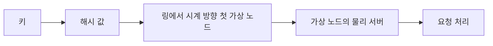

# 일관된 해싱 - 가상 노드 개수와 부하 편차, 링·랑데뷰·점프 해시 비교

캐시 서버나 샤드가 N대일 때 키를 `hash(key) % N`으로 나누면 N이 바뀌는 순간 거의 모든 키의 담당 서버가 바뀐다. 일관된 해싱은 "서버가 하나 늘거나 줄 때 키의 1/N 정도만 옮기자"는 요구에서 나왔다. 개념 설명은 [데이터베이스 샤딩](../DataBase/RDBMS/데이터베이스_샤딩.md)에 있고, 이 문서는 구현해서 돌려 봐야 보이는 부분을 다룬다. 가상 노드를 몇 개 둬야 부하가 고르게 나오는지, 랑데뷰 해시와 점프 해시는 언제 링보다 낫고 언제 못 쓰는지, 그리고 조용히 깨지는 지점이 어디인지다. 수치는 전부 파이썬 3.10에서 키 10만 개로 직접 돌린 결과다.

## 나머지 연산이 얼마나 많이 옮기는가

서버 10대에서 11대로 늘렸을 때 키가 다른 서버로 옮겨 가는 비율이다.

| 방식 | 이동한 키 비율 | 이론값 |
|---|---|---|
| `hash % N` | 90.7% | 약 90.9% (N/(N+1)) |
| 링 (가상 노드 100개) | 8.3% | 9.1% (1/(N+1)) |
| 랑데뷰 해시 | 9.2% | 9.1% |
| 점프 해시 | 9.3% | 9.1% |

나머지 연산은 새 서버가 들어올 때 키의 약 91%가 옮겨 간다. 캐시라면 히트율이 한 순간에 바닥으로 떨어지고 원본 DB가 그 부하를 받는다. 링 방식은 옮겨 간 키가 전부 새 서버 `n10`으로만 갔다는 것도 확인했다. 기존 서버끼리 키를 주고받지 않는다는 뜻이고, 이게 일관된 해싱이 약속하는 성질이다.



## 구현

해시 링은 정렬된 배열과 이진 탐색이면 충분하다. 서버 하나가 `vnodes`개의 점을 링에 찍고, 키는 자기 해시 값 다음에 오는 첫 점의 주인에게 간다.

```python
# ring.py
import bisect, hashlib

def h64(s: str) -> int:
    # 프로세스가 바뀌어도 같은 값이 나와야 한다. 내장 hash()는 안 된다.
    return int.from_bytes(hashlib.md5(s.encode()).digest()[:8], "big")

class Ring:
    def __init__(self, nodes=(), vnodes=100):
        self.vnodes = vnodes
        self.points = []   # 정렬된 해시 값
        self.owner = {}    # 해시 값 -> 물리 서버
        for n in nodes:
            self.add(n)

    def add(self, node):
        for i in range(self.vnodes):
            p = h64(f"{node}#{i}")
            bisect.insort(self.points, p)
            self.owner[p] = node

    def remove(self, node):
        for i in range(self.vnodes):
            p = h64(f"{node}#{i}")
            self.points.remove(p)
            del self.owner[p]

    def get(self, key):
        i = bisect.bisect(self.points, h64(key)) % len(self.points)
        return self.owner[self.points[i]]
```

`% len(self.points)`는 링을 한 바퀴 돌려서 마지막 점 뒤의 키를 첫 점에 붙이는 부분이다. 이걸 빼면 해시가 가장 큰 쪽 키에서 `IndexError`가 난다.

이 구현에는 두 가지 한계가 있다. 서로 다른 점의 해시가 우연히 같으면 `owner`가 덮어써진다. 64비트에서는 사실상 일어나지 않지만 32비트 해시로 줄이면 점이 수만 개일 때 현실적인 문제가 된다. 또 `bisect.insort`는 삽입이 `O(n)`이라 서버를 한 번에 수백 대 올리는 경우에는 모아서 한 번에 정렬하는 편이 낫다.

## 가상 노드는 몇 개가 적당한가

서버마다 링에 점 하나만 찍으면 구간 길이가 제각각이라 부하가 크게 쏠린다. 서버 10대, 키 10만 개로 서버 이름을 바꿔 가며 10번 반복해서 평균을 냈다.

| 서버당 가상 노드 | 최대 부하 / 평균 | 최소 부하 / 평균 | 표준편차 / 평균 |
|---|---|---|---|
| 1 | 2.46 | 0.12 | 0.753 |
| 10 | 1.55 | 0.54 | 0.294 |
| 50 | 1.20 | 0.76 | 0.130 |
| 100 | 1.15 | 0.86 | 0.089 |
| 200 | 1.12 | 0.88 | 0.071 |
| 500 | 1.08 | 0.93 | 0.046 |
| 1000 | 1.06 | 0.94 | 0.034 |

가상 노드가 1개면 제일 바쁜 서버가 평균의 2.5배를 받고 제일 한가한 서버는 평균의 12%만 받는다. 편차는 가상 노드 수의 제곱근에 반비례하는 모양이라서 100개에서 400개로 4배 늘려야 편차가 절반이 된다. 대충 100~200개에서 최대 부하가 평균의 1.1배대로 들어오고, 그 위로는 비용 대비 개선이 작다. 서버를 100대로 늘려 가상 노드 100개로 다시 돌렸을 때(키 20만 개, 3회 평균) 표준편차/평균은 10대일 때와 같은 0.099였다. 편차는 서버 수가 아니라 서버당 가상 노드 수가 정한다. 반면 최대 부하/평균은 1.18에서 1.23으로 조금 올랐다. 서버가 많을수록 그중 가장 운 나쁜 서버가 더 나쁘기 때문이다. 그래서 가장 바쁜 서버를 기준으로 용량을 잡는다면 실제 서버 수로 한 번 돌려 보고 정해야 한다.

가상 노드가 늘어나는 비용은 메모리와 조회 시간이다. 이진 탐색이라 조회는 점 개수의 로그에 비례하고, 서버 1000대 × 100개(점 10만 개)에서도 조회 하나가 5마이크로초 안팎이었다(아래 비교 표). 부담이 되는 쪽은 서버 추가·삭제 때 점을 한꺼번에 갱신하는 일이고 조회가 아니다.

## 서버를 뺄 때 부하가 어디로 가는가

서버 하나(`n3`)를 제거했을 때 그 서버의 키를 누가 넘겨받는지 봤다.

| 서버당 가상 노드 | 키를 넘겨받은 서버 수 | 가장 많이 받은 서버의 비중 |
|---|---|---|
| 1 | 1개 | 100% |
| 100 | 9개 | 20% |

가상 노드가 1개면 죽은 서버의 키 전부가 링에서 바로 다음 서버 한 대에게 간다. 그 서버는 원래 몫에 더해 이웃 서버 몫 전체를 받아 부하가 두 배가 되고, 그러면 같이 죽어서 연쇄로 이어진다. 가상 노드를 100개로 하면 나머지 9대가 고르게 나눠 갖는다(최대 20%). 가상 노드는 균등 분배만이 아니라 장애 시 충격 완화에도 필요하다.

## 서버 용량이 다를 때

용량이 2배인 서버에는 가상 노드를 2배 준다. 100, 100, 200개로 키 10만 개를 돌렸더니 부하 비율이 이렇게 나왔다.

| 서버 | 가상 노드 | 목표 | 실제 |
|---|---|---|---|
| small1 | 100 | 25% | 24.9% |
| small2 | 100 | 25% | 30.0% |
| big | 200 | 50% | 45.1% |

목표 대비 5%p씩 어긋난다. 서버가 3대뿐이라 점 400개로는 부족한 것이다. 가중치를 쓸 때는 가장 작은 서버 기준으로도 가상 노드가 충분히 나오도록(위 표에서 보듯 100~200개) 전체 가중치의 단위를 크게 잡아야 한다. 가중치 1:2를 가상 노드 1:2개로 옮기면 편차만 커진다.

## 링 말고 랑데뷰 해시와 점프 해시

링의 대안이 둘 있다. 이동 비율은 위 표에서 보듯 셋 다 이론값에 가깝다. 차이는 조회 비용과 제약이다.

- **랑데뷰 해시(HRW)**: 키마다 모든 서버에 `hash(서버, 키)`를 매겨 최댓값인 서버를 고른다. 가상 노드가 필요 없고 편차가 자연히 낮다. 대신 조회가 서버 수에 선형이다.
- **점프 해시**: 서버 번호가 `0..N-1`이라는 가정으로 키에서 버킷 번호를 계산한다. 메모리가 0이고 빠르지만 서버를 맨 끝에서만 늘리고 줄일 수 있다([Lamping & Veach, 2014](https://arxiv.org/abs/1406.2294)). 중간 서버가 죽으면 그 자리를 다른 서버로 채워야 한다.

조회 한 번에 걸린 시간(마이크로초, 링은 서버당 가상 노드 100개)이다.

| 서버 수 | 링 | 랑데뷰 | 점프 |
|---|---|---|---|
| 10 | 1.22 | 9.34 | 1.81 |
| 100 | 1.38 | 86.26 | 2.51 |
| 1000 | 4.72 | 1851.64 | 5.98 |

서버 10대에서는 랑데뷰도 10마이크로초 미만이라 가상 노드 튜닝이 필요 없는 쪽이 낫다. 1000대에서는 조회 하나가 1.8밀리초라 호출 경로에 두면 안 된다. 점프 해시는 가장 단순하지만 서버 이름이 아니라 번호로 식별되는 상태 없는 샤드(파티션 번호가 고정된 시스템)에 맞다. 서버가 임의로 죽고 살아나는 캐시 클러스터에는 링이나 랑데뷰를 쓴다.

## 조용히 깨지는 지점

**내장 `hash()`를 쓰면 안 된다.** 파이썬의 문자열 `hash()`는 프로세스를 시작할 때마다 시드가 달라진다. `PYTHONHASHSEED`를 1, 2로 바꿔 `hash('user:1') % 10`을 찍으면 5와 3이 나오고, 시드 없이 두 번 실행해도 5와 7처럼 제각각이다. 클라이언트가 여러 대면 같은 키를 서로 다른 서버로 보내서 캐시가 중복되고 일관성이 깨진다. 테스트는 한 프로세스 안에서 돌리니 통과한다. 위 구현처럼 `hashlib`이나 murmur 같은 고정된 해시를 쓴다.

**클라이언트마다 서버 목록이 다르면 링도 다르다.** 일관된 해싱은 모든 클라이언트가 같은 서버 목록과 같은 가상 노드 규칙을 쓴다는 가정 위에 있다. 서버 추가를 배포 순서에 따라 일부 클라이언트만 먼저 반영하면 그동안 같은 키가 둘로 갈라진다. 서버 목록은 한 곳(설정 저장소)에서 버전과 함께 내려주는 편이 안전하다.

**가상 노드의 이름 규칙은 계약이다.** 위 코드는 `f"{node}#{i}"`로 점을 찍는다. 이 형식을 바꾸면 링 전체가 다시 배치된다. 서버 이름도 마찬가지로 IP를 쓰다가 호스트명으로 바꾸면 사실상 서버 전체를 교체한 것과 같다.

**핫 키는 해결하지 못한다.** 일관된 해싱은 키 개수를 고르게 나누지 트래픽을 고르게 나누지 않는다. 키 하나에 요청이 몰리면 그 키의 담당 서버 한 대가 병목이 된다. 가상 노드를 늘려도 소용없다. 읽기 복제나 로컬 캐시, 키 접미사 분산 같은 별도 대응이 필요하다.

**복제본 배치는 물리 서버를 건너뛰어야 한다.** 복제본을 링에서 "다음 두 점"에 두면 가상 노드가 섞인 링에서는 같은 물리 서버의 점 두 개가 걸릴 수 있다. 복제본은 시계 방향으로 가면서 이미 고른 물리 서버를 건너뛰고 서로 다른 서버를 골라야 한다.

## 언제 쓰고 언제 안 쓰는가

- 서버 수가 거의 안 바뀌고 키를 잃어도 상관없는 곳이라면 `hash % N`도 충분하다. 이동이 문제인 건 서버가 자주 바뀌거나 이동 자체가 비쌀 때(캐시 워밍, 데이터 이전)다.
- 서버 수가 수십 대 이하면 랑데뷰 해시가 구현이 짧고 가상 노드 튜닝이 없다.
- 번호가 고정된 파티션을 늘리기만 한다면 점프 해시다.
- 서버가 수백 대 이상이고 임의로 들락거리면 가상 노드 100~200개의 링이다. 이 개수는 앞의 실험처럼 자기 서버 수로 다시 재 보고 정한다.

Redis Cluster는 이 셋 어느 쪽도 아니고 키를 16384개의 해시 슬롯으로 나눈 뒤 슬롯을 서버에 배정한다. 서버가 바뀌면 키가 아니라 슬롯 단위로 옮긴다. 이동 단위를 키보다 크게 잡아 관리 부담을 줄인 변형으로 볼 수 있다. 정렬된 구조 위에서 확률로 비용을 낮추는 다른 사례는 [스킵 리스트](Skip_List.md)에 있다.
