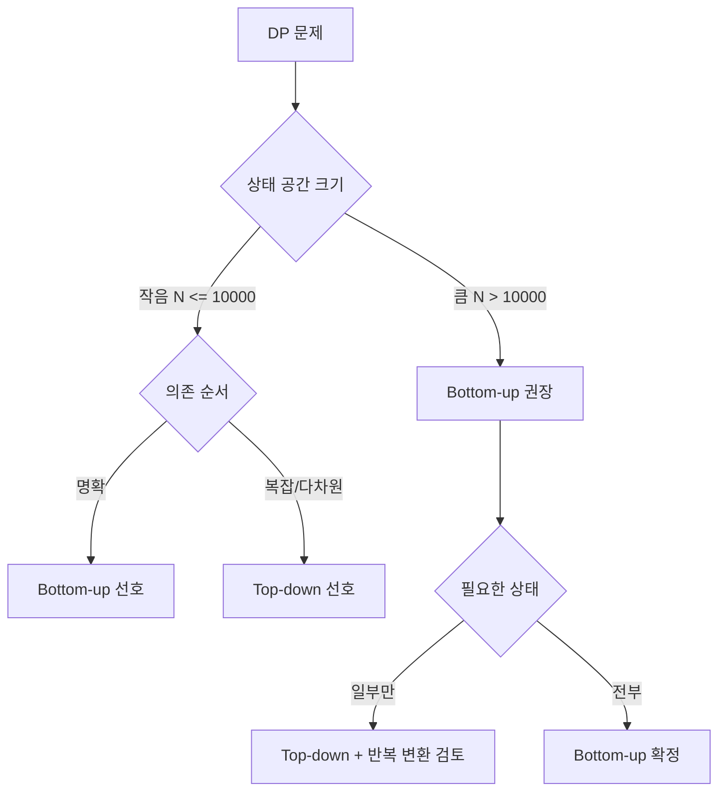

# Dynamic Programming (동적 계획법)

## 들어가며

동적 계획법(DP)은 처음 배울 때 가장 막막한 알고리즘이다. 그리디나 정렬은 직관이 통하는데 DP는 "점화식 세우기" 자체가 일종의 사고 훈련이라서, 코드보다 머릿속에서 문제를 어떻게 쪼개느냐가 전부다. 점화식만 나오면 코드는 10줄 안에 끝나는데, 그 점화식이 안 나와서 1시간씩 막힌다.

실무에서 DP를 직접 짜는 일은 많지 않다. 그러나 캐싱, 비용 함수 최적화, 빌링 시스템의 누적 계산, 추천 시스템의 경로 탐색 같은 곳에서 DP의 사고방식이 그대로 쓰인다. "이전 상태를 저장해서 재계산을 피한다"는 발상은 결국 모든 캐시의 본질이다. 코딩테스트에서도 단골이고, 면접에서 LIS나 편집 거리 같은 문제는 거의 무조건 한 번은 나온다.

DP는 두 가지 성질이 동시에 만족되는 문제에만 적용된다. 첫째는 최적 부분 구조(optimal substructure)다. 큰 문제의 최적해가 작은 부분 문제의 최적해로 만들어져야 한다. 둘째는 중복되는 부분 문제(overlapping subproblems)다. 같은 부분 문제가 여러 번 등장해야 메모이제이션의 의미가 있다. 이 두 가지가 안 되면 DP가 아니라 다른 접근법을 찾아야 한다.

## DP의 두 가지 구현 방식

### Top-down (메모이제이션)

재귀로 문제를 풀되, 한 번 계산한 값은 저장해두고 다시 호출되면 즉시 반환한다. 사람이 문제를 쪼개는 방식 그대로 코드가 되니까 처음 DP를 익힐 때 직관적이다.

```java
private Map<Integer, Long> memo = new HashMap<>();

public long fib(int n) {
    if (n <= 1) return n;
    if (memo.containsKey(n)) return memo.get(n);

    long result = fib(n - 1) + fib(n - 2);
    memo.put(n, result);
    return result;
}
```

장점은 코드가 직관적이고, 필요한 부분 문제만 계산한다는 점이다. 전체 상태 공간 중 일부만 쓰는 문제(가지치기가 가능한 문제)에서는 Top-down이 Bottom-up보다 빠를 수 있다.

단점도 명확하다. 재귀 호출 스택이 깊어지면 StackOverflowError가 난다. Java 기본 스택 크기로는 N이 1만 넘어가도 위험하다. 그리고 함수 호출 오버헤드가 있어서 같은 횟수 연산이라면 반복문보다 느리다.

### Bottom-up (타뷸레이션)

작은 문제부터 차례로 풀어 올라가면서 배열에 채워나간다. 점화식의 의존 관계를 보고 어떤 순서로 채울지만 정하면 된다.

```java
public long fib(int n) {
    if (n <= 1) return n;

    long[] dp = new long[n + 1];
    dp[0] = 0;
    dp[1] = 1;

    for (int i = 2; i <= n; i++) {
        dp[i] = dp[i - 1] + dp[i - 2];
    }
    return dp[n];
}
```

스택 오버플로우 걱정이 없고, 함수 호출 오버헤드도 없어서 빠르다. 메모리 최적화도 Bottom-up에서 더 쉽게 적용된다(뒤에서 다룬다).

단점은 모든 부분 문제를 다 계산한다는 점이다. 실제로 필요 없는 상태까지 채우니까 가지치기가 안 된다. 그리고 의존 순서를 직접 정해야 해서 점화식이 복잡해지면 헷갈린다.

### 어느 쪽을 쓸 것인가

실무 기준은 단순하다. 상태 공간이 작고 순서가 명확하면 Bottom-up, 상태 공간이 크지만 일부만 도달 가능하거나 차원이 복잡해서 의존 순서가 헷갈리면 Top-down. N이 10만을 넘는다면 Top-down은 재귀 깊이 때문에 위험하니 Bottom-up이 안전하다.



## 상태 정의와 점화식

DP의 90%는 상태 정의에서 갈린다. 점화식 자체는 상태가 정해지면 거의 자동으로 나온다.

### 상태를 정의하는 법

상태는 "지금까지 어디까지 왔는지"를 나타내는 최소한의 정보다. 상태가 같으면 답이 같아야 한다는 게 핵심이다. 상태에 빠진 정보가 있으면 같은 상태에서 다른 답이 나오니까 메모이제이션이 깨진다.

예를 들어 "i번째 인덱스까지 봤을 때 최대 합"이라는 상태가 있다고 하자. 만약 "i번째를 선택했는지 여부"가 다음 결정에 영향을 준다면, 상태에 그 정보를 추가해야 한다. `dp[i][0]`은 i를 선택 안 한 경우, `dp[i][1]`은 선택한 경우 같은 식이다.

상태 차원을 늘릴수록 풀 수 있는 문제가 늘어나지만 메모리와 시간이 폭발한다. 차원을 하나라도 줄일 방법이 있는지 항상 고민해야 한다. "이 정보를 상태에서 빼도 답이 같이 나오는가?"를 자문해보면 된다.

### 점화식 세우기

점화식은 "상태 X의 답을 더 작은 상태들의 답으로 어떻게 표현할 것인가"다. 두 가지 관점이 있다.

**Pull 방식**: 현재 상태 `dp[i]`를 채우기 위해 이전 상태들에서 값을 가져온다. `dp[i] = max(dp[i-1], dp[i-2] + a[i])` 같은 형태다. Bottom-up에서 자연스럽다.

**Push 방식**: 현재 상태 `dp[i]`에서 다음 상태들로 값을 전파한다. `dp[i+1] = max(dp[i+1], dp[i] + a[i+1])` 같은 형태다. 다음 상태가 여러 개일 때 깔끔하다.

같은 문제를 두 방식 모두로 쓸 수 있는데, 어느 쪽이 코드가 짧아지는지는 문제마다 다르다. 점화식이 안 떠오르면 두 방식을 다 시도해본다.

## 실무 예제

### LIS (최장 증가 부분 수열)

수열에서 순서를 유지하면서 고른 원소들이 증가하는, 가장 긴 부분 수열의 길이를 찾는다. O(N²) DP가 기본이고, O(N log N)으로 줄이는 트릭이 있다.

```java
public int lisN2(int[] arr) {
    int n = arr.length;
    int[] dp = new int[n];
    int max = 0;

    for (int i = 0; i < n; i++) {
        dp[i] = 1;
        for (int j = 0; j < i; j++) {
            if (arr[j] < arr[i]) {
                dp[i] = Math.max(dp[i], dp[j] + 1);
            }
        }
        max = Math.max(max, dp[i]);
    }
    return max;
}
```

`dp[i]`는 "i번째로 끝나는 LIS의 길이"다. 이 상태 정의가 핵심이다. 단순히 "i번째까지 봤을 때 LIS의 길이"로 정의하면 다음 원소를 봤을 때 어떤 원소 뒤에 붙일 수 있는지 모르니까 점화식이 안 선다.

N이 10만 이상이면 O(N²)이 안 돌아간다. 이 때는 이진 탐색을 섞어 O(N log N)으로 만든다.

```java
public int lisNlogN(int[] arr) {
    List<Integer> tails = new ArrayList<>();
    for (int x : arr) {
        int idx = lowerBound(tails, x);
        if (idx == tails.size()) {
            tails.add(x);
        } else {
            tails.set(idx, x);
        }
    }
    return tails.size();
}
```

`tails[i]`는 "길이 i+1짜리 증가 수열의 끝값 중 가장 작은 값"이다. 이 배열의 길이가 곧 LIS 길이다. 주의할 점은 `tails` 배열 자체는 실제 LIS가 아니라는 거다. LIS의 "길이"만 나오고, 실제 수열을 복원하려면 별도로 추적 인덱스를 저장해야 한다.

### LCS (최장 공통 부분 수열)

두 문자열에서 공통으로 등장하는 가장 긴 부분 수열을 찾는다. 편집 거리, diff 도구, DNA 서열 비교 같은 곳에서 쓰인다.

```java
public int lcs(String a, String b) {
    int n = a.length(), m = b.length();
    int[][] dp = new int[n + 1][m + 1];

    for (int i = 1; i <= n; i++) {
        for (int j = 1; j <= m; j++) {
            if (a.charAt(i - 1) == b.charAt(j - 1)) {
                dp[i][j] = dp[i - 1][j - 1] + 1;
            } else {
                dp[i][j] = Math.max(dp[i - 1][j], dp[i][j - 1]);
            }
        }
    }
    return dp[n][m];
}
```

`dp[i][j]`는 "a의 첫 i글자와 b의 첫 j글자의 LCS 길이"다. 두 문자가 같으면 둘 다 LCS에 포함시키고, 다르면 둘 중 하나를 빼는 두 경우의 최댓값을 취한다.

문자열 두 개의 길이가 모두 1만이면 `dp` 배열이 1억 칸이라 메모리가 400MB쯤 든다. 이 경우 메모리 최적화가 필수다.

### 0-1 배낭 문제

무게와 가치가 있는 N개 물건에서, 무게 합 W 이하로 골라 가치 합을 최대화한다. 한 물건은 한 번만 담을 수 있다.

```java
public int knapsack(int[] weights, int[] values, int W) {
    int n = weights.length;
    int[][] dp = new int[n + 1][W + 1];

    for (int i = 1; i <= n; i++) {
        for (int w = 0; w <= W; w++) {
            dp[i][w] = dp[i - 1][w];
            if (w >= weights[i - 1]) {
                dp[i][w] = Math.max(dp[i][w],
                                    dp[i - 1][w - weights[i - 1]] + values[i - 1]);
            }
        }
    }
    return dp[n][W];
}
```

`dp[i][w]`는 "처음 i개 물건만 고려해서 무게 w 이하로 담을 때 최대 가치"다. i번째 물건을 안 담으면 `dp[i-1][w]`, 담으면 `dp[i-1][w-weight[i]] + value[i]`다.

W가 100만이고 N도 1000이면 dp 배열이 10억 칸이다. 이런 경우 W가 너무 크면 DP가 안 통하고, 분기 한정법이나 근사 알고리즘으로 가야 한다. DP가 통하는 조건은 W가 적당히 작을 때(보통 100만 이하)다.

흔한 실수는 무게가 실수(float)로 주어지는 경우다. DP는 인덱스가 정수여야 하니까 W가 실수면 그대로 못 쓴다. 적당한 단위로 정수화하거나 다른 알고리즘을 찾아야 한다.

### 편집 거리 (Levenshtein Distance)

두 문자열을 같게 만들기 위한 최소 연산 횟수다. 삽입, 삭제, 교체 세 가지 연산을 쓴다. 자동완성, 맞춤법 검사, 검색 엔진의 오타 보정에 쓰인다.

```java
public int editDistance(String a, String b) {
    int n = a.length(), m = b.length();
    int[][] dp = new int[n + 1][m + 1];

    for (int i = 0; i <= n; i++) dp[i][0] = i;
    for (int j = 0; j <= m; j++) dp[0][j] = j;

    for (int i = 1; i <= n; i++) {
        for (int j = 1; j <= m; j++) {
            if (a.charAt(i - 1) == b.charAt(j - 1)) {
                dp[i][j] = dp[i - 1][j - 1];
            } else {
                dp[i][j] = 1 + Math.min(dp[i - 1][j - 1],
                                Math.min(dp[i - 1][j], dp[i][j - 1]));
            }
        }
    }
    return dp[n][m];
}
```

세 가지 연산이 각각 다른 칸을 참조한다. 교체는 `dp[i-1][j-1]`, 삭제는 `dp[i-1][j]`, 삽입은 `dp[i][j-1]`이다. 초기값으로 `dp[i][0] = i`, `dp[0][j] = j`를 줘야 빈 문자열로 만드는 비용이 정의된다.

실무에서는 연산 비용을 다르게 두는 변형을 자주 쓴다. 예를 들어 키보드 자판에서 가까운 키 교체는 비용을 낮게 주는 식이다. 점화식의 +1 부분에 비용 함수를 끼워 넣으면 된다.

## 메모리 최적화: 슬라이딩 윈도우

DP의 의존 관계가 직전 한두 행만 본다면, 전체 배열을 들고 있을 필요가 없다. 두 행만 번갈아 쓰거나, 1차원 배열로 줄일 수 있다.

### 2차원 → 1차원

LCS나 0-1 배낭 같은 문제는 `dp[i][j]`가 `dp[i-1][...]`만 참조한다. 1차원 배열로 줄이되 갱신 순서를 잘 잡으면 된다.

```java
public int knapsack1D(int[] weights, int[] values, int W) {
    int[] dp = new int[W + 1];

    for (int i = 0; i < weights.length; i++) {
        for (int w = W; w >= weights[i]; w--) {
            dp[w] = Math.max(dp[w], dp[w - weights[i]] + values[i]);
        }
    }
    return dp[W];
}
```

내부 반복문을 W부터 거꾸로 돈다는 게 핵심이다. 정방향으로 돌리면 같은 물건을 여러 번 담은 결과가 섞여서 답이 틀린다. 이건 0-1 배낭과 무한 배낭(unbounded knapsack)을 구분하는 트릭이기도 하다. 무한 배낭은 정방향으로 돌린다.

### 두 행만 유지하기

상태가 i와 i-1을 모두 참조해야 하는 경우 1차원으로는 부족하다. 두 행만 들고 번갈아 쓰면 메모리는 O(M)이다.

```java
public int lcsTwoRows(String a, String b) {
    int n = a.length(), m = b.length();
    int[] prev = new int[m + 1];
    int[] curr = new int[m + 1];

    for (int i = 1; i <= n; i++) {
        for (int j = 1; j <= m; j++) {
            if (a.charAt(i - 1) == b.charAt(j - 1)) {
                curr[j] = prev[j - 1] + 1;
            } else {
                curr[j] = Math.max(prev[j], curr[j - 1]);
            }
        }
        int[] tmp = prev;
        prev = curr;
        curr = tmp;
        Arrays.fill(curr, 0);
    }
    return prev[m];
}
```

주의할 점은 메모리 최적화를 하면 "역추적"이 어려워진다는 거다. LCS의 길이만 필요하면 1차원으로 충분하지만, 실제 LCS 문자열을 복원하려면 전체 dp 테이블이 있어야 한다. 메모리를 줄이는 대신 답의 형태가 제한된다.

## DP와 재귀의 성능 차이

피보나치를 메모 없는 재귀로 짜면 O(2^N), 메모이제이션을 붙이면 O(N)이다. N=40이면 메모 없는 재귀는 십 분 가까이 걸리는데 메모를 붙이면 1ms 안에 끝난다. 차이는 호출 횟수에 있다.

```
fib(5)
├─ fib(4)
│  ├─ fib(3)
│  │  ├─ fib(2)
│  │  └─ fib(1)
│  └─ fib(2)  ← 다시 계산
└─ fib(3)     ← 다시 계산
   ├─ fib(2)  ← 또 계산
   └─ fib(1)
```

같은 부분 문제가 지수적으로 반복된다. 메모이제이션은 한 번 계산한 결과를 저장해서 이 중복을 다 잘라낸다. 이게 DP의 본질이다.

다만 모든 재귀가 DP가 되는 건 아니다. 부분 문제가 겹치지 않으면 메모이제이션의 효과가 없다. 예를 들어 트리 순회는 각 노드를 정확히 한 번만 방문하니까 메모를 붙여도 의미가 없다. DP가 통하는지 확인하는 가장 간단한 방법은 "같은 인자로 함수가 두 번 이상 호출되는가"다.

## DP vs 그리디: 언제 그리디로 가야 하는가

DP는 모든 부분해를 다 계산해서 최적을 보장한다. 그리디는 매 순간 가장 좋아 보이는 선택을 한다. 그리디가 통하면 DP보다 압도적으로 빠르고 메모리도 안 쓴다. 문제는 그리디가 통하는지 판단하는 게 어렵다는 점이다.

그리디로 가도 되는 신호는 다음과 같다.

**교환 논증(exchange argument)이 성립한다**: 어떤 그리디 선택과 다른 선택을 비교했을 때, 그리디 쪽이 항상 같거나 더 좋다는 걸 증명할 수 있으면 그리디다. 예를 들어 회의실 배정 문제에서 "끝나는 시간이 빠른 회의를 먼저 선택"이 항상 최적이다.

**Matroid 구조를 가진다**: 추상 수학 개념이지만 실용적으로는 "지금 선택이 미래 선택을 제약하지 않거나, 제약하더라도 항상 더 유리한 방향으로 제약한다"는 의미다. 최소 신장 트리가 대표적이다.

**무게나 비용에 단조성이 있다**: 활동 선택, 동전 거스름돈(특정 화폐 시스템에서) 같은 문제는 그리디로 풀린다.

반대로 그리디가 안 되는 신호는 이렇다. 0-1 배낭 문제는 "가치/무게 비율이 높은 것부터" 그리디로 가면 틀린다. 반례가 쉽게 나온다. 무게 10인 그릇에 (가치 6, 무게 5), (가치 6, 무게 5), (가치 10, 무게 6)이 있으면 비율은 마지막이 가장 좋지만 답은 앞의 둘을 담는 거다.

판단 기준은 단순하다. 그리디 풀이를 짠 뒤 반례를 30분 동안 못 찾으면 그리디로 간다. 반례가 하나라도 나오면 DP로 간다. 면접이나 시험이면 안전하게 DP로 가되, 그리디 가능성을 미리 검토해야 시간 안에 풀 수 있다.

코딩테스트에서 흔한 함정은 "동전 거스름돈"이다. 한국 화폐(500, 100, 50, 10, 5, 1)는 그리디가 통하지만, 임의 화폐 시스템(예: 1, 4, 6)은 그리디가 틀린다. 8원을 만들 때 그리디는 6+1+1=3개지만 최적은 4+4=2개다. 화폐 단위가 임의로 주어지면 무조건 DP로 가야 한다.

## 자주 하는 실수

상태 정의에 정보를 빠뜨리는 게 가장 흔하다. "현재까지의 최댓값"만으로 점화식이 안 서면 "마지막에 뭘 선택했는지"를 차원에 추가해야 한다. 이걸 놓치고 1차원으로 풀려다 막히는 경우가 많다.

초기값 설정도 자주 틀린다. 편집 거리에서 `dp[i][0] = i`를 안 채우면 답이 0으로 나온다. Top-down에서는 base case가 누락되고, Bottom-up에서는 0번째 행/열이 비어 있다. dp 배열을 0으로 초기화한 채 시작했는데 그게 의미 있는 답이 아니라면 명시적으로 채워야 한다.

배열 인덱스 off-by-one 실수도 잦다. 문자열이나 수열 DP에서 1-based 인덱싱(`dp[1..n]`)이 코드는 깔끔한데 입력 인덱스(`a.charAt(i-1)`)와 자꾸 어긋난다. 한 번 정한 컨벤션을 끝까지 지키는 게 중요하다.

마지막으로 "DP인 줄 알았는데 그리디"인 경우와 "그리디인 줄 알았는데 DP"인 경우가 있다. 시간이 부족할 때는 DP로 안전하게 가되, 통과 못 하면 그리디로 다시 짠다. 반대로 시간이 충분하면 그리디 반례를 찾아본 뒤 안 나오면 그리디로 간다. 둘 다 익숙해져야 한다.
